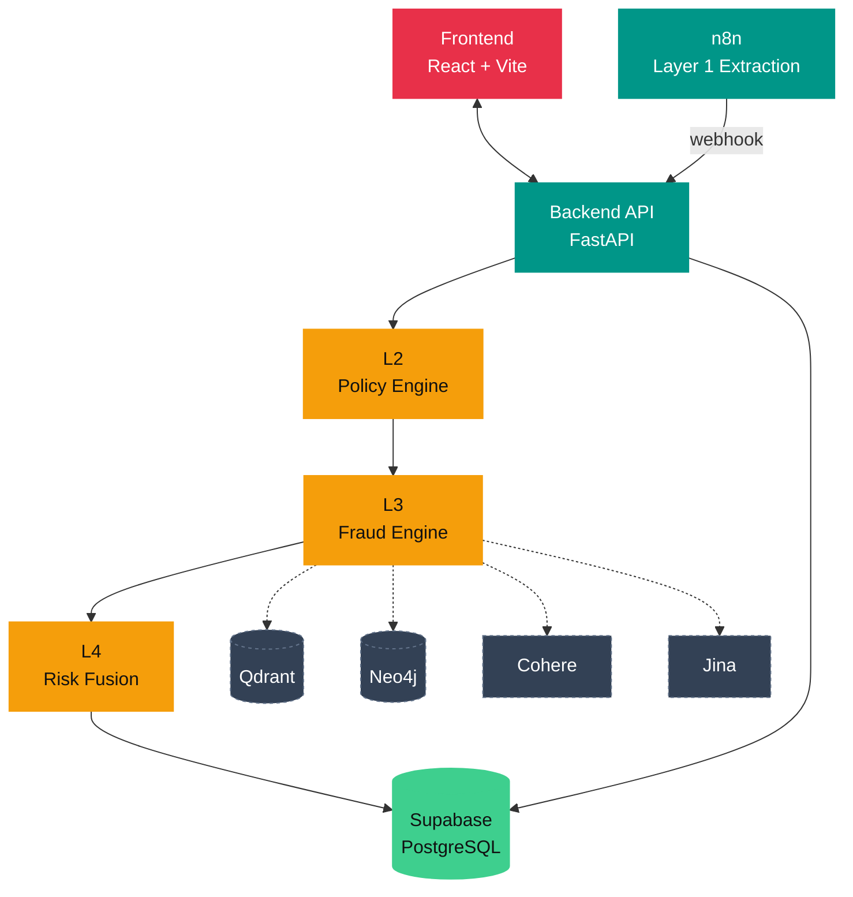
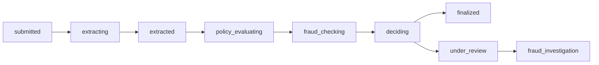

<p align="center">
  
</p>

<h1 align="center">Lexora</h1>
<p align="center">Intelligent Insurance Claims Processing Engine</p>

<p align="center">
  <a href="https://github.com/kr1shnasomani/lexora/actions/workflows/ci.yml">
    
  </a>
  <a href="https://github.com/kr1shnasomani/lexora/releases/latest">
    
  </a>
  <a href="https://github.com/kr1shnasomani/lexora/pkgs/container/lexora">
    
  </a>
</p>

<p align="center">
  
  
  
  
  
  
  
  
</p>

---

Lexora is an end-to-end AI-powered insurance claims platform. It automates the full claim lifecycle, from document upload through fraud detection to final decision, and surfaces results to both admin underwriters and policyholders through a live React dashboard.

---

## Architecture



| Layer | Component | Description |
|-------|-----------|-------------|
| **L1** | n8n Extraction | Multi-format AI extraction (image, PDF, audio, video) |
| **L2** | Policy Engine | Deterministic rule evaluation against versioned policy rules |
| **L3** | Fraud Engine | 3-tier: duplicate check, vector similarity, graph analysis |
| **L4** | Risk Fusion | Expected loss model with threshold-based decision routing |

---

## Quick Start

> **Prerequisite:** [Docker Desktop](https://www.docker.com/products/docker-desktop/). Nothing else needed.

### 1. Clone and configure

```bash
git clone https://github.com/kr1shnasomani/lexora.git
cd lexora
cp .env.example .env
```

Open `.env` and fill in the minimum required keys:

```env
SUPABASE_URL=https://your-project-ref.supabase.co
SUPABASE_SERVICE_KEY=your_service_role_key
SUPABASE_ANON_KEY=your_anon_key
GROQ_API_KEY=your_groq_key
```

All other keys are optional. The fraud engine is fail-open and works without them.

### 2. Set up the database

1. Go to **Supabase → SQL Editor**
2. Run `database/schema.sql` to create all tables, enums, and RLS policies
3. Run `database/seed.sql` to insert demo users, policies, and sample claims

### 3. Start everything

```bash
docker compose up --build
```

That's it. Docker Desktop pulls, builds, and wires up all services automatically.

| Service | URL |
|---------|-----|
| **Frontend** | http://localhost:3001 |
| **Backend API** | http://localhost:8000 |
| **API Docs** | http://localhost:8000/docs |
| **n8n** | http://localhost:5678 |

> **Stop:** `docker compose down`  
> **Stop + remove volumes:** `docker compose down --volumes`

---

## Individual Services

You can start any service in isolation:

```bash
docker compose up backend          # FastAPI backend only
docker compose up frontend         # nginx + React frontend only
docker compose up n8n              # n8n workflow engine only
```

---

## Development Mode (Hot-Reload)

For active development with live code reload:

```bash
docker compose --profile dev up --build
```

This mounts the `backend/` source directory into the container and runs uvicorn with `--reload`. Frontend changes still require a rebuild (`docker compose up frontend --build`).

---

## Pull from GHCR

The backend image is published to GitHub Container Registry:

```bash
docker pull ghcr.io/kr1shnasomani/lexora:latest
# Or a specific version:
docker pull ghcr.io/kr1shnasomani/lexora:v1.0.0
```

---

## Project Structure

```
lexora/
├── backend/
│   ├── Dockerfile              # Multi-stage production image
│   ├── main.py                 # FastAPI entry point
│   ├── config.py               # Pydantic settings (reads .env)
│   ├── database.py             # Supabase client singleton
│   ├── models.py               # Pydantic request/response schemas
│   ├── state_machine.py        # Claim lifecycle state validation
│   ├── requirements.txt        # Pinned Python dependencies
│   ├── routes/                 # claims, customer, dashboard, chat, webhooks
│   ├── engines/                # policy_engine, fraud_engine, risk_fusion
│   └── services/audit.py       # Append-only audit event logger
├── frontend/
│   ├── Dockerfile              # Multi-stage build → nginx
│   ├── vite.config.js          # Dev proxy: /api → http://127.0.0.1:8000
│   ├── tailwind.config.js      # Design system theme
│   └── src/
│       ├── contexts/           # AuthContext
│       ├── hooks/               # useFetch (polling hook)
│       └── pages/
│           ├── admin/          # Dashboard, Claims, Analytics, ThreatFeed
│           └── customer/       # Portal, Policies, Claims, Renewal
├── database/
│   ├── schema.sql              # Tables, enums, RLS policies
│   └── seed.sql                # Demo users, policies, claims
├── n8n/
│   └── n8n-workflow.json       # Pre-built Lexora extraction workflow
├── tests/                      # Integration tests per layer
├── docs/                       # Architecture docs + AI agent context
├── docker-compose.yml          # Full stack orchestration
└── .env.example                # Environment variable template
```

---

## Demo Accounts

Enter any email below with any **6-digit OTP** to log in (mock auth).

| Role | Email |
|------|-------|
| Admin | `vikram.singh@insurer.com` |
| Underwriter | `ananya.rao@insurer.com` |
| Customer | `rahul.mehta@gmail.com` |
| Customer | `priya.s@gmail.com` |

---

## Environment Variables

### Backend (`.env` in project root)

| Variable | Required | Description |
|----------|----------|-------------|
| `SUPABASE_URL` | ✅ | Supabase project URL |
| `SUPABASE_SERVICE_KEY` | ✅ | Service role key (full DB access) |
| `SUPABASE_ANON_KEY` | ✅ | Anon key (public read) |
| `GROQ_API_KEY` | ✅ | Chat assistant + audio transcription |
| `BACKEND_PORT` | optional | Host port for backend (default: `8000`) |
| `COHERE_API_KEY` | optional | L3 Tier 2 text embeddings |
| `QDRANT_URL` / `QDRANT_API_KEY` | optional | L3 Tier 2 vector store |
| `NEO4J_URI` / `NEO4J_USER` / `NEO4J_PASSWORD` | optional | L3 Tier 3 graph analysis |
| `JINA_API_KEY` | optional | L3 multimodal doc embeddings |
| `FRAUD_LAYER3_ENABLE_QDRANT` | optional | `true`/`false` (default `false`) |
| `FRAUD_LAYER3_ENABLE_NEO4J` | optional | `true`/`false` (default `false`) |

> `VITE_API_URL` and `CORS_ORIGINS` are set automatically by `docker-compose.yml`, so you do not need to set them in `.env` for Docker deployments.

---

## API Reference

Interactive docs at **http://localhost:8000/docs**

| Method | Endpoint | Description |
|--------|----------|-------------|
| `GET` | `/api/claims` | List all claims (`?status=` filter) |
| `GET` | `/api/claims/{id}` | Claim detail + audit trail + documents |
| `POST` | `/api/claims` | Create a new claim |
| `POST` | `/api/claims/{id}/run-all` | Full pipeline (L2 → L3 → L4) |
| `POST` | `/api/claims/{id}/run-policy` | Policy engine only |
| `POST` | `/api/claims/{id}/run-fraud` | Fraud engine only |
| `POST` | `/api/claims/{id}/decide` | Decision engine only |
| `POST` | `/api/claims/{id}/manual-review` | Human override |
| `GET` | `/api/dashboard/summary` | Admin KPIs, queue, alerts, fraud hotspots |
| `GET` | `/api/customer/policies` | Customer policies (`?email=`) |
| `POST` | `/api/chat` | AI chat assistant |
| `POST` | `/api/webhooks/n8n-extraction` | n8n callback endpoint |

---

## Claim State Machine



---

## CI / CD

| Workflow | Trigger | Purpose |
|----------|---------|---------|
| `ci.yml` | Push / PR → `main`, `develop` | **Orchestrator**: calls all check workflows as a gate |
| `cd.yml` | Push → `main` | **Orchestrator**: CI gate → triggers Docker publish |
| `lint-backend.yml` | Backend file changes | Ruff linting on `backend/` |
| `test-backend.yml` | Backend / test changes | Layer 2 unit tests inside Docker container |
| `build-frontend.yml` | Frontend file changes | Vite production build + artifact upload |
| `docker-build.yml` | PRs touching Docker files | Build-check both images (no push) |
| `docker-publish.yml` | Push → `main` | Build + push `ghcr.io/kr1shnasomani/lexora` |
| `release.yml` | Push tag `v*` / manual | Versioned image push → GitHub Release with assets |
| `dependabot.yml` | Weekly (Monday) | Automated dependency PRs for pip, npm, Actions |

Images are published to `ghcr.io/kr1shnasomani/lexora`. No secrets needed for CI, since CD/Release uses the auto-provided `GITHUB_TOKEN`.

**Run tests locally (via Docker):**

```bash
# Layer 2 (no external services needed)
docker compose run --rm backend python tests/test_layer2.py

# Layer 3 (requires live Supabase + backend on :8000)
python tests/test_layer3.py

# Layer 4 (requires live Supabase)
python tests/test_layer4.py
```

---

## Key Design Decisions

| Decision | Reason |
|----------|--------|
| Docker-first deployment | One command starts the full stack, no local Python/Node setup required |
| Multi-stage Dockerfiles | Small production images; builder installs deps, runner just copies them |
| Backend owns all state transitions | n8n sends data via webhook; backend manages lifecycle |
| Audit events are append-only | Every stage logs start/complete/fail for full traceability |
| Policy rules stored in DB | Versioned JSON DSL, no hardcoded logic in code |
| Fraud engine is fail-open | If Qdrant/Neo4j/Jina are offline, Tier 1 result is used |
| Expected loss model for decisions | `fraud_score × claimed_amount` vs investigation cost |

---

## Production Deployment

Lexora splits cleanly across two hosts:

| Component | Recommended host | Why |
|-----------|-------------------|-----|
| Backend (FastAPI) | [Render](https://render.com) Web Service, Docker runtime | Runs `backend/Dockerfile` as a persistent container, needed because the backend runs an in-process background task (claim sweeper) that requires an always-on process |
| Frontend (Vite/React) | [Vercel](https://vercel.com) | Static build, zero config beyond `VITE_API_URL` |

Notes if you deploy this yourself:
- Set Root Directory to `backend` on Render (Docker auto-detects the Dockerfile); leave Build/Start Command blank, the Dockerfile handles both.
- Set `VITE_API_URL` on Vercel to the Render backend's public URL. It's baked in at build time, so changing it requires a redeploy.
- Set `CORS_ORIGINS` on Render to the exact Vercel domain(s) once known.
- n8n (Layer 1) has no managed host configured by default; either self-host it or point `N8N_WEBHOOK_URL` at a hosted n8n instance. Until then, claim upload/extraction won't work, but the rest of the app is unaffected.

---

## Troubleshooting

| Problem | Fix |
|---------|-----|
| Port 80 already in use | Set `FRONTEND_PORT=8080` in `.env` and update compose port mapping |
| Backend not healthy | Check `docker compose logs backend`, usually a missing env var |
| `grpcio` build takes forever | Rebuild: the multi-stage Dockerfile installs from a binary wheel |
| Map not showing in Threat Feed | Ensure the backend is running; the map pulls from `/api/dashboard/summary` |
| Frontend CORS errors | Restart compose; `CORS_ORIGINS` is set automatically by docker-compose |
