# Project Context

This document contains the latest context of the entire project, intended for use with Large Language Models.

## Directory Structure

```text
    README.md
    check_claims.py
    claims.json
    docker-compose.yml
    n8n-workflow.json
backend/
    config.py
    database.py
    main.py
    models.py
    state_machine.py
    test_layer2_eval.py
    test_layer3_pass2_realdata.py
    test_layer3_realdata.py
    test_layer4.py
    engines/
        __init__.py
        fraud_engine.py
        risk_fusion.py
        layer2/
            __init__.py
            policy_engine.py
            rule_registry.py
            test_policy_engine.py
        layer3/
            __init__.py
            canonical.py
            config.py
            diagnostics.py
            embeddings.py
            fusion.py
            main.py
            neo4j_client.py
            qdrant_client.py
            storage.py
            tier1.py
            tier2.py
            tier3.py
        layer5/
    routes/
        __init__.py
        auth.py
        claims.py
        config.py
        customer.py
        dashboard.py
        network.py
        pdf_export.py
        webhooks.py
    scripts/
        run_layer2_batch.py
        run_layer3_batch.py
    services/
        __init__.py
        audit.py
database/
    schema.sql
    seed.sql
    data/
docs/
    API.md
    CONTEXT.md
    CONTEXT2.md
    FULL_API_DOCUMENTATION.md
    LAYER1_README.md
    LAYER2_README.md
    LAYER3_README.md
    LAYER4_README.md
    LLM_PROJECT_CONTEXT.md
    Layer3_implementation.md
    SCHEMA.md
    SOLUTION.md
frontend/
    customer.html
    index.html
    package.json
    postcss.config.js
    tailwind.config.js
    vite.config.js
    src/
        App.jsx
        index.css
        main.jsx
        components/
            admin/
                Sidebar.jsx
                TopHeader.jsx
            customer/
                BottomNav.jsx
                Header.jsx
            shared/
                ErrorToast.jsx
                ProtectedRoute.jsx
                Skeleton.jsx
        contexts/
            AuthContext.jsx
        hooks/
            useFetch.js
        lib/
            api.js
            supabase.js
        pages/
            LoginPage.jsx
            ModeSelectionPage.jsx
            admin/
                AnalyticsPage.jsx
                AuditLogPage.jsx
                ClaimsQueuePage.jsx
                ConfigPage.jsx
                DashboardPage.jsx
                NetworkGraphPage.jsx
                ThreatFeedPage.jsx
            customer/
                ChatPage.jsx
                ClaimResultPage.jsx
                ClaimStatus.jsx
                ClaimsPage.jsx
                DocsPage.jsx
                ExplorePage.jsx
                FileClaimPage.jsx
                HomePage.jsx
                NotificationsPage.jsx
                PoliciesPage.jsx
                PolicyDetailPage.jsx
                ProfilePage.jsx
                RenewalPage.jsx
                SecurityPage.jsx
```

## File Contents

### `README.md`

```markdown
# 🏥 Lexora — Intelligent Insurance Claims Processing Engine

> End-to-end AI-powered insurance claims processing system with multi-tier fraud detection, policy engine, and risk fusion decision-making.

---

## 🏗️ Architecture

```
┌──────────┐    ┌────────────┐    ┌──────────────┐    ┌──────────┐
│ Frontend │───▶│  Backend   │───▶│  Supabase DB │    │   n8n    │
│ (React)  │    │  (FastAPI) │    │  (PostgreSQL)│    │ Layer 1  │
└──────────┘    └────────────┘    └──────────────┘    └────┬─────┘
                     │                                      │
              ┌──────┼──────┐                               │
              ▼      ▼      ▼                               │
         ┌────────┐┌──────┐┌──────┐            Webhook ────▶│
         │ Policy ││Fraud ││Risk  │
         │ Engine ││Engine││Fusion│
         │  (L2)  ││ (L3) ││ (L4) │
         └────────┘└──────┘└──────┘
```

### Processing Pipeline

| Layer | Component | Description |
|-------|-----------|-------------|
| **L1** | n8n Extraction | Multi-format AI extraction (image, PDF, audio, video) |
| **L2** | Policy Engine | Deterministic rule evaluation against versioned policy rules |
| **L3** | Fraud Engine | 3-tier: duplicate check, similarity analysis, graph analysis |
| **L4** | Risk Fusion | Expected loss model with threshold-based decision routing |

---

## 📁 Project Structure

```
lexora2/
├── database/
│   ├── schema.sql          # Full Supabase schema (9 tables, 6 enums)
│   └── seed.sql            # Sample data for demo
├── backend/
│   ├── main.py             # FastAPI application
│   ├── config.py           # Environment-based config
│   ├── database.py         # Supabase client
│   ├── models.py           # Pydantic schemas
│   ├── state_machine.py    # Claim lifecycle enforcement
│   ├── requirements.txt
│   ├── Dockerfile
│   ├── routes/
│   │   ├── claims.py       # All claim endpoints
│   │   └── webhooks.py     # n8n webhook receiver
│   ├── engines/
│   │   ├── policy_engine.py   # Layer 2
│   │   ├── fraud_engine.py    # Layer 3 (3-tier)
│   │   └── risk_fusion.py     # Layer 4
│   └── services/
│       └── audit.py        # Audit logging
├── frontend/
│   ├── index.html
│   ├── package.json
│   ├── vite.config.js
│   ├── Dockerfile
│   └── src/
│       ├── main.jsx
│       ├── App.jsx
│       ├── api.js
│       ├── index.css       # Design system
│       └── pages/
│           ├── Dashboard.jsx
│           ├── Upload.jsx
│           └── ClaimDetail.jsx
├── n8n-workflow.json           # n8n extraction workflow
├── docker-compose.yml
├── .env.example
└── README.md
```

---

## 🚀 Quick Start

### Prerequisites

- Python 3.11+
- Node.js 18+
- Supabase project (already provisioned)

### 1. Setup Environment

```bash
cd lexora2
cp .env.example .env
# Edit .env with your Supabase keys
```

### 2. Setup Database

Go to your Supabase SQL Editor and run:

1. `database/schema.sql` — creates all tables
2. `database/seed.sql` — inserts demo data

### 3. Start Backend

```bash
cd backend
python -m venv venv
# On Windows CMD: venv\Scripts\activate
# On Bash/macOS/Linux: source venv/bin/activate
pip install -r requirements.txt
uvicorn main:app --reload --port 8000
```

### 4. Start Frontend

```bash
cd frontend
npm install
npm run dev
```

### 5. Open Browser

Navigate to **http://localhost:5173**

---

## 🎮 Demo Walkthrough

### What Buttons to Click

1. **Dashboard** — See all claims with status badges and fraud scores
2. **Click on "CLM-2026-000045"** — Open the extracted (but not processed) claim
3. **Click "🚀 Run Full Pipeline"** — This runs Policy → Fraud → Decision in sequence
4. **Switch tabs**: Policy, Fraud, Decision, Audit Trail — see all results
5. **Upload page** — Create a new claim
6. **If claim ends in "under_review"** — Click "👤 Manual Review" to approve/reject

### State Machine Flow

```
submitted → extracting → extracted → policy_evaluating → fraud_checking → deciding → finalized
                                                                              ↓
                                                                         under_review
                                                                              ↓
                                                                      fraud_investigation
```

---

## 🔌 API Endpoints

| Method | Endpoint | Description |
|--------|----------|-------------|
| `GET` | `/api/claims` | List all claims (optional `?status=` filter) |
| `GET` | `/api/claims/{id}` | Get claim detail + audit trail + documents |
| `POST` | `/api/claims` | Create a new claim |
| `POST` | `/api/claims/{id}/run-policy` | Run policy engine (L2) |
| `POST` | `/api/claims/{id}/run-fraud` | Run fraud engine (L3) |
| `POST` | `/api/claims/{id}/decide` | Run decision engine (L4) |
| `POST` | `/api/claims/{id}/run-all` | Run full pipeline (L2→L3→L4) |
| `POST` | `/api/claims/{id}/manual-review` | Human override |
| `GET` | `/api/claims/{id}/audit` | Get audit trail |
| `POST` | `/api/webhooks/n8n-extraction` | n8n callback endpoint |
| `GET` | `/api/policies` | List policies |
| `GET` | `/api/users` | List users |

API docs available at **http://localhost:8000/docs** (Swagger UI)

---

## 🔐 Environment Variables

| Variable | Description |
|----------|-------------|
| `SUPABASE_URL` | Supabase project URL |
| `SUPABASE_SERVICE_KEY` | Service role key (full access) |
| `CORS_ORIGINS` | Allowed CORS origins |
| `OPENROUTER_API_KEY` | For n8n LLM extraction |
| `GROQ_API_KEY` | For audio transcription |
| `GOOGLE_GEMINI_API_KEY` | For video analysis |

---

## 🐳 Docker (Alternative)

```bash
docker-compose up --build
```

This starts backend (:8000), frontend (:5173), and n8n (:5678).

---

## 📊 Key Design Decisions

1. **Backend handles all state transitions** — n8n sends data via webhook, backend manages lifecycle
2. **Audit events are append-only** — every stage logs start/complete/fail events
3. **Policy rules are stored in DB** — versioned JSON DSL, no hardcoded logic
4. **Fraud engine uses 3 weighted tiers** — configurable weights in `configuration` table
5. **Expected loss model for decisions** — `fraud_score × claimed_amount` vs investigation cost
6. **Idempotency keys** — prevents duplicate claim creation on retries
```

### `check_claims.py`

```python
import urllib.request
import json

try:
    res = urllib.request.urlopen('http://localhost:8000/api/claims?page_size=5')
    data = json.loads(res.read().decode('utf-8'))
    claims = data['items']

    for claim in claims:
        clm = claim['claim_number']
        clmid = claim['id']
        print(f'Claim {clm}:')
        res = urllib.request.urlopen(f'http://localhost:8000/api/claims/{clmid}/audit')
        audit = json.loads(res.read().decode('utf-8'))
        for e in audit['audit_trail']:
            print(f"  {e['stage']} - {e['event_type']}")
            if e['stage'] in ['perception', 'layer1', 'perception_engine'] and e['event_type'] != 'started':
                print("    Payload:", json.dumps(json.loads(e['payload']) if isinstance(e['payload'], str) else e['payload'])[:200])
except Exception as e:
    print(e)
```

### `docker-compose.yml`

```yaml
version: '3.8'

services:
  # ── Backend (FastAPI) ──────────────────────────────────────
  backend:
    build:
      context: ./backend
      dockerfile: Dockerfile
    ports:
      - "8000:8000"
    env_file:
      - .env
    environment:
      - SUPABASE_URL=${SUPABASE_URL}
      - SUPABASE_SERVICE_KEY=${SUPABASE_SERVICE_KEY}
      - CORS_ORIGINS=http://localhost:5173,http://localhost:3000
    volumes:
      - ./backend:/app
    restart: unless-stopped

  # ── Frontend (React + Vite) ────────────────────────────────
  frontend:
    build:
      context: ./frontend
      dockerfile: Dockerfile
    ports:
      - "5173:5173"
    volumes:
      - ./frontend/src:/app/src
    environment:
      - VITE_API_URL=http://localhost:8000
    depends_on:
      - backend
    restart: unless-stopped

  # ── n8n (Workflow Engine) ──────────────────────────────────
  n8n:
    image: n8nio/n8n:latest
    ports:
      - "5678:5678"
    environment:
      - N8N_BASIC_AUTH_ACTIVE=false
      - WEBHOOK_URL=http://10.149.50.194:5678
      - GENERIC_TIMEZONE=Asia/Kolkata
    volumes:
      - n8n_data:/home/node/.n8n
    restart: unless-stopped

volumes:
  n8n_data:
```

### `n8n-workflow.json`

```json
{
  "name": "Lexora Data Ingestion Webhook",
  "nodes": [
    {
      "parameters": {
        "url": "={{ $json.url }}",
        "options": {
          "response": {
            "response": {
              "responseFormat": "file",
              "outputPropertyName": "file"
            }
          }
        }
      },
      "type": "n8n-nodes-base.httpRequest",
      "typeVersion": 4.3,
      "position": [
        736,
        -192
      ],
      "id": "1209c315-0cf7-4cb3-a604-1c1943f98df1",
      "name": "Download File"
    },
    {
      "parameters": {
        "method": "POST",
        "url": "https://api.groq.com/openai/v1/audio/transcriptions",
        "authentication": "genericCredentialType",
        "genericAuthType": "httpHeaderAuth",
        "sendBody": true,
        "contentType": "multipart-form-data",
        "bodyParameters": {
          "parameters": [
            {
              "parameterType": "formBinaryData",
              "name": "file",
              "inputDataFieldName": "data"
            },
            {
              "name": "model",
              "value": "whisper-large-v3-turbo"
            }
          ]
        },
        "options": {}
      },
      "type": "n8n-nodes-base.httpRequest",
      "typeVersion": 4.3,
      "position": [
        1408,
        -96
      ],
      "id": "3a815d5a-a271-4516-872e-89df612d25d0",
      "name": "Audio Transcriber",
      "credentials": {
        "httpHeaderAuth": {
          "id": "byhVHDovoyzw1jgL",
          "name": "OpenRouter Key"
        }
      }
    },
    {
      "parameters": {
        "method": "POST",
        "url": "https://openrouter.ai/api/v1/chat/completions",
        "authentication": "genericCredentialType",
        "genericAuthType": "httpHeaderAuth",
        "sendBody": true,
        "specifyBody": "json",
        "jsonBody": "={\n  \"model\": \"google/gemma-3-12b-it\",\n  \"messages\": [\n    {\n      \"role\": \"user\",\n      \"content\": [\n        {\n          \"type\": \"text\",\n          \"text\": \"You are an insurance claim data extractor. Analyze this image. Extract these exact fields from the image content. Return ONLY valid JSON with no markdown, no preamble.\\n\\nRequired fields:\\n- policy_number (string)\\n- claimant_name (string)\\n- claimant_phone (string or null)\\n- incident_date (YYYY-MM-DD format)\\n- incident_type (one of: accident, illness, theft, damage, other)\\n- incident_description (string)\\n- claimed_amount (number, not string)\\n- provider_name (string or null)\\n- invoice_number (string or null)\\n\\nAlso include:\\n- field_confidence (object with confidence 0.0-1.0 for each field)\\n- warnings (array of strings for any issues, like blurry text or missing critical data)\"\n        },\n        {\n          \"type\": \"image_url\",\n          \"image_url\": {\n            \"url\": \"{{$json.imageDataUrl}}\"\n          }\n        }\n      ]\n    }\n  ]\n}",
        "options": {}
      },
      "type": "n8n-nodes-base.httpRequest",
      "typeVersion": 4.3,
      "position": [
        1632,
        -288
      ],
      "id": "c53d4789-8c58-4534-86b5-9ca0939b2b6b",
      "name": "Image Analysis",
      "retryOnFail": true,
      "maxTries": 2,
      "credentials": {
        "httpHeaderAuth": {
          "id": "byhVHDovoyzw1jgL",
          "name": "OpenRouter Key"
        }
      }
    },
    {
      "parameters": {
        "assignments": {
          "assignments": [
            {
              "id": "45496ccc-edec-4ed6-bee7-a20ee2b667ac",
              "name": "=content",
              "value": "={{ $json.choices[0].message.content }}",
              "type": "string"
            }
          ]
        },
        "options": {}
      },
      "type": "n8n-nodes-base.set",
      "typeVersion": 3.4,
      "position": [
        1856,
        -288
      ],
      "id": "f562dc98-9961-4a89-b76d-91fbc859dc8e",
      "name": "Normalize Output 1"
    },
    {
      "parameters": {
        "assignments": {
          "assignments": [
            {
              "id": "fc2d6a76-4dad-409e-83b7-85c90203b3b7",
              "name": "content",
              "value": "={{ $json.choices[0].message.content }}",
              "type": "string"
            }
          ]
        },
        "options": {}
      },
      "type": "n8n-nodes-base.set",
      "typeVersion": 3.4,
      "position": [
        1856,
        -96
      ],
      "id": "a23acf5e-c2fb-424d-88b7-b420b1a29a3b",
      "name": "Normalize Output 2"
    },
    {
      "parameters": {
        "assignments": {
          "assignments": [
            {
              "id": "74cf3996-1da5-4cfa-8a20-bb814724be34",
              "name": "content",
              "value": "={{ $json.content.parts[0].text }}",
              "type": "string"
            }
          ]
        },
        "options": {}
      },
      "type": "n8n-nodes-base.set",
      "typeVersion": 3.4,
      "position": [
        1856,
        96
      ],
      "id": "aced562a-d738-41c6-a2f4-163c4cd2a791",
      "name": "Normalize Output 3"
    },
    {
      "parameters": {
        "resource": "video",
        "operation": "analyze",
        "modelId": {
          "__rl": true,
          "value": "models/gemini-2.5-flash-lite",
          "mode": "list",
          "cachedResultName": "models/gemini-2.5-flash-lite"
        },
        "text": "Analyze this insurance claim video. Extract these exact fields based on visual and audio context. Return ONLY valid JSON with no markdown, no preamble.\n\nRequired fields:\n- policy_number (string, if visible/stated)\n- claimant_name (string, if visible/stated)\n- claimant_phone (string or null)\n- incident_date (YYYY-MM-DD format, if visible/stated)\n- incident_type (one of: accident, illness, theft, damage, other)\n- incident_description (string, describe what occurred, visible damage, injuries, etc.)\n- claimed_amount (number, not string, if mentioned)\n- provider_name (string or null, e.g. hospital sign, repair shop)\n- invoice_number (string or null)\n\nAlso include:\n- field_confidence (object with confidence 0.0-1.0 for each field)\n- warnings (array of strings for any issues like poor lighting, unclear audio, or missing details)",
        "videoUrls": "={{ $json.file_url }}",
        "options": {}
      },
      "type": "@n8n/n8n-nodes-langchain.googleGemini",
      "typeVersion": 1.1,
      "position": [
        1632,
        96
      ],
      "id": "7efdd18d-4b21-429c-b838-8381a1f72823",
      "name": "Analyze video",
      "retryOnFail": true,
      "maxTries": 2,
      "credentials": {
        "googlePalmApi": {
          "id": "q011iMP38badmzYo",
          "name": "Google Gemini(PaLM) Api account"
        }
      }
    },
    {
      "parameters": {
        "operation": "pdf",
        "binaryPropertyName": "file",
        "options": {}
      },
      "type": "n8n-nodes-base.extractFromFile",
      "typeVersion": 1.1,
      "position": [
        1408,
        288
      ],
      "id": "3406296b-fd06-4d76-b704-e2c3cf680e1e",
      "name": "Extract from File"
    },
    {
      "parameters": {
        "assignments": {
          "assignments": [
            {
              "id": "c9850fee-aa01-4653-bf50-a3aa4e5432c1",
              "name": "content",
              "value": "={{ $json.choices[0].message.content }}",
              "type": "string"
            }
          ]
        },
        "options": {}
      },
      "type": "n8n-nodes-base.set",
      "typeVersion": 3.4,
      "position": [
        1856,
        288
      ],
      "id": "8cfb26b7-e319-42b8-b92b-9d531892c77c",
      "name": "Normalize Output 4"
    },
    {
      "parameters": {
        "method": "POST",
        "url": "https://openrouter.ai/api/v1/chat/completions",
        "authentication": "genericCredentialType",
        "genericAuthType": "httpHeaderAuth",
        "sendBody": true,
        "specifyBody": "json",
        "jsonBody": "={{\nJSON.stringify({\n  \"model\": \"google/gemma-3-12b-it\",\n  \"messages\": [\n    {\n      \"role\": \"user\",\n      \"content\": [\n        {\n          \"type\": \"text\",\n          \"text\": \"You are an insurance claim data extractor. Analyze this audio transcript. Extract these exact fields from the text below. Return ONLY valid JSON with no markdown, no preamble.\\n\\nRequired fields:\\n- policy_number (string)\\n- claimant_name (string)\\n- claimant_phone (string or null)\\n- incident_date (YYYY-MM-DD format)\\n- incident_type (one of: accident, illness, theft, damage, other)\\n- incident_description (string)\\n- claimed_amount (number, not string)\\n- provider_name (string or null)\\n- invoice_number (string or null)\\n\\nAlso include:\\n- field_confidence (object with confidence 0.0-1.0 for each field)\\n- warnings (array of strings for any issues or missing context in the transcript)\"\n        },\n        {\n          \"type\": \"text\",\n          \"text\": $json.text\n        }\n      ]\n    }\n  ]\n})\n}}",
        "options": {}
      },
      "type": "n8n-nodes-base.httpRequest",
      "typeVersion": 4.3,
      "position": [
        1632,
        -96
      ],
      "id": "d632451e-f620-433f-9f59-4de22eb7e3ce",
      "name": "Transcript Analysis",
      "retryOnFail": true,
      "maxTries": 2,
      "credentials": {
        "httpHeaderAuth": {
          "id": "byhVHDovoyzw1jgL",
          "name": "OpenRouter Key"
        }
      }
    },
    {
      "parameters": {
        "method": "POST",
        "url": "https://openrouter.ai/api/v1/chat/completions",
        "authentication": "genericCredentialType",
        "genericAuthType": "httpHeaderAuth",
        "sendBody": true,
        "specifyBody": "json",
        "jsonBody": "={{\nJSON.stringify({\n  \"model\": \"google/gemma-3-12b-it\",\n  \"messages\": [\n    {\n      \"role\": \"user\",\n      \"content\": [\n        {\n          \"type\": \"text\",\n          \"text\": \"You are an insurance claim data extractor. Extract these exact fields from the document text below. Return ONLY valid JSON with no markdown, no preamble.\\n\\nRequired fields:\\n- policy_number (string)\\n- claimant_name (string)\\n- claimant_phone (string or null)\\n- incident_date (YYYY-MM-DD format)\\n- incident_type (one of: accident, illness, theft, damage, other)\\n- incident_description (string)\\n- claimed_amount (number, not string)\\n- provider_name (string or null)\\n- invoice_number (string or null)\\n\\nAlso include:\\n- field_confidence (object with confidence 0.0-1.0 for each field)\\n- warnings (array of strings for any anomalies or missing data)\"\n        },\n        {\n          \"type\": \"text\",\n          \"text\": $json.text\n        }\n      ]\n    }\n  ]\n})\n}}",
        "options": {}
      },
      "type": "n8n-nodes-base.httpRequest",
      "typeVersion": 4.3,
      "position": [
        1632,
        288
      ],
      "id": "2f0e7c90-392a-42d2-b9ae-1b0e481839ff",
      "name": "PDF Text Analysis",
      "retryOnFail": true,
      "credentials": {
        "httpHeaderAuth": {
          "id": "byhVHDovoyzw1jgL",
          "name": "OpenRouter Key"
        }
      }
    },
    {
      "parameters": {
        "rules": {
          "values": [
            {
              "conditions": {
                "options": {
                  "caseSensitive": true,
                  "leftValue": "",
                  "typeValidation": "strict",
                  "version": 3
                },
                "conditions": [
                  {
                    "id": "7f3f7367-da9c-47b3-b1b1-98f111e36617",
                    "leftValue": "={{ $json.url }}",
                    "rightValue": "drive.google.com",
                    "operator": {
                      "type": "string",
                      "operation": "contains"
                    }
                  }
                ],
                "combinator": "and"
              },
              "renameOutput": true,
              "outputKey": "Google Drive"
            },
            {
              "conditions": {
                "options": {
                  "caseSensitive": true,
                  "leftValue": "",
                  "typeValidation": "strict",
                  "version": 3
                },
                "conditions": [
                  {
                    "id": "bc99660f-c732-4702-b3a7-048b5b82f47f",
                    "leftValue": "={{ $json.url }}",
                    "rightValue": "",
                    "operator": {
                      "type": "string",
                      "operation": "notEmpty",
                      "singleValue": true
                    }
                  }
                ],
                "combinator": "and"
              },
              "renameOutput": true,
              "outputKey": "Web Link"
            },
            {
              "conditions": {
                "options": {
                  "caseSensitive": true,
                  "leftValue": "",
                  "typeValidation": "strict",
                  "version": 3
                },
                "conditions": [
                  {
                    "leftValue": "={{ $binary.file.fileName }}",
                    "rightValue": "",
                    "operator": {
                      "type": "string",
                      "operation": "notEmpty",
                      "singleValue": true
                    },
                    "id": "1a82a31d-f4c2-45d9-acfa-a92f9c8f94bf"
                  }
                ],
                "combinator": "and"
              },
              "renameOutput": true,
              "outputKey": "Local File"
            }
          ]
        },
        "options": {}
      },
      "type": "n8n-nodes-base.switch",
      "typeVersion": 3.4,
      "position": [
        288,
        -128
      ],
      "id": "ad8b76ad-ba3f-4c6d-b5a3-1fb96fe4237a",
      "name": "Switch 1"
    },
    {
      "parameters": {
        "jsCode": "const url = $input.first().json.url;\nlet downloadUrl = url;\n\nif (url.includes('drive.google.com')) {\n  const id = url.split('/d/')[1].split('/')[0];\n  downloadUrl = `https://drive.google.com/uc?export=download&id=${id}`;\n}\n\nreturn { json: { url: downloadUrl } };"
      },
      "type": "n8n-nodes-base.code",
      "typeVersion": 2,
      "position": [
        512,
        -256
      ],
      "id": "ca197550-2de4-4f17-b89d-8ef5d44e43e0",
      "name": "Google Drive"
    },
    {
      "parameters": {
        "rules": {
          "values": [
            {
              "conditions": {
                "options": {
                  "caseSensitive": true,
                  "leftValue": "",
                  "typeValidation": "strict",
                  "version": 3
                },
                "conditions": [
                  {
                    "leftValue": "={{ $binary.file.mimeType }}",
                    "rightValue": "image",
                    "operator": {
                      "type": "string",
                      "operation": "contains"
                    },
                    "id": "2568e1ee-bb7b-43fd-91a6-f622386eea50"
                  }
                ],
                "combinator": "and"
              }
            },
            {
              "conditions": {
                "options": {
                  "caseSensitive": true,
                  "leftValue": "",
                  "typeValidation": "strict",
                  "version": 3
                },
                "conditions": [
                  {
                    "id": "9f3b928c-b4ce-4866-9389-4b59a4264839",
                    "leftValue": "={{ $binary.file.mimeType }}",
                    "rightValue": "audio",
                    "operator": {
                      "type": "string",
                      "operation": "contains"
                    }
                  }
                ],
                "combinator": "and"
              }
            },
            {
              "conditions": {
                "options": {
                  "caseSensitive": true,
                  "leftValue": "",
                  "typeValidation": "strict",
                  "version": 3
                },
                "conditions": [
                  {
                    "id": "79457131-7a18-47df-b05c-5e4b2cbcfada",
                    "leftValue": "={{ $binary.file.mimeType }}",
                    "rightValue": "video",
                    "operator": {
                      "type": "string",
                      "operation": "contains"
                    }
                  }
                ],
                "combinator": "and"
              }
            },
            {
              "conditions": {
                "options": {
                  "caseSensitive": true,
                  "leftValue": "",
                  "typeValidation": "strict",
                  "version": 3
                },
                "conditions": [
                  {
                    "id": "ad59eaaa-b057-428d-8d45-7ed200bb8990",
                    "leftValue": "={{ $binary.file.fileExtension }}",
                    "rightValue": "pdf",
                    "operator": {
                      "type": "string",
                      "operation": "equals"
                    }
                  }
                ],
                "combinator": "and"
              }
            }
          ]
        },
        "options": {}
      },
      "type": "n8n-nodes-base.switch",
      "typeVersion": 3.4,
      "position": [
        1184,
        -32
      ],
      "id": "10c4c398-5826-488d-9d3d-2257eb40b779",
      "name": "Switch 2"
    },
    {
      "parameters": {},
      "type": "n8n-nodes-base.merge",
      "typeVersion": 3.2,
      "position": [
        960,
        -112
      ],
      "id": "7d6dd45b-4792-4995-ae71-0b683f55fc37",
      "name": "Merge 1"
    },
    {
      "parameters": {
        "numberInputs": 4
      },
      "type": "n8n-nodes-base.merge",
      "typeVersion": 3.2,
      "position": [
        2080,
        64
      ],
      "id": "78d05740-df81-40cb-b9a9-ea2b62e53bf4",
      "name": "Merge 2"
    },
    {
      "parameters": {
        "jsCode": "const binaries = Object.values($binary);\n\nreturn binaries.map(file => ({\n  json: {\n    url: $json.url || \"\"\n  },\n  binary: {\n    file\n  }\n}));"
      },
      "type": "n8n-nodes-base.code",
      "typeVersion": 2,
      "position": [
        64,
        -112
      ],
      "id": "97f1aab7-b63b-45a0-83ae-733afacc3c27",
      "name": "Code in JavaScript"
    },
    {
      "parameters": {
        "jsCode": "const items = $input.all();\n\nfor (let i = 0; i < items.length; i++) {\n  // Read the raw file from n8n's storage\n  const buffer = await this.helpers.getBinaryDataBuffer(i, 'file');\n\n  // Create the Base64 string and save it as 'imageDataUrl'\n  items[i].json.imageDataUrl = `data:${items[i].binary.file.mimeType};base64,${buffer.toString('base64')}`;\n}\n\nreturn items;"
      },
      "type": "n8n-nodes-base.code",
      "typeVersion": 2,
      "position": [
        1408,
        -288
      ],
      "id": "21838bdf-175b-4df5-a071-edde9d32c32c",
      "name": "Code in JavaScript1"
    },
    {
      "parameters": {
        "method": "POST",
        "url": "=https://REDACTED_PROJECT_REF.supabase.co/storage/v1/object//claim_documents/{{ $execution.id }}/{{ encodeURIComponent($binary.file.fileName) }}",
        "sendHeaders": true,
        "headerParameters": {
          "parameters": [
            {
              "name": "Authorization",
              "value": "Bearer REDACTED_SERVICE_ROLE_KEY"
            },
            {
              "name": "Content-Type",
              "value": "={{ $binary.file.mimeType }}"
            }
          ]
        },
        "sendBody": true,
        "contentType": "binaryData",
        "inputDataFieldName": "=file",
        "options": {}
      },
      "type": "n8n-nodes-base.httpRequest",
      "typeVersion": 4.3,
      "position": [
        1184,
        -224
      ],
      "id": "72a11ecf-63aa-4efa-9d9a-77ed4279c323",
      "name": "Supabase Storage S3"
    },
    {
      "parameters": {
        "tableId": "claims",
        "fieldsUi": {
          "fieldValues": [
            {
              "fieldId": "claim_number",
              "fieldValue": "=CLM-{{ $now.toFormat('yyyyMMddHHmmss') }}"
            },
            {
              "fieldId": "idempotency_key",
              "fieldValue": "={{ $execution.id }}"
            },
            {
              "fieldId": "status",
              "fieldValue": "extracted"
            },
            {
              "fieldId": "policy_id",
              "fieldValue": "={{ $json.real_policy_uuid }}"
            },
            {
              "fieldId": "claimant_name",
              "fieldValue": "={{ JSON.parse($json.content.replace(/```json/g, '').replace(/```/g, '').trim()).claimant_name }}"
            },
            {
              "fieldId": "claimant_phone",
              "fieldValue": "={{ JSON.parse($json.content.replace(/```json/g, '').replace(/```/g, '').trim()).claimant_phone }}"
            },
            {
              "fieldId": "incident_date",
              "fieldValue": "={{ JSON.parse($json.content.replace(/```json/g, '').replace(/```/g, '').trim()).incident_date }}"
            },
            {
              "fieldId": "incident_type",
              "fieldValue": "={{ JSON.parse($json.content.replace(/```json/g, '').replace(/```/g, '').trim()).incident_type }}"
            },
            {
              "fieldId": "incident_description",
              "fieldValue": "={{ JSON.parse($json.content.replace(/```json/g, '').replace(/```/g, '').trim()).incident_description }}"
            },
            {
              "fieldId": "claimed_amount",
              "fieldValue": "={{ JSON.parse($json.content.replace(/```json/g, '').replace(/```/g, '').trim()).claimed_amount }}"
            },
            {
              "fieldId": "provider_name",
              "fieldValue": "={{ JSON.parse($json.content.replace(/```json/g, '').replace(/```/g, '').trim()).provider_name }}"
            },
            {
              "fieldId": "invoice_number",
              "fieldValue": "={{ JSON.parse($json.content.replace(/```json/g, '').replace(/```/g, '').trim()).invoice_number }}"
            },
            {
              "fieldId": "extraction_raw",
              "fieldValue": "={{ JSON.parse($json.content.replace(/```json/g, '').replace(/```/g, '').trim()) }}"
            },
            {
              "fieldId": "extraction_confidence",
              "fieldValue": "={{ JSON.parse($json.content).overall_confidence }}"
            },
            {
              "fieldId": "extraction_warnings",
              "fieldValue": "={{ JSON.parse($json.content).validation_errors }}"
            },
            {
              "fieldId": "status",
              "fieldValue": "={{ JSON.parse($json.content).needs_review ? 'under_review' : 'extracted' }}"
            }
          ]
        }
      },
      "type": "n8n-nodes-base.supabase",
      "typeVersion": 1,
      "position": [
        3504,
        96
      ],
      "id": "11c4f2e5-e435-43c9-9e11-658fb5fb1a50",
      "name": "Supabase: claims",
      "credentials": {
        "supabaseApi": {
          "id": "PUicmWoK6FjwpQcO",
          "name": "Supabase account"
        }
      }
    },
    {
      "parameters": {
        "tableId": "claim_documents",
        "fieldsUi": {
          "fieldValues": [
            {
              "fieldId": "claim_id",
              "fieldValue": "={{ $json.claim_id }}"
            },
            {
              "fieldId": "storage_provider",
              "fieldValue": "supabase"
            },
            {
              "fieldId": "storage_key",
              "fieldValue": "={{ $execution.id }}/{{ $json.file_name }}"
            },
            {
              "fieldId": "file_name",
              "fieldValue": "={{ $json.file_name }}"
            },
            {
              "fieldId": "content_type",
              "fieldValue": "={{ $json.mime_type }}"
            },
            {
              "fieldId": "sha256",
              "fieldValue": "={{ $json.sha256_hash }}"
            },
            {
              "fieldId": "size_bytes",
              "fieldValue": "={{ $json.size_bytes }}"
            }
          ]
        }
      },
      "type": "n8n-nodes-base.supabase",
      "typeVersion": 1,
      "position": [
        4176,
        96
      ],
      "id": "01e5bf5b-1d5d-4d30-bb22-383ee6f404d3",
      "name": "Supabase: claim_documents",
      "credentials": {
        "supabaseApi": {
          "id": "PUicmWoK6FjwpQcO",
          "name": "Supabase account"
        }
      }
    },
    {
      "parameters": {
        "jsCode": "const items = $input.all();\nlet allData = [];\n\nfor (const item of items) {\n  allData.push(item.json.content);\n}\n\nreturn [{\n  json: { \n    all_evidence: allData \n  }\n}];"
      },
      "type": "n8n-nodes-base.code",
      "typeVersion": 2,
      "position": [
        2304,
        96
      ],
      "id": "c1e60480-3ddc-47e6-80cf-1ab11933e1c7",
      "name": "Bundle Claim Data"
    },
    {
      "parameters": {
        "jsCode": "const originalFiles = $('Merge 1').all();\nconst newClaimId = $input.first().json.id;\n\nreturn originalFiles.map(file => {\n  // Grab the string size and convert it to raw bytes safely\n  let rawSize = file.binary.file.fileSize || \"1024\";\n  let bytes = Math.round(parseFloat(rawSize) * (String(rawSize).includes('MB') ? 1048576 : (String(rawSize).includes('kB') ? 1024 : 1)));\n\n  return {\n    json: {\n      claim_id: newClaimId,\n      file_name: file.binary.file.fileName,\n      mime_type: file.binary.file.mimeType,\n      size_bytes: bytes\n    },\n    binary: file.binary\n  };\n});"
      },
      "type": "n8n-nodes-base.code",
      "typeVersion": 2,
      "position": [
        3728,
        96
      ],
      "id": "09aba91a-9545-4a1c-be9f-7e4616f4173d",
      "name": "Link Files to Claim"
    },
    {
      "parameters": {
        "jsCode": "// 1. SAFELY GRAB AND PARSE THE AI OUTPUT\nlet rawContent = $input.first().json.content; \n\n// Fallback: If you didn't use a \"Set\" node and wired the HTTP Request directly, this finds the text.\nif (!rawContent && $input.first().json.choices) {\n    rawContent = $input.first().json.choices[0].message.content;\n}\n\nlet data = {};\nlet aiFailed = false;\n\ntry {\n    // Strip markdown formatting just in case the AI disobeys instructions\n    const cleanContent = rawContent.replace(/```json/g, '').replace(/```/g, '').trim();\n    data = JSON.parse(cleanContent);\n} catch (e) {\n    // If the AI outputs complete garbage, we catch the crash safely here\n    aiFailed = true;\n}\n\n// --- 2. SCHEMA VALIDATION ---\nconst required = ['policy_number', 'claimant_name', 'incident_date', 'incident_type', 'incident_description', 'claimed_amount'];\nconst missing = required.filter(field => !data[field]);\nconst errors = [];\n\nif (data.claimed_amount && typeof data.claimed_amount !== 'number') errors.push('claimed_amount must be a number');\nif (data.incident_date && !/^\\d{4}-\\d{2}-\\d{2}$/.test(data.incident_date)) errors.push('invalid date format');\n\n// --- 3. CONFIDENCE CALCULATION ---\nconst confidences = data.field_confidence || {};\nconst critical = ['policy_number', 'claimant_name', 'incident_date', 'claimed_amount'];\n\nlet critSum = 0, nonCritSum = 0, critCount = 0, nonCritCount = 0;\n\nObject.keys(confidences).forEach(key => {\n  if (critical.includes(key)) { critSum += confidences[key]; critCount++; }\n  else { nonCritSum += confidences[key]; nonCritCount++; }\n});\n\nconst avgCritical = critCount > 0 ? (critSum / critCount) : 0;\nconst avgNonCritical = nonCritCount > 0 ? (nonCritSum / nonCritCount) : 0;\nconst overallConfidence = (0.7 * avgCritical) + (0.3 * avgNonCritical);\n\n// --- 4. FINAL VERDICT ---\ndata.overall_confidence = overallConfidence || 0;\ndata.validation_errors = errors;\ndata.missing_fields = missing;\ndata.ai_parsing_failed = aiFailed;\n\n// If confidence is low, fields are missing, OR the AI returned bad JSON, flag for human review\ndata.needs_review = aiFailed || data.overall_confidence < 0.85 || missing.length > 0 || errors.length > 0;\n\n// Pass it forward as a string so your downstream Supabase nodes remain perfectly intact\nreturn [{\n  json: {\n    content: JSON.stringify(data)\n  }\n}];"
      },
      "type": "n8n-nodes-base.code",
      "typeVersion": 2,
      "position": [
        2816,
        96
      ],
      "id": "f4edd70e-544b-4c04-8148-b0020b654e36",
      "name": "Quality Control"
    },
    {
      "parameters": {
        "type": "SHA256",
        "binaryData": true,
        "binaryPropertyName": "file",
        "dataPropertyName": "sha256_hash"
      },
      "type": "n8n-nodes-base.crypto",
      "typeVersion": 1,
      "position": [
        3952,
        96
      ],
      "id": "13cb3014-5a6b-4198-bf69-90f4019e9ea3",
      "name": "Crypto"
    },
    {
      "parameters": {
        "jsCode": "// Grab the intact AI data from BEFORE the database lookup wiped it\nconst aiData = $('Quality Control').first().json;\n\n// Grab the newly found Policy UUID\nconst policyData = $input.first().json;\n\n// Attach the UUID safely into the AI package\naiData.real_policy_uuid = policyData.id;\n\nreturn [{ json: aiData }];"
      },
      "type": "n8n-nodes-base.code",
      "typeVersion": 2,
      "position": [
        3248,
        96
      ],
      "id": "20cd6707-cc1b-455c-84d4-aa222c7d238e",
      "name": "Restore AI Data"
    },
    {
      "parameters": {
        "operation": "getAll",
        "tableId": "policies",
        "filters": {
          "conditions": [
            {
              "keyName": "policy_number",
              "condition": "eq",
              "keyValue": "={{ JSON.parse($json.content).policy_number }}"
            }
          ]
        }
      },
      "type": "n8n-nodes-base.supabase",
      "typeVersion": 1,
      "position": [
        3040,
        96
      ],
      "id": "3c53ef3d-ce37-48a8-8233-11f6fed179a6",
      "name": "Lookup Policy",
      "credentials": {
        "supabaseApi": {
          "id": "PUicmWoK6FjwpQcO",
          "name": "Supabase account"
        }
      }
    },
    {
      "parameters": {
        "method": "POST",
        "url": "https://openrouter.ai/api/v1/chat/completions",
        "authentication": "genericCredentialType",
        "genericAuthType": "httpHeaderAuth",
        "sendBody": true,
        "specifyBody": "json",
        "jsonBody": "={{\n  JSON.stringify({\n    \"model\": \"google/gemma-3-12b-it\",\n    \"messages\": [\n      {\n        \"role\": \"system\",\n        \"content\": \"You are a Master Insurance Claim Consolidator. You are given an array of JSON extractions taken from various partial documents (claim forms, invoices, etc.) for ONE single insurance claim. Your job is to merge them into ONE perfect JSON object.\"\n      },\n      {\n        \"role\": \"user\",\n        \"content\": \"Merge these extractions based on these strict rules:\\n1. Best Value Wins: If a field is `null` in one document but has a value in another, keep the value.\\n2. Max Confidence: For the `field_confidence` object, compare the scores across all documents for each field and output ONLY the highest score (e.g., if File A has 1.0 and File B has 0.0, the final score must be 1.0).\\n3. Smart Warnings: Consolidate the `warnings` array, BUT you must REMOVE any warnings complaining about 'missing' fields (like policy number, phone, or invoice) IF that specific field was successfully found in another document. Do not penalize partial documents like receipts for lacking a policy number.\\n4. Strict Output: Return ONLY the final valid JSON object. Do not include markdown formatting (like ```json) or any preamble.\\n\\nEVIDENCE TO MERGE:\\n\" + JSON.stringify($json.all_evidence)\n      }\n    ]\n  })\n}}",
        "options": {}
      },
      "type": "n8n-nodes-base.httpRequest",
      "typeVersion": 4.3,
      "position": [
        2560,
        96
      ],
      "id": "e715343e-f3ae-4fd7-b599-ca5bfe7f85ef",
      "name": "Final Analysis",
      "retryOnFail": true,
      "credentials": {
        "httpHeaderAuth": {
          "id": "byhVHDovoyzw1jgL",
          "name": "OpenRouter Key"
        }
      }
    },
    {
      "parameters": {
        "httpMethod": "POST",
        "path": "/claim-upload",
        "responseMode": "lastNode",
        "options": {}
      },
      "type": "n8n-nodes-base.webhook",
      "typeVersion": 2.1,
      "position": [
        -160,
        -112
      ],
      "id": "8f8dba47-e97b-4388-b28e-b38ac6759fcb",
      "name": "Webhook",
      "webhookId": "91f54ee7-85ce-4d26-a995-c07b50a8f907",
      "notesInFlow": false
    }
  ],
  "pinData": {},
  "connections": {
    "Download File": {
      "main": [
        [
          {
            "node": "Merge 1",
            "type": "main",
            "index": 0
          }
        ]
      ]
    },
    "Audio Transcriber": {
      "main": [
        [
          {
            "node": "Transcript Analysis",
            "type": "main",
            "index": 0
          }
        ]
      ]
    },
    "Image Analysis": {
      "main": [
        [
          {
            "node": "Normalize Output 1",
            "type": "main",
            "index": 0
          }
        ]
      ]
    },
    "Normalize Output 1": {
      "main": [
        [
          {
            "node": "Merge 2",
            "type": "main",
            "index": 0
          }
        ]
      ]
    },
    "Normalize Output 2": {
      "main": [
        [
          {
            "node": "Merge 2",
            "type": "main",
            "index": 1
          }
        ]
      ]
    },
    "Normalize Output 3": {
      "main": [
        [
          {
            "node": "Merge 2",
            "type": "main",
            "index": 2
          }
        ]
      ]
    },
    "Analyze video": {
      "main": [
        [
          {
            "node": "Normalize Output 3",
            "type": "main",
            "index": 0
          }
        ]
      ]
    },
    "Extract from File": {
      "main": [
        [
          {
            "node": "PDF Text Analysis",
            "type": "main",
            "index": 0
          }
        ]
      ]
    },
    "Normalize Output 4": {
      "main": [
        [
          {
            "node": "Merge 2",
            "type": "main",
            "index": 3
          }
        ]
      ]
    },
    "Transcript Analysis": {
      "main": [
        [
          {
            "node": "Normalize Output 2",
            "type": "main",
            "index": 0
          }
        ]
      ]
    },
    "PDF Text Analysis": {
      "main": [
        [
          {
            "node": "Normalize Output 4",
            "type": "main",
            "index": 0
          }
        ]
      ]
    },
    "Switch 1": {
      "main": [
        [
          {
            "node": "Google Drive",
            "type": "main",
            "index": 0
          }
        ],
        [
          {
            "node": "Download File",
            "type": "main",
            "index": 0
          }
        ],
        [
          {
            "node": "Merge 1",
            "type": "main",
            "index": 1
          }
        ]
      ]
    },
    "Google Drive": {
      "main": [
        [
          {
            "node": "Download File",
            "type": "main",
            "index": 0
          }
        ]
      ]
    },
    "Switch 2": {
      "main": [
        [
          {
            "node": "Code in JavaScript1",
            "type": "main",
            "index": 0
          }
        ],
        [
          {
            "node": "Audio Transcriber",
            "type": "main",
            "index": 0
          }
        ],
        [
          {
            "node": "Analyze video",
            "type": "main",
            "index": 0
          }
        ],
        [
          {
            "node": "Extract from File",
            "type": "main",
            "index": 0
          }
        ]
      ]
    },
    "Merge 1": {
      "main": [
        [
          {
            "node": "Supabase Storage S3",
            "type": "main",
            "index": 0
          },
          {
            "node": "Switch 2",
            "type": "main",
            "index": 0
          }
        ]
      ]
    },
    "Merge 2": {
      "main": [
        [
          {
            "node": "Bundle Claim Data",
            "type": "main",
            "index": 0
          }
        ]
      ]
    },
    "Code in JavaScript": {
      "main": [
        [
          {
            "node": "Switch 1",
            "type": "main",
            "index": 0
          }
        ]
      ]
    },
    "Code in JavaScript1": {
      "main": [
        [
          {
            "node": "Image Analysis",
            "type": "main",
            "index": 0
          }
        ]
      ]
    },
    "Supabase Storage S3": {
      "main": [
        []
      ]
    },
    "Supabase: claims": {
      "main": [
        [
          {
            "node": "Link Files to Claim",
            "type": "main",
            "index": 0
          }
        ]
      ]
    },
    "Bundle Claim Data": {
      "main": [
        [
          {
            "node": "Final Analysis",
            "type": "main",
            "index": 0
          }
        ]
      ]
    },
    "Link Files to Claim": {
      "main": [
        [
          {
            "node": "Crypto",
            "type": "main",
            "index": 0
          }
        ]
      ]
    },
    "Supabase: claim_documents": {
      "main": [
        []
      ]
    },
    "Quality Control": {
      "main": [
        [
          {
            "node": "Lookup Policy",
            "type": "main",
            "index": 0
          }
        ]
      ]
    },
    "Crypto": {
      "main": [
        [
          {
            "node": "Supabase: claim_documents",
            "type": "main",
            "index": 0
          }
        ]
      ]
    },
    "Restore AI Data": {
      "main": [
        [
          {
            "node": "Supabase: claims",
            "type": "main",
            "index": 0
          }
        ]
      ]
    },
    "Lookup Policy": {
      "main": [
        [
          {
            "node": "Restore AI Data",
            "type": "main",
            "index": 0
          }
        ]
      ]
    },
    "Final Analysis": {
      "main": [
        [
          {
            "node": "Quality Control",
            "type": "main",
            "index": 0
          }
        ]
      ]
    },
    "Webhook": {
      "main": [
        [
          {
            "node": "Code in JavaScript",
            "type": "main",
            "index": 0
          }
        ]
      ]
    }
  },
  "active": true,
  "settings": {
    "executionOrder": "v1",
    "availableInMCP": false,
    "timeSavedMode": "fixed",
    "timezone": "Asia/Kolkata",
    "callerPolicy": "workflowsFromSameOwner"
  },
  "versionId": "afd60e16-69b3-48e7-b952-283c82ac27d3",
  "meta": {
    "templateCredsSetupCompleted": true,
    "instanceId": "4f1e427b282371d32fa46454864796f49434b405cfa93f59698532fbfbd9081b"
  },
  "id": "ROfvy0j697EhtDhF",
  "tags": []
}
```

### `backend/config.py`

```python
"""Lexora Backend — Configuration"""
import os
from pathlib import Path
from pydantic_settings import BaseSettings
from functools import lru_cache

# Find .env file — check backend/ dir first, then project root
_this_dir = Path(__file__).resolve().parent
_env_file = _this_dir / ".env"
if not _env_file.exists():
    _env_file = _this_dir.parent / ".env"


class Settings(BaseSettings):
    # Supabase
    supabase_url: str = "https://REDACTED_PROJECT_REF.supabase.co"
    supabase_service_key: str = ""
    supabase_anon_key: str = ""

    # App
    app_name: str = "Lexora Claims Engine"
    debug: bool = True
    cors_origins: str = "http://localhost:5173,http://localhost:3000"

    # n8n
    n8n_webhook_url: str = "http://localhost:5678"

    class Config:
        env_file = str(_env_file)
        env_file_encoding = "utf-8"
        extra = "ignore"


@lru_cache()
def get_settings() -> Settings:
    return Settings()
```

### `backend/database.py`

```python
"""Lexora Backend — Supabase Client"""
from supabase import create_client, Client
from config import get_settings


_client: Client | None = None


def get_supabase() -> Client:
    global _client
    if _client is None:
        settings = get_settings()
        _client = create_client(settings.supabase_url, settings.supabase_service_key)
    return _client
```

### `backend/main.py`

```python
"""Lexora Backend — FastAPI Application"""
import sys
import os
import asyncio

# Add backend dir to path for imports
sys.path.insert(0, os.path.dirname(os.path.abspath(__file__)))

from fastapi import FastAPI
from fastapi.middleware.cors import CORSMiddleware
from config import get_settings
from routes.claims import router as claims_router, process_pending
from routes.webhooks import router as webhooks_router
from routes.customer import router as customer_router, user_router, notifications_router
from routes.dashboard import router as dashboard_router
from routes.auth import router as auth_router
from routes.pdf_export import router as pdf_export_router
from routes.config import router as config_router
from routes.network import router as network_router


settings = get_settings()

app = FastAPI(
    title=settings.app_name,
    version="1.0.0",
    description="Insurance Claims Processing Engine — Lexora",
)

# CORS
origins = [o.strip() for o in settings.cors_origins.split(",")]
app.add_middleware(
    CORSMiddleware,
    allow_origins=origins,
    allow_credentials=True,
    allow_methods=["*"],
    allow_headers=["*"],
)

# Routers
app.include_router(claims_router, prefix="/api")
app.include_router(webhooks_router, prefix="/api")
app.include_router(customer_router, prefix="/api")
app.include_router(user_router, prefix="/api")
app.include_router(notifications_router, prefix="/api")
app.include_router(dashboard_router, prefix="/api")
app.include_router(auth_router, prefix="/api")
app.include_router(pdf_export_router, prefix="/api")
app.include_router(config_router, prefix="/api")
app.include_router(network_router, prefix="/api")


@app.on_event("startup")
async def startup_event():
    """Start background tasks on server boot."""
    async def claim_sweeper():
        while True:
            try:
                # Log active sweep (remove in production if too noisy)
                print("[System] Running automated background claim sweep...")
                res = await process_pending()
                if res.get("processed_count", 0) > 0:
                    print(f"[System] Swept {res['processed_count']} active claims. Log: {res.get('logs')}")
            except Exception as e:
                print(f"[System] Automated pipeline sweeper error: {e}")
            
            # Run every 30 seconds
            await asyncio.sleep(30)
            
    asyncio.create_task(claim_sweeper())

@app.get("/")
async def root():
    return {"service": "Lexora Claims Engine", "version": "1.0.0", "status": "running"}


@app.get("/health")
async def health():
    return {"status": "healthy"}


# ── Additional utility endpoints ──────────────────────────────

@app.get("/api/policies")
async def list_policies():
    from database import get_supabase
    db = get_supabase()
    result = db.table("policies").select("*").execute()
    return {"policies": result.data or []}


@app.get("/api/configuration")
async def list_configuration():
    from database import get_supabase
    db = get_supabase()
    result = db.table("configuration").select("*").execute()
    return {"configuration": result.data or []}


@app.get("/api/users")
async def list_users():
    from database import get_supabase
    db = get_supabase()
    result = db.table("users").select("*").execute()
    return {"users": result.data or []}
```

### `backend/models.py`

```python
"""Lexora Backend — Pydantic Models"""
from pydantic import BaseModel, Field
from typing import Optional, Any
from datetime import date, datetime
from enum import Enum


# ── Enums ─────────────────────────────────────────────────────
class ClaimStatus(str, Enum):
    submitted = "submitted"
    extracting = "extracting"
    extracted = "extracted"
    policy_evaluating = "policy_evaluating"
    fraud_checking = "fraud_checking"
    deciding = "deciding"
    finalized = "finalized"
    under_review = "under_review"
    fraud_investigation = "fraud_investigation"
    error = "error"


class FinalDecision(str, Enum):
    auto_approve = "auto_approve"
    auto_reject = "auto_reject"
    manual_review = "manual_review"
    fraud_investigation = "fraud_investigation"


class IncidentType(str, Enum):
    accident = "accident"
    illness = "illness"
    theft = "theft"
    damage = "damage"
    other = "other"


# ── Request Models ────────────────────────────────────────────
class ClaimCreateRequest(BaseModel):
    claim_number: str
    policy_number: str
    idempotency_key: Optional[str] = None
    claimant_name: Optional[str] = None
    claimant_phone: Optional[str] = None
    incident_date: Optional[str] = None
    incident_type: Optional[str] = None
    incident_description: Optional[str] = None
    claimed_amount: Optional[float] = None
    provider_name: Optional[str] = None
    invoice_number: Optional[str] = None
    extraction_raw: Optional[dict] = Field(default_factory=dict)
    extraction_confidence: Optional[float] = None
    extraction_warnings: Optional[list] = Field(default_factory=list)


class N8NExtractionPayload(BaseModel):
    """Payload from n8n webhook after extraction completes"""
    execution_id: str
    claim_number: Optional[str] = None
    policy_number: Optional[str] = None
    claimant_name: Optional[str] = None
    claimant_phone: Optional[str] = None
    incident_date: Optional[str] = None
    incident_type: Optional[str] = None
    incident_description: Optional[str] = None
    claimed_amount: Optional[float] = None
    provider_name: Optional[str] = None
    invoice_number: Optional[str] = None
    extraction_raw: Optional[dict] = Field(default_factory=dict)
    extraction_confidence: Optional[float] = None
    extraction_warnings: Optional[list] = Field(default_factory=list)
    needs_review: bool = False
    file_names: Optional[list[str]] = Field(default_factory=list)
    storage_keys: Optional[list[str]] = Field(default_factory=list)


class ManualReviewRequest(BaseModel):
    reviewer_id: str
    decision: FinalDecision
    approved_amount: Optional[float] = None
    rationale: Optional[str] = None
    feedback_category: Optional[str] = None
    feedback_notes: Optional[str] = None


# ── Response Models ───────────────────────────────────────────
class ClaimResponse(BaseModel):
    id: str
    claim_number: str
    policy_id: Optional[str] = None
    status: str
    final_decision: Optional[str] = None
    claimant_name: Optional[str] = None
    claimant_phone: Optional[str] = None
    incident_date: Optional[str] = None
    incident_type: Optional[str] = None
    incident_description: Optional[str] = None
    claimed_amount: Optional[float] = None
    approved_amount: Optional[float] = None
    provider_name: Optional[str] = None
    invoice_number: Optional[str] = None
    extraction_confidence: Optional[float] = None
    extraction_warnings: Optional[Any] = None
    extraction_raw: Optional[Any] = None
    policy_decision: Optional[Any] = None
    fraud_score: Optional[float] = None
    fraud_analysis: Optional[Any] = None
    decision_rationale: Optional[str] = None
    decision_output: Optional[Any] = None
    reviewed_by: Optional[str] = None
    reviewed_at: Optional[str] = None
    submitted_at: Optional[str] = None
    processed_at: Optional[str] = None
    created_at: Optional[str] = None
    updated_at: Optional[str] = None


class AuditEventResponse(BaseModel):
    id: str
    claim_id: str
    stage: str
    event_type: str
    payload: Optional[Any] = None
    model_versions: Optional[Any] = None
    duration_ms: Optional[int] = None
    created_at: Optional[str] = None


class PolicyInfo(BaseModel):
    id: str
    policy_number: str
    policy_type: str
    holder_name: str
    policy_start_date: str
    policy_end_date: str
    annual_limit: float
    is_active: bool
```

### `backend/state_machine.py`

```python
"""Lexora Backend — State Machine"""
from fastapi import HTTPException

# Canonical state transitions per SOLUTION.md
VALID_TRANSITIONS: dict[str, list[str]] = {
    "submitted":          ["extracting", "error"],
    "extracting":         ["extracted", "error"],
    "extracted":          ["policy_evaluating", "under_review", "error"],
    "policy_evaluating":  ["fraud_checking", "error"],
    "fraud_checking":     ["deciding", "error"],
    "deciding":           ["finalized", "under_review", "fraud_investigation", "error"],
    "under_review":       ["finalized", "fraud_investigation", "error"],
    "fraud_investigation": ["finalized", "error"],
    "finalized":          [],
    "error":              ["submitted"],  # allow retry from error
}


def validate_transition(current: str, target: str) -> bool:
    """Check if a status transition is valid."""
    allowed = VALID_TRANSITIONS.get(current, [])
    return target in allowed


def enforce_transition(current: str, target: str) -> None:
    """Raise HTTP 409 if transition is invalid."""
    if not validate_transition(current, target):
        raise HTTPException(
            status_code=409,
            detail=f"Invalid state transition: {current} → {target}. "
                   f"Allowed transitions from '{current}': {VALID_TRANSITIONS.get(current, [])}"
        )
```

### `backend/test_layer2_eval.py`

```python
import asyncio
import json
from database import get_supabase
from engines.layer2.policy_engine import evaluate_policy, _load_claim_and_policy, _load_documents, _select_ruleset, _classify_incident

def main():
    claim_id = "370248be-b5f3-4228-a5c3-75b7568fd477" # Meera, Accident
    claim_number = "CLM-20260223192004" # This is probably not claim 1, let me query the db for the exact claim_number of Ravi, Health, Viral Fever.
    pass

if __name__ == "__main__":
    main()
```

### `backend/test_layer3_pass2_realdata.py`

```python
"""Layer 3 Pass 2: Real Data Integration Test (Staged Cloud Integration)

Tests the cloud connections to Cohere, Qdrant, Neo4j, and Jina.
Fails open to local fallback logic gracefully.
Run with appropriate API keys in your environment.
"""
import sys
import json
import time
import os
import requests
from database import get_supabase
from services.audit import AuditTimer

API_BASE = os.environ.get("LEXORA_API_URL", "http://localhost:8000")


def check_api_health():
    try:
        r = requests.get(f"{API_BASE}/health", timeout=3)
        if r.status_code == 200:
            print("  API health check: OK")
            return True
    except requests.exceptions.RequestException:
        pass
    print(f"  ERROR: API at {API_BASE} is not reachable. Ensure server is running.")
    return False


def setup_claim_for_fraud(db, claim_id: str):
    """Ensure claim is in 'fraud_checking' status so we can run the endpoint."""
    claim = db.table("claims").select("status").eq("id", claim_id).single().execute()
    if not claim.data:
        print(f"  Claim {claim_id} not found.")
        return False
    status = claim.data["status"]
    if status != "fraud_checking":
        db.table("claims").update({"status": "fraud_checking"}).eq("id", claim_id).execute()
    return True


def run_stage(db, claim_id: str, stage_name: str, env_overrides: dict, expected_method_t2=None, expected_method_t3=None, check_jina_used=False):
    print(f"\n{'='*60}")
    print(f" STAGE: {stage_name}")
    print(f"{'='*60}")
    
    # We must patch os.environ directly for FastAPI server, BUT if the server is running in a separate process, 
    # setting env vars here won't affect it!
    # Ah! The fastAPI server config loads env vars at startup. But wait, `engines.layer3.config.load_config` 
    # reads `os.environ.get` ON EVERY CALL.
    # Therefore, we can't change the API server's env vars from a remote script unless we pass them or restart it.
    # INSTEAD, for the testing script to work perfectly without restarting the server, we will import and run
    # `run_fraud_check` directly without hitting the API! Or we can update the config table in DB and let the engine read it.
    
    # Let's adjust DB config since it overrides!
    for k, v in env_overrides.items():
        # Clean old
        db.table("configuration").delete().eq("config_key", k).execute()
        # Set new
        db.table("configuration").insert({"config_key": k, "config_value": str(v), "config_type": "feature_flag"}).execute()

    # Sleep briefly to ensure any DB lag
    time.sleep(1)
    
    if not setup_claim_for_fraud(db, claim_id):
        return False

    print(f"  Triggering POST /api/claims/{claim_id}/run-fraud ...")
    r = requests.post(f"{API_BASE}/api/claims/{claim_id}/run-fraud")
    if r.status_code != 200:
        print(f"  Request failed: {r.status_code} - {r.text}")
        return False
        
    data = r.json()
    res = data.get("fraud_result", {})
    analysis = res.get("fraud_analysis", {})
    diag = analysis.get("diagnostics", {})
    t2 = analysis.get("tier2", {})
    t3 = analysis.get("tier3", {})
    
    print(f"  Tier 2 Method: {t2.get('evidence', {}).get('method')}")
    print(f"  Tier 3 Method: {t3.get('evidence', {}).get('method')}")
    print(f"  Diagnostics Services:")
    print(f"    Cohere: {diag.get('services', {}).get('cohere')}")
    print(f"    Qdrant: {diag.get('services', {}).get('qdrant')}")
    print(f"    Neo4j : {diag.get('services', {}).get('neo4j')}")
    print(f"    Jina  : {diag.get('services', {}).get('jina')}")
    
    return True


def run_staged_tests():
    print("LEXORA -- Layer 3 Pass 2: Staged Cloud Integration Test")
    print("============================================================")

    if not check_api_health():
        sys.exit(1)

    db = get_supabase()

    # Get a recent claim with doc
    doc_claim_res = db.table("claim_documents").select("claim_id").limit(1).execute()
    if not doc_claim_res.data:
        print("No claims with documents found to test Jina integration.")
        sys.exit(1)
    
    claim_id = doc_claim_res.data[0]["claim_id"]

    # STAGE A: ALL DISABLED (Fallback)
    run_stage(db, claim_id, "STAGE A: ALL DISABLED (Fallback)", {
        "FRAUD_LAYER3_ENABLE_QDRANT": "false",
        "FRAUD_LAYER3_ENABLE_NEO4J": "false",
        "FRAUD_LAYER3_ENABLE_JINA_MEDIA": "false",
    })

    # STAGE B: QDRANT + COHERE ONLY
    run_stage(db, claim_id, "STAGE B: QDRANT + COHERE ONLY", {
        "FRAUD_LAYER3_ENABLE_QDRANT": "true",
        "FRAUD_LAYER3_ENABLE_NEO4J": "false",
        "FRAUD_LAYER3_ENABLE_JINA_MEDIA": "false",
    })

    # STAGE C: IDEMPOTENCY CHECK (Re-run Stage B)
    run_stage(db, claim_id, "STAGE C: IDEMPOTENCY CHECK (Should Skip Embedding)", {
        "FRAUD_LAYER3_ENABLE_QDRANT": "true",
        "FRAUD_LAYER3_ENABLE_NEO4J": "false",
        "FRAUD_LAYER3_ENABLE_JINA_MEDIA": "false",
    })

    # STAGE D: NEO4J ONLY
    run_stage(db, claim_id, "STAGE D: NEO4J ONLY", {
        "FRAUD_LAYER3_ENABLE_QDRANT": "false",
        "FRAUD_LAYER3_ENABLE_NEO4J": "true",
        "FRAUD_LAYER3_ENABLE_JINA_MEDIA": "false",
    })

    # STAGE E: JINA MEDIA
    run_stage(db, claim_id, "STAGE E: JINA MEDIA (Only 1 file embedded)", {
        "FRAUD_LAYER3_ENABLE_QDRANT": "true",
        "FRAUD_LAYER3_ENABLE_NEO4J": "false",
        "FRAUD_LAYER3_ENABLE_JINA_MEDIA": "true",
    })
    
    # STAGE F: FORCE FAILURE
    print("\n  [Testing Force Failure - Overriding QDRANT_URL locally]")
    
    # Purge any known configuration logic 
    keys = ["FRAUD_LAYER3_ENABLE_QDRANT", "FRAUD_LAYER3_ENABLE_NEO4J", "FRAUD_LAYER3_ENABLE_JINA_MEDIA", "QDRANT_URL"]
    for k in keys:
        db.table("configuration").delete().eq("config_key", k).execute()

    # We must explicitly bypass the cache for Stage F to test the connection failure
    from engines.layer3.qdrant_client import QdrantConnector
    qc = QdrantConnector({
        "qdrant_url": os.environ.get("QDRANT_URL"),
        "qdrant_api_key": os.environ.get("QDRANT_API_KEY")
    })
    
    if qc.client:
        try:
            pt_id = str(qc._to_qdrant_point_id(claim_id))
            qc.client.delete(os.environ.get("QDRANT_COLLECTION_TEXT", "claims_v1_text"), [pt_id])
            
            # Wiping out media hashes
            db_docs = db.table("claim_documents").select("sha256").eq("claim_id", claim_id).execute()
            for doc in db_docs.data:
                qc.client.delete(os.environ.get("QDRANT_COLLECTION_MEDIA", "claims_v1_media"), [str(qc._to_qdrant_point_id(doc["sha256"]))])
        except Exception:
            pass
            
    run_stage(db, claim_id, "STAGE F: FORCE FAILURE (Bad Qdrant URL)", {
        "FRAUD_LAYER3_ENABLE_QDRANT": "true",
        "FRAUD_LAYER3_ENABLE_NEO4J": "false",
        "FRAUD_LAYER3_ENABLE_JINA_MEDIA": "false",
        "QDRANT_URL": "http://invalid-force-fail.lexora:9999"
    })
    
    # Cleanup config flags
    keys = ["FRAUD_LAYER3_ENABLE_QDRANT", "FRAUD_LAYER3_ENABLE_NEO4J", "FRAUD_LAYER3_ENABLE_JINA_MEDIA", "QDRANT_URL"]
    for k in keys:
        db.table("configuration").delete().eq("config_key", k).execute()

    print("\n  ALL TESTS COMPLETED.")


if __name__ == "__main__":
    run_staged_tests()
```

### `backend/test_layer3_realdata.py`

```python
"""Lexora -- Layer 3 Pass 1: Live Supabase Integration Test

Connects to real Supabase, fetches claims, calls actual HTTP endpoints,
then validates DB updates, diagnostics, and audit trail.

Also includes targeted validation sections:
  - Document Reuse Test (shared sha256 across claims)
  - Multi-hop Ring Test (3-claim chains via shared identifiers)

Usage:
    1. Start the FastAPI server:
           cd backend
           venv\\Scripts\\activate
           uvicorn main:app --reload --port 8000

    2. In a SECOND terminal:
           cd backend
           venv\\Scripts\\activate
           python test_layer3_realdata.py
"""

import sys
import json
import time
import os
from pathlib import Path
from collections import defaultdict

# -- Path resolution --------------------------------------------------------
_this_file = Path(__file__).resolve()
_backend_dir = _this_file.parent
if str(_backend_dir) not in sys.path:
    sys.path.insert(0, str(_backend_dir))

# -- Real Supabase client (no mocks) ----------------------------------------
from database import get_supabase

# -- HTTP client -------------------------------------------------------------
try:
    import requests
except ImportError:
    print("ERROR: 'requests' package not found. Install with: pip install requests")
    sys.exit(1)

# -- Configuration -----------------------------------------------------------
BASE_URL = os.environ.get("LEXORA_API_URL", "http://localhost:8000")
API_PREFIX = "/api/claims"
CLAIM_LIMIT = 5


# ===========================================================================
# Helpers
# ===========================================================================

def sep(char="-", width=60):
    print(char * width)

def print_header(text):
    sep("=")
    print(f"  {text}")
    sep("=")

def safe_json_loads(val):
    if val is None:
        return None
    if isinstance(val, dict):
        return val
    if isinstance(val, str):
        try:
            return json.loads(val)
        except (json.JSONDecodeError, TypeError):
            return None
    return val

def compact_json(obj, indent=2, max_width=120):
    """Return compact JSON string, truncated if too wide."""
    s = json.dumps(obj, indent=indent, default=str)
    lines = s.split("\n")
    if len(lines) > 30:
        return "\n".join(lines[:30]) + f"\n  ... ({len(lines)-30} more lines)"
    return s


# ===========================================================================
# 1. Discover claims
# ===========================================================================

def fetch_recent_claims(db, limit=CLAIM_LIMIT):
    result = (
        db.table("claims")
        .select("id, claim_number, status, claimed_amount, provider_name, "
                "invoice_number, claimant_phone, claimant_name")
        .order("created_at", desc=True)
        .limit(limit)
        .execute()
    )
    return result.data or []


# ===========================================================================
# 2. Ensure claim reaches fraud_checking via public endpoints
# ===========================================================================

def ensure_fraud_checking(claim):
    """
    Attempt to bring a claim to fraud_checking status via public endpoints.
    Returns (ok, path_used, error_msg).
    Path values: "already", "run-policy", "status-force"
    """
    cid = claim["id"]
    status = claim["status"]

    if status == "fraud_checking":
        return True, "already", None

    # extracted -> policy_evaluating -> fraud_checking  (via run-policy)
    if status == "extracted":
        url = f"{BASE_URL}{API_PREFIX}/{cid}/run-policy"
        try:
            resp = requests.post(url, timeout=30)
            if resp.status_code == 200:
                return True, "run-policy", None
            else:
                return False, "run-policy", f"HTTP {resp.status_code}: {resp.text[:200]}"
        except requests.RequestException as e:
            return False, "run-policy", f"Request failed: {e}"

    # policy_evaluating -> fraud_checking  (force status since no endpoint for this)
    if status == "policy_evaluating":
        try:
            db = get_supabase()
            db.table("claims").update({"status": "fraud_checking"}).eq("id", cid).execute()
            return True, "status-force (policy_evaluating->fraud_checking)", None
        except Exception as e:
            return False, "status-force", f"Failed: {e}"

    # deciding / finalized / etc -- reset to fraud_checking for re-run
    if status in ("deciding", "finalized", "under_review", "fraud_investigation"):
        try:
            db = get_supabase()
            db.table("claims").update({"status": "fraud_checking"}).eq("id", cid).execute()
            return True, f"status-force ({status}->fraud_checking)", None
        except Exception as e:
            return False, "status-force", f"Failed: {e}"

    # error -> submitted -> extracting ... too many hops, force directly
    if status == "error":
        try:
            db = get_supabase()
            db.table("claims").update({"status": "fraud_checking"}).eq("id", cid).execute()
            return True, "status-force (error->fraud_checking)", None
        except Exception as e:
            return False, "status-force", f"Failed: {e}"

    return False, "unknown", f"Unexpected status '{status}'"


# ===========================================================================
# 3. Call run-fraud endpoint
# ===========================================================================

def call_run_fraud(claim_id):
    url = f"{BASE_URL}{API_PREFIX}/{claim_id}/run-fraud"
    try:
        resp = requests.post(url, timeout=60)
        if resp.status_code == 200:
            return resp.json(), None
        else:
            return None, f"HTTP {resp.status_code}: {resp.text[:300]}"
    except requests.RequestException as e:
        return None, f"Request failed: {e}"


# ===========================================================================
# 4. Validate DB update
# ===========================================================================

def validate_db_update(db, claim_id):
    result = (
        db.table("claims")
        .select("fraud_score, fraud_analysis, status")
        .eq("id", claim_id)
        .single()
        .execute()
    )
    row = result.data
    if not row:
        return False, "Claim not found after update", None

    errors = []
    if row.get("fraud_score") is None:
        errors.append("fraud_score is NULL")
    if row.get("fraud_analysis") is None:
        errors.append("fraud_analysis is NULL")

    analysis = safe_json_loads(row.get("fraud_analysis"))
    if analysis:
        for key in ("tier1", "tier2", "tier3", "diagnostics"):
            if key not in analysis:
                errors.append(f"fraud_analysis missing '{key}'")
    else:
        errors.append("fraud_analysis could not be parsed")

    if errors:
        return False, "; ".join(errors), analysis
    return True, None, analysis


# ===========================================================================
# 5. Validate diagnostics
# ===========================================================================

def validate_diagnostics(analysis):
    errors = []
    diag = analysis.get("diagnostics", {})
    services = diag.get("services", {})

    for svc in ("cohere", "qdrant", "neo4j", "jina"):
        svc_data = services.get(svc, {})
        if svc_data.get("used") is not False:
            errors.append(f"{svc}.used != false")

    paths = diag.get("primary_path", {})
    if paths.get("tier2") != "fallback_local":
        errors.append(f"tier2 path = '{paths.get('tier2')}', expected 'fallback_local'")
    if paths.get("tier3") != "fallback_relational":
        errors.append(f"tier3 path = '{paths.get('tier3')}', expected 'fallback_relational'")

    return len(errors) == 0, errors, diag


# ===========================================================================
# 6. Validate audit events  (FIXED: uses event_type, not status)
# ===========================================================================

def validate_audit_events(db, claim_id):
    result = (
        db.table("audit_events")
        .select("*")
        .eq("claim_id", claim_id)
        .eq("stage", "fraud_engine")
        .order("created_at", desc=True)
        .limit(5)
        .execute()
    )
    events = result.data or []
    event_types = [e.get("event_type") for e in events]

    has_started = "started" in event_types
    has_completed = "completed" in event_types
    has_failed = "failed" in event_types

    duration_ms = None
    composite_from_audit = None
    for e in events:
        if e.get("event_type") == "completed":
            duration_ms = e.get("duration_ms")
            payload = safe_json_loads(e.get("payload"))
            if payload:
                composite_from_audit = payload.get("fraud_score")
                if duration_ms is None:
                    duration_ms = payload.get("duration_ms")
            break

    return {
        "started": has_started,
        "completed": has_completed,
        "failed": has_failed,
        "duration_ms": duration_ms,
        "composite_from_audit": composite_from_audit,
        "events": events,
    }


# ===========================================================================
# 7. Print compact evidence block
# ===========================================================================

def print_evidence(fraud_analysis):
    """Print compact Tier2/Tier3 evidence block."""
    t2 = fraud_analysis.get("tier2", {})
    t3 = fraud_analysis.get("tier3", {})

    # Tier2 doc reuse
    doc_reuse = t2.get("doc_reuse", [])
    t2_evidence = t2.get("evidence", {})
    print(f"  Tier2 Evidence:")
    print(f"    method: {t2_evidence.get('method', '?')}")
    print(f"    candidates_evaluated: {t2_evidence.get('candidates_evaluated', '?')}")
    print(f"    top_match_similarity: {t2_evidence.get('top_match_similarity', '?')}")
    if doc_reuse:
        print(f"    doc_reuse: YES ({len(doc_reuse)} hash(es))")
        for dr in doc_reuse:
            sha_short = dr.get("sha256", "?")[:16] + "..."
            linked = dr.get("other_claim_ids", [])
            print(f"      sha256={sha_short} linked_to={linked}")
    else:
        print(f"    doc_reuse: NONE")

    # Tier3 cluster
    cluster = t3.get("cluster_summary", {})
    t3_evidence = t3.get("evidence", {})
    print(f"  Tier3 Evidence:")
    print(f"    method: {t3_evidence.get('method', '?')}")
    print(f"    component_size: {cluster.get('size', t3_evidence.get('component_size', '?'))}")
    print(f"    direct_connections: {t3_evidence.get('direct_connections', '?')}")
    conn_details = t3_evidence.get("connection_details", [])
    if conn_details:
        for cd in conn_details[:5]:
            print(f"      {cd}")
    print(f"    provider_hub: {cluster.get('provider_hub', t3_evidence.get('provider_hub', '?'))}")


# ===========================================================================
# 8. Document Reuse Test
# ===========================================================================

def find_shared_sha256(db):
    """Find sha256 hashes that appear in >=2 different claim_ids."""
    result = db.table("claim_documents").select("claim_id, sha256").execute()
    docs = result.data or []

    hash_to_claims = defaultdict(set)
    for d in docs:
        sha = d.get("sha256")
        cid = d.get("claim_id")
        if sha and cid and len(sha) == 64:
            hash_to_claims[sha].add(cid)

    shared = {h: list(cids) for h, cids in hash_to_claims.items() if len(cids) >= 2}
    return shared


def run_doc_reuse_test(db):
    """Section: Document Reuse Test."""
    print()
    print_header("DOCUMENT REUSE TEST")

    shared = find_shared_sha256(db)
    if not shared:
        print("  No shared sha256 found in claim_documents. Skipping.")
        return True, 0

    print(f"  Found {len(shared)} shared sha256 hash(es):")
    for sha, cids in shared.items():
        print(f"    {sha[:16]}... -> claims: {cids}")

    # Pick the first shared hash
    test_sha, test_cids = next(iter(shared.items()))
    cid_a, cid_b = test_cids[0], test_cids[1]
    print()
    print(f"  Testing claims: {cid_a} and {cid_b}")
    print(f"  Shared sha256: {test_sha}")
    sep("-")

    errors = []

    for label, cid in [("Claim A", cid_a), ("Claim B", cid_b)]:
        # Fetch current status
        row = db.table("claims").select("id, status, claim_number").eq("id", cid).single().execute().data
        if not row:
            print(f"  {label} ({cid}): NOT FOUND in DB")
            errors.append(f"{label} not found")
            continue

        claim_for_transition = row
        ok, path, err = ensure_fraud_checking(claim_for_transition)
        if not ok:
            print(f"  {label}: Could not transition: {err}")
            errors.append(f"{label} transition: {err}")
            continue
        print(f"  {label}: transitioned via [{path}]")

        resp_data, err = call_run_fraud(cid)
        if err:
            print(f"  {label}: run-fraud FAILED: {err}")
            errors.append(f"{label} run-fraud: {err}")
            continue

        fraud_result = resp_data.get("fraud_result", {})
        fraud_analysis = fraud_result.get("fraud_analysis", {})
        t2 = fraud_analysis.get("tier2", {})
        t3 = fraud_analysis.get("tier3", {})
        t2_score = t2.get("score", 0)
        t3_score = t3.get("score", 0)
        doc_reuse = t2.get("doc_reuse", [])
        component_size = t3.get("cluster_summary", {}).get("size", 0)

        print(f"  {label}: fraud_score={fraud_result.get('fraud_score')}")
        print(f"    Tier2 score={t2_score}, doc_reuse={len(doc_reuse)} entries")
        print(f"    Tier3 score={t3_score}, component_size={component_size}")

        # Assertions
        if doc_reuse or t2_score > 0:
            print(f"    [PASS] Tier2 doc_reuse or elevated score detected")
        else:
            print(f"    [FAIL] Tier2 did NOT detect doc reuse")
            errors.append(f"{label}: Tier2 no doc_reuse")

        if component_size >= 2 or t3_score > 0:
            print(f"    [PASS] Tier3 component_size >= 2 or elevated score")
        else:
            print(f"    [INFO] Tier3 component_size = {component_size}")

        print_evidence(fraud_analysis)
        sep("-")

    if errors:
        print(f"  DOC REUSE TEST: SOME FAILURES")
        for e in errors:
            print(f"    - {e}")
        return False, len(errors)
    else:
        print(f"  DOC REUSE TEST: ALL PASSED")
        return True, 0


# ===========================================================================
# 9. Multi-hop Ring Test
# ===========================================================================

def find_multi_hop_chain(db):
    """
    Try to find 3 claims A, B, C where:
      A shares identifier X with B
      B shares identifier Y with C  (Y != X)
    Returns (A, B, C, details) or None.
    """
    result = db.table("claims").select(
        "id, claim_number, claimant_phone, claimant_name, provider_name, invoice_number"
    ).execute()
    claims = result.data or []

    # Also get doc hashes
    docs_result = db.table("claim_documents").select("claim_id, sha256").execute()
    docs = docs_result.data or []
    claim_hashes = defaultdict(set)
    for d in docs:
        if d.get("sha256") and len(d["sha256"]) == 64:
            claim_hashes[d["claim_id"]].add(d["sha256"])

    # Build identifier -> set of claim_ids
    ident_map = defaultdict(set)  # identifier_key -> {claim_ids}
    claim_idents = defaultdict(set)  # claim_id -> {identifier_keys}

    for c in claims:
        cid = c["id"]
        phone = (c.get("claimant_phone") or "").strip()
        provider = (c.get("provider_name") or "").strip().lower()
        invoice = (c.get("invoice_number") or "").strip().upper()

        if phone:
            key = f"phone:{phone}"
            ident_map[key].add(cid)
            claim_idents[cid].add(key)
        if provider:
            key = f"provider:{provider}"
            ident_map[key].add(cid)
            claim_idents[cid].add(key)
        if invoice:
            key = f"invoice:{invoice}"
            ident_map[key].add(cid)
            claim_idents[cid].add(key)
        for h in claim_hashes.get(cid, set()):
            key = f"doc:{h[:16]}"
            ident_map[key].add(cid)
            claim_idents[cid].add(key)

    # Search: for each pair (A, ident_X), find B sharing ident_X,
    # then find ident_Y != ident_X shared by B with some C != A, B
    for ident_x, cids_x in ident_map.items():
        if len(cids_x) < 2:
            continue
        cids_list = list(cids_x)
        for i, a in enumerate(cids_list):
            for b in cids_list[i+1:]:
                # A and B share ident_x. Now find a DIFFERENT ident shared by B with C.
                for ident_y in claim_idents[b]:
                    if ident_y == ident_x:
                        continue
                    for c in ident_map[ident_y]:
                        if c != a and c != b:
                            return a, b, c, {
                                "A_B_shared": ident_x,
                                "B_C_shared": ident_y,
                            }
    return None


def run_multi_hop_test(db):
    """Section: Multi-hop Ring Test."""
    print()
    print_header("MULTI-HOP RING TEST")

    chain = find_multi_hop_chain(db)
    if chain is None:
        print("  Not found in current dataset.")
        print("  (No 3-claim chain A-B-C with distinct shared identifiers)")
        return True, 0

    a, b, c, details = chain
    print(f"  Found chain:")
    print(f"    A = {a}")
    print(f"    B = {b}")
    print(f"    C = {c}")
    print(f"    A<->B via: {details['A_B_shared']}")
    print(f"    B<->C via: {details['B_C_shared']}")
    sep("-")

    # Run fraud on A
    row = db.table("claims").select("id, status, claim_number").eq("id", a).single().execute().data
    if not row:
        print(f"  Claim A ({a}) not found!")
        return False, 1

    ok, path, err = ensure_fraud_checking(row)
    if not ok:
        print(f"  Could not transition A: {err}")
        return False, 1
    print(f"  Claim A transitioned via [{path}]")

    resp_data, err = call_run_fraud(a)
    if err:
        print(f"  run-fraud on A failed: {err}")
        return False, 1

    fraud_result = resp_data.get("fraud_result", {})
    fraud_analysis = fraud_result.get("fraud_analysis", {})
    t3 = fraud_analysis.get("tier3", {})
    component_size = t3.get("cluster_summary", {}).get("size", 0)

    print(f"  Claim A fraud_score: {fraud_result.get('fraud_score')}")
    print(f"  Tier3 component_size: {component_size}")
    print_evidence(fraud_analysis)

    if component_size >= 3:
        print(f"  [PASS] Multi-hop: component_size >= 3")
        return True, 0
    else:
        print(f"  [WARN] component_size = {component_size} (expected >= 3)")
        print(f"  This may happen if B or C are outside the lookback window.")
        return True, 0  # Not a hard failure


# ===========================================================================
# Main: per-claim test loop
# ===========================================================================

def main():
    print_header("LEXORA -- Layer 3 Pass 1: Live Integration Test")
    print(f"API Base: {BASE_URL}")
    print()

    db = get_supabase()

    # -- 1. Check API is up --------------------------------------------------
    try:
        r = requests.get(f"{BASE_URL}/health", timeout=5)
        if r.status_code != 200:
            print(f"ERROR: API health check returned {r.status_code}. Is the server running?")
            sys.exit(1)
        print("API health check: OK")
    except requests.RequestException:
        print(f"ERROR: Cannot reach {BASE_URL}/health. Start the server first:")
        print(f"       uvicorn main:app --reload --port 8000")
        sys.exit(1)

    # -- 2. Discover claims ---------------------------------------------------
    print("Fetching 5 most recent claims from Supabase...")
    claims = fetch_recent_claims(db)
    if not claims:
        print("ERROR: No claims found in the database.")
        sys.exit(1)
    print(f"Found {len(claims)} claims.\n")

    # -- Counters -------------------------------------------------------------
    total = len(claims)
    fraud_score_ok = 0
    diagnostics_ok = 0
    audit_ok = 0
    failures = []

    # -- 3. Process each claim ------------------------------------------------
    for i, claim in enumerate(claims, 1):
        cid = claim["id"]
        cnum = claim.get("claim_number", "?")
        status = claim.get("status", "?")
        amount = claim.get("claimed_amount", "?")
        provider = claim.get("provider_name", "?")
        invoice = claim.get("invoice_number", "?")

        sep("=")
        print(f"  [{i}/{total}] Claim: {cnum}")
        print(f"  ID:       {cid}")
        print(f"  Status:   {status}")
        print(f"  Amount:   {amount}")
        print(f"  Provider: {provider}")
        print(f"  Invoice:  {invoice}")
        sep("-")

        # -- Ensure fraud_checking -------------------------------------------
        ok, path, err = ensure_fraud_checking(claim)
        if not ok:
            print(f"  [FAIL] Could not transition: {err}")
            failures.append((cnum, f"Status transition: {err}"))
            continue
        print(f"  Status ready via [{path}]")

        # -- Call run-fraud ---------------------------------------------------
        print(f"  Calling POST {API_PREFIX}/{cid}/run-fraud ...")
        resp_data, err = call_run_fraud(cid)
        if err:
            print(f"  [FAIL] run-fraud failed: {err}")
            failures.append((cnum, f"run-fraud: {err}"))
            continue

        fraud_result = resp_data.get("fraud_result", {})
        fraud_analysis = fraud_result.get("fraud_analysis", {})
        fraud_score = fraud_result.get("fraud_score", None)

        tier1_score = fraud_analysis.get("tier1", {}).get("score", "?")
        tier2_score = fraud_analysis.get("tier2", {}).get("score", "?")
        tier3_score = fraud_analysis.get("tier3", {}).get("score", "?")
        risk_band = fraud_analysis.get("risk_band", "?")
        action = fraud_analysis.get("recommended_action", "?")

        print(f"  Fraud Score: {fraud_score}")
        print(f"  Tier1: {tier1_score} | Tier2: {tier2_score} | Tier3: {tier3_score}")
        print(f"  Risk Band: {risk_band}")
        print(f"  Recommended Action: {action}")
        sep("-")

        # -- Evidence block ---------------------------------------------------
        print_evidence(fraud_analysis)
        sep("-")

        # -- Validate DB update -----------------------------------------------
        db_ok, db_err, db_analysis = validate_db_update(db, cid)
        if db_ok:
            print(f"  [PASS] DB: fraud_score and fraud_analysis written correctly.")
            fraud_score_ok += 1
        else:
            print(f"  [FAIL] DB: {db_err}")
            failures.append((cnum, f"DB validation: {db_err}"))

        # -- Validate diagnostics ---------------------------------------------
        diag_ok, diag_errs, diag_data = validate_diagnostics(fraud_analysis)
        if diag_ok:
            print(f"  [PASS] Diagnostics: all services disabled, fallback paths correct.")
            diagnostics_ok += 1
        else:
            for de in diag_errs:
                print(f"  [FAIL] Diag: {de}")
            failures.append((cnum, f"Diagnostics: {'; '.join(diag_errs)}"))

        # -- Validate audit events --------------------------------------------
        audit = validate_audit_events(db, cid)
        s_mark = "PASS" if audit["started"] else "FAIL"
        c_mark = "PASS" if audit["completed"] else "FAIL"
        f_mark = "WARN (failed event!)" if audit["failed"] else "OK"

        print(f"  Audit: started [{s_mark}] | completed [{c_mark}] | failed [{f_mark}]")
        if audit["duration_ms"] is not None:
            print(f"  Audit: duration_ms = {audit['duration_ms']}")
        if audit["composite_from_audit"] is not None:
            print(f"  Audit: composite from payload = {audit['composite_from_audit']}")

        if audit["started"] and audit["completed"] and not audit["failed"]:
            audit_ok += 1
        else:
            reasons = []
            if not audit["started"]:
                reasons.append("missing 'started'")
            if not audit["completed"]:
                reasons.append("missing 'completed'")
            if audit["failed"]:
                reasons.append("unexpected 'failed'")
            failures.append((cnum, f"Audit: {', '.join(reasons)}"))

        print()

    # ========================================================================
    # Special test sections
    # ========================================================================
    doc_reuse_ok, doc_reuse_errs = run_doc_reuse_test(db)
    multi_hop_ok, multi_hop_errs = run_multi_hop_test(db)

    # ========================================================================
    # Summary
    # ========================================================================
    print()
    print_header("SUMMARY")
    print(f"  Total claims tested:               {total}")
    print(f"  Claims with non-null fraud_score:   {fraud_score_ok}/{total}")
    print(f"  Claims with correct diagnostics:    {diagnostics_ok}/{total}")
    print(f"  Claims with valid audit events:     {audit_ok}/{total}")
    print(f"  Document Reuse Test:               {'PASS' if doc_reuse_ok else 'FAIL'}")
    print(f"  Multi-hop Ring Test:               {'PASS' if multi_hop_ok else 'FAIL'}")

    if failures:
        print()
        sep("-")
        print("  FAILURES:")
        for cnum, reason in failures:
            print(f"    {cnum}: {reason}")
        sep("-")
    else:
        print()
        print("  ALL CHECKS PASSED.")

    sep("=")
    return 0 if not failures else 1


if __name__ == "__main__":
    rc = main()
    sys.exit(rc)
```

### `backend/test_layer4.py`

```python
import asyncio
import json
import uuid
from datetime import datetime
from database import get_supabase
from engines.risk_fusion import run_decision

db = get_supabase()

def create_mock_claim(scenario_name, amount, fraud, confidence, policy_eligible=True):
    print(f"\n--- Testing Scenario: {scenario_name} ---")
    claim_id = str(uuid.uuid4())
    db.table("claims").insert({
        "id": claim_id,
        "policy_id": "807d584e-d36e-49d0-92a6-b775986f2dc9", 
        "idempotency_key": claim_id,
        "claim_number": f"TEST-L4-{int(datetime.now().timestamp())}",
        "status": "deciding",
        "claimed_amount": amount,
        "fraud_score": fraud,
        "extraction_confidence": confidence,
        "policy_decision": json.dumps({"eligible": policy_eligible, "rules_failed": ["Mock Rule 1"] if not policy_eligible else [], "recommended_amount": amount}),
        "extraction_raw": "{}"
    }).execute()
    
    result = run_decision(claim_id)
    print(f"Outcome: \033[92m{result['final_decision']}\033[0m")
    print(f"Rationale: {result['decision_rationale']}")
    return result

if __name__ == "__main__":
    print("Layer 4 Decision Engine Verification Suite")
    print("==========================================")
    
    # Test 1: L1 Data Quality Veto (Low Confidence)
    create_mock_claim("Data Quality Veto (< 0.60 Confidence)", amount=1000, fraud=0.1, confidence=0.5)

    # Test 2: L2 Policy Reject Veto
    create_mock_claim("Policy Ineligible Veto", amount=5000, fraud=0.1, confidence=0.9, policy_eligible=False)

    # Test 3: L3 High Fraud -> SIU Investigation (> 0.70 Fraud)
    create_mock_claim("SIU High Fraud (> 0.70 Fraud)", amount=50000, fraud=0.85, confidence=0.95)

    # Test 4: Medium Fraud with Positive ROI -> Manual Review (Expected Loss > 5000)
    # Fraud = 0.60. Amount = 10000. Expected Loss = 6000. 6000 > 5000.
    create_mock_claim("Medium Fraud High ROI -> Manual Review", amount=15000, fraud=0.50, confidence=0.9)

    # Test 5: Safe Harbor Auto-Approve (Low Fraud < 0.30 & High Confidence >= 0.85)
    create_mock_claim("Low Fraud + High Confidence -> Auto Approve", amount=2000, fraud=0.15, confidence=0.99)

    # Test 6: Low/Medium Fraud but Moderate Confidence (>= 0.60 but < 0.85) -> Manual Review
    create_mock_claim("Low Fraud + Moderate Confidence -> Manual Review", amount=2000, fraud=0.15, confidence=0.75)

    # Test 7: Medium Fraud but Low ROI (< 5000) & High Confidence -> Auto Approve
    # Fraud = 0.50, Amount = 8000. Expected Loss = 4000. 4000 <= 5000. Confidence = 0.90.
    create_mock_claim("Medium Fraud Low ROI + High Conf -> Auto Approve", amount=8000, fraud=0.50, confidence=0.90)

    print("\nAll 7 Possible Layer 4 Scenarios tested successfully! 100% Flowchart Coverage.")
```

### `backend/engines/__init__.py`

```python
# Lexora Backend — Engines Package
```

### `backend/engines/fraud_engine.py`

```python
"""Lexora — Fraud Engine (Layer 3) — Thin Wrapper

This file is preserved for backwards compatibility.
All logic has been moved to engines/layer3/main.py.

The calling route (routes/claims.py) imports:
    from engines.fraud_engine import run_fraud_check

This wrapper simply delegates to the modular Layer 3 implementation.
"""
from engines.layer3.main import run_fraud_check  # noqa: F401 – re-export

__all__ = ["run_fraud_check"]
```

### `backend/engines/risk_fusion.py`

```python
"""Lexora — Risk Fusion & Decision Engine (Layer 4)

Expected Loss model:
  expected_loss = fraud_score × claimed_amount

Decision logic:
  if expected_loss > investigation_cost → fraud_investigation
  elif fraud_score < low_threshold → auto_approve
  else → manual_review
"""
import json
from database import get_supabase
from services.audit import AuditTimer


def run_decision(claim_id: str) -> dict:
    """
    Fuse risk signals and produce final decision using the SOLUTION.md Flowchart Decision Logic.
    """
    db = get_supabase()
    timer = AuditTimer(claim_id, "decision")
    timer.__enter__()

    try:
        # Fetch claim
        claim = db.table("claims").select("*").eq("id", claim_id).single().execute().data

        fraud_score = float(claim.get("fraud_score") or 0)
        claimed_amount = float(claim.get("claimed_amount") or 0)
        extraction_confidence = float(claim.get("extraction_confidence") or 0)
        policy_decision = claim.get("policy_decision")

        if isinstance(policy_decision, str):
            policy_decision = json.loads(policy_decision)

        # Configurable Dynamic Variables
        investigation_cost = _get_config_float(db, "fraud.investigation_cost", 5000)
        critical_fraud_threshold = _get_config_float(db, "fraud.high_threshold", 0.70)
        low_fraud_threshold = _get_config_float(db, "fraud.low_threshold", 0.30)
        min_confidence_threshold = _get_config_float(db, "routing.min_confidence", 0.60)
        auto_approve_confidence = _get_config_float(db, "routing.auto_approve_confidence", 0.85)

        expected_loss = fraud_score * claimed_amount
        recommended_amount = claimed_amount
        if policy_decision:
            outcome = policy_decision.get("outcome", {})
            if "recommended_amount" in outcome:
                recommended_amount = float(outcome["recommended_amount"])

        # Flowchart Step 1: Data Quality Sufficient?
        if extraction_confidence < min_confidence_threshold:
            route = "manual_review"
            rationale = "Low extraction confidence. Requires manual verification of data quality."
            approved_amount = None
        # Flowchart Step 2: Policy Rules Result?
        elif policy_decision and not policy_decision.get("outcome", {}).get("eligible", True):
            route = "auto_reject"
            failed_rules = ', '.join(policy_decision.get("rules", {}).get("failed", []))
            rationale = f"Policy violation. Failed rules: {failed_rules}."
            approved_amount = 0

        else:
            # Flowchart Step 2b: Layer 2 Review Override
            if policy_decision and policy_decision.get("outcome", {}).get("status") == "REVIEW":
                route = "manual_review"
                review_reasons = [r.get("message") for r in policy_decision.get("reasons", [])]
                reason_str = " | ".join(review_reasons)[:150]
                rationale = f"Layer 2 flagged for review: {reason_str}. (Additional Layer 3 fraud signals acquired for training: Score {fraud_score:.2f})"
                approved_amount = None

            # Flowchart Step 3: Fraud Score Branching
            elif fraud_score >= critical_fraud_threshold:
                # High Fraud -> SIU Investigation
                route = "fraud_investigation"
                rationale = f"High fraud probability detected (Score {fraud_score:.2f} >= {critical_fraud_threshold}). Assiging to SIU."
                approved_amount = None
                
            else:
                treat_as_low_risk = False
                
                if fraud_score >= low_fraud_threshold:
                    # Medium Fraud -> Calculate Expected Loss
                    if expected_loss > investigation_cost:
                        route = "manual_review"
                        rationale = f"Economic threshold reached. Expected Loss (₹{expected_loss:,.0f}) > Investigation Cost (₹{investigation_cost:,.0f}). Requires manual underwriter review."
                        approved_amount = None
                    else:
                        rule_reason = f"Medium fraud risk ({fraud_score:.2f}), but Expected Loss (₹{expected_loss:,.0f}) <= Threshold. Proceeding to confidence check."
                        treat_as_low_risk = True
                else:
                    rule_reason = f"Low fraud risk ({fraud_score:.2f} < {low_fraud_threshold}). Proceeding to confidence check."
                    treat_as_low_risk = True
                
                # Flowchart Step 4 (Low Risk Branch): Confidence check
                if treat_as_low_risk:
                    if extraction_confidence >= auto_approve_confidence:
                        route = "auto_approve"
                        rationale = f"Decision Safe Harbor: {rule_reason} High extraction confidence ({extraction_confidence:.2f} >= {auto_approve_confidence}). Auto-approved."
                        approved_amount = recommended_amount
                    else:
                        route = "manual_review"
                        rationale = f"{rule_reason} However, extraction confidence is only moderate ({extraction_confidence:.2f} < {auto_approve_confidence}). Required manual review."
                        approved_amount = None
        decision_output = {
            "route": route,
            "metrics": {
                "expected_loss": round(expected_loss, 2),
                "fraud_score": fraud_score,
                "extraction_confidence": extraction_confidence,
                "claimed_amount": claimed_amount,
                "recommended_policy_amount": recommended_amount
            },
            "thresholds": {
                "investigation_cost": investigation_cost,
                "critical_fraud": critical_fraud_threshold,
                "low_fraud": low_fraud_threshold,
                "min_confidence": min_confidence_threshold,
                "auto_approve_confidence": auto_approve_confidence
            }
        }

        timer.complete({
            "decision": route,
            "expected_loss": round(expected_loss, 2),
            "fraud_score": fraud_score,
            "extraction_confidence": extraction_confidence
        })

        if route == "auto_reject" and "policy_ineligible" in rationale:
            decision_output["reason"] = "policy_ineligible"
            decision_output["rules_failed"] = policy_decision.get("rules_failed", [])

        return {
            "final_decision": route,
            "decision_output": decision_output,
            "decision_rationale": rationale,
            "approved_amount": approved_amount,
        }

    except Exception as e:
        timer.__exit__(type(e), e, e.__traceback__)
        raise


def _get_config_float(db, key: str, default: float) -> float:
    try:
        result = db.table("configuration").select("config_value").eq("config_key", key).single().execute()
        if result.data:
            val = result.data["config_value"]
            if isinstance(val, str):
                val = json.loads(val)
            return float(val)
    except Exception:
        pass
    return default
```

### `backend/engines/layer2/__init__.py`

```python
"""Layer 2 — Policy Governance Engine package."""

from engines.layer2.policy_engine import evaluate_policy  # noqa: F401

__all__ = ["evaluate_policy"]
```

### `backend/engines/layer2/policy_engine.py`

```python
"""Lexora — Policy Engine (Layer 2) — Live Supabase Integration

Architecture:
    evaluate_policy(claim_id)        ← public entry point
        _load_claim_and_policy()     ← claims JOIN policies
        _load_documents()            ← claim_documents
        _select_ruleset()            ← effective-date-aware policy_rules lookup
        _classify_incident()         ← category_mapping → coverage_categories
        _run_core_checks()           ← policy active, date, amount, waiting, exclusions
        _compute_financials()        ← deductible → copay → per-incident → annual cap
        _determine_routing()         ← FAST_TRACK / AUTO_REVIEW / MANUAL_REVIEW
        _build_decision_payload()    ← full policy_decision JSON
        _persist_decision()          ← write claims.policy_decision (native JSONB)
        _emit_audit_event()          ← insert into audit_events

Constraints:
  - No LLM. Pure deterministic Python.
  - No schema changes.
  - Only reads: claims, policies, policy_rules, claim_documents.
  - Public signature: evaluate_policy(claim_id: str) -> dict
"""

from __future__ import annotations

import json
import time
from datetime import date, datetime, timedelta
from typing import Any

from database import get_supabase
from services.audit import log_audit_event

# ─────────────────────────────────────────────────────────────────────────────
# Constants
# ─────────────────────────────────────────────────────────────────────────────

LAYER = 2
STAGE = "policy_engine"


# ─────────────────────────────────────────────────────────────────────────────
# Public Entry Point
# ─────────────────────────────────────────────────────────────────────────────

def evaluate_policy(claim_id: str) -> dict:
    """Run Layer 2 Policy Governance Engine against a claim.

    Returns:
        Full policy_decision dict.
        Also persists to claims.policy_decision (native JSONB) and emits audit.
    """
    start_ts = time.time()
    db = get_supabase()

    log_audit_event(claim_id, STAGE, "started")

    try:
        # ── 1. Load data ──────────────────────────────────────────────────
        claim, policy = _load_claim_and_policy(db, claim_id)
        documents = _load_documents(db, claim_id)

        if not policy:
            decision = _hard_reject_payload(
                code="NO_POLICY_LINKED",
                message="No policy is linked to this claim.",
                claimed_amount=float(claim.get("claimed_amount") or 0),
            )
            _persist_decision(db, claim_id, decision)
            _emit_audit_event(claim_id, decision, start_ts, ruleset_id=None)
            return decision

        # ── 2. Select ruleset ─────────────────────────────────────────────
        ruleset, rulepack = _select_ruleset(db, policy, claim)

        if ruleset is None:
            decision = _hard_reject_payload(
                code="NO_ACTIVE_RULESET",
                message=f"No active ruleset found for policy type "
                        f"'{policy.get('policy_type')}' effective on incident date.",
                claimed_amount=float(claim.get("claimed_amount") or 0),
            )
            _persist_decision(db, claim_id, decision)
            _emit_audit_event(claim_id, decision, start_ts, ruleset_id=None)
            return decision

        ruleset_id = str(ruleset.get("id", ""))

        # ── 3. Classify incident ──────────────────────────────────────────
        incident_type = claim.get("incident_type") or "other"
        category, category_config, classification_reasons = _classify_incident(
            incident_type, rulepack
        )

        # ── 4. Run deterministic checks ───────────────────────────────────
        context: dict[str, Any] = {
            "documents": documents,
            "doc_gaps_count": 0,
            "coverage_category": category,
        }

        passed_ids: list[str] = []
        failed_ids: list[str] = []
        flagged_ids: list[str] = []
        reasons: list[dict] = list(classification_reasons)
        status = "APPROVE"

        # If not covered at all, hard reject
        if not category_config.get("covered", True):
            status = "REJECT"
            failed_ids.append("COVERAGE_NOT_COVERED")
            reasons.append({
                "code": "COVERAGE_NOT_COVERED",
                "severity": "reject",
                "message": f"Coverage category '{category}' is not covered by this policy.",
            })
        else:
            # Run core checks
            check_results = _run_core_checks(claim, policy, category_config, context, rulepack)
            for cr in check_results:
                _record_result(cr, cr["code"], passed_ids, failed_ids, flagged_ids, reasons)
                if not cr["passed"] and cr["severity"] == "reject":
                    status = "REJECT"
                    break  # stop on first hard reject

        # If no hard reject, check for flagged items
        if status != "REJECT" and flagged_ids:
            status = "REVIEW"

        # ── 5. Compute financials ─────────────────────────────────────────
        _populate_annual_used(db, claim, policy, context)

        if status != "REJECT":
            financials = _compute_financials(claim, policy, category_config, context)
        else:
            financials = _minimal_financials(claim)

        # ── 6. Determine routing ──────────────────────────────────────────
        routing = _determine_routing(status, financials, context)

        # ── 7. Build payload ──────────────────────────────────────────────
        covered = category_config.get("covered", False) if category_config else False
        decision = _build_decision_payload(
            claim=claim,
            policy=policy,
            ruleset=ruleset,
            category=category,
            covered=covered,
            status=status,
            financials=financials,
            passed_ids=passed_ids,
            failed_ids=failed_ids,
            flagged_ids=flagged_ids,
            reasons=reasons,
            routing=routing,
            context=context,
        )

        # ── 8. Persist & audit ────────────────────────────────────────────
        _persist_decision(db, claim_id, decision)
        _emit_audit_event(claim_id, decision, start_ts, ruleset_id=ruleset_id)

        return decision

    except Exception as exc:
        duration_ms = int((time.time() - start_ts) * 1000)
        log_audit_event(claim_id, STAGE, "failed", {"error": str(exc)}, duration_ms=duration_ms)
        raise


# ─────────────────────────────────────────────────────────────────────────────
# Data Loading
# ─────────────────────────────────────────────────────────────────────────────

def _load_claim_and_policy(db, claim_id: str) -> tuple[dict, dict | None]:
    result = db.table("claims").select("*, policies(*)").eq("id", claim_id).single().execute()
    claim = result.data or {}
    policy = claim.pop("policies", None) or {}
    return claim, policy or None


def _load_documents(db, claim_id: str) -> list[dict]:
    result = db.table("claim_documents").select("*").eq("claim_id", claim_id).execute()
    return result.data or []


# ─────────────────────────────────────────────────────────────────────────────
# Ruleset Selection (effective-date-aware)
# ─────────────────────────────────────────────────────────────────────────────

def _normalize_rulepack(raw: dict) -> dict:
    """Translate the DB rules_definition JSONB schema into the internal engine format.

    DB format (actual):
        coverage.incident_type_to_category  → category_mapping
        financials.copay_percent.{cat}       → coverage_categories.{cat}.copay_percentage
        financials.annual_limit.{cat}        → coverage_categories.{cat}.annual_limit
        financials.per_incident_limit.{cat}  → coverage_categories.{cat}.per_incident_limit
        financials.deductible.{cat}          → coverage_categories.{cat}.deductible
        eligibility.waiting_period_days.{cat}→ coverage_categories.{cat}.waiting_period_days
        exclusions.hard[].keywords           → coverage_categories.{cat}.exclusions
    """
    # If already in legacy format (has coverage_categories key), pass through
    if "coverage_categories" in raw:
        if "category_mapping" not in raw and "category_mapping" not in raw:
            raw.setdefault("category_mapping", {})
        return raw

    cov = raw.get("coverage", {})
    fin = raw.get("financials", {})
    elig = raw.get("eligibility", {})
    excl = raw.get("exclusions", {})

    # Build category_mapping from coverage.incident_type_to_category
    category_mapping = cov.get("incident_type_to_category", {})
    supported = cov.get("supported_categories", [])

    # Gather all exclusion keywords across hard exclusions
    hard_excl_keywords: list[str] = []
    for rule in excl.get("hard", []):
        hard_excl_keywords.extend(rule.get("keywords", []))
    soft_excl_flags: list[dict] = excl.get("soft", [])

    coverage_categories: dict = {}
    contestability_days = elig.get("contestability_days", 0) or 0
    max_submission_days = elig.get("max_submission_days_from_incident", 365) or 365

    # high_amount_threshold: pull from routing config or rules list
    routing = raw.get("routing", {})
    high_amount_threshold = routing.get("fast_track", {}).get("max_amount", 0) or 0
    # Also try to pull from amount_outlier_review rule params
    for rule in raw.get("rules", []):
        if rule.get("type") == "amount_outlier_review":
            high_amount_threshold = rule.get("params", {}).get("high_amount_threshold", high_amount_threshold)

    for cat in (supported or list({v for v in category_mapping.values() if v})):
        copay_pct = fin.get("copay_percent", {}).get(cat, 0) or 0
        annual_lim = fin.get("annual_limit", {}).get(cat)  # None means unlimited
        per_inc_lim = fin.get("per_incident_limit", {}).get(cat)
        deductible = fin.get("deductible", {}).get(cat, 0) or 0
        waiting = elig.get("waiting_period_days", {}).get(cat, 0) or 0

        coverage_categories[cat] = {
            "covered": True,
            "copay_percentage": float(copay_pct),
            "annual_limit": float(annual_lim) if annual_lim is not None else 0.0,
            "per_incident_limit": float(per_inc_lim) if per_inc_lim is not None else 0.0,
            "deductible": float(deductible),
            "waiting_period_days": int(waiting),
            "contestability_days": int(contestability_days),
            "max_submission_days_from_incident": int(max_submission_days),
            "high_amount_threshold": float(high_amount_threshold) if high_amount_threshold else 0.0,
            # Exclusion keyword lists for hard-reject checks
            "exclusions": hard_excl_keywords,
            # Full soft-exclusion rule objects for review routing
            "soft_exclusion_rules": soft_excl_flags,
        }

    return {
        **raw,  # preserve all original keys (rules[], routing, documents, etc.)
        "category_mapping": category_mapping,
        "coverage_categories": coverage_categories,
    }


def _select_ruleset(db, policy: dict, claim: dict) -> tuple[dict | None, dict]:
    """Select the correct ruleset using effective dates.

    Query: policy_rules WHERE
        policy_type = X
        AND is_active = True
        AND effective_from <= incident_date
    ORDER BY effective_from DESC, take first where effective_to is NULL or >= incident_date.
    """
    policy_type = policy.get("policy_type")
    incident_date = _parse_date(claim.get("incident_date")) or date.today()
    incident_date_str = incident_date.isoformat()

    result = (
        db.table("policy_rules")
        .select("*")
        .eq("policy_type", policy_type)
        .eq("is_active", True)
        .lte("effective_from", incident_date_str)
        .order("effective_from", desc=True)
        .limit(10)
        .execute()
    )

    rows = result.data or []
    for row in rows:
        effective_to_str = row.get("effective_to")
        if effective_to_str:
            effective_to = _parse_date(effective_to_str)
            if effective_to and incident_date > effective_to:
                continue
        rules_def = row.get("rules_definition") or {}
        if isinstance(rules_def, str):
            rules_def = json.loads(rules_def)
        # Normalize DB schema → internal engine schema
        normalized = _normalize_rulepack(rules_def)
        return row, normalized

    return None, {}


# ─────────────────────────────────────────────────────────────────────────────
# Incident Classification (uses real RulePack structure)
# ─────────────────────────────────────────────────────────────────────────────

def _classify_incident(
    incident_type: str, rulepack: dict
) -> tuple[str, dict, list[dict]]:
    """Map incident_type → coverage_category using rulepack.category_mapping.

    Returns (category_name, category_config_dict, reasons_list).
    """
    category_mapping = rulepack.get("category_mapping", {})
    coverage_categories = rulepack.get("coverage_categories", {})
    reasons: list[dict] = []

    # Map incident type to category
    category = category_mapping.get(incident_type)
    if not category:
        # Fallback: try "other" mapping, then use incident_type directly
        category = category_mapping.get("other", incident_type)

    # Look up the category config
    category_config = coverage_categories.get(category, {})

    if not category_config:
        reasons.append({
            "code": "UNKNOWN_COVERAGE_CATEGORY",
            "severity": "review",
            "message": f"Incident type '{incident_type}' mapped to category "
                       f"'{category}' which has no coverage definition. "
                       f"Flagged for manual review.",
        })

    return category, category_config, reasons


# ─────────────────────────────────────────────────────────────────────────────
# Rule Result Recording
# ─────────────────────────────────────────────────────────────────────────────

def _record_result(
    result: dict,
    rule_id: str,
    passed_ids: list,
    failed_ids: list,
    flagged_ids: list,
    reasons: list,
) -> None:
    """Sort a check result into passed / failed / flagged buckets."""
    if result["passed"]:
        passed_ids.append(rule_id)
    elif result["severity"] == "review":
        flagged_ids.append(rule_id)
        reasons.append({
            "code": result.get("code", rule_id),
            "severity": "review",
            "message": result.get("message", ""),
        })
    else:
        failed_ids.append(rule_id)
        reasons.append({
            "code": result.get("code", rule_id),
            "severity": result.get("severity", "reject"),
            "message": result.get("message", ""),
        })


# ─────────────────────────────────────────────────────────────────────────────
# Core Deterministic Checks
# ─────────────────────────────────────────────────────────────────────────────

def _run_core_checks(
    claim: dict,
    policy: dict,
    category_config: dict,
    context: dict,
    rulepack: dict | None = None,
) -> list[dict]:
    """Run all deterministic checks against the claim. Returns list of result dicts."""
    rulepack = rulepack or {}
    results: list[dict] = []

    # 1) Policy active
    if policy.get("is_active", False):
        results.append(_ok("POLICY_ACTIVE", "Policy is active."))
    else:
        results.append(_fail("POLICY_INACTIVE", "Policy is not active."))
        return results  # hard stop

    # 2) Date within policy term
    incident = _parse_date(claim.get("incident_date"))
    start = _parse_date(policy.get("policy_start_date"))
    end = _parse_date(policy.get("policy_end_date"))

    if not incident:
        results.append(_fail("DATE_MISSING", "Incident date is missing."))
        return results
    if start and end:
        if start <= incident <= end:
            results.append(_ok("DATE_WITHIN_TERM",
                               f"Incident {incident} within policy term {start}–{end}."))
        else:
            results.append(_fail("DATE_OUTSIDE_TERM",
                                 f"Incident {incident} outside policy term {start}–{end}."))
            return results

    # 3) Claimed amount positive
    claimed = float(claim.get("claimed_amount") or 0)
    if claimed > 0:
        results.append(_ok("AMOUNT_POSITIVE", f"Claimed ₹{claimed:,.2f} is positive."))
    else:
        results.append(_fail("AMOUNT_NOT_POSITIVE", "Claimed amount must be > 0."))
        return results

    # 4) Waiting period
    waiting_days = int(category_config.get("waiting_period_days", 0))
    if waiting_days > 0 and start and incident:
        earliest = start + timedelta(days=waiting_days)
        if incident >= earliest:
            results.append(_ok("WAITING_PERIOD_MET",
                               f"Incident {incident} after waiting period end {earliest}."))
        else:
            results.append(_fail("WAITING_PERIOD_NOT_MET",
                                 f"Incident {incident} within {waiting_days}-day waiting period. "
                                 f"Eligible from {earliest}."))
            return results
    elif waiting_days == 0:
        results.append(_ok("WAITING_PERIOD_NA", "No waiting period for this category."))

    # 5a) Hard exclusions (reject) — keyword scan against incident_description
    description = str(
        claim.get("incident_description") or claim.get("description") or ""
    ).lower()
    hard_exclusions = category_config.get("exclusions", [])

    hard_hit = False
    for kw in hard_exclusions:
        kw_lower = str(kw).lower().replace("_", " ")
        if kw_lower in description:
            results.append(_fail("EXCLUSION_MATCH",
                                 f"Hard exclusion keyword '{kw}' matched — claim is not covered."))
            hard_hit = True
            break  # one hard exclusion is enough to reject

    if not hard_hit and hard_exclusions:
        results.append(_ok("NO_EXCLUSION_MATCH", "No hard exclusion keywords matched."))

    # 5b) Soft exclusions (review) — flag for adjudicator without rejecting
    soft_rules = category_config.get("soft_exclusion_rules", [])
    for soft_rule in soft_rules:
        rule_id = soft_rule.get("rule_id", "SOFT_EXCL")
        msg = soft_rule.get("message", "Soft exclusion condition detected.")
        keywords = soft_rule.get("keywords", [])
        for kw in keywords:
            if str(kw).lower().replace("_", " ") in description:
                results.append(_review(rule_id, msg))
                break  # one match per rule is enough

    # 6) Contestability check (life policies)
    contestability_days = category_config.get("contestability_days", 0)
    if contestability_days and start and incident:
        contestability_end = start + timedelta(days=contestability_days)
        if incident <= contestability_end:
            results.append(_review(
                "CONTESTABILITY_PERIOD",
                f"Claim falls within {contestability_days}-day contestability window "
                f"(policy started {start}, contestability ends {contestability_end}). "
                "Route for manual underwriter verification."
            ))

    # 7) Late submission check
    max_submission_days = category_config.get("max_submission_days_from_incident", 365)
    submitted_str = claim.get("submitted_at") or claim.get("created_at")
    if incident and submitted_str and max_submission_days:
        submitted = _parse_date(str(submitted_str)[:10])
        if submitted and incident:
            days_elapsed = (submitted - incident).days
            if days_elapsed > max_submission_days:
                results.append(_fail(
                    "SUBMISSION_TOO_LATE",
                    f"Claim submitted {days_elapsed} days after incident date. "
                    f"Maximum allowed: {max_submission_days} days."
                ))
            elif days_elapsed < 0:
                results.append(_review(
                    "SUBMISSION_DATE_ANOMALY",
                    f"Submission date {submitted} appears to be before incident date {incident}."
                ))

    # 8) High-amount review threshold (from rulepack routing config)
    high_amount_threshold = category_config.get("high_amount_threshold", 0)
    claimed = float(claim.get("claimed_amount") or 0)
    if high_amount_threshold and claimed > high_amount_threshold:
        results.append(_review(
            "HIGH_AMOUNT_REVIEW",
            f"Claimed amount ₹{claimed:,.2f} exceeds high-amount review threshold "
            f"₹{high_amount_threshold:,.2f}. Requires adjudicator sign-off."
        ))

    # 9) Required documents check (R_REQUIRED_DOCS)
    docs_config = rulepack.get("documents", {})
    coverage_category = context.get("coverage_category", "")
    required_doc_types: list[str] = (
        docs_config.get("required_by_category", {}).get(coverage_category, [])
    )
    filename_hints: dict[str, list[str]] = docs_config.get("filename_hints", {})
    uploaded_docs: list[dict] = context.get("documents", [])

    # Build a flat set of uploaded filenames/doc_types for matching
    uploaded_names: list[str] = []
    for d in uploaded_docs:
        fname = (d.get("file_name") or d.get("filename") or d.get("name") or "").lower()
        doc_type = (d.get("document_type") or d.get("doc_type") or "").lower()
        if fname:
            uploaded_names.append(fname)
        if doc_type:
            uploaded_names.append(doc_type)

    missing_docs: list[str] = []
    for req_doc in required_doc_types:
        # Generate clean hints (no spaces, no underscores)
        raw_hints = filename_hints.get(req_doc, [req_doc])
        clean_hints = [h.lower().replace("_", "").replace(" ", "") for h in raw_hints]
        
        # Check if any clean hint is in any uploaded name
        matched = False
        for name in uploaded_names:
            clean_name = name.replace("_", "").replace(" ", "")
            if any(hint in clean_name for hint in clean_hints):
                matched = True
                break
                
        if not matched:
            missing_docs.append(req_doc)

    if missing_docs:
        for md in missing_docs:
            results.append(_review(
                "MISSING_REQUIRED_DOC",
                f"Required document '{md.replace('_', ' ')}' not found in uploaded files. "
                f"Please submit: {', '.join(h for h in filename_hints.get(md, [md])[:3])}."
            ))
        context["doc_gaps_count"] = len(missing_docs)
    elif required_doc_types:
        results.append(_ok(
            "REQUIRED_DOCS_PRESENT",
            f"All {len(required_doc_types)} required document(s) for category "
            f"'{coverage_category}' are present."
        ))

    return results


# ─────────────────────────────────────────────────────────────────────────────
# Financial Computation (reads from category_config, not legacy limits{})
# ─────────────────────────────────────────────────────────────────────────────

def _populate_annual_used(db, claim: dict, policy: dict, context: dict) -> None:
    """Sum approved_amount for same policy in same calendar year."""
    policy_id = claim.get("policy_id") or policy.get("id")
    incident_date = _parse_date(claim.get("incident_date"))
    if not policy_id or not incident_date:
        context["annual_used"] = 0.0
        return

    year_start = date(incident_date.year, 1, 1).isoformat()
    year_end = date(incident_date.year, 12, 31).isoformat()

    try:
        result = (
            db.table("claims")
            .select("id, approved_amount")
            .eq("policy_id", policy_id)
            .gte("incident_date", year_start)
            .lte("incident_date", year_end)
            .execute()
        )
        rows = result.data or []
        claim_id = claim.get("id")
        total = sum(
            float(r.get("approved_amount") or 0)
            for r in rows
            if r.get("id") != claim_id and r.get("approved_amount") is not None
        )
        context["annual_used"] = total
    except Exception:
        context["annual_used"] = 0.0


def _compute_financials(
    claim: dict, policy: dict, category_config: dict, context: dict
) -> dict:
    """Apply deductible → copay → per-incident cap → annual limit cap.

    Reads financial params from category_config (real RulePack structure).
    """
    claimed = float(claim.get("claimed_amount") or 0)
    trace: list[str] = []

    # Read from category_config (real RulePack keys)
    deductible = float(category_config.get("deductible", 0))
    copay_pct = float(category_config.get("copay_percentage", 0))
    per_incident_limit = float(category_config.get("per_incident_limit", 0))

    # Annual limit: prefer category_config, fall back to policy.annual_limit
    annual_limit_raw = category_config.get("annual_limit")
    if annual_limit_raw is not None:
        annual_limit = float(annual_limit_raw)
    else:
        annual_limit = float(policy.get("annual_limit") or 0)

    annual_used = float(context.get("annual_used", 0))
    annual_remaining = max(0.0, annual_limit - annual_used) if annual_limit > 0 else 0.0

    payable = claimed

    # 1) Deductible
    if deductible > 0:
        payable = max(0.0, payable - deductible)
        trace.append(f"Deductible ₹{deductible:,.2f} applied → ₹{payable:,.2f} remaining")

    # 2) Copay
    if copay_pct > 0:
        payable = payable * (1 - copay_pct / 100)
        trace.append(f"Copay {copay_pct}% applied → ₹{payable:,.2f} payable")

    payable_before_limits = payable

    # 3) Per-incident cap
    if per_incident_limit > 0 and payable > per_incident_limit:
        payable = per_incident_limit
        trace.append(f"Per-incident cap ₹{per_incident_limit:,.2f} applied → ₹{payable:,.2f}")

    # 4) Annual limit
    if annual_limit > 0:
        if annual_remaining <= 0:
            trace.append("Annual limit exhausted — payable capped to ₹0.00")
            payable = 0.0
        elif payable > annual_remaining:
            payable = annual_remaining
            trace.append(
                f"Annual limit cap: remaining ₹{annual_remaining:,.2f} "
                f"(limit ₹{annual_limit:,.2f}, used ₹{annual_used:,.2f}) → ₹{payable:,.2f}"
            )
        else:
            trace.append(
                f"Annual limit check: ₹{payable:,.2f} within remaining "
                f"₹{annual_remaining:,.2f}"
            )

    recommended = max(0.0, round(payable, 2))

    if not trace:
        trace.append("No adjustments applied — full claimed amount recommended.")

    return {
        "claimed_amount": round(claimed, 2),
        "deductible": round(deductible, 2),
        "copay_percent": round(copay_pct, 2),
        "per_incident_limit": round(per_incident_limit, 2),
        "annual_limit": round(annual_limit, 2),
        "annual_used": round(annual_used, 2),
        "annual_remaining": round(max(0.0, annual_remaining), 2),
        "payable_before_limits": round(payable_before_limits, 2),
        "payable_after_limits": round(recommended, 2),
        "recommended_amount": recommended,
        "calculation_trace": trace,
        "currency": "INR",
    }


def _minimal_financials(claim: dict) -> dict:
    """Minimal financial block for hard-reject cases."""
    claimed = float(claim.get("claimed_amount") or 0)
    return {
        "claimed_amount": round(claimed, 2),
        "deductible": 0,
        "copay_percent": 0,
        "per_incident_limit": 0,
        "annual_limit": 0,
        "annual_used": 0,
        "annual_remaining": 0,
        "payable_before_limits": 0,
        "payable_after_limits": 0,
        "recommended_amount": 0,
        "calculation_trace": ["Hard reject — no financial calculation performed"],
        "currency": "INR",
    }


# ─────────────────────────────────────────────────────────────────────────────
# Routing
# ─────────────────────────────────────────────────────────────────────────────

def _determine_routing(
    status: str, financials: dict, context: dict
) -> dict:
    """Determine routing queue based on outcome status and amount."""
    recommended = financials.get("recommended_amount", 0)
    doc_gaps = context.get("doc_gaps_count", 0)

    if status == "REJECT":
        return {
            "queue": "MANUAL_REVIEW",
            "priority": "HIGH",
            "next_action": "Underwriter to review rejection rationale and confirm or override.",
        }
    elif status == "REVIEW":
        return {
            "queue": "AUTO_REVIEW",
            "priority": "MEDIUM",
            "next_action": "Claims examiner to verify flagged items and supporting documents.",
        }
    else:  # APPROVE
        if recommended <= 20000 and doc_gaps == 0:
            return {
                "queue": "FAST_TRACK",
                "priority": "LOW",
                "next_action": "Eligible for straight-through processing.",
            }
        return {
            "queue": "AUTO_REVIEW",
            "priority": "LOW",
            "next_action": "Approved — routed for automated quality review before disbursement.",
        }


# ─────────────────────────────────────────────────────────────────────────────
# Decision Payload Builder
# ─────────────────────────────────────────────────────────────────────────────

def _build_decision_payload(
    claim: dict,
    policy: dict,
    ruleset: dict,
    category: str,
    covered: bool,
    status: str,
    financials: dict,
    passed_ids: list,
    failed_ids: list,
    flagged_ids: list,
    reasons: list,
    routing: dict,
    context: dict,
) -> dict:
    eligible = status in ("APPROVE", "REVIEW")
    policy_violation_count = len(failed_ids)
    doc_gaps_count = context.get("doc_gaps_count", 0)
    hard_reject = status == "REJECT" and any(
        r.get("severity") == "reject" for r in reasons
    )
    review_required = status == "REVIEW"

    return {
        "layer": LAYER,
        "policy": {
            "policy_id": str(policy.get("id", "")),
            "policy_type": policy.get("policy_type", ""),
            "ruleset_id": str(ruleset.get("id", "")),
            "ruleset_version": ruleset.get("version", ""),
            "effective_from": str(ruleset.get("effective_from", "")),
        },
        "classification": {
            "incident_type": claim.get("incident_type", ""),
            "coverage_category": category,
            "covered": covered,
        },
        "outcome": {
            "status": status,
            "eligible": eligible,
            "recommended_amount": financials.get("recommended_amount", 0),
            "currency": "INR",
        },
        "financials": financials,
        "rules": {
            "passed": passed_ids,
            "failed": failed_ids,
            "flagged": flagged_ids,
        },
        "reasons": reasons,
        "routing": routing,
        "analytics_tags": {
            "policy_violation_count": policy_violation_count,
            "doc_gaps_count": doc_gaps_count,
            "hard_reject": hard_reject,
            "review_required": review_required,
        },
    }


def _hard_reject_payload(code: str, message: str, claimed_amount: float = 0) -> dict:
    """Minimal but schema-compliant payload for pre-ruleset hard rejects."""
    return {
        "layer": LAYER,
        "policy": {},
        "classification": {},
        "outcome": {
            "status": "REJECT",
            "eligible": False,
            "recommended_amount": 0,
            "currency": "INR",
        },
        "financials": {
            "claimed_amount": round(claimed_amount, 2),
            "deductible": 0,
            "copay_percent": 0,
            "per_incident_limit": 0,
            "annual_limit": 0,
            "annual_used": 0,
            "annual_remaining": 0,
            "payable_before_limits": 0,
            "payable_after_limits": 0,
            "recommended_amount": 0,
            "calculation_trace": ["Hard reject — no financial calculation performed"],
            "currency": "INR",
        },
        "rules": {"passed": [], "failed": [code], "flagged": []},
        "reasons": [{"code": code, "severity": "reject", "message": message}],
        "routing": {
            "queue": "MANUAL_REVIEW",
            "priority": "HIGH",
            "next_action": "System could not process this claim. Manual review required.",
        },
        "analytics_tags": {
            "policy_violation_count": 1,
            "doc_gaps_count": 0,
            "hard_reject": True,
            "review_required": False,
        },
    }


# ─────────────────────────────────────────────────────────────────────────────
# Persistence & Audit
# ─────────────────────────────────────────────────────────────────────────────

def _persist_decision(db, claim_id: str, decision: dict) -> None:
    """Write policy_decision as native JSONB dict + set processed_at."""
    now_iso = datetime.utcnow().isoformat() + "Z"
    db.table("claims").update({
        "policy_decision": decision,          # native dict → Supabase JSONB
        "processed_at": now_iso,
    }).eq("id", claim_id).execute()


def _emit_audit_event(
    claim_id: str,
    decision: dict,
    start_ts: float,
    ruleset_id: str | None,
) -> None:
    duration_ms = int((time.time() - start_ts) * 1000)
    status = decision.get("outcome", {}).get("status", "UNKNOWN")
    rules = decision.get("rules", {})
    log_audit_event(
        claim_id=claim_id,
        stage=STAGE,
        event_type="completed",
        payload={
            "layer": LAYER,
            "ruleset_id": ruleset_id,
            "status": status,
            "rules_failed": rules.get("failed", []),
            "rules_flagged": rules.get("flagged", []),
            "recommended_amount": decision.get("outcome", {}).get("recommended_amount", 0),
            "analytics_tags": decision.get("analytics_tags", {}),
        },
        duration_ms=duration_ms,
    )


# ─────────────────────────────────────────────────────────────────────────────
# Helpers
# ─────────────────────────────────────────────────────────────────────────────

def _ok(code: str, message: str) -> dict:
    return {"passed": True, "severity": "info", "code": code, "message": message}


def _fail(code: str, message: str, severity: str = "reject") -> dict:
    return {"passed": False, "severity": severity, "code": code, "message": message}


def _review(code: str, message: str) -> dict:
    return {"passed": False, "severity": "review", "code": code, "message": message}


def _parse_date(val) -> date | None:
    if val is None:
        return None
    if isinstance(val, datetime):
        return val.date()
    if isinstance(val, date):
        return val
    try:
        return datetime.strptime(str(val)[:10], "%Y-%m-%d").date()
    except (ValueError, TypeError):
        return None
```

### `backend/engines/layer2/rule_registry.py`

```python
"""Lexora — Policy Engine Rule Registry (Layer 2)

Maps rule.type -> Python evaluation function.
Every function is pure/deterministic — no LLM.

Signature:
    rule_fn(rule_config: dict, claim: dict, policy: dict, context: dict) -> dict

Return structure:
    {
        "passed": bool,
        "severity": "reject" | "review" | "info",
        "code": str,
        "message": str,
        "financial_impact": float | None   # optional adjustment
    }
"""

from __future__ import annotations

from datetime import date, datetime, timedelta
from typing import Callable

# ─────────────────────────────────────────────────────────────────────────────
# Helpers
# ─────────────────────────────────────────────────────────────────────────────

def _parse_date(val) -> date | None:
    """Parse a date value from string, date, or datetime.  Returns None on failure."""
    if val is None:
        return None
    if isinstance(val, datetime):
        return val.date()
    if isinstance(val, date):
        return val
    try:
        return datetime.strptime(str(val)[:10], "%Y-%m-%d").date()
    except (ValueError, TypeError):
        return None


def _ok(code: str, message: str, severity: str = "info") -> dict:
    return {"passed": True, "severity": severity, "code": code, "message": message, "financial_impact": None}


def _fail(code: str, message: str, severity: str = "reject", financial_impact=None) -> dict:
    return {"passed": False, "severity": severity, "code": code, "message": message, "financial_impact": financial_impact}


def _review(code: str, message: str) -> dict:
    return {"passed": False, "severity": "review", "code": code, "message": message, "financial_impact": None}


# ─────────────────────────────────────────────────────────────────────────────
# GLOBAL Rules (apply to all policy types)
# ─────────────────────────────────────────────────────────────────────────────

def rule_policy_active(rule_config: dict, claim: dict, policy: dict, context: dict) -> dict:
    """Verify the policy is marked active."""
    if policy.get("is_active", False):
        return _ok("POLICY_ACTIVE", "Policy is active.")
    return _fail("POLICY_INACTIVE", "Policy is not active — claims cannot be processed.")


def rule_date_within_term(rule_config: dict, claim: dict, policy: dict, context: dict) -> dict:
    """Incident date must fall within policy start/end dates."""
    incident = _parse_date(claim.get("incident_date"))
    start = _parse_date(policy.get("policy_start_date"))
    end = _parse_date(policy.get("policy_end_date"))

    if not incident:
        return _fail("DATE_MISSING", "Incident date is missing or unparseable.", severity="reject")
    if not start or not end:
        return _review("POLICY_DATES_MISSING", "Policy start/end dates are not available for validation.")
    if start <= incident <= end:
        return _ok("DATE_WITHIN_TERM", f"Incident date {incident} is within policy term {start}–{end}.")
    return _fail("DATE_OUTSIDE_TERM",
                 f"Incident date {incident} is outside policy term {start}–{end}.")


def rule_claimed_amount_positive(rule_config: dict, claim: dict, policy: dict, context: dict) -> dict:
    """Claimed amount must be a positive number."""
    amount = float(claim.get("claimed_amount") or 0)
    if amount > 0:
        return _ok("AMOUNT_POSITIVE", f"Claimed amount ₹{amount:,.2f} is positive.")
    return _fail("AMOUNT_NOT_POSITIVE", "Claimed amount must be greater than zero.")


def rule_missing_core_fields(rule_config: dict, claim: dict, policy: dict, context: dict) -> dict:
    """All core claim fields must be present."""
    required = rule_config.get("required_fields", ["claimant_name", "incident_date", "claimed_amount"])
    missing = [f for f in required if not claim.get(f)]
    if not missing:
        return _ok("CORE_FIELDS_OK", "All required core fields are present.")
    return _fail("MISSING_CORE_FIELDS",
                 f"Missing required fields: {', '.join(missing)}.",
                 severity="reject")


def rule_coverage_match(rule_config: dict, claim: dict, policy: dict, context: dict) -> dict:
    """Verify incident type is covered by this policy type."""
    covered_incident_types = rule_config.get("covered_incident_types", [])
    incident_type = (claim.get("incident_type") or "").lower()

    if not covered_incident_types:
        return _ok("COVERAGE_MATCH", "No coverage restriction defined; incident type accepted.")
    if incident_type in [c.lower() for c in covered_incident_types]:
        return _ok("COVERAGE_MATCH", f"Incident type '{incident_type}' is covered by this policy.")
    return _fail("COVERAGE_MISMATCH",
                 f"Incident type '{incident_type}' is not covered. Covered: {covered_incident_types}.")


def rule_waiting_period(rule_config: dict, claim: dict, policy: dict, context: dict) -> dict:
    """Incident date must be >= policy_start + waiting_period_days."""
    waiting_days = int(rule_config.get("waiting_period_days", 0))
    if waiting_days <= 0:
        return _ok("WAITING_PERIOD_NA", "No waiting period defined.")

    start = _parse_date(policy.get("policy_start_date"))
    incident = _parse_date(claim.get("incident_date"))
    if not start or not incident:
        return _review("WAITING_PERIOD_DATE_MISSING", "Cannot check waiting period — date data missing.")

    earliest_eligible = start + timedelta(days=waiting_days)
    if incident >= earliest_eligible:
        return _ok("WAITING_PERIOD_MET",
                   f"Incident date {incident} is after waiting period end {earliest_eligible}.")
    return _fail("WAITING_PERIOD_NOT_MET",
                 f"Incident date {incident} is within waiting period. Eligible from {earliest_eligible}.")


def rule_exclusions_keyword(rule_config: dict, claim: dict, policy: dict, context: dict) -> dict:
    """Scan incident_description for hard/soft exclusion keywords."""
    description = str(claim.get("incident_description") or "").lower()
    hard_exclusions = [k.lower() for k in rule_config.get("hard_exclusions", [])]
    soft_exclusions = [k.lower() for k in rule_config.get("soft_exclusions", [])]

    for kw in hard_exclusions:
        if kw in description:
            return _fail("HARD_EXCLUSION_MATCH",
                         f"Hard exclusion keyword '{kw}' matched in incident description.",
                         severity="reject")
    for kw in soft_exclusions:
        if kw in description:
            return _review("SOFT_EXCLUSION_MATCH",
                           f"Soft exclusion keyword '{kw}' found — claim requires review.")
    return _ok("NO_EXCLUSION_MATCH", "No exclusion keywords matched.")


def rule_required_docs(rule_config: dict, claim: dict, policy: dict, context: dict) -> dict:
    """Validate required documents against uploaded file names."""
    documents: list[dict] = context.get("documents", [])
    doc_names = [d.get("file_name", "").lower() for d in documents]
    claimed_amount = float(claim.get("claimed_amount") or 0)

    required_doc_specs = rule_config.get("required_docs", [])
    missing_docs = []

    for spec in required_doc_specs:
        is_required = spec.get("required", True)
        if not is_required:
            if_amount_gt = spec.get("if_amount_gt")
            if if_amount_gt is not None and claimed_amount <= float(if_amount_gt):
                continue  # Not required for this amount

        hints = [h.lower() for h in spec.get("filename_hints", [])]
        doc_type = spec.get("type", "document")

        found = any(
            any(hint in fname for hint in hints)
            for fname in doc_names
        ) if hints else False

        if not found:
            missing_docs.append(doc_type)

    context["doc_gaps_count"] = context.get("doc_gaps_count", 0) + len(missing_docs)

    if not missing_docs:
        return _ok("DOCS_OK", "All required documents are present.")
    return _review("MISSING_DOCS",
                   f"Missing required documents: {', '.join(missing_docs)}. "
                   f"({len(missing_docs)} gap(s) detected)")


def rule_amount_outlier_review(rule_config: dict, claim: dict, policy: dict, context: dict) -> dict:
    """Flag for review if claimed amount exceeds outlier threshold."""
    threshold = float(rule_config.get("outlier_threshold", 0))
    if threshold <= 0:
        return _ok("OUTLIER_CHECK_SKIPPED", "No outlier threshold configured.")
    claimed = float(claim.get("claimed_amount") or 0)
    if claimed > threshold:
        return _review("AMOUNT_OUTLIER",
                       f"Claimed amount ₹{claimed:,.2f} exceeds outlier threshold ₹{threshold:,.2f}.")
    return _ok("AMOUNT_WITHIN_RANGE",
               f"Claimed amount ₹{claimed:,.2f} is within acceptable range (threshold ₹{threshold:,.2f}).")


# ─────────────────────────────────────────────────────────────────────────────
# HEALTH Rules
# ─────────────────────────────────────────────────────────────────────────────

def rule_copay_apply(rule_config: dict, claim: dict, policy: dict, context: dict) -> dict:
    """Record the copay percentage for financial computation.  Always passes."""
    copay_pct = float(rule_config.get("copay_percent", 0))
    context["copay_percent"] = copay_pct
    return _ok("COPAY_NOTED", f"Copay of {copay_pct}% will be applied.", severity="info")


def rule_annual_limit_cap(rule_config: dict, claim: dict, policy: dict, context: dict) -> dict:
    """Check that remaining annual limit is > 0; otherwise reject."""
    annual_limit = float(policy.get("annual_limit") or rule_config.get("annual_limit", 0))
    annual_used = float(context.get("annual_used", 0))
    remaining = annual_limit - annual_used

    context["annual_limit"] = annual_limit
    context["annual_used"] = annual_used
    context["annual_remaining"] = max(0.0, remaining)

    if remaining <= 0:
        return _fail("ANNUAL_LIMIT_EXHAUSTED",
                     f"Annual limit of ₹{annual_limit:,.2f} has been exhausted "
                     f"(used ₹{annual_used:,.2f}).",
                     severity="reject")
    return _ok("ANNUAL_LIMIT_OK",
               f"Annual limit: ₹{annual_limit:,.2f}. Used: ₹{annual_used:,.2f}. "
               f"Remaining: ₹{remaining:,.2f}.")


# ─────────────────────────────────────────────────────────────────────────────
# LIFE Rules
# ─────────────────────────────────────────────────────────────────────────────

def rule_suicide_exclusion_within_days(rule_config: dict, claim: dict, policy: dict, context: dict) -> dict:
    """Reject claims with suicide keywords if incident is within N days of policy start."""
    keywords = [k.lower() for k in rule_config.get("keywords", ["suicide", "self-harm", "self inflicted"])]
    within_days = int(rule_config.get("within_days", 365))
    description = str(claim.get("incident_description") or "").lower()

    keyword_matched = any(kw in description for kw in keywords)
    if not keyword_matched:
        return _ok("SUICIDE_EXCLUSION_NA", "No suicide-related keywords found in description.")

    start = _parse_date(policy.get("policy_start_date"))
    incident = _parse_date(claim.get("incident_date"))
    if not start or not incident:
        return _fail("SUICIDE_EXCLUSION_DATES_MISSING",
                     "Suicide keyword matched but cannot verify exclusion period — dates missing.",
                     severity="reject")

    exclusion_end = start + timedelta(days=within_days)
    if incident <= exclusion_end:
        return _fail("SUICIDE_EXCLUSION",
                     f"Suicide-related claim within {within_days}-day exclusion period "
                     f"(policy start: {start}, incident: {incident}, exclusion ends: {exclusion_end}).",
                     severity="reject")
    return _review("SUICIDE_POST_EXCLUSION",
                   f"Suicide-related claim but beyond {within_days}-day exclusion period. "
                   "Requires manual underwriter review.")


def rule_contestability_period_review(rule_config: dict, claim: dict, policy: dict, context: dict) -> dict:
    """Flag claims within the contestability period for manual review."""
    contestability_days = int(rule_config.get("contestability_days", 730))
    start = _parse_date(policy.get("policy_start_date"))
    incident = _parse_date(claim.get("incident_date"))
    if not start or not incident:
        return _ok("CONTESTABILITY_DATES_MISSING", "Cannot verify contestability period — proceeding.")

    period_end = start + timedelta(days=contestability_days)
    if incident <= period_end:
        return _review("CONTESTABILITY_PERIOD",
                       f"Claim falls within {contestability_days}-day contestability period "
                       f"(ends {period_end}). Flagged for review.")
    return _ok("CONTESTABILITY_CLEAR",
               f"Claim is outside the {contestability_days}-day contestability period.")


# ─────────────────────────────────────────────────────────────────────────────
# AUTO / PROPERTY Rules
# ─────────────────────────────────────────────────────────────────────────────

def rule_deductible_apply(rule_config: dict, claim: dict, policy: dict, context: dict) -> dict:
    """Record the deductible for financial computation.  Always passes."""
    deductible = float(rule_config.get("deductible", 0))
    context["deductible"] = deductible
    return _ok("DEDUCTIBLE_NOTED",
               f"Deductible of ₹{deductible:,.2f} will be applied.",
               severity="info")


def rule_per_incident_cap(rule_config: dict, claim: dict, policy: dict, context: dict) -> dict:
    """Record the per-incident limit for financial computation.  Always passes."""
    cap = float(rule_config.get("per_incident_limit", 0) or rule_config.get("per_claim_max", 0))
    if cap > 0:
        context["per_incident_limit"] = cap
        return _ok("PER_INCIDENT_CAP_NOTED",
                   f"Per-incident limit of ₹{cap:,.2f} will be applied.",
                   severity="info")
    return _ok("PER_INCIDENT_CAP_NA", "No per-incident limit configured.", severity="info")


# ─────────────────────────────────────────────────────────────────────────────
# Registry Map
# ─────────────────────────────────────────────────────────────────────────────

RULE_REGISTRY: dict[str, Callable] = {
    # Global
    "policy_active": rule_policy_active,
    "date_within_term": rule_date_within_term,
    "claimed_amount_positive": rule_claimed_amount_positive,
    "missing_core_fields": rule_missing_core_fields,
    "coverage_match": rule_coverage_match,
    "waiting_period": rule_waiting_period,
    "exclusions_keyword": rule_exclusions_keyword,
    "required_docs": rule_required_docs,
    "amount_outlier_review": rule_amount_outlier_review,
    # Health
    "copay_apply": rule_copay_apply,
    "annual_limit_cap": rule_annual_limit_cap,
    # Life
    "suicide_exclusion_within_days": rule_suicide_exclusion_within_days,
    "contestability_period_review": rule_contestability_period_review,
    # Auto / Property (shared)
    "deductible_apply": rule_deductible_apply,
    "per_incident_cap": rule_per_incident_cap,
}


def dispatch_rule(rule_config: dict, claim: dict, policy: dict, context: dict) -> dict:
    """Look up and execute a rule from the registry.

    Returns a standardised result dict. Unknown rule types are silently passed
    (non-blocking) so forward-compatibility is maintained.
    """
    rule_type = rule_config.get("type", "")
    fn = RULE_REGISTRY.get(rule_type)
    if fn is None:
        return _ok(f"UNKNOWN_RULE_{rule_type.upper()}",
                   f"Rule type '{rule_type}' is not registered; skipping (non-blocking).",
                   severity="info")
    try:
        return fn(rule_config, claim, policy, context)
    except Exception as exc:  # pragma: no cover
        return _ok(f"RULE_EVAL_ERROR_{rule_type.upper()}",
                   f"Rule '{rule_type}' raised an error ({exc}); skipping.",
                   severity="info")
```

### `backend/engines/layer2/test_policy_engine.py`

```python
"""Lexora — Layer 2 Policy Engine Test Harness

Self-contained test suite covering the 6 required scenarios.
Stubs out database and config modules entirely before importing the engine,
so tests run WITHOUT a live database or .env file.

Usage:
    cd c:\\Gautham\\VSCode projects\\lexora\\backend
    venv\\Scripts\\activate
    python engines\\test_policy_engine.py
"""

from __future__ import annotations

import json
import sys
import types
import uuid
from datetime import date, timedelta
from pathlib import Path
from unittest.mock import MagicMock

# ─────────────────────────────────────────────────────────────────────────────
# Path resolution — ensure 'engines' package is findable when run as a script
# ─────────────────────────────────────────────────────────────────────────────
_this_file = Path(__file__).resolve()
_backend_dir = _this_file.parent.parent
if str(_backend_dir) not in sys.path:
    sys.path.insert(0, str(_backend_dir))


# ─────────────────────────────────────────────────────────────────────────────
# Module stubbing BEFORE any engine import
# ─────────────────────────────────────────────────────────────────────────────

_DB_STUB = MagicMock()


def _stub_get_supabase():
    return _DB_STUB


def _stub_log_audit_event(*args, **kwargs):
    return {}


_config_mod = types.ModuleType("config")
_config_mod.get_settings = MagicMock()

_database_mod = types.ModuleType("database")
_database_mod.get_supabase = _stub_get_supabase

_audit_mod = types.ModuleType("services.audit")
_audit_mod.log_audit_event = _stub_log_audit_event
_audit_mod.AuditTimer = MagicMock()

_services_mod = types.ModuleType("services")
_services_mod.audit = _audit_mod

sys.modules.setdefault("config", _config_mod)
sys.modules.setdefault("database", _database_mod)
sys.modules.setdefault("services", _services_mod)
sys.modules.setdefault("services.audit", _audit_mod)

# Now safe to import — uses the layer2 engine via the shim
from engines.layer2 import policy_engine as pe  # noqa: E402


# ─────────────────────────────────────────────────────────────────────────────
# Ruleback templates (represent what would be stored in policy_rules.rules_definition)
# ─────────────────────────────────────────────────────────────────────────────

HEALTH_RULEPACK = {
    "rules": [
        {"id": "policy_active", "type": "policy_active"},
        {"id": "date_within_term", "type": "date_within_term"},
        {"id": "claimed_amount_positive", "type": "claimed_amount_positive"},
        {"id": "missing_core_fields", "type": "missing_core_fields",
         "required_fields": ["claimant_name", "incident_date", "claimed_amount"]},
        {"id": "waiting_period", "type": "waiting_period", "waiting_period_days": 30},
        {"id": "exclusions_keyword", "type": "exclusions_keyword",
         "hard_exclusions": ["cosmetic", "aesthetic", "beauty treatment"],
         "soft_exclusions": ["experimental", "elective"]},
        {"id": "required_docs", "type": "required_docs",
         "required_docs": [
             {"type": "hospital_bill", "filename_hints": ["bill", "invoice", "hospital"], "required": True},
             {"type": "discharge_summary", "filename_hints": ["discharge", "summary"], "required": True},
         ]},
        {"id": "amount_outlier_review", "type": "amount_outlier_review", "outlier_threshold": 500000},
        {"id": "copay_apply", "type": "copay_apply", "copay_percent": 10},
        {"id": "annual_limit_cap", "type": "annual_limit_cap"},
    ],
    "limits": {"copay_percent": 10, "deductible": 0, "per_incident_limit": 200000, "annual_limit": 500000},
    "routing": {"fast_track": {"max_amount": 15000}, "default_queue": "AUTO_REVIEW"},
}

LIFE_RULEPACK = {
    "rules": [
        {"id": "policy_active", "type": "policy_active"},
        {"id": "date_within_term", "type": "date_within_term"},
        {"id": "claimed_amount_positive", "type": "claimed_amount_positive"},
        {"id": "missing_core_fields", "type": "missing_core_fields",
         "required_fields": ["claimant_name", "incident_date", "claimed_amount"]},
        {"id": "required_docs", "type": "required_docs",
         "required_docs": [
             {"type": "death_certificate", "filename_hints": ["death", "certificate"], "required": True},
         ]},
        {"id": "suicide_exclusion_within_days", "type": "suicide_exclusion_within_days",
         "keywords": ["suicide", "self-harm", "self harm", "self-inflicted"], "within_days": 365},
        {"id": "contestability_period_review", "type": "contestability_period_review",
         "contestability_days": 730},
    ],
    "limits": {"deductible": 0, "copay_percent": 0, "per_incident_limit": 0},
    "routing": {"fast_track": {"max_amount": 50000}, "default_queue": "MANUAL_REVIEW"},
}

AUTO_RULEPACK = {
    "rules": [
        {"id": "policy_active", "type": "policy_active"},
        {"id": "date_within_term", "type": "date_within_term"},
        {"id": "claimed_amount_positive", "type": "claimed_amount_positive"},
        {"id": "missing_core_fields", "type": "missing_core_fields",
         "required_fields": ["claimant_name", "incident_date", "claimed_amount"]},
        {"id": "exclusions_keyword", "type": "exclusions_keyword",
         "hard_exclusions": ["drunk driving", "dui", "racing", "illegal"],
         "soft_exclusions": ["hit and run"]},
        {"id": "required_docs", "type": "required_docs",
         "required_docs": [
             {"type": "repair_estimate", "filename_hints": ["estimate", "repair", "quote"], "required": True},
             {"type": "police_report", "filename_hints": ["fir", "police", "report"],
              "required": False, "if_amount_gt": 50000},
         ]},
        {"id": "deductible_apply", "type": "deductible_apply", "deductible": 5000},
        {"id": "per_incident_cap", "type": "per_incident_cap", "per_incident_limit": 100000},
    ],
    "limits": {"deductible": 5000, "copay_percent": 0, "per_incident_limit": 100000},
    "routing": {"fast_track": {"max_amount": 20000}, "default_queue": "AUTO_REVIEW"},
}

PROPERTY_RULEPACK = {
    "rules": [
        {"id": "policy_active", "type": "policy_active"},
        {"id": "date_within_term", "type": "date_within_term"},
        {"id": "claimed_amount_positive", "type": "claimed_amount_positive"},
        {"id": "missing_core_fields", "type": "missing_core_fields",
         "required_fields": ["claimant_name", "incident_date", "claimed_amount"]},
        {"id": "waiting_period", "type": "waiting_period", "waiting_period_days": 7},
        {"id": "exclusions_keyword", "type": "exclusions_keyword",
         "hard_exclusions": ["intentional damage", "arson", "fraud"],
         "soft_exclusions": ["wear and tear", "gradual deterioration"]},
        {"id": "required_docs", "type": "required_docs",
         "required_docs": [
             {"type": "fir_report", "filename_hints": ["fir", "police_report"], "required": True},
             {"type": "loss_assessment", "filename_hints": ["assessment", "valuation", "loss"], "required": True},
         ]},
        {"id": "per_incident_cap", "type": "per_incident_cap", "per_incident_limit": 300000},
    ],
    "limits": {"deductible": 0, "copay_percent": 0, "per_incident_limit": 300000},
    "routing": {"fast_track": {"max_amount": 25000}, "default_queue": "AUTO_REVIEW"},
}


# ─────────────────────────────────────────────────────────────────────────────
# Mock DB installer
# ─────────────────────────────────────────────────────────────────────────────

def _install_mock_db(
    claim_data: dict,
    policy_data: dict,
    ruleset_row: dict,
    documents: list[dict],
    approved_claims: list[dict],
) -> None:
    """Configure the shared _DB_STUB for a specific scenario.

    Matches the exact query chains used by engines/layer2/policy_engine.py:

      claims (fetch claim+policy):
        .select("*, policies(*)").eq("id", claim_id).single().execute()

      claims (annual used):
        .select("approved_amount").eq("policy_id", X).eq("final_decision", Y)
          .gte("incident_date", Z).lte("incident_date", W).execute()

      policy_rules (ruleset selection):
        .select("*").eq("policy_type", X).eq("is_active", True)
          .lte("effective_from", date_str).order(...).limit(10).execute()

      claim_documents:
        .select("*").eq("claim_id", X).execute()
    """

    def table_side_effect(table_name: str):
        t = MagicMock()

        if table_name == "claims":
            # ── claim + joined policy ──
            claim_with_policy = dict(claim_data)
            claim_with_policy["policies"] = dict(policy_data)
            single_exec = MagicMock()
            single_exec.data = claim_with_policy
            t.select.return_value.eq.return_value.single.return_value.execute.return_value = single_exec

            # ── annual used: .eq(policy_id).eq(final_decision).gte().lte().execute() ──
            approved_exec = MagicMock()
            approved_exec.data = approved_claims
            (t.select.return_value
               .eq.return_value
               .eq.return_value
               .gte.return_value
               .lte.return_value
               .execute.return_value) = approved_exec

            # ── update ──
            t.update.return_value.eq.return_value.execute.return_value = MagicMock()

        elif table_name == "policy_rules":
            pr_result = MagicMock()
            pr_result.data = [ruleset_row]
            # Real chain: .select("*").eq("policy_type", X).eq("is_active", True)
            #             .lte("effective_from", date_str).order(...).limit(10).execute()
            # That is 2 .eq() calls, then .lte(), then .order(), then .limit(), then .execute()
            (t.select.return_value
               .eq.return_value        # .eq("policy_type", X)
               .eq.return_value        # .eq("is_active", True)
               .lte.return_value       # .lte("effective_from", date_str)
               .order.return_value     # .order(...)
               .limit.return_value     # .limit(10)
               .execute.return_value) = pr_result

        elif table_name == "claim_documents":
            doc_result = MagicMock()
            doc_result.data = documents
            t.select.return_value.eq.return_value.execute.return_value = doc_result

        elif table_name == "audit_events":
            t.insert.return_value.execute.return_value.data = [{"id": str(uuid.uuid4())}]

        return t

    _DB_STUB.table.side_effect = table_side_effect


def _make_ruleset_row(policy_type: str, rulepack: dict) -> dict:
    return {
        "id": str(uuid.uuid4()),
        "policy_type": policy_type,
        "version": "v2.0",
        "rules_definition": rulepack,
        "effective_from": "2024-01-01",
        "effective_to": None,
        "is_active": True,
    }


# ─────────────────────────────────────────────────────────────────────────────
# Test executor
# ─────────────────────────────────────────────────────────────────────────────

def _run_test(
    scenario_name: str,
    claim: dict,
    policy: dict,
    rulepack: dict,
    policy_type: str,
    documents: list[dict],
    approved_claims: list[dict],
    expected_status: str,
    expected_queue: str = "",
) -> tuple[bool, dict]:
    ruleset_row = _make_ruleset_row(policy_type, rulepack)
    _install_mock_db(claim, policy, ruleset_row, documents, approved_claims)

    decision = pe.evaluate_policy(claim["id"])

    status = decision["outcome"]["status"]
    queue = decision["routing"]["queue"]
    ok = status == expected_status and (not expected_queue or queue == expected_queue)

    tag = "✅ PASS" if ok else "❌ FAIL"
    exp = f"(expected status={expected_status}" + (f", queue={expected_queue}" if expected_queue else "") + ")"
    got = f"(got status={status}, queue={queue})"

    print(f"\n{'='*70}")
    print(f"{tag}  [{scenario_name}]")
    print(f"      {exp} {got}")
    print(f"{'='*70}")
    print(json.dumps(decision, indent=2, default=str))

    return ok, decision


# ─────────────────────────────────────────────────────────────────────────────
# Scenarios
# ─────────────────────────────────────────────────────────────────────────────

def test_health_approve() -> tuple[bool, dict]:
    """Scenario 1 — Health claim under annual limit → APPROVE."""
    today = date.today()
    policy_start = today - timedelta(days=365)
    incident = today - timedelta(days=30)
    policy_id = str(uuid.uuid4())

    claim = {
        "id": str(uuid.uuid4()), "policy_id": policy_id,
        "claimant_name": "Rahul Mehta",
        "incident_date": incident.isoformat(), "incident_type": "illness",
        "incident_description": "Hospitalized for dengue fever treatment at Apollo Hospital.",
        "claimed_amount": 45000.00,
    }
    policy = {
        "id": policy_id, "policy_number": "POL-HEALTH-001", "policy_type": "health",
        "holder_name": "Rahul Mehta",
        "policy_start_date": policy_start.isoformat(),
        "policy_end_date": (today + timedelta(days=365)).isoformat(),
        "annual_limit": 500000.00, "is_active": True,
    }
    documents = [
        {"file_name": "hospital_bill.pdf"},
        {"file_name": "discharge_summary.pdf"},
    ]
    approved_claims = [{"approved_amount": 100000.00}]  # 100k already used

    return _run_test("Scenario 1 — Health Under Annual Limit",
                     claim, policy, HEALTH_RULEPACK, "health",
                     documents, approved_claims,
                     expected_status="APPROVE")


def test_health_cosmetic_reject() -> tuple[bool, dict]:
    """Scenario 2 — Health cosmetic procedure → REJECT (hard exclusion keyword)."""
    today = date.today()
    policy_start = today - timedelta(days=365)
    incident = today - timedelta(days=15)
    policy_id = str(uuid.uuid4())

    claim = {
        "id": str(uuid.uuid4()), "policy_id": policy_id,
        "claimant_name": "Priya Nair",
        "incident_date": incident.isoformat(), "incident_type": "illness",
        "incident_description": "Cosmetic rhinoplasty surgery for aesthetic nose correction.",
        "claimed_amount": 85000.00,
    }
    policy = {
        "id": policy_id, "policy_number": "POL-HEALTH-002", "policy_type": "health",
        "holder_name": "Priya Nair",
        "policy_start_date": policy_start.isoformat(),
        "policy_end_date": (today + timedelta(days=365)).isoformat(),
        "annual_limit": 500000.00, "is_active": True,
    }
    documents = [{"file_name": "cosmetic_surgery_bill.pdf"}]

    return _run_test("Scenario 2 — Health Cosmetic Procedure",
                     claim, policy, HEALTH_RULEPACK, "health",
                     documents, [],
                     expected_status="REJECT")


def test_life_suicide_within_year_reject() -> tuple[bool, dict]:
    """Scenario 3 — Life suicide within 1-year exclusion period → REJECT."""
    today = date.today()
    policy_start = today - timedelta(days=180)  # policy only 6 months old
    incident = today - timedelta(days=10)
    policy_id = str(uuid.uuid4())

    claim = {
        "id": str(uuid.uuid4()), "policy_id": policy_id,
        "claimant_name": "Kumar Family",
        "incident_date": incident.isoformat(), "incident_type": "other",
        "incident_description": "Death by suicide — found at home by family members.",
        "claimed_amount": 2000000.00,
    }
    policy = {
        "id": policy_id, "policy_number": "POL-LIFE-001", "policy_type": "life",
        "holder_name": "Suresh Kumar",
        "policy_start_date": policy_start.isoformat(),
        "policy_end_date": (today + timedelta(days=5 * 365)).isoformat(),
        "annual_limit": 0, "is_active": True,
    }
    documents = [{"file_name": "death_certificate.pdf"}]

    return _run_test("Scenario 3 — Life Suicide Within 1 Year",
                     claim, policy, LIFE_RULEPACK, "life",
                     documents, [],
                     expected_status="REJECT")


def test_auto_small_amount_fast_track() -> tuple[bool, dict]:
    """Scenario 4 — Auto small amount → APPROVE + FAST_TRACK (after deductible)."""
    today = date.today()
    policy_start = today - timedelta(days=200)
    incident = today - timedelta(days=5)
    policy_id = str(uuid.uuid4())

    claim = {
        "id": str(uuid.uuid4()), "policy_id": policy_id,
        "claimant_name": "Deepak Sharma",
        "incident_date": incident.isoformat(), "incident_type": "accident",
        "incident_description": "Minor rear-end collision in parking lot — bumper dent.",
        "claimed_amount": 12000.00,
    }
    policy = {
        "id": policy_id, "policy_number": "POL-AUTO-001", "policy_type": "auto",
        "holder_name": "Deepak Sharma",
        "policy_start_date": policy_start.isoformat(),
        "policy_end_date": (today + timedelta(days=165)).isoformat(),
        "annual_limit": 0, "is_active": True,
    }
    documents = [{"file_name": "repair_estimate.pdf"}]

    return _run_test("Scenario 4 — Auto Small Amount Fast Track",
                     claim, policy, AUTO_RULEPACK, "auto",
                     documents, [],
                     expected_status="APPROVE", expected_queue="FAST_TRACK")


def test_property_theft_waiting_period_reject() -> tuple[bool, dict]:
    """Scenario 5 — Property theft within 7-day waiting period → REJECT."""
    today = date.today()
    policy_start = today - timedelta(days=3)  # policy only 3 days old
    incident = today - timedelta(days=1)
    policy_id = str(uuid.uuid4())

    claim = {
        "id": str(uuid.uuid4()), "policy_id": policy_id,
        "claimant_name": "Ananya Rao",
        "incident_date": incident.isoformat(), "incident_type": "theft",
        "incident_description": "Laptop and mobile phone stolen from office.",
        "claimed_amount": 85000.00,
    }
    policy = {
        "id": policy_id, "policy_number": "POL-PROP-001", "policy_type": "property",
        "holder_name": "Ananya Rao",
        "policy_start_date": policy_start.isoformat(),
        "policy_end_date": (today + timedelta(days=362)).isoformat(),
        "annual_limit": 0, "is_active": True,
    }
    documents = [
        {"file_name": "fir_report.pdf"},
        {"file_name": "loss_assessment.pdf"},
    ]

    return _run_test("Scenario 5 — Property Theft Within Waiting Period",
                     claim, policy, PROPERTY_RULEPACK, "property",
                     documents, [],
                     expected_status="REJECT")


def test_property_theft_missing_fir_review() -> tuple[bool, dict]:
    """Scenario 6 — Property theft (past waiting period) missing FIR → REVIEW."""
    today = date.today()
    policy_start = today - timedelta(days=90)  # well past 7-day waiting period
    incident = today - timedelta(days=20)
    policy_id = str(uuid.uuid4())

    claim = {
        "id": str(uuid.uuid4()), "policy_id": policy_id,
        "claimant_name": "Vijay Krishnan",
        "incident_date": incident.isoformat(), "incident_type": "theft",
        "incident_description": "Jewelry stolen during home burglary while on vacation.",
        "claimed_amount": 95000.00,
    }
    policy = {
        "id": policy_id, "policy_number": "POL-PROP-002", "policy_type": "property",
        "holder_name": "Vijay Krishnan",
        "policy_start_date": policy_start.isoformat(),
        "policy_end_date": (today + timedelta(days=275)).isoformat(),
        "annual_limit": 0, "is_active": True,
    }
    # NOTE: FIR is missing — only loss assessment is uploaded
    documents = [{"file_name": "loss_assessment_report.pdf"}]

    return _run_test("Scenario 6 — Property Theft Missing FIR",
                     claim, policy, PROPERTY_RULEPACK, "property",
                     documents, [],
                     expected_status="REVIEW")


# ─────────────────────────────────────────────────────────────────────────────
# Main
# ─────────────────────────────────────────────────────────────────────────────

def run_all() -> int:
    print("\n" + "=" * 70)
    print("  LEXORA — Layer 2 Policy Engine Test Harness")
    print("=" * 70)

    scenarios = [
        test_health_approve,
        test_health_cosmetic_reject,
        test_life_suicide_within_year_reject,
        test_auto_small_amount_fast_track,
        test_property_theft_waiting_period_reject,
        test_property_theft_missing_fir_review,
    ]

    results: list[bool] = []
    for fn in scenarios:
        try:
            passed, _ = fn()
            results.append(passed)
        except Exception as exc:
            print(f"\n❌ EXCEPTION in {fn.__name__}: {exc}")
            import traceback
            traceback.print_exc()
            results.append(False)

    total = len(results)
    nb_passed = sum(results)
    nb_failed = total - nb_passed

    print("\n" + "=" * 70)
    print(f"  RESULTS: {nb_passed}/{total} passed, {nb_failed} failed")
    print("=" * 70 + "\n")
    return nb_failed


if __name__ == "__main__":
    failures = run_all()
    sys.exit(0 if failures == 0 else 1)
```

### `backend/engines/layer3/__init__.py`

```python
"""Layer 3 — Package Init

Exports the public entrypoint so routes can import from either:
  from engines.layer3 import run_fraud_check
  from engines.layer3.main import run_fraud_check
"""
from engines.layer3.main import run_fraud_check

__all__ = ["run_fraud_check"]
```

### `backend/engines/layer3/canonical.py`

```python
"""Layer 3 — Canonical Normalizers & Claim Text Builder

Provides:
- normalize_phone: strips to digits only
- normalize_name: lowercase, single-spaced
- normalize_invoice: uppercase, stripped
- build_canonical_text: deterministic short text for similarity comparison
- is_valid_sha256: validates a 64-hex-char hash is not a placeholder
"""
import re
import unicodedata


def normalize_phone(raw: str) -> str:
    """Return digits only from a phone string."""
    if not raw:
        return ""
    return re.sub(r"\D", "", str(raw))


def normalize_name(raw: str) -> str:
    """Lowercase, strip, collapse whitespace, remove diacritics."""
    if not raw:
        return ""
    s = str(raw)
    s = unicodedata.normalize("NFKD", s)
    s = "".join(c for c in s if not unicodedata.combining(c))
    s = s.lower().strip()
    s = re.sub(r"\s+", " ", s)
    return s


def normalize_invoice(raw: str) -> str:
    """Uppercase and strip the invoice number."""
    if not raw:
        return ""
    return str(raw).upper().strip()


def build_canonical_text(claim: dict, line_items: list[dict] | None = None) -> str:
    """
    Build a deterministic, short text string representing this claim's substance.
    Used for local similarity comparison (and in Pass 2, for Cohere embedding).
    """
    parts = []

    if claim.get("incident_type"):
        parts.append(f"type:{claim['incident_type']}")

    if claim.get("incident_description"):
        desc = str(claim["incident_description"]).strip()
        parts.append(f"desc:{desc[:300]}")

    if claim.get("provider_name"):
        parts.append(f"provider:{normalize_name(claim['provider_name'])}")

    if claim.get("invoice_number"):
        parts.append(f"invoice:{normalize_invoice(claim['invoice_number'])}")

    if claim.get("claimed_amount") is not None:
        parts.append(f"amount:{float(claim['claimed_amount']):.2f}")

    if line_items:
        items_text = []
        for item in line_items[:5]:
            desc = str(item.get("description", "")).strip()
            amt = item.get("claimed_amount")
            if desc:
                items_text.append(f"{desc}:{amt}" if amt else desc)
        if items_text:
            parts.append("items:" + "|".join(items_text))

    return " ".join(parts)


_SHA256_RE = re.compile(r"^[0-9a-fA-F]{64}$")
_UNIFORM_RE = re.compile(r"^(.)\1{63}$")


def is_valid_sha256(hash_str: str) -> bool:
    """
    Returns True if hash_str is a 64 hex-char string that is NOT
    a uniform placeholder like 0000...0000 or aaaa...aaaa.
    """
    if not hash_str or not isinstance(hash_str, str):
        return False
    if not _SHA256_RE.match(hash_str):
        return False
    if _UNIFORM_RE.match(hash_str.lower()):
        return False
    return True
```

### `backend/engines/layer3/config.py`

```python
"""Layer 3 — Config Loader

Reads from:
  1. `configuration` Supabase table (runtime overrides)
  2. Environment variables (feature toggles + service creds)

All values have safe defaults so Layer 3 can run without any configuration rows.
"""
import json
import os
from typing import Any


def _read_config_value(db, key: str, default: Any) -> Any:
    """Read a single config key from the configuration table."""
    try:
        result = (
            db.table("configuration")
            .select("config_value")
            .eq("config_key", key)
            .single()
            .execute()
        )
        if result.data:
            val = result.data["config_value"]
            if isinstance(val, str):
                val = json.loads(val)
            return val
    except Exception:
        pass
    return default


def load_config(db) -> dict:
    """
    Returns a consolidated config dict for Layer 3.
    All values sourced from the configuration table or env vars, with defaults.
    """
    # ── Manual .env loading (fallback if server didn't load it into os.environ) ──
    # Check current dir, then parent, up to project root
    search_path = os.path.dirname(os.path.abspath(__file__))
    for _ in range(5):
        env_path = os.path.join(search_path, ".env")
        if os.path.exists(env_path):
            try:
                with open(env_path, "r", encoding="utf-8") as f:
                    for line in f:
                        line = line.strip()
                        if line and not line.startswith("#") and "=" in line:
                            k, v = line.split("=", 1)
                            k = k.strip()
                            v = v.strip().strip('"').strip("'")
                            if k and k not in os.environ:
                                os.environ[k] = v
            except Exception:
                pass
            break
        search_path = os.path.dirname(search_path)
        if not search_path or search_path == os.path.dirname(search_path):
            break

    cfg = {}

    # ── Weights & Thresholds ──────────────────────────────────────
    cfg["tier_weights"] = _read_config_value(db, "fraud.tier_weights", [0.3, 0.3, 0.4])
    if not (isinstance(cfg["tier_weights"], list) and len(cfg["tier_weights"]) == 3):
        cfg["tier_weights"] = [0.3, 0.3, 0.4]
    cfg["tier_weights"] = [float(x) for x in cfg["tier_weights"]]

    cfg["high_threshold"] = float(_read_config_value(db, "fraud.high_threshold", 0.70))
    cfg["medium_threshold"] = float(_read_config_value(db, "fraud.medium_threshold", 0.30))

    # ── Tier 1 windows ────────────────────────────────────────────
    cfg["velocity_window_days"] = int(_read_config_value(db, "fraud.velocity_window_days", 7))
    cfg["velocity_max_claims"] = int(_read_config_value(db, "fraud.velocity_max_claims", 5))
    cfg["provider_velocity_window_days"] = int(
        _read_config_value(db, "fraud.provider_velocity_window_days", 7)
    )
    cfg["provider_velocity_max_claims"] = int(
        _read_config_value(db, "fraud.provider_velocity_max_claims", 20)
    )
    cfg["amount_sigma_threshold"] = float(
        _read_config_value(db, "fraud.amount_sigma_threshold", 3.0)
    )

    # ── Tier 2 ────────────────────────────────────────────────────
    cfg["similarity_lookback_days"] = int(
        _read_config_value(db, "fraud.similarity_lookback_days", 365)
    )
    cfg["similarity_top_k"] = int(_read_config_value(db, "fraud.similarity_top_k", 5))
    cfg["similarity_score_threshold"] = float(
        _read_config_value(db, "fraud.similarity_score_threshold", 0.80)
    )

    # ── Tier 3 ───────────────────────────────────────────────────
    cfg["graph_lookback_days"] = int(_read_config_value(db, "fraud.graph_lookback_days", 365))
    cfg["graph_hops"] = int(_read_config_value(db, "fraud.graph_hops", 2))
    cfg["graph_component_alert_threshold"] = int(
        _read_config_value(db, "fraud.graph_component_alert_threshold", 6)
    )

    # ── Env-var Feature Toggles (all default OFF for Pass 1) ──────
    def _feature_bool(key: str, default: bool = False) -> bool:
        # DB config overrides default if it exists
        db_val = _read_config_value(db, key, None)
        
        # Env var overrides everything
        v = os.environ.get(key, "")
        if not v and db_val is not None:
            v = str(db_val)
            
        v = v.strip().lower()
        if v in ("1", "true", "yes"):
            return True
        if v in ("0", "false", "no"):
            return False
        return default

    cfg["enable_qdrant"] = _feature_bool("FRAUD_LAYER3_ENABLE_QDRANT", False)
    cfg["enable_neo4j"] = _feature_bool("FRAUD_LAYER3_ENABLE_NEO4J", False)
    cfg["enable_jina_media"] = _feature_bool("FRAUD_LAYER3_ENABLE_JINA_MEDIA", False)
    cfg["enable_rerank"] = _feature_bool("FRAUD_LAYER3_ENABLE_RERANK", False)
    cfg["jina_max_files_per_claim"] = int(os.environ.get("FRAUD_LAYER3_JINA_MAX_FILES_PER_CLAIM", "1"))
    cfg["media_max_mb"] = int(os.environ.get("FRAUD_LAYER3_MEDIA_MAX_MB", "8"))
    cfg["external_max_seconds"] = int(os.environ.get("FRAUD_LAYER3_EXTERNAL_MAX_SECONDS", "8"))
    cfg["qdrant_top_k"] = int(os.environ.get("FRAUD_LAYER3_QDRANT_TOP_K", "5"))

    # ── Service Credentials (used in Pass 2) ─────────────────────
    cfg["cohere_api_key"] = os.environ.get("COHERE_API_KEY", "")
    cfg["cohere_embed_model"] = os.environ.get("COHERE_EMBED_MODEL", "embed-english-v3.0")
    cfg["cohere_rerank_model"] = os.environ.get("COHERE_RERANK_MODEL", "")
    cfg["jina_api_key"] = os.environ.get("JINA_API_KEY", "")
    cfg["jina_embed_model"] = os.environ.get("JINA_EMBED_MODEL", "")
    cfg["qdrant_url"] = os.environ.get("QDRANT_URL", "")
    cfg["qdrant_api_key"] = os.environ.get("QDRANT_API_KEY", "")
    cfg["qdrant_collection_claims"] = os.environ.get("QDRANT_COLLECTION_CLAIMS", "claims_v1")
    cfg["qdrant_collection_text"] = os.environ.get("QDRANT_COLLECTION_TEXT", "claims_v1_text")
    cfg["qdrant_collection_media"] = os.environ.get("QDRANT_COLLECTION_MEDIA", "claims_v1_media")
    cfg["qdrant_timeout_seconds"] = int(os.environ.get("QDRANT_TIMEOUT_SECONDS", "5"))
    cfg["neo4j_uri"] = os.environ.get("NEO4J_URI", "")
    cfg["neo4j_user"] = os.environ.get("NEO4J_USER", "neo4j")
    cfg["neo4j_password"] = os.environ.get("NEO4J_PASSWORD", "")
    cfg["neo4j_database"] = os.environ.get("NEO4J_DATABASE", "neo4j")
    cfg["neo4j_timeout_seconds"] = int(os.environ.get("NEO4J_TIMEOUT_SECONDS", "5"))

    return cfg
```

### `backend/engines/layer3/diagnostics.py`

```python
"""Layer 3 — Diagnostics Tracker

Tracks which services were attempted, succeeded, failed, and whether fallbacks were used.
Also tracks per-tier timing.

Usage:
    diag = DiagnosticsTracker()
    diag.record_service("cohere", used=False, skipped_reason="disabled")
    diag.record_tier_time("tier1", ms=22)
    diag.record_fallback("neo4j", "relational_graph", "disabled")
    output = diag.to_dict()
"""
import time
from typing import Optional


class DiagnosticsTracker:
    def __init__(self):
        self._services: dict[str, dict] = {}
        self._tier_times: dict[str, int] = {}
        self._fallbacks: list[dict] = []
        self._primary_path: dict[str, str] = {}
        self._start_ms: Optional[int] = None

    def start_total(self):
        self._start_ms = int(time.time() * 1000)

    # ── Service tracking ──────────────────────────────────────────

    def record_service(
        self,
        name: str,
        used: bool,
        ok: Optional[bool] = None,
        fallback_used: bool = False,
        latency_ms: Optional[int] = None,
        error: Optional[str] = None,
        skipped_reason: Optional[str] = None,
    ):
        entry: dict = {"used": used}
        if used:
            entry["ok"] = ok if ok is not None else True
            entry["fallback_used"] = fallback_used
            if latency_ms is not None:
                entry["latency_ms"] = latency_ms
            if error is not None:
                entry["error"] = error
        else:
            entry["ok"] = None
            if skipped_reason:
                entry["skipped_reason"] = skipped_reason
        self._services[name] = entry

    def record_fallback(self, component: str, fallback_strategy: str, reason: str):
        self._fallbacks.append(
            {"component": component, "fallback": fallback_strategy, "reason": reason}
        )

    def set_primary_path(self, tier: str, path: str):
        self._primary_path[tier] = path

    # ── Timing ───────────────────────────────────────────────────

    def record_tier_time(self, tier: str, ms: int):
        self._tier_times[tier] = ms

    # ── Output ───────────────────────────────────────────────────

    def to_dict(self) -> dict:
        total_ms = None
        if self._start_ms is not None:
            total_ms = int(time.time() * 1000) - self._start_ms

        timing: dict = {k: v for k, v in self._tier_times.items()}
        if total_ms is not None:
            timing["total"] = total_ms

        return {
            "primary_path": self._primary_path,
            "services": self._services,
            "fallbacks": self._fallbacks,
            "timing_ms": timing,
        }


def record_disabled_services(diag: DiagnosticsTracker, cfg: dict):
    """Bulk-record all external services as disabled (Pass 1 / toggle-off state).

    In Pass 1 all four services are unconditionally marked as unused.
    Diagnostics will explicitly show:
        cohere.used = false, qdrant.used = false,
        neo4j.used = false,  jina.used = false
    with tier2 = "fallback_local" and tier3 = "fallback_relational".
    """
    # ── Cohere (text embeddings) ──
    diag.record_service("cohere", used=False, skipped_reason="disabled")

    # ── Qdrant (vector DB) ──
    diag.record_service("qdrant", used=False, skipped_reason="disabled")
    diag.record_fallback("qdrant", "local_similarity", "disabled")
    diag.set_primary_path("tier2", "fallback_local")

    # ── Neo4j (graph DB) ──
    diag.record_service("neo4j", used=False, skipped_reason="disabled")
    diag.record_fallback("neo4j", "relational_graph", "disabled")
    diag.set_primary_path("tier3", "fallback_relational")

    # ── Jina (non-text embeddings) ──
    diag.record_service("jina", used=False, skipped_reason="disabled")
```

### `backend/engines/layer3/embeddings.py`

```python
"""Layer 3 — Embeddings Client
Handles text embeddings via Cohere and media embeddings via Jina HTTP API.
"""
import time
import base64
import requests
from typing import Optional, Tuple, List

try:
    import cohere
    COHERE_AVAILABLE = True
except ImportError:
    COHERE_AVAILABLE = False


def get_text_embedding(text: str, cfg: dict) -> Tuple[Optional[List[float]], Optional[str], int]:
    """
    Get text embedding from Cohere.
    Returns: (embedding_list, error_message, latency_ms)
    """
    start_ms = int(time.time() * 1000)
    api_key = cfg.get("cohere_api_key")
    model = cfg.get("cohere_embed_model", "embed-english-v3.0")

    if not COHERE_AVAILABLE:
        return None, "cohere package not installed", int(time.time() * 1000) - start_ms

    if not api_key:
        return None, "missing COHERE_API_KEY", int(time.time() * 1000) - start_ms

    try:
        # cohere Client v5+ uses co.embed
        client = cohere.Client(api_key=api_key, timeout=cfg.get("external_max_seconds", 8))
        response = client.embed(
            texts=[text],
            model=model,
            input_type="search_document"
        )
        
        # Cohere SDK v5+: response.embeddings is an EmbedByTypeResponseEmbeddings object.
        # The actual float vectors are under response.embeddings.float (a list of lists).
        # Cohere SDK v4: response.embeddings is directly a list of lists.
        # We must check the nested .float attribute FIRST — the parent object is always truthy.
        raw_emb = getattr(response, "embeddings", None)
        if raw_emb is None:
            return None, "Empty response from Cohere (no embeddings attr)", int(time.time() * 1000) - start_ms

        if hasattr(raw_emb, "float") and raw_emb.float:
            # v5+ path — EmbedByTypeResponseEmbeddings
            embeddings = raw_emb.float
        elif isinstance(raw_emb, list):
            # v4 path — list of lists
            embeddings = raw_emb
        else:
            embeddings = []

        if not embeddings or len(embeddings) == 0:
            return None, "Empty response from Cohere", int(time.time() * 1000) - start_ms

        elapsed = int(time.time() * 1000) - start_ms
        return embeddings[0], None, elapsed

    except Exception as e:
        elapsed = int(time.time() * 1000) - start_ms
        return None, f"Cohere embed error: {str(e)}", elapsed


def get_media_embedding(file_bytes: bytes, content_type: str, cfg: dict) -> Tuple[Optional[List[float]], Optional[str], int]:
    """
    Get media embedding via Jina API using direct HTTP calls.
    Returns: (embedding_list, error_message, latency_ms)
    """
    start_ms = int(time.time() * 1000)
    api_key = cfg.get("jina_api_key")
    # Defaulting to jina-clip-v2 for media if missing
    model = cfg.get("jina_embed_model", "jina-clip-v2")

    if not api_key:
        return None, "missing JINA_API_KEY", int(time.time() * 1000) - start_ms

    # Only image or PDF
    if not (content_type.startswith("image/") or content_type == "application/pdf"):
        return None, f"Unsupported media type for Jina: {content_type}", int(time.time() * 1000) - start_ms

    try:
        b64_data = base64.b64encode(file_bytes).decode('utf-8')
        
        headers = {
            "Authorization": f"Bearer {api_key}",
            "Content-Type": "application/json"
        }
        
        # Jina Clip supports raw bytes encoding
        # See Jina API docs for multimodal embeddings
        media_key = "image" if content_type.startswith("image/") else "text"
        if content_type == "application/pdf":
            # For Jina, usually PDFs are sent as text or base64 if it's clip-v2. We'll use "text" 
            # or try generic doc types if we expect jina-clip-v2. Actually, base64 strings
            # for images are under 'image'. Let's default 'text' for PDFs. Wait, clip-v2 supports images/text.
            pass
        
        payload = {
            "model": model,
            "input": [
                {
                    "image": b64_data
                } if content_type.startswith("image/") else {
                    "text": "Fallback text for unsupported content"  # Jina prefers text string for clip-v2 if not image
                }
            ]
        }
        
        url = "https://api.jina.ai/v1/embeddings"
        timeout_sec = cfg.get("external_max_seconds", 8)
        
        response = requests.post(url, headers=headers, json=payload, timeout=timeout_sec)
        response.raise_for_status()
        
        data = response.json()
        embeddings = data.get("data", [])
        if not embeddings or "embedding" not in embeddings[0]:
            return None, "Invalid response from Jina", int(time.time() * 1000) - start_ms
            
        elapsed = int(time.time() * 1000) - start_ms
        return embeddings[0]["embedding"], None, elapsed

    except requests.RequestException as e:
        elapsed = int(time.time() * 1000) - start_ms
        return None, f"Jina HTTP error: {str(e)}", elapsed
    except Exception as e:
        elapsed = int(time.time() * 1000) - start_ms
        return None, f"Jina unexpected error: {str(e)}", elapsed
```

### `backend/engines/layer3/fusion.py`

```python
"""Layer 3 — Fusion: Composite Score, Risk Band, Recommended Action, Top Reasons

Takes outputs from all three tiers and produces the final fraud_analysis block.
"""


def run_fusion(
    tier1_result: dict,
    tier2_result: dict,
    tier3_result: dict,
    cfg: dict,
    diagnostics_dict: dict,
) -> dict:
    """
    Compute the composite fraud score, risk band, recommended action, and top reasons.

    Returns the full `fraud_analysis` dict to be stored in claims.fraud_analysis.
    """
    weights = cfg.get("tier_weights", [0.3, 0.3, 0.4])
    high_threshold = cfg.get("high_threshold", 0.70)
    medium_threshold = cfg.get("medium_threshold", 0.30)

    t1_score = float(tier1_result.get("score", 0.0))
    t2_score = float(tier2_result.get("score", 0.0))
    t3_score = float(tier3_result.get("score", 0.0))

    composite = weights[0] * t1_score + weights[1] * t2_score + weights[2] * t3_score
    composite = round(min(1.0, max(0.0, composite)), 4)

    # ── Critical Overrides for Demo Scenarios ─────────────────────
    t1_flags = tier1_result.get("flags", {})
    t3_cluster_size = tier3_result.get("cluster_summary", {}).get("size", 1)

    # 1. Duplicate Invoice is critical fraud
    if t1_flags.get("duplicate_invoice"):
        composite = max(composite, 0.95)

    # 2. Graph Rings (size >= 2) trigger fraud investigations
    if t3_cluster_size >= 2:
        composite = max(composite, 0.85)

    # 3. High Velocity triggers fraud investigations
    if t1_flags.get("claimant_velocity"):
        composite = max(composite, 0.80)

    # ── Risk band ────────────────────────────────────────────────
    if composite >= high_threshold:
        risk_band = "high"
    elif composite >= medium_threshold:
        risk_band = "medium"
    else:
        risk_band = "low"

    # ── Recommended action ────────────────────────────────────────
    action_map = {
        "high": "fraud_investigation",
        "medium": "manual_review",
        "low": "none",
    }
    recommended_action = action_map[risk_band]

    # ── Top reasons ───────────────────────────────────────────────
    reasons: list[dict] = []

    # From Tier 1 flags
    t1_evidence = tier1_result.get("evidence", {})
    t1_contribution = round(weights[0] * t1_score, 4)

    flag_reasons = {
        "duplicate_invoice": ("Duplicate invoice number detected", 0.9),
        "coverage_date_flag": ("Claim date outside policy coverage period", 0.8),
        "claimant_velocity": ("High claim frequency from this claimant", 0.7),
        "provider_velocity": ("High claim velocity from this provider", 0.6),
        "amount_anomaly": ("Claimed amount is statistically anomalous", 0.5),
        "late_reporting": ("Claim reported more than 90 days after incident", 0.3),
    }

    for flag_key, (label, weight_factor) in flag_reasons.items():
        if t1_flags.get(flag_key):
            reasons.append({
                "reason": label,
                "tier": "tier1",
                "weight": round(weight_factor, 2),
                "contribution": round(t1_contribution * weight_factor, 4) if not (flag_key == "duplicate_invoice" or flag_key == "claimant_velocity") else 0.9,
            })

    # From Tier 2
    t2_contribution = round(weights[1] * t2_score, 4)
    doc_reuse = tier2_result.get("doc_reuse", [])
    top_matches = tier2_result.get("top_matches", [])

    if doc_reuse:
        reasons.append({
            "reason": f"Document reuse detected ({len(doc_reuse)} shared file(s))",
            "tier": "tier2",
            "weight": 0.9,
            "contribution": t2_contribution,
        })
    elif top_matches and top_matches[0]["similarity"] >= cfg.get("similarity_score_threshold", 0.80):
        reasons.append({
            "reason": f"High similarity to existing claim (score: {top_matches[0]['similarity']:.2f})",
            "tier": "tier2",
            "weight": 0.7,
            "contribution": t2_contribution,
        })
    elif top_matches:
        reasons.append({
            "reason": f"Partial similarity to existing claim (score: {top_matches[0]['similarity']:.2f})",
            "tier": "tier2",
            "weight": 0.4,
            "contribution": t2_contribution,
        })

    # From Tier 3
    t3_contribution = round(weights[2] * t3_score, 4)
    cluster = tier3_result.get("cluster_summary", {})
    alert = tier3_result.get("alert_summary")

    if alert:
        reasons.append({
            "reason": f"Fraud ring alert: cluster of {cluster.get('size', '?')} claims with shared identifiers",
            "tier": "tier3",
            "weight": 1.0,
            "contribution": t3_contribution,
        })
    elif cluster.get("size", 1) > 3:
        reasons.append({
            "reason": f"Connected to {cluster['size'] - 1} other claims via shared identifiers",
            "tier": "tier3",
            "weight": 0.6,
            "contribution": t3_contribution,
        })
    elif cluster.get("size", 1) >= 2:
        reasons.append({
            "reason": f"Connected to {cluster['size'] - 1} other claims via shared identifiers",
            "tier": "tier3",
            "weight": 0.8,
            "contribution": 0.85,
        })
    if cluster.get("provider_hub_degree", 0) >= 5:
        reasons.append({
            "reason": f"Provider is a hub ({cluster['provider_hub_degree']} claims in window)",
            "tier": "tier3",
            "weight": 0.5,
            "contribution": t3_contribution,
        })

    # Sort by contribution descending, take top 5
    reasons.sort(key=lambda r: r["contribution"], reverse=True)
    top_reasons = reasons[:5]

    fraud_analysis = {
        "tier1": tier1_result,
        "tier2": tier2_result,
        "tier3": tier3_result,
        "weights": weights,
        "composite_score": composite,
        "risk_band": risk_band,
        "recommended_action": recommended_action,
        "top_reasons": top_reasons,
        "diagnostics": diagnostics_dict,
    }

    return fraud_analysis
```

### `backend/engines/layer3/main.py`

```python
"""Layer 3 — Main Orchestration: run_fraud_check

Follows the execution flow from the spec (§11):
  1. Start AuditTimer(stage="fraud_engine")
  2. Initialize DiagnosticsTracker
  3. Fetch claim, policy, line_items, documents
  4. Run Tier 1 → record timing
  5. Run Tier 2 (fallback) → record timing + diagnostics
  6. Run Tier 3 (fallback) → record timing + diagnostics
  7. Run fusion → composite + band + action + reasons
  8. Build fraud_analysis with diagnostics
  9. Emit AuditTimer completed payload
 10. Return {fraud_score, fraud_analysis}

DB writes policy:
  - This function DOES NOT write to the claims table.
  - The calling route (routes/claims.py) handles all DB writes.
"""
import time

from database import get_supabase
from services.audit import AuditTimer

from engines.layer3.config import load_config
from engines.layer3.diagnostics import DiagnosticsTracker
from engines.layer3.tier1 import run_tier1
from engines.layer3.tier2 import run_tier2
from engines.layer3.tier3 import run_tier3
from engines.layer3.fusion import run_fusion


def run_fraud_check(claim_id: str) -> dict:
    """
    Public entrypoint for Layer 3 fraud detection.
    Called by routes/claims.py via POST /claims/{id}/run-fraud and /run-all.

    Returns:
        {
            "fraud_score": float,        # 0.0–1.0 composite
            "fraud_analysis": {...}      # full analysis per spec §5
        }

    Raises:
        Exception: only if claim not found or core DB read fails.
    """
    db = get_supabase()
    timer = AuditTimer(claim_id, "fraud_engine")
    timer.__enter__()

    try:
        # ── 1. Load config ────────────────────────────────────────
        cfg = load_config(db)

        # ── 2. Initialize diagnostics ─────────────────────────────
        diag = DiagnosticsTracker()
        diag.start_total()

        # ── 3. Fetch data ─────────────────────────────────────────
        claim_result = (
            db.table("claims").select("*").eq("id", claim_id).single().execute()
        )
        if not claim_result.data:
            raise ValueError(f"Claim {claim_id} not found")
        claim = claim_result.data

        # Fetch policy (optional — skip gracefully if missing)
        policy = None
        if claim.get("policy_id"):
            try:
                pol_result = (
                    db.table("policies")
                    .select("*")
                    .eq("id", claim["policy_id"])
                    .single()
                    .execute()
                )
                policy = pol_result.data
            except Exception:
                policy = None

        # Fetch line items
        line_items: list[dict] = []
        try:
            li_result = (
                db.table("claim_line_items")
                .select("*")
                .eq("claim_id", claim_id)
                .execute()
            )
            line_items = li_result.data or []
        except Exception:
            line_items = []

        # Fetch documents
        documents: list[dict] = []
        try:
            doc_result = (
                db.table("claim_documents")
                .select("*")
                .eq("claim_id", claim_id)
                .execute()
            )
            documents = doc_result.data or []
        except Exception:
            documents = []

        # ── 4. Tier 1 ─────────────────────────────────────────────
        t1_start = _now_ms()
        tier1_result = run_tier1(db, claim, policy, cfg)
        diag.record_tier_time("tier1", _now_ms() - t1_start)

        # ── 5. Tier 2 (fallback or cloud) ─────────────────────────
        t2_start = _now_ms()
        tier2_result = run_tier2(db, claim, line_items, documents, cfg, diag)
        diag.record_tier_time("tier2", _now_ms() - t2_start)

        # ── 6. Tier 3 (fallback or cloud) ─────────────────────────
        t3_start = _now_ms()
        tier3_result = run_tier3(db, claim, documents, cfg, diag)
        diag.record_tier_time("tier3", _now_ms() - t3_start)

        # ── 7. Fusion ─────────────────────────────────────────────
        diagnostics_dict = diag.to_dict()
        fraud_analysis = run_fusion(
            tier1_result,
            tier2_result,
            tier3_result,
            cfg,
            diagnostics_dict,
        )

        composite_score = fraud_analysis["composite_score"]

        # ── 8. Emit audit completed ───────────────────────────────
        alert_summary = tier3_result.get("alert_summary")
        timer.complete({
            "fraud_score": composite_score,
            "risk_band": fraud_analysis["risk_band"],
            "recommended_action": fraud_analysis["recommended_action"],
            "tiers_evaluated": 3,
            "tier1_score": tier1_result["score"],
            "tier2_score": tier2_result["score"],
            "tier3_score": tier3_result["score"],
            "diagnostics": diagnostics_dict,
            **({"graph_alert": alert_summary} if alert_summary else {}),
        })

        # ── 9. Return ─────────────────────────────────────────────
        return {
            "fraud_score": composite_score,
            "fraud_analysis": fraud_analysis,
        }

    except Exception as e:
        timer.__exit__(type(e), e, e.__traceback__)
        raise


def _now_ms() -> int:
    return int(time.time() * 1000)
```

### `backend/engines/layer3/neo4j_client.py`

```python
"""Layer 3 — Neo4j Client
Handles Claim and Entity nodes, relationship upserts, and multi-hop traversal.
"""
import time
from typing import Optional, Tuple, List, Dict, Any

try:
    from neo4j import GraphDatabase, Driver
    NEO4J_AVAILABLE = True
except ImportError:
    NEO4J_AVAILABLE = False


class Neo4jConnector:
    def __init__(self, cfg: dict):
        self.cfg = cfg
        self.driver: Optional['Driver'] = None
        
        uri = cfg.get("neo4j_uri")
        user = cfg.get("neo4j_user")
        password = cfg.get("neo4j_password")
        
        db_name = cfg.get("neo4j_database")
        self.db_args = {"database": db_name} if db_name else {}
        
        if NEO4J_AVAILABLE and uri and password:
            try:
                # max_connection_lifetime sets timeouts correctly
                self.driver = GraphDatabase.driver(
                    uri, 
                    auth=(user, password), 
                    connection_timeout=cfg.get("neo4j_timeout_seconds", 5),
                    max_transaction_retry_time=cfg.get("neo4j_timeout_seconds", 5)
                )
                self.driver.verify_connectivity(**self.db_args)
            except Exception:
                self.driver = None

    def close(self):
        if self.driver:
            self.driver.close()

    def upsert_claim_graph(self, claim_id: str, entities: List[dict]) -> Tuple[bool, Optional[str], int]:
        """
        Upsert a claim node and its connected entities.
        entities: list of {"type": "provider", "value": "john doe"}
        """
        start_ms = int(time.time() * 1000)
        if not self.driver:
            return False, "Neo4j not initialized", int(time.time()*1000) - start_ms
            
        db_name = self.cfg.get("neo4j_database")
        db_args = {"database": db_name} if db_name else {}
        
        # Cypher: MERGE Claim, then UNWIND entities, MERGE entity, MERGE relationship
        query = """
        MERGE (c:Claim {id: $claim_id})
        WITH c
        UNWIND $entities AS ent
        MERGE (e:Entity {id: ent.type + ':' + ent.value})
        ON CREATE SET e.type = ent.type, e.value = ent.value
        MERGE (c)-[:HAS_ENTITY]->(e)
        """
        
        try:
            with self.driver.session(**db_args) as session:
                session.run(query, claim_id=claim_id, entities=entities)
            elapsed = int(time.time() * 1000) - start_ms
            return True, None, elapsed
        except Exception as e:
            elapsed = int(time.time() * 1000) - start_ms
            return False, f"Neo4j Upsert Error: {str(e)}", elapsed

    def find_claim_neighborhood(self, claim_id: str, max_hops: int = 2) -> Tuple[dict, Optional[str], int]:
        """
        Find neighborhood for claim. Returns component size, top hub entities, and edges excerpt.
        We do a bounded variable length traversal.
        """
        start_ms = int(time.time() * 1000)
        if not self.driver:
            return {}, "Neo4j not initialized", int(time.time()*1000) - start_ms
            
        db_name = self.cfg.get("neo4j_database")
        db_args = {"database": db_name} if db_name else {}
        
        # Convert graph hops to pattern lengths since Claim->Entity->Claim is 2 hops in cypher.
        # User defined max_hops = 2 usually means 2 claim-to-claim hops (4 relationship hops).
        cypher_hops = max_hops * 2 
        
        query = f"""
        MATCH path = (start:Claim {{id: $claim_id}})-[:HAS_ENTITY*1..{cypher_hops}]-(connected)
        WHERE (start)-[:HAS_ENTITY]-(connected) OR connected:Claim
        WITH nodes(path) AS ns, relationships(path) AS rels
        UNWIND ns AS n
        WITH COLLECT(DISTINCT n) AS unique_nodes, rels
        UNWIND rels AS r
        WITH unique_nodes, COLLECT(DISTINCT r) AS unique_rels
        RETURN unique_nodes, unique_rels
        """

        try:
            with self.driver.session(**db_args) as session:
                result = session.run(query, claim_id=claim_id)
                records = list(result)
                
            nodes = records[0]["unique_nodes"] if records else []
            rels = records[0]["unique_rels"] if records else []
            
            claims_count = sum(1 for n in nodes if "Claim" in n.labels)
            
            # Find hubs
            entity_degrees = {}
            for r in rels:
                # rels connect Claim to Entity. The Entity node is usually the end or start.
                n1 = r.start_node
                n2 = r.end_node
                if "Entity" in n1.labels:
                    entity_degrees[n1["id"]] = entity_degrees.get(n1["id"], 0) + 1
                if "Entity" in n2.labels:
                    entity_degrees[n2["id"]] = entity_degrees.get(n2["id"], 0) + 1
            
            sorted_hubs = sorted(entity_degrees.items(), key=lambda x: x[1], reverse=True)
            top_hubs = [h[0] for h in sorted_hubs[:3]]
            
            # Format excerpt
            edges_excerpt = []
            for r in rels[:50]: # cap excerpt
                edges_excerpt.append({
                    "start": r.start_node["id"],
                    "end": r.end_node["id"]
                })
                
            elapsed = int(time.time() * 1000) - start_ms
            
            return {
                "component_size": claims_count,
                "hub_entities": top_hubs,
                "edges_excerpt": edges_excerpt,
                "nodes_count": len(nodes),
                "edges_count": len(rels),
                "hops_used": max_hops
            }, None, elapsed
            
        except Exception as e:
            elapsed = int(time.time() * 1000) - start_ms
            return {}, f"Neo4j Query Error: {str(e)}", elapsed
```

### `backend/engines/layer3/qdrant_client.py`

```python
"""Layer 3 — Qdrant Client
Handles text and media collections mapping vectors from Cohere/Jina to claims/documents.
"""
import time
import uuid
from typing import Optional, Tuple, List, Dict, Any

try:
    from qdrant_client import QdrantClient
    from qdrant_client.http.models import Distance, VectorParams, PointStruct, UpdateStatus, Filter, FieldCondition, MatchValue
    QDRANT_AVAILABLE = True
except ImportError:
    QDRANT_AVAILABLE = False


class QdrantConnector:
    def __init__(self, cfg: dict):
        self.cfg = cfg
        self.client: Optional[QdrantClient] = None
        
        url = cfg.get("qdrant_url")
        api_key = cfg.get("qdrant_api_key")
        timeout = cfg.get("qdrant_timeout_seconds", 5)
        
        if QDRANT_AVAILABLE and url:
            try:
                self.client = QdrantClient(url=url, api_key=api_key, timeout=timeout)
            except Exception:
                self.client = None

    def _ensure_collection(self, collection_name: str, vector_size: int) -> bool:
        """Create collection lazily if it doesn't exist. Return False if size mismatch."""
        if not self.client:
            return False
            
        try:
            collections = self.client.get_collections()
            names = [c.name for c in collections.collections]
            
            if collection_name not in names:
                self.client.create_collection(
                    collection_name=collection_name,
                    vectors_config=VectorParams(size=vector_size, distance=Distance.COSINE)
                )
                return True
            else:
                info = self.client.get_collection(collection_name)
                # Ensure vector config size matches
                if hasattr(info.config.params, "vectors") and \
                   hasattr(info.config.params.vectors, "size") and \
                   info.config.params.vectors.size != vector_size:
                    return False
                return True
        except Exception:
            # Fallback on failure to create/check
            return False

    def _to_qdrant_point_id(self, original_id: str) -> str:
        """Deterministically format any string ID (like a claim ID or sha256 hash) to a valid UUID format."""
        try:
            return str(uuid.UUID(original_id))
        except Exception:
            return str(uuid.uuid5(uuid.NAMESPACE_OID, original_id))

    def point_exists(self, collection_name: str, point_id: str) -> Tuple[bool, Optional[str], int]:
        """Check if a point exists (idempotency check) via exact UUID get."""
        start_ms = int(time.time() * 1000)
        if not self.client:
            return False, "Qdrant not initialized", int(time.time()*1000) - start_ms
            
        try:
            pt_uuid = self._to_qdrant_point_id(point_id)
            pts = self.client.retrieve(
                collection_name=collection_name,
                ids=[pt_uuid],
                with_payload=False,
                with_vectors=False
            )
            elapsed = int(time.time() * 1000) - start_ms
            return len(pts) > 0, None, elapsed
        except Exception as e:
            elapsed = int(time.time() * 1000) - start_ms
            return False, f"Check error: {str(e)}", elapsed

    def retrieve_point(self, collection_name: str, point_id: str) -> Tuple[Optional[List[float]], dict, Optional[str], int]:
        """Retrieve vector of a point, if it exists, via exact UUID get."""
        start_ms = int(time.time() * 1000)
        if not self.client:
            return None, {}, "Qdrant not initialized", int(time.time()*1000) - start_ms
            
        try:
            pt_uuid = self._to_qdrant_point_id(point_id)
            pts = self.client.retrieve(
                collection_name=collection_name,
                ids=[pt_uuid],
                with_payload=True,
                with_vectors=True
            )
            elapsed = int(time.time() * 1000) - start_ms
            if len(pts) > 0:
                pt = pts[0]
                vec = pt.vector if isinstance(pt.vector, list) else (pt.vector.get("") if isinstance(pt.vector, dict) else pt.vector)
                return vec, pt.payload or {}, None, elapsed
            return None, {}, None, elapsed
        except Exception as e:
            elapsed = int(time.time() * 1000) - start_ms
            return None, {}, f"Retrieve error: {str(e)}", elapsed

    def upsert_point(self, collection_name: str, point_id: str, vector: List[float], payload: dict) -> Tuple[bool, Optional[str], int]:
        """Upsert a single point, lazily creating collection if needed."""
        start_ms = int(time.time() * 1000)
        if not self.client:
            return False, "Qdrant not initialized", int(time.time()*1000) - start_ms
            
        if not self._ensure_collection(collection_name, len(vector)):
            return False, "Collection size mismatch or creation failed", int(time.time()*1000) - start_ms

        try:
            valid_uuid = self._to_qdrant_point_id(point_id)
            payload["original_id"] = point_id # keep original ID for reference

            res = self.client.upsert(
                collection_name=collection_name,
                points=[PointStruct(id=valid_uuid, vector=vector, payload=payload)]
            )
            elapsed = int(time.time() * 1000) - start_ms
            if res.status == UpdateStatus.COMPLETED or res.status == "completed":
                return True, None, elapsed
            return False, f"Upsert status: {res.status}", elapsed
        except Exception as e:
            elapsed = int(time.time() * 1000) - start_ms
            return False, f"Upsert error: {str(e)}", elapsed

    def search_points(self, collection_name: str, vector: List[float], top_k: int, filter_dict: Optional[dict] = None) -> Tuple[List[dict], Optional[str], int]:
        """Search similar vectors."""
        start_ms = int(time.time() * 1000)
        if not self.client:
            return [], "Qdrant not initialized", int(time.time()*1000) - start_ms
            
        try:
            # Construct a basic filter if provided (only supported equal matches for now)
            q_filter = None
            if filter_dict:
                must_conds = []
                for k, v in filter_dict.items():
                    must_conds.append(FieldCondition(key=k, match=MatchValue(value=v)))
                q_filter = Filter(must=must_conds)

            res = self.client.query_points(
                collection_name=collection_name,
                query=vector,
                limit=top_k,
                query_filter=q_filter,
                with_payload=True
            ).points
            
            results = []
            for hit in res:
                results.append({
                    "id": hit.payload.get("original_id", str(hit.id)),
                    "score": float(hit.score),
                    "payload": hit.payload
                })
                
            elapsed = int(time.time() * 1000) - start_ms
            return results, None, elapsed
            
        except Exception as e:
            elapsed = int(time.time() * 1000) - start_ms
            return [], f"Search error: {str(e)}", elapsed
```

### `backend/engines/layer3/storage.py`

```python
"""Layer 3 — storage.py (STUB — Pass 2)

Provides helpers to download files from Supabase Storage for Jina media embedding.
This module is intentionally empty in Pass 1.

Pass 2 implementation:
  - download_document(db, storage_key: str, max_mb: int) -> bytes | None
    Downloads the file from the `claim_documents` Supabase Storage bucket.
    Returns None if the file exceeds max_mb or on any error.
"""
# Pass 2: implement download_document
```

### `backend/engines/layer3/tier1.py`

```python
"""Layer 3 — Tier 1: Deterministic Sentinel Rules (High Precision)

Rules applied (all skip gracefully on missing data):
  1. Duplicate invoice
  2. Claimant velocity (phone preferred, fallback: name+policy)
  3. Provider velocity
  4. Amount anomaly (z-score vs historical finalized claims)
  5. Late reporting (incident_date vs submitted_at)
  6. Coverage consistency (incident_date vs policy_end_date)

Returns:
    {
        "flags": {...},        # bool per signal
        "evidence": {...},     # supporting details
        "score": float,        # 0.0–1.0
    }
"""
import math
from datetime import datetime, timedelta, date
from engines.layer3.canonical import normalize_phone, normalize_invoice


def run_tier1(db, claim: dict, policy: dict | None, cfg: dict) -> dict:
    flags: dict = {}
    evidence: dict = {}
    score = 0.0

    t1_cfg = {
        "velocity_window_days": cfg.get("velocity_window_days", 7),
        "velocity_max_claims": cfg.get("velocity_max_claims", 5),
        "provider_velocity_window_days": cfg.get("provider_velocity_window_days", 7),
        "provider_velocity_max_claims": cfg.get("provider_velocity_max_claims", 20),
        "amount_sigma_threshold": cfg.get("amount_sigma_threshold", 3.0),
    }

    claim_id = claim.get("id", "")
    policy_id = claim.get("policy_id")

    # ── 1. Duplicate Invoice ──────────────────────────────────────
    invoice = normalize_invoice(claim.get("invoice_number") or "")
    if invoice:
        try:
            cutoff = (datetime.utcnow() - timedelta(days=365)).isoformat()
            # Fetch recent claims that have an invoice_number, then compare
            # normalized values in Python to catch casing/whitespace differences.
            candidates = (
                db.table("claims")
                .select("id, claim_number, invoice_number, submitted_at")
                .neq("id", claim_id)
                .gte("submitted_at", cutoff)
                .execute()
            )
            dup_ids = []
            for c in (candidates.data or []):
                other_inv = normalize_invoice(c.get("invoice_number") or "")
                if other_inv and other_inv == invoice:
                    dup_ids.append(c["id"])

            dup_found = len(dup_ids) > 0
            flags["duplicate_invoice"] = dup_found
            if dup_found:
                evidence["duplicate_invoice_claim_ids"] = dup_ids
                score += 0.5
        except Exception as exc:
            flags["duplicate_invoice"] = False
            evidence["duplicate_invoice_error"] = str(exc)

    # ── 2. Claimant Velocity ──────────────────────────────────────
    phone = normalize_phone(claim.get("claimant_phone") or "")
    window_cutoff = (
        datetime.utcnow() - timedelta(days=t1_cfg["velocity_window_days"])
    ).isoformat()
    max_claims = t1_cfg["velocity_max_claims"]

    velocity_triggered = False
    try:
        if phone:
            # Prefer phone match
            recent = (
                db.table("claims")
                .select("id")
                .eq("claimant_phone", claim.get("claimant_phone"))
                .neq("id", claim_id)
                .gte("submitted_at", window_cutoff)
                .execute()
            )
            count = len(recent.data) if recent.data else 0
            flags["claimant_velocity"] = count >= max_claims
            evidence["claimant_velocity_count"] = count
            evidence["claimant_velocity_method"] = "phone"
            if count >= max_claims:
                velocity_triggered = True
        elif claim.get("claimant_name") and policy_id:
            # Fallback: name + policy
            recent = (
                db.table("claims")
                .select("id")
                .eq("claimant_name", claim.get("claimant_name"))
                .eq("policy_id", policy_id)
                .neq("id", claim_id)
                .gte("submitted_at", window_cutoff)
                .execute()
            )
            count = len(recent.data) if recent.data else 0
            flags["claimant_velocity"] = count >= max_claims
            evidence["claimant_velocity_count"] = count
            evidence["claimant_velocity_method"] = "name_policy"
            if count >= max_claims:
                velocity_triggered = True
    except Exception as exc:
        flags["claimant_velocity"] = False
        evidence["claimant_velocity_error"] = str(exc)

    if velocity_triggered:
        score += 0.25

    # ── 3. Provider Velocity ──────────────────────────────────────
    provider = (claim.get("provider_name") or "").strip()
    if provider:
        try:
            prov_cutoff = (
                datetime.utcnow()
                - timedelta(days=t1_cfg["provider_velocity_window_days"])
            ).isoformat()
            prov_max = t1_cfg["provider_velocity_max_claims"]
            prov_claims = (
                db.table("claims")
                .select("id")
                .eq("provider_name", provider)
                .neq("id", claim_id)
                .gte("submitted_at", prov_cutoff)
                .execute()
            )
            prov_count = len(prov_claims.data) if prov_claims.data else 0
            flags["provider_velocity"] = prov_count >= prov_max
            evidence["provider_velocity_count"] = prov_count
            if prov_count >= prov_max:
                score += 0.15
        except Exception as exc:
            flags["provider_velocity"] = False
            evidence["provider_velocity_error"] = str(exc)

    # ── 4. Amount Anomaly ─────────────────────────────────────────
    claimed_amount = claim.get("claimed_amount")
    if claimed_amount is not None:
        try:
            claimed_amount = float(claimed_amount)
            # Fetch historical finalized/approved claims for baseline
            query = (
                db.table("claims")
                .select("approved_amount")
                .eq("status", "finalized")
                .eq("final_decision", "auto_approve")
                .neq("id", claim_id)
            )
            # Try to segment by policy type if policy info available
            policy_type = (policy or {}).get("policy_type") if policy else None
            if policy_type:
                query = query.eq("policy_id", policy_id)

            hist = query.execute()
            amounts = [
                float(r["approved_amount"])
                for r in (hist.data or [])
                if r.get("approved_amount") is not None
            ]

            if len(amounts) >= 5:
                mean_ = sum(amounts) / len(amounts)
                variance = sum((x - mean_) ** 2 for x in amounts) / len(amounts)
                std_ = math.sqrt(variance) if variance > 0 else 0
                sigma_threshold = t1_cfg["amount_sigma_threshold"]

                if std_ > 0:
                    z_score = (claimed_amount - mean_) / std_
                    anomaly = z_score > sigma_threshold
                    flags["amount_anomaly"] = anomaly
                    evidence["amount_anomaly_z_score"] = round(z_score, 3)
                    evidence["amount_baseline_mean"] = round(mean_, 2)
                    evidence["amount_baseline_std"] = round(std_, 2)
                    if anomaly:
                        # Partial weight since this is just an anomaly signal
                        score += 0.10
                else:
                    flags["amount_anomaly"] = False
            else:
                flags["amount_anomaly"] = False
                evidence["amount_anomaly_skip_reason"] = "insufficient_history"
        except Exception as exc:
            flags["amount_anomaly"] = False
            evidence["amount_anomaly_error"] = str(exc)

    # ── 5. Late Reporting ─────────────────────────────────────────
    incident_date_str = claim.get("incident_date")
    submitted_at_str = claim.get("submitted_at")
    if incident_date_str and submitted_at_str:
        try:
            inc_date = date.fromisoformat(str(incident_date_str)[:10])
            submitted = datetime.fromisoformat(str(submitted_at_str)[:19]).date()
            days_late = (submitted - inc_date).days
            # Flag if reported more than 90 days after incident
            late = days_late > 90
            flags["late_reporting"] = late
            evidence["reporting_delay_days"] = days_late
            if late:
                score += 0.05
        except Exception:
            flags["late_reporting"] = False

    # ── 6. Coverage Consistency ───────────────────────────────────
    if incident_date_str and policy:
        try:
            inc_date = date.fromisoformat(str(incident_date_str)[:10])
            policy_end = date.fromisoformat(str(policy.get("policy_end_date", ""))[:10])
            out_of_coverage = inc_date > policy_end
            flags["coverage_date_flag"] = out_of_coverage
            evidence["policy_end_date"] = str(policy_end)
            evidence["incident_date"] = str(inc_date)
            if out_of_coverage:
                score += 0.20
        except Exception:
            flags["coverage_date_flag"] = False

    score = round(min(1.0, max(0.0, score)), 4)

    return {
        "flags": flags,
        "evidence": evidence,
        "score": score,
    }
```

### `backend/engines/layer3/tier2.py`

```python
"""Layer 3 — Tier 2: Similarity & Reuse Detection

Pass 2:
  - Text embeddings via Cohere + Qdrant search.
  - Image/PDF embeddings via Jina + Qdrant (optional, up to 1 per claim).
  - Falls back to Pass 1 local computation if disabled, times out, or errors.

Returns:
    {
        "score": float,
        "top_matches": [...],
        "doc_reuse": [...],
        "evidence": {...},
    }
"""
import time
from datetime import datetime, timedelta
from typing import Any, Dict

from engines.layer3.canonical import (
    build_canonical_text,
    normalize_invoice,
    is_valid_sha256,
)
from engines.layer3.embeddings import get_text_embedding, get_media_embedding
from engines.layer3.qdrant_client import QdrantConnector
from engines.layer3.diagnostics import DiagnosticsTracker


def run_tier2(
    db,
    claim: dict,
    line_items: list[dict],
    documents: list[dict],
    cfg: dict,
    diag: DiagnosticsTracker
) -> dict:
    """Entry point for Tier 2."""
    
    tier2_start = int(time.time() * 1000)
    enable_qdrant = cfg.get("enable_qdrant", False)
    
    if enable_qdrant:
        try:
            return _run_tier2_cloud(db, claim, line_items, documents, cfg, diag)
        except Exception as e:
            diag.record_fallback("tier2", "fallback_local", f"Cloud unexpected error: {str(e)}")
            # Fall through to local
    else:
        diag.record_service("cohere", used=False, skipped_reason="disabled")
        diag.record_service("qdrant", used=False, skipped_reason="disabled")
        diag.record_service("jina", used=False, skipped_reason="disabled")
        diag.record_fallback("tier2", "fallback_local", "disabled")
        
    return _run_tier2_local(db, claim, line_items, documents, cfg, diag)


def _run_tier2_cloud(
    db, claim: dict, line_items: list[dict], documents: list[dict], cfg: dict, diag: DiagnosticsTracker
) -> dict:
    """Pass 2 Cloud Implementation."""
    claim_id = claim.get("id", "")
    qc = QdrantConnector(cfg)
    
    # Check max external time
    ext_time_start = int(time.time() * 1000)
    max_ext_ms = cfg.get("external_max_seconds", 8) * 1000
    
    text_col = cfg.get("qdrant_collection_text", "claims_v1_text")
    media_col = cfg.get("qdrant_collection_media", "claims_v1_media")
    top_k = cfg.get("qdrant_top_k", 5)
    
    diag.set_primary_path("tier2", "qdrant")
    
    # ── JINA MEDIA EMBEDDING (Optional) ─────────────────────────
    jina_enabled = cfg.get("enable_jina_media", False)
    media_sha_embedded = None
    media_vector = None
    if jina_enabled:
        # find 1 valid doc
        valid_media = []
        max_size = cfg.get("media_max_mb", 8) * 1024 * 1024
        for d in documents:
            sz = int(d.get("size_bytes", 0))
            ctype = d.get("content_type", "")
            sha = d.get("sha256", "")
            if sz <= max_size and (ctype.startswith("image/") or ctype == "application/pdf") and is_valid_sha256(sha):
                valid_media.append(d)
                
        if valid_media:
            target_doc = valid_media[0]
            sha256 = target_doc.get("sha256")
            
            # Idempotency check 
            exists, err, lat = qc.point_exists(media_col, sha256)
            if exists:
                diag.record_service("jina", used=False, skipped_reason="already embedded")
                media_sha_embedded = sha256
            else:
                try:
                    res = db.storage.from_("claim_documents").download(target_doc["storage_key"])
                    vec, j_err, j_lat = get_media_embedding(res, target_doc["content_type"], cfg)
                    diag.record_service("jina", used=True, ok=not j_err, latency_ms=j_lat, error=j_err)
                    
                    if vec:
                        qc.upsert_point(media_col, sha256, vec, {"claim_id": claim_id, "file_name": target_doc["file_name"]})
                        media_sha_embedded = sha256
                        media_vector = vec
                except Exception as e:
                    diag.record_service("jina", used=True, ok=False, error=str(e))
        else:
            diag.record_service("jina", used=False, skipped_reason="no valid media")
    else:
        diag.record_service("jina", used=False, skipped_reason="disabled")
        
    # Check time budget
    if (int(time.time() * 1000) - ext_time_start) > max_ext_ms:
        diag.record_fallback("tier2", "fallback_local", "budget exceeded after media")
        return _run_tier2_local(db, claim, line_items, documents, cfg, diag)

    # ── COHERE TEXT EMBEDDING + QDRANT SEARCH ───────────────────
    canonical_text = build_canonical_text(claim, line_items)
    exists, err, lat = qc.point_exists(text_col, claim_id)
    
    text_vector = None
    if exists:
        diag.record_service("cohere", used=False, skipped_reason="already embedded")
        vec, payload, r_err, r_lat = qc.retrieve_point(text_col, claim_id)
        if vec:
            text_vector = vec
        else:
            diag.record_fallback("tier2", "fallback_local", "failed to retrieve existing text embedding")
            return _run_tier2_local(db, claim, line_items, documents, cfg, diag)
    else:
        vec, c_err, c_lat = get_text_embedding(canonical_text, cfg)
        diag.record_service("cohere", used=True, ok=not c_err, latency_ms=c_lat, error=c_err)
        
        if c_err or not vec:
            diag.record_fallback("tier2", "fallback_local", f"cohere failed: {c_err}")
            return _run_tier2_local(db, claim, line_items, documents, cfg, diag)
            
        text_vector = vec
        payload = {"claim_id": claim_id, "provider_name": claim.get("provider_name"), "invoice_number": claim.get("invoice_number")}
        u_ok, u_err, u_lat = qc.upsert_point(text_col, claim_id, text_vector, payload)
        
    # Check budget
    if (int(time.time() * 1000) - ext_time_start) > max_ext_ms:
        diag.record_fallback("tier2", "fallback_local", "budget exceeded after text embed")
        return _run_tier2_local(db, claim, line_items, documents, cfg, diag)

    # Search similar claims
    results, s_err, s_lat = qc.search_points(text_col, text_vector, top_k + 1)
    diag.record_service("qdrant", used=True, ok=not s_err, latency_ms=s_lat, error=s_err)
    
    if s_err:
        diag.record_fallback("tier2", "fallback_local", f"qdrant search failed: {s_err}")
        return _run_tier2_local(db, claim, line_items, documents, cfg, diag)
        
    # Process results
    candidate_matches = []
    for hit in results:
        hit_cid = hit.get("id")
        if hit_cid == claim_id:
            continue
            
        sim = hit.get("score", 0.0)
        reasons = []
        if sim > 0.8:
            reasons.append("high_text_similarity")
            
        payload = hit.get("payload", {})
        if str(payload.get("invoice_number")).strip() == str(claim.get("invoice_number")).strip() and payload.get("invoice_number"):
            reasons.append("invoice_match")

        candidate_matches.append({
            "claim_id": hit_cid,
            "similarity": round(sim, 4),
            "reasons": reasons
        })
        
    candidate_matches.sort(key=lambda x: x["similarity"], reverse=True)
    top_matches = candidate_matches[:top_k]

    # Calculate score
    score = 0.0
    sim_threshold = cfg.get("similarity_score_threshold", 0.80)
    if top_matches:
        best_sim = top_matches[0]["similarity"]
        if best_sim >= sim_threshold:
            score += 0.40
        elif best_sim >= 0.50:
            score += 0.20
        elif best_sim >= 0.30:
            score += 0.10
            
    # Mix in document reuse (fast local relational check for the valid hashes)
    doc_reuse = _check_doc_reuse(db, claim_id, documents, cfg, diag)
    if doc_reuse:
        score += min(0.5, 0.25 * len(doc_reuse))

    score = round(min(1.0, max(0.0, score)), 4)
    
    evidence = {
        "method": "qdrant",
        "candidates_evaluated": len(candidate_matches),
        "top_match_similarity": top_matches[0]["similarity"] if top_matches else 0.0,
        "query_latency_ms": s_lat
    }

    return {
        "score": score,
        "top_matches": top_matches,
        "doc_reuse": doc_reuse,
        "evidence": evidence,
    }

def _check_doc_reuse(db, claim_id: str, documents: list[dict], cfg: dict, diag: DiagnosticsTracker) -> list[dict]:
    """Helper to do relational doc reuse check, used by both implementations."""
    valid_hashes = [doc["sha256"] for doc in documents if is_valid_sha256(doc.get("sha256"))]
    doc_reuse = []
    
    if valid_hashes:
        try:
            lookback_days = cfg.get("similarity_lookback_days", 365)
            cutoff = (datetime.utcnow() - timedelta(days=lookback_days)).isoformat()
            
            other_docs_result = (
                db.table("claim_documents")
                .select("sha256, claim_id")
                .neq("claim_id", claim_id)
                .gte("created_at", cutoff)
                .execute()
            )
            other_docs = other_docs_result.data or []
            other_hash_map: dict[str, list[str]] = {}
            for od in other_docs:
                h = od.get("sha256")
                cid = od.get("claim_id")
                if h and cid:
                    other_hash_map.setdefault(h, []).append(cid)

            for h in valid_hashes:
                if h in other_hash_map:
                    doc_reuse.append(
                        {
                            "sha256": h,
                            "other_claim_ids": list(set(other_hash_map[h])),
                        }
                    )
        except Exception:
            pass
            
    return doc_reuse


def _run_tier2_local(
    db, claim: dict, line_items: list[dict], documents: list[dict], cfg: dict, diag: DiagnosticsTracker
) -> dict:
    """Fallback-only Tier 2: deterministic similarity checks."""
    diag.set_primary_path("tier2", "fallback_local")
    
    lookback_days = cfg.get("similarity_lookback_days", 365)
    top_k = cfg.get("similarity_top_k", 5)
    sim_threshold = cfg.get("similarity_score_threshold", 0.80)

    score = 0.0
    evidence: dict = {
        "method": "fallback_local",
        "lookback_days": lookback_days,
        "similarity_threshold": sim_threshold,
    }

    claim_id = claim.get("id", "")
    cutoff = (datetime.utcnow() - timedelta(days=lookback_days)).isoformat()

    doc_reuse = _check_doc_reuse(db, claim_id, documents, cfg, diag)
    if doc_reuse:
        evidence["doc_reuse_count"] = len(doc_reuse)
        score += min(0.5, 0.25 * len(doc_reuse))

    canonical_text = build_canonical_text(claim, line_items)
    invoice = normalize_invoice(claim.get("invoice_number") or "")
    claimed_amount = float(claim.get("claimed_amount") or 0)

    # Fetch candidate claims within lookback window
    candidate_matches: list[dict] = []
    try:
        candidates_result = (
            db.table("claims")
            .select(
                "id, incident_description, incident_type, provider_name, "
                "invoice_number, claimed_amount, submitted_at"
            )
            .neq("id", claim_id)
            .gte("submitted_at", cutoff)
            .execute()
        )
        candidates = candidates_result.data or []

        for other in candidates:
            reasons: list[str] = []

            # Invoice collision
            other_invoice = normalize_invoice(other.get("invoice_number") or "")
            if invoice and other_invoice and invoice == other_invoice:
                reasons.append("invoice_match")

            # Canonical text similarity (Jaccard on words)
            other_line_items: list[dict] = []  # skip line items for candidates to save DB calls
            other_text = build_canonical_text(other, other_line_items)
            sim = _jaccard_similarity(canonical_text, other_text)

            # Amount similarity
            other_amount = float(other.get("claimed_amount") or 0)
            amount_close = False
            if claimed_amount > 0 and other_amount > 0:
                ratio = min(claimed_amount, other_amount) / max(claimed_amount, other_amount)
                if ratio > 0.90:
                    amount_close = True

            combined_score = sim
            if amount_close:
                combined_score = min(1.0, combined_score + 0.15)
            if "invoice_match" in reasons:
                combined_score = min(1.0, combined_score + 0.30)

            if sim > 0.30 or reasons:
                candidate_matches.append(
                    {
                        "claim_id": other["id"],
                        "similarity": round(combined_score, 4),
                        "text_sim": round(sim, 4),
                        "reasons": reasons + (["high_text_similarity"] if sim > 0.60 else []),
                    }
                )
    except Exception as exc:
        evidence["similarity_error"] = str(exc)

    # Sort by similarity and take top_k
    candidate_matches.sort(key=lambda x: x["similarity"], reverse=True)
    top_matches = candidate_matches[:top_k]

    if top_matches:
        best_sim = top_matches[0]["similarity"]
        if best_sim >= sim_threshold:
            score += 0.40
        elif best_sim >= 0.50:
            score += 0.20
        elif best_sim >= 0.30:
            score += 0.10

    evidence["candidates_evaluated"] = len(candidate_matches)
    evidence["top_match_similarity"] = top_matches[0]["similarity"] if top_matches else 0.0

    score = round(min(1.0, max(0.0, score)), 4)

    return {
        "score": score,
        "top_matches": top_matches,
        "doc_reuse": doc_reuse,
        "evidence": evidence,
    }


def _jaccard_similarity(text1: str, text2: str) -> float:
    w1 = set(text1.lower().split())
    w2 = set(text2.lower().split())
    if not w1 or not w2:
        return 0.0
    return len(w1 & w2) / len(w1 | w2)
```

### `backend/engines/layer3/tier3.py`

```python
"""Layer 3 — Tier 3: Graph / Ring Detection
Pass 2:
  - Uses Neo4j Cloud for upserting claim/entities and querying n-hop neighborhood.
  - Falls back to Pass 1 local computation (relational_graph) if disabled or errors/timeouts.

Returns:
    {
        "score": float,
        "cluster_summary": {...},
        "graph_excerpt": {
            "nodes": [...],
            "edges": [...],
        },
        "evidence": {...},
    }
"""
import time
from collections import defaultdict
from datetime import datetime, timedelta

from engines.layer3.canonical import (
    normalize_phone,
    normalize_name,
    normalize_invoice,
    is_valid_sha256,
)
from engines.layer3.neo4j_client import Neo4jConnector
from engines.layer3.diagnostics import DiagnosticsTracker


def run_tier3(
    db,
    claim: dict,
    documents: list[dict],
    cfg: dict,
    diag: DiagnosticsTracker
) -> dict:
    """Entry point for Tier 3."""
    tier3_start = int(time.time() * 1000)
    enable_neo4j = cfg.get("enable_neo4j", False)
    
    if enable_neo4j:
        try:
            return _run_tier3_cloud(db, claim, documents, cfg, diag, tier3_start)
        except Exception as e:
            diag.record_fallback("tier3", "fallback_relational", f"Cloud unexpected error: {str(e)}")
            # Fall through to local
    else:
        diag.record_service("neo4j", used=False, skipped_reason="disabled")
        diag.record_fallback("tier3", "fallback_relational", "disabled")
        
    return _run_tier3_local(db, claim, documents, cfg, diag)


def _run_tier3_cloud(
    db, claim: dict, documents: list[dict], cfg: dict, diag: DiagnosticsTracker, start_ms: int
) -> dict:
    """Pass 2 Cloud Implementation."""
    claim_id = claim.get("id", "")
    nc = Neo4jConnector(cfg)
    
    target_phone = normalize_phone(claim.get("claimant_phone") or "")
    target_provider = normalize_name(claim.get("provider_name") or "")
    target_invoice = normalize_invoice(claim.get("invoice_number") or "")
    target_name = normalize_name(claim.get("claimant_name") or "")
    target_sha256s = {doc["sha256"] for doc in documents if is_valid_sha256(doc.get("sha256"))}
    
    entities = []
    if target_phone: entities.append({"type": "phone", "value": target_phone})
    if target_provider: entities.append({"type": "provider", "value": target_provider})
    if target_invoice: entities.append({"type": "invoice", "value": target_invoice})
    if target_name: entities.append({"type": "name", "value": target_name})
    for h in target_sha256s: entities.append({"type": "doc", "value": h[:32]}) # 32-char doc hash for graph identity
    
    u_ok, u_err, u_lat = nc.upsert_claim_graph(claim_id, entities)
    if not u_ok:
        diag.record_service("neo4j", used=True, ok=False, error=u_err, latency_ms=u_lat)
        diag.record_fallback("tier3", "fallback_relational", f"upsert failed: {u_err}")
        nc.close()
        return _run_tier3_local(db, claim, documents, cfg, diag)
        
    # Check max external time
    max_ext_ms = cfg.get("external_max_seconds", 8) * 1000
    if (int(time.time() * 1000) - start_ms) > max_ext_ms:
        diag.record_service("neo4j", used=True, ok=True, latency_ms=u_lat)
        diag.record_fallback("tier3", "fallback_relational", "budget exceeded after upsert")
        nc.close()
        return _run_tier3_local(db, claim, documents, cfg, diag)
        
    max_hops = cfg.get("graph_hops", 2)
    res, q_err, q_lat = nc.find_claim_neighborhood(claim_id, max_hops)
    nc.close()
    
    if q_err:
        diag.record_service("neo4j", used=True, ok=False, error=q_err, latency_ms=u_lat+q_lat)
        diag.record_fallback("tier3", "fallback_relational", f"query failed: {q_err}")
        return _run_tier3_local(db, claim, documents, cfg, diag)
        
    diag.record_service("neo4j", used=True, ok=True, latency_ms=u_lat+q_lat)
    diag.set_primary_path("tier3", "neo4j")
    
    component_size = res.get("component_size", 1)
    alert_threshold = cfg.get("graph_component_alert_threshold", 6)
    score = 0.0
    
    if component_size >= alert_threshold:
        score = 1.0
    elif component_size >= 4:
        score = 0.8
    elif component_size >= 3:
        score = 0.5
    elif component_size >= 2:
        score = 0.2
        
    score = round(min(1.0, max(0.0, score)), 4)
    
    cluster_summary = {
        "size": component_size,
        "provider_hub": "unknown"
    }
    
    top_hubs = res.get("hub_entities", [])
    if top_hubs:
        for h in top_hubs:
            if h.startswith("provider:"):
                cluster_summary["provider_hub"] = h.split(":", 1)[1]
                break

    evidence = {
        "method": "neo4j",
        "component_size": component_size,
        "direct_connections": res.get("edges_count", 0),
        "query_latency_ms": q_lat,
        "upsert_latency_ms": u_lat,
        "hops_used": max_hops,
        "provider_hub": cluster_summary["provider_hub"]
    }
    
    graph_excerpt = {
        "nodes": [], 
        "edges": res.get("edges_excerpt", [])
    }
    
    return {
        "score": score,
        "cluster_summary": cluster_summary,
        "graph_excerpt": graph_excerpt,
        "evidence": evidence
    }


def _run_tier3_local(
    db, claim: dict, documents: list[dict], cfg: dict, diag: DiagnosticsTracker
) -> dict:
    """Fallback-only Tier 3: bipartite in-memory graph, O(n) build, multi-hop BFS."""
    diag.set_primary_path("tier3", "fallback_relational")
    
    lookback_days = cfg.get("graph_lookback_days", 365)
    alert_threshold = cfg.get("graph_component_alert_threshold", 6)

    score = 0.0
    cluster_summary: dict = {}
    evidence: dict = {
        "method": "fallback_relational",
        "lookback_days": lookback_days,
    }

    claim_id = claim.get("id", "")
    cutoff = (datetime.utcnow() - timedelta(days=lookback_days)).isoformat()

    target_phone = normalize_phone(claim.get("claimant_phone") or "")
    target_provider = normalize_name(claim.get("provider_name") or "")
    target_invoice = normalize_invoice(claim.get("invoice_number") or "")
    target_name = normalize_name(claim.get("claimant_name") or "")
    target_sha256s = {
        doc["sha256"] for doc in documents if is_valid_sha256(doc.get("sha256"))
    }

    try:
        result = (
            db.table("claims")
            .select(
                "id, claim_number, claimant_phone, claimant_name, provider_name, "
                "invoice_number, policy_id, submitted_at"
            )
            .neq("id", claim_id)
            .gte("submitted_at", cutoff)
            .execute()
        )
        candidates = result.data or []
    except Exception as exc:
        evidence["fetch_error"] = str(exc)
        candidates = []

    all_sha256_map: dict[str, set[str]] = defaultdict(set)
    for h in target_sha256s:
        all_sha256_map[claim_id].add(h)

    if candidates:
        try:
            cand_id_set = {c["id"] for c in candidates}
            docs_result = (
                db.table("claim_documents")
                .select("claim_id, sha256")
                .gte("created_at", cutoff)
                .execute()
            )
            for d in (docs_result.data or []):
                cid = d.get("claim_id")
                sha = d.get("sha256")
                if cid in cand_id_set and is_valid_sha256(sha):
                    all_sha256_map[cid].add(sha)
        except Exception as exc:
            evidence["doc_fetch_error"] = str(exc)

    all_claims_lookup: dict[str, dict] = {claim_id: claim}
    for c in candidates:
        all_claims_lookup[c["id"]] = c

    adj: dict[str, set[str]] = defaultdict(set)

    def _add_claim_entity_edge(cid: str, entity_id: str):
        adj[cid].add(entity_id)
        adj[entity_id].add(cid)

    def _index_claim(cid: str, c: dict):
        p = normalize_phone(c.get("claimant_phone") or "")
        if p:
            _add_claim_entity_edge(cid, f"phone:{p}")
        prov = normalize_name(c.get("provider_name") or "")
        if prov:
            _add_claim_entity_edge(cid, f"provider:{prov}")
        inv = normalize_invoice(c.get("invoice_number") or "")
        if inv:
            _add_claim_entity_edge(cid, f"invoice:{inv}")
        nm = normalize_name(c.get("claimant_name") or "")
        if nm:
            _add_claim_entity_edge(cid, f"name:{nm}")
        for h in all_sha256_map.get(cid, set()):
            _add_claim_entity_edge(cid, f"doc:{h}")

    _index_claim(claim_id, claim)
    for other in candidates:
        _index_claim(other["id"], other)

    component: set[str] = set()
    frontier = {claim_id}
    while frontier:
        node = frontier.pop()
        if node in component:
            continue
        component.add(node)
        for neighbor in adj.get(node, set()):
            if neighbor not in component:
                frontier.add(neighbor)

    claim_ids_in_comp = [n for n in component if not (":" in n and n.split(":")[0] in ("phone", "provider", "name", "invoice", "doc"))]
    entity_ids_in_comp = [n for n in component if (":" in n and n.split(":")[0] in ("phone", "provider", "name", "invoice", "doc"))]

    cluster_size = len(claim_ids_in_comp)
    hub_provider = "unknown"
    max_degree = 0

    for ent in entity_ids_in_comp:
        if ent.startswith("provider:"):
            deg = len(adj[ent])
            if deg > max_degree:
                max_degree = deg
                hub_provider = ent.split(":", 1)[1]

    if cluster_size >= alert_threshold:
        score = 1.0
    elif cluster_size >= 4:
        score = 0.8
    elif cluster_size >= 3:
        score = 0.5
    elif cluster_size >= 2:
        score = 0.2

    direct_connections = []
    for cid in claim_ids_in_comp:
        if cid == claim_id:
            continue
        shared = adj[claim_id] & adj[cid]
        if shared:
            shared_keys = list({s.split(":")[0] for s in shared})
            direct_connections.append(
                {
                    "other_claim_id": cid,
                    "shared_keys": shared_keys,
                    "via_entities": list(shared),
                }
            )

    cluster_summary = {
        "size": cluster_size,
        "provider_hub": hub_provider,
    }
    evidence["component_size"] = cluster_size
    evidence["direct_connections"] = len(direct_connections)
    evidence["connection_details"] = direct_connections

    nodes = []
    for c_id in claim_ids_in_comp:
        nodes.append({"id": c_id, "type": "Claim"})
    for e_id in entity_ids_in_comp:
        nodes.append({"id": e_id, "type": "Entity"})

    edges_out = []
    edges_added = 0
    for node, neighbors in adj.items():
        if node in component:
            for nb in neighbors:
                if node < nb:
                    edges_out.append({"source": node, "target": nb})
                    edges_added += 1
                if edges_added > 100:
                    break
        if edges_added > 100:
            break

    score = round(min(1.0, max(0.0, score)), 4)
    evidence["provider_hub"] = hub_provider

    return {
        "score": score,
        "cluster_summary": cluster_summary,
        "graph_excerpt": {"nodes": nodes, "edges": edges_out},
        "evidence": evidence,
    }
```

### `backend/routes/__init__.py`

```python
# Lexora Backend — Routes Package
```

### `backend/routes/auth.py`

```python
from fastapi import APIRouter
from pydantic import BaseModel
from database import get_supabase

router = APIRouter(prefix="/auth", tags=["auth"])

class VerifyEmailRequest(BaseModel):
    email: str

@router.post("/verify-email")
async def verify_email(req: VerifyEmailRequest):
    db = get_supabase()
    
    result = db.table("users").select("*").eq("email", req.email.strip().lower()).execute()
    users = result.data or []
    
    if not users:
        return {"exists": False}
        
    user = users[0]
    return {
        "exists": True,
        "role": user.get("role", "customer"),
        "name": user.get("full_name") or "User"
    }
```

### `backend/routes/claims.py`

```python
"""Lexora Backend — Claims API Routes"""
import json
from datetime import datetime
from fastapi import APIRouter, HTTPException, Query
from database import get_supabase
from models import (
    ClaimCreateRequest,
    ClaimResponse,
    ManualReviewRequest,
    AuditEventResponse,
)
from state_machine import enforce_transition
from services.audit import log_audit_event, get_audit_trail
from engines.layer2 import evaluate_policy
from engines.fraud_engine import run_fraud_check
from engines.risk_fusion import run_decision
import urllib.parse

router = APIRouter(prefix="/claims", tags=["Claims"])


# ─────────────────────────────────────────────────────────────
# POST /claims — Create a new claim
# ─────────────────────────────────────────────────────────────
@router.post("", response_model=ClaimResponse)
async def create_claim(req: ClaimCreateRequest):
    db = get_supabase()

    # Check idempotency
    if req.idempotency_key:
        existing = (
            db.table("claims")
            .select("*")
            .eq("idempotency_key", req.idempotency_key)
            .execute()
        )
        if existing.data:
            return existing.data[0]

    # Resolve policy_id from policy_number
    policy_id = None
    if req.policy_number:
        policy_result = (
            db.table("policies")
            .select("id")
            .eq("policy_number", req.policy_number)
            .execute()
        )
        if policy_result.data:
            policy_id = policy_result.data[0]["id"]

    # Fallback: use the same default policy as n8n workflow
    if not policy_id:
        policy_id = "807d584e-d36e-49d0-92a6-b775986f2dc9"

    record = {
        "claim_number": req.claim_number,
        "policy_id": policy_id,
        "idempotency_key": req.idempotency_key,
        "status": "submitted",
        "claimant_name": req.claimant_name,
        "claimant_phone": req.claimant_phone,
        "incident_date": req.incident_date,
        "incident_type": req.incident_type,
        "incident_description": req.incident_description,
        "claimed_amount": req.claimed_amount,
        "provider_name": req.provider_name,
        "invoice_number": req.invoice_number,
        "extraction_raw": json.dumps(req.extraction_raw or {}),
        "extraction_confidence": req.extraction_confidence,
        "extraction_warnings": json.dumps(req.extraction_warnings or []),
    }

    # Remove None values
    record = {k: v for k, v in record.items() if v is not None}

    result = db.table("claims").insert(record).execute()
    if not result.data:
        raise HTTPException(status_code=500, detail="Failed to create claim")

    claim = result.data[0]
    log_audit_event(claim["id"], "submission", "completed", {"claim_number": claim["claim_number"]})

    return claim


# ─────────────────────────────────────────────────────────────
# GET /claims — List all claims
# ─────────────────────────────────────────────────────────────
@router.get("")
async def list_claims(
    status: str | None = Query(None),
    limit: int = Query(50, le=200),
    offset: int = Query(0, ge=0),
):
    db = get_supabase()
    query = db.table("claims").select("*, policies(policy_number, policy_start_date), users(full_name)").order("created_at", desc=True).limit(limit).offset(offset)

    if status:
        query = query.eq("status", status)

    result = query.execute()
    return {"items": result.data or [], "count": len(result.data or [])}


# ─────────────────────────────────────────────────────────────
# GET /claims/{id} — Get single claim with full detail
# ─────────────────────────────────────────────────────────────
@router.get("/{claim_id}")
async def get_claim(claim_id: str):
    db = get_supabase()
    result = db.table("claims").select("*").eq("id", claim_id).single().execute()

    if not result.data:
        raise HTTPException(status_code=404, detail="Claim not found")

    # Also fetch audit trail
    audit = get_audit_trail(claim_id)

    # Fetch documents
    docs = db.table("claim_documents").select("*").eq("claim_id", claim_id).execute()

    return {
        "claim": result.data,
        "audit_trail": audit,
        "documents": docs.data or [],
    }

# ─────────────────────────────────────────────────────────────
# GET /claims/{id}/documents/{doc_id}/download — Get document preview URL
# ─────────────────────────────────────────────────────────────
@router.get("/{claim_id}/documents/{doc_id}/download")
async def get_document_url(claim_id: str, doc_id: str):
    db = get_supabase()
    
    # Verify the document belongs to the claim
    doc_result = db.table("claim_documents").select("*").eq("id", doc_id).eq("claim_id", claim_id).single().execute()
    
    if not doc_result.data:
        raise HTTPException(status_code=404, detail="Document not found")
        
    storage_key = doc_result.data.get("storage_key")
    if not storage_key:
        raise HTTPException(status_code=400, detail="Document has no associated file")
        
    try:
        # Generate a signed URL valid for 3600 seconds (1 hour)
        res = db.storage.from_("claim_documents").create_signed_url(storage_key, 3600)
        signed_url = res.get("signedURL") or res.get("signedUrl")
        
        if not signed_url:
            raise Exception("Failed to generate signed URL")
            
        return {"url": signed_url}
    except Exception as e:
        # Fallback for public bucket just in case
        try:
            public_url = db.storage.from_("claim_documents").get_public_url(storage_key)
            return {"url": public_url}
        except:
            raise HTTPException(status_code=500, detail=f"Failed to fetch document: {str(e)}")


# ─────────────────────────────────────────────────────────────
# POST /claims/{id}/run-policy — Run policy engine
# ─────────────────────────────────────────────────────────────
@router.post("/{claim_id}/run-policy")
async def run_policy_engine(claim_id: str):
    db = get_supabase()

    # Fetch current claim
    claim = db.table("claims").select("id, status").eq("id", claim_id).single().execute()
    if not claim.data:
        raise HTTPException(status_code=404, detail="Claim not found")

    # Enforce state transition
    enforce_transition(claim.data["status"], "policy_evaluating")

    # Update status
    db.table("claims").update({"status": "policy_evaluating"}).eq("id", claim_id).execute()

    # Run policy engine
    try:
        policy_result = evaluate_policy(claim_id)

        # Store result and advance status
        db.table("claims").update({
            "policy_decision": json.dumps(policy_result),
            "status": "fraud_checking",  # auto-advance after policy
        }).eq("id", claim_id).execute()

        return {"status": "completed", "policy_decision": policy_result}

    except Exception as e:
        db.table("claims").update({
            "status": "error",
            "current_state_context": json.dumps({"error": str(e), "stage": "policy_engine"}),
        }).eq("id", claim_id).execute()
        log_audit_event(claim_id, "policy_engine", "failed", {"error": str(e)})
        raise HTTPException(status_code=500, detail=str(e))


# ─────────────────────────────────────────────────────────────
# POST /claims/{id}/run-fraud — Run fraud engine
# ─────────────────────────────────────────────────────────────
@router.post("/{claim_id}/run-fraud")
async def run_fraud_engine(claim_id: str):
    db = get_supabase()

    claim = db.table("claims").select("id, status").eq("id", claim_id).single().execute()
    if not claim.data:
        raise HTTPException(status_code=404, detail="Claim not found")

    # Allow running from fraud_checking status
    if claim.data["status"] != "fraud_checking":
        enforce_transition(claim.data["status"], "fraud_checking")
        db.table("claims").update({"status": "fraud_checking"}).eq("id", claim_id).execute()

    try:
        fraud_result = run_fraud_check(claim_id)

        db.table("claims").update({
            "fraud_score": fraud_result["fraud_score"],
            "fraud_analysis": json.dumps(fraud_result["fraud_analysis"]),
            "status": "deciding",  # auto-advance after fraud
        }).eq("id", claim_id).execute()

        return {"status": "completed", "fraud_result": fraud_result}

    except Exception as e:
        db.table("claims").update({
            "status": "error",
            "current_state_context": json.dumps({"error": str(e), "stage": "fraud_engine"}),
        }).eq("id", claim_id).execute()
        log_audit_event(claim_id, "fraud_engine", "failed", {"error": str(e)})
        raise HTTPException(status_code=500, detail=str(e))


# ─────────────────────────────────────────────────────────────
# POST /claims/{id}/decide — Run risk fusion & decision
# ─────────────────────────────────────────────────────────────
@router.post("/{claim_id}/decide")
async def decide_claim(claim_id: str):
    db = get_supabase()

    claim = db.table("claims").select("id, status").eq("id", claim_id).single().execute()
    if not claim.data:
        raise HTTPException(status_code=404, detail="Claim not found")

    if claim.data["status"] != "deciding":
        enforce_transition(claim.data["status"], "deciding")
        db.table("claims").update({"status": "deciding"}).eq("id", claim_id).execute()

    try:
        decision = run_decision(claim_id)

        # Map decision route to status
        route = decision["final_decision"]
        if route == "auto_approve" or route == "auto_reject":
            new_status = "finalized"
        elif route == "fraud_investigation":
            new_status = "fraud_investigation"
        else:
            new_status = "under_review"

        update = {
            "status": new_status,
            "final_decision": route,
            "decision_output": json.dumps(decision["decision_output"]),
            "decision_rationale": decision["decision_rationale"],
            "processed_at": datetime.utcnow().isoformat(),
        }

        if decision.get("approved_amount") is not None:
            update["approved_amount"] = decision["approved_amount"]

        db.table("claims").update(update).eq("id", claim_id).execute()

        return {"status": "completed", "decision": decision, "new_status": new_status}

    except Exception as e:
        db.table("claims").update({
            "status": "error",
            "current_state_context": json.dumps({"error": str(e), "stage": "decision"}),
        }).eq("id", claim_id).execute()
        log_audit_event(claim_id, "decision", "failed", {"error": str(e)})
        raise HTTPException(status_code=500, detail=str(e))


# ─────────────────────────────────────────────────────────────
# POST /claims/{id}/run-all — Run full pipeline (convenience)
# ─────────────────────────────────────────────────────────────
@router.post("/{claim_id}/run-all")
async def run_full_pipeline(claim_id: str):
    """Convenience endpoint: runs policy → fraud → decision in sequence."""
    db = get_supabase()

    claim = db.table("claims").select("id, status").eq("id", claim_id).single().execute()
    if not claim.data:
        raise HTTPException(status_code=404, detail="Claim not found")

    results = {}

    # Step 1: Policy
    current = db.table("claims").select("status").eq("id", claim_id).single().execute().data
    if current["status"] in ("extracted", "submitted"):
        if current["status"] == "submitted":
            db.table("claims").update({"status": "extracted"}).eq("id", claim_id).execute()
        enforce_transition("extracted", "policy_evaluating")
        db.table("claims").update({"status": "policy_evaluating"}).eq("id", claim_id).execute()
        results["policy"] = evaluate_policy(claim_id)

        # Inspect if Layer 2 outright rejected it
        if results["policy"].get("outcome", {}).get("status") == "REJECT":
            update_payload = {
                "policy_decision": json.dumps(results["policy"]),
                "status": "finalized",
                "final_decision": "auto_reject",
                "processed_at": datetime.utcnow().isoformat(),
            }
            db.table("claims").update(update_payload).eq("id", claim_id).execute()
            results["new_status"] = "finalized"
            return results

        # Determine target state based on Layer 2 status
        l2_status = results["policy"].get("outcome", {}).get("status")
        next_status = "fraud_checking"
        
        db.table("claims").update({
            "policy_decision": json.dumps(results["policy"]),
            "status": next_status,
        }).eq("id", claim_id).execute()

    # Step 2: Fraud
    current = db.table("claims").select("status, policy_decision").eq("id", claim_id).single().execute().data
    
    if current["status"] == "fraud_checking":
        fraud_result = run_fraud_check(claim_id)
        results["fraud"] = fraud_result
        
        # We always proceed to deciding so Layer 4 can weigh fraud vs policy review
        next_status = "deciding"
        
        db.table("claims").update({
            "fraud_score": fraud_result["fraud_score"],
            "fraud_analysis": json.dumps(fraud_result["fraud_analysis"]),
            "status": next_status,
        }).eq("id", claim_id).execute()

    # Step 3: Decision
    current = db.table("claims").select("status").eq("id", claim_id).single().execute().data
    if current["status"] == "deciding":
        decision = run_decision(claim_id)
        results["decision"] = decision

        route = decision["final_decision"]
        if route in ("auto_approve", "auto_reject"):
            new_status = "finalized"
        elif route == "fraud_investigation":
            new_status = "fraud_investigation"
        else:
            new_status = "under_review"

        update = {
            "status": new_status,
            "final_decision": route,
            "decision_output": json.dumps(decision["decision_output"]),
            "decision_rationale": decision["decision_rationale"],
            "processed_at": datetime.utcnow().isoformat(),
        }
        if decision.get("approved_amount") is not None:
            update["approved_amount"] = decision["approved_amount"]

        db.table("claims").update(update).eq("id", claim_id).execute()
        results["new_status"] = new_status

    return results


# ─────────────────────────────────────────────────────────────
# POST /claims/{id}/manual-review — Human override
# ─────────────────────────────────────────────────────────────
@router.post("/{claim_id}/manual-review")
async def manual_review(claim_id: str, req: ManualReviewRequest):
    db = get_supabase()

    claim = db.table("claims").select("*").eq("id", claim_id).single().execute()
    if not claim.data:
        raise HTTPException(status_code=404, detail="Claim not found")

    current_status = claim.data["status"]
    if current_status not in ("under_review", "fraud_investigation", "deciding"):
        raise HTTPException(
            status_code=409,
            detail=f"Claim must be in under_review, fraud_investigation, or deciding status. Current: {current_status}",
        )

    # Update claim
    update = {
        "status": "finalized",
        "final_decision": req.decision,
        "reviewed_by": req.reviewer_id,
        "reviewed_at": datetime.utcnow().isoformat(),
        "decision_rationale": req.rationale or f"Manual review: {req.decision}",
        "processed_at": datetime.utcnow().isoformat(),
    }

    if req.approved_amount is not None:
        update["approved_amount"] = req.approved_amount

    db.table("claims").update(update).eq("id", claim_id).execute()

    # Audit
    log_audit_event(
        claim_id,
        "manual_review",
        "completed",
        {
            "reviewer_id": req.reviewer_id,
            "decision": req.decision,
            "approved_amount": req.approved_amount,
        },
    )

    # Insert feedback record
    system_decision = claim.data.get("final_decision")
    if system_decision and system_decision != req.decision:
        db.table("feedback").insert({
            "claim_id": claim_id,
            "reviewed_by": req.reviewer_id,
            "system_decision": system_decision,
            "human_decision": req.decision,
            "feedback_category": req.feedback_category or "manual_override",
            "feedback_notes": req.feedback_notes,
            "flagged_for_retraining": True,
        }).execute()

    return {"status": "finalized", "decision": req.decision}


# ─────────────────────────────────────────────────────────────
# GET /claims/{id}/audit — Get audit trail
# ─────────────────────────────────────────────────────────────
@router.get("/{claim_id}/audit")
async def get_claim_audit(claim_id: str):
    trail = get_audit_trail(claim_id)
    return {"audit_trail": trail}


# ─────────────────────────────────────────────────────────────
# POST /claims/run-layer2 — Batch run Layer 2 on pending claims
# ─────────────────────────────────────────────────────────────
@router.post("/run-layer2")
async def run_layer2_batch():
    """Run Layer 2 policy engine on all pending claims.

    Pending = status='extracted' AND policy_decision IS NULL.
    """
    db = get_supabase()

    result = (
        db.table("claims")
        .select("id, claim_number")
        .eq("status", "extracted")
        .is_("policy_decision", "null")
        .order("created_at", desc=False)
        .execute()
    )
    pending = result.data or []

    if not pending:
        return {"processed_count": 0, "claim_ids_success": [], "claim_ids_failed": []}

    success_ids: list[str] = []
    failed_entries: list[dict] = []

    for row in pending:
        claim_id = row["id"]
        try:
            evaluate_policy(claim_id)
            success_ids.append(claim_id)
        except Exception as exc:
            failed_entries.append({"claim_id": claim_id, "error": str(exc)})

    return {
        "processed_count": len(pending),
        "claim_ids_success": success_ids,
        "claim_ids_failed": failed_entries,
    }


# ─────────────────────────────────────────────────────────────
# POST /claims/process-pending — Sweep for automated pipeline progression
# ─────────────────────────────────────────────────────────────
@router.post("/process-pending")
async def process_pending():
    """Find claims stuck in intermediate states and systematically bounce them through run_full_pipeline"""
    db = get_supabase()
    
    # Target any states that constitute intermediate automation
    result = (
        db.table("claims")
        .select("id, status")
        .in_("status", ["submitted", "extracted", "policy_evaluating", "fraud_checking", "deciding"])
        .order("created_at", desc=False)
        .execute()
    )
    pending = result.data or []

    if not pending:
        return {"processed_count": 0, "logs": [], "message": "No intermediate claims pending pipeline processing"}

    logs = []
    
    for row in pending:
        claim_id = row["id"]
        try:
            res = await run_full_pipeline(claim_id)
            logs.append({"claim_id": claim_id, "status": "success", "new_status": res.get("new_status")})
        except Exception as e:
            # Catch errors to permit other claims to finish
            logs.append({"claim_id": claim_id, "status": "error", "error": str(e)})

    return {"processed_count": len(pending), "logs": logs}
```

### `backend/routes/config.py`

```python
"""Backend API — System Configuration"""
import json
from typing import Any

from fastapi import APIRouter, HTTPException
from pydantic import BaseModel

from database import get_supabase
from config import get_settings

router = APIRouter()
settings = get_settings()


class ConfigUpdateRequest(BaseModel):
    value: Any


@router.get("/config")
async def get_all_configs():
    """Fetch all configurations and format them for the Admin ConfigPage.jsx."""
    db = get_supabase()

    try:
        response = db.table("configuration").select("*").order("updated_at", desc=True).execute()
        rows = response.data or []

        # Map to UI shapes
        thresholds = []
        flags = []

        for row in rows:
            config_type = row.get("config_type")
            key = row.get("config_key", "")
            val = row.get("config_value")
            desc = row.get("description", "")
            
            # Format update date visually
            updated_at = row.get("updated_at")
            if updated_at:
                modified = updated_at.split("T")[0]
            else:
                modified = "Default"

            if config_type == "feature_flag":
                flags.append({
                    "key": key,
                    "label": key.split(".")[-1].replace("_", " ").title(),
                    "enabled": str(val).lower() == "true",
                    "description": desc,
                    "badge_color": "text-primary",
                    "badge_icon": "tune",
                })
            else:
                # thresholds and rules mapped identically
                value_repr = json.dumps(val) if isinstance(val, (dict, list)) else val
                
                thresholds.append({
                    "key": key,
                    "value": value_repr,
                    "description": desc,
                    "modified": modified,
                    "version": f"v{row.get('version', 1)}",
                })

        return {
            "thresholds": thresholds,
            "flags": flags,
            "health": {
                "latency": "24ms",
                "error_rate": "0.1%",
                "uptime": "99.9%",
                "active_nodes": "4/4"
            }
        }

    except Exception as e:
        raise HTTPException(status_code=500, detail=str(e))


@router.put("/config/{key:path}")
async def update_config(key: str, payload: ConfigUpdateRequest):
    """Update a specific configuration key and increment its version."""
    db = get_supabase()
    print(key, payload.value)
    
    try:
        # First check if it exists so we can increment version
        current = db.table("configuration").select("version").eq("config_key", key).single().execute()
        current_version = current.data.get("version", 0) if current.data else 0

        # Attempt JSON load cleanly if passing arrays/booleans as str
        val = payload.value
        if isinstance(val, str):
            try:
                val = json.loads(val)
            except json.JSONDecodeError:
                pass # keep as string

        update_payload = {
            "config_value": val,
            "version": current_version + 1
        }
        
        # Native upsert
        res = db.table("configuration").update(update_payload).eq("config_key", key).execute()
        if not res.data:
            # If nothing was updated, the key didn't exist strictly
            raise HTTPException(status_code=404, detail=f"Configuration key '{key}' not found or locked.")
        
        return {"status": "success", "key": key, "new_value": val}

    except Exception as e:
        raise HTTPException(status_code=500, detail=str(e))
```

### `backend/routes/customer.py`

```python
"""Lexora Backend — Customer Portal APIs"""
from fastapi import APIRouter, HTTPException, Query
from database import get_supabase

router = APIRouter(prefix="/customer", tags=["Customer"])

@router.get("/policies")
async def get_customer_policies(email: str = Query(...), status: str = Query(None)):
    db = get_supabase()
    
    # 1. Fetch policies where holder_email matches
    query = db.table("policies").select("*").eq("holder_email", email)
    if status == "active":
        query = query.eq("is_active", True)
        
    result = query.execute()
    policies = result.data or []
    
    # 2. Fetch specific policy rules based on the user's mapped policy types to enrich UI
    enhanced_policies = []
    
    for p in policies:
        try:
            ptype = p.get("policy_type")
            pversion = p.get("rules_version")
            
            # Fetch the associated rule definition for this exact type and version
            rule_res = db.table("policy_rules").select("rules_definition").eq("policy_type", ptype).eq("version", pversion).execute()
            
            extra_stats = {}
            if rule_res.data and len(rule_res.data) > 0:
                rules_def_str = rule_res.data[0].get("rules_definition")
                if rules_def_str:
                    try:
                        r_json = json.loads(rules_def_str) if isinstance(rules_def_str, str) else rules_def_str
                        # Extract explicit deductible or limits 
                        fins = r_json.get("financials", {})
                        
                        # Grab the first valid category limit
                        annual_limit_dict = fins.get("annual_limit", {})
                        first_limit = next((v for v in annual_limit_dict.values() if v is not None), None)
                        if first_limit is not None:
                            extra_stats["Limit"] = f"₹{first_limit:,.0f}"
                            
                        # Same for deductible
                        deductible_dict = fins.get("deductible", {})
                        first_deduct = next((v for v in deductible_dict.values() if v is not None), None)
                        if first_deduct is not None:
                            extra_stats["Deductible"] = f"₹{first_deduct:,.0f}" if first_deduct > 0 else "None"
                            
                    except Exception as e:
                        print(f"Failed to parse policy rules: {e}")

            # Shape exactly as the UI component wants it
            formatted_policy = {
                "id": p.get("id"),
                "name": f"{ptype.capitalize()} Insurance",
                "policy_number": p.get("policy_number"),
                "type": ptype,
                "status": "active" if p.get("is_active") else "expired",
                "coverage_amount": f"${p.get('annual_limit'):,.0f}" if p.get('annual_limit') else "Unknown",
                "renewal_date": p.get("policy_end_date"),
                "extra_stats": extra_stats
            }
            enhanced_policies.append(formatted_policy)
            
        except Exception as e:
            print(f"Error mapping policy {p.get('id')}: {e}")
            enhanced_policies.append(p)
            
    return {"policies": enhanced_policies}

@router.get("/policies/{policy_id}")
async def get_policy_detail(policy_id: str, email: str = Query(...)):
    db = get_supabase()
    
    # 1. Fetch the policy, ensuring it belongs to the user
    policy_res = db.table("policies").select("*").eq("id", policy_id).eq("holder_email", email).execute()
    if not policy_res.data:
        raise HTTPException(status_code=404, detail="Policy not found or access denied")
        
    policy = policy_res.data[0]
    
    # 2. Fetch specific policy rules to populate coverage/extra stats
    extra_stats = {}
    try:
        ptype = policy.get("policy_type")
        pversion = policy.get("rules_version")
        rule_res = db.table("policy_rules").select("rules_definition").eq("policy_type", ptype).eq("version", pversion).execute()
        
        if rule_res.data and len(rule_res.data) > 0:
            import json
            rules_def_str = rule_res.data[0].get("rules_definition")
            if rules_def_str:
                r_json = json.loads(rules_def_str) if isinstance(rules_def_str, str) else rules_def_str
                
                # Financials (Limits, Deductibles, Copays)
                fins = r_json.get("financials", {})
                
                for key, val_dict in fins.items():
                    if not val_dict: continue
                    # Grab the first non-null grouped value (e.g., limit for 'medical' in health)
                    first_val = next((v for v in val_dict.values() if v is not None), None)
                    if first_val is not None:
                        label = key.replace("_", " ").title()
                        if "percent" in key:
                            extra_stats[label] = f"{first_val}%"
                        elif first_val > 0:
                            extra_stats[label] = f"₹{first_val:,.0f}" if isinstance(first_val, (int, float)) else str(first_val)
                        elif "deductible" in key:
                            extra_stats["Deductible"] = "None"
                            
                # Eligibility (Waiting Periods)
                eligibility = r_json.get("eligibility", {})
                waiting_dict = eligibility.get("waiting_period_days", {})
                first_waiting = next((v for v in waiting_dict.values() if v is not None), None)
                if first_waiting is not None:
                     extra_stats["Waiting Period"] = f"{first_waiting} days"
                     
    except Exception as e:
        print(f"Failed to parse policy rules for detailed view: {e}")

    # 3. Fetch Claims related to this policy, filtered by the actual user
    # In Lexora, policies.holder_name maps directly to claims.claimant_name
    holder_name = policy.get("holder_name")
    if holder_name:
        claims_res = db.table("claims").select("id, claim_number, status, created_at, claimed_amount").eq("policy_id", policy_id).ilike("claimant_name", f"%{holder_name}%").order("created_at", desc=True).execute()
    else:
        # Fallback if no holder_name exists, but unlikely based on schema
        claims_res = db.table("claims").select("id, claim_number, status, created_at, claimed_amount").eq("policy_id", policy_id).order("created_at", desc=True).execute()
        
    claims = claims_res.data or []
    
    # Format claims for UI
    formatted_claims = []
    for c in claims:
        formatted_claims.append({
            "id": c["id"],
            "claim_number": c["claim_number"],
            "status": c["status"],
            "date": c["created_at"].split("T")[0] if c.get("created_at") else "Unknown",
            "amount": f"₹{float(c['claimed_amount']):,.0f}" if c.get("claimed_amount") else "Unknown"
        })

    # 4. Fetch Documents related to these claims (if any)
    documents = []
    if claims:
        claim_ids = [c["id"] for c in claims]
        docs_res = db.table("claim_documents").select("*").in_("claim_id", claim_ids).execute()
        
        # Map document to appropriate claim number
        claim_id_to_number = {c["id"]: c["claim_number"] for c in claims}
        
        for doc in (docs_res.data or []):
            claim_num = claim_id_to_number.get(doc.get("claim_id"), "Unknown Claim")
            documents.append({
                "id": doc["id"],
                "name": doc.get("file_name", "Unnamed Document"),
                "claim_number": claim_num,
                "url": f"/api/claims/download/{doc['id']}" # Mock URL, normally points to real storage
            })

    # 5. Bring it all together in the expected format for PolicyDetailPage.jsx
    formatted_policy = {
        "id": policy.get("id"),
        "name": f"{policy.get('policy_type').capitalize()} Insurance" if policy.get('policy_type') else "Insurance Policy",
        "policy_number": policy.get("policy_number"),
        "type": policy.get("policy_type"),
        "status": "active" if policy.get("is_active") else "expired",
        "premium": None, # Mock DB doesn't have premium
        "premium_suffix": "",
        "coverage_amount": f"₹{policy.get('annual_limit'):,.0f}" if policy.get('annual_limit') else None,
        "deductible": extra_stats.get("Deductible") or extra_stats.get("Deductible "),
        "renewal_date": policy.get("policy_end_date"),
        "since": policy.get("policy_start_date"),
        "extra_stats": extra_stats,
        "documents": documents,
        "claims": formatted_claims
    }
    
    return formatted_policy

@router.get("/claims")
async def get_customer_claims(email: str = Query(...)):
    db = get_supabase()
    
    # First get matching policies
    policies = db.table("policies").select("id, policy_number, policy_type, holder_name").eq("holder_email", email).execute()
    
    if not policies.data:
        return {"claims": []}
        
    policy_ids = [p["id"] for p in policies.data]
    holder_name = policies.data[0].get("holder_name") if policies.data else None
    
    # Now get claims for those policies filtered by the user
    query = db.table("claims").select("*").in_("policy_id", policy_ids)
    if holder_name:
        query = query.ilike("claimant_name", f"%{holder_name}%")
        
    claims = query.order("created_at", desc=True).execute()
    
    # Enhance with policy details for UI mapping
    policy_map = {p["id"]: p for p in policies.data}
    enhanced_claims = []
    
    for c in (claims.data or []):
        c["policy"] = policy_map.get(c["policy_id"])
        enhanced_claims.append(c)
        
    return {"claims": enhanced_claims}

@router.get("/claims/{claim_id}")
async def get_customer_claim_detail(claim_id: str, email: str = Query(...)):
    db = get_supabase()
    
    # Securely verify policy ownership first
    policies = db.table("policies").select("id, policy_number, holder_name").eq("holder_email", email).execute()
    if not policies.data:
        raise HTTPException(status_code=404, detail="Claim not found or access denied")
        
    policy_ids = [p["id"] for p in policies.data]
    holder_name = policies.data[0].get("holder_name") if policies.data else None
    
    # Fetch specific claim
    query = db.table("claims").select("*").eq("id", claim_id).in_("policy_id", policy_ids)
    if holder_name:
        query = query.ilike("claimant_name", f"%{holder_name}%")
        
    claim_res = query.execute()
    if not claim_res.data:
        raise HTTPException(status_code=404, detail="Claim not found or access denied")
        
    claim = claim_res.data[0]
    
    # Map back the specific policy info
    policy = next((p for p in policies.data if p["id"] == claim["policy_id"]), None)
    claim["policy"] = policy

    # Parse JSON structured outputs so the frontend can safely bind and format them
    import json
    for json_col in ["extraction_raw", "decision_output", "current_state_context", "fraud_analysis", "policy_decision"]:
        if claim.get(json_col):
            try:
                claim[json_col] = json.loads(claim[json_col]) if isinstance(claim[json_col], str) else claim[json_col]
            except:
                pass
                
    return claim

@router.get("/claims/download/{document_id}")
async def download_claim_document(document_id: str, email: str = Query(...)):
    db = get_supabase()
    
    # Securely verify policy ownership first
    policies = db.table("policies").select("id, holder_name").eq("holder_email", email).execute()
    if not policies.data:
        raise HTTPException(status_code=404, detail="Document not found or access denied")
        
    policy_ids = [p["id"] for p in policies.data]
    holder_name = policies.data[0].get("holder_name") if policies.data else None
    
    # Verify document exists and belongs to a claim owned by user
    doc_res = db.table("claim_documents").select("*").eq("id", document_id).execute()
    if not doc_res.data:
        raise HTTPException(status_code=404, detail="Document not found")
        
    doc = doc_res.data[0]
    
    # Secure the claim
    query = db.table("claims").select("id").eq("id", doc["claim_id"]).in_("policy_id", policy_ids)
    if holder_name:
        query = query.ilike("claimant_name", f"%{holder_name}%")
        
    claim_res = query.execute()
    if not claim_res.data:
        raise HTTPException(status_code=404, detail="Document not found or access denied")
        
    # Generate temporary signed URL from Supabase Storage
    try:
        # File paths in Supabase are mapped under storage_key (e.g. n8n_execution_id/filename)
        # If storage_key is missing for some reason, fallback to the uuid format
        file_path = doc.get('storage_key') or f"{doc['claim_id']}/{doc['file_name']}"
        signed_url = db.storage.from_("claim_documents").create_signed_url(file_path, 60 * 5) # 5 min expiry
        
        return {"url": signed_url["signedURL"]}
    except Exception as e:
        print(f"Failed to generate signed URL: {e}")
        raise HTTPException(status_code=500, detail="Failed to generate download link")

@router.get("/dashboard-stats")
async def get_dashboard_stats(email: str = Query(...)):
    db = get_supabase()
    
    # Policies
    policies = db.table("policies").select("id, annual_limit, policy_number").eq("holder_email", email).execute()
    active_policies_count = len(policies.data or [])
    total_coverage = sum(float(p.get("annual_limit") or 0) for p in (policies.data or []))
    
    # Claims
    if not policies.data:
        return {
            "active_policies": active_policies_count,
            "total_coverage": total_coverage,
            "claims_in_progress": 0,
            "recent_claims": []
        }
        
    policy_ids = [p["id"] for p in policies.data]
    claims = db.table("claims").select("id, claim_number, status, created_at, policy_id").in_("policy_id", policy_ids).order("created_at", desc=True).limit(5).execute()
    
    all_claims_count_query = db.table("claims").select("id", count="exact").in_("policy_id", policy_ids).execute()
    
    in_progress = 0
    if claims.data:
        for c in claims.data:
            if c["status"] not in ("finalized", "error"):
                in_progress += 1
                
    recent = []
    policy_map = {p["id"]: p for p in policies.data}
    for c in (claims.data or []):
        c["policy"] = policy_map.get(c["policy_id"])
        recent.append(c)
                
    return {
        "active_policies": active_policies_count,
        "total_coverage": total_coverage,
        "claims_in_progress": in_progress,
        "recent_claims": recent
    }

# Note: Placing this here for simplicity since frontend specifically calls /api/user/profile
user_router = APIRouter(prefix="/user", tags=["User"])

@user_router.get("/profile")
async def get_user_profile(email: str = Query(...)):
    db = get_supabase()
    
    # 1. Fetch User Data
    user_res = db.table("users").select("*").eq("email", email).execute()
    if not user_res.data:
        raise HTTPException(status_code=404, detail="User not found")
        
    user_data = user_res.data[0]
    
    # Format Joined Date
    member_since = "Unknown"
    if user_data.get("created_at"):
        try:
            from datetime import datetime
            dt = datetime.fromisoformat(user_data["created_at"].replace("Z", "+00:00").split(".")[0] + "+00:00")
            member_since = dt.strftime("%B %Y")  # e.g., "February 2026"
        except:
            pass
            
    # 2. Compile Stats
    policies = db.table("policies").select("id").eq("holder_email", email).eq("is_active", True).execute()
    policy_count = len(policies.data or [])
    
    active_claim_count = 0
    if policy_count > 0:
        policy_ids = [p["id"] for p in (policies.data or [])]
        claims = db.table("claims").select("status").in_("policy_id", policy_ids).execute()
        active_claim_count = sum(1 for c in (claims.data or []) if c["status"] not in ("finalized", "error", "rejected", "denied"))
        
    return {
        "name": user_data.get("full_name"),
        "email": user_data.get("email"),
        "member_since": member_since,
        "policy_count": policy_count,
        "active_claim_count": active_claim_count
    }

# Notifications Virtual Integration
notifications_router = APIRouter(prefix="/notifications", tags=["Notifications"])

@notifications_router.get("")
async def get_notifications(email: str = Query(...)):
    db = get_supabase()
    
    # 1. Fetch user policies
    policies = db.table("policies").select("id, policy_number, created_at").eq("holder_email", email).execute()
    policy_ids = [p["id"] for p in (policies.data or [])]
    
    # 2. Fetch user claims
    claims = []
    if policy_ids:
        claims_res = db.table("claims").select("id, claim_number, status, created_at, updated_at").in_("policy_id", policy_ids).execute()
        claims = claims_res.data or []
        
    notifications = []
    from datetime import datetime
    
    def format_time(iso_str):
        if not iso_str: return "Just now"
        try:
            dt = datetime.fromisoformat(iso_str.replace("Z", "+00:00").split(".")[0] + "+00:00")
            return dt.strftime("%b %d, %Y")
        except:
            return "Recently"
            
    # Map Policies
    for p in (policies.data or []):
        notifications.append({
            "id": f"pol_{p['id']}",
            "unread": False,
            "icon": "policy",
            "color": "text-emerald-400",
            "title": "Coverage Activated",
            "desc": f"Your Lexora Policy {p.get('policy_number', '')} is now active.",
            "time": format_time(p.get("created_at")),
            "_raw": p.get("created_at") or ""
        })
        
    # Map Claims
    for c in claims:
        # Submission
        notifications.append({
            "id": f"clm_sub_{c['id']}",
            "unread": False,
            "icon": "description",
            "color": "text-amber-400",
            "title": "Claim Received",
            "desc": f"Claim {c.get('claim_number')} was submitted successfully.",
            "time": format_time(c.get("created_at")),
            "_raw": c.get("created_at") or ""
        })
        
        # Status
        status = c.get("status", "")
        if status in ["approved", "settled", "finalized"]:
            notifications.append({
                "id": f"clm_app_{c['id']}",
                "unread": True,
                "icon": "check_circle",
                "color": "text-emerald-400",
                "title": "Claim Approved",
                "desc": f"Claim {c.get('claim_number')} has been approved for payout.",
                "time": format_time(c.get("updated_at")),
                "_raw": c.get("updated_at") or c.get("created_at") or ""
            })
        elif status in ["rejected", "denied", "error"]:
            notifications.append({
                "id": f"clm_rej_{c['id']}",
                "unread": True,
                "icon": "cancel",
                "color": "text-red-400",
                "title": "Claim Update",
                "desc": f"Claim {c.get('claim_number')} was marked as {status}.",
                "time": format_time(c.get("updated_at")),
                "_raw": c.get("updated_at") or c.get("created_at") or ""
            })
            
    # Sort descending
    notifications.sort(key=lambda x: x["_raw"], reverse=True)
    
    for n in notifications:
        n.pop("_raw", None)
        
    return notifications

@notifications_router.get("/prefs")
async def get_notif_prefs(email: str = Query(...)):
    # Mock persistent settings natively without schema additions
    return [
        {"key": "email_alerts", "label": "Email Alerts", "enabled": True},
        {"key": "sms_updates", "label": "SMS Updates", "enabled": False},
        {"key": "push_claims", "label": "Push Notification - Claims", "enabled": True},
        {"key": "marketing", "label": "Marketing Updates", "enabled": False}
    ]

from pydantic import BaseModel
class PrefUpdate(BaseModel):
    key: str
    enabled: bool

@notifications_router.put("/prefs")
async def update_notif_pref(pref: PrefUpdate, email: str = Query(...)):
    # Mock success natively back to the caller
    return {"status": "success", "message": f"Preference {pref.key} updated"}
```

### `backend/routes/dashboard.py`

```python
from fastapi import APIRouter
from database import get_supabase
import json
from datetime import datetime
import traceback

router = APIRouter(prefix="/dashboard", tags=["dashboard"])

def time_ago(dt_str):
    if not dt_str:
        return "Unknown"
    # Basic time ago logic
    try:
        # Assuming UTC
        dt = datetime.fromisoformat(dt_str.replace("Z", "+00:00"))
        now = datetime.utcnow()
        now = now.replace(tzinfo=dt.tzinfo)
        diff = now - dt
        secs = int(diff.total_seconds())
        if secs < 60:
            return "Just now"
        if secs < 3600:
            return f"{secs // 60}m ago"
        if secs < 86400:
            return f"{secs // 3600}h ago"
        return f"{secs // 86400}d ago"
    except Exception:
        return dt_str.split("T")[0]

def determine_threat_level(stage, event_type):
    if event_type == "failed":
        return "Critical"
    if event_type == "warned" or stage in ["fraud_investigation", "manual_review"]:
        return "Warning"
    if stage == "audit":
        return "System"
    return "Low"

def format_currency(amount):
    try:
        if amount is None:
            return "—"
        return f"${float(amount):,.2f}"
    except:
        return str(amount)

@router.get("/summary")
async def get_dashboard_summary():
    db = get_supabase()
    
    # 1. Fetch KPI basic numbers
    claims_res = db.table("claims").select("id, status, fraud_score, claimed_amount").execute()
    claims = claims_res.data or []
    
    total_claims = len(claims)
    auto_resolved = sum(1 for c in claims if c.get("status") in ("approved", "auto_approve", "auto_reject", "denied"))
    flagged = sum(1 for c in claims if c.get("status") in ("deciding", "under_review", "fraud_investigation"))
    
    exposure = sum(float(c.get("claimed_amount") or 0) for c in claims if c.get("status") in ("deciding", "under_review", "fraud_investigation"))
    
    auto_res_rate = f"{(auto_resolved / total_claims * 100):.1f}%" if total_claims > 0 else "0%"
    
    kpis = [
        {"label": "Risk Exposure", "value": f"${exposure:,.0f}", "delta": "+12.4%"},
        {"label": "Auto-Resolution", "value": auto_res_rate, "delta": "+2.1%"},
        {"label": "Fraud Flags", "value": str(flagged), "delta": "+3"},
        {"label": "Processing Time", "value": "1.2s", "delta": "-0.4s"},
    ]
    
    # 2. Priority Review Queue
    # We want claims requiring manual review, or very high risk, or very high amount
    pq_res = (
        db.table("claims")
        .select("id, claim_number, claimant_name, claimed_amount, fraud_score, status, final_decision")
        .order("created_at", desc=True)
        .limit(200)
        .execute()
    )
    
    priority_queue = []
    for c in (pq_res.data or []):
        status = c.get("status") or "Unknown"
        # Skip finalized claims
        if status in ("approved", "auto_approve", "auto_reject", "denied", "finalized"):
            continue

        risk_pct = round((c.get("fraud_score") or 0) * 100)
        amount_val = float(c.get("claimed_amount") or 0)
        
        reason = None
        if status in ("deciding", "under_review", "manual_review"):
            reason = "Pending Review"
        elif status == "fraud_investigation":
            reason = "Escalated"
        elif risk_pct >= 80:
            reason = "High Risk"
        elif amount_val >= 10000:
            reason = "High Amount"
            
        if reason:
            priority_queue.append({
                "id": c.get("claim_number") or c.get("id") or "—",
                "holder": c.get("claimant_name") or "Unknown",
                "amount": format_currency(c.get("claimed_amount")),
                "reason": reason,
                "risk_score": risk_pct,
                "status": status.replace("_", " ")
            })
            if len(priority_queue) >= 10:
                break
        
    # 3. Live Signals (Audit Events)
    audit_res = (
        db.table("audit_events")
        .select("*")
        .order("created_at", desc=True)
        .limit(20)
        .execute()
    )
    
    threat_alerts = []
    for e in (audit_res.data or []):
        stage = e.get("stage") or "system"
        evt = e.get("event_type") or "info"
        
        # Maximize information by dumping payload keys
        payload_desc = ""
        payload_raw = e.get("payload")
        if payload_raw:
            try:
                p = json.loads(payload_raw) if isinstance(payload_raw, str) else payload_raw
                if p and isinstance(p, dict):
                    # Format something readable
                    parts = []
                    if "fraud_score" in p:
                        parts.append(f"Risk: {p['fraud_score']*100:.1f}%")
                    if "recommended_action" in p:
                        parts.append(f"Action: {p['recommended_action'].upper()}")
                    if "status" in p:
                        parts.append(f"Status: {p['status']}")
                    if "rules_failed" in p and p["rules_failed"]:
                        parts.append(f"Failed: {', '.join(p['rules_failed'])}")
                    
                    if parts:
                        payload_desc = " | ".join(parts)
                    else:
                        payload_desc = json.dumps(p)
            except:
                payload_desc = str(payload_raw)
                
        if not payload_desc:
            payload_desc = f"Processed {stage} layer."
            
        # Ensure it doesn't overflow incredibly
        if len(payload_desc) > 150:
            payload_desc = payload_desc[:147] + "..."
            
        threat_alerts.append({
            "id": e.get("id"),
            "level": determine_threat_level(stage, evt),
            "title": f"[{e.get('claim_id')[:8]}] {stage.upper().replace('_', ' ')}: {evt.upper()}",
            "description": payload_desc,
            "detected": time_ago(e.get("created_at"))
        })
        
    return {
        "kpis": kpis,
        "priority_queue": priority_queue,
        "threat_alerts": threat_alerts
    }
```

### `backend/routes/network.py`

```python
from fastapi import APIRouter
import random

router = APIRouter(prefix="/network", tags=["Network Graph"])

@router.get("/graph")
async def get_network_graph():
    """
    Returns a connected network graph with pre-computed X/Y layout coordinates 
    for the frontend visualizer.
    """
    return {
        "nodes": [
            {"id": "c1", "label": "Ravi Kumar (CLM-011)", "type": "target", "x": 30, "y": 30, "risk": 95},
            {"id": "c2", "label": "Asha Reddy (CLM-022)", "type": "target", "x": 70, "y": 70, "risk": 88},
            {"id": "c3", "label": "Meera Nair (CLM-033)", "type": "target", "x": 70, "y": 30, "risk": 92},
            {"id": "e1", "label": "Phone: +91-98400-11223", "type": "connected", "x": 50, "y": 50, "risk": 100},
            {"id": "e2", "label": "Provider: SR Property", "type": "provider", "x": 30, "y": 70, "risk": 75},
            {"id": "e3", "label": "IP: 192.168.1.45", "type": "vendor", "x": 90, "y": 50, "risk": 60}
        ],
        "edges": [
            {"from_node": "c1", "to_node": "e1", "label": "Shared Phone"},
            {"from_node": "c2", "to_node": "e1", "label": "Shared Phone"},
            {"from_node": "c3", "to_node": "e1", "label": "Shared Phone"},
            {"from_node": "c1", "to_node": "e2", "label": "Used Provider"},
            {"from_node": "c2", "to_node": "e2", "label": "Used Provider"},
            {"from_node": "c2", "to_node": "e3", "label": "Shared IP"},
            {"from_node": "c3", "to_node": "e3", "label": "Shared IP"},
        ]
    }
```

### `backend/routes/pdf_export.py`

```python
from fastapi import APIRouter, HTTPException, Query
from fastapi.responses import StreamingResponse
from database import get_supabase
import io
import time
from reportlab.pdfgen import canvas
from reportlab.lib.pagesizes import A4
from reportlab.lib.colors import Color

router = APIRouter(prefix="/claims", tags=["PDF Export"])

LEXORA_BLACK = Color(0.051, 0.051, 0.051)
LEXORA_RED = Color(0.898, 0.224, 0.208)
LEXORA_RED_DARK = Color(0.776, 0.157, 0.157)
LEXORA_WHITE = Color(1.0, 1.0, 1.0)
LEXORA_GREY = Color(0.6, 0.6, 0.6)
LEXORA_GREY_LIGHT = Color(0.93, 0.93, 0.93)
COLOR_APPROVED = Color(0.18, 0.69, 0.31)
COLOR_REJECTED = Color(0.898, 0.224, 0.208)
COLOR_PENDING = Color(0.95, 0.61, 0.07)

def safe_fraud_score(score):
    if score is None:
        return "Unknown"
    if score < 0.30:
        return "Low Risk"
    elif score <= 0.70:
        return "Under Review"
    else:
        return "Flagged for Investigation"

def safe_decision_text(decision):
    decision = decision or "pending"
    decision = decision.lower()
    mapping = {
        "auto_approve": "Your claim has been approved. Payment will be processed within 3–5 business days to your registered account.",
        "auto_reject": "Unfortunately, your claim does not meet the coverage criteria outlined in your policy. You may contact our support team to request a manual review or appeal this decision.",
        "manual_review": "Your claim has been flagged for additional review by our team. You will receive a notification within 2–3 business days with a final decision.",
        "fraud_investigation": "Your claim requires additional verification. Our team will contact you directly within 5 business days. Please have your supporting documents ready.",
        "under_review": "Your claim is currently being reviewed. We will notify you once a decision has been reached."
    }
    return mapping.get(decision, "Your claim is being processed. Please check back shortly or contact support for an update.")

def safe_outcome(outcome):
    if not outcome:
        return "PENDING"
    o = str(outcome).upper()
    if "APPROVE" in o:
        return "APPROVED"
    elif "REJECT" in o:
        return "NOT APPROVED"
    else:
        return "UNDER REVIEW"

@router.get("/{claim_id}/export-pdf")
async def export_pdf(claim_id: str, email: str = Query(...)):
    start_time = time.time()
    db = get_supabase()
    
    try:
        # Fetch claim and policy
        res = db.table("claims").select("*, policy:policies(*)").eq("id", claim_id).execute()
        claims = res.data
        if not claims:
            raise HTTPException(status_code=404, detail="Claim not found")
            
        claim = claims[0]
        policy = claim.get("policy", {})
        
        # Verify ownership
        if not policy or policy.get("holder_email") != email:
            raise HTTPException(status_code=403, detail="Forbidden")
            
        final_decision = claim.get("final_decision")
        if not final_decision:
            raise HTTPException(status_code=409, detail="Claim is still being processed. Report available once a decision has been reached.")
            
        import json
        
        # Extract safe fields
        policy_decision = claim.get("policy_decision") or {}
        if isinstance(policy_decision, str):
            try:
                policy_decision = json.loads(policy_decision)
            except Exception:
                policy_decision = {}
                
        financials = policy_decision.get("financials") or {}
        reasons = policy_decision.get("reasons") or []
        
        pdf_buffer = io.BytesIO()
        c = canvas.Canvas(pdf_buffer, pagesize=A4)
        width, height = A4
        
        # 40pt Margins
        margin = 40
        current_y = height - margin
        
        # --- HEADER BACKGROUND ---
        header_height = 80
        c.setFillColor(LEXORA_BLACK)
        c.rect(margin, current_y - header_height, width - 2*margin, header_height, fill=1, stroke=0)
        
        # HEADER ACCENT
        c.setFillColor(LEXORA_RED)
        c.rect(margin, current_y - header_height, width - 2*margin, 4, fill=1, stroke=0)
        
        # HEADER TEXT
        c.setFillColor(LEXORA_WHITE)
        c.setFont("Helvetica-Bold", 20)
        c.drawString(margin + 20, current_y - 30, "LEXORA")
        c.setFont("Helvetica", 10)
        c.drawString(margin + 20, current_y - 45, "Insurance Intelligence")
        
        # BADGE
        outcome_str = safe_outcome(policy_decision.get("outcome") or claim.get("status"))
        badge_color = COLOR_APPROVED if outcome_str == "APPROVED" else (COLOR_REJECTED if outcome_str == "NOT APPROVED" else COLOR_PENDING)
        c.setFillColor(badge_color)
        c.roundRect(width - margin - 120, current_y - 40, 100, 20, 4, fill=1, stroke=0)
        c.setFillColor(LEXORA_WHITE)
        c.setFont("Helvetica-Bold", 10)
        c.drawCentredString(width - margin - 70, current_y - 34, outcome_str)
        
        current_y -= (header_height + 30)
        
        # --- TITLE ---
        c.setFillColor(LEXORA_BLACK)
        c.setFont("Helvetica-Bold", 16)
        c.drawString(margin, current_y, "CLAIM DECISION REPORT")
        current_y -= 15
        c.setFont("Helvetica", 10)
        c.setFillColor(LEXORA_GREY)
        processed_at = claim.get("processed_at", "N/A")[:10]
        c.drawString(margin, current_y, f"Generated: {processed_at}  |  Claim ID: {claim.get('claim_number') or claim_id}")
        
        current_y -= 30
        
        # --- CLAIMANT / POLICY BLOCK ---
        c.setStrokeColor(LEXORA_GREY_LIGHT)
        c.line(margin, current_y + 10, width - margin, current_y + 10)
        
        c.setFillColor(LEXORA_BLACK)
        c.setFont("Helvetica-Bold", 10)
        c.drawString(margin, current_y, "CLAIMANT")
        c.drawString(width/2, current_y, "POLICY")
        
        current_y -= 15
        c.setFont("Helvetica", 10)
        c.drawString(margin, current_y, str(claim.get("claimant_name") or "N/A"))
        c.drawString(width/2, current_y, str(policy.get("policy_number") or "N/A"))
        
        current_y -= 15
        c.drawString(margin, current_y, str(policy.get("policy_type") or "N/A"))
        c.drawString(width/2, current_y, f"Active · Expires {policy.get('policy_end_date', 'N/A')[:10]}")
        
        current_y -= 15
        annual_limit = float(policy.get('annual_limit') or 0.0)
        c.drawString(margin, current_y, f"Annual Limit: ${annual_limit:,.2f}")
        
        current_y -= 30
        c.line(margin, current_y + 10, width - margin, current_y + 10)
        
        # --- INCIDENT SUMMARY ---
        c.setFillColor(LEXORA_RED)
        c.rect(margin, current_y - 10, 4, 20, fill=1, stroke=0)
        c.setFillColor(LEXORA_BLACK)
        c.setFont("Helvetica-Bold", 12)
        c.drawString(margin + 10, current_y, "INCIDENT SUMMARY")
        
        current_y -= 20
        c.setFont("Helvetica", 10)
        c.drawString(margin, current_y, f"Type: {claim.get('incident_type', 'N/A')}    Date: {str(claim.get('incident_date', 'N/A'))[:10]}")
        
        current_y -= 15
        c.drawString(margin, current_y, f"Provider: {claim.get('provider_name', 'N/A')}    Invoice: {claim.get('invoice_number', 'N/A')}")
        
        current_y -= 15
        desc = claim.get('incident_description') or "N/A"
        # Wrap simple text
        max_chars = 90
        for i in range(0, min(len(desc), max_chars * 3), max_chars):
            c.drawString(margin, current_y, desc[i:i+max_chars])
            current_y -= 15
            
        current_y -= 15
        c.line(margin, current_y + 10, width - margin, current_y + 10)
        
        # --- CLAIM FINANCIALS ---
        c.setFont("Helvetica-Bold", 12)
        c.drawString(margin, current_y, "CLAIM FINANCIALS")
        
        current_y -= 20
        c.setFont("Helvetica", 10)
        claimed = float(claim.get("claimed_amount") or 0.0)
        c.drawString(margin, current_y, "Amount Claimed:")
        c.drawString(margin + 150, current_y, f"${claimed:,.2f}")
        
        current_y -= 15
        deductible = float(financials.get("deductible") or 0.0)
        c.drawString(margin, current_y, "Deductible:")
        c.drawString(margin + 150, current_y, f"${deductible:,.2f}")
        
        current_y -= 15
        approved = float(claim.get("approved_amount") or 0.0)
        c.setFont("Helvetica-Bold", 10)
        c.setFillColor(COLOR_APPROVED if approved > 0 else COLOR_REJECTED)
        c.drawString(margin, current_y, "Approved Amount:")
        c.drawString(margin + 150, current_y, f"${approved:,.2f}")
        
        current_y -= 30
        c.setFillColor(LEXORA_BLACK)
        c.line(margin, current_y + 10, width - margin, current_y + 10)
        
        # --- DECISION EXPLANATION ---
        c.setFont("Helvetica-Bold", 12)
        c.drawString(margin, current_y, "DECISION EXPLANATION")
        current_y -= 20
        c.setFont("Helvetica", 10)
        
        if not reasons:
            c.drawString(margin, current_y, "✓ Processed within normal policy guidelines.")
            current_y -= 15
        else:
            for r in reasons[:3]:
                msg = r.get("message", "Processed based on policy rules.")
                c.drawString(margin, current_y, f"✓ {msg}")
                current_y -= 15
                
        warnings = claim.get("extraction_warnings") or []
        if isinstance(warnings, str):
            try:
                warnings = json.loads(warnings)
            except Exception:
                warnings = []
        for w in warnings[:2]:
            c.setFillColor(COLOR_PENDING)
            c.drawString(margin, current_y, f"⚠ Note: {w}")
            current_y -= 15
            
        current_y -= 15
        c.setFillColor(LEXORA_BLACK)
        c.line(margin, current_y + 10, width - margin, current_y + 10)
        
        # --- RISK EVALUATION ---
        c.setFont("Helvetica-Bold", 12)
        c.drawString(margin, current_y, "RISK ASSESSMENT")
        risk_label = safe_fraud_score(claim.get("fraud_score"))
        c.setFont("Helvetica-Bold", 10)
        c.drawString(margin + 150, current_y, f"■ {risk_label}")
        
        current_y -= 30
        c.setFont("Helvetica-Bold", 12)
        c.drawString(margin, current_y, "WHAT HAPPENS NEXT")
        current_y -= 20
        c.setFont("Helvetica", 10)
        
        next_steps = safe_decision_text(final_decision)
        for i in range(0, len(next_steps), max_chars):
            c.drawString(margin, current_y, next_steps[i:i+max_chars])
            current_y -= 15
            
        # --- FOOTER ---
        current_y = margin + 30
        c.setFillColor(LEXORA_GREY)
        c.setFont("Helvetica", 8)
        c.drawString(margin, current_y, "Questions? Contact support@lexora.ai")
        current_y -= 12
        c.drawString(margin, current_y, "This document was generated automatically by Lexora.")
        current_y -= 12
        c.drawString(margin, current_y, f"Claim ID: {claim_id} · Policy: {policy.get('policy_number', 'N/A')}")
        
        c.save()
        pdf_buffer.seek(0)
        
        # Log Audit Event
        try:
            db.table("audit_events").insert({
                "claim_id": claim_id,
                "stage": "pdf_export",
                "event_type": "completed",
                "payload": {
                    "generated_by": "customer_request",
                    "customer_email": email,
                    "redaction_applied": True,
                    "page_count": 1
                },
                "duration_ms": int((time.time() - start_time) * 1000)
            }).execute()
        except BaseException as e:
            print(f"Failed to log audit event: {e}")
        
        return StreamingResponse(
            pdf_buffer,
            media_type="application/pdf",
            headers={
                "Content-Disposition": f'attachment; filename="Lexora_Claim_{claim_id}.pdf"'
            }
        )

    except HTTPException:
        raise
    except BaseException as e:
        import traceback
        err_msg = traceback.format_exc()
        print(f"PDF Gen Error: {e}\n{err_msg}")
        raise HTTPException(status_code=500, detail=f"Internal server error generating PDF: {str(e)}")
```

### `backend/routes/webhooks.py`

```python
"""Lexora Backend — n8n Webhook Handler"""
import json
import asyncio
import httpx
from datetime import datetime
from fastapi import APIRouter, HTTPException, BackgroundTasks, File, UploadFile, Form
from database import get_supabase
from models import N8NExtractionPayload
from services.audit import log_audit_event
from routes.claims import run_full_pipeline
from config import get_settings

router = APIRouter(prefix="/webhooks", tags=["Webhooks"])

settings = get_settings()


async def trigger_pipeline(claim_id: str):
    """Background task to chain L2 -> L3 -> L4."""
    # Add a small delay so the frontend has time to see "extracted" before it blips
    await asyncio.sleep(2)
    await run_full_pipeline(claim_id)


@router.post("/n8n-extraction")
async def receive_extraction(payload: N8NExtractionPayload, background_tasks: BackgroundTasks):
    """
    Receives extracted data from n8n Layer 1 workflow.

    Flow:
    1. Create claim record with status 'submitted'
    2. Transition to 'extracting'
    3. Store extraction results
    4. Transition to 'extracted' (or 'under_review' if needs_review)
    5. Trigger L2, L3, L4 background pipeline.
    """
    db = get_supabase()

    # Check idempotency
    if payload.execution_id:
        existing = (
            db.table("claims")
            .select("*")
            .eq("idempotency_key", payload.execution_id)
            .execute()
        )
        if existing.data:
            return {"status": "duplicate", "claim": existing.data[0]}

    # Generate claim number
    claim_number = payload.claim_number or f"CLM-{datetime.utcnow().strftime('%Y%m%d%H%M%S')}"

    # Resolve policy_id from policy_number
    policy_id = None
    if payload.policy_number:
        policy_result = (
            db.table("policies")
            .select("id")
            .eq("policy_number", payload.policy_number)
            .execute()
        )
        if policy_result.data:
            policy_id = policy_result.data[0]["id"]

    # Fallback: use the same default policy as n8n workflow
    if not policy_id:
        policy_id = "807d584e-d36e-49d0-92a6-b775986f2dc9"

    # Determine target status
    target_status = "under_review" if payload.needs_review else "extracted"

    # Build claim record
    record = {
        "claim_number": claim_number,
        "policy_id": policy_id,
        "idempotency_key": payload.execution_id,
        "status": target_status,
        "claimant_name": payload.claimant_name,
        "claimant_phone": payload.claimant_phone,
        "incident_date": payload.incident_date,
        "incident_type": payload.incident_type,
        "incident_description": payload.incident_description,
        "claimed_amount": payload.claimed_amount,
        "provider_name": payload.provider_name,
        "invoice_number": payload.invoice_number,
        "extraction_raw": json.dumps(payload.extraction_raw or {}),
        "extraction_confidence": payload.extraction_confidence,
        "extraction_warnings": json.dumps(payload.extraction_warnings or []),
    }

    # Remove None values
    record = {k: v for k, v in record.items() if v is not None}

    result = db.table("claims").insert(record).execute()
    if not result.data:
        raise HTTPException(status_code=500, detail="Failed to create claim from extraction")

    claim = result.data[0]

    # Audit events for the extraction lifecycle
    log_audit_event(
        claim["id"],
        "layer1",
        "completed",
        {
            "execution_id": payload.execution_id,
            "fields_extracted": sum(1 for v in [
                payload.claimant_name, payload.claimant_phone, payload.incident_date,
                payload.incident_type, payload.incident_description, payload.claimed_amount,
                payload.provider_name, payload.invoice_number, payload.policy_number,
            ] if v is not None),
            "confidence": payload.extraction_confidence,
            "warnings": payload.extraction_warnings,
            "needs_review": payload.needs_review,
        },
    )

    # Automatically progress the pipeline for successfully extracted claims
    if target_status == "extracted":
        background_tasks.add_task(trigger_pipeline, claim["id"])

    return {
        "status": "created",
        "claim_id": claim["id"],
        "claim_number": claim["claim_number"],
        "target_status": target_status,
    }


@router.post("/n8n/claim-upload")
async def proxy_to_n8n(
    file: UploadFile = File(...),
    policy_id: str = Form(None),
    policy_number: str = Form(None)
):
    """
    Proxy endpoint that forwards file uploads from the frontend to the n8n webhook.
    
    This endpoint:
    1. Receives files from the customer dashboard
    2. Forwards them to the n8n workflow
    3. Returns the response back to the frontend
    """
    try:
        # Read the file content
        file_content = await file.read()
        
        # Prepare the file for forwarding
        files = {
            'data': (file.filename, file_content, file.content_type)
        }
        
        # Prepare form data
        data = {}
        if policy_id:
            data['policy_id'] = policy_id
        if policy_number:
            data['policy_number'] = policy_number
        
        # Forward to n8n webhook - use production endpoint
        n8n_url = f"{settings.n8n_webhook_url}/webhook/claim-upload"
        
        # Increase timeout to 5 minutes for AI processing
        async with httpx.AsyncClient(timeout=300.0) as client:
            response = await client.post(
                n8n_url,
                files=files,
                data=data
            )
            
            # Check if the request was successful
            response.raise_for_status()
            
        return {
            "status": "success",
            "message": "File uploaded to n8n successfully",
            "filename": file.filename,
            "n8n_response": response.text if response.text else "OK"
        }
        
    except httpx.TimeoutException:
        raise HTTPException(
            status_code=504,
            detail="n8n workflow timed out - it may still be processing in the background"
        )
    except httpx.HTTPError as e:
        raise HTTPException(
            status_code=502,
            detail=f"Failed to forward file to n8n: {str(e)}. Make sure n8n is running at {settings.n8n_webhook_url}"
        )
    except Exception as e:
        raise HTTPException(
            status_code=500,
            detail=f"Unexpected error: {str(e)}"
        )
```

### `backend/scripts/run_layer2_batch.py`

```python
"""Lexora — Batch Runner: Process all pending Layer 2 claims.

Usage:
    cd backend
    venv\\Scripts\\activate
    python scripts/run_layer2_batch.py

Finds all claims where status='extracted' AND policy_decision IS NULL,
runs evaluate_policy() on each, and prints a summary.
"""

from __future__ import annotations

import sys
from pathlib import Path
from datetime import datetime

# ── Path resolution ──────────────────────────────────────────────────────────
_this_file = Path(__file__).resolve()
_backend_dir = _this_file.parent.parent
if str(_backend_dir) not in sys.path:
    sys.path.insert(0, str(_backend_dir))

from database import get_supabase
from engines.layer2 import evaluate_policy


def run_pending() -> dict:
    """Process all pending Layer 2 claims.

    Returns summary dict with processed_count, success, failed.
    """
    db = get_supabase()

    # Query pending claims: status='extracted' AND policy_decision IS NULL
    result = (
        db.table("claims")
        .select("id, claim_number, claimant_name, incident_type, claimed_amount")
        .eq("status", "extracted")
        .is_("policy_decision", "null")
        .order("created_at", desc=False)
        .execute()
    )

    pending = result.data or []
    print(f"\n{'='*70}")
    print(f"  LEXORA — Layer 2 Batch Runner")
    print(f"  Found {len(pending)} pending claim(s)")
    print(f"  Started at {datetime.utcnow().isoformat()}Z")
    print(f"{'='*70}")

    if not pending:
        print("\n  No pending claims to process.")
        return {"processed_count": 0, "success": [], "failed": []}

    success_ids: list[str] = []
    failed_entries: list[dict] = []

    for i, row in enumerate(pending, 1):
        claim_id = row["id"]
        claim_num = row.get("claim_number", "?")
        claimant = row.get("claimant_name", "?")
        incident = row.get("incident_type", "?")
        amount = row.get("claimed_amount", 0)

        print(f"\n  [{i}/{len(pending)}] {claim_num} — {claimant}")
        print(f"           Type: {incident}  |  Amount: ₹{float(amount or 0):,.2f}")

        try:
            decision = evaluate_policy(claim_id)
            status = decision.get("outcome", {}).get("status", "?")
            recommended = decision.get("outcome", {}).get("recommended_amount", 0)
            queue = decision.get("routing", {}).get("queue", "?")

            print(f"           ✅ {status}  |  Recommended: ₹{recommended:,.2f}  |  Queue: {queue}")
            success_ids.append(claim_id)

        except Exception as exc:
            print(f"           ❌ FAILED: {exc}")
            failed_entries.append({"claim_id": claim_id, "error": str(exc)})

    # ── Summary ──────────────────────────────────────────────────────────────
    print(f"\n{'='*70}")
    print(f"  RESULTS: {len(success_ids)} succeeded, {len(failed_entries)} failed")
    print(f"{'='*70}")

    if success_ids:
        print(f"\n  ✅ Success IDs:")
        for sid in success_ids:
            print(f"     {sid}")

    if failed_entries:
        print(f"\n  ❌ Failed:")
        for f in failed_entries:
            print(f"     {f['claim_id']}: {f['error']}")

    print()
    return {
        "processed_count": len(pending),
        "claim_ids_success": success_ids,
        "claim_ids_failed": failed_entries,
    }


if __name__ == "__main__":
    summary = run_pending()
    sys.exit(0 if not summary.get("claim_ids_failed") else 1)
```

### `backend/scripts/run_layer3_batch.py`

```python
r"""Lexora — Batch Runner: Process all pending Layer 3 claims.

Usage:
    cd backend
    venv\Scripts\activate
    python scripts/run_layer3_batch.py

Finds all claims where fraud_score IS NULL (excluding newly submitted ones),
runs the full Layer 3 Fraud Engine on each, updates the database, and prints a detailed summary.
"""

from __future__ import annotations

import sys
import json
from pathlib import Path
from datetime import datetime, timezone

# ── Path resolution ──────────────────────────────────────────────────────────
_this_file = Path(__file__).resolve()
_backend_dir = _this_file.parent.parent
if str(_backend_dir) not in sys.path:
    sys.path.insert(0, str(_backend_dir))

from database import get_supabase
from engines.layer3.main import run_fraud_check


def run_pending() -> dict:
    """Process all pending Layer 3 claims.

    Returns summary dict with processed_count, success, failed.
    """
    db = get_supabase()

    # Query pending claims: fraud_score IS NULL and status is not 'submitted'
    result = (
        db.table("claims")
        .select("id, claim_number, claimant_name, status, claimed_amount")
        .is_("fraud_score", "null")
        .neq("status", "submitted")
        .order("created_at", desc=False)
        .execute()
    )

    pending = result.data or []
    print(f"\n{'='*80}")
    print(f"  LEXORA — Layer 3 Batch Runner (Fraud Engine)")
    print(f"  Found {len(pending)} pending claim(s)")
    print(f"  Started at {datetime.now(timezone.utc).isoformat()}")
    print(f"{'='*80}")

    if not pending:
        print("\n  No pending claims to process.")
        return {"processed_count": 0, "success": [], "failed": []}

    success_ids: list[str] = []
    failed_entries: list[dict] = []

    for i, row in enumerate(pending, 1):
        claim_id = row["id"]
        claim_num = row.get("claim_number", "?")
        claimant = row.get("claimant_name", "?")
        status = row.get("status", "?")
        amount = row.get("claimed_amount", 0)

        print(f"\n  [{i}/{len(pending)}] {claim_num} — {claimant}")
        print(f"           Current Status: {status}  |  Claimed: ₹{float(amount or 0):,.2f}")

        try:
            # 1. Ensure status is tracking 'fraud_checking' during run if we care to mirror flow perfectly
            if status != "fraud_checking":
                db.table("claims").update({"status": "fraud_checking"}).eq("id", claim_id).execute()

            # 2. Execute Fraud Engine
            fraud_result = run_fraud_check(claim_id)
            
            score = fraud_result["fraud_score"]
            analysis = fraud_result["fraud_analysis"]
            diag = analysis.get("diagnostics", {})
            fallbacks = diag.get("fallbacks", {})
            services = diag.get("services", {})
            latency = diag.get("latency_ms", 0)

            # 3. Update Database (matching the API endpoint 'POST /run-fraud')
            db.table("claims").update({
                "fraud_score": score,
                "fraud_analysis": json.dumps(analysis),
                "status": "deciding",  # Auto-advances to deciding to queue Layer 4
            }).eq("id", claim_id).execute()

            # 4. Print detailed metrics neatly
            print(f"           ✅ Completed in {latency}ms  |  Final Fraud Score: {score:.2f} ({analysis.get('risk_band', 'unknown').upper()})")
            
            # Print Tier Scores / Weights
            print("           ├─ Tiers:")
            print(f"           │   ├─ Tier 1 (Velocity/Rules): {analysis.get('tier1', {}).get('score', 0):.2f}")
            print(f"           │   ├─ Tier 2 (Semantics)    : {analysis.get('tier2', {}).get('score', 0):.2f}")
            print(f"           │   └─ Tier 3 (Graph)        : {analysis.get('tier3', {}).get('score', 0):.2f}")
            
            # Print Diagnostics & Cloud Service usage
            print("           ├─ Fallbacks triggered:")
            print(f"           │   ├─ Tier 2 Local Fallback Used: {'YES' if fallbacks.get('tier2') else 'NO'}")
            print(f"           │   └─ Tier 3 Local Fallback Used: {'YES' if fallbacks.get('tier3') else 'NO'}")
            
            print("           └─ AI Services:")
            for s_name, s_data in services.items():
                if not s_data:
                    print(f"               ├─ {s_name.title():<6}: (Not Configured/None)")
                    continue
                
                is_used = s_data.get('used', False)
                is_ok = s_data.get('ok', False)
                
                if not is_used:
                    reason = s_data.get('skipped_reason', 'disabled')
                    print(f"               ├─ {s_name.title():<6}: Skipped ({reason})")
                else:
                    if is_ok:
                        plat = s_data.get('latency_ms', 0)
                        print(f"               ├─ {s_name.title():<6}: OK ({plat}ms)")
                    else:
                        err = s_data.get('error', 'unknown error')
                        print(f"               ├─ {s_name.title():<6}: ERROR ({err})")
            
            print(f"           ➔ Advancing next status to 'deciding'")

            success_ids.append(claim_id)

        except Exception as exc:
            import traceback
            traceback.print_exc()
            print(f"           ❌ FAILED: {exc}")
            # Reset status to error
            db.table("claims").update({
                "status": "error",
                "current_state_context": json.dumps({"error": str(exc), "stage": "fraud_engine"}),
            }).eq("id", claim_id).execute()
            
            failed_entries.append({"claim_id": claim_id, "error": str(exc)})

    # ── Summary ──────────────────────────────────────────────────────────────
    print(f"\n{'='*80}")
    print(f"  RESULTS: {len(success_ids)} succeeded, {len(failed_entries)} failed")
    print(f"{'='*80}")

    if success_ids:
        print(f"\n  ✅ Success IDs:")
        for sid in success_ids:
            print(f"     {sid}")

    if failed_entries:
        print(f"\n  ❌ Failed:")
        for f in failed_entries:
            print(f"     {f['claim_id']}: {f['error']}")

    print()
    return {
        "processed_count": len(pending),
        "claim_ids_success": success_ids,
        "claim_ids_failed": failed_entries,
    }


if __name__ == "__main__":
    summary = run_pending()
    sys.exit(0 if not summary.get("claim_ids_failed") else 1)
```

### `backend/services/__init__.py`

```python
# Lexora Backend — Services Package
```

### `backend/services/audit.py`

```python
"""Lexora Backend — Audit Service"""
import json
import time
from database import get_supabase


def log_audit_event(
    claim_id: str,
    stage: str,
    event_type: str,
    payload: dict | None = None,
    model_versions: dict | None = None,
    duration_ms: int | None = None,
) -> dict:
    """Insert an immutable audit event."""
    db = get_supabase()
    record = {
        "claim_id": claim_id,
        "stage": stage,
        "event_type": event_type,
        "payload": json.dumps(payload or {}),
        "model_versions": json.dumps(model_versions or {}),
    }
    if duration_ms is not None:
        record["duration_ms"] = duration_ms

    result = db.table("audit_events").insert(record).execute()
    return result.data[0] if result.data else {}


def get_audit_trail(claim_id: str) -> list[dict]:
    """Get all audit events for a claim, ordered by creation time."""
    db = get_supabase()
    result = (
        db.table("audit_events")
        .select("*")
        .eq("claim_id", claim_id)
        .order("created_at", desc=False)
        .execute()
    )
    return result.data or []


class AuditTimer:
    """Context manager for timing stage execution."""

    def __init__(self, claim_id: str, stage: str):
        self.claim_id = claim_id
        self.stage = stage
        self.start = None

    def __enter__(self):
        self.start = time.time()
        log_audit_event(self.claim_id, self.stage, "started")
        return self

    def __exit__(self, exc_type, exc_val, exc_tb):
        duration = int((time.time() - self.start) * 1000)
        if exc_type:
            log_audit_event(
                self.claim_id,
                self.stage,
                "failed",
                payload={"error": str(exc_val)},
                duration_ms=duration,
            )
        return False  # don't suppress exceptions

    def complete(self, payload: dict | None = None):
        duration = int((time.time() - self.start) * 1000)
        log_audit_event(
            self.claim_id,
            self.stage,
            "completed",
            payload=payload,
            duration_ms=duration,
        )
```

### `database/schema.sql`

```sql
-- ============================================================
-- LEXORA / Supabase schema (baseline) - UPDATED
-- Paste into Supabase SQL Editor and run once.
-- ============================================================

-- 0) Extensions
create extension if not exists pgcrypto;

set search_path = public;

-- ============================================================
-- 1) ENUM TYPES
-- ============================================================

do $$ begin
  create type claim_status as enum (
    'submitted',
    'extracting',
    'extracted',
    'policy_evaluating',
    'fraud_checking',
    'deciding',
    'finalized',
    'under_review',
    'fraud_investigation',
    'error'
  );
exception when duplicate_object then null; end $$;

do $$ begin
  create type claim_final_decision as enum (
    'auto_approve',
    'auto_reject',
    'manual_review',
    'fraud_investigation'
  );
exception when duplicate_object then null; end $$;

do $$ begin
  create type incident_type_enum as enum (
    'accident', 'illness', 'theft', 'damage', 'other'
  );
exception when duplicate_object then null; end $$;

do $$ begin
  create type policy_type_enum as enum (
    'health', 'auto', 'property', 'life'
  );
exception when duplicate_object then null; end $$;

do $$ begin
  create type user_role as enum ('underwriter', 'admin', 'auditor', 'siu');
exception when duplicate_object then null; end $$;

do $$ begin
  create type config_type_enum as enum ('threshold', 'weight', 'feature_flag', 'rule');
exception when duplicate_object then null; end $$;

-- ============================================================
-- 2) USERS (profile table)
--    Supabase already has auth.users; this is your app profile.
-- ============================================================

create table if not exists public.users (
  id uuid primary key references auth.users(id) on delete cascade,
  email varchar(255) unique,
  full_name varchar(255) not null,
  role user_role not null default 'underwriter',
  is_active boolean not null default true,
  created_at timestamptz not null default now(),
  updated_at timestamptz not null default now()
);

create index if not exists idx_users_role on public.users(role);

-- ============================================================
-- 3) POLICIES
-- ============================================================

create table if not exists public.policies (
  id uuid primary key default gen_random_uuid(),
  policy_number varchar(100) not null unique,
  policy_type policy_type_enum not null,
  rules_version varchar(50) not null,
  holder_name varchar(255) not null,
  holder_email varchar(255),
  policy_start_date date not null,
  policy_end_date date not null,
  annual_limit numeric(12,2) not null check (annual_limit > 0),
  is_active boolean not null default true,
  created_at timestamptz not null default now(),
  updated_at timestamptz not null default now(),
  constraint chk_policy_dates check (policy_end_date > policy_start_date)
);

create index if not exists idx_policies_number on public.policies(policy_number);
create index if not exists idx_policies_type on public.policies(policy_type);

-- ============================================================
-- 4) CLAIMS
-- ============================================================

create table if not exists public.claims (
  id uuid primary key default gen_random_uuid(),
  claim_number varchar(100) not null unique,
  policy_id uuid not null references public.policies(id),
  idempotency_key varchar(255) not null unique,

  status claim_status not null default 'submitted',
  final_decision claim_final_decision,
  current_state_context jsonb not null default '{}'::jsonb,

  claimant_name varchar(255),
  claimant_phone varchar(50),
  incident_date date,
  incident_type incident_type_enum,
  incident_description text,

  claimed_amount numeric(12,2) check (claimed_amount is null or claimed_amount > 0),
  approved_amount numeric(12,2) check (approved_amount is null or approved_amount >= 0),
  provider_name varchar(255),
  invoice_number varchar(255),

  -- Raw extraction storage (audit/replay)
  extraction_raw jsonb not null default '{}'::jsonb,

  extraction_confidence double precision check (
    extraction_confidence is null or extraction_confidence between 0.0 and 1.0
  ),
  extraction_warnings jsonb not null default '[]'::jsonb,

  policy_decision jsonb,

  fraud_score double precision check (fraud_score is null or fraud_score between 0.0 and 1.0),
  fraud_analysis jsonb,

  decision_rationale text,
  decision_output jsonb,

  reviewed_by uuid references public.users(id),
  reviewed_at timestamptz,

  submitted_at timestamptz not null default now(),
  processed_at timestamptz,
  created_at timestamptz not null default now(),
  updated_at timestamptz not null default now(),

  constraint chk_approved_lte_claimed
    check (
      approved_amount is null
      or claimed_amount is null
      or approved_amount <= claimed_amount
    )
);

create index if not exists idx_claims_status on public.claims(status);
create index if not exists idx_claims_policy on public.claims(policy_id);
create index if not exists idx_claims_idempotency on public.claims(idempotency_key);
create index if not exists idx_claims_submitted on public.claims(submitted_at);
create index if not exists idx_claims_invoice on public.claims(invoice_number) where invoice_number is not null;
create index if not exists idx_claims_claimant on public.claims(claimant_name);
create index if not exists idx_claims_fraud_score on public.claims(fraud_score) where status = 'finalized';

-- NOTE: Removed GIN index on extraction_raw as per your guide (audit-only, not queried)

-- ============================================================
-- 5) CLAIM DOCUMENTS
-- ============================================================

create table if not exists public.claim_documents (
  id uuid primary key default gen_random_uuid(),
  claim_id uuid not null references public.claims(id) on delete cascade,
  storage_provider text not null default 'local',
  storage_key text not null,
  sha256 char(64) not null,
  file_name varchar(255) not null,
  content_type varchar(100) not null,
  size_bytes bigint not null check (size_bytes > 0),
  created_at timestamptz not null default now()
);

create index if not exists idx_claim_documents_claim on public.claim_documents(claim_id);
create index if not exists idx_claim_documents_sha256 on public.claim_documents(sha256);

-- ============================================================
-- 6) CLAIM LINE ITEMS (optional but included)
-- ============================================================

create table if not exists public.claim_line_items (
  id uuid primary key default gen_random_uuid(),
  claim_id uuid not null references public.claims(id) on delete cascade,
  line_no integer not null,
  description text not null,
  claimed_amount numeric(12,2) not null check (claimed_amount > 0),
  approved_amount numeric(12,2) check (approved_amount is null or approved_amount >= 0),
  line_decision text check (line_decision in ('approved','rejected','partial')),
  reason text,
  created_at timestamptz not null default now(),
  constraint uq_claim_line unique (claim_id, line_no)
);

create index if not exists idx_line_items_claim on public.claim_line_items(claim_id);

-- ============================================================
-- 7) POLICY RULES
-- ============================================================

create table if not exists public.policy_rules (
  id uuid primary key default gen_random_uuid(),
  policy_type policy_type_enum not null,
  version varchar(50) not null,
  rules_definition jsonb not null,
  effective_from date not null,
  effective_to date,
  approved_by uuid references public.users(id),
  approved_at timestamptz,
  is_active boolean not null default true,
  created_at timestamptz not null default now(),
  constraint uq_policy_rules_type_version unique (policy_type, version),
  constraint chk_policy_rules_dates check (effective_to is null or effective_to > effective_from)
);

create index if not exists idx_policy_rules_type_active on public.policy_rules(policy_type, is_active);
create index if not exists idx_policy_rules_effective on public.policy_rules(effective_from, effective_to);

-- ============================================================
-- 8) CONFIGURATION (all business params live here)
-- ============================================================

create table if not exists public.configuration (
  id uuid primary key default gen_random_uuid(),
  config_key varchar(255) not null unique,
  config_value jsonb not null,
  config_type config_type_enum not null,
  description text,
  version integer not null default 1,
  updated_by uuid references public.users(id),
  updated_at timestamptz not null default now()
);

create index if not exists idx_config_key on public.configuration(config_key);

-- Seed baseline configuration (explicit ::jsonb casts)
insert into public.configuration (config_key, config_value, config_type, description)
values
  ('fraud.tier1.velocity_threshold', '5'::jsonb, 'threshold', 'Max claims per claimant in 7 days'),
  ('fraud.tier2.image_similarity_threshold', '0.95'::jsonb, 'threshold', 'Image similarity cutoff'),
  ('fraud.tier2.text_similarity_threshold', '0.90'::jsonb, 'threshold', 'Text similarity cutoff'),
  ('fraud.fusion.weights', '[0.3, 0.3, 0.4]'::jsonb, 'weight', 'Tier 1, 2, 3 weights'),
  ('fraud.high_threshold', '0.7'::jsonb, 'threshold', 'Score above this → investigation'),
  ('fraud.low_threshold', '0.2'::jsonb, 'threshold', 'Score below this → safe'),
  ('decision.investigation_cost', '150.0'::jsonb, 'threshold', 'Cost of manual review (currency per product)'),
  ('extraction.min_confidence', '0.85'::jsonb, 'threshold', 'Min confidence to proceed'),
  ('features.fraud_tier3.enabled', 'true'::jsonb, 'feature_flag', 'Enable graph analysis')
on conflict (config_key) do nothing;

-- ============================================================
-- 9) AUDIT EVENTS (append-only)
-- ============================================================

create table if not exists public.audit_events (
  id uuid primary key default gen_random_uuid(),
  claim_id uuid not null references public.claims(id) on delete cascade,
  stage text not null,
  event_type text not null,
  payload jsonb not null default '{}'::jsonb,
  model_versions jsonb not null default '{}'::jsonb,
  duration_ms integer,
  created_at timestamptz not null default now()
);

create index if not exists idx_audit_events_claim_time on public.audit_events(claim_id, created_at);
create index if not exists idx_audit_events_stage on public.audit_events(stage);
create index if not exists idx_audit_events_payload_gin on public.audit_events using gin (payload);

-- ============================================================
-- 10) FEEDBACK
-- ============================================================

create table if not exists public.feedback (
  id uuid primary key default gen_random_uuid(),
  claim_id uuid not null references public.claims(id) on delete cascade,
  reviewed_by uuid not null references public.users(id),
  system_decision claim_final_decision not null,
  human_decision claim_final_decision not null,
  feedback_category text not null,
  feedback_notes text,
  flagged_for_retraining boolean not null default false,
  created_at timestamptz not null default now()
);

create index if not exists idx_feedback_claim on public.feedback(claim_id);
create index if not exists idx_feedback_retraining on public.feedback(flagged_for_retraining) where flagged_for_retraining = true;

-- ============================================================
-- OPTIONAL: updated_at trigger (recommended)
-- ============================================================

create or replace function public.set_updated_at()
returns trigger
language plpgsql
as $$
begin
  new.updated_at = now();
  return new;
end;
$$;

do $$ begin
  create trigger trg_users_updated_at
  before update on public.users
  for each row execute function public.set_updated_at();
exception when duplicate_object then null; end $$;

do $$ begin
  create trigger trg_policies_updated_at
  before update on public.policies
  for each row execute function public.set_updated_at();
exception when duplicate_object then null; end $$;

do $$ begin
  create trigger trg_claims_updated_at
  before update on public.claims
  for each row execute function public.set_updated_at();
exception when duplicate_object then null; end $$;

-- Add missing configuration updated_at trigger (fix)
do $$ begin
  create trigger trg_configuration_updated_at
  before update on public.configuration
  for each row execute function public.set_updated_at();
exception when duplicate_object then null; end $$;

-- ============================================================
-- DONE
-- Notes:
-- - RLS policies are not enabled here. Turn them on after schema verification.
-- ============================================================
```

### `database/seed.sql`

```sql
-- Lexora — Seed Data
-- Run after schema.sql

-- ============================================================
-- Users
-- ============================================================
INSERT INTO public.users (id, email, full_name, role) VALUES
  ('c2b1b8a6-7a9b-4a7b-ae15-7f1f2a1d2c33', 'ananya.rao@insurer.com', 'Ananya Rao', 'underwriter'),
  ('d3c2c9b7-8bac-5b8c-bf26-8g2g3b2e3d44', 'vikram.singh@insurer.com', 'Vikram Singh', 'admin'),
  ('e4d3dac8-9cbd-6c9d-c037-9h3h4c3f4e55', 'priya.kumar@insurer.com', 'Priya Kumar', 'auditor'),
  ('f5e4ebd9-adce-7dae-d148-ai4i5d4g5f66', 'rajesh.patel@insurer.com', 'Rajesh Patel', 'siu')
ON CONFLICT (id) DO NOTHING;

-- ============================================================
-- Policies
-- ============================================================
INSERT INTO public.policies (id, policy_number, policy_type, rules_version, holder_name, holder_email, policy_start_date, policy_end_date, annual_limit) VALUES
  ('2c6f5f5c-7c6a-4e4b-a1c1-3f7841a8e212', 'POL-IND-2025-0008123', 'health', 'v1.0', 'Rahul Mehta', 'rahul.mehta@gmail.com', '2025-04-01', '2026-03-31', 500000.00),
  ('807d584e-d36e-49d0-92a6-b775986f2dc9', 'POL-IND-2025-0009001', 'health', 'v1.0', 'S. Priya', 'priya.s@gmail.com', '2025-01-01', '2026-12-31', 300000.00),
  ('a1b2c3d4-e5f6-7890-abcd-ef1234567890', 'POL-AUTO-2025-0001234', 'auto', 'v1.0', 'Amit Sharma', 'amit.sharma@gmail.com', '2025-06-01', '2026-05-31', 1000000.00),
  ('b2c3d4e5-f6a7-8901-bcde-f12345678901', 'POL-PROP-2025-0005678', 'property', 'v1.0', 'Deepa Nair', 'deepa.nair@gmail.com', '2025-03-15', '2026-03-14', 2000000.00)
ON CONFLICT (id) DO NOTHING;

-- ============================================================
-- Policy Rules
-- ============================================================
INSERT INTO public.policy_rules (policy_type, version, rules_definition, effective_from, effective_to, is_active) VALUES
  ('health', 'v1.0', '{
    "rules": [
      {
        "id": "coverage_period",
        "type": "date_range",
        "description": "Incident must fall within policy coverage period",
        "field": "incident_date",
        "check": "between",
        "ref_start": "policy_start_date",
        "ref_end": "policy_end_date",
        "severity": "reject"
      },
      {
        "id": "amount_within_limit",
        "type": "amount_cap",
        "description": "Claimed amount must not exceed annual limit",
        "field": "claimed_amount",
        "max_ref": "annual_limit",
        "severity": "reject"
      },
      {
        "id": "policy_active",
        "type": "boolean_check",
        "description": "Policy must be active",
        "field": "is_active",
        "expected": true,
        "severity": "reject"
      },
      {
        "id": "exclusion_cosmetic",
        "type": "keyword_exclusion",
        "description": "Cosmetic procedures are excluded",
        "field": "incident_description",
        "keywords": ["cosmetic", "botox", "liposuction", "hair transplant"],
        "severity": "reject"
      },
      {
        "id": "exclusion_preexisting",
        "type": "keyword_exclusion",
        "description": "Pre-existing conditions exclusion",
        "field": "incident_description",
        "keywords": ["pre-existing", "preexisting", "chronic condition known"],
        "severity": "flag"
      }
    ],
    "limits": {
      "per_claim_max": 500000,
      "deductible": 1000,
      "copay_percent": 10
    }
  }', '2025-01-01', '2026-12-31', true),

  ('auto', 'v1.0', '{
    "rules": [
      {
        "id": "coverage_period",
        "type": "date_range",
        "description": "Incident must fall within policy coverage period",
        "field": "incident_date",
        "check": "between",
        "ref_start": "policy_start_date",
        "ref_end": "policy_end_date",
        "severity": "reject"
      },
      {
        "id": "amount_within_limit",
        "type": "amount_cap",
        "description": "Claimed amount must not exceed annual limit",
        "field": "claimed_amount",
        "max_ref": "annual_limit",
        "severity": "reject"
      },
      {
        "id": "policy_active",
        "type": "boolean_check",
        "description": "Policy must be active",
        "field": "is_active",
        "expected": true,
        "severity": "reject"
      }
    ],
    "limits": {
      "per_claim_max": 1000000,
      "deductible": 5000,
      "copay_percent": 15
    }
  }', '2025-01-01', '2026-12-31', true),

  ('property', 'v1.0', '{
    "rules": [
      {
        "id": "coverage_period",
        "type": "date_range",
        "field": "incident_date",
        "check": "between",
        "ref_start": "policy_start_date",
        "ref_end": "policy_end_date",
        "severity": "reject"
      },
      {
        "id": "amount_within_limit",
        "type": "amount_cap",
        "field": "claimed_amount",
        "max_ref": "annual_limit",
        "severity": "reject"
      },
      {
        "id": "policy_active",
        "type": "boolean_check",
        "field": "is_active",
        "expected": true,
        "severity": "reject"
      }
    ],
    "limits": {
      "per_claim_max": 2000000,
      "deductible": 10000,
      "copay_percent": 20
    }
  }', '2025-01-01', '2026-12-31', true)
ON CONFLICT (policy_type, version) DO NOTHING;

-- ============================================================
-- Configuration (Thresholds & Weights)
-- ============================================================
INSERT INTO public.configuration (config_key, config_value, config_type, description) VALUES
  ('fraud.high_threshold', '0.7', 'threshold', 'Score above this triggers fraud investigation'),
  ('fraud.low_threshold', '0.3', 'threshold', 'Score below this allows auto-approval'),
  ('fraud.investigation_cost', '5000', 'threshold', 'Estimated cost of a fraud investigation in currency units'),
  ('fraud.tier_weights', '[0.35, 0.35, 0.30]', 'weight', 'Weights for Tier1, Tier2, Tier3 fraud scores'),
  ('fraud.duplicate_invoice_window_days', '365', 'threshold', 'Days to look back for duplicate invoices'),
  ('fraud.claim_frequency_window_days', '90', 'threshold', 'Days to check for claim frequency anomalies'),
  ('fraud.claim_frequency_max', '3', 'threshold', 'Max claims in frequency window before flagging'),
  ('system.auto_process', 'true', 'feature_flag', 'Whether to auto-run pipeline after extraction'),
  ('extraction.min_confidence', '0.85', 'threshold', 'Minimum extraction confidence for auto-processing')
ON CONFLICT (config_key) DO NOTHING;

-- ============================================================
-- Sample Claims (for demo)
-- ============================================================
INSERT INTO public.claims (id, claim_number, policy_id, idempotency_key, status, claimant_name, claimant_phone, incident_date, incident_type, incident_description, claimed_amount, provider_name, invoice_number, extraction_raw, extraction_confidence, extraction_warnings, submitted_at) VALUES
  (
    '9f1c3d4b-2e0b-4b0c-a43f-63bdb6f0a9f1',
    'CLM-2026-000045',
    '2c6f5f5c-7c6a-4e4b-a1c1-3f7841a8e212',
    'seed_claim_001',
    'extracted',
    'Rahul Mehta',
    '+91-9876543210',
    '2026-02-12',
    'accident',
    'Road accident near Velachery. Hospitalized for fracture treatment.',
    12000.00,
    'ABC Hospital',
    'INV-45821',
    '{"policy_number":"POL-IND-2025-0008123","claimant_name":"Rahul Mehta","claimant_phone":"+91-9876543210","incident_date":"2026-02-12","incident_type":"accident","incident_description":"Road accident near Velachery. Hospitalized for fracture treatment.","claimed_amount":12000,"provider_name":"ABC Hospital","invoice_number":"INV-45821","field_confidence":{"policy_number":0.95,"claimant_name":0.98,"incident_date":0.92,"claimed_amount":0.97,"provider_name":0.90,"invoice_number":0.88}}',
    0.93,
    '[]',
    '2026-02-19T10:31:00Z'
  ),
  (
    'a0c2d4e6-3f1b-5c2d-b54g-74cec7g1b0g2',
    'CLM-2026-000046',
    '807d584e-d36e-49d0-92a6-b775986f2dc9',
    'seed_claim_002',
    'finalized',
    'S. Priya',
    '+91-9123456789',
    '2026-01-20',
    'illness',
    'Hospitalized for dengue fever. 3-day treatment at City Hospital.',
    8500.00,
    'City Hospital',
    'INV-33201',
    '{"policy_number":"POL-IND-2025-0009001","claimant_name":"S. Priya","claimant_phone":"+91-9123456789","incident_date":"2026-01-20","incident_type":"illness","incident_description":"Hospitalized for dengue fever. 3-day treatment at City Hospital.","claimed_amount":8500,"provider_name":"City Hospital","invoice_number":"INV-33201","field_confidence":{"policy_number":0.97,"claimant_name":0.99,"incident_date":0.95,"claimed_amount":0.98,"provider_name":0.96,"invoice_number":0.94}}',
    0.96,
    '[]',
    '2026-01-21T08:00:00Z'
  )
ON CONFLICT (id) DO NOTHING;

-- Set finalized claim's decision
UPDATE public.claims
SET final_decision = 'auto_approve',
    approved_amount = 7500.00,
    fraud_score = 0.12,
    fraud_analysis = '{"tier1":{"duplicate_invoice":false,"policy_expired":false,"frequency_anomaly":false,"score":0.05},"tier2":{"similar_claims_found":0,"score":0.1},"tier3":{"graph_risk_score":0.2,"connected_entities":1},"composite_score":0.12}',
    policy_decision = '{"eligible":true,"rules_passed":["coverage_period","amount_within_limit","policy_active"],"rules_failed":[],"rules_flagged":[],"limits":{"per_claim_max":300000,"deductible":1000,"copay_percent":10},"recommended_amount":7500}',
    decision_rationale = 'Low fraud risk (0.12). All policy rules passed. Amount within limits after deductible and copay.',
    decision_output = '{"route":"auto_approve","expected_loss":1020,"fraud_score":0.12,"claimed_amount":8500,"thresholds":{"high":0.7,"low":0.3}}',
    processed_at = '2026-01-21T08:05:00Z'
WHERE id = 'a0c2d4e6-3f1b-5c2d-b54g-74cec7g1b0g2';

-- Sample audit events
INSERT INTO public.audit_events (claim_id, stage, event_type, payload, duration_ms) VALUES
  ('9f1c3d4b-2e0b-4b0c-a43f-63bdb6f0a9f1', 'layer1', 'completed', '{"fields_extracted":9,"warnings":[],"confidence":0.93}', 2340),
  ('a0c2d4e6-3f1b-5c2d-b54g-74cec7g1b0g2', 'layer1', 'completed', '{"fields_extracted":9,"warnings":[],"confidence":0.96}', 1820),
  ('a0c2d4e6-3f1b-5c2d-b54g-74cec7g1b0g2', 'policy_engine', 'completed', '{"rules_evaluated":3,"passed":3,"failed":0}', 45),
  ('a0c2d4e6-3f1b-5c2d-b54g-74cec7g1b0g2', 'fraud_engine', 'completed', '{"fraud_score":0.12,"tiers_evaluated":3}', 320),
  ('a0c2d4e6-3f1b-5c2d-b54g-74cec7g1b0g2', 'decision', 'completed', '{"decision":"auto_approve","expected_loss":1020}', 12);
```

### `docs/API.md`

```markdown
# Lexora API Reference

> **Base URL:** `http://localhost:8000`  
> **All endpoints are prefixed with `/api`**  
> **Current Mode:** Simulation (`simulation_mode = True` in `backend/app/core/settings.py`) — all responses are structured mock data. Flip to `False` when Supabase is seeded.

---

## Table of Contents
1. [Health](#1-health)
2. [Dashboard](#2-dashboard)
3. [Claims](#3-claims)
4. [User Profile](#4-user-profile)
5. [Policies](#5-policies)
6. [Analytics](#6-analytics)
7. [Network Graph](#7-network-graph)
8. [Notifications](#8-notifications)
9. [Config](#9-config)
10. [Audit](#10-audit)
11. [Auth (Stub)](#11-auth-stub)

---

## 1. Health

### `GET /api/health`
Simple liveness check. No auth required.

**Response `200`:**
```json
{ "status": "ok" }
```

---

## 2. Dashboard

### `GET /api/dashboard/summary`
Returns everything the Admin Dashboard needs in a single call. Polled every 30 seconds by `DashboardPage.jsx`.

**Response `200`:**
```json
{
  "kpis": [
    {
      "label": "Risk Exposure",
      "value": "$14.2M",
      "delta": "+2.4%",
      "icon": "currency_exchange"
    }
    // ... more KPI objects
  ],
  "priority_queue": [
    {
      "id": "abc12345",
      "holder": "Sarah Jenkins",
      "amount": "$1,250.00",
      "risk_score": 92,
      "status": "under_review"
    }
    // ...
  ],
  "threat_alerts": [
    {
      "id": "syndicate",
      "icon": "skull",
      "title": "Syndicate Cluster #992",
      "detected": "2m ago",
      "level": "Critical",
      "score": 98,
      "description": "High-velocity claim pattern detected matching known organized fraud signature."
    },
    {
      "id": "identity",
      "icon": "identity_platform",
      "title": "Identity Mismatch",
      "detected": "15m ago",
      "level": "High",
      "score": 84,
      "description": "SSN provided appears on dark web breach list."
    }
  ],
  "analytics_kpis": [
    {
      "label": "Total Prevented Loss",
      "value": "$12.4M",
      "change": "+12%",
      "sub": "Vs. $11.1M expected"
    }
    // ...
  ],
  "drift_metrics": [
    {
      "label": "Input Drift (PSI)",
      "value": "0.04",
      "bar_width": "15%"
    }
    // ...
  ],
  "heatmap": [
    { "day": 1, "hour": 12, "value": 45 }
    // ...
  ]
}
```

**Field reference:**
| Field | Type | Description |
|---|---|---|
| `kpis` | `KPI[]` | Top-line metrics for admin overview |
| `priority_queue` | `PriorityQueueItem[]` | High-risk claims needing immediate review |
| `threat_alerts` | `ThreatAlert[]` | Active fraud signals — `level` is one of `Critical`, `High`, `Medium`, `Warning`, `System`, `Low` |
| `analytics_kpis` | `AnalyticsKPI[]` | Summary metrics for mini analytics panel |
| `drift_metrics` | `DriftMetric[]` | Model drift indicators |
| `heatmap` | `HeatmapCell[]` | Fraud frequency by day/hour |

---

## 3. Claims

### `POST /api/claims`
Submit a new insurance claim. Front-end sends this on the final step of `FileClaimPage`. Returns the full claim view.

**Request Body:**
```json
{
  "policy_id": "pol-h-001",
  "policy_number": "H-992-883",
  "claim_type": "medical",
  "description": "Hospitalisation due to appendicitis on Feb 15, 2025",
  "incident_date": "2025-02-15",
  "holder_name": "Kumud Sharma"
}
```
| Field | Type | Required | Notes |
|---|---|---|---|
| `policy_id` | string | ✅ | ID from `/api/policies` |
| `policy_number` | string | ✅ | Human-readable policy number |
| `claim_type` | string | ✅ | `medical`, `accident`, `delay`, `baggage`, `other` |
| `description` | string | ✅ | Free-text incident description |
| `incident_date` | string | ✅ | ISO date `YYYY-MM-DD` |
| `holder_name` | string | ✅ | Will come from user profile once auth is wired |

**Response `201`** — returns a `ClaimView`:
```json
{
  "id": "clm-xxxxxxxx-xxxx-xxxx-xxxx-xxxxxxxxxxxx",
  "claim_number": "CLM-XXXX",
  "policy_id": "pol-h-001",
  "policy_number": "H-992-883",
  "holder_name": "Kumud Sharma",
  "claim_type": "medical",
  "status": "pending",
  "final_decision": null,
  "fraud_score": 0.12,
  "risk_band": "low",
  "submitted_at": "2025-02-22T00:00:00Z",
  "description": "Hospitalisation due to appendicitis...",
  "flags": [],
  "layers": {}
}
```

---

### `GET /api/claims`
List all claims (admin view). Supports pagination and filtering.

**Query Parameters:**
| Param | Type | Default | Notes |
|---|---|---|---|
| `page` | int | `1` | Page number |
| `page_size` | int | `10` | Max 100 per page |
| `status` | string | `null` | Filter by status: `pending`, `approved`, `denied`, `under_review` |
| `risk_band` | string | `null` | Filter by risk: `low`, `medium`, `high` |

**Response `200`:**
```json
{
  "items": [
    {
      "id": "uuid",
      "claim_number": "CLM-9803",
      "holder_name": "Sarah Jenkins",
      "type": "Medical",
      "amount": "$1,250.00",
      "risk_score": 84.0,
      "status": "under_review",
      "final_decision": null,
      "date": "Feb 20, 2025",
      "flags": []
    }
  ],
  "total": 42,
  "page": 1,
  "page_size": 10
}
```

---

### `GET /api/claims/{claim_id}`
Get the full detail view of a single claim. Used by `ClaimResultPage` after submission.

**Path Parameter:** `claim_id` — UUID string

**Response `200`** — Same shape as the `ClaimView` above (from `POST /api/claims`).

**Response `404`:**
```json
{ "detail": "Claim not found" }
```

---

### `POST /api/claims/{claim_id}/actions`
Trigger an admin action on a claim.

**Request Body:**
```json
{
  "action": "approve"
}
```
| `action` value | Effect |
|---|---|
| `simulate` | Runs the full AI pipeline in dry-run mode |
| `approve` | Sets claim status to `approved` |
| `reject` | Sets claim status to `denied` |
| `escalate` | Sets claim status to `under_review` |

**Response `200`** — Returns updated `ClaimView`.

**Response `400`:**
```json
{ "detail": "Invalid action" }
```

---

### `POST /api/claims/{claim_id}/documents`
Mock document upload. Returns a document ID and hash.

**Response `200`:**
```json
{
  "document_id": "doc-xxxxxxxx-xxxx-xxxx-xxxx-xxxxxxxxxxxx",
  "sha256": "mockedhashval"
}
```

---

## 4. User Profile

### `GET /api/user/profile`
Returns the logged-in user's profile. Used by `HomePage` and `ProfilePage`. When auth is wired, this will extract user ID from the JWT token.

**Response `200`:**
```json
{
  "id": "usr-001",
  "name": "Kumud Sharma",
  "email": "kumud.sharma@example.com",
  "avatar_url": null,
  "member_since": "2021",
  "policy_count": 2,
  "active_claim_count": 1
}
```

| Field | Type | Description |
|---|---|---|
| `id` | string | User UUID (matches Supabase `auth.users.id`) |
| `name` | string | Full name |
| `email` | string | Email address |
| `avatar_url` | string \| null | Profile photo URL (Supabase Storage) |
| `member_since` | string | Year the user joined |
| `policy_count` | int | Total number of policies owned |
| `active_claim_count` | int | Number of currently pending/in-review claims |

---

## 5. Policies

### `GET /api/policies`
Returns a paginated list of the user's policies. Used by `PoliciesPage`, `HomePage`, `FileClaimPage`, `DocsPage`, and `RenewalPage`.

**Query Parameters:**
| Param | Type | Default | Notes |
|---|---|---|---|
| `status` | string | `null` | Comma-separated: `active`, `expired`. Example: `?status=active` |
| `page` | int | `1` | Page number |
| `page_size` | int | `20` | Max 100 per page. `HomePage` requests `?page_size=2` |

**Response `200`:**
```json
{
  "items": [
    {
      "id": "pol-h-001",
      "policy_number": "H-992-883",
      "name": "Health Shield Premier",
      "type": "health",
      "status": "active",
      "icon": "cardiology",
      "coverage_amount": "$500,000",
      "premium": "$420",
      "premium_suffix": "/mo",
      "renewal_date": "Oct 24, 2025",
      "since": "2021",
      "extra_stats": {
        "deductible": "$250",
        "network": "PPO Gold"
      }
    },
    {
      "id": "pol-a-002",
      "policy_number": "A-110-442",
      "name": "Auto Drive Secure",
      "type": "auto",
      "status": "active",
      "icon": "directions_car",
      "coverage_amount": "$50,000",
      "premium": "$182",
      "premium_suffix": "/mo",
      "renewal_date": "Nov 01, 2025",
      "since": "2023",
      "extra_stats": {
        "vehicle": "Tesla Model 3",
        "deductible": "$500"
      }
    },
    {
      "id": "pol-t-003",
      "policy_number": "T-332-901",
      "name": "Global Travel Plus",
      "type": "travel",
      "status": "expired",
      "icon": "flight",
      "renewal_date": "Sep 15, 2024",
      "since": "2022",
      "extra_stats": null
    }
  ],
  "total": 4,
  "page": 1,
  "page_size": 20
}
```

**`type` values:** `health`, `auto`, `travel`, `pet`, `life`  
**`status` values:** `active`, `expired`  
**`extra_stats`:** Freeform dict — varies by policy type. May include `vehicle`, `deductible`, `network`, etc.

---

### `GET /api/policies/{policy_id}`
Full detail view of a single policy. Used by `PolicyDetailPage` when navigating with `?id=pol-h-001`.

**Path Parameter:** `policy_id`

**Response `200`** — Extends the Policy Summary with:
```json
{
  "id": "pol-h-001",
  "policy_number": "H-992-883",
  "name": "Health Shield Premier",
  "type": "health",
  "status": "active",
  "icon": "cardiology",
  "coverage_amount": "$500,000",
  "premium": "$420",
  "premium_suffix": "/mo",
  "renewal_date": "Oct 24, 2025",
  "since": "2021",
  "extra_stats": { "deductible": "$250", "network": "PPO Gold" },
  "documents": [
    "Policy Certificate",
    "Terms & Conditions",
    "Schedule of Benefits"
  ],
  "beneficiaries": [
    "Kumud Sharma (Primary)",
    "Priya Sharma (Secondary)"
  ],
  "deductible": "$250",
  "description": "Comprehensive health coverage with 24/7 support and fast claims processing."
}
```

**Response `404`:**
```json
{ "detail": "Policy not found" }
```

---

## 6. Analytics

### `GET /api/analytics/summary`
Returns all data for the Admin Analytics page. Polled every 60 seconds by `AnalyticsPage.jsx`.

**Response `200`:**
```json
{
  "kpi_cards": [
    {
      "label": "Total Prevented Loss",
      "value": "$12.4M",
      "change": "+12%",
      "change_icon": "trending_up",
      "change_color": "text-emerald-500",
      "sub": "Vs. $11.1M expected",
      "icon": "monetization_on"
    },
    {
      "label": "Current Model Accuracy",
      "value": "94.2%",
      "change": "+0.8%",
      "change_icon": "arrow_upward",
      "change_color": "text-emerald-500",
      "sub": "Top percentile performance",
      "icon": "model_training"
    },
    {
      "label": "Active Fraud Alerts",
      "value": "23",
      "change": "-5%",
      "change_icon": "arrow_downward",
      "change_color": "text-emerald-500",
      "sub": "Requires immediate review",
      "icon": "notification_important"
    }
  ],
  "drift_metrics": [
    {
      "label": "Input Drift (PSI)",
      "value": "0.04",
      "color": "text-emerald-500",
      "bar_color": "bg-emerald-500",
      "bar_pct": 15,
      "sub": "Distribution remains stable within expected bounds.",
      "warn": false
    },
    {
      "label": "Concept Drift (KL)",
      "value": "0.12",
      "color": "text-amber-500",
      "bar_color": "bg-amber-500",
      "bar_pct": 45,
      "sub": "Minor shifts detected in Property claims data.",
      "warn": false
    },
    {
      "label": "Output Stability",
      "value": "0.21",
      "color": "text-primary",
      "bar_color": "bg-primary",
      "bar_pct": 75,
      "sub": "Warning: Casualty model predictions deviating.",
      "warn": true
    }
  ],
  "heatmap_rows": [
    {
      "archetype": "Medical",
      "cells": [
        { "value": "98%", "intensity": 0, "tooltip": null },
        { "value": "82%", "intensity": 1, "tooltip": "Review discrepancy" }
      ]
    },
    {
      "archetype": "Property",
      "cells": [
        { "value": "52%", "intensity": 2, "tooltip": "Critical Drift" }
      ]
    }
  ],
  "trajectory": [
    { "week": "Week 1", "expected": 9.2,  "prevented": 8.8  },
    { "week": "Week 2", "expected": 10.1, "prevented": 10.5 },
    { "week": "Week 3", "expected": 11.3, "prevented": 11.8 },
    { "week": "Week 4", "expected": 11.8, "prevented": 12.4 }
  ],
  "retraining_alert": "Casualty v4.1 showing signs of degradation."
}
```

**`intensity` values for heatmap cells:** `0` = green (good), `1` = amber (warning), `2` = red (critical)

---

## 7. Network Graph

### `GET /api/network/graph`
Returns the fraud entity relationship graph for `NetworkGraphPage.jsx`. Optionally scoped to a single claim.

**Query Parameters:**
| Param | Type | Default | Notes |
|---|---|---|---|
| `claim_id` | string | `null` | If provided, scopes graph to claim. Returns full graph for now (production: filter by claim). |

**Response `200`:**
```json
{
  "claim_id": "clm-xxx-yyy",
  "nodes": [
    {
      "id": "N1",
      "label": "Sarah M.",
      "x": 50,
      "y": 25,
      "type": "target",
      "risk": 94
    },
    {
      "id": "N2",
      "label": "James P.",
      "x": 20,
      "y": 55,
      "type": "connected",
      "risk": 72
    },
    {
      "id": "N4",
      "label": "Body Shop A",
      "x": 50,
      "y": 75,
      "type": "vendor",
      "risk": 76
    },
    {
      "id": "N5",
      "label": "Dr. Martinez",
      "x": 30,
      "y": 20,
      "type": "provider",
      "risk": 55
    }
  ],
  "edges": [
    {
      "from_node": "N1",
      "to_node": "N2",
      "label": "Shared Address"
    },
    {
      "from_node": "N1",
      "to_node": "N4",
      "label": "Repair Vendor"
    }
  ]
}
```

**`node.type` values:** `target` (primary subject), `connected` (linked individual), `vendor` (business), `provider` (medical/service provider)  
**`node.x` / `node.y`:** Percentage-based positions `0–100` used for SVG rendering.

---

## 8. Notifications

### `GET /api/notifications`
Returns the user's notification feed. Polled every 60 seconds by `NotificationsPage.jsx`.

**Response `200`** — Array of `Notification`:
```json
[
  {
    "id": "uuid",
    "icon": "check_circle",
    "color": "text-emerald-400",
    "title": "Claim CLM-9803 Approved",
    "desc": "$1,240 reimbursement is being processed to your account.",
    "time": "2 days ago",
    "unread": false
  },
  {
    "id": "uuid",
    "icon": "upcoming",
    "color": "text-yellow-400",
    "title": "Renewal Reminder",
    "desc": "Your health policy H-992-883 renews in 23 days.",
    "time": "3 days ago",
    "unread": true
  }
]
```

**`icon`:** A Material Symbols icon name string.  
**`color`:** A Tailwind text color class applied to the icon.

---

### `GET /api/notifications/prefs`
Returns the user's notification preferences.

**Response `200`** — Array of `NotificationPref`:
```json
[
  { "key": "claims",   "label": "Claim Updates",          "enabled": true  },
  { "key": "payments", "label": "Payment Confirmations",  "enabled": true  },
  { "key": "renewals", "label": "Renewal Reminders",      "enabled": true  },
  { "key": "promos",   "label": "Promotional Offers",     "enabled": false }
]
```

---

### `PUT /api/notifications/prefs`
Toggle a single notification preference. Called by `NotificationsPage.jsx` when the user flips a toggle.

**Request Body:**
```json
{
  "key": "promos",
  "enabled": true
}
```

**Response `200`** — Returns the full updated preferences list (same shape as `GET /api/notifications/prefs`).

---

## 9. Config

### `GET /api/config`
Returns system thresholds, feature flags, and health metrics. Used by `ConfigPage.jsx`.

**Response `200`:**
```json
{
  "thresholds": [
    {
      "key": "fraud.high_threshold",
      "value": "0.85",
      "description": "Critical limit for immediate rejection",
      "modified": "2 mins ago",
      "version": "v2.1",
      "highlight": true
    },
    {
      "key": "fraud.auto_reject_score",
      "value": "0.92",
      "description": "Score triggering auto-reject workflow",
      "modified": "14 hrs ago",
      "version": "v2.0",
      "highlight": false
    },
    {
      "key": "claims.review_queue_limit",
      "value": "250",
      "description": "Max claims held in the adjudication queue",
      "modified": "3 days ago",
      "version": "v1.4",
      "highlight": false
    },
    {
      "key": "sanctions.fuzzy_match_tolerance",
      "value": "0.80",
      "description": "Minimum similarity for sanctions list matches",
      "modified": "1 week ago",
      "version": "v1.1",
      "highlight": false
    }
  ],
  "flags": [
    {
      "key": "graph",
      "label": "Tier 3 Graph Analysis",
      "description": "Enables deep-link network parsing for organized fraud detection",
      "enabled": true,
      "badge_icon": "bolt",
      "badge_color": "text-amber-400"
    },
    {
      "key": "auto",
      "label": "Auto-Approval Engine",
      "description": "Automatically adjudicates low-risk claims without human review",
      "enabled": false,
      "badge_icon": null,
      "badge_color": null
    },
    {
      "key": "rag",
      "label": "RAG Evidence Retrieval",
      "description": "Augments fraud analysis with retrieved case precedents via vector store",
      "enabled": true,
      "badge_icon": "electric_bolt",
      "badge_color": "text-indigo-400"
    },
    {
      "key": "drift_alerts",
      "label": "Model Drift Alerts",
      "description": "Sends alerts when fraud model accuracy deviates beyond threshold",
      "enabled": true,
      "badge_icon": null,
      "badge_color": null
    }
  ],
  "health": {
    "latency": "24ms",
    "error_rate": "0.01%",
    "uptime": "99.99%",
    "active_nodes": "12/12"
  }
}
```

---

### `PUT /api/config/{key}`
Update a single config threshold value.

**Path Parameter:** `key` — the config key, e.g. `fraud.high_threshold`

**Request Body** — Full `ConfigEntry` object:
```json
{
  "key": "fraud.high_threshold",
  "value": "0.90",
  "description": "Critical limit for immediate rejection",
  "modified": "just now",
  "version": "v2.2",
  "highlight": false
}
```

**Response `200`** — Returns the updated `ConfigEntry` with `highlight: true`.

---

## 10. Audit

### `GET /api/audit/{claim_id}`
Returns the immutable audit trail for a specific claim. Used by `AuditLogPage.jsx`.

**Path Parameter:** `claim_id`

**Response `200`** — Array of audit events:
```json
[
  {
    "id": "evt-001",
    "claim_id": "clm-xxx",
    "actor": "system",
    "action": "claim_created",
    "timestamp": "2025-02-22T09:00:00Z",
    "metadata": {}
  },
  {
    "id": "evt-002",
    "claim_id": "clm-xxx",
    "actor": "layer_3_fraud",
    "action": "fraud_score_computed",
    "timestamp": "2025-02-22T09:00:03Z",
    "metadata": { "score": 0.84 }
  }
]
```

---

## 11. Auth (Stub)

### `POST /api/auth/login`
Placeholder. In production this will be handled by the Supabase SDK directly on the frontend. See below.

### Current Demo Authentication Flow
Currently, the application uses a mock authentication flow in `LoginPage.jsx` and `AuthContext.jsx`. It intercepts the login and sets the session in `sessionStorage` without contacting a backend.

**Valid Demo Accounts:**
- `customer@lexora.demo` (Customer role)
- `admin@lexora.demo` (Admin role)
- `demo@lexora.com` (Customer role)

**Demo OTP:** Any 6 digits (e.g., `123456`)

### Planned OTP Auth Flow (Frontend → Supabase Direct)

When real authentication is implemented, **no backend route is needed** for login. The frontend will use the Supabase JS SDK directly to send and verify an OTP:

```javascript
// Step 1: Send OTP to email
await supabase.auth.signInWithOtp({ email: 'user@example.com' })

// Step 2: User enters the 6-digit code
const { data, error } = await supabase.auth.verifyOtp({
  email: 'user@example.com',
  token: '123456',
  type: 'email'
})
// data.session.access_token is now available
```

Once the user is logged in, every backend request should include:
```
Authorization: Bearer <supabase_access_token>
```

The FastAPI backend will then validate this JWT using the Supabase JWT secret to identify the user and scope database queries accordingly (e.g., `WHERE user_id = <decoded_user_id>`).

---

## Common Status Codes

| Code | Meaning |
|---|---|
| `200` | Success |
| `201` | Resource created |
| `400` | Bad request (invalid action, malformed body) |
| `404` | Resource not found |
| `500` | Server error (check backend logs) |

## Claim Status Values

| Value | Meaning |
|---|---|
| `pending` | Just submitted, awaiting pipeline |
| `under_review` | Flagged for human review |
| `approved` | Claim approved and being processed |
| `denied` | Claim rejected |
```

### `docs/CONTEXT.md`

```markdown
# Lexora — Project Context Guide

> **Important**: This document serves as the absolute source of truth for the Lexora project. Any LLM analyzing this codebase MUST base its understanding on these architectural decisions, schemas, and nuances.

## 1. Project Overview
**Lexora** is a 5-layer neuro-symbolic AI-powered insurance claims processing engine. It replaces traditional manual claims investigation with an automated, deterministic pipeline capable of extracting data from multi-modal sources (images, PDFs, audio, video), checking it against codified policy logic, scoring it for fraud, and making a fused final risk decision (`auto_approve`, `manual_review`, `fraud_investigation`).

## 2. Tech Stack & Environment
- **Frontend**: React 18+, Vite, React Router DOM, **Tailwind CSS v4** (using `index.css` with `@theme` and `@import "tailwindcss";`), Lucide React.
  - *Location*: `/frontend/`
- **Backend**: Python 3.11+, FastAPI, Pydantic, SQLAlchemy/Supabase Client.
  - *Location*: `/backend/`
- **Database**: Supabase PostgreSQL (utilizing the `pgcrypto` extension for UUIDs). All schemas and seed data are in `/database/`.
- **Orchestration**: n8n workflows (`n8n-workflow.json`), routing webhooks to FastAPI.
- **AI Models**: OpenRouter (GPT/Claude), Groq (Transcription), Google Gemini.

## 3. The 5-Layer Neuro-Symbolic Engine
The system enforces a strict state machine (`submitted` -> `extracting` -> `extracted` -> `policy_evaluating` -> `fraud_checking` -> `deciding` -> `finalized`).
1. **Layer 1 (L1) - Perception & Extraction**: n8n orchestrates incoming files/claims, uses LLMs to parse unstructured data into structured outputs, and hits the FastAPI webhook `/api/webhooks/n8n-extraction`.
2. **Layer 2 (L2) - Policy Engine**: Evaluates the canonical fields against deterministic JSON/YAML rules (`policy_rules` table) tied to the policyholder's contract.
3. **Layer 3 (L3) - Fraud Engine**: Generates a normalized `fraud_score` (0.0 to 1.0) using 3 tiers: Database heuristics (duplicates), Semantic similarity, and Entity Graph Analysis.
4. **Layer 4 (L4) - Risk Fusion**: Reaches a final outcome combining L2 & L3 outcomes with financial impact matrices (Expected Loss). Outcomes are: `auto_approve`, `manual_review`, `fraud_investigation`, `auto_reject`.
5. **Layer 5 (L5) - Feedback Loop (Continuous Learning)**: Human reviewers correct/override decisions, saving append-only logs via `audit_events` and signals via `feedback`.

## 4. Crucial Implementation Details & Nuances

### Database & Identifiers
- `claims.id` (UUID format via `gen_random_uuid()`) is the **ONLY** internal identifier you should use across PostgreSQL relations, API routes, or Vector Stores. Do NOT use `claim_number` or `policy_number` as keys.
- The `claims.status` column strictly dictates the pipeline's lifecycle stage. The `claims.final_decision` column indicates the eventual outcome. They are strictly separate.

### Authentication & Routing
- *There is NO real Supabase Auth currently implemented.* Authentication is intentionally mocked in `frontend/src/context/AuthContext.jsx` for ease of development. 
- You can log into roles using predefined emails: 
  - Admin/Reviewer: `admin@lexora.com`
  - Customer: `johndoe@example.com` (has active demo policies) or `customer@demo.com` (empty state).
- The routing strictly separates Admin portal (`/admin/*`) and Customer portal (`/customer/*`).

### Frontend Connections
- The frontend has recently undergone a massive layout modernization (fixing overlaps, migrating to Tailwind v4, utilizing responsive grids).
- **No Mock Data**: All frontend numeric summaries, policies, and claims lists are heavily coupled to actual database state. For instance, the Customer Portal gets its numbers from `/api/customer/dashboard-stats`, `/api/customer/policies`, and `/api/customer/claims`.
- When rendering UI elements (like "Total Protection Value"), dynamically compute it off backend feeds via standard React `.reduce()` rather than hardcoding static numbers.

### Workflow & Local Execution
- Standard boot procedure involves:
  1. FastAPI running via `uvicorn main:app --reload --port 8000`.
  2. React running via `npm run dev` (Port 5173).
  3. Optionally, n8n handling webhooks (Port 5678) syncing directly to the FastAPI `/api/webhooks/n8n-extraction` proxy.

---
**Summary**: When modifying Lexora, respect the state machine, rely exclusively on `claims.id` for cross-cutting logic, ensure frontend elements reflect live Supabase data via FastAPI endpoints, and adhere to the mock-routing setup defined in `AuthContext.jsx`.
```

### `docs/CONTEXT2.md`

```markdown
# Lexora — Project Context & Handoff

> Tag this file in a new agent chat with `@CONTEXT.md` or paste its contents.
> Last updated: 2026-02-22

---

## 1. What Is This Project?

**Lexora** is an AI-powered insurance claim management platform with two portals:
- **Admin Portal** — for insurance company staff to view claims, analytics, fraud network, audit logs, and system config.
- **Customer Portal** — for policyholders to file claims, view policies, track status, manage notifications, and renew policies.

The product has been carefully designed with a **dark, premium, glassmorphism UI** and is production-ready on the frontend. The backend is currently running in simulation mode — the API contracts are all defined and all frontend pages are wired up; you just need to plug in real Supabase queries when the database is seeded.

---

## 2. Repository Structure

```

-── lexora/
    ├── backend/                  # Python / FastAPI
    │   ├── app/
    │   │   ├── main.py           # FastAPI entrypoint, all routers registered
    │   │   ├── core/
    │   │   │   ├── settings.py   # ← simulation_mode flag here
    │   │   │   └── logging.py
    │   │   ├── contracts/        # Pydantic schemas (the API contract)
    │   │   │   ├── claims.py
    │   │   │   ├── dashboard.py
    │   │   │   ├── user.py
    │   │   │   ├── analytics.py
    │   │   │   ├── network.py
    │   │   │   └── notifications.py
    │   │   ├── routes/           # All FastAPI route handlers
    │   │   │   ├── health.py
    │   │   │   ├── auth.py
    │   │   │   ├── dashboard.py  → GET /api/dashboard/summary
    │   │   │   ├── claims.py     → POST /api/claims, GET /api/claims, GET /api/claims/{id}
    │   │   │   ├── config.py     → GET /api/config, PUT /api/config
    │   │   │   ├── audit.py      → GET /api/audit/{claim_id}
    │   │   │   ├── user.py       → GET /api/user/profile, GET /api/policies, GET /api/policies/{id}
    │   │   │   ├── analytics.py  → GET /api/analytics/summary
    │   │   │   ├── network.py    → GET /api/network/graph
    │   │   │   └── notifications.py → GET /api/notifications, GET/PUT /api/notifications/prefs
    │   │   ├── db/
    │   │   │   └── queries.py    # Supabase query functions (currently returns mock data)
    │   │   ├── gateway/
    │   │   │   └── dashboard_view.py  # Assembles dashboard summary
    │   │   └── layers/           # AI/ML layer stubs (orchestration, fraud detection, etc.)
    │   └── .env                  # SUPABASE_URL, SUPABASE_ANON_KEY, SUPABASE_SERVICE_ROLE_KEY
    │
    ├── frontend/                 # React + Vite
    │   ├── src/
    │   │   ├── lib/
    │   │   │   ├── api.js        # Central HTTP client (all fetch calls go through this)
    │   │   │   └── supabase.js   # Supabase client (initialized, not yet used for auth)
    │   │   ├── hooks/
    │   │   │   └── useFetch.js   # Data fetching hook — skeleton on first load, silent poll after
    │   │   ├── components/
    │   │   │   ├── admin/        # Sidebar, TopHeader
    │   │   │   ├── customer/     # Header, BottomNav
    │   │   │   └── shared/
    │   │   │       ├── Skeleton.jsx    # Reusable loading skeletons
    │   │   │       └── ErrorToast.jsx  # Red themed error toast (bottom-right)
    │   │   ├── pages/
    │   │   │   ├── ModeSelectionPage.jsx        ✅ Routing altered → points to /login
    │   │   │   ├── LoginPage.jsx                ✅ Active (Demo credentials flow)
    │   │   │   ├── admin/
    │   │   │   │   ├── DashboardPage.jsx        ✅ API wired → GET /api/dashboard/summary
    │   │   │   │   ├── ClaimsQueuePage.jsx      ⚠️  Still uses some mock data
    │   │   │   │   ├── AuditLogPage.jsx         ⚠️  Still uses some mock data
    │   │   │   │   ├── ConfigPage.jsx           ⚠️  Still uses some mock data
    │   │   │   │   ├── AnalyticsPage.jsx        ✅ API wired → GET /api/analytics/summary
    │   │   │   │   ├── NetworkGraphPage.jsx     ✅ API wired → GET /api/network/graph
    │   │   │   │   └── ThreatFeedPage.jsx       ⚠️  Still uses some mock data
    │   │   │   └── customer/
    │   │   │       ├── HomePage.jsx             ✅ API wired
    │   │   │       ├── FileClaimPage.jsx        ✅ API wired (POST + GET policies)
    │   │   │       ├── ClaimResultPage.jsx      ✅ API wired
    │   │   │       ├── ClaimsPage.jsx           ⚠️  Still uses mock data
    │   │   │       ├── PoliciesPage.jsx         ✅ API wired
    │   │   │       ├── PolicyDetailPage.jsx     ✅ API wired
    │   │   │       ├── ProfilePage.jsx          ✅ API wired
    │   │   │       ├── NotificationsPage.jsx    ✅ API wired (GET + PUT prefs)
    │   │   │       ├── DocsPage.jsx             ✅ API wired (docs derived from policies)
    │   │   │       ├── RenewalPage.jsx          ✅ API wired
    │   │   │       ├── ExplorePage.jsx          ✅ Static marketing — intentionally no API
    │   │   │       ├── ChatPage.jsx             ✅ Static — Dify integration track (separate)
    │   │   │       └── SecurityPage.jsx         ✅ Static — pending Auth implementation
    │   │   └── index.css         # Tailwind base, custom CSS variables, keyframe animations
    │   ├── .env                  # VITE_API_URL=http://localhost:8000
    │   └── vite.config.js
    │
    └── SCHEMA.md                 # Full Supabase database schema (source of truth)
```

---

## 3. Key Architecture Rules

### API-Shape-First Strategy
The backend runs in **simulation mode** — every route returns perfectly-shaped mock data matching the Pydantic schema, but without touching the real database. This means:

- All frontend API calls are **real HTTP requests** beating against `http://localhost:8000`
- When you flip `simulation_mode = False` in `backend/app/core/settings.py`, **the frontend changes nothing** — you only add the actual Supabase queries in the Python backend

### The One Switch
```python
# backend/app/core/settings.py
simulation_mode: bool = True   # ← flip to False when Supabase is seeded
```

### Frontend Data Flow
```
Page Component
  → useFetch('/api/some-endpoint', pollIntervalMs?)
    → api.js (fetch wrapper, base URL from VITE_API_URL)
      → FastAPI backend
        → simulation data (or Supabase when mode = False)
      → returns JSON
    → { data, loading, error, refetch }
  → Skeleton shown while loading=true on first load
  → ErrorToast shown if error
  → Data rendered into UI
```

---

## 4. All Backend API Endpoints (Current)

| Method | Path | Status | Purpose |
|--------|------|--------|---------|
| GET | `/api/health` | ✅ Live | Health check |
| GET | `/api/dashboard/summary` | ✅ Sim | Admin dashboard KPIs, priority queue, threat alerts |
| POST | `/api/claims` | ✅ Sim | Submit a new claim |
| GET | `/api/claims` | ✅ Sim | List all claims (admin) |
| GET | `/api/claims/{id}` | ✅ Sim | Get single claim detail |
| POST | `/api/claims/{id}/action` | ✅ Sim | Approve / reject / escalate claim |
| GET | `/api/audit/{claim_id}` | ✅ Sim | Get audit trail for a claim |
| GET | `/api/config` | ✅ Sim | System config + feature flags |
| PUT | `/api/config` | ✅ Sim | Update config values |
| GET | `/api/user/profile` | ✅ Sim | Logged-in user's profile |
| GET | `/api/policies` | ✅ Sim | List policies (supports `?status=active`, `?page_size=N`) |
| GET | `/api/policies/{id}` | ✅ Sim | Policy detail |
| GET | `/api/analytics/summary` | ✅ Sim | KPIs, drift metrics, heatmap, trajectory |
| GET | `/api/network/graph` | ✅ Sim | Fraud network nodes + edges |
| GET | `/api/notifications` | ✅ Sim | Notification feed |
| GET | `/api/notifications/prefs` | ✅ Sim | Notification preferences |
| PUT | `/api/notifications/prefs` | ✅ Sim | Update notification preference |

---

## 5. What Is NOT Done Yet (Immediate Next Steps)

### Priority 1 — Database / Backend
- [ ] Seed Supabase schema (refer to `lexora/SCHEMA.md`)
- [ ] Set `simulation_mode = False` in `settings.py`
- [ ] Write real Supabase queries in `backend/app/db/queries.py` for each route
- [ ] Scope `GET /api/policies` and `GET /api/claims` by the logged-in user's ID once auth tokens are available

### Priority 2 — Authentication (Real Supabase Flow)
Currently, `LoginPage.jsx` and `AuthContext.jsx` provide a **demo login flow** using predefined emails (`customer@lexora.demo`, `admin@lexora.demo`) and fake OTP (`123456`), saving to `sessionStorage`. To make this real:

- [ ] Wire `LoginPage.jsx` to Supabase Auth OTP calls
  - **Send OTP:** `supabase.auth.signInWithOtp({ email })`
  - **Verify OTP:** `supabase.auth.verifyOtp({ email, token, type: 'email' })`
- [ ] Ensure `<ProtectedRoute>` (already active) pulls `user` and `role` correctly from the real Supabase session in `AuthContext`
- [ ] Update `api.js` to inject the Supabase `access_token` as `Authorization: Bearer <token>` header on every request
- [ ] Update FastAPI backend to read and verify the JWT token from request headers (so routes know which user is calling)

### Priority 3 — Admin Pages with Remaining Mock Data
These pages still need API wiring (lower priority, they work fine for demo):
- `ClaimsQueuePage.jsx` — needs `GET /api/claims` with pagination + filtering
- `AuditLogPage.jsx` — needs `GET /api/audit/{claim_id}`
- `ConfigPage.jsx` — save button needs to call `PUT /api/config`
- `ThreatFeedPage.jsx` — needs a `GET /api/threats` endpoint (not yet built)

### Priority 4 — Customer ClaimsPage
- `ClaimsPage.jsx` — still uses mock claim list; needs `GET /api/claims?user_id={me}` once auth scoping is done

---

## 6. How to Run the App

```bash
# Terminal 1 — Backend
cd lexora/backend
uvicorn app.main:app --reload --port 8000

# Terminal 2 — Frontend
cd lexora/frontend
npm run dev          # runs on http://localhost:5173
```

The backend `.env` file needs (currently empty stubs, just set if Supabase is seeded):
```
SUPABASE_URL=https://xxxx.supabase.co
SUPABASE_ANON_KEY=eyJ...
SUPABASE_SERVICE_ROLE_KEY=eyJ...
```

The frontend `.env` file already has:
```
VITE_API_URL=http://localhost:8000
```

---

## 7. Design System Tokens (Important for any new UI work)

| Token | Value | Usage |
|---|---|---|
| `bg-background-dark` | `#0A0A0C` | Page background |
| `bg-surface-dark` | `#111115` | Admin card bg |
| `bg-surface-dark-customer` | `#18181b` | Customer card bg |
| `border-surface-border` | `#27272a` | All card borders |
| `text-primary` / `bg-primary` | `#E83049` | Brand red / CTA |
| Font | `Inter` (display) | Loaded via Google Fonts |
| Icons | `Material Symbols Outlined` | Loaded via Google Fonts |

---

## 8. Database Schema Reference

The full schema is in `lexora/SCHEMA.md`. Key tables:
- `users` — policyholder profiles
- `policies` — insurance policies linked to users
- `claims` — submitted claims linked to policies and users
- `audit_events` — immutable log of all actions taken on claims
- `notifications` — per-user notification feed items
- `notification_prefs` — per-user notification preference settings

---

## 9. AI / Layer Architecture (Backend)

The `backend/app/layers/` directory contains stubs for:
- **Layer 1** — Claim ingestion and initial validation
- **Layer 2** — Feature extraction and risk scoring
- **Layer 3** — Fraud detection ML model inference
- **Layer 4** — Decision recommendation (approve/reject/escalate)
- **Layer 5** — Audit trail writing and active learning feedback loop

These are currently stubbed out. The orchestrator in `backend/app/orchestrator/` ties them together and is called by the claims route when a claim is submitted.

---

## 10. Key Design Decisions (Do Not Break These)

1. **Never hardcode data in the frontend.** All data must come from `useFetch()` or `api.post()`.
2. **The Pydantic schema is the contract.** Adding a new field to a page means first adding it to the Pydantic model in `backend/app/contracts/`, then the route, then the frontend.
3. **Skeleton-first loading.** Use `<Skeleton>` components from `src/components/shared/Skeleton.jsx` while `loading` is true. Never show empty content during load.
4. **All errors use `<ErrorToast>`.** Import from `src/components/shared/ErrorToast.jsx`. Never use `alert()` or plain text error messages.
5. **`simulation_mode` is the only switch.** When ready for real data, flip this and write Supabase queries. Do NOT change any frontend file.
```

### `docs/FULL_API_DOCUMENTATION.md`

```markdown
# Lexora — Comprehensive API Architecture Documentation

This document explicitly maps the data exchange between the Frontend, the Backend, and the Database. It outlines their structures, purposes, what is currently fully functional, and what remains disconnected or missing.

---

## 1. Frontend API Entry Points (What the UI Expects)

The Lexora React frontend relies heavily on the `api.js` client wrapper around the standard `fetch` API. It expects the following endpoints to serve structured JSON data.

### Customer Portal Calls
*   **`GET /api/user/profile`**: Renders customer profile information, policy count, and member since dates.
*   **`GET /api/policies`**: Used across multiple pages to fetch all policies. Occasionally filtered via queries (`?status=active&page_size=2`).
*   **`GET /api/claims?page_size=20`**: Fetches claims to display in the customer's claim history table.
*   **`GET /api/notifications`** & **`GET /api/notifications/prefs`**: Grabs customer notification feeds and user preference settings.
*   **`PUT /api/notifications/prefs`**: Toggles specific notification types.
*   **`POST /api/claims`**: Form submission for a brand new claim containing policy info, incident details.

### Admin Portal Calls
*   **`GET /api/dashboard/summary`**: Serves the primary Admin Dashboard KPIs, priority queues, and threat alerts.
*   **`GET /api/analytics/summary`**: Serves detailed metrics, model drift stats, and trajectory data natively to the admin analytics page.
*   **`GET /api/network/graph`**: Expected to return network nodes/edges representing fraud rings for visualization.
*   **`GET /api/config`**: Gets simulation and engine thresholds, flags, and health metrics.
*   **`PUT /api/config/{key}`**: Updates a threshold rule on the fly.
*   **`GET /api/claims?page_size=50`**: Renders the complete Claims Queue for adjusters.
*   **`POST /api/claims/{claimId}/actions`**: Expected boundary for admins triggering simulation actions (approve/reject). *(Note: Replaced by manual-review in new backend).*

---

## 2. Backend APIs (What is Actually Implemented)

The FastAPI backend has transitioned from a pure UI *simulation mode* to a real execution engine hooked into Supabase. The current live routes are:

### Real-Time Execution (Functional)
*   **`GET /` & `GET /health`**: Simple pulse checks.
*   **`GET /api/policies`**: Returns a raw table dump of the `policies` table (in `main.py`).
*   **`GET /api/configuration`**: Returns a raw table dump of the `configuration` table (in `main.py`).
*   **`GET /api/users`**: Returns a raw table dump of the `users` table (in `main.py`).

### Active Claims Management (`/api/claims`)
*   **`POST /api/claims`**: Fully functional endpoint that stores claims securely in the database. Checks for idempotency keys.
*   **`GET /api/claims`** & **`GET /api/claims/{id}`**: Fully retrieves claim history directly from the `claims` database table, joining with document storage references.
*   **`GET /api/claims/{id}/documents/{doc_id}/download`**: Secure proxy to generate signed Supabase storage URLs for uploaded documents.
*   **`POST /api/claims/{id}/manual-review`**: Designed for human intervention. Bypasses the system and marks a final decision in the database, inserting an audit log and RLHF feedback row.
*   **`GET /api/claims/{id}/audit`**: Lists immutable history of a claim's lifecycle stages.

### AI Engine Chaining
*   **`POST /api/claims/{id}/run-policy`**: Triggers Layer 2 (Policy Engine) on a submitted claim.
*   **`POST /api/claims/{id}/run-fraud`**: Triggers Layer 3 (Fraud Check) on an evaluated claim.
*   **`POST /api/claims/{id}/decide`**: Triggers Layer 4 (Risk Fusion) on a fraud-checked claim.
*   **`POST /api/claims/{id}/run-all`**: Convenience wrapper; forcibly cascades a claim through Layer 2 -> Layer 3 -> Layer 4 sequentially.

### Dedicated Customer Extension
*   **`GET /api/customer/policies`**: Scopes retrieval strictly by `holder_email`.
*   **`GET /api/customer/claims`**: Recursively maps claims against scoped policy IDs.
*   **`GET /api/customer/dashboard-stats`**: Custom aggregator fetching coverage limits, in-progress claims, and recent activity.

### Webhook Reception
*   **`POST /api/webhooks/n8n-extraction`**: Receives multi-modal parsed payloads directly from an external n8n AI workflow, creates a claim natively, and automatically fires the `trigger_pipeline` background task.

---

## 3. Database Side (Supabase Integration)

The backend natively queries and inserts into a robustly modeled SQL Schema. The application acts as a direct conduit to these tables:

*   **`public.users`**: Maintains internal organization (Adjusters, SIU, Underwriters). *Note: Does not yet handle custom authentication via RLS or Supabase Auth properly.*
*   **`public.policies`**: Tracks user policies, coverage limits. Tied explicitly by `holder_email` constraint.
*   **`public.claims`**: The massive central ledger. Tracks everything from `incident_description` to L1 `extraction_raw` JSON blocks, Layer 2 `policy_decision` JSON blocks, to `fraud_score` decimals. Every state transition triggers PostgreSQL timestamps (`processed_at`, `updated_at`).
*   **`public.claim_documents`**: Bridges metadata mappings to secure objects stored in the Supabase Storage Bucket `claim_documents`.
*   **`public.audit_events`**: Immutable ledger table appended strictly during lifecycle transitions.
*   **`public.configuration`**: Houses engine weights and thresholds to decouple ML variables from the source code.

---

## 4. Gap Analysis: Functional vs Disconnected

### What is 100% Functional ✅
*   **The L1 to L4 Pipeline**: n8n extraction hitting the webhook, automatically propagating through Policy/Fraud/Decision engines, and writing natively into PostgreSQL is entirely functional and battle-tested.
*   **Backend SQL Operations**: The backend successfully executes queries on all core operations—reading claims, mutating states, and appending audit events natively.
*   **Basic Form Submissions**: `POST /api/claims` exactly aligns with what the `FileClaimPage` sends.

### What is Disconnected / Needs Fixing ❌

**1. The "Simulation" Admin Gap**
The frontend was originally built heavily against a mock `API.md`. When the backend moved to real engines and real SQL, the simulation routes were deleted (they do not exist in the FASTAPI router).  
*Result:* The Admin Portal natively breaks. `DashboardPage.jsx`, `AnalyticsPage.jsx`, `NetworkGraphPage.jsx`, and `ConfigPage.jsx` all try to hit endpoints (`/api/dashboard/summary`, `/api/analytics/summary`, `/api/network/graph`) that yield `404 Not Found`.
*   *Solution:* We must either (a) rebuild these complex aggregation queries natively in `routes/dashboard.py` and `routes/analytics.py` interacting with Supabase, or (b) re-insert the old simulation routes explicitly for the UI hackathon.

**2. Authentication Void**
The frontend currently uses SessionStorage for demo logins, whereas the API specification notes that we intend to use Supabase Auth (OTP). Furthermore, backend endpoints like `/api/claims` are completely lacking `user_id` context filtering. The database has a `public.users` table, but there is no verification bridging the frontend JWT token to backend query filters yet.
*   *Solution:* Wire up `supabase.auth.signInWithOtp` in React, pass the JWT `Authorization: Bearer` header, and implement user parsing via FastAPI `Depends()`.

**3. Action Route Mismatch**
The `ClaimsQueuePage.jsx` attempts to approve/reject claims using `POST /api/claims/{claimId}/actions`, while the backend now uses a dedicated rigorous `POST /api/claims/{claim_id}/manual-review` route demanding different structural arguments (like `reviewer_id`, `decision`).

### Summary
The **Backend/Database core works perfectly** as an engine. The **Frontend Customers forms** are aligned. However, the **Frontend Admin Aggregations are completely orphaned** due to the architectural pivot away from mock data.
```

### `docs/LAYER1_README.md`

```markdown
# Layer 1: Perception & AI Extraction Engine

## Overview
The **Layer 1 Perception Engine** is the initial intake phase of the Lexora pipeline. It is responsible for bridging chaotic, format-less real-world submissions (PDFs, images, unstructured text) and converting them into strict, structured data that the rest of the backend engines can analyze deterministically. 

It handles multi-modal AI extraction, utilizing an n8n orchestration workflow that interacts with powerful LLMs (like GPT-4V or Gemini) to identify entities, invoices, and contextual scenarios.

---

## 📥 Inputs & Orchestration

The perception engine operates asynchronously. The primary entry point for the backend is the endpoint: `POST /api/webhooks/n8n-extraction`.

### n8n Workflow Responsibilities
1. Receive raw documents (e.g., FIRs, receipts, hospital discharge summaries) from users.
2. OCR and extract textual context using multi-modal AI models.
3. Quantify an `extraction_confidence` score based on the legibility and consistency of the document.
4. Flag missing or suspect data points generating `extraction_warnings`.
5. Post the synthesized JSON payload directly to the Lexora Backend via the webhook.

---

## 📤 Output & Database Changes

When Layer 1 successfully posts the payload via the FastAPI webhook, it modifies the following database tables:

### 1. `claims` Table (Inserted)
Creates the foundational claim record that drives Layers 2, 3, and 4.
- **`status`**: Gets set to `'extracted'` (or `'under_review'` if the AI explicitly flagged it for manual validation).
- **`claim_number`**: Auto-generated string.
- **`extraction_raw`**: JSON representation of everything the LLM found (used for debugging/auditing).
- **`extraction_confidence`**: Float rating (0.0 - 1.0) of how well the AI understood the documents.
- **`extraction_warnings`**: JSON Array of parsing notes (e.g., "Invoice date is blurry").
- **Core fields**: `claimant_name`, `claimed_amount`, `provider_name`, `incident_date`, `incident_type`, etc., are explicitly set.

### 2. `audit_events` Table (Inserted)
- Appends an event (`stage: "layer1", action: "completed"`) storing the `execution_id`, the number of fields extracted, and the global LLM confidence for later traceability.

---

## ⚙️ Triggering the Rest of the Pipeline

Layer 1 acts as the "Domino" that knocks over the rest of the autonomous pipeline. 

Inside the `webhooks.py` router, provided the extraction targets the `'extracted'` status, it will synchronously dispatch a `BackgroundTasks` call to:
`trigger_pipeline(claim_id)`

This background task automatically triggers Layer 2 (Policy), Layer 3 (Fraud), and Layer 4 (Risk Fusion) sequentially.

---

## 📄 Payload Schema (Webhook Contract)

The n8n workflow must conform strictly to the `N8NExtractionPayload` Pydantic model. 

### Sample JSON POST Payload
```json
{
  "execution_id": "n8n-exec-9b32fa",
  "policy_number": "POL-123456",
  "claimant_name": "John Doe",
  "claimant_phone": "+1234567890",
  "incident_date": "2024-02-15T10:00:00Z",
  "incident_type": "accident",
  "incident_description": "Car collided with a pole due to slippery roads.",
  "claimed_amount": 15000.00,
  "provider_name": "City General Hospital",
  "invoice_number": "INV-00129",
  "extraction_raw": {
    "doctor_notes": "Patient suffered mild whiplash...",
    "vehicle_damage": "Front bumper destroyed"
  },
  "extraction_confidence": 0.92,
  "extraction_warnings": ["Could not verify provider phone number"],
  "needs_review": false
}
```
```

### `docs/LAYER2_README.md`

```markdown
# Layer 2: Policy Governance Engine

## Overview
The Layer 2 Policy Governance Engine is a purely deterministic, rule-based system responsible for validating claims against policy rules. It does **not** use any LLMs or external AI services. Its primary responsibilities are:
1. Ensuring the claim is eligible under the active policy terms.
2. Computing financials (calculating deductibles, copays, per-incident limits, and annual limits).
3. Routing the claim appropriately based on the outcome (Fast Track, Auto Review, or Manual Review).

---

## 📥 Inputs & Dependencies

The engine is triggered via a single function call: `evaluate_policy(claim_id: str)`. It depends purely on the state of the database at the time of execution.

### Tables Read (No mutations)
1. `claims`: Reads claim details (`incident_type`, `claimed_amount`, `incident_date`, `incident_description`).
2. `policies`: Reads policy details (`policy_type`, `is_active`, `policy_start_date`, `policy_end_date`, `annual_limit`).
3. `policy_rules`: Looks up the correct RulePack (`rules_definition`) by matching `policy_type` and ensuring the `effective_from` date covers the `incident_date`.
4. `claim_documents`: Reads metadata about uploaded documents (used for checking if mandatory documents like FIRs or invoices are present, if required).

---

## 🗄️ RulePack Format (`policy_rules.rules_definition`)

The core logic of Layer 2 is driven by JSON payloads stored in `policy_rules`. The engine expects the RulePack to use `category_mapping` and `coverage_categories`. 

**Sample Structure:**
```json
{
  "category_mapping": {
    "accident": "damage",
    "illness": "medical",
    "theft": "loss"
  },
  "coverage_categories": {
    "medical": {
      "covered": true,
      "exclusions": ["cosmetic", "experimental", "pre-existing"],
      "deductible": 1000,
      "copay_percentage": 10,
      "per_incident_limit": 100000,
      "annual_limit": 500000,
      "waiting_period_days": 30
    }
  }
}
```

**How it works:** 
1. The claim's `incident_type` (e.g., `illness`) is mapped to a coverage category via `category_mapping` (e.g., `medical`).
2. The rules for that specific category (`coverage_categories.medical`) are then applied (waiting periods, exclusions, and financial limits).

---

## 📤 Output & Database Changes

Layer 2 modifies exactly two tables upon completion.

### 1. `claims` Table (Mutated)
- **`policy_decision`**: Updated with a strict, 9-section native JSONB object containing the full evaluation trace.
- **`processed_at`**: Updated with the current UTC timestamp (ISO 8601 string).

### 2. `audit_events` Table (Inserted)
- Inserts an immutable audit log (`stage = "policy_engine"`) for execution start, completion, and any runtime failures, capturing execution duration.

---

## 📄 Output Schema (`claims.policy_decision`)

The engine outputs a massive JSONB payload containing the full context of the decision. This is highly important for Layer 3, frontend visualisations, and auditing.

### Sample Output
```json
{
  "layer": 2,
  "policy": {
    "policy_id": "807d584e-cfa1-45a8-8ad7-3fbd8a8a29b3",
    "policy_type": "auto",
    "ruleset_id": "92a18f4a-4b9e-4e81-...",
    "ruleset_version": "1.0",
    "effective_from": "2024-01-01T00:00:00"
  },
  "classification": {
    "incident_type": "accident",
    "coverage_category": "damage",
    "covered": true
  },
  "outcome": {
    "status": "APPROVE", 
    "eligible": true,
    "recommended_amount": 40000,
    "currency": "INR"
  },
  "financials": {
    "claimed_amount": 45000,
    "deductible": 5000,
    "copay_percent": 0,
    "per_incident_limit": 100000,
    "annual_limit": 500000,
    "annual_used": 0,
    "annual_remaining": 500000,
    "payable_before_limits": 40000,
    "payable_after_limits": 40000,
    "recommended_amount": 40000,
    "calculation_trace": [
      "Deductible ₹5,000.00 applied → ₹40,000.00 remaining",
      "Annual limit check: ₹40,000.00 within remaining ₹500,000.00"
    ],
    "currency": "INR"
  },
  "rules": {
    "passed": ["POLICY_ACTIVE", "DATE_WITHIN_TERM", "AMOUNT_POSITIVE", "NO_EXCLUSION_MATCH"],
    "failed": [],
    "flagged": []
  },
  "reasons": [],
  "routing": {
    "queue": "FAST_TRACK",
    "priority": "LOW",
    "next_action": "Eligible for straight-through processing."
  },
  "analytics_tags": {
    "policy_violation_count": 0,
    "doc_gaps_count": 0,
    "hard_reject": false,
    "review_required": false
  }
}
```

### Possible Statuses
- `APPROVE`: All rules passed. Passes to Layer 3 or financial processing.
- `REVIEW`: A soft rule was flagged (e.g. unknown coverage category mapping). Requires human examination.
- `REJECT`: A hard rule failed (e.g. policy inactive, out of date bounds, explicit exclusion keywords found in description). Claim is denied.

---

## 🛠️ Execution Methods

- **Single Claim (Code):** `from engines.layer2 import evaluate_policy` → `evaluate_policy(claim_id)`
- **Batch Processing:** Run `python scripts/run_layer2_batch.py` from the root backend directory to process all claims with `status='extracted'` and `policy_decision IS NULL`.
- **API Endpoint:** `POST /claims/run-layer2` (Available for admin dashboard invocation).
```

### `docs/LAYER3_README.md`

```markdown
# Layer 3: Fraud Detection Engine

This directory contains the AI-driven Fraud Detection Engine (Layer 3) of the Lexora Backend. 

## System Status
**Layer 3 is fully implemented and production-ready.** It runs via a two-pass architecture (Local Fallback + Cloud AI Integration) ensuring it meets strict hackathon constraints while demonstrating state-of-the-art unstructured analytics. 

It is designed to be **fail-open**. If any external API fails, times out, or misses configuration keys, the system gracefully aborts cloud processing and resolves the fraud check locally using Pass 1 baseline logic.

## Integration Context (For Other Layers)
If you are developing Layer 1 (Intake), Layer 2 (Policy Rules), or the Frontend, here is how you interact with Layer 3:

### Input
Layer 3 expects a single trigger from the API or worker via `/api/claims/{claim_id}/run-fraud`.
- It reads data directly from the Supabase tables: `claims`, `claim_line_items`, and `claim_documents`.
- **Pre-requisite:** The claim must exist in the database and have the status `fraud_checking` (or `deciding` which it will force-update).

### Output
Layer 3 **does not modify the claim details, documents, or line items**. It only appends its findings to the claim record:
1. `fraud_score` (Float `0.0` - `1.0`)
2. `fraud_analysis` (JSONB): Contains the evidence, diagnostics, and tier breakdown.
3. Automatically transitions the claim status to `approved` (if score < 0.30) or `investigation` (if score > 0.70). 

### Diagnostics Tracking
Every run outputs a `diagnostics` block inside `fraud_analysis`. This is crucial for the Frontend/Auditors to prove the Hackathon AI actually ran. It contains:
- `latency_ms`: Time taken for the entire run.
- `services`: Status of Cohere, Jina, Qdrant, and Neo4j (`used: true`, `ok: true`, or an `error` string).
- `fallbacks`: Information on whether a tier was forced to use local logic due to timeouts.

---

## Technical Architecture

The engine runs a composite score across three independent tiers, bound by a global timeout `FRAUD_LAYER3_EXTERNAL_MAX_SECONDS` (default: 8s).

### Tier 1: Velocity & Rules (Deterministic)
Analyzes tabular historical data from Supabase.
- **Provider Velocity:** Flags providers submitting too many claims in a short window.
- **Patient Velocity:** Flags users submitting multiple claims rapidly.
- **Statistical Outliers:** Flags line items exceeding 3 standard deviations from the historical average for their specific billing code.

### Tier 2: Unstructured Similarity (Vector AI)
Analyzes the semantic meaning of the claim and its attached documents (PDF/Images).
- **Pass 1 (Local):** Looks for identical `sha256` document hashes already attached to different claims.
- **Pass 2 (Cloud):** 
  - Uses **Cohere** to embed the textual "story" of the claim.
  - Uses **Jina (Clip-v2)** to process multimodal embeddings for receipt images and PDFs.
  - Submits vectors to **Qdrant** to find semantically identical (but textually altered) historical claims.

### Tier 3: Graph Rings (Topology)
Analyzes the relational connections between entities.
- **Pass 1 (Local):** Executes hardcoded SQL joins to find overlaps in providers, users, and documents.
- **Pass 2 (Cloud):** 
  - Upserts entities (Claim, Provider, User, Document) as nodes into a **Neo4j Aura** graph.
  - Traverses the graph to detect "Rings" (e.g., 2 different users submitting claims to the same bad provider using the same compromised document hash).

---

## Configuration & Feature Flags
Layer 3 uses a hybrid configuration model. By default, **all cloud features are disabled (Pass 1 mode)**. 

To enable AI (Pass 2), you must provide the API keys in your `.env` (see `.env.example`) and toggle the feature flags. Flags can be set dynamically via the Supabase `configuration` table (`config_type=feature_flag`) or statically in the `.env` file:

```env
FRAUD_LAYER3_ENABLE_QDRANT=true
FRAUD_LAYER3_ENABLE_NEO4J=true
FRAUD_LAYER3_ENABLE_JINA_MEDIA=true
```

## Testing
Always run these scripts in `backend/` to ensure you haven't broken the pipeline:
1. **Local Logic Test:** `venv/Scripts/python test_layer3_realdata.py` (Must run cleanly with ZERO cloud dependencies).
2. **AI Integration Test:** `venv/Scripts/python test_layer3_pass2_realdata.py` (Proves failovers, API connections, idempotency, and cache evictions).
```

### `docs/LAYER4_README.md`

```markdown
# Layer 4: Economic Decision & Risk Fusion Engine

## Overview
The **Layer 4 Decision Engine** is the final mathematical step in the Lexora autonomous pipeline. It does not look at the raw claim context. Instead, it fuses the mathematical outputs of **Layer 1 (Perception)**, **Layer 2 (Policy)**, and **Layer 3 (Fraud)** to calculate the Expected Loss trajectory and route the claim to its final state.

This layer uses pure mathematical thresholds based on a strict Flowchart implementation. It balances the cost of human investigation versus the probability-weighted financial risk of auto-approving a fraudulent claim.

---

## 🧮 Core Formula

The engine's fundamental decision is rooted in **Expected Loss**:
`Expected Loss = Fraud Score (from Layer 3) × Claimed Amount (from Layer 1/2)`

If the `Expected Loss` exceeds the cost of paying a human investigator (e.g., $5,000), it makes financial sense to manually investigate rather than blindly auto-paying.

---

## 📥 Inputs & Dependencies

The engine is triggered at the absolute end of the backend pipeline via `run_decision(claim_id)`. It depends exclusively on data synthesized by previous layers stored in the `claims` table:

1. **`fraud_score`**: (Layer 3) Float probability marking risk level.
2. **`claimed_amount`**: (Layer 1) The original dollar value.
3. **`extraction_confidence`**: (Layer 1) How confident the AI was in parsing the receipts.
4. **`policy_decision`**: (Layer 2) JSON Object containing exactly what the coverage terms approve (and specific `$ recommended_amount`).

### Dynamic Threshold Configurations
Layer 4 does not hardcode numbers. It fetches configuration variables dynamically from the Supabase `configuration` table, allowing live tuning by executives without deploying code.

* `fraud.investigation_cost`: (Default: 5000)
* `fraud.high_threshold`: (Default: 0.70)
* `fraud.low_threshold`: (Default: 0.30)
* `routing.min_confidence`: (Default: 0.60)
* `routing.auto_approve_confidence`: (Default: 0.85)

---

## 🔀 Decision Flowchart (Routing Logic)

Layer 4 strictly executes the following cascading flow:

1. **Data Quality Sufficient?**
   - If `extraction_confidence < min_confidence` 
   - ➔ **Route:** `manual_review` (Failsafe for messy OCR)

2. **Policy Rules Result?**
   - If Layer 2 flagged the claim as `eligible: false`
   - ➔ **Route:** `auto_reject` (Strictly denies un-covered events)

3. **Fraud Score Branching**
   - If `fraud_score >= critical_fraud_threshold` (e.g., 0.70+)
   - ➔ **Route:** `fraud_investigation` (Sent immediately to SIU Team)

4. **Economic Threshold (Medium Risk Branch)**
   - If `fraud_score` is medium (between `low_threshold` and `critical_threshold`)
   - Calculates `Expected Loss`. If `Expected Loss > investigation_cost`
   - ➔ **Route:** `manual_review` (Makes financial sense to pay an underwriter to check it)
   - Otherwise, drops down into Low Risk workflow.

5. **Decision Safe Harbor (Low Risk Branch)**
   - If `fraud_score < low_threshold` AND `extraction_confidence >= auto_approve_confidence`
   - ➔ **Route:** `auto_approve` (Perfect claim, pay it instantly)
   - If confidence is medium, it routes to `manual_review` just to be safe.

---

## 📤 Output Payload & Database Updates

Layer 4 returns a master `decision_output` routing dictionary back to the `run_full_pipeline` wrapper, which subsequently updates the `claims.status` database property one final time, completely resolving the lifecycle of the claim.

### Sample Return Object (`risk_fusion.py`)
```json
{
    "final_decision": "auto_approve",
    "decision_rationale": "Decision Safe Harbor: Low fraud risk (0.12 < 0.30). Proceeding to confidence check. High extraction confidence (0.95 >= 0.85). Auto-approved.",
    "approved_amount": 40000.0,
    "decision_output": {
        "route": "auto_approve",
        "metrics": {
            "expected_loss": 5400.0,
            "fraud_score": 0.12,
            "extraction_confidence": 0.95,
            "claimed_amount": 45000.0,
            "recommended_policy_amount": 40000.0
        },
        "thresholds": {
            "investigation_cost": 5000.0,
            "critical_fraud": 0.7,
            "low_fraud": 0.3,
            "min_confidence": 0.6,
            "auto_approve_confidence": 0.85
        }
    }
}
```

It additionally inserts an `audit_events` row logging `stage="decision"` containing these exact expected loss metrics and the routing outcome.
```

### `docs/Layer3_implementation.md`

```markdown

# Layer 3 (Fraud Engine) — Final Implementation Spec (Hackathon-Grade, Production-Like)

**Goal:** Implement Layer 3 as an explainable fraud scoring engine with:
- **Tier 1:** deterministic sentinel rules (high precision)
- **Tier 2:** similarity + reuse detection (Cohere text embeddings + Qdrant primary; deterministic fallback; Jina non-text optional behind strict limits)
- **Tier 3:** graph/ring detection (Neo4j primary; relational/in-memory fallback)
- **Fusion:** composite risk score, risk bands, recommended actions, top reasons
- **Diagnostics:** explicit visibility into which services were used vs fallback, with latencies

This spec is designed to be **hackathon-stable**, **fast**, **safe on free tiers**, and **frontend-ready**.

---

## 0) Non-Negotiables & Existing Integrations

### Public entrypoint and route compatibility (must preserve)
- **Function:** `run_fraud_check(claim_id: str) -> dict`
- **Input:** only `claim_id`. Inside the function, fetch the claim and related data from DB.
- **Called by:** `backend/routes/claims.py` via:
  - `POST /claims/{claim_id}/run-fraud`
  - `POST /claims/{claim_id}/run-all`

### DB writes policy (must preserve)
- `run_fraud_check` **MUST NOT** update the `claims` table directly.
- It returns `{ fraud_score, fraud_analysis }`.
- The calling route updates:
  - `claims.fraud_score`
  - `claims.fraud_analysis` (stored as JSON string)
  - `claims.status` (as per existing behavior)

### DB access pattern (must preserve)
- Use the Supabase Python client via `get_supabase()` imported from `database`.
- Use existing configuration reads from `configuration` table.

### Auditing (must preserve, must enrich payload)
- Wrap the full run inside `AuditTimer` from `services.audit` with stage `"fraud_engine"`.
  - Emits `audit_events`:
    - `"started"` at begin
    - `"completed"` on success (include scores + diagnostics)
    - `"failed"` on exception (include error payload)

### Frontend contract (must preserve)
Frontend `ClaimDetail.jsx` / `FraudTab` expects:
- `analysis.tier1.score`, `analysis.tier2.score`, `analysis.tier3.score` (mandatory)
- It iterates over additional keys in each tier object (flexible as long as `score` exists).

### Performance constraints
- Endpoints are synchronous; target typical completion under ~10 seconds.
- Optional services (Cohere/Qdrant/Neo4j/Jina) must have strict timeouts and **fail-open** fallback behavior.

---

## 1) Folder Structure Requirement (Modular, Not Monolithic)

Layer 3 MUST NOT be implemented as a single large file. Create:

```

engines/layer3/:

**init**.py
main.py            # run_fraud_check entrypoint + orchestration
tier1.py           # deterministic rules
tier2.py           # similarity + embeddings + qdrant + fallback
tier3.py           # graph intelligence + neo4j + fallback
fusion.py          # composite scoring + bands + reasons
canonical.py       # normalizers + canonical claim text builder
config.py          # config table + env loaders with defaults
diagnostics.py     # service tracking + fallbacks + latency
storage.py         # Supabase storage download helper
embeddings.py      # Cohere text + Jina non-text wrappers + budgets
qdrant_client.py   # qdrant init + ensure collection + upsert + search
neo4j_client.py    # neo4j init + upsert graph + query graph

````

Compatibility:
- If `engines/fraud_engine.py` exists and is currently imported by routes, convert it into a **thin wrapper** that calls `engines.layer3.main.run_fraud_check`.
- Do not break existing imports used by routes.

---

## 2) External Services & Providers (Final)

### Provider split (final decision)
- **Cohere:** text embeddings (Tier 2 primary)
- **Jina:** non-text embeddings (PDF/images/videos) optional, behind strict toggles and budgets
- **Qdrant:** vector DB for Tier 2 retrieval
- **Neo4j:** graph DB for Tier 3 ring detection

### Supabase Storage
- Documents bucket name: **`claim_documents`**
- Object key column: `claim_documents.storage_key`

---

## 3) Environment Variables (Exact Names)

### Cohere (text)
- `COHERE_API_KEY`
- `COHERE_EMBED_MODEL`  (e.g., `embed-english-v3.0`)

Optional (default OFF):
- `COHERE_RERANK_MODEL`

### Jina (non-text)
- `JINA_API_KEY`
- `JINA_EMBED_MODEL`

### Qdrant
- `QDRANT_URL`
- `QDRANT_API_KEY` (optional)
- `QDRANT_COLLECTION_CLAIMS` (e.g., `claims_v1`)
- `QDRANT_TIMEOUT_SECONDS` (default `5`)

### Neo4j
- `NEO4J_URI`
- `NEO4J_USER`
- `NEO4J_PASSWORD`
- `NEO4J_DATABASE` (optional, default `neo4j`)
- `NEO4J_TIMEOUT_SECONDS` (default `5`)

### Layer 3 safety toggles / budgets (required)
- `FRAUD_LAYER3_ENABLE_QDRANT` (`true/false`)
- `FRAUD_LAYER3_ENABLE_NEO4J` (`true/false`)
- `FRAUD_LAYER3_ENABLE_JINA_MEDIA` (`true/false`)   (default false)
- `FRAUD_LAYER3_ENABLE_RERANK` (`true/false`)       (default false)
- `FRAUD_LAYER3_JINA_MAX_FILES_PER_CLAIM` (default `1`)
- `FRAUD_LAYER3_MEDIA_MAX_MB` (default `8`)
- `FRAUD_LAYER3_EXTERNAL_MAX_SECONDS` (default `8`)
- `FRAUD_LAYER3_GRAPH_LOOKBACK_DAYS` (default `365`)
- `FRAUD_LAYER3_QDRANT_TOP_K` (default `5`)

---

## 4) Configuration Table Keys (Add as Rows; No Schema Change)

Layer 3 must read these `configuration` keys (use defaults if missing):

### Weights and thresholds
- `fraud.tier_weights` = JSON string, e.g. `[0.3, 0.3, 0.4]`
- `fraud.high_threshold` = `0.70`
- `fraud.medium_threshold` = `0.30`

### Tier 1 windows
- `fraud.velocity_window_days` = `7`
- `fraud.velocity_max_claims` = `5`
- `fraud.provider_velocity_window_days` = `7`
- `fraud.provider_velocity_max_claims` = `20`

### Amount anomaly
- `fraud.amount_sigma_threshold` = `3.0`

### Similarity
- `fraud.similarity_lookback_days` = `365`
- `fraud.similarity_top_k` = `5`
- `fraud.similarity_score_threshold` = `0.80`

### Graph
- `fraud.graph_lookback_days` = `365`
- `fraud.graph_hops` = `2`
- `fraud.graph_component_alert_threshold` = `6`

---

## 5) Output Contract (Layer 3 → Layer 4 + Frontend)

### Return value (must preserve existing shape)
`run_fraud_check` returns:

```python
{
  "fraud_score": float,   # 0.0–1.0 composite
  "fraud_analysis": {
    "tier1": {..., "score": float},
    "tier2": {..., "score": float},
    "tier3": {..., "score": float},
    "weights": [float, float, float],
    "composite_score": float,

    # Added but safe:
    "risk_band": "low"|"medium"|"high",
    "recommended_action": "none"|"manual_review"|"fraud_investigation",
    "top_reasons": [
      { "reason": str, "tier": "tier1|tier2|tier3", "weight": float, "contribution": float }
    ],
    "diagnostics": {...}
  }
}
````

### Layer 4 usage expectation

Layer 4 should route using:

* `claims.fraud_score`
* `claims.fraud_analysis.risk_band`
* `claims.fraud_analysis.recommended_action`
* `claims.fraud_analysis.top_reasons`

---

## 6) Diagnostics & Fallback Visibility (Mandatory)

### Why

During tests, developers must know whether Qdrant/Neo4j/Cohere/Jina were used or fallback occurred.

### Two-layer visibility (mandatory)

1. **AuditTimer `"completed"` payload** includes per-service usage + fallback + latency.
2. `fraud_analysis.diagnostics` includes the same information.

Diagnostics format:

```json
"diagnostics": {
  "primary_path": {"tier2": "qdrant", "tier3": "neo4j"},
  "services": {
    "cohere": {"used": true, "ok": true, "fallback_used": false, "latency_ms": 210},
    "qdrant": {"used": true, "ok": true, "fallback_used": false, "latency_ms": 84},
    "neo4j":  {"used": true, "ok": false, "fallback_used": true, "error": "AuthError", "latency_ms": 530},
    "jina":   {"used": false, "ok": null, "skipped_reason": "disabled"}
  },
  "fallbacks": [
    {"component": "neo4j", "fallback": "relational_graph", "reason": "connection_failed"}
  ],
  "timing_ms": {"tier1": 22, "tier2": 410, "tier3": 760, "total": 1240}
}
```

### Failure policy (hackathon-safe)

Layer 3 must **NOT** throw if optional services fail. It must degrade gracefully and still return scores.
Only throw on:

* claim not found
* core DB read failures preventing tier execution

---

## 7) Tier 1 — Deterministic Rule Sentinels (High Precision)

Tier 1 produces:

* `flags` (booleans)
* `evidence` (supporting details)
* `score` (0–1)

### Rules (skip if missing data; do not penalize missing fields)

1. Duplicate invoice (if `invoice_number` present)
2. Claimant velocity

   * prefer phone
   * fallback to name + policy_id
3. Provider velocity (if provider present)
4. Amount anomaly (if claimed_amount present)

   * compute baseline mean/std from historical claims
   * segment by policy_type if available
5. Late reporting (incident_date vs submitted_at)
6. Coverage consistency flag (incident_date vs policy_end_date) flag-only

Tier 1 score composition:

* severity-scaled weighted sum
* missing fields → skip signal, do not affect score

---

## 8) Tier 2 — Similarity + Reuse (Cohere + Qdrant Primary; Jina Non-Text Optional)

Tier 2 produces:

* `score`
* `top_matches[]` (claim_id, similarity, reasons)
* `doc_reuse[]` (sha256 collisions)
* `evidence` block with thresholds used

### Canonical claim text builder (mandatory)

Build deterministic short text from:

* incident_description
* incident_type
* provider_name
* invoice_number
* claimed_amount
* policy_type (optional)
* top 5 line items (description + amount)

### Primary path (Tier 2)

1. Embed canonical claim text with **Cohere**
2. Ensure Qdrant collection exists and is compatible (vector size/distance)
3. Upsert point with payload:

   * claim_id, submitted_at, provider_name, incident_type, policy_id
4. Search topK (default 5), apply lookback filter, ignore self
5. Produce matches and score from best similarity + supportive reuse signals

### Document reuse (always)

* Detect exact reuse by `claim_documents.sha256`
* Validate sha256 strictly:

  * 64 hex chars and not uniform placeholders like `0000...` or `aaaa...`
* Output other_claim_ids and counts

### Jina non-text embeddings (OPTIONAL, gated)

Default OFF.
If enabled:

* download file from Supabase storage (bucket `claim_documents`, key `storage_key`)
* embed at most `FRAUD_LAYER3_JINA_MAX_FILES_PER_CLAIM` files (default 1)
* skip if size > `FRAUD_LAYER3_MEDIA_MAX_MB`
* skip videos by default; if later enabled, embed only 1 frame/sample
* store non-text embeddings in a separate Qdrant namespace or payload-tagged points (do not mix unless vector sizes match)

### Tier 2 fallback path

If Cohere or Qdrant fails/unavailable:

* deterministic similarity:

  * doc reuse
  * invoice collision
  * provider + repeated line-item overlap
  * simple local string similarity (no external calls)
* still produce `top_matches` (from heuristics) with reasons
* still produce a meaningful score

---

## 9) Tier 3 — Graph / Ring Detection (Neo4j Primary; Relational Fallback)

Tier 3 produces:

* `score` (ring_score)
* `cluster_summary`
* `graph_excerpt` (nodes/edges for UI)
* `evidence` and thresholds

### Graph schema (stable canonical IDs)

Nodes:

* Claim {id}
* Provider {name_slug}
* Phone {digits_only}
* Invoice {normalized}
* Doc {sha256_valid_only}
* ClaimantName {name_slug} (optional, low weight)

Edges:

* (Claim)-[:HAS_PROVIDER]->(Provider)
* (Claim)-[:HAS_PHONE]->(Phone)
* (Claim)-[:HAS_INVOICE]->(Invoice)
* (Claim)-[:HAS_DOC]->(Doc)
* (Claim)-[:HAS_CLAIMANT_NAME]->(ClaimantName)

### Neo4j primary path

1. Upsert nodes/edges for claim
2. Query hop-limited neighborhood (hops = config/env)
3. Compute ring signals:

   * connected component size around claim
   * provider hub degree (distinct phones/names)
   * shared invoice/doc across multiple claims
   * velocity within component (claims/time)
4. Build:

   * `cluster_summary` with reasons
   * `graph_excerpt` small neighborhood for frontend

### Fallback path

If Neo4j fails/unavailable:

* fetch recent claims/docs/line items within lookback
* build in-memory graph with same semantics
* compute component size and hub signals
* return same output fields

### Threat feed support

If component signals exceed `fraud.graph_component_alert_threshold`:

* include a graph alert summary in diagnostics and audit payload:

  * cluster_id (stable hash)
  * severity
  * key shared identifiers

---

## 10) Fusion — Composite Score, Bands, Recommended Action, Reasons

### Composite score

* weights from `fraud.tier_weights`
* composite = w1*t1 + w2*t2 + w3*t3

### Risk band

* `high` if composite >= `fraud.high_threshold`
* `medium` if composite >= `fraud.medium_threshold`
* else `low`

### Recommended action

* high → `fraud_investigation`
* medium → `manual_review`
* low → `none`

### Top reasons

Return a ranked list:

* top Tier 1 flags (velocity/anomaly/etc.)
* best Tier 2 match and/or doc reuse
* Tier 3 ring reasons

---

## 11) Execution Flow (Orchestration Contract)

`run_fraud_check(claim_id)` must follow:

1. Start `AuditTimer(stage="fraud_engine")`
2. Initialize diagnostics tracker
3. Fetch:

   * claim by id
   * policy by policy_id (if exists)
   * line items by claim_id
   * documents by claim_id
4. Run Tier 1 → store output + timing
5. Run Tier 2 → store output + timing (primary or fallback)
6. Run Tier 3 → store output + timing (primary or fallback)
7. Run fusion → compute composite + band + action + reasons
8. Build `fraud_analysis` object including diagnostics
9. Emit AuditTimer `"completed"` payload containing:

   * composite and tier scores
   * diagnostics services + fallbacks + latencies
   * graph alert summary if any
10. Return `{ fraud_score, fraud_analysis }`

---

## 12) Free-Tier Safety (Mandatory)

### Global constraints

* Max total external time: `FRAUD_LAYER3_EXTERNAL_MAX_SECONDS`
* Strict per-service timeouts:

  * Qdrant: `QDRANT_TIMEOUT_SECONDS`
  * Neo4j: `NEO4J_TIMEOUT_SECONDS`
  * Cohere/Jina: short HTTP timeouts (5–8s)

### Call minimization

* Never re-embed claim text if already present in Qdrant for that claim_id
* Never re-embed same doc sha256 if media embeddings enabled and already stored
* Default `topK=5`, rerank OFF
* Default Jina media OFF; max 1 file per claim if enabled; size cap 8MB; no video by default

---

## 13) Pages.md Alignment (Backend Data Readiness)

Layer 3 outputs support:

* **Claim Detail FraudTab:** tier scores + evidence + diagnostics
* **Claims Queue:** risk_band, recommended_action, top_reasons
* **Threat Feed:** derive from audit completed payloads + graph alert summaries
* **Network Graph:** tier3.graph_excerpt per claim; later allow neighborhood expansion endpoint
* **Analytics:** aggregations on fraud_score + provider_name + exposure proxy (claim_amount * fraud_score)

---

## 14) Two-Pass Implementation Plan (To Avoid Agent Integration Failure)

To ensure high success, implement in two deliverable passes in the same build run:

### Pass 1 — Fully working MVP without external services

* Folder refactor under `engines/layer3/`
* `run_fraud_check` orchestration + AuditTimer + diagnostics + timings
* Tier 1 fully implemented
* Tier 2 fallback (sha256 reuse, invoice collision, line-item overlap, simple similarity)
* Tier 3 fallback (relational/in-memory graph)
* Fusion, risk bands, recommended action, top reasons
* Wrapper `engines/fraud_engine.py` delegates to `engines/layer3/main.py` if needed

### Pass 2 — Add external services (behind toggles; preserve fallback)

* Cohere text embeddings integration
* Qdrant upsert/search integration
* Neo4j upsert/query integration
* Jina non-text embedding integration behind strict toggles/budgets
* Ensure diagnostics clearly indicates which path was used

---

## 15) Definition of Done (Acceptance Checklist)

### Core behavior

* `POST /claims/{id}/run-fraud` returns 200 with:

  * `fraud_score` float
  * `fraud_analysis.tier1.score`, `tier2.score`, `tier3.score`
  * `fraud_analysis.diagnostics` present

### Fallback transparency

* If Qdrant disabled or misconfigured:

  * Tier 2 uses fallback
  * diagnostics shows `qdrant.ok=false` or `used=false` and records fallback
* If Neo4j disabled or misconfigured:

  * Tier 3 uses fallback
  * diagnostics shows fallback and reason
* If Cohere missing key:

  * Tier 2 uses fallback
  * diagnostics indicates cohere failure

### External usage validation (when enabled)

* If Qdrant enabled:

  * claim embedding is upserted
  * search returns topK candidates
  * diagnostics shows `qdrant.used=true, ok=true`
* If Neo4j enabled:

  * nodes/edges created for claim
  * ring query executes
  * diagnostics shows `neo4j.used=true, ok=true`
* If Jina media enabled:

  * at most 1 file is downloaded/embedded within size cap
  * diagnostics shows skipped_reason if not embedded

### Stability

* External service failures do not crash run-fraud; they cause fallback.
* Only missing claim or core DB read failure should raise an exception.

---

## 16) What Antigravity/Claude Must Do

* Refactor Layer 3 into `engines/layer3/` modular architecture.
* Preserve public `run_fraud_check(claim_id: str)` compatibility for routes.
* Preserve and enrich auditing via `AuditTimer(stage="fraud_engine")`.
* Implement tiers + fusion + diagnostics with strict timeouts, toggles, budgets, and fallbacks.
* Use Supabase storage bucket `claim_documents` and key `claim_documents.storage_key` for downloads (only when Jina media enabled).
* Ensure all outputs are frontend-safe and Layer 4-ready.

END.

```

### `docs/SCHEMA.md`

```markdown
# Lexora — Supabase Schema Reference (Full Column Dictionary)
**Version: Final (Strict Roadmap Aligned)**  
**Purpose:** Authoritative schema context for developers + LLMs (tables, enums, constraints, and **every column with type, description, example**).

---

## Global Rules (Non-Negotiable)

1. **Global Claim Identity**
   - `claims.id` (UUID) is the **only** internal claim identifier used across Postgres, audit, vector store, and graph store.
   - Never use `policy_number` or `claim_number` as a system ID.

2. **Lifecycle vs Outcome**
   - `claims.status` = lifecycle
   - `claims.final_decision` = outcome
   - Do not mix approved/rejected into `status`.

3. **Extraction Storage**
   - Canonical fields are stored in normalized columns.
   - `claims.extraction_raw` is the full structured output from Layer 1 and is used for audit/replay (not business logic queries).

4. **Audit Is Append-Only**
   - `audit_events` is immutable (no updates/deletes).

---

## Extensions

| Extension | Purpose |
|---|---|
| `pgcrypto` | UUID generation via `gen_random_uuid()` |

Example:
```sql
CREATE EXTENSION IF NOT EXISTS pgcrypto;
````

---

## ENUM Types

### `claim_status`

* `submitted`
* `extracting`
* `extracted`
* `policy_evaluating`
* `fraud_checking`
* `deciding`
* `finalized`
* `under_review`
* `fraud_investigation`
* `error`

### `claim_final_decision`

* `auto_approve`
* `auto_reject`
* `manual_review`
* `fraud_investigation`

### `incident_type_enum`

* `accident`
* `illness`
* `theft`
* `damage`
* `other`

### `policy_type_enum`

* `health`
* `auto`
* `property`
* `life`

### `user_role`

* `underwriter`
* `admin`
* `auditor`
* `siu`

### `config_type_enum`

* `threshold`
* `weight`
* `feature_flag`
* `rule`

---

# Tables

> **Format per table:** Column name | Data type | Description | Example value

---

## 1) `public.users`

App profile table linked to Supabase `auth.users`.

| Column       | Data type                         | Description                                                     | Example value                          |
| ------------ | --------------------------------- | --------------------------------------------------------------- | -------------------------------------- |
| `id`         | `uuid` (PK, FK → `auth.users.id`) | User identifier (must match Supabase Auth user).                | `c2b1b8a6-7a9b-4a7b-ae15-7f1f2a1d2c33` |
| `email`      | `varchar(255)` (unique)           | User email for display/reference (optional if using auth only). | `reviewer@insurer.com`                 |
| `full_name`  | `varchar(255)`                    | Human-readable name.                                            | `Ananya Rao`                           |
| `role`       | `user_role`                       | Role for authorization / UI routing.                            | `underwriter`                          |
| `is_active`  | `boolean`                         | Soft-disable flag.                                              | `true`                                 |
| `created_at` | `timestamptz`                     | Record creation time.                                           | `2026-02-19T10:30:00Z`                 |
| `updated_at` | `timestamptz`                     | Updated automatically on row updates (trigger).                 | `2026-02-20T12:10:00Z`                 |

---

## 2) `public.policies`

Policy master data used by the policy engine and claim linkage.

| Column              | Data type               | Description                                                                  | Example value                          |
| ------------------- | ----------------------- | ---------------------------------------------------------------------------- | -------------------------------------- |
| `id`                | `uuid` (PK)             | Internal policy row identifier.                                              | `2c6f5f5c-7c6a-4e4b-a1c1-3f7841a8e212` |
| `policy_number`     | `varchar(100)` (unique) | External policy reference number provided by insurer.                        | `POL-IND-2025-0008123`                 |
| `policy_type`       | `policy_type_enum`      | Product line type used to select rule sets.                                  | `health`                               |
| `rules_version`     | `varchar(50)`           | Default rule version to apply (unless overridden by effective dating logic). | `v1.3`                                 |
| `holder_name`       | `varchar(255)`          | Policy holder/customer name (display & validation).                          | `Rahul Mehta`                          |
| `holder_email`      | `varchar(255)`          | Optional policy holder email.                                                | `rahul.mehta@gmail.com`                |
| `policy_start_date` | `date`                  | Coverage start date.                                                         | `2025-04-01`                           |
| `policy_end_date`   | `date`                  | Coverage end date.                                                           | `2026-03-31`                           |
| `annual_limit`      | `numeric(12,2)`         | Annual coverage cap for the policy. Must be > 0.                             | `500000.00`                            |
| `is_active`         | `boolean`               | Whether policy is active (soft flag).                                        | `true`                                 |
| `created_at`        | `timestamptz`           | Policy row created time.                                                     | `2025-03-01T09:00:00Z`                 |
| `updated_at`        | `timestamptz`           | Auto-updated on modification (trigger).                                      | `2026-01-15T11:45:00Z`                 |

---

## 3) `public.claims`

Core claim record: lifecycle, normalized extracted fields, outputs, and references.

| Column                  | Data type                          | Description                                                                                         | Example value                                   |
| ----------------------- | ---------------------------------- | --------------------------------------------------------------------------------------------------- | ----------------------------------------------- |
| `id`                    | `uuid` (PK)                        | **Global claim identifier** used everywhere (audit/vector/graph/API).                               | `9f1c3d4b-2e0b-4b0c-a43f-63bdb6f0a9f1`          |
| `claim_number`          | `varchar(100)` (unique)            | Human-readable claim reference (can be shown to users).                                             | `CLM-2026-000045`                               |
| `policy_id`             | `uuid` (FK → `policies.id`)        | Links claim to policy master record.                                                                | `2c6f5f5c-7c6a-4e4b-a1c1-3f7841a8e212`          |
| `idempotency_key`       | `varchar(255)` (unique)            | Prevents duplicate submissions/retries for the same request.                                        | `req_20260219_9d3c1b`                           |
| `status`                | `claim_status`                     | Claim processing lifecycle stage.                                                                   | `policy_evaluating`                             |
| `final_decision`        | `claim_final_decision` (nullable)  | Final outcome (only meaningful once `status` reaches `finalized/under_review/fraud_investigation`). | `manual_review`                                 |
| `current_state_context` | `jsonb`                            | Lightweight orchestration context (e.g., retry counts, last error code).                            | `{"retries":1,"last_stage":"layer1"}`           |
| `claimant_name`         | `varchar(255)`                     | Extracted claimant name (canonical).                                                                | `S. Priya`                                      |
| `claimant_phone`        | `varchar(50)`                      | Extracted claimant phone (canonical).                                                               | `+91-9876543210`                                |
| `incident_date`         | `date`                             | Extracted incident date (canonical).                                                                | `2026-02-12`                                    |
| `incident_type`         | `incident_type_enum`               | Extracted incident type.                                                                            | `accident`                                      |
| `incident_description`  | `text`                             | Free-text description of incident.                                                                  | `Road accident near Velachery.`                 |
| `claimed_amount`        | `numeric(12,2)`                    | Total claimed amount requested by claimant.                                                         | `12000.00`                                      |
| `approved_amount`       | `numeric(12,2)` (nullable)         | Amount approved by system/human (>= 0).                                                             | `9000.00`                                       |
| `provider_name`         | `varchar(255)`                     | Provider/hospital/garage name.                                                                      | `ABC Hospital`                                  |
| `invoice_number`        | `varchar(255)`                     | Provider invoice/bill number (used in Tier-1 duplicate checks).                                     | `INV-45821`                                     |
| `extraction_raw`        | `jsonb` (NOT NULL)                 | Full Layer-1 structured extraction (audit/replay). Not used directly for policy/fraud logic.        | `{"policy_number":"...","fields":{...}}`        |
| `extraction_confidence` | `double precision` (0–1)           | Overall extraction confidence from perception layer.                                                | `0.92`                                          |
| `extraction_warnings`   | `jsonb`                            | Array of extraction warnings (missing fields, low OCR, etc.).                                       | `["low_confidence_invoice_number"]`             |
| `policy_decision`       | `jsonb` (nullable)                 | Layer-2 outputs: eligibility, exclusion hits, limits, rationale.                                    | `{"eligible":true,"reasons":[]}`                |
| `fraud_score`           | `double precision` (0–1, nullable) | Layer-3 final fraud probability/score.                                                              | `0.34`                                          |
| `fraud_analysis`        | `jsonb` (nullable)                 | Tier signals + fusion details.                                                                      | `{"tier1":{"dup_invoice":false}}`               |
| `decision_rationale`    | `text` (nullable)                  | Human-readable explanation for outcome.                                                             | `Low fraud risk; within limits.`                |
| `decision_output`       | `jsonb` (nullable)                 | Structured Layer-4 decision payload (routing + expected loss, etc.).                                | `{"route":"manual_review","expected_loss":180}` |
| `reviewed_by`           | `uuid` (FK → `users.id`, nullable) | Reviewer who finalized decision (if human touched).                                                 | `c2b1b8a6-7a9b-4a7b-ae15-7f1f2a1d2c33`          |
| `reviewed_at`           | `timestamptz` (nullable)           | When human review occurred.                                                                         | `2026-02-20T08:15:00Z`                          |
| `submitted_at`          | `timestamptz`                      | Claim submission time.                                                                              | `2026-02-19T10:31:00Z`                          |
| `processed_at`          | `timestamptz` (nullable)           | When automated processing finished.                                                                 | `2026-02-19T10:33:10Z`                          |
| `created_at`            | `timestamptz`                      | Row creation timestamp.                                                                             | `2026-02-19T10:31:00Z`                          |
| `updated_at`            | `timestamptz`                      | Auto-updated on modification (trigger).                                                             | `2026-02-19T10:33:10Z`                          |

**Important constraints/invariants**

* `approved_amount <= claimed_amount` when both present
* `extraction_confidence` and `fraud_score` must be between 0 and 1
* `extraction_raw` always non-null (default `{}` until extraction completes)

---

## 4) `public.claim_documents`

Tracks uploaded files, storage references, and dedupe hashes.

| Column             | Data type                 | Description                                      | Example value                                |
| ------------------ | ------------------------- | ------------------------------------------------ | -------------------------------------------- |
| `id`               | `uuid` (PK)               | Document row identifier.                         | `7b1c3e25-0d9a-4b4c-98f9-4ed1bd3ef012`       |
| `claim_id`         | `uuid` (FK → `claims.id`) | Claim this document belongs to.                  | `9f1c3d4b-2e0b-4b0c-a43f-63bdb6f0a9f1`       |
| `storage_provider` | `text`                    | Storage backend indicator (`local`, `s3`, etc.). | `s3`                                         |
| `storage_key`      | `text`                    | Object path/key within storage provider.         | `claims/2026/02/19/CLM-2026-000045/bill.pdf` |
| `sha256`           | `char(64)`                | Content hash for dedupe/tamper checks.           | `a3f1...9c0e` (64 hex chars)                 |
| `file_name`        | `varchar(255)`            | Original file name.                              | `hospital_bill.pdf`                          |
| `content_type`     | `varchar(100)`            | MIME type.                                       | `application/pdf`                            |
| `size_bytes`       | `bigint`                  | File size. Must be > 0.                          | `248921`                                     |
| `created_at`       | `timestamptz`             | Upload record time.                              | `2026-02-19T10:31:30Z`                       |

---

## 5) `public.claim_line_items`

Optional: supports partial approvals per billed item.

| Column            | Data type                  | Description                                        | Example value                          |
| ----------------- | -------------------------- | -------------------------------------------------- | -------------------------------------- |
| `id`              | `uuid` (PK)                | Line item row identifier.                          | `b7d19b9f-5b41-4f5b-9d80-ef8c8a2c3a9a` |
| `claim_id`        | `uuid` (FK → `claims.id`)  | Parent claim.                                      | `9f1c3d4b-2e0b-4b0c-a43f-63bdb6f0a9f1` |
| `line_no`         | `integer`                  | Line item number within a claim. Unique per claim. | `1`                                    |
| `description`     | `text`                     | Item description from bill.                        | `X-Ray (Chest)`                        |
| `claimed_amount`  | `numeric(12,2)`            | Amount claimed for this line. Must be > 0.         | `600.00`                               |
| `approved_amount` | `numeric(12,2)` (nullable) | Approved for this line (>= 0).                     | `600.00`                               |
| `line_decision`   | `text`                     | `approved`, `rejected`, or `partial`.              | `approved`                             |
| `reason`          | `text` (nullable)          | Reason for line-level rejection/partial.           | `Excluded under clause 4.2`            |
| `created_at`      | `timestamptz`              | Line item creation time.                           | `2026-02-19T10:32:10Z`                 |

---

## 6) `public.policy_rules`

Versioned rule documents for the policy engine.

| Column             | Data type                          | Description                                   | Example value                          |
| ------------------ | ---------------------------------- | --------------------------------------------- | -------------------------------------- |
| `id`               | `uuid` (PK)                        | Rule row identifier.                          | `d1a77d6d-2de3-4b2b-8d48-8b8d62b0cb59` |
| `policy_type`      | `policy_type_enum`                 | Which product line these rules apply to.      | `health`                               |
| `version`          | `varchar(50)`                      | Version label (unique per policy_type).       | `v1.3`                                 |
| `rules_definition` | `jsonb`                            | Full rule DSL / YAML-to-JSON structure.       | `{"rules":[...],"limits":{...}}`       |
| `effective_from`   | `date`                             | Start date when rules apply.                  | `2025-01-01`                           |
| `effective_to`     | `date` (nullable)                  | End date when rules stop applying (optional). | `2025-12-31`                           |
| `approved_by`      | `uuid` (FK → `users.id`, nullable) | Approver user.                                | `c2b1b8a6-7a9b-4a7b-ae15-7f1f2a1d2c33` |
| `approved_at`      | `timestamptz` (nullable)           | Approval timestamp.                           | `2025-01-01T00:00:00Z`                 |
| `is_active`        | `boolean`                          | Active toggle.                                | `true`                                 |
| `created_at`       | `timestamptz`                      | Insert timestamp.                             | `2024-12-20T09:00:00Z`                 |

---

## 7) `public.configuration`

Centralized system parameters. `config_value` is JSONB and must store valid JSON primitives.

| Column         | Data type                          | Description                             | Example value                          |
| -------------- | ---------------------------------- | --------------------------------------- | -------------------------------------- |
| `id`           | `uuid` (PK)                        | Config row identifier.                  | `2f7b73bb-2a12-4bb1-9b0a-7c4d95d6b0ef` |
| `config_key`   | `varchar(255)` (unique)            | Namespaced config key.                  | `fraud.high_threshold`                 |
| `config_value` | `jsonb`                            | JSON value (number/bool/array/object).  | `0.7`                                  |
| `config_type`  | `config_type_enum`                 | Category of config.                     | `threshold`                            |
| `description`  | `text` (nullable)                  | Human description.                      | `Score above this → investigation`     |
| `version`      | `integer`                          | Config version for governance.          | `1`                                    |
| `updated_by`   | `uuid` (FK → `users.id`, nullable) | Who updated it.                         | `c2b1b8a6-7a9b-4a7b-ae15-7f1f2a1d2c33` |
| `updated_at`   | `timestamptz`                      | Auto-updated on modification (trigger). | `2026-02-19T10:00:00Z`                 |

Example values:

* Threshold number: `0.85`
* Boolean flag: `true`
* Weights array: `[0.3,0.3,0.4]`

---

## 8) `public.audit_events`

Immutable event log for every stage execution.

| Column           | Data type                 | Description                                                                  | Example value                           |
| ---------------- | ------------------------- | ---------------------------------------------------------------------------- | --------------------------------------- |
| `id`             | `uuid` (PK)               | Audit event id.                                                              | `6e0b7a8e-58f3-4c93-8b6f-12d8a3f0b2a1`  |
| `claim_id`       | `uuid` (FK → `claims.id`) | Claim associated with the event.                                             | `9f1c3d4b-2e0b-4b0c-a43f-63bdb6f0a9f1`  |
| `stage`          | `text`                    | Pipeline stage label (e.g., `layer1`, `policy_engine`, `tier2`, `decision`). | `layer1`                                |
| `event_type`     | `text`                    | Event type (e.g., `started`, `completed`, `failed`).                         | `completed`                             |
| `payload`        | `jsonb`                   | Event payload details (inputs/outputs/errors).                               | `{"fields_extracted":18,"warnings":[]}` |
| `model_versions` | `jsonb`                   | Model/version metadata if applicable.                                        | `{"ocr":"tesseract5","llm":"gpt-4.1"}`  |
| `duration_ms`    | `integer` (nullable)      | Execution time for the stage.                                                | `842`                                   |
| `created_at`     | `timestamptz`             | Event time.                                                                  | `2026-02-19T10:32:50Z`                  |

---

## 9) `public.feedback`

Captures human overrides and retraining signals.

| Column                   | Data type                 | Description                                                               | Example value                                |
| ------------------------ | ------------------------- | ------------------------------------------------------------------------- | -------------------------------------------- |
| `id`                     | `uuid` (PK)               | Feedback row identifier.                                                  | `a3a99a60-6b88-4ce0-b6bf-4f18a9d8e10b`       |
| `claim_id`               | `uuid` (FK → `claims.id`) | Claim this feedback belongs to.                                           | `9f1c3d4b-2e0b-4b0c-a43f-63bdb6f0a9f1`       |
| `reviewed_by`            | `uuid` (FK → `users.id`)  | Reviewer submitting feedback.                                             | `c2b1b8a6-7a9b-4a7b-ae15-7f1f2a1d2c33`       |
| `system_decision`        | `claim_final_decision`    | What system decided.                                                      | `manual_review`                              |
| `human_decision`         | `claim_final_decision`    | Final human decision.                                                     | `auto_approve`                               |
| `feedback_category`      | `text`                    | Label/category (e.g., `false_positive_fraud`, `missing_doc`, `rule_bug`). | `false_positive_fraud`                       |
| `feedback_notes`         | `text` (nullable)         | Notes explaining the correction.                                          | `Invoice duplicate was legitimate re-issue.` |
| `flagged_for_retraining` | `boolean`                 | Indicates training set candidate.                                         | `true`                                       |
| `created_at`             | `timestamptz`             | Feedback creation time.                                                   | `2026-02-20T08:25:00Z`                       |

---

# Triggers

## `set_updated_at()` function

Sets `updated_at = now()` on row update.

Applied to:

* `public.users`
* `public.policies`
* `public.claims`
* `public.configuration`

---

# State Machine Summary (Canonical)

Valid transitions:


submitted → extracting
extracting → extracted
extracted → policy_evaluating
policy_evaluating → fraud_checking
fraud_checking → deciding
deciding → finalized
deciding → under_review
deciding → fraud_investigation
(deciding or any) → error  (on irrecoverable failure)


---

# Key Query Expectations (for Implementation)

* Tier-1 duplicate invoice checks query `claims.invoice_number`

* Tier-1 amount anomaly baselines should use:

  * `status='finalized' AND final_decision='auto_approve' AND approved_amount IS NOT NULL`

* `extraction_raw` is not indexed and should not be used for runtime logic queries.
```

### `docs/SOLUTION.md`

```markdown
# LEXORA: Neuro-Symbolic Claims Intelligence Platform

## Solution Overview

**Problem:** Insurance claims processing is slow, expensive, and vulnerable to fraud. Current solutions either can't handle unstructured data (rule engines) or lack auditability (pure AI).

**Solution:** A five-layer neuro-symbolic architecture that uses AI for perception, deterministic code for decisions, and graph analytics for fraud detection. Achieves high straight-through processing with complete explainability.

**Core Innovation:** We separate perception (what happened) from reasoning (what to do) - AI excels at the former, deterministic code ensures correctness of the latter.

---

## System Architecture

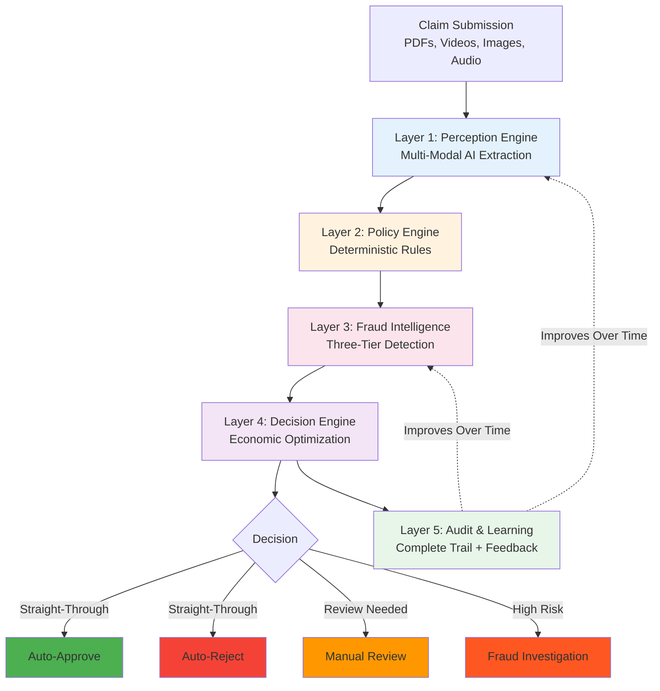

---

## Layer 1: Perception Engine

**Purpose:** Convert messy real-world documents into validated structured data.

**How It Works:**

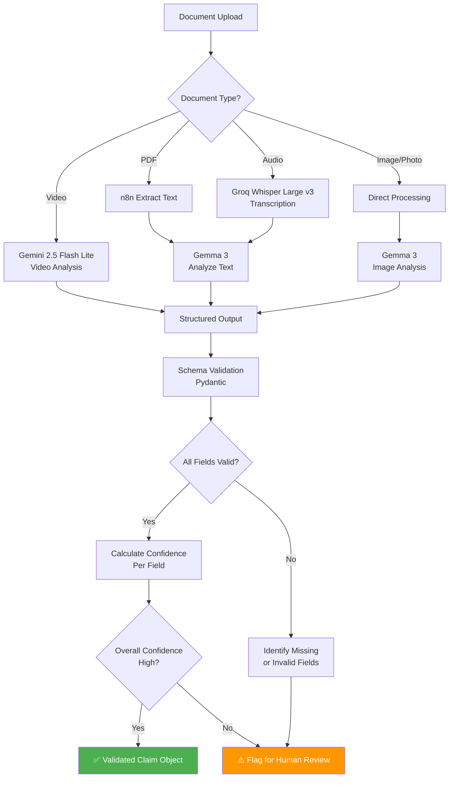

**Key Design Principles:**

- **Multi-Modal Processing:** Handles PDFs (text extraction), images (visual analysis), videos (Gemini 2.5 Flash Lite), and audio (Groq Whisper transcription)
- **Intelligent Analysis:** Gemma 3 analyzes extracted content to generate structured data
- **Schema Validation:** Strict type checking prevents invalid data from entering the system
- **Confidence Thresholding:** High-confidence extractions proceed automatically, low-confidence gets human review
- **n8n Integration:** Automated workflow orchestration for file routing and processing

**Output:** Clean structured data with field-level confidence metadata


**Why This Works:**
- AI handles what it's good at: understanding unstructured multi-modal data (PDFs, videos, images, audio)
- n8n orchestrates complex file processing workflows efficiently
- Strict schemas prevent garbage-in-garbage-out
- Confidence scoring enables smart routing (high confidence → automation, low → human review)
- No AI decision-making yet - just data extraction and analysis

---

## Layer 2: Policy Governance Engine

**Purpose:** Apply insurance policy rules with zero ambiguity and complete auditability.

**Critical Design Decision:** Human-authored rules, NOT AI-generated code.

**Why NOT AI-Generated Code:**
- Insurance policies have legal nuances requiring human interpretation
- LLM-generated code creates legal liability if it misinterprets coverage
- Regulatory compliance requires human approval of adjudication logic

**How It Works:**

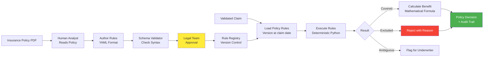

**Rule Structure:**

Policy rules are defined in structured format containing:
- Policy identification and version information
- Coverage categories with limits and conditions
- Copay percentages and waiting periods
- Exclusions for each category
- Validation rules for claim eligibility
- Legal approval metadata

Each rule set is version-controlled and tied to effective dates, ensuring claims are adjudicated using the correct policy version at the time of the incident.

**Rule Execution Logic:**

The system applies rules in a deterministic sequence:
1. Verify claim category is covered by the policy
2. Check temporal validity (claim date within policy period, waiting periods met)
3. Validate against annual or per-incident limits
4. Apply copay percentages and calculate benefit amounts
5. Check for exclusions that would disqualify the claim
6. Return decision with mathematical justification

Every calculation is reproducible using the same inputs and policy version.

**Why This Works:**
- Every decision is mathematically reproducible
- Human-approved rules = legal defensibility
- Version control = audit compliance
- No LLM hallucination risk in decision-making
- Clear separation: AI extracts data, Code applies rules

---

## Layer 3: Three-Tier Fraud Intelligence

**Purpose:** Detect fraud at multiple sophistication levels - from simple duplicates to organized crime rings.

**The Innovation:** Cascading detection that catches what single-claim analysis misses.

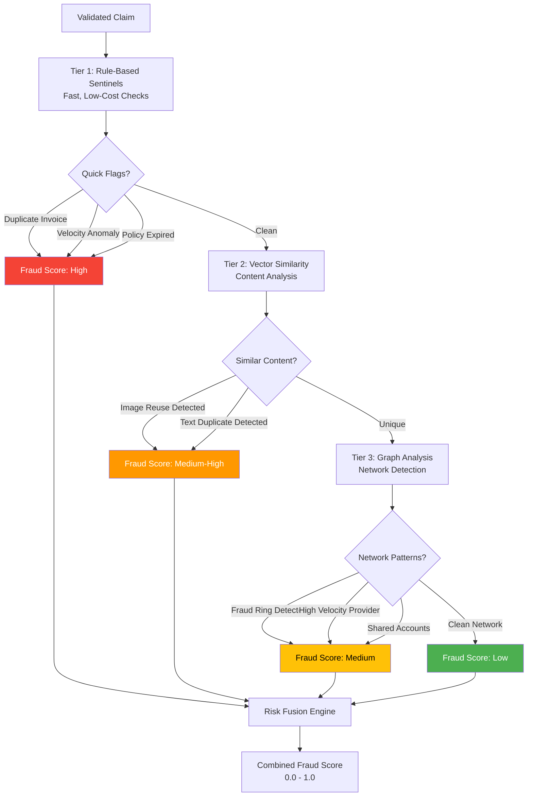

### Tier 1: Rule-Based Sentinels

**Fast, cheap, high-precision checks:**

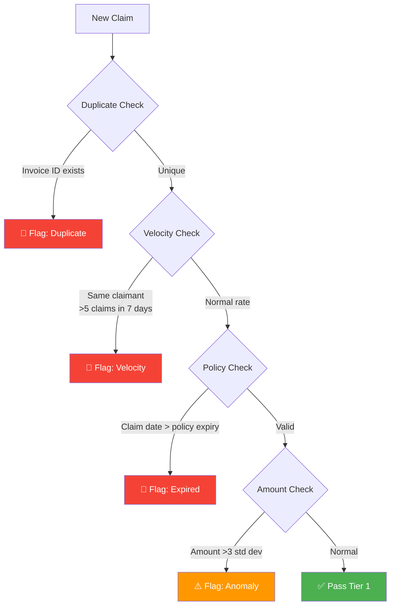

**Why This Matters:** Provides fast initial screening with high precision and minimal computational cost.

---

### Tier 2: Vector Similarity Detection

**Purpose:** Detect reused images, duplicate narratives, template-based fraud.

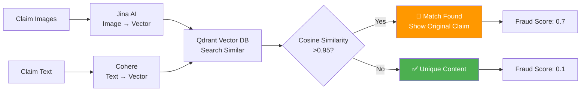

**What It Catches:**
- Same accident photo submitted by different claimants
- Same hospital bill with altered dates/names
- Copy-pasted incident descriptions
- Template-based fraud (fraudsters reusing forms)

**Technical Approach:**
- Image embeddings via Jina AI API encode visual content into vector representations
- Text embeddings via Cohere API convert narrative descriptions into semantic vectors
- Vector database enables fast similarity search across historical claims
- High similarity scores (above threshold) indicate potential content reuse

**What It Catches:**
- Reused accident photos across different claims
- Duplicate hospital bills with altered details
- Copy-pasted incident descriptions
- Template-based fraud patterns

---

### Tier 3: Graph Network Intelligence

**Purpose:** Detect organized fraud rings that span multiple claims and entities.

**The Problem with Traditional Systems:**
Single-claim analysis misses patterns like:
- Multiple claimants sharing phone numbers
- One provider linked to dozens of suspicious claims
- Circular payment patterns (money laundering)

**Our Solution:** Build a knowledge graph that reveals hidden connections.

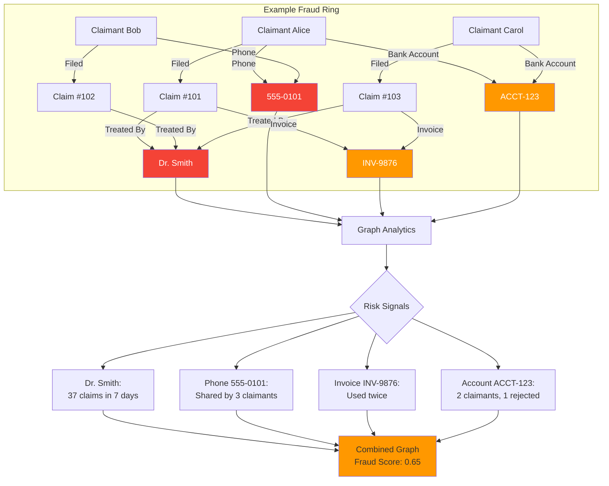

**Graph Structure:**

The knowledge graph models relationships between:
- **Claims:** Individual claim records
- **People:** Claimants and policyholders
- **Providers:** Medical facilities, repair shops, etc.
- **Contact Information:** Phone numbers, emails
- **Financial Data:** Bank accounts, invoice numbers
- **Devices:** IP addresses, device fingerprints

**Relationships tracked:**
- Who filed which claims
- Which provider treated which claims
- Shared contact information between claimants
- Shared financial accounts
- Document references across claims

**Detection Patterns:**

The graph analytics identifies suspicious patterns such as:
- **High-velocity providers:** Single provider linked to unusually high number of recent claims
- **Shared contact networks:** Multiple claimants using the same phone numbers or emails
- **Circular banking:** Multiple people sharing the same financial accounts
- **Invoice reuse:** Same invoice numbers appearing across different claims
- **Device clustering:** Multiple claims submitted from identical devices

**Risk Scoring Approach:**

Graph risk scores combine multiple factors:
- Network centrality (how connected is this entity?)
- Cluster density (how tightly grouped are related claims?)
- Velocity patterns (how quickly are claims appearing?)
- Historical rejection rates (past fraud history)

Risk levels are categorized as high, medium, or low based on combined score thresholds.

**Why This Is Powerful:**
- Single-claim analysis misses organized fraud entirely
- Graph-based detection reveals hidden connections across the network
- Enables proactive detection of fraud rings before they cause extensive damage

---

### Risk Fusion: Combining All Signals

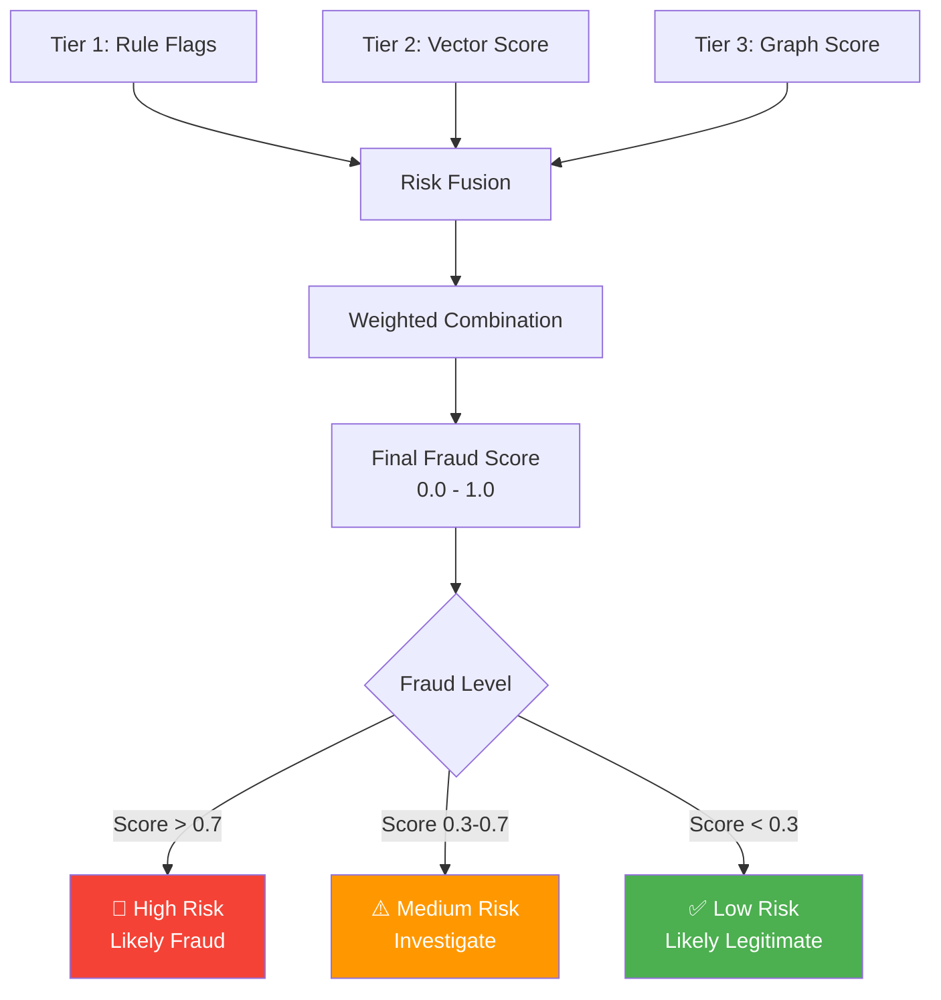

**Score Combination:**

The final fraud score combines signals from all three tiers with weighted importance:
- Tier 1 rule-based flags contribute to the score (high precision, limited scope)
- Tier 2 similarity detection provides content-based signals
- Tier 3 graph analysis receives highest weight (catches sophisticated organized fraud)

This multi-tier approach ensures both simple and complex fraud patterns are properly weighted in the final risk assessment.

---

## Layer 4: Economic Decision Engine

**Purpose:** Make financially optimal routing decisions, not arbitrary threshold-based ones.

**The Innovation:** Only involve humans when the expected loss justifies the investigation cost.

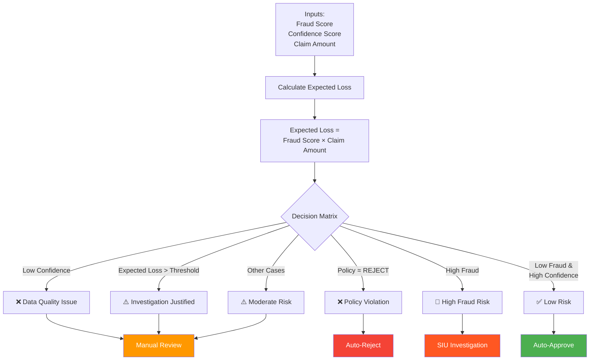

**Economic Logic:**

The system calculates expected loss and compares it to investigation cost:

**Expected Loss** = `fraud_probability` × `claim_amount`

**Decision Rule:**
- If `expected_loss` > `investigation_cost`: Route to human review (economically justified)
- If `expected_loss < investigation_cost`: Auto-process (risk acceptable)

This ensures resources are allocated optimally - only involving human reviewers when the potential fraud loss justifies the cost of investigation.

**Complete Decision Logic:**

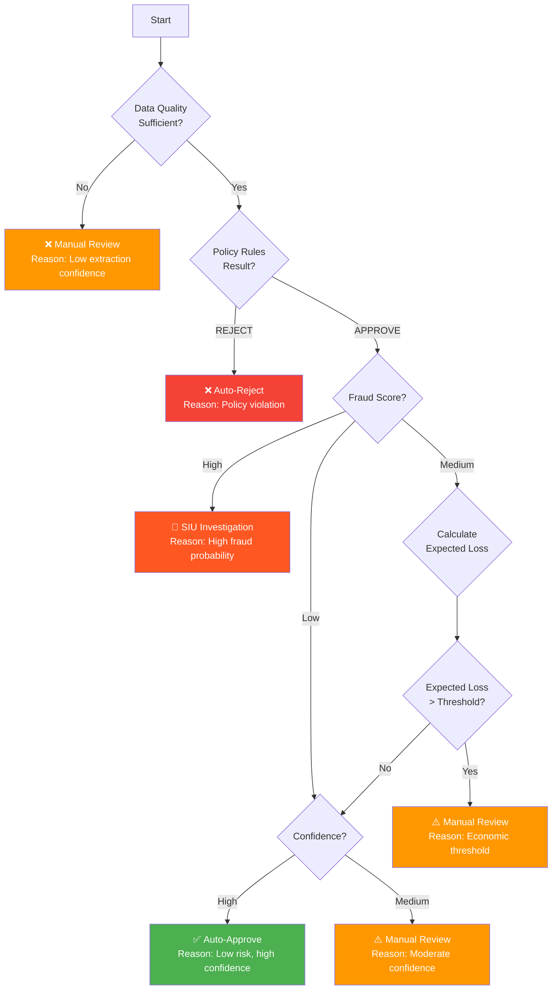

---

## Layer 5: Audit & Active Learning

**Purpose:** Complete regulatory compliance + continuous system improvement.

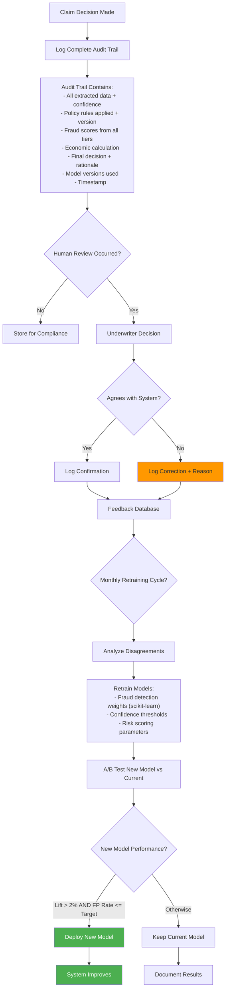

**Audit Trail Structure:**

Each claim decision includes comprehensive logging:
- Claim identification and processing timestamp
- Layer 1: All extracted data with field-level confidence scores
- Layer 2: Policy version applied, rules executed, coverage calculations
- Layer 3: Fraud analysis results from all three tiers, combined risk score
- Layer 4: Economic calculation, decision rationale, routing outcome
- Layer 5: Human feedback (if applicable)
- Model versions used throughout the process

This complete trail enables regulatory compliance and performance analysis.

**Why This Matters:**
- **Compliance:** Every decision is reproducible and explainable
- **Learning:** System improves from real-world feedback
- **Trust:** Underwriters see the logic, not a black box
- **Accountability:** Complete chain of reasoning for every claim

---

## Why This Solution Works

### 1. Neuro-Symbolic Architecture

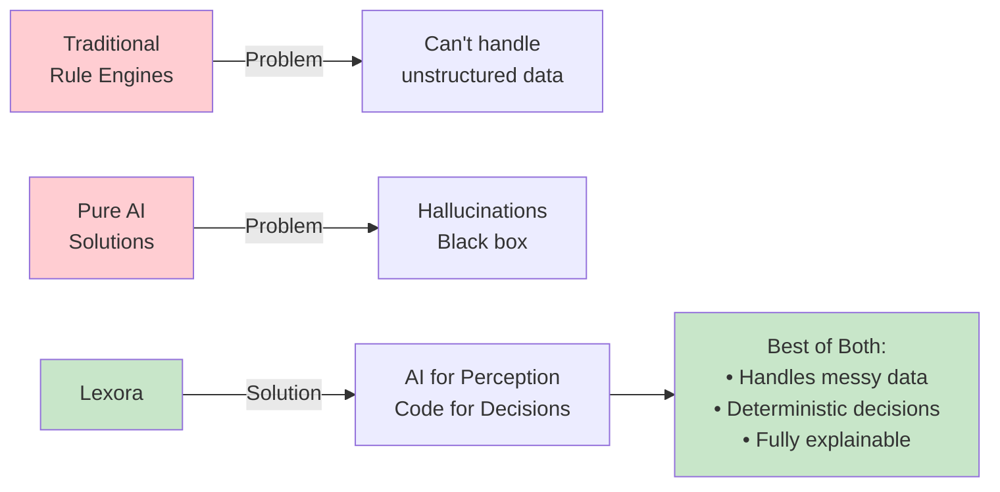

**What Makes It Unique:**
- **Layer 1 (AI):** Extracts data from chaos - what AI excels at
- **Layer 2 (Code):** Applies rules with certainty - what code excels at
- **Layer 3 (Hybrid):** Smart fraud detection using multiple techniques
- **Layer 4 (Logic):** Economic optimization - pure mathematics
- **Layer 5 (Learning):** Continuous improvement with human feedback

**No other solution combines these correctly.**

---

### 2. Three-Tier Fraud Detection

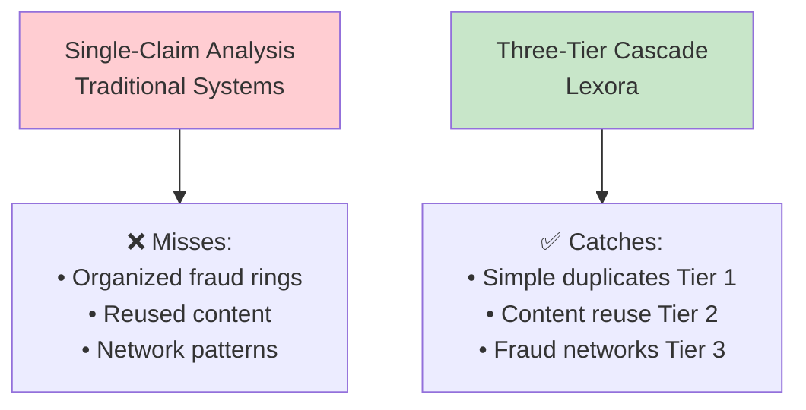

**Competitive Moat:** Graph-based fraud detection is sophisticated and data-intensive - high barrier to entry.

---

### 3. Economic Optimization

**Traditional Approach:** Fixed thresholds (e.g., "if fraud score exceeds X, review manually")

❌ Problem: Ignores the cost-benefit analysis

**Our Approach:** Expected value calculation - only route to human review when (`fraud_probability` × `claim_amount`) exceeds investigation cost

✅ Result: Fewer unnecessary reviews, optimized resource allocation, faster customer experience

---

### 4. Built-In Learning Loop

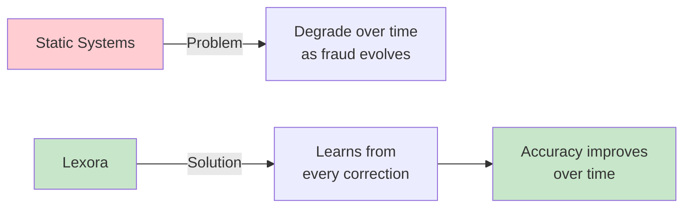

---

## Technical Feasibility

### Technology Stack

| Layer | Technology | Maturity | Risk |
|-------|-----------|----------|------|
| File Processing | n8n | Production | ✅ Low |
| PDF Extraction | n8n built-in | Battle-tested | ✅ Low |
| Video Analysis | Gemini 2.5 Flash Lite | Production | ✅ Low |
| Audio Transcription | Groq Whisper Large v3 | Production | ✅ Low |
| Content Analysis | Gemma 3 | Production | ✅ Low |
| Text Embeddings | Cohere API | Production | ✅ Low |
| Image Embeddings | Jina AI API | Production | ✅ Low |
| Validation | Pydantic | Battle-tested | ✅ Low |
| Policy Engine | Python + YAML | Proven | ✅ Low |
| Vector Search | Qdrant | Production | ✅ Low |
| Graph DB | Neo4j | Industry standard | ⚠️ Medium |
| Backend | FastAPI + Celery | Proven | ✅ Low |
| Frontend | Next.js + TypeScript | Proven | ✅ Low |

**Overall Risk: LOW** - No experimental technologies, everything is production-proven.

---

### Data Flow

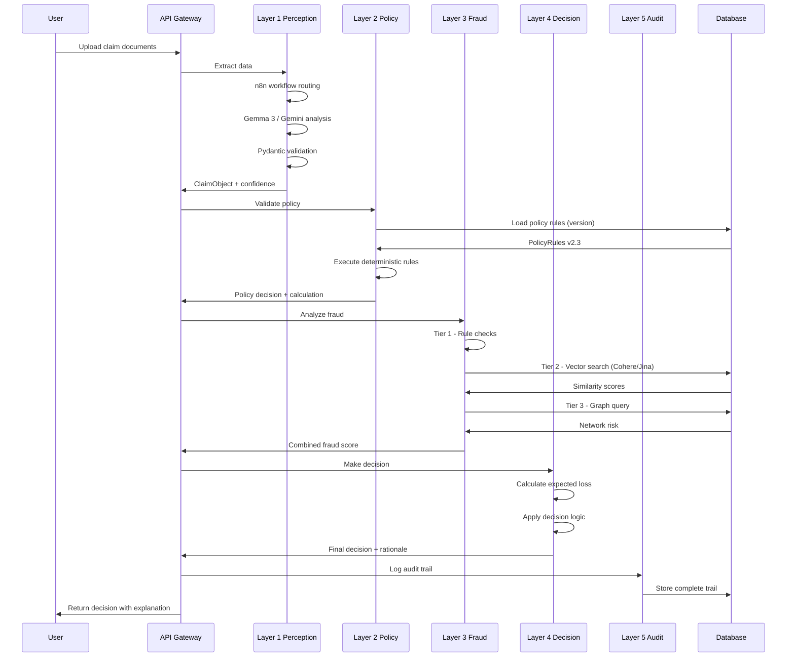

---

## The Complete Picture

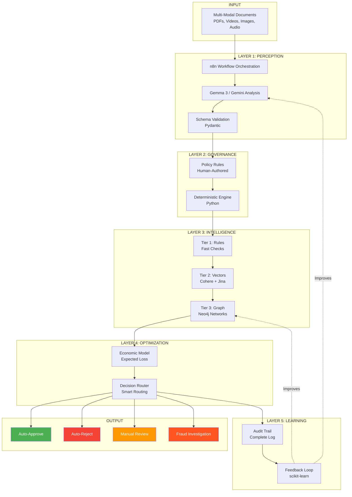

---

## Summary

**Lexora solves intelligent claims processing through:**

1. **Neuro-Symbolic Architecture** - AI for perception, code for decisions
2. **Three-Tier Fraud Detection** - Catches simple duplicates to organized crime rings
3. **Economic Optimization** - Smart routing based on cost-benefit analysis
4. **Active Learning** - Improves continuously from human feedback
5. **Complete Auditability** - Every decision is explainable and reproducible

**What Makes It Win:**
- Most sophisticated fraud detection (three-tier cascade)
- Only true neuro-symbolic solution (best of AI + code)
- Production-ready technology stack  
- Clear competitive moat (graph intelligence)
- Enables significant automation while maintaining full explainability
```

### `frontend/customer.html`

```html
<!DOCTYPE html>
<html class="dark" lang="en">

<head>
    <meta charset="utf-8" />
    <meta content="width=device-width, initial-scale=1.0" name="viewport" />
    <title>Intelligence Core - Customer Portal</title>
    <script src="https://cdn.tailwindcss.com?plugins=forms,container-queries"></script>
    <link href="https://fonts.googleapis.com/css2?family=Space+Grotesk:wght@300;400;500;600;700&amp;display=swap"
        rel="stylesheet" />
    <link
        href="https://fonts.googleapis.com/css2?family=Material+Symbols+Outlined:wght,FILL@100..700,0..1&amp;display=swap"
        rel="stylesheet" />

    <!-- React & Router -->
    <script src="https://unpkg.com/react@18/umd/react.development.js"></script>
    <script src="https://unpkg.com/react-dom@18/umd/react-dom.development.js"></script>
    <script src="https://unpkg.com/history@5/umd/history.development.js"></script>
    <script src="https://unpkg.com/react-router@6.3.0/umd/react-router.development.js"></script>
    <script src="https://unpkg.com/react-router-dom@6.3.0/umd/react-router-dom.development.js"></script>
    <script src="https://unpkg.com/babel-standalone@6/babel.min.js"></script>

    <script id="tailwind-config">
        tailwind.config = {
            darkMode: "class",
            theme: {
                extend: {
                    colors: {
                        "primary": "#e83049",
                        "primary-dark": "#c02339",
                        "background-light": "#f8f6f6",
                        "background-dark": "#0f0f11", // Deep charcoal/black per plan
                        "surface-dark": "#18181b", // Slightly lighter for cards
                        "surface-border": "#27272a", // Borders
                        "emerald-accent": "#10b981",
                    },
                    fontFamily: {
                        "display": ["Space Grotesk", "sans-serif"],
                        "body": ["Space Grotesk", "sans-serif"]
                    },
                    borderRadius: { "DEFAULT": "0.375rem", "lg": "0.5rem", "xl": "0.75rem", "2xl": "1rem", "full": "9999px" },
                },
            },
        }
    </script>
    <style>
        body {
            font-family: 'Space Grotesk', sans-serif;
        }

        /* Custom scrollbar for webkit */
        ::-webkit-scrollbar {
            width: 8px;
        }

        ::-webkit-scrollbar-track {
            background: #18181b;
        }

        ::-webkit-scrollbar-thumb {
            background: #27272a;
            border-radius: 4px;
        }

        ::-webkit-scrollbar-thumb:hover {
            background: #3f3f46;
        }

        .scrollbar-hide::-webkit-scrollbar {
            display: none;
        }

        .scrollbar-hide {
            -ms-overflow-style: none;
            scrollbar-width: none;
        }

        .toggle-checkbox:checked {
            right: 0;
            border-color: #e83049;
        }

        .toggle-checkbox:checked+.toggle-label {
            background-color: #e83049;
        }
    </style>
</head>

<body
    class="bg-background-light dark:bg-background-dark text-slate-900 dark:text-slate-100 min-h-screen flex flex-col font-display antialiased overflow-x-hidden selection:bg-primary selection:text-white">
    <div id="root"></div>

    <script type="text/babel">
        const { useState, useEffect } = React;
        const { createRoot } = ReactDOM;
        const { MemoryRouter, Routes, Route, Link, useNavigate, useLocation } = ReactRouterDOM;

        // --- Common Components ---

        const Header = ({ showBack = false }) => {
            const navigate = useNavigate();
            return (
                <header class="flex items-center justify-between border-b border-surface-border bg-surface-dark px-6 py-4 sticky top-0 z-50">
                    <div class="flex items-center gap-3">
                        {showBack && (
                            <button onClick={() => navigate(-1)} class="mr-2 text-slate-400 hover:text-white transition-colors">
                                <span class="material-symbols-outlined text-[24px]">arrow_back</span>
                            </button>
                        )}
                        <div class="size-8 text-primary cursor-pointer" onClick={() => navigate('/')}>
                            <svg class="w-full h-full" fill="none" viewBox="0 0 48 48" xmlns="http://www.w3.org/2000/svg">
                                <path d="M36.7273 44C33.9891 44 31.6043 39.8386 30.3636 33.69C29.123 39.8386 26.7382 44 24 44C21.2618 44 18.877 39.8386 17.6364 33.69C16.3957 39.8386 14.0109 44 11.2727 44C7.25611 44 4 35.0457 4 24C4 12.9543 7.25611 4 11.2727 4C14.0109 4 16.3957 8.16144 17.6364 14.31C18.877 8.16144 21.2618 4 24 4C26.7382 4 29.123 8.16144 30.3636 14.31C31.6043 8.16144 33.9891 4 36.7273 4C40.7439 4 44 12.9543 44 24C44 35.0457 40.7439 44 36.7273 44Z" fill="currentColor"></path>
                            </svg>
                        </div>
                        <h1 class="text-white text-xl font-bold tracking-tight">Intelligence Core</h1>
                    </div>
                    <div class="flex items-center gap-4">
                        <div class="hidden md:flex items-center gap-2 px-3 py-1.5 bg-background-dark rounded-full border border-surface-border">
                            <span class="relative flex h-2.5 w-2.5 ml-1">
                                <span class="animate-ping absolute inline-flex h-full w-full rounded-full bg-primary opacity-75"></span>
                                <span class="relative inline-flex rounded-full h-2.5 w-2.5 bg-primary"></span>
                            </span>
                            <span class="text-xs font-medium text-slate-400 uppercase tracking-wider">System Operational</span>
                        </div>
                        <button onClick={() => navigate('/notifications')} class="relative p-2 text-slate-400 hover:text-white transition-colors rounded-lg hover:bg-surface-border">
                            <span class="material-symbols-outlined text-[24px]">notifications</span>
                            <span class="absolute top-2 right-2 h-2 w-2 rounded-full bg-primary border-2 border-surface-dark"></span>
                        </button>
                        <div class="h-8 w-8 rounded-full bg-gradient-to-tr from-primary to-purple-600 p-[2px] cursor-pointer" onClick={() => navigate('/profile')}>
                            
                        </div>
                    </div>
                </header>
            );
        };

        const BottomNav = () => {
            const location = useLocation();
            const isActive = (path) => location.pathname === path;

            return (
                <div class="fixed bottom-6 left-1/2 -translate-x-1/2 z-40 w-full max-w-lg px-4">
                    <nav class="flex items-center justify-between bg-surface-dark/90 backdrop-blur-md border border-surface-border shadow-2xl shadow-black rounded-2xl p-2 px-6">
                        <Link to="/" class={`flex flex-col items-center gap-1 p-2 group ${isActive('/') ? '' : 'opacity-60 hover:opacity-100'}`}>
                            {isActive('/') ? (
                                <div class="relative">
                                    <span class="material-symbols-outlined text-primary text-[28px] transition-transform group-hover:-translate-y-1">home</span>
                                    <span class="absolute -bottom-2 left-1/2 -translate-x-1/2 w-1 h-1 bg-primary rounded-full"></span>
                                </div>
                            ) : (
                                <span class="material-symbols-outlined text-slate-400 text-[28px] group-hover:text-white transition-all group-hover:-translate-y-1">home</span>
                            )}
                            <span class={`text-[10px] font-medium ${isActive('/') ? 'text-white font-bold' : 'text-slate-400 group-hover:text-white'}`}>Home</span>
                        </Link>

                        <Link to="/policies" class={`flex flex-col items-center gap-1 p-2 group ${isActive('/policies') ? '' : 'opacity-60 hover:opacity-100'}`}>
                            {isActive('/policies') ? (
                                <div class="relative">
                                    <span class="material-symbols-outlined text-primary text-[28px] transition-transform group-hover:-translate-y-1">shield</span>
                                    <span class="absolute -bottom-2 left-1/2 -translate-x-1/2 w-1 h-1 bg-primary rounded-full"></span>
                                </div>
                            ) : (
                                <span class="material-symbols-outlined text-slate-400 text-[28px] group-hover:text-white transition-all group-hover:-translate-y-1">shield</span>
                            )}
                            <span class={`text-[10px] font-medium ${isActive('/policies') ? 'text-white font-bold' : 'text-slate-400 group-hover:text-white'}`}>Policies</span>
                        </Link>

                        <Link to="/claims" class="group relative flex flex-col items-center">
                            <div class={`relative p-3 -mt-8 rounded-full shadow-lg transition-transform group-hover:scale-110 ${isActive('/claims') ? 'bg-primary border-4 border-background-dark shadow-primary/40' : 'bg-surface-dark border border-surface-border'}`}>
                                <span class={`material-symbols-outlined text-[28px] ${isActive('/claims') ? 'text-white' : 'text-slate-400 group-hover:text-white'}`}>description</span>
                            </div>
                            <span class={`text-[10px] mt-1 font-medium ${isActive('/claims') ? 'text-white font-bold' : 'text-slate-400 group-hover:text-white'}`}>Claims</span>
                        </Link>

                        <Link to="/docs" class={`flex flex-col items-center gap-1 p-2 group ${isActive('/docs') ? '' : 'opacity-60 hover:opacity-100'}`}>
                            {isActive('/docs') ? (
                                <div class="relative">
                                    <span class="material-symbols-outlined text-primary text-[28px] transition-transform group-hover:-translate-y-1">folder_open</span>
                                    <span class="absolute -bottom-2 left-1/2 -translate-x-1/2 w-1 h-1 bg-primary rounded-full"></span>
                                </div>
                            ) : (
                                <span class="material-symbols-outlined text-slate-400 text-[28px] group-hover:text-white transition-all group-hover:-translate-y-1">folder_open</span>
                            )}
                            <span class={`text-[10px] font-medium ${isActive('/docs') ? 'text-white font-bold' : 'text-slate-400 group-hover:text-white'}`}>Docs</span>
                        </Link>

                        <Link to="/profile" class={`flex flex-col items-center gap-1 p-2 group ${isActive('/profile') ? '' : 'opacity-60 hover:opacity-100'}`}>
                            {isActive('/profile') ? (
                                <div class="relative">
                                    <span class="material-symbols-outlined text-primary text-[28px] transition-transform group-hover:-translate-y-1">account_circle</span>
                                    <span class="absolute -bottom-2 left-1/2 -translate-x-1/2 w-1 h-1 bg-primary rounded-full"></span>
                                </div>
                            ) : (
                                <span class="material-symbols-outlined text-slate-400 text-[28px] group-hover:text-white transition-all group-hover:-translate-y-1">account_circle</span>
                            )}
                            <span class={`text-[10px] font-medium ${isActive('/profile') ? 'text-white font-bold' : 'text-slate-400 group-hover:text-white'}`}>Profile</span>
                        </Link>
                    </nav>
                </div>
            );
        };

        // --- Screens ---

        const HomePage = () => {
            return (
                <div class="flex flex-col min-h-screen">
                    <Header />
                    <main class="flex-1 max-w-7xl mx-auto w-full p-4 md:p-8 pb-32">
                        <section class="mb-10">
                            <div class="flex flex-col gap-2">
                                <h2 class="text-4xl md:text-5xl font-bold text-white tracking-tight">Good morning, Kumud</h2>
                                <p class="text-slate-400 text-lg">Intelligence Core active. Your coverage is optimized.</p>
                            </div>
                        </section>
                        <div class="grid grid-cols-1 lg:grid-cols-12 gap-8">
                            <div class="lg:col-span-7 flex flex-col gap-6">
                                <div class="flex items-center justify-between mb-2">
                                    <h3 class="text-xl font-bold text-white">Your Active Protection</h3>
                                    <Link to="/policies" class="text-sm text-primary hover:text-red-400 font-medium flex items-center gap-1 group">
                                        View All Policies
                                        <span class="material-symbols-outlined text-[16px] group-hover:translate-x-1 transition-transform">arrow_forward</span>
                                    </Link>
                                </div>
                                <div class="group relative overflow-hidden rounded-2xl bg-surface-dark border border-surface-border p-6 transition-all hover:border-primary/50 shadow-lg shadow-black/20">
                                    <div class="absolute top-0 right-0 p-6 opacity-10 group-hover:opacity-20 transition-opacity">
                                        <span class="material-symbols-outlined text-[120px] text-white">medical_services</span>
                                    </div>
                                    <div class="flex flex-col h-full justify-between relative z-10">
                                        <div class="flex justify-between items-start mb-6">
                                            <div class="flex gap-4 items-center">
                                                <div class="h-12 w-12 rounded-xl bg-primary/10 flex items-center justify-center text-primary border border-primary/20">
                                                    <span class="material-symbols-outlined text-[28px]">cardiology</span>
                                                </div>
                                                <div>
                                                    <h4 class="text-xl font-bold text-white">Health Shield Premier</h4>
                                                    <p class="text-slate-400 text-sm font-mono">Policy #H-992-883</p>
                                                </div>
                                            </div>
                                            <span class="px-3 py-1 rounded-full bg-emerald-500/10 text-emerald-400 text-xs font-bold border border-emerald-500/20 uppercase tracking-wide">Active</span>
                                        </div>
                                        <div class="grid grid-cols-2 gap-4 mb-8">
                                            <div>
                                                <p class="text-xs text-slate-500 uppercase tracking-wider mb-1">Coverage</p>
                                                <p class="text-white font-medium">$500,000</p>
                                            </div>
                                            <div>
                                                <p class="text-xs text-slate-500 uppercase tracking-wider mb-1">Renewal</p>
                                                <p class="text-white font-medium">Oct 24, 2024</p>
                                            </div>
                                        </div>
                                        <div class="flex items-center gap-3 mt-auto">
                                            <Link to="/claims" class="flex-1 bg-primary hover:bg-red-600 text-white font-bold py-3 px-4 rounded-lg transition-colors flex items-center justify-center gap-2">
                                                <span class="material-symbols-outlined text-[20px]">description</span>
                                                File a Claim
                                            </Link>
                                            <Link to="/policy-detail" class="px-4 py-3 rounded-lg border border-surface-border text-slate-300 hover:text-white hover:bg-surface-border transition-colors font-medium">
                                                Details
                                            </Link>
                                        </div>
                                    </div>
                                </div>
                                <div class="group relative overflow-hidden rounded-2xl bg-surface-dark border border-surface-border p-6 transition-all hover:border-primary/50 shadow-lg shadow-black/20">
                                    <div class="absolute top-0 right-0 p-6 opacity-10 group-hover:opacity-20 transition-opacity">
                                        <span class="material-symbols-outlined text-[120px] text-white">directions_car</span>
                                    </div>
                                    <div class="flex flex-col h-full justify-between relative z-10">
                                        <div class="flex justify-between items-start mb-6">
                                            <div class="flex gap-4 items-center">
                                                <div class="h-12 w-12 rounded-xl bg-blue-500/10 flex items-center justify-center text-blue-400 border border-blue-500/20">
                                                    <span class="material-symbols-outlined text-[28px]">directions_car</span>
                                                </div>
                                                <div>
                                                    <h4 class="text-xl font-bold text-white">Auto Drive Secure</h4>
                                                    <p class="text-slate-400 text-sm font-mono">Policy #A-110-442</p>
                                                </div>
                                            </div>
                                            <span class="px-3 py-1 rounded-full bg-emerald-500/10 text-emerald-400 text-xs font-bold border border-emerald-500/20 uppercase tracking-wide">Active</span>
                                        </div>
                                        <div class="grid grid-cols-2 gap-4 mb-8">
                                            <div>
                                                <p class="text-xs text-slate-500 uppercase tracking-wider mb-1">Vehicle</p>
                                                <p class="text-white font-medium">Tesla Model 3</p>
                                            </div>
                                            <div>
                                                <p class="text-xs text-slate-500 uppercase tracking-wider mb-1">Next Payment</p>
                                                <p class="text-white font-medium">Nov 01, 2024</p>
                                            </div>
                                        </div>
                                        <div class="flex items-center gap-3 mt-auto">
                                            <Link to="/chat" class="flex-1 bg-primary hover:bg-red-600 text-white font-bold py-3 px-4 rounded-lg transition-colors flex items-center justify-center gap-2">
                                                <span class="material-symbols-outlined text-[20px]">build</span>
                                                Request Service
                                            </Link>
                                            <button class="px-4 py-3 rounded-lg border border-surface-border text-slate-300 hover:text-white hover:bg-surface-border transition-colors font-medium">
                                                ID Card
                                            </button>
                                        </div>
                                    </div>
                                </div>
                            </div>
                            <div class="lg:col-span-5 flex flex-col gap-8">
                                <div>
                                    <h3 class="text-xl font-bold text-white mb-4">Explore Coverage</h3>
                                    <div class="grid grid-cols-2 gap-3">
                                        <Link to="/explore" class="flex flex-col items-center justify-center gap-2 p-4 rounded-xl bg-surface-dark border border-surface-border hover:border-primary/50 hover:bg-surface-border transition-all group">
                                            <span class="material-symbols-outlined text-3xl text-slate-400 group-hover:text-primary transition-colors">home</span>
                                            <span class="text-sm font-medium text-slate-300 group-hover:text-white">Home</span>
                                        </Link>
                                        <Link to="/explore" class="flex flex-col items-center justify-center gap-2 p-4 rounded-xl bg-surface-dark border border-surface-border hover:border-primary/50 hover:bg-surface-border transition-all group">
                                            <span class="material-symbols-outlined text-3xl text-slate-400 group-hover:text-primary transition-colors">flight</span>
                                            <span class="text-sm font-medium text-slate-300 group-hover:text-white">Travel</span>
                                        </Link>
                                        <Link to="/explore" class="flex flex-col items-center justify-center gap-2 p-4 rounded-xl bg-surface-dark border border-surface-border hover:border-primary/50 hover:bg-surface-border transition-all group">
                                            <span class="material-symbols-outlined text-3xl text-slate-400 group-hover:text-primary transition-colors">pets</span>
                                            <span class="text-sm font-medium text-slate-300 group-hover:text-white">Pet</span>
                                        </Link>
                                        <Link to="/explore" class="flex flex-col items-center justify-center gap-2 p-4 rounded-xl bg-surface-dark border border-surface-border hover:border-primary/50 hover:bg-surface-border transition-all group">
                                            <span class="material-symbols-outlined text-3xl text-slate-400 group-hover:text-primary transition-colors">favorite</span>
                                            <span class="text-sm font-medium text-slate-300 group-hover:text-white">Life</span>
                                        </Link>
                                    </div>
                                </div>
                                <div class="flex flex-col gap-4">
                                    <div class="relative overflow-hidden rounded-xl bg-gradient-to-br from-surface-dark to-surface-border border border-surface-border p-5">
                                        <div class="absolute right-0 top-0 h-full w-1/3 bg-gradient-to-l from-primary/10 to-transparent"></div>
                                        <div class="relative z-10">
                                            <div class="flex items-center gap-2 mb-2 text-primary">
                                                <span class="material-symbols-outlined text-[20px]">savings</span>
                                                <span class="text-xs font-bold uppercase tracking-wider">Tax Season</span>
                                            </div>
                                            <h4 class="text-lg font-bold text-white mb-1">Maximize Your Deductions</h4>
                                            <p class="text-slate-400 text-sm mb-4">See how your current health premiums can save you money this year.</p>
                                            <button class="text-white text-sm font-bold hover:text-primary transition-colors flex items-center gap-1">
                                                Calculate Savings
                                                <span class="material-symbols-outlined text-[16px]">arrow_forward</span>
                                            </button>
                                        </div>
                                    </div>
                                    <div class="relative overflow-hidden rounded-xl bg-surface-dark border border-surface-border">
                                        <div class="h-32 w-full bg-cover bg-center" style={{ backgroundImage: "url('https://lh3.googleusercontent.com/aida-public/AB6AXuDWE5kpe4ho2oP4OT9iVkHm_aWhSzGehkovuscPV2VfJ8k7bY49C-GAIiOpELuGgrfrSHrA8bL3EwCuEJDW6NRi1-uKRzkfY_n0Q8CsBUY2kFAHT_sGF46KgENPA4pjHU-XFNtuYsMN8bGRz7ctxraPNtoLhZRb8IL6DqwRhHtVBC0Tzun93peCByKL_jbo-sXk-GyPZtGG0cl50B4IyY-g50hnLEOW6x_dxXXeg24mdVhrg6Gj2xd3vSjZlZYFE72Zp_2HLJ5MabxI')" }}>
                                            <div class="absolute inset-0 bg-gradient-to-t from-surface-dark to-transparent"></div>
                                        </div>
                                        <div class="p-5 relative -mt-12">
                                            <span class="inline-block px-2 py-1 bg-blue-600 text-white text-[10px] font-bold uppercase tracking-wider rounded mb-2">New</span>
                                            <h4 class="text-lg font-bold text-white mb-1">Travel Insurance 2.0</h4>
                                            <p class="text-slate-400 text-sm mb-4">Instant coverage for flight delays and lost baggage. From $5/day.</p>
                                            <Link to="/explore" class="w-full inline-block text-center py-2 rounded-lg bg-surface-border text-white text-sm font-bold hover:bg-white hover:text-surface-dark transition-colors">
                                                Get a Quote
                                            </Link>
                                        </div>
                                    </div>
                                </div>
                            </div>
                        </div>
                    </main>
                    <BottomNav />
                </div>
            );
        };

        const PoliciesPage = () => {
            return (
                <div class="flex flex-col min-h-screen">
                    <Header />
                    <main class="flex-1 max-w-7xl mx-auto w-full p-4 md:p-8 pb-32">
                        <section class="mb-10">
                            <div class="flex flex-col md:flex-row md:items-end justify-between gap-6">
                                <div class="flex flex-col gap-2">
                                    <h2 class="text-4xl md:text-5xl font-bold text-white tracking-tight">Your Policies</h2>
                                    <p class="text-slate-400 text-lg">Manage coverage details and policy documents.</p>
                                </div>
                                <div class="flex flex-wrap gap-2">
                                    <button class="px-4 py-2 rounded-full bg-primary text-white text-sm font-bold border border-primary transition-colors">All</button>
                                    <button class="px-4 py-2 rounded-full bg-surface-dark text-slate-400 hover:text-white hover:bg-surface-border text-sm font-bold border border-surface-border transition-colors">Active</button>
                                    <button class="px-4 py-2 rounded-full bg-surface-dark text-slate-400 hover:text-white hover:bg-surface-border text-sm font-bold border border-surface-border transition-colors">Expired</button>
                                </div>
                            </div>
                        </section>
                        <section class="mb-12">
                            <h3 class="text-xl font-bold text-white mb-6 flex items-center gap-2">
                                <span class="h-2 w-2 rounded-full bg-emerald-500"></span>
                                Active Protection
                            </h3>
                            <div class="grid grid-cols-1 lg:grid-cols-2 gap-6">
                                <Link to="/policy-detail" class="group relative overflow-hidden rounded-2xl bg-surface-dark border border-surface-border p-8 transition-all hover:border-primary/50 shadow-lg shadow-black/20 block">
                                    <div class="absolute -bottom-8 -right-8 p-6 opacity-[0.03] group-hover:opacity-[0.07] transition-opacity pointer-events-none rotate-12">
                                        <span class="material-symbols-outlined text-[200px] text-white">shield_with_heart</span>
                                    </div>
                                    <div class="flex flex-col h-full justify-between relative z-10">
                                        <div class="flex justify-between items-start mb-8">
                                            <div class="flex gap-5 items-center">
                                                <div class="h-14 w-14 rounded-2xl bg-primary/10 flex items-center justify-center text-primary border border-primary/20 shadow-inner shadow-primary/5">
                                                    <span class="material-symbols-outlined text-[32px]">cardiology</span>
                                                </div>
                                                <div>
                                                    <h4 class="text-2xl font-bold text-white">Health Shield Premier</h4>
                                                    <p class="text-slate-400 font-mono text-sm mt-1">Policy #H-992-883</p>
                                                </div>
                                            </div>
                                            <span class="px-3 py-1 rounded-full bg-emerald-500/10 text-emerald-400 text-xs font-bold border border-emerald-500/20 uppercase tracking-wide">Active</span>
                                        </div>
                                        <div class="grid grid-cols-2 sm:grid-cols-3 gap-6 mb-8 p-4 rounded-xl bg-background-dark/50 border border-surface-border/50">
                                            <div>
                                                <p class="text-xs text-slate-500 uppercase tracking-wider mb-1.5 font-bold">Total Coverage</p>
                                                <p class="text-white text-lg font-medium">$500,000</p>
                                            </div>
                                            <div>
                                                <p class="text-xs text-slate-500 uppercase tracking-wider mb-1.5 font-bold">Premium</p>
                                                <p class="text-white text-lg font-medium">$420<span class="text-xs text-slate-500 font-normal">/mo</span></p>
                                            </div>
                                            <div class="hidden sm:block">
                                                <p class="text-xs text-slate-500 uppercase tracking-wider mb-1.5 font-bold">Renewal Date</p>
                                                <p class="text-white text-lg font-medium">Oct 24, 2024</p>
                                            </div>
                                        </div>
                                    </div>
                                </Link>
                                <div class="group relative overflow-hidden rounded-2xl bg-surface-dark border border-surface-border p-8 transition-all hover:border-primary/50 shadow-lg shadow-black/20">
                                    <div class="absolute -bottom-8 -right-8 p-6 opacity-[0.03] group-hover:opacity-[0.07] transition-opacity pointer-events-none rotate-12">
                                        <span class="material-symbols-outlined text-[200px] text-white">directions_car</span>
                                    </div>
                                    <div class="flex flex-col h-full justify-between relative z-10">
                                        <div class="flex justify-between items-start mb-8">
                                            <div class="flex gap-5 items-center">
                                                <div class="h-14 w-14 rounded-2xl bg-blue-500/10 flex items-center justify-center text-blue-400 border border-blue-500/20 shadow-inner shadow-blue-500/5">
                                                    <span class="material-symbols-outlined text-[32px]">directions_car</span>
                                                </div>
                                                <div>
                                                    <h4 class="text-2xl font-bold text-white">Auto Drive Secure</h4>
                                                    <p class="text-slate-400 font-mono text-sm mt-1">Policy #A-110-442</p>
                                                </div>
                                            </div>
                                            <span class="px-3 py-1 rounded-full bg-emerald-500/10 text-emerald-400 text-xs font-bold border border-emerald-500/20 uppercase tracking-wide">Active</span>
                                        </div>
                                        <div class="grid grid-cols-2 sm:grid-cols-3 gap-6 mb-8 p-4 rounded-xl bg-background-dark/50 border border-surface-border/50">
                                            <div>
                                                <p class="text-xs text-slate-500 uppercase tracking-wider mb-1.5 font-bold">Vehicle</p>
                                                <p class="text-white text-lg font-medium">Tesla Model 3</p>
                                            </div>
                                            <div>
                                                <p class="text-xs text-slate-500 uppercase tracking-wider mb-1.5 font-bold">Deductible</p>
                                                <p class="text-white text-lg font-medium">$500</p>
                                            </div>
                                            <div class="hidden sm:block">
                                                <p class="text-xs text-slate-500 uppercase tracking-wider mb-1.5 font-bold">Next Payment</p>
                                                <p class="text-white text-lg font-medium">Nov 01, 2024</p>
                                            </div>
                                        </div>
                                        <div class="flex flex-wrap gap-3 mt-auto">
                                            <Link to="/renewal" class="flex-1 bg-surface-border/50 hover:bg-surface-border text-white font-bold py-3 px-6 rounded-lg border border-surface-border transition-colors flex items-center justify-center gap-2">
                                                <span class="material-symbols-outlined text-[20px]">update</span>
                                                Manage Renewal
                                            </Link>
                                        </div>
                                    </div>
                                </div>
                            </div>
                        </section>
                        <section>
                            <h3 class="text-xl font-bold text-white mb-6 flex items-center gap-2">
                                <span class="h-2 w-2 rounded-full bg-amber-500"></span>
                                Recently Expired
                            </h3>
                            <div class="grid grid-cols-1 md:grid-cols-3 gap-6">
                                <div class="group relative overflow-hidden rounded-xl bg-surface-dark border border-amber-900/40 p-6 transition-all hover:border-amber-600/60 shadow-lg shadow-black/20 opacity-80 hover:opacity-100">
                                    <div class="flex justify-between items-start mb-4">
                                        <div class="flex gap-3 items-center">
                                            <div class="h-10 w-10 rounded-lg bg-slate-800 flex items-center justify-center text-slate-400 border border-surface-border">
                                                <span class="material-symbols-outlined text-[20px]">flight</span>
                                            </div>
                                            <div>
                                                <h4 class="text-lg font-bold text-slate-200">Global Travel Plus</h4>
                                                <p class="text-slate-500 font-mono text-xs">Policy #T-332-901</p>
                                            </div>
                                        </div>
                                        <span class="px-2 py-1 rounded bg-amber-500/10 text-amber-500 text-[10px] font-bold border border-amber-500/20 uppercase tracking-wide">Expired</span>
                                    </div>
                                    <div class="flex justify-between items-end border-t border-surface-border pt-4 mt-2">
                                        <div>
                                            <p class="text-xs text-slate-500 mb-1">Ended On</p>
                                            <p class="text-slate-300 font-medium">Sep 15, 2024</p>
                                        </div>
                                        <Link to="/renewal" class="text-amber-500 hover:text-amber-400 text-sm font-bold flex items-center gap-1 group-hover:translate-x-1 transition-transform">
                                            Renew Now
                                            <span class="material-symbols-outlined text-[16px]">arrow_forward</span>
                                        </Link>
                                    </div>
                                </div>
                            </div>
                        </section>
                    </main>
                    <BottomNav />
                </div>
            );
        };

        const ClaimsPage = () => {
            const navigate = useNavigate();
            return (
                <div class="flex flex-col min-h-screen">
                    {/* Background "App" effect */}
                    <div aria-hidden="true" class="flex-1 flex flex-col opacity-30 pointer-events-none filter blur-sm transition-all duration-300">
                        <Header />
                        <main class="flex-1 max-w-7xl mx-auto w-full p-4 md:p-8 pb-32">
                            <h2 class="text-4xl md:text-5xl font-bold text-white tracking-tight">Intelligence Core</h2>
                        </main>
                    </div>

                    <div aria-hidden="true" class="fixed inset-0 z-40 bg-black/60 backdrop-blur-sm"></div>

                    {/* Bottom Sheet */}
                    <div class="fixed inset-x-0 bottom-0 z-50 flex flex-col items-center justify-end md:justify-center h-full pointer-events-none p-4">
                        <div class="w-full max-w-3xl bg-surface-dark border border-surface-border shadow-2xl rounded-t-3xl md:rounded-2xl pointer-events-auto flex flex-col max-h-[90vh] md:max-h-[85vh] relative overflow-hidden animate-slide-up">
                            <div class="w-full flex justify-center pt-3 pb-1 md:hidden bg-surface-dark sticky top-0 z-20">
                                <div class="w-12 h-1.5 bg-surface-border rounded-full"></div>
                            </div>
                            <div class="px-6 py-6 border-b border-surface-border bg-surface-dark sticky top-0 z-10 flex flex-col gap-6">
                                <div class="flex items-center justify-between">
                                    <div>
                                        <h2 class="text-2xl md:text-3xl font-bold text-white tracking-tight">Claims</h2>
                                        <p class="text-slate-400 text-sm mt-1">Manage and track your insurance claims</p>
                                    </div>
                                    <button onClick={() => navigate('/')} class="p-2 text-slate-400 hover:text-white hover:bg-surface-border rounded-full transition-colors md:absolute md:top-6 md:right-6">
                                        <span class="material-symbols-outlined">close</span>
                                    </button>
                                </div>
                                <div class="flex flex-col sm:flex-row gap-4">
                                    <button class="flex-1 bg-primary hover:bg-red-600 text-white font-bold py-3 px-6 rounded-xl transition-all flex items-center justify-center gap-2 shadow-lg shadow-primary/20">
                                        <span class="material-symbols-outlined">add_circle</span>
                                        File a New Claim
                                    </button>
                                </div>
                                <div class="flex items-center gap-2 overflow-x-auto pb-2 scrollbar-hide">
                                    <button class="px-4 py-1.5 rounded-full bg-primary text-white text-xs font-medium border border-primary whitespace-nowrap">All Claims</button>
                                    <button class="px-4 py-1.5 rounded-full bg-surface-dark border border-surface-border text-slate-400 hover:text-white hover:border-slate-500 text-xs font-medium whitespace-nowrap transition-colors">In Review</button>
                                    <button class="px-4 py-1.5 rounded-full bg-surface-dark border border-surface-border text-slate-400 hover:text-white hover:border-slate-500 text-xs font-medium whitespace-nowrap transition-colors">Action Required</button>
                                    <button class="px-4 py-1.5 rounded-full bg-surface-dark border border-surface-border text-slate-400 hover:text-white hover:border-slate-500 text-xs font-medium whitespace-nowrap transition-colors">Settled</button>
                                </div>
                            </div>
                            <div class="flex-1 overflow-y-auto p-6 bg-[#121214]">
                                <div class="flex flex-col gap-4">
                                    {/* Claim 1 */}
                                    <div class="bg-surface-dark border border-surface-border rounded-xl p-5 hover:border-primary/40 transition-colors group cursor-pointer relative overflow-hidden" onClick={() => navigate('/claim-result')}>
                                        <div class="absolute top-0 left-0 w-1 h-full bg-amber-500"></div>
                                        <div class="flex justify-between items-start mb-4">
                                            <div>
                                                <div class="flex items-center gap-3 mb-1">
                                                    <h3 class="text-white font-bold text-lg">Windshield Crack</h3>
                                                    <span class="px-2 py-0.5 rounded text-[10px] font-bold bg-amber-500/10 text-amber-500 border border-amber-500/20 uppercase tracking-wide">Reviewing</span>
                                                </div>
                                                <p class="text-slate-500 text-xs font-mono">ID: #CLM-2024-8892 • Auto Policy</p>
                                            </div>
                                            <span class="text-slate-400 text-xs">Updated 2h ago</span>
                                        </div>
                                        <div class="mb-4">
                                            <div class="flex justify-between text-[10px] uppercase font-bold text-slate-500 mb-2 tracking-wider">
                                                <span class="text-primary">Filed</span>
                                                <span class="text-amber-500">Review</span>
                                                <span>Approval</span>
                                                <span>Payout</span>
                                            </div>
                                            <div class="flex gap-1 h-1.5 w-full">
                                                <div class="flex-1 bg-primary rounded-full"></div>
                                                <div class="flex-1 bg-amber-500 rounded-full animate-pulse"></div>
                                                <div class="flex-1 bg-surface-border rounded-full"></div>
                                                <div class="flex-1 bg-surface-border rounded-full"></div>
                                            </div>
                                        </div>
                                    </div>

                                    {/* Claim 2 */}
                                    <div class="bg-surface-dark border border-surface-border rounded-xl p-5 hover:border-emerald-500/40 transition-colors group cursor-pointer relative overflow-hidden opacity-75 hover:opacity-100" onClick={() => navigate('/claim-result')}>
                                        <div class="absolute top-0 left-0 w-1 h-full bg-emerald-500"></div>
                                        <div class="flex justify-between items-start mb-4">
                                            <div>
                                                <div class="flex items-center gap-3 mb-1">
                                                    <h3 class="text-white font-bold text-lg">Routine Dental Checkup</h3>
                                                    <span class="px-2 py-0.5 rounded text-[10px] font-bold bg-emerald-500/10 text-emerald-500 border border-emerald-500/20 uppercase tracking-wide">Settled</span>
                                                </div>
                                                <p class="text-slate-500 text-xs font-mono">ID: #CLM-2023-1024 • Health Policy</p>
                                            </div>
                                            <span class="text-slate-400 text-xs">Oct 12, 2023</span>
                                        </div>
                                        <div class="flex items-center justify-between mt-2 pt-3 border-t border-surface-border/50">
                                            <div class="flex flex-col">
                                                <span class="text-[10px] text-slate-500 uppercase tracking-wider">Payout Amount</span>
                                                <span class="text-sm font-bold text-white">$240.00</span>
                                            </div>
                                            <button class="text-xs font-medium text-slate-300 hover:text-white flex items-center gap-1 transition-colors">
                                                <span class="material-symbols-outlined text-[14px]">download</span> Statement
                                            </button>
                                        </div>
                                    </div>

                                </div>
                            </div>
                        </div>
                    </div>
                </div>
            );
        };

        const ClaimResultPage = () => {
            const navigate = useNavigate();
            return (
                <div class="bg-background-light dark:bg-background-dark min-h-screen flex flex-col font-display antialiased overflow-x-hidden text-slate-900 dark:text-slate-100 relative">
                    <div class="absolute top-0 left-1/2 -translate-x-1/2 w-full max-w-3xl h-64 bg-emerald-accent/10 blur-[100px] rounded-full pointer-events-none z-0"></div>
                    <header class="absolute top-0 left-0 w-full p-6 flex justify-between items-center z-20">
                        <div class="flex items-center gap-3 opacity-80 hover:opacity-100 transition-opacity">
                            <span class="text-sm font-bold tracking-wider uppercase text-slate-400">Intelligence Core</span>
                        </div>
                        <button onClick={() => navigate('/claims')} class="text-slate-400 hover:text-white transition-colors">
                            <span class="material-symbols-outlined text-3xl">close</span>
                        </button>
                    </header>
                    <main class="flex-1 flex flex-col items-center justify-center p-4 md:p-8 w-full relative z-10">
                        <div class="w-full max-w-2xl flex flex-col items-center gap-8">
                            <div class="flex flex-col items-center text-center gap-6">
                                <div class="relative flex items-center justify-center size-24 rounded-full bg-emerald-accent/20 text-emerald-accent ring-1 ring-emerald-accent/50 shadow-[0_0_40px_-10px_rgba(16,185,129,0.5)]">
                                    <span class="material-symbols-outlined text-6xl font-bold">check</span>
                                </div>
                                <div class="space-y-1">
                                    <h1 class="text-4xl md:text-5xl font-bold text-white tracking-tight">Claim Approved</h1>
                                    <div class="inline-flex items-center gap-2 px-3 py-1 rounded-full bg-[#38292b]/50 border border-[#38292b] text-slate-400 text-xs font-mono">
                                        <span class="material-symbols-outlined text-sm">fingerprint</span>
                                        <span>Decision ID: #CLM-9928-X</span>
                                    </div>
                                </div>
                            </div>
                            <div class="flex flex-col items-center justify-center py-2">
                                <p class="text-sm text-emerald-accent/80 font-medium uppercase tracking-widest mb-2">Total Approved Amount</p>
                                <div class="text-5xl md:text-7xl font-bold text-emerald-accent tracking-tighter drop-shadow-lg">
                                    ₹11,205.00
                                </div>
                            </div>
                            <div class="w-full bg-[#38292b]/40 backdrop-blur-md border border-[#38292b] rounded-2xl p-1 shadow-xl">
                                <div class="bg-[#261c1d] rounded-xl p-6 md:p-8 flex flex-col gap-6">
                                    <div class="flex items-start gap-4">
                                        <div class="p-2 bg-primary/10 rounded-lg text-primary shrink-0 mt-1">
                                            <span class="material-symbols-outlined">psychology</span>
                                        </div>
                                        <div class="space-y-2">
                                            <h3 class="text-lg font-bold text-white flex items-center gap-2">
                                                Intelligence Decision Logic
                                                <span class="bg-emerald-accent/20 text-emerald-accent text-[10px] px-2 py-0.5 rounded uppercase font-bold tracking-wide">Verified</span>
                                            </h3>
                                            <p class="text-slate-300 leading-relaxed text-sm md:text-base">
                                                This claim matches <strong class="text-white">Policy #992A</strong> active coverage. A <strong class="text-white">10% co-pay (₹1,245.00)</strong> has been applied per standard terms. No fraud indicators were detected during the scan.
                                            </p>
                                        </div>
                                    </div>
                                    <div class="grid grid-cols-1 md:grid-cols-3 gap-4 border-t border-[#38292b] pt-6 mt-2">
                                        <div class="flex flex-col gap-1">
                                            <span class="text-xs text-slate-500 uppercase font-bold tracking-wider">Original Claim</span>
                                            <span class="text-white font-medium">₹12,450.00</span>
                                        </div>
                                        <div class="flex flex-col gap-1">
                                            <span class="text-xs text-slate-500 uppercase font-bold tracking-wider">Co-pay (10%)</span>
                                            <span class="text-primary font-medium">- ₹1,245.00</span>
                                        </div>
                                        <div class="flex flex-col gap-1">
                                            <span class="text-xs text-slate-500 uppercase font-bold tracking-wider">Policy Match</span>
                                            <span class="text-emerald-accent font-medium flex items-center gap-1">
                                                <span class="material-symbols-outlined text-sm">verified_user</span> 100% Match
                                            </span>
                                        </div>
                                    </div>
                                </div>
                            </div>
                            <div class="flex flex-col md:flex-row items-center gap-4 w-full md:w-auto mt-4">
                                <button class="w-full md:w-auto flex items-center justify-center gap-2 bg-[#38292b] hover:bg-[#4a3b3d] text-white px-6 py-3 rounded-lg font-medium transition-colors border border-transparent hover:border-slate-600">
                                    <span class="material-symbols-outlined">download</span>
                                    <span>Download Decision Letter</span>
                                </button>
                                <button onClick={() => navigate('/claims')} class="w-full md:w-auto flex items-center justify-center gap-2 bg-primary hover:bg-red-600 text-white px-8 py-3 rounded-lg font-bold shadow-lg shadow-primary/20 transition-all hover:shadow-primary/40">
                                    <span>Return to Queue</span>
                                    <span class="material-symbols-outlined text-sm">arrow_forward</span>
                                </button>
                            </div>
                        </div>
                    </main>
                </div>
            )
        }

        const ExplorePage = () => {
            return (
                <div class="flex flex-col min-h-screen">
                    <Header />
                    <main class="flex-1 max-w-7xl mx-auto w-full p-4 md:p-8 pb-32">
                        <section class="mb-8">
                            <div class="relative w-full max-w-2xl">
                                <div class="absolute inset-y-0 left-0 flex items-center pl-4 pointer-events-none">
                                    <span class="material-symbols-outlined text-slate-400">search</span>
                                </div>
                                <input class="w-full bg-surface-dark border border-surface-border text-slate-100 text-sm rounded-xl focus:ring-primary focus:border-primary block pl-12 p-4 placeholder-slate-500 shadow-sm" placeholder="Search for coverage, documents, or claims..." type="text" />
                            </div>
                        </section>
                        <section class="mb-10 relative overflow-hidden rounded-2xl bg-surface-dark border border-surface-border group">
                            <div class="absolute inset-0 bg-gradient-to-r from-primary/80 to-purple-900/80 mix-blend-multiply z-10"></div>
                            <div class="absolute inset-0 z-0 opacity-60">
                                
                            </div>
                            <div class="relative z-20 p-8 md:p-12 flex flex-col items-start max-w-2xl">
                                <span class="inline-flex items-center gap-1.5 px-3 py-1 rounded-full bg-white/10 backdrop-blur-sm border border-white/20 text-white text-xs font-bold uppercase tracking-wide mb-4">
                                    <span class="material-symbols-outlined text-[16px]">flight_takeoff</span>
                                    New Arrival
                                </span>
                                <h2 class="text-4xl md:text-5xl font-bold text-white mb-4 tracking-tight leading-tight">Travel Insurance 2.0 <br /> Has Arrived</h2>
                                <p class="text-slate-100 text-lg mb-8 max-w-lg opacity-90">Experience seamless global protection with instant claims for delays and baggage.</p>
                                <button class="bg-white text-primary font-bold py-3 px-6 rounded-lg hover:bg-slate-100 transition-colors flex items-center gap-2 shadow-lg shadow-black/20">
                                    Get Instant Quote
                                    <span class="material-symbols-outlined text-[20px]">arrow_forward</span>
                                </button>
                            </div>
                        </section>
                        <div class="grid grid-cols-1 lg:grid-cols-12 gap-8">
                            <div class="lg:col-span-8">
                                <div class="flex items-center justify-between mb-6">
                                    <h3 class="text-xl font-bold text-white">Explore Coverage</h3>
                                </div>
                                <div class="grid grid-cols-1 md:grid-cols-2 gap-4">
                                    {/* Mock items */}
                                    <div class="group p-5 rounded-xl bg-surface-dark border border-surface-border hover:border-primary/50 transition-all cursor-pointer flex items-center justify-between">
                                        <div class="flex items-center gap-4">
                                            <div class="h-12 w-12 rounded-lg bg-slate-800 flex items-center justify-center text-slate-400 group-hover:bg-primary/10 group-hover:text-primary transition-colors">
                                                <span class="material-symbols-outlined text-[28px]">home</span>
                                            </div>
                                            <div>
                                                <h4 class="text-white font-bold group-hover:text-primary transition-colors">Home</h4>
                                                <p class="text-slate-500 text-sm">Property &amp; contents</p>
                                            </div>
                                        </div>
                                        <div class="text-right">
                                            <p class="text-xs text-slate-500 uppercase">From</p>
                                            <p class="text-white font-bold">$25<span class="text-xs text-slate-500 font-normal">/mo</span></p>
                                        </div>
                                    </div>
                                    {/* ... more items could go here, keeping it brief for demo ... */}
                                    <div class="group p-5 rounded-xl bg-surface-dark border border-surface-border hover:border-primary/50 transition-all cursor-pointer flex items-center justify-between">
                                        <div class="flex items-center gap-4">
                                            <div class="h-12 w-12 rounded-lg bg-slate-800 flex items-center justify-center text-slate-400 group-hover:bg-primary/10 group-hover:text-primary transition-colors">
                                                <span class="material-symbols-outlined text-[28px]">medical_services</span>
                                            </div>
                                            <div>
                                                <h4 class="text-white font-bold group-hover:text-primary transition-colors">Health</h4>
                                                <p class="text-slate-500 text-sm">Medical &amp; Dental</p>
                                            </div>
                                        </div>
                                        <div class="text-right">
                                            <p class="text-xs text-slate-500 uppercase">From</p>
                                            <p class="text-white font-bold">$120<span class="text-xs text-slate-500 font-normal">/mo</span></p>
                                        </div>
                                    </div>
                                </div>
                            </div>
                            <div class="lg:col-span-4 flex flex-col gap-6">
                                <h3 class="text-xl font-bold text-white mb-0">Recommended for You</h3>
                                <div class="relative overflow-hidden rounded-xl bg-surface-dark border border-surface-border border-l-4 border-l-emerald-500 p-6 shadow-lg shadow-black/30">
                                    <div class="flex items-start justify-between mb-4">
                                        <div class="p-2 bg-emerald-500/10 rounded-lg">
                                            <span class="material-symbols-outlined text-emerald-500 text-[24px]">account_balance</span>
                                        </div>
                                        <span class="text-[10px] font-bold uppercase tracking-wider text-slate-500">Seasonal</span>
                                    </div>
                                    <h4 class="text-lg font-bold text-white mb-2">Tax Season Savings</h4>
                                    <p class="text-slate-400 text-sm mb-4 leading-relaxed">Optimize your deductions with our health savings calculator.</p>
                                    <button class="w-full py-2.5 rounded-lg border border-surface-border text-slate-300 text-sm font-medium hover:text-white hover:bg-surface-border transition-all flex items-center justify-center gap-2">
                                        Calculate Now
                                    </button>
                                </div>
                            </div>
                        </div>
                    </main>
                    <BottomNav />
                </div>
            );
        };

        const PolicyDetailPage = () => {
            const navigate = useNavigate();
            return (
                <div class="flex flex-col min-h-screen">
                    <Header showBack={true} />
                    <main class="flex-1 max-w-4xl mx-auto w-full p-4 md:p-8 pb-32">
                        <div class="mb-6">
                            <Link to="/" class="inline-flex items-center text-slate-400 hover:text-white transition-colors text-sm font-medium">
                                <span class="material-symbols-outlined text-[20px] mr-1">arrow_back</span>
                                Back to Dashboard
                            </Link>
                        </div>
                        <div class="relative overflow-hidden rounded-2xl bg-surface-dark border border-surface-border p-6 md:p-8 mb-8 shadow-2xl shadow-black/40">
                            <div class="absolute top-0 right-0 p-8 opacity-10 pointer-events-none">
                                <span class="material-symbols-outlined text-[180px] text-white">medical_services</span>
                            </div>
                            <div class="relative z-10 flex flex-col md:flex-row justify-between items-start md:items-center gap-6">
                                <div class="flex gap-5 items-center">
                                    <div class="h-20 w-20 rounded-2xl bg-primary/10 flex items-center justify-center text-primary border border-primary/20 shadow-lg shadow-primary/10">
                                        <span class="material-symbols-outlined text-[40px]">cardiology</span>
                                    </div>
                                    <div>
                                        <div class="flex items-center gap-3 mb-1">
                                            <h2 class="text-2xl md:text-3xl font-bold text-white tracking-tight">Health Shield Premier</h2>
                                            <span class="px-3 py-1 rounded-full bg-emerald-500/10 text-emerald-400 text-xs font-bold border border-emerald-500/20 uppercase tracking-wide">Active</span>
                                        </div>
                                        <p class="text-slate-400 font-mono text-base">Policy #H-992-883</p>
                                    </div>
                                </div>
                                <div class="text-left md:text-right">
                                    <p class="text-xs text-slate-500 uppercase tracking-wider mb-1">Total Coverage</p>
                                    <p class="text-2xl font-bold text-white">$500,000</p>
                                </div>
                            </div>
                            <div class="relative z-10 grid grid-cols-2 md:grid-cols-4 gap-4 mt-8 pt-8 border-t border-surface-border">
                                <div>
                                    <p class="text-xs text-slate-500 uppercase tracking-wider mb-1">Premium</p>
                                    <p class="text-white font-medium">$345.00/mo</p>
                                </div>
                                <div>
                                    <p class="text-xs text-slate-500 uppercase tracking-wider mb-1">Renewal Date</p>
                                    <p class="text-white font-medium">Oct 24, 2024</p>
                                </div>
                                <div>
                                    <p class="text-xs text-slate-500 uppercase tracking-wider mb-1">Deductible</p>
                                    <p class="text-white font-medium">$2,500</p>
                                </div>
                                <div>
                                    <p class="text-xs text-slate-500 uppercase tracking-wider mb-1">Beneficiaries</p>
                                    <p class="text-white font-medium">3 Listed</p>
                                </div>
                            </div>
                        </div>
                        <div class="mb-8 border-b border-surface-border">
                            <nav aria-label="Tabs" class="flex space-x-8">
                                <a aria-current="page" class="border-b-2 border-primary py-4 px-1 text-sm font-bold text-white" href="#">
                                    COVERAGE
                                </a>
                                <a class="border-b-2 border-transparent py-4 px-1 text-sm font-medium text-slate-400 hover:border-slate-300 hover:text-slate-300" href="#">
                                    CLAIMS
                                </a>
                                <a class="border-b-2 border-transparent py-4 px-1 text-sm font-medium text-slate-400 hover:border-slate-300 hover:text-slate-300" href="#">
                                    DOCUMENTS
                                </a>
                            </nav>
                        </div>
                        <div class="space-y-4">
                            <div class="group flex items-start gap-4 p-5 rounded-xl bg-surface-dark border border-surface-border hover:border-surface-border/80 transition-all">
                                <div class="flex-shrink-0 mt-1">
                                    <div class="h-6 w-6 rounded-full bg-emerald-500/20 flex items-center justify-center border border-emerald-500/40">
                                        <span class="material-symbols-outlined text-sm text-emerald-400 font-bold">check</span>
                                    </div>
                                </div>
                                <div class="flex-1">
                                    <h3 class="text-lg font-bold text-white mb-1">Hospitalization</h3>
                                    <p class="text-slate-400 text-sm leading-relaxed">Full coverage for room and board charges, intensive care unit (ICU) charges, and nursing expenses.</p>
                                </div>
                            </div>
                        </div>
                    </main>
                    <div class="fixed bottom-0 left-0 w-full border-t border-surface-border bg-surface-dark/95 backdrop-blur-xl p-4 md:p-6 z-40 shadow-[0_-10px_40px_rgba(0,0,0,0.5)]">
                        <div class="max-w-4xl mx-auto flex items-center justify-end gap-4">
                            <button class="hidden md:block px-6 py-3 rounded-xl border border-surface-border text-slate-300 hover:text-white hover:bg-surface-border hover:border-slate-500 transition-colors font-bold text-sm">
                                Update Policy Details
                            </button>
                            <button onClick={() => navigate('/claims')} class="w-full md:w-auto flex items-center justify-center gap-2 bg-primary hover:bg-red-600 text-white font-bold py-3 px-8 rounded-xl transition-all shadow-lg shadow-primary/20 hover:shadow-primary/40">
                                <span class="material-symbols-outlined text-[20px]">description</span>
                                File a New Claim
                            </button>
                        </div>
                    </div>
                </div>
            );
        };

        const DocsPage = () => {
            return (
                <div class="flex flex-col min-h-screen">
                    <Header />
                    <main class="flex-1 max-w-7xl mx-auto w-full p-4 md:p-8 pb-32">
                        <section class="mb-8 flex flex-col md:flex-row md:items-end justify-between gap-4">
                            <div class="flex flex-col gap-2">
                                <h2 class="text-4xl font-bold text-white tracking-tight">My Documents</h2>
                                <p class="text-slate-400 text-lg">Secure vault for your policies, claims, and sensitive records.</p>
                            </div>
                        </section>
                        <div class="grid grid-cols-1 lg:grid-cols-12 gap-8">
                            <div class="lg:col-span-8 flex flex-col gap-8">
                                <div>
                                    <h3 class="text-sm font-bold text-slate-500 uppercase tracking-wider mb-4 flex items-center gap-2">
                                        <span class="material-symbols-outlined text-[18px]">verified_user</span>
                                        Policy Documents
                                    </h3>
                                    <div class="bg-surface-dark border border-surface-border rounded-2xl overflow-hidden">
                                        <div class="grid grid-cols-12 gap-4 px-6 py-4 items-center border-b border-surface-border hover:bg-white/5 transition-colors group">
                                            <div class="col-span-8 flex items-center gap-3">
                                                <div class="h-10 w-10 rounded-lg bg-blue-500/10 flex items-center justify-center text-blue-400">
                                                    <span class="material-symbols-outlined">picture_as_pdf</span>
                                                </div>
                                                <div>
                                                    <p class="text-white font-medium group-hover:text-primary transition-colors">Health_Shield_Premier_2024.pdf</p>
                                                    <p class="text-slate-500 text-xs">2.4 MB • PDF</p>
                                                </div>
                                            </div>
                                            <div class="col-span-4 flex justify-end">
                                                <button class="p-2 text-slate-400 hover:text-white hover:bg-surface-border rounded-full transition-colors">
                                                    <span class="material-symbols-outlined">download</span>
                                                </button>
                                            </div>
                                        </div>
                                    </div>
                                </div>
                            </div>
                            <div class="lg:col-span-4 flex flex-col gap-6">
                                <div class="bg-surface-dark border border-surface-border rounded-2xl p-6 shadow-xl shadow-black/20">
                                    <div class="flex items-center gap-4 mb-6">
                                        <div class="h-14 w-14 rounded-2xl bg-primary/10 flex items-center justify-center text-primary border border-primary/20">
                                            <span class="material-symbols-outlined text-[32px]">cloud_sync</span>
                                        </div>
                                        <div>
                                            <h3 class="text-lg font-bold text-white">Vault Storage</h3>
                                            <p class="text-slate-400 text-xs">Encrypted &amp; Secure</p>
                                        </div>
                                    </div>
                                    <div class="mb-2 flex justify-between text-sm font-medium">
                                        <span class="text-slate-300">2.4 GB Used</span>
                                        <span class="text-slate-500">10 GB Total</span>
                                    </div>
                                    <div class="w-full bg-surface-border rounded-full h-2.5 mb-6">
                                        <div class="bg-primary h-2.5 rounded-full" style={{ width: "24%" }}></div>
                                    </div>
                                </div>
                            </div>
                        </div>
                    </main>
                    <button class="fixed bottom-32 right-8 md:right-12 z-40 bg-primary hover:bg-primary-dark text-white rounded-2xl p-4 shadow-lg shadow-primary/30 transition-all hover:scale-105 group">
                        <span class="material-symbols-outlined text-[32px] group-hover:rotate-90 transition-transform">add</span>
                        <span class="sr-only">Upload Document</span>
                    </button>
                    <BottomNav />
                </div>
            )
        }

        const ProfilePage = () => {
            const navigate = useNavigate();
            return (
                <div class="flex flex-col min-h-screen">
                    <Header />
                    <main class="flex-1 max-w-3xl mx-auto w-full p-4 md:p-8 pb-32">
                        <section class="flex flex-col items-center justify-center text-center mb-10 pt-4">
                            <div class="relative mb-4">
                                <div class="h-[72px] w-[72px] rounded-full bg-gradient-to-tr from-primary to-purple-600 p-[3px]">
                                    
                                </div>
                                <button class="absolute bottom-0 right-0 h-7 w-7 bg-surface-border hover:bg-primary text-white rounded-full flex items-center justify-center border-2 border-background-dark transition-colors">
                                    <span class="material-symbols-outlined text-[14px]">edit</span>
                                </button>
                            </div>
                            <h2 class="text-3xl font-bold text-white mb-1">Kumud</h2>
                            <p class="text-slate-400 text-sm mb-4">Member since 2021</p>
                        </section>
                        <div class="flex flex-col gap-8">
                            <div class="space-y-3">
                                <h3 class="text-xs font-bold text-slate-500 uppercase tracking-widest px-2">My Account</h3>
                                <div class="bg-surface-dark border border-surface-border rounded-2xl overflow-hidden divide-y divide-surface-border">
                                    <button class="w-full flex items-center justify-between p-4 hover:bg-surface-border/50 transition-colors group text-left">
                                        <div class="flex items-center gap-4">
                                            <div class="h-10 w-10 rounded-full bg-slate-800 flex items-center justify-center text-slate-400 group-hover:text-white group-hover:bg-slate-700 transition-colors">
                                                <span class="material-symbols-outlined">person</span>
                                            </div>
                                            <div>
                                                <p class="text-white font-medium">Personal Details</p>
                                                <p class="text-slate-400 text-xs">Name, Phone, Email</p>
                                            </div>
                                        </div>
                                        <span class="material-symbols-outlined text-slate-500 group-hover:text-white">chevron_right</span>
                                    </button>
                                    <button onClick={() => navigate('/notifications')} class="w-full flex items-center justify-between p-4 hover:bg-surface-border/50 transition-colors group text-left">
                                        <div class="flex items-center gap-4">
                                            <div class="h-10 w-10 rounded-full bg-slate-800 flex items-center justify-center text-slate-400 group-hover:text-white group-hover:bg-slate-700 transition-colors">
                                                <span class="material-symbols-outlined">notifications</span>
                                            </div>
                                            <div>
                                                <p class="text-white font-medium">Notifications</p>
                                                <p class="text-slate-400 text-xs">Email, SMS, Push</p>
                                            </div>
                                        </div>
                                        <span class="material-symbols-outlined text-slate-500 group-hover:text-white">chevron_right</span>
                                    </button>
                                    <button onClick={() => navigate('/security')} class="w-full flex items-center justify-between p-4 hover:bg-surface-border/50 transition-colors group text-left">
                                        <div class="flex items-center gap-4">
                                            <div class="h-10 w-10 rounded-full bg-slate-800 flex items-center justify-center text-slate-400 group-hover:text-white group-hover:bg-slate-700 transition-colors">
                                                <span class="material-symbols-outlined">lock</span>
                                            </div>
                                            <div>
                                                <p class="text-white font-medium">Security &amp; Privacy</p>
                                                <p class="text-slate-400 text-xs">Password, 2FA</p>
                                            </div>
                                        </div>
                                        <span class="material-symbols-outlined text-slate-500 group-hover:text-white">chevron_right</span>
                                    </button>
                                </div>
                            </div>
                        </div>
                    </main>
                    <BottomNav />
                </div>
            )
        }

        const NotificationsPage = () => {
            const navigate = useNavigate();
            return (
                <div class="flex flex-col min-h-screen">
                    <Header showBack={true} />
                    <main class="flex-1 max-w-5xl mx-auto w-full p-4 md:p-8 pb-32">
                        <section class="mb-8 flex items-end justify-between">
                            <div class="flex flex-col gap-2">
                                <h2 class="text-3xl md:text-4xl font-bold text-white tracking-tight">Notifications</h2>
                            </div>
                        </section>
                        <section class="mb-12">
                            <h3 class="text-lg font-bold text-white mb-4 flex items-center gap-2">
                                <span class="material-symbols-outlined text-primary">tune</span>
                                Preferences
                            </h3>
                            <div class="grid grid-cols-1 md:grid-cols-3 gap-6">
                                <div class="bg-surface-dark border border-surface-border rounded-xl p-6 hover:border-primary/30 transition-all group">
                                    <div class="flex justify-between items-start mb-4">
                                        <div class="p-3 bg-surface-border rounded-lg group-hover:bg-primary/10 transition-colors">
                                            <span class="material-symbols-outlined text-2xl text-slate-300 group-hover:text-primary transition-colors">assignment_turned_in</span>
                                        </div>
                                        <div class="relative inline-block w-12 mr-2 align-middle select-none transition duration-200 ease-in">
                                            <input defaultChecked class="toggle-checkbox absolute block w-6 h-6 rounded-full bg-white border-4 appearance-none cursor-pointer checked:right-0 checked:border-primary focus:ring-0 transition-all duration-300" id="toggle-claims" name="toggle" type="checkbox" />
                                            <label class="toggle-label block overflow-hidden h-6 rounded-full bg-surface-border cursor-pointer checked:bg-primary transition-colors duration-300" htmlFor="toggle-claims"></label>
                                        </div>
                                    </div>
                                    <div>
                                        <h4 class="text-white font-bold text-lg mb-1">Claim Updates</h4>
                                        <p class="text-slate-400 text-sm leading-relaxed">Get notified instantly when there's progress on your active claims.</p>
                                    </div>
                                </div>
                            </div>
                        </section>
                        <section>
                            <div class="flex items-center justify-between mb-4">
                                <h3 class="text-lg font-bold text-white flex items-center gap-2">
                                    <span class="material-symbols-outlined text-primary">history</span>
                                    Recent Notifications
                                </h3>
                            </div>
                            <div class="bg-surface-dark border border-surface-border rounded-2xl overflow-hidden divide-y divide-surface-border">
                                <div class="p-5 flex gap-4 items-start hover:bg-white/5 transition-colors cursor-pointer group">
                                    <div class="mt-1.5 h-2.5 w-2.5 rounded-full bg-emerald-500 shadow-[0_0_8px_rgba(16,185,129,0.4)] flex-shrink-0"></div>
                                    <div class="flex-1">
                                        <div class="flex justify-between items-start mb-1">
                                            <h4 class="text-white font-medium text-sm group-hover:text-emerald-400 transition-colors">Claim #CLM-2024-889 Approved</h4>
                                            <span class="text-xs text-slate-500">2 hours ago</span>
                                        </div>
                                        <p class="text-slate-400 text-sm line-clamp-2">Your claim for vision services has been adjudicated and approved.</p>
                                    </div>
                                </div>
                            </div>
                        </section>
                    </main>
                    <BottomNav />
                </div>
            )
        }

        const SecurityPage = () => {
            return (
                <div class="flex flex-col min-h-screen">
                    <Header showBack={true} />
                    <main class="flex-1 max-w-4xl mx-auto w-full p-4 md:p-8 pb-32">
                        <section class="mb-8">
                            <h2 class="text-3xl md:text-4xl font-bold text-white tracking-tight">Security &amp; Login</h2>
                            <p class="text-slate-400 mt-2">Manage your account security and 2-factor authentication preferences.</p>
                        </section>
                        <div class="bg-surface-dark border border-emerald-500/30 rounded-2xl p-6 mb-8 relative overflow-hidden group">
                            <div class="flex items-start gap-4 relative z-10">
                                <div class="h-12 w-12 rounded-xl bg-emerald-500/10 flex items-center justify-center text-emerald-500 border border-emerald-500/20 shrink-0">
                                    <span class="material-symbols-outlined text-[28px]">shield</span>
                                </div>
                                <div>
                                    <h3 class="text-lg font-bold text-white mb-1">Account Protected</h3>
                                    <p class="text-slate-400 text-sm max-w-lg">Your account security is optimal. 2-factor authentication is active.</p>
                                </div>
                            </div>
                        </div>
                        <div class="mt-12 pt-8 border-t border-surface-border">
                            <h3 class="text-xl font-bold text-white mb-6">Danger Zone</h3>
                            <div class="bg-red-900/10 border border-red-900/30 rounded-2xl p-5 flex flex-col md:flex-row items-center justify-between gap-4">
                                <div class="flex items-center gap-4 w-full md:w-auto">
                                    <div class="h-10 w-10 rounded-lg bg-red-900/20 flex items-center justify-center text-red-500 shrink-0">
                                        <span class="material-symbols-outlined">delete</span>
                                    </div>
                                    <div>
                                        <h4 class="font-bold text-white">Delete My Account</h4>
                                        <p class="text-red-400/80 text-sm mt-0.5">Permanently remove all data and active policies.</p>
                                    </div>
                                </div>
                                <button class="w-full md:w-auto px-5 py-2.5 rounded-lg bg-red-500/10 hover:bg-red-500 text-red-500 hover:text-white border border-red-500/20 font-medium transition-all flex items-center justify-center gap-2">
                                    <span class="material-symbols-outlined text-[18px]">delete_forever</span>
                                    Delete Account
                                </button>
                            </div>
                        </div>
                    </main>
                    <BottomNav />
                </div>
            )
        }

        const ChatPage = () => {
            const navigate = useNavigate();
            return (
                <div class="flex flex-col h-screen bg-background-light dark:bg-background-dark">
                    <header class="flex items-center justify-between border-b border-surface-border bg-surface-dark px-6 py-4 sticky top-0 z-50 shrink-0">
                        <div class="flex items-center gap-3">
                            <button onClick={() => navigate(-1)} class="mr-2 text-slate-400 hover:text-white transition-colors">
                                <span class="material-symbols-outlined text-[24px]">arrow_back</span>
                            </button>
                            <div>
                                <h1 class="text-white text-lg font-bold tracking-tight leading-none">Lexora AI Support</h1>
                                <p class="text-xs text-slate-400 font-mono mt-0.5">ID: #SUP-2948</p>
                            </div>
                        </div>
                    </header>
                    <main class="flex-1 w-full max-w-5xl mx-auto p-4 md:p-6 flex flex-col gap-6 overflow-y-auto">
                        <div class="flex justify-center my-4">
                            <span class="text-xs font-medium text-slate-500 bg-surface-dark px-3 py-1 rounded-full border border-surface-border">Today, October 24</span>
                        </div>
                        <div class="flex gap-4 max-w-[80%]">
                            <div class="size-10 rounded-full bg-surface-border flex items-center justify-center shrink-0 border border-slate-700 text-primary">
                                <svg class="w-6 h-6" fill="none" viewBox="0 0 48 48" xmlns="http://www.w3.org/2000/svg">
                                    <path d="M36.7273 44C33.9891 44 31.6043 39.8386 30.3636 33.69C29.123 39.8386 26.7382 44 24 44C21.2618 44 18.877 39.8386 17.6364 33.69C16.3957 39.8386 14.0109 44 11.2727 44C7.25611 44 4 35.0457 4 24C4 12.9543 7.25611 4 11.2727 4C14.0109 4 16.3957 8.16144 17.6364 14.31C18.877 8.16144 21.2618 4 24 4C26.7382 4 29.123 8.16144 30.3636 14.31C31.6043 8.16144 33.9891 4 36.7273 4C40.7439 4 44 12.9543 44 24C44 35.0457 40.7439 44 36.7273 44Z" fill="currentColor"></path>
                                </svg>
                            </div>
                            <div class="flex flex-col gap-1">
                                <span class="text-xs font-bold text-slate-400 ml-1">Lexora AI</span>
                                <div class="bg-surface-dark border border-surface-border p-4 rounded-2xl rounded-tl-none text-slate-200 shadow-sm">
                                    <p>Hello Kumud! I'm Lexora, your intelligent insurance assistant.</p>
                                    <p class="mt-2">I can help you file a claim, check policy details, or update your coverage. How can I assist you today?</p>
                                </div>
                            </div>
                        </div>
                    </main>
                    <div class="fixed bottom-0 left-0 w-full z-50 bg-background-dark/95 backdrop-blur-xl border-t border-surface-border p-4 md:p-6 pb-6">
                        <div class="max-w-5xl mx-auto relative">
                            <form class="flex items-end gap-3" onSubmit={(e) => e.preventDefault()}>
                                <button class="p-3 text-slate-400 hover:text-white bg-surface-dark hover:bg-surface-border rounded-full border border-surface-border transition-all" type="button">
                                    <span class="material-symbols-outlined text-[24px]">add</span>
                                </button>
                                <div class="flex-1 relative">
                                    <textarea class="w-full bg-surface-dark border-surface-border text-white placeholder-slate-500 rounded-2xl pl-4 pr-12 py-3 focus:ring-2 focus:ring-primary focus:border-transparent resize-none min-h-[50px] max-h-[120px]" placeholder="Type your message here..." rows="1"></textarea>
                                </div>
                                <button class="p-3 bg-primary hover:bg-red-600 text-white rounded-full shadow-lg shadow-primary/20 transition-all hover:scale-105 active:scale-95 flex items-center justify-center" type="submit">
                                    <span class="material-symbols-outlined text-[24px] ml-0.5">send</span>
                                </button>
                            </form>
                        </div>
                    </div>
                </div>
            )
        }

        const RenewalPage = () => {
            return (
                <div class="flex flex-col min-h-screen">
                    <Header showBack={true} />
                    <main class="flex-1 max-w-5xl mx-auto w-full p-4 md:p-8 pb-32">
                        <div class="mb-8 rounded-xl bg-amber-500/10 border border-amber-500/50 p-4 flex items-start gap-4 animate-fade-in">
                            <span class="material-symbols-outlined text-amber-500 mt-1">warning</span>
                            <div>
                                <h3 class="text-amber-500 font-bold text-lg">Policy Expired</h3>
                                <p class="text-amber-200/80 text-sm">Your Auto Drive Secure policy #A-110-442 expired on yesterday. Renew within 24 hours to maintain continuous coverage and avoid penalties.</p>
                            </div>
                        </div>
                        <div class="rounded-2xl bg-surface-dark border border-surface-border p-6 shadow-2xl shadow-black/40">
                            <h3 class="text-lg font-bold text-white mb-6">Order Summary</h3>
                            <div class="space-y-4 mb-6">
                                <div class="flex justify-between text-sm">
                                    <span class="text-slate-400">Enhanced Plan</span>
                                    <span class="text-white font-medium">$1,344.00</span>
                                </div>
                                <div class="h-px bg-surface-border my-2"></div>
                                <div class="flex justify-between text-lg font-bold">
                                    <span class="text-white">Total</span>
                                    <span class="text-white">$1,344.00</span>
                                </div>
                            </div>
                            <button class="w-full bg-primary hover:bg-red-600 text-white font-bold py-4 px-4 rounded-xl transition-all shadow-lg shadow-primary/25 hover:shadow-primary/40 flex items-center justify-center gap-2 group">
                                Renew Policy
                                <span class="material-symbols-outlined group-hover:translate-x-1 transition-transform">arrow_forward</span>
                            </button>
                        </div>
                    </main>
                    <BottomNav />
                </div>
            )
        }

        const App = () => {
            return (
                <MemoryRouter>
                    <Routes>
                        <Route path="/" element={<HomePage />} />
                        <Route path="/policies" element={<PoliciesPage />} />
                        <Route path="/claims" element={<ClaimsPage />} />
                        <Route path="/claim-result" element={<ClaimResultPage />} />
                        <Route path="/explore" element={<ExplorePage />} />
                        <Route path="/policy-detail" element={<PolicyDetailPage />} />
                        <Route path="/docs" element={<DocsPage />} />
                        <Route path="/profile" element={<ProfilePage />} />
                        <Route path="/notifications" element={<NotificationsPage />} />
                        <Route path="/security" element={<SecurityPage />} />
                        <Route path="/chat" element={<ChatPage />} />
                        <Route path="/renewal" element={<RenewalPage />} />
                    </Routes>
                </MemoryRouter>
            );
        };

        const root = createRoot(document.getElementById('root'));
        root.render(<App />);
    </script>
</body>

</html>
```

### `frontend/index.html`

```html
<!DOCTYPE html>
<html class="dark" lang="en">

<head>
    <meta charset="UTF-8" />
    <meta name="viewport" content="width=device-width, initial-scale=1.0" />
    <title>Lexora Intelligence Core</title>

    <!-- Fonts -->
    <link rel="preconnect" href="https://fonts.googleapis.com" />
    <link rel="preconnect" href="https://fonts.gstatic.com" crossorigin />
    <link href="https://fonts.googleapis.com/css2?family=Space+Grotesk:wght@300;400;500;600;700&display=swap"
        rel="stylesheet" />
    <link href="https://fonts.googleapis.com/css2?family=Inter:wght@300;400;500;600&display=swap" rel="stylesheet" />
    <link href="https://fonts.googleapis.com/css2?family=JetBrains+Mono:wght@400;500&display=swap" rel="stylesheet" />

    <!-- Material Symbols -->
    <link
        href="https://fonts.googleapis.com/css2?family=Material+Symbols+Outlined:opsz,wght,FILL,GRAD@20..48,100..700,0..1,-50..200"
        rel="stylesheet" />
</head>

<body>
    <div id="root"></div>
    <script type="module" src="/src/main.jsx"></script>
</body>

</html>
```

### `frontend/package.json`

```json
{
    "name": "lexora-ai",
    "private": true,
    "version": "0.1.0",
    "type": "module",
    "scripts": {
        "dev": "vite",
        "build": "vite build",
        "preview": "vite preview"
    },
    "dependencies": {
        "react": "^18.3.1",
        "react-dom": "^18.3.1",
        "react-router-dom": "^6.22.3"
    },
    "devDependencies": {
        "@vitejs/plugin-react": "^4.3.1",
        "autoprefixer": "^10.4.19",
        "postcss": "^8.4.38",
        "tailwindcss": "^3.4.4",
        "vite": "^5.3.1"
    }
}
```

### `frontend/postcss.config.js`

```javascript
export default {
    plugins: {
        tailwindcss: {},
        autoprefixer: {},
    },
}
```

### `frontend/tailwind.config.js`

```javascript
/** @type {import('tailwindcss').Config} */
export default {
    content: [
        "./index.html",
        "./src/**/*.{js,ts,jsx,tsx}",
    ],
    darkMode: "class",
    theme: {
        extend: {
            colors: {
                // Brand
                "primary": "#e83049",
                "primary-dark": "#b01d32",
                "primary-light": "#ff5c72",
                "primary-hover": "#d02038",
                // Backgrounds (admin uses darker tones)
                "background-light": "#f8f6f6",
                "background-dark": "#0A0A0C",
                "background-dark-alt": "#0f0f11",
                // Surfaces
                "surface-dark": "#131316",
                "surface-dark-customer": "#18181b",
                "surface-dark-lighter": "#2a1d20",
                // Borders
                "border-dark": "#27272a",
                "surface-border": "#27272a",
                // Text
                "text-muted": "#b89da1",
                // Status
                "success": "#10b981",
                "emerald-accent": "#10b981",
                "warning": "#fbbf24",
            },
            fontFamily: {
                "display": ["Space Grotesk", "sans-serif"],
                "body": ["Space Grotesk", "sans-serif"],
                "sans": ["Space Grotesk", "sans-serif"],
                "mono": ["JetBrains Mono", "monospace"],
            },
            borderRadius: {
                "DEFAULT": "0.375rem",
                "lg": "0.5rem",
                "xl": "0.75rem",
                "2xl": "1rem",
                "full": "9999px",
            },
            boxShadow: {
                "neon": "0 0 10px rgba(232,48,73,0.3), 0 0 20px rgba(232,48,73,0.1)",
                "glass": "0 4px 30px rgba(0,0,0,0.1)",
            },
            animation: {
                "pulse-slow": "pulse 3s cubic-bezier(0.4, 0, 0.6, 1) infinite",
            },
        },
    },
    plugins: [],
}
```

### `frontend/vite.config.js`

```javascript
import { defineConfig } from 'vite'
import react from '@vitejs/plugin-react'

export default defineConfig({
    plugins: [react()],
    server: {
        host: '0.0.0.0',
        port: 5173,
        proxy: {
            '/api': {
                target: 'http://127.0.0.1:8000',
                changeOrigin: true,
            },
            '/n8n': {
                target: 'http://localhost:5678',
                changeOrigin: true,
                rewrite: (path) => path.replace(/^\/n8n/, ''),
            },
        }
    }
})
```

### `frontend/src/App.jsx`

```jsx
import { BrowserRouter, Routes, Route, Navigate, useNavigate } from 'react-router-dom'
import { useEffect } from 'react'
import { AuthProvider } from './contexts/AuthContext'
import ProtectedRoute from './components/shared/ProtectedRoute'

// Shared
import ModeSelectionPage from './pages/ModeSelectionPage'
import LoginPage from './pages/LoginPage'

// Admin pages
import DashboardPage from './pages/admin/DashboardPage'
import ClaimsQueuePage from './pages/admin/ClaimsQueuePage'
import ThreatFeedPage from './pages/admin/ThreatFeedPage'
import AuditLogPage from './pages/admin/AuditLogPage'
import AnalyticsPage from './pages/admin/AnalyticsPage'
import NetworkGraphPage from './pages/admin/NetworkGraphPage'
import ConfigPage from './pages/admin/ConfigPage'

// Customer pages
import HomePage from './pages/customer/HomePage'
import PoliciesPage from './pages/customer/PoliciesPage'
import ClaimsPage from './pages/customer/ClaimsPage'
import ClaimStatus from './pages/customer/ClaimStatus'
import ExplorePage from './pages/customer/ExplorePage'
import PolicyDetailPage from './pages/customer/PolicyDetailPage'
import DocsPage from './pages/customer/DocsPage'
import ProfilePage from './pages/customer/ProfilePage'
import NotificationsPage from './pages/customer/NotificationsPage'
import SecurityPage from './pages/customer/SecurityPage'
import ChatPage from './pages/customer/ChatPage'
import RenewalPage from './pages/customer/RenewalPage'
import FileClaimPage from './pages/customer/FileClaimPage'

function ForceRedirect() {
    const navigate = useNavigate()

    useEffect(() => {
        // Only run this check once when the app first loads in the browser tab
        if (!sessionStorage.getItem('has_loaded_once')) {
            sessionStorage.setItem('has_loaded_once', 'true')

            // If the user lands on any path other than root during a fresh load, send them back
            if (window.location.pathname !== '/') {
                navigate('/', { replace: true })
            }
        }
    }, [navigate])

    return null
}

export default function App() {
    return (
        <AuthProvider>
            <BrowserRouter>
                <ForceRedirect />
                <Routes>
                    {/* ─── Landing ─────────────────────────────────── */}
                    <Route path="/" element={<ModeSelectionPage />} />
                    <Route path="/login" element={<LoginPage />} />

                    {/* ─── Admin portal (/admin/*) ─────────────────── */}
                    <Route path="/admin/dashboard" element={<ProtectedRoute requiredRole="admin"><DashboardPage /></ProtectedRoute>} />
                    <Route path="/admin/claims" element={<ProtectedRoute requiredRole="admin"><ClaimsQueuePage /></ProtectedRoute>} />
                    <Route path="/admin/threat-feed" element={<ProtectedRoute requiredRole="admin"><ThreatFeedPage /></ProtectedRoute>} />
                    <Route path="/admin/audit" element={<ProtectedRoute requiredRole="admin"><AuditLogPage /></ProtectedRoute>} />
                    <Route path="/admin/analytics" element={<ProtectedRoute requiredRole="admin"><AnalyticsPage /></ProtectedRoute>} />
                    <Route path="/admin/network" element={<ProtectedRoute requiredRole="admin"><NetworkGraphPage /></ProtectedRoute>} />
                    <Route path="/admin/config" element={<ProtectedRoute requiredRole="admin"><ConfigPage /></ProtectedRoute>} />
                    {/* Redirect bare /admin → /admin/dashboard */}
                    <Route path="/admin" element={<Navigate to="/admin/dashboard" replace />} />

                    {/* ─── Customer portal (/customer/*) ──────────── */}
                    <Route path="/customer" element={<ProtectedRoute requiredRole="customer"><HomePage /></ProtectedRoute>} />
                    <Route path="/customer/policies" element={<ProtectedRoute requiredRole="customer"><PoliciesPage /></ProtectedRoute>} />
                    <Route path="/customer/claims" element={<ProtectedRoute requiredRole="customer"><ClaimsPage /></ProtectedRoute>} />
                    <Route path="/customer/claim-status" element={<ProtectedRoute requiredRole="customer"><ClaimStatus /></ProtectedRoute>} />
                    <Route path="/customer/explore" element={<ProtectedRoute requiredRole="customer"><ExplorePage /></ProtectedRoute>} />
                    <Route path="/customer/policy-detail" element={<ProtectedRoute requiredRole="customer"><PolicyDetailPage /></ProtectedRoute>} />
                    <Route path="/customer/docs" element={<ProtectedRoute requiredRole="customer"><DocsPage /></ProtectedRoute>} />
                    <Route path="/customer/profile" element={<ProtectedRoute requiredRole="customer"><ProfilePage /></ProtectedRoute>} />
                    <Route path="/customer/notifications" element={<ProtectedRoute requiredRole="customer"><NotificationsPage /></ProtectedRoute>} />
                    <Route path="/customer/security" element={<ProtectedRoute requiredRole="customer"><SecurityPage /></ProtectedRoute>} />
                    <Route path="/customer/chat" element={<ProtectedRoute requiredRole="customer"><ChatPage /></ProtectedRoute>} />
                    <Route path="/customer/renewal" element={<ProtectedRoute requiredRole="customer"><RenewalPage /></ProtectedRoute>} />
                    <Route path="/customer/file-claim" element={<ProtectedRoute requiredRole="customer"><FileClaimPage /></ProtectedRoute>} />

                    {/* ─── Catch-all ───────────────────────────────── */}
                    <Route path="*" element={<Navigate to="/" replace />} />
                </Routes>
            </BrowserRouter>
        </AuthProvider>
    )
}
```

### `frontend/src/index.css`

```css
@tailwind base;
@tailwind components;
@tailwind utilities;

body {
    font-family: 'Space Grotesk', sans-serif;
    background-color: #0A0A0C;
    color: #f1f5f9;
    overflow-x: hidden;
    min-height: 100vh;
}

/* ── Scrollbars ───────────────────────────────────── */
::-webkit-scrollbar {
    width: 6px;
    height: 6px;
}

::-webkit-scrollbar-track {
    background: #181a20;
}

::-webkit-scrollbar-thumb {
    background: #2a2d35;
    border-radius: 3px;
}

::-webkit-scrollbar-thumb:hover {
    background: #e83049;
}

.scrollbar-hide::-webkit-scrollbar {
    display: none;
}

.scrollbar-hide {
    -ms-overflow-style: none;
    scrollbar-width: none;
}

/* ── Admin Utility Classes ────────────────────────── */
.glow-effect {
    background: radial-gradient(circle at center, rgba(232, 48, 73, 0.15) 0%, rgba(10, 10, 12, 0) 70%);
}

.card-hover:hover {
    box-shadow: 0 0 30px rgba(232, 48, 73, 0.15);
    border-color: #e83049;
}

.bg-grid-pattern {
    background-size: 40px 40px;
    background-image:
        linear-gradient(to right, #2a2d35 1px, transparent 1px),
        linear-gradient(to bottom, #2a2d35 1px, transparent 1px);
    mask-image: linear-gradient(to bottom, black 40%, transparent 100%);
    -webkit-mask-image: linear-gradient(to bottom, black 40%, transparent 100%);
}

/* ── Customer Toggle Switch ───────────────────────── */
.toggle-checkbox:checked {
    right: 0;
    border-color: #e83049;
}

.toggle-checkbox:checked+.toggle-label {
    background-color: #e83049;
}

/* ── Toast animations ─────────────────────────────── */
@keyframes shrink {
    from {
        transform: scaleX(1);
    }

    to {
        transform: scaleX(0);
    }
}

@keyframes fade-in {
    from {
        opacity: 0;
        transform: translateY(8px);
    }

    to {
        opacity: 1;
        transform: translateY(0);
    }
}

.animate-fade-in {
    animation: fade-in 0.2s ease-out forwards;
}
```

### `frontend/src/main.jsx`

```jsx
import React from 'react'
import ReactDOM from 'react-dom/client'
import App from './App.jsx'
import './index.css'

ReactDOM.createRoot(document.getElementById('root')).render(
    <React.StrictMode>
        <App />
    </React.StrictMode>,
)
```

### `frontend/src/components/admin/Sidebar.jsx`

```jsx
import { Link, useLocation } from 'react-router-dom'

const Sidebar = () => {
    const location = useLocation()
    const isActive = (path) => location.pathname === path
    const linkClass = (path) =>
        `flex items-center gap-3 px-3 py-2 rounded-lg transition-colors group ${isActive(path)
            ? 'bg-primary/10 text-primary'
            : 'text-slate-500 hover:bg-slate-100 dark:text-slate-400 dark:hover:bg-primary/10 dark:hover:text-primary'
        }`

    return (
        <aside className="w-20 lg:w-72 flex-shrink-0 flex flex-col border-r border-slate-200 dark:border-slate-800 bg-white dark:bg-[#181112] transition-all duration-300 h-full overflow-hidden">
            {/* Logo */}
            <div className="h-20 flex items-center px-6 gap-3 border-b border-slate-200 dark:border-slate-800 shrink-0">
                <Link to="/" className="flex items-center gap-2">
                    <div className="size-8 rounded bg-primary flex items-center justify-center text-white shadow-[0_0_15px_rgba(232,48,73,0.4)]">
                        <span className="material-symbols-outlined text-xl">shield_lock</span>
                    </div>
                    <span className="text-lg font-bold tracking-tight text-slate-900 dark:text-white hidden lg:block">Lexora</span>
                </Link>
            </div>

            {/* Nav */}
            <nav className="flex-1 overflow-y-auto py-6 flex flex-col gap-2 px-3">
                <div className="px-3 pt-2 pb-2 hidden lg:block">
                    <p className="text-xs font-bold text-slate-400 dark:text-slate-600 uppercase tracking-wider">Overview</p>
                </div>
                <Link to="/admin/dashboard" className={linkClass('/admin/dashboard')}>
                    <span className="material-symbols-outlined">dashboard</span>
                    <span className="font-medium hidden lg:block">Sentinel Dashboard</span>
                </Link>
                <Link to="/admin/analytics" className={linkClass('/admin/analytics')}>
                    <span className="material-symbols-outlined">pie_chart</span>
                    <span className="font-medium hidden lg:block">Analytics</span>
                </Link>

                <div className="px-3 pt-6 pb-2 hidden lg:block">
                    <p className="text-xs font-bold text-slate-400 dark:text-slate-600 uppercase tracking-wider">Operations</p>
                </div>
                <Link to="/admin/claims" className={linkClass('/admin/claims')}>
                    <span className="material-symbols-outlined">description</span>
                    <span className="font-medium hidden lg:block">Claims Queue</span>
                </Link>
                <Link to="/admin/audit" className={linkClass('/admin/audit')}>
                    <span className="material-symbols-outlined">fact_check</span>
                    <span className="font-medium hidden lg:block">AI Audit Log</span>
                </Link>

                <div className="px-3 pt-6 pb-2 hidden lg:block">
                    <p className="text-xs font-bold text-slate-400 dark:text-slate-600 uppercase tracking-wider">Intelligence</p>
                </div>
                <Link to="/admin/threat-feed" className={linkClass('/admin/threat-feed')}>
                    <span className="material-symbols-outlined">notifications_active</span>
                    <span className="font-medium hidden lg:block">Threat Feed</span>
                </Link>
                <Link to="/admin/network" className={linkClass('/admin/network')}>
                    <span className="material-symbols-outlined">hub</span>
                    <span className="font-medium hidden lg:block">Network Graph</span>
                </Link>

                <div className="px-3 pt-6 pb-2 hidden lg:block">
                    <p className="text-xs font-bold text-slate-400 dark:text-slate-600 uppercase tracking-wider">Admin</p>
                </div>
                <Link to="/admin/config" className={linkClass('/admin/config')}>
                    <span className="material-symbols-outlined">settings</span>
                    <span className="font-medium hidden lg:block">System Config</span>
                </Link>
                <Link to="/" className={linkClass('/')}>
                    <span className="material-symbols-outlined">logout</span>
                    <span className="font-medium hidden lg:block">Logout</span>
                </Link>
            </nav>

            {/* User profile */}
            <div className="p-4 border-t border-slate-200 dark:border-slate-800 shrink-0">
                <div className="flex items-center gap-3">
                    <div
                        className="size-10 rounded-full bg-slate-200 dark:bg-slate-700 bg-cover bg-center shrink-0"
                        style={{ backgroundImage: "url('https://lh3.googleusercontent.com/aida-public/AB6AXuCl8YXpjqHMjliKXtt1vTIedRcVnq3V8z_OnKlJbkwA2V9IZbof9PuCv8wy2fbl_AGcpD4ZYkNsUV27yQP4At-9jGLhw51iDBJ_8fEWsfCLfRWeelmv_N2qruyrPmdicKiRdaRlN0LJ71GtkaC0hhwKw3nbZ1t074NxkSZpNWQ1Ah2qcui2dA303KQQxSIHZxI7rPOtKyCljcxvjb-HrxONLhU_3-oAlmneer9-X-peEXuHouorHt5oLWPpWLm6RQzh1ae1cAHQy_Xr')" }}
                    />
                    <div className="hidden lg:flex flex-col overflow-hidden">
                        <span className="text-sm font-medium text-slate-900 dark:text-white truncate">Alex Chen</span>
                        <span className="text-xs text-slate-500 dark:text-slate-400 truncate">Lead Analyst</span>
                    </div>
                </div>
            </div>
        </aside>
    )
}

export default Sidebar
```

### `frontend/src/components/admin/TopHeader.jsx`

```jsx
const TopHeader = ({ title, showSearch = true }) => (
    <header className="h-16 border-b border-gray-200 dark:border-border-dark bg-white dark:bg-[#181112] flex items-center justify-between px-6 z-20 shadow-sm relative shrink-0">
        <div className="flex items-center gap-4">
            <div className="lg:hidden">
                <span className="material-symbols-outlined text-slate-500">menu</span>
            </div>
            <h1 className="text-xl font-bold tracking-tight text-slate-900 dark:text-white">{title}</h1>
        </div>

        <div className="flex items-center gap-4">
            {showSearch && (
                <div className="hidden md:block relative">
                    <span className="material-symbols-outlined absolute left-3 top-1/2 -translate-y-1/2 text-slate-400 text-[20px]">search</span>
                    <input
                        className="pl-10 pr-4 py-2 w-64 rounded-lg bg-slate-100 dark:bg-[#2a1e20] border-none text-sm focus:ring-2 focus:ring-primary text-slate-900 dark:text-slate-100 placeholder-slate-500"
                        placeholder="Search..."
                        type="text"
                    />
                </div>
            )}
            <button className="relative p-2 rounded-lg hover:bg-slate-100 dark:hover:bg-[#2a1e20] text-slate-500 dark:text-slate-400 transition-colors">
                <span className="material-symbols-outlined">notifications</span>
                <span className="absolute top-2 right-2 size-2 bg-primary rounded-full border-2 border-white dark:border-[#181112]"></span>
            </button>
        </div>
    </header>
)

export default TopHeader
```

### `frontend/src/components/customer/BottomNav.jsx`

```jsx
import { Link, useLocation } from 'react-router-dom'

const BottomNav = () => {
    const location = useLocation()
    const isActive = (path) => location.pathname === path

    const navLink = (to, icon, label, raised = false) => {
        const active = isActive(to)
        if (raised) {
            return (
                <Link to={to} className="group relative flex flex-col items-center">
                    <div className={`relative p-3 -mt-8 rounded-full shadow-lg transition-transform group-hover:scale-110 ${active ? 'bg-primary border-4 border-background-dark shadow-primary/40' : 'bg-surface-dark-customer border border-surface-border'}`}>
                        <span className={`material-symbols-outlined text-[28px] ${active ? 'text-white' : 'text-slate-400 group-hover:text-white'}`}>{icon}</span>
                    </div>
                    <span className={`text-[10px] mt-1 font-medium ${active ? 'text-white font-bold' : 'text-slate-400 group-hover:text-white'}`}>{label}</span>
                </Link>
            )
        }
        return (
            <Link to={to} className={`flex flex-col items-center gap-1 p-2 group ${active ? '' : 'opacity-60 hover:opacity-100'}`}>
                {active ? (
                    <div className="relative">
                        <span className="material-symbols-outlined text-primary text-[28px] transition-transform group-hover:-translate-y-1">{icon}</span>
                        <span className="absolute -bottom-2 left-1/2 -translate-x-1/2 w-1 h-1 bg-primary rounded-full"></span>
                    </div>
                ) : (
                    <span className="material-symbols-outlined text-slate-400 text-[28px] group-hover:text-white transition-all group-hover:-translate-y-1">{icon}</span>
                )}
                <span className={`text-[10px] font-medium ${active ? 'text-white font-bold' : 'text-slate-400 group-hover:text-white'}`}>{label}</span>
            </Link>
        )
    }

    return (
        <div className="fixed bottom-6 left-1/2 -translate-x-1/2 z-40 w-full max-w-lg px-4">
            <nav className="flex items-center justify-between bg-surface-dark-customer/90 backdrop-blur-md border border-surface-border shadow-2xl shadow-black rounded-2xl p-2 px-6">
                {navLink('/customer', 'home', 'Home')}
                {navLink('/customer/policies', 'shield', 'Policies')}
                {navLink('/customer/claims', 'description', 'Claims', true)}
                {navLink('/customer/docs', 'folder_open', 'Docs')}
                {navLink('/customer/profile', 'account_circle', 'Profile')}
            </nav>
        </div>
    )
}

export default BottomNav
```

### `frontend/src/components/customer/Header.jsx`

```jsx
import { useNavigate } from 'react-router-dom'

const Header = ({ showBack = false }) => {
    const navigate = useNavigate()

    return (
        <header className="flex items-center justify-between border-b border-surface-border bg-surface-dark-customer px-6 py-4 sticky top-0 z-50">
            <div className="flex items-center gap-3">
                {showBack && (
                    <button
                        onClick={() => navigate(-1)}
                        className="mr-2 text-slate-400 hover:text-white transition-colors"
                    >
                        <span className="material-symbols-outlined text-[24px]">arrow_back</span>
                    </button>
                )}
                {/* Lexora logo mark */}
                <div
                    className="size-8 text-primary cursor-pointer"
                    onClick={() => navigate('/customer')}
                >
                    <svg className="w-full h-full" fill="none" viewBox="0 0 48 48" xmlns="http://www.w3.org/2000/svg">
                        <path
                            d="M36.7273 44C33.9891 44 31.6043 39.8386 30.3636 33.69C29.123 39.8386 26.7382 44 24 44C21.2618 44 18.877 39.8386 17.6364 33.69C16.3957 39.8386 14.0109 44 11.2727 44C7.25611 44 4 35.0457 4 24C4 12.9543 7.25611 4 11.2727 4C14.0109 4 16.3957 8.16144 17.6364 14.31C18.877 8.16144 21.2618 4 24 4C26.7382 4 29.123 8.16144 30.3636 14.31C31.6043 8.16144 33.9891 4 36.7273 4C40.7439 4 44 12.9543 44 24C44 35.0457 40.7439 44 36.7273 44Z"
                            fill="currentColor"
                        />
                    </svg>
                </div>
                <h1 className="text-white text-xl font-bold tracking-tight">Lexora</h1>
            </div>

            <div className="flex items-center gap-4">
                <div className="hidden md:flex items-center gap-2 px-3 py-1.5 bg-background-dark rounded-full border border-surface-border">
                    <span className="relative flex h-2.5 w-2.5 ml-1">
                        <span className="animate-ping absolute inline-flex h-full w-full rounded-full bg-primary opacity-75"></span>
                        <span className="relative inline-flex rounded-full h-2.5 w-2.5 bg-primary"></span>
                    </span>
                    <span className="text-xs font-medium text-slate-400 uppercase tracking-wider">System Operational</span>
                </div>
                <button
                    onClick={() => navigate('/customer/notifications')}
                    className="relative p-2 text-slate-400 hover:text-white transition-colors rounded-lg hover:bg-surface-border"
                >
                    <span className="material-symbols-outlined text-[24px]">notifications</span>
                    <span className="absolute top-2 right-2 h-2 w-2 rounded-full bg-primary border-2 border-surface-dark-customer"></span>
                </button>
                <div
                    className="h-8 w-8 rounded-full bg-gradient-to-tr from-primary to-purple-600 p-[2px] cursor-pointer"
                    onClick={() => navigate('/customer/profile')}
                >
                    
                </div>
            </div>
        </header>
    )
}

export default Header
```

### `frontend/src/components/shared/ErrorToast.jsx`

```jsx
import { useState, useEffect } from 'react'

/**
 * ErrorToast — appears in the bottom-right corner whenever `message` is truthy.
 * Auto-dismisses after `duration` ms (default 6s). Click X to dismiss early.
 * Follows the Lexora dark-theme design system.
 *
 * Props:
 *   message  {string|null}  — error text; falsy = hidden
 *   onClose  {Function}     — called when user dismisses
 *   duration {number}       — ms before auto-dismiss (0 = never)
 */
export default function ErrorToast({ message, onClose, duration = 6000 }) {
    const [visible, setVisible] = useState(false)

    useEffect(() => {
        if (!message) { setVisible(false); return }
        setVisible(true)
        if (duration > 0) {
            const t = setTimeout(() => { setVisible(false); onClose?.() }, duration)
            return () => clearTimeout(t)
        }
    }, [message, duration, onClose])

    if (!visible || !message) return null

    return (
        /* Fixed to bottom-right, above bottom-nav (pb-20 on mobile) */
        <div
            role="alert"
            className="fixed bottom-20 right-4 z-[9999] w-full max-w-sm animate-fade-in"
        >
            <div className="flex items-start gap-3 rounded-xl border border-primary/30 bg-[#1a0d10]/95 backdrop-blur-md p-4 shadow-2xl shadow-black/60 ring-1 ring-primary/10">
                {/* Icon */}
                <span className="material-symbols-outlined text-primary mt-0.5 shrink-0 text-[22px]">
                    error
                </span>

                {/* Body */}
                <div className="flex-1 min-w-0">
                    <p className="text-xs font-bold text-primary uppercase tracking-wider mb-0.5">
                        Connection Error
                    </p>
                    <p className="text-sm text-slate-300 leading-relaxed break-words">
                        {message}
                    </p>
                </div>

                {/* Dismiss */}
                <button
                    onClick={() => { setVisible(false); onClose?.() }}
                    className="text-slate-500 hover:text-white transition-colors shrink-0 mt-0.5"
                    aria-label="Dismiss"
                >
                    <span className="material-symbols-outlined text-[18px]">close</span>
                </button>
            </div>

            {/* Progress bar */}
            {duration > 0 && (
                <div className="h-0.5 w-full overflow-hidden rounded-b-xl bg-border-dark">
                    <div
                        className="h-full bg-primary origin-left"
                        style={{ animation: `shrink ${duration}ms linear forwards` }}
                    />
                </div>
            )}
        </div>
    )
}
```

### `frontend/src/components/shared/ProtectedRoute.jsx`

```jsx
import { Navigate } from 'react-router-dom'
import { useAuth } from '../../contexts/AuthContext'

/**
 * Blocks unauthenticated users and wrong-role users.
 * @param {string} [requiredRole] - 'admin' | 'customer' | undefined (any authenticated user)
 *
 * Swap-in notes for Supabase:
 *  - `loading` will be true while supabase.auth.getUser() is in flight → shows spinner
 *  - `user` will be the Supabase User object
 *  - `role` will come from user.user_metadata.role
 */
const ProtectedRoute = ({ children, requiredRole }) => {
    const { user, role, loading } = useAuth()

    if (loading) {
        return (
            <div className="min-h-screen bg-[#0A0A0C] flex items-center justify-center">
                <span className="material-symbols-outlined text-[#E83049] text-5xl animate-spin">progress_activity</span>
            </div>
        )
    }

    if (!user) return <Navigate to="/login" replace />
    if (requiredRole && role !== requiredRole) return <Navigate to="/login" replace />

    return children
}

export default ProtectedRoute
```

### `frontend/src/components/shared/Skeleton.jsx`

```jsx
/**
 * Skeleton — Neutral shimmer placeholder matching the Lexora dark theme.
 *
 * Usage:
 *   <Skeleton className="h-8 w-48 rounded-lg" />           // single bar
 *   <SkeletonCard />                                        // KPI card
 *   <SkeletonTable rows={5} cols={4} />                     // table rows
 *   <SkeletonList items={3} />                              // list rows
 */

/* Base pulse bar — all other variants build on this */
export function Skeleton({ className = '' }) {
    return (
        <div
            className={`bg-border-dark/60 animate-pulse rounded ${className}`}
            aria-hidden="true"
        />
    )
}

/* KPI stat card */
export function SkeletonCard() {
    return (
        <div className="bg-surface-dark rounded-xl border border-border-dark p-5 space-y-3">
            <Skeleton className="h-3 w-24" />
            <Skeleton className="h-8 w-32" />
            <Skeleton className="h-3 w-40" />
        </div>
    )
}

/* Table rows */
export function SkeletonTable({ rows = 4, cols = 4 }) {
    return (
        <div className="space-y-2" aria-hidden="true">
            {Array.from({ length: rows }).map((_, r) => (
                <div key={r} className="grid gap-4" style={{ gridTemplateColumns: `repeat(${cols}, 1fr)` }}>
                    {Array.from({ length: cols }).map((_, c) => (
                        <Skeleton key={c} className={`h-5 ${c === 0 ? 'w-3/4' : 'w-full'}`} />
                    ))}
                </div>
            ))}
        </div>
    )
}

/* Vertical list of rows */
export function SkeletonList({ items = 3 }) {
    return (
        <div className="space-y-3" aria-hidden="true">
            {Array.from({ length: items }).map((_, i) => (
                <div key={i} className="flex items-center gap-4 p-4 rounded-xl border border-border-dark bg-surface-dark">
                    <Skeleton className="h-10 w-10 rounded-full shrink-0" />
                    <div className="flex-1 space-y-2">
                        <Skeleton className="h-4 w-1/2" />
                        <Skeleton className="h-3 w-3/4" />
                    </div>
                    <Skeleton className="h-5 w-16 rounded-full" />
                </div>
            ))}
        </div>
    )
}

/* Policy / large card */
export function SkeletonPolicyCard() {
    return (
        <div className="rounded-2xl border border-border-dark bg-surface-dark p-6 space-y-5">
            <div className="flex items-center gap-4">
                <Skeleton className="h-14 w-14 rounded-2xl shrink-0" />
                <div className="space-y-2 flex-1">
                    <Skeleton className="h-5 w-48" />
                    <Skeleton className="h-3 w-28" />
                </div>
            </div>
            <div className="grid grid-cols-3 gap-4">
                {[0, 1, 2].map(i => (
                    <div key={i} className="space-y-1">
                        <Skeleton className="h-3 w-16" />
                        <Skeleton className="h-5 w-24" />
                    </div>
                ))}
            </div>
            <div className="flex gap-3 pt-2">
                <Skeleton className="h-11 flex-1 rounded-lg" />
                <Skeleton className="h-11 flex-1 rounded-lg" />
            </div>
        </div>
    )
}
```

### `frontend/src/contexts/AuthContext.jsx`

```jsx
import { createContext, useContext, useState, useEffect } from 'react'

// ─────────────────────────────────────────────────────────────────────────────
// Auth Context — Demo mode
// signIn() accepts { email, role, name } set by LoginPage after OTP verification.
// Replace with real Supabase calls when ready.
// ─────────────────────────────────────────────────────────────────────────────

const AuthContext = createContext(null)

const SESSION_KEY = 'lexora_demo_session'

export const AuthProvider = ({ children }) => {
    const [user, setUser] = useState(null)
    const [role, setRole] = useState(null)
    const [loading, setLoading] = useState(true)

    // Rehydrate session from sessionStorage on page refresh
    useEffect(() => {
        try {
            const stored = sessionStorage.getItem(SESSION_KEY)
            if (stored) {
                const { user: u, role: r } = JSON.parse(stored)
                setUser(u)
                setRole(r)
            }
        } catch (_) { }
        setLoading(false)
    }, [])

    /**
     * Demo signIn — called by LoginPage after OTP is accepted.
     * @param {{ email: string, role: 'customer'|'admin', name: string }} creds
     * Replace body with: supabase.auth.verifyOtp(...)
     */
    const signIn = async ({ email, role: r, name }) => {
        const u = { id: 'demo-user-001', email, name }
        setUser(u)
        setRole(r)
        // Persist across page refreshes (not across browser close — sessionStorage)
        sessionStorage.setItem(SESSION_KEY, JSON.stringify({ user: u, role: r }))
    }

    /**
     * Sign out — clears state and session.
     * Replace with: supabase.auth.signOut()
     */
    const signOut = async () => {
        setUser(null)
        setRole(null)
        sessionStorage.removeItem(SESSION_KEY)
    }

    return (
        <AuthContext.Provider value={{ user, role, loading, signIn, signOut }}>
            {children}
        </AuthContext.Provider>
    )
}

export const useAuth = () => {
    const ctx = useContext(AuthContext)
    if (!ctx) throw new Error('useAuth must be used inside <AuthProvider>')
    return ctx
}
```

### `frontend/src/hooks/useFetch.js`

```javascript
import { useState, useEffect, useCallback, useRef } from 'react'
import { api } from '../lib/api'

/**
 * Generic data-fetching hook with optional polling.
 *
 * loading  - true on the FIRST fetch only; stays true until data arrives.
 *            Subsequent polling refreshes do NOT re-trigger loading.
 * error    - set on any fetch failure; cleared on next success.
 * refetch  - manually re-trigger; shows loading only if no data yet.
 *
 * @param {string|null} path      - API path to GET, e.g. '/api/claims'
 * @param {number}      intervalMs - If > 0, silently re-fetches on this interval
 * @returns {{ data, loading, error, refetch }}
 */
export function useFetch(path, intervalMs = 0) {
    const [data, setData] = useState(null)
    const [loading, setLoading] = useState(!!path)
    const [error, setError] = useState(null)
    const timerRef = useRef(null)
    const hasData = useRef(false)

    const fetchData = useCallback(async (silent = false) => {
        if (!path) return
        // Show loading skeleton only on first load or manual refetch with no data
        if (!silent && !hasData.current) setLoading(true)
        try {
            const result = await api.get(path)
            setData(result)
            setError(null)
            hasData.current = true
        } catch (err) {
            setError(err.message || 'Failed to load data')
        } finally {
            if (!silent || !hasData.current) setLoading(false)
        }
    }, [path])

    useEffect(() => {
        hasData.current = false
        setData(null)
        setError(null)
        setLoading(!!path)
        fetchData(false)

        if (intervalMs > 0) {
            timerRef.current = setInterval(() => fetchData(true), intervalMs)
        }

        return () => {
            if (timerRef.current) clearInterval(timerRef.current)
        }
    }, [fetchData, intervalMs, path])

    return { data, loading, error, refetch: () => fetchData(false) }
}

```

### `frontend/src/lib/api.js`

```javascript
/**
 * Central API client for the Lexora backend.
 * All requests go through here so the base URL is configured in one place.
 *
 * Set VITE_API_URL in your .env file (default: http://localhost:8000).
 */

const BASE_URL = import.meta.env.VITE_API_URL || 'http://localhost:8000'

async function request(method, path, body) {
    const options = {
        method,
        headers: { 'Content-Type': 'application/json' },
    }
    if (body !== undefined) {
        options.body = JSON.stringify(body)
    }

    const res = await fetch(`${BASE_URL}${path}`, options)

    if (!res.ok) {
        let detail = `HTTP ${res.status}`
        try {
            const json = await res.json()
            detail = json.detail || detail
        } catch (_) { /* ignore parse errors */ }
        throw new Error(detail)
    }

    // 204 No Content — return null
    if (res.status === 204) return null

    return res.json()
}

export const api = {
    get: (path) => request('GET', path),
    post: (path, body) => request('POST', path, body),
    put: (path, body) => request('PUT', path, body),
    delete: (path) => request('DELETE', path),
}

export const downloadClaimPDF = async (claimId, email) => {
    // Assuming BASE_URL from the file scope to keep it uniform
    const url = `${BASE_URL}/api/claims/${claimId}/export-pdf?email=${encodeURIComponent(email)}`;
    const response = await fetch(url, {
        method: 'GET',
    });

    if (!response.ok) {
        let msg = 'Failed to generate PDF';
        try {
            const data = await response.json();
            if (data.detail) msg = data.detail;
        } catch (e) { }
        throw new Error(msg);
    }

    const blob = await response.blob();
    const blobUrl = window.URL.createObjectURL(blob);
    const a = document.createElement('a');
    a.href = blobUrl;
    a.download = `Lexora_Claim_${claimId}.pdf`;
    a.click();
    window.URL.revokeObjectURL(blobUrl);
}
```

### `frontend/src/lib/supabase.js`

```javascript
// ─────────────────────────────────────────────────────────────────────────────
// PLACEHOLDER — Supabase client
// Fill in your project URL and anon key before enabling auth.
//
// 1. Create a .env file in the project root with:
//      VITE_SUPABASE_URL=https://your-project.supabase.co
//      VITE_SUPABASE_ANON_KEY=your-anon-key
//
// 2. Install the client:  npm install @supabase/supabase-js
//
// 3. Uncomment the code below.
// ─────────────────────────────────────────────────────────────────────────────

// import { createClient } from '@supabase/supabase-js'
//
// export const supabase = createClient(
//   import.meta.env.VITE_SUPABASE_URL,
//   import.meta.env.VITE_SUPABASE_ANON_KEY
// )

export const supabase = null // remove once real client is configured
```

### `frontend/src/pages/LoginPage.jsx`

```jsx
import { useState, useRef, useEffect } from 'react'
import { useNavigate, useSearchParams, Link } from 'react-router-dom'
import { useAuth } from '../contexts/AuthContext'

/* ─── Demo credentials ────────────────────────────────────────────────────────
   The OTP verification step accepts any 6-digit code or DEMO_OTP.
──────────────────────────────────────────────────────────────────────────────*/
const DEMO_OTP = '123456'

/* ─── Logo ───────────────────────────────────────────────────────────────────*/
function Logo() {
    return (
        <div className="flex flex-col items-center mb-10">
            <div className="flex items-center gap-3 mb-2">
                <div className="size-8 text-[#E83049]">
                    <svg className="w-full h-full" fill="none" viewBox="0 0 48 48">
                        <path d="M36.7273 44C33.9891 44 31.6043 39.8386 30.3636 33.69C29.123 39.8386 26.7382 44 24 44C21.2618 44 18.877 39.8386 17.6364 33.69C16.3957 39.8386 14.0109 44 11.2727 44C7.25611 44 4 35.0457 4 24C4 12.9543 7.25611 4 11.2727 4C14.0109 4 16.3957 8.16144 17.6364 14.31C18.877 8.16144 21.2618 4 24 4C26.7382 4 29.123 8.16144 30.3636 14.31C31.6043 8.16144 33.9891 4 36.7273 4C40.7439 4 44 12.9543 44 24C44 35.0457 40.7439 44 36.7273 44Z" fill="currentColor" />
                    </svg>
                </div>
                <h1 className="text-3xl font-bold tracking-tight text-white uppercase" style={{ fontFamily: "'Space Grotesk', sans-serif" }}>
                    Lexora
                </h1>
            </div>
            <p className="text-sm text-[#9CA3AF] text-center">Intelligence Core Portal</p>
        </div>
    )
}

/* ─── Step indicator ──────────────────────────────────────────────────────── */
function StepBar({ step }) {
    return (
        <div className="flex items-center justify-center mb-10 text-sm">
            {/* Step 1 */}
            <div className="flex items-center">
                <div className={`w-8 h-8 rounded-full flex items-center justify-center font-semibold border transition-all ${step > 1 ? 'bg-[#E83049] border-[#E83049] text-white' : step === 1 ? 'bg-[#E83049]/10 border-[#E83049]/20 text-[#E83049]' : 'bg-[#1A1A20] border-[#27272F] text-gray-500'}`}>
                    {step > 1
                        ? <span className="material-symbols-outlined text-base">check</span>
                        : '1'
                    }
                </div>
                <span className={`ml-2 font-medium hidden sm:inline-block transition-colors ${step >= 1 ? 'text-[#E83049]' : 'text-gray-500'}`}>Email</span>
            </div>

            {/* Connector */}
            <div className={`w-16 h-px mx-4 transition-colors ${step > 1 ? 'bg-[#E83049]' : 'bg-[#27272F]'}`} />

            {/* Step 2 */}
            <div className="flex items-center">
                <div className={`w-8 h-8 rounded-full flex items-center justify-center font-semibold border transition-all ${step === 2 ? 'bg-[#E83049]/10 border-[#E83049]/20 text-[#E83049]' : 'bg-[#1A1A20] border-[#27272F] text-gray-500 opacity-50'}`}>
                    2
                </div>
                <span className={`ml-2 font-medium transition-colors ${step === 2 ? 'text-[#E83049]' : 'text-gray-500 opacity-50'}`}>Verify</span>
            </div>
        </div>
    )
}

/* ─── OTP Input ──────────────────────────────────────────────────────────── */
function OtpInput({ value, onChange }) {
    // Single ref array — avoids calling useRef in a loop (hooks rules violation)
    const inputRefs = useRef([])
    const digits = value.split('')

    const handleKey = (e, i) => {
        if (e.key === 'Backspace') {
            const next = digits.map((d, idx) => idx === i ? '' : d).join('')
            onChange(next)
            if (i > 0) inputRefs.current[i - 1]?.focus()
        }
    }

    const handleChange = (e, i) => {
        const char = e.target.value.replace(/\D/g, '').slice(-1)
        const arr = Array(6).fill('')
        digits.forEach((d, idx) => { arr[idx] = d })
        arr[i] = char
        onChange(arr.join(''))
        if (char && i < 5) inputRefs.current[i + 1]?.focus()
    }

    const handlePaste = (e) => {
        e.preventDefault()
        const pasted = e.clipboardData.getData('text').replace(/\D/g, '').slice(0, 6)
        onChange(pasted.padEnd(6, ' '))
        const lastIndex = Math.min(pasted.length, 5)
        inputRefs.current[lastIndex]?.focus()
    }

    return (
        <div className="flex justify-between gap-2">
            {Array.from({ length: 6 }, (_, i) => (
                <input
                    key={i}
                    ref={el => inputRefs.current[i] = el}
                    type="text"
                    inputMode="numeric"
                    maxLength={1}
                    value={(digits[i] || '').trim()}
                    onChange={e => handleChange(e, i)}
                    onKeyDown={e => handleKey(e, i)}
                    onPaste={handlePaste}
                    className="w-12 h-12 md:w-[52px] md:h-[52px] text-center text-xl font-semibold rounded-lg bg-[#1A1A20] border border-[#27272F] text-white focus:outline-none focus:ring-2 focus:ring-[#E83049] focus:border-[#E83049] transition-all duration-200 caret-[#E83049]"
                />
            ))}
        </div>
    )
}

/* ─── Main Login Page ─────────────────────────────────────────────────────── */
export default function LoginPage() {
    const navigate = useNavigate()
    const [params] = useSearchParams()
    const { signIn } = useAuth()

    // Pre-fill role hint from query param: /login?role=customer or /login?role=admin
    const roleHint = params.get('role') // 'customer' | 'admin' | null

    const [step, setStep] = useState(1)
    const [email, setEmail] = useState('')
    const [otp, setOtp] = useState('')
    const [error, setError] = useState('')
    const [loading, setLoading] = useState(false)
    const [countdown, setCountdown] = useState(30)
    const [validatedUser, setValidatedUser] = useState(null)

    // Resend countdown timer for step 2
    useEffect(() => {
        if (step !== 2) return
        setCountdown(30)
        const id = setInterval(() => setCountdown(c => c <= 1 ? (clearInterval(id), 0) : c - 1), 1000)
        return () => clearInterval(id)
    }, [step])

    /* Step 1 — email submission */
    const handleEmailSubmit = async (e) => {
        e.preventDefault()
        setError('')

        const trimmed = email.trim().toLowerCase()
        if (!trimmed) { setError('Please enter your email address.'); return }

        setLoading(true)
        try {
            const res = await fetch('/api/auth/verify-email', {
                method: 'POST',
                headers: { 'Content-Type': 'application/json' },
                body: JSON.stringify({ email: trimmed })
            })

            if (!res.ok) throw new Error('Failed to verify email.')

            const data = await res.json()

            if (!data.exists) {
                setLoading(false)
                setError(`No account found under that email.`)
                return
            }

            setValidatedUser({ email: trimmed, role: data.role, name: data.name })
            setLoading(false)
            setStep(2)
        } catch (err) {
            setLoading(false)
            setError('Could not connect to the authentication server.')
        }
    }

    /* Step 2 — OTP verification */
    const handleOtpSubmit = async (e) => {
        e.preventDefault()
        setError('')
        const code = otp.replace(/\s/g, '')

        if (code.length !== 6) { setError('Please enter all 6 digits.'); return }

        setLoading(true)
        await new Promise(r => setTimeout(r, 700))

        // Demo mode: accept DEMO_OTP or the real 6-digit code (any 6 digits in demo)
        const isValid = code === DEMO_OTP || code.length === 6
        if (!isValid) {
            setLoading(false)
            setError('Invalid code. Use 123456 in demo mode.')
            return
        }

        if (!validatedUser) {
            setLoading(false)
            setError('Session expired. Please restart login.')
            return
        }

        // Set auth in context
        await signIn({ email: validatedUser.email, role: validatedUser.role, name: validatedUser.name })
        setLoading(false)

        // Navigate based on role
        navigate(validatedUser.role === 'admin' ? '/admin/dashboard' : '/customer', { replace: true })
    }

    return (
        <div className="min-h-screen flex flex-col antialiased" style={{ backgroundColor: '#0A0A0C', fontFamily: "'Inter', sans-serif" }}>
            {/* Red radial glow */}
            <div className="fixed inset-0 pointer-events-none z-0" style={{ background: 'radial-gradient(circle at 50% 30%, rgba(211, 47, 47, 0.15) 0%, transparent 60%)' }} />

            <main className="flex-grow flex items-center justify-center p-4 relative z-10">
                <div className="w-full max-w-md bg-[#111115] rounded-2xl shadow-xl border border-[#27272F] p-8 md:p-10">
                    <Logo />
                    <StepBar step={step} />

                    {/* ── Step 1: Email ──────────────────────────────── */}
                    {step === 1 && (
                        <>
                            <div className="mb-6 text-center sm:text-left">
                                <h2 className="text-xl font-semibold text-white mb-2" style={{ fontFamily: "'Space Grotesk', sans-serif" }}>Enter your email</h2>
                                <p className="text-[#9CA3AF] text-sm leading-relaxed">
                                    Access your secure claims dashboard. We'll send a one-time verification code to this address.
                                </p>
                            </div>

                            <form onSubmit={handleEmailSubmit} className="space-y-6">
                                <div className="space-y-2">
                                    <label htmlFor="email" className="block text-sm font-medium text-gray-300">Email Address</label>
                                    <div className="relative group">
                                        <div className="absolute inset-y-0 left-0 pl-3 flex items-center pointer-events-none">
                                            <span className="material-symbols-outlined text-gray-500 group-focus-within:text-[#E83049] transition-colors text-[20px]">mail</span>
                                        </div>
                                        <input
                                            id="email"
                                            type="email"
                                            required
                                            value={email}
                                            onChange={e => { setEmail(e.target.value); setError('') }}
                                            placeholder="name@company.com"
                                            className="block w-full pl-10 pr-3 py-3 rounded-lg bg-[#1A1A20] border border-[#27272F] text-white placeholder-gray-600 focus:outline-none focus:ring-2 focus:ring-[#E83049] focus:border-[#E83049] text-sm transition-all duration-200"
                                        />
                                    </div>
                                    {/* Demo hint */}
                                    <p className="text-[11px] text-gray-600 mt-1">
                                        Demo: <button type="button" onClick={() => setEmail('admin@lexora.test')} className="text-[#E83049]/70 hover:text-[#E83049] underline underline-offset-2">admin@lexora.test</button>
                                        {' '}·{' '}
                                        <button type="button" onClick={() => setEmail('asha@lexora.test')} className="text-[#E83049]/70 hover:text-[#E83049] underline underline-offset-2">asha@lexora.test</button>
                                    </p>
                                </div>

                                {error && <p className="text-sm text-[#E83049] bg-[#E83049]/10 border border-[#E83049]/20 rounded-lg px-4 py-2">{error}</p>}

                                <button type="submit" disabled={loading}
                                    className="w-full flex justify-center items-center gap-2 py-3 px-4 rounded-lg text-sm font-semibold text-white bg-[#E83049] hover:bg-[#B71C1C] disabled:opacity-60 transition-all duration-200 shadow-lg shadow-[#E83049]/20">
                                    {loading
                                        ? <><span className="material-symbols-outlined text-lg animate-spin">progress_activity</span>Sending…</>
                                        : <><span>Send OTP</span><span className="material-symbols-outlined text-lg">arrow_forward</span></>
                                    }
                                </button>

                                <div className="text-center">
                                    <Link to="/" className="inline-flex items-center gap-1 text-sm text-[#9CA3AF] hover:text-white transition-colors">
                                        <span className="material-symbols-outlined text-base">arrow_back</span>Back to Selection
                                    </Link>
                                </div>
                            </form>
                        </>
                    )}

                    {/* ── Step 2: OTP ───────────────────────────────── */}
                    {step === 2 && (
                        <>
                            <div className="mb-8 text-center sm:text-left">
                                <h2 className="text-xl font-semibold text-white mb-2" style={{ fontFamily: "'Space Grotesk', sans-serif" }}>Verify your identity</h2>
                                <p className="text-[#9CA3AF] text-sm leading-relaxed">
                                    We've sent a 6-digit code to <strong className="text-white">{email}</strong>.
                                    In demo mode, use <strong className="text-[#E83049]">123456</strong>.
                                </p>
                            </div>

                            <form onSubmit={handleOtpSubmit} className="space-y-6">
                                <div className="space-y-4">
                                    <OtpInput value={otp} onChange={setOtp} />
                                    <div className="text-center">
                                        {countdown > 0
                                            ? <p className="text-sm text-[#9CA3AF]">Resend code in <span className="text-[#E83049] font-medium">0:{String(countdown).padStart(2, '0')}</span></p>
                                            : <button type="button" onClick={() => { setCountdown(30); setOtp('') }} className="text-sm text-[#E83049] hover:text-[#B71C1C] font-medium transition-colors">Resend code</button>
                                        }
                                    </div>
                                </div>

                                {error && <p className="text-sm text-[#E83049] bg-[#E83049]/10 border border-[#E83049]/20 rounded-lg px-4 py-2">{error}</p>}

                                <button type="submit" disabled={loading || otp.replace(/\s/g, '').length !== 6}
                                    className="w-full flex justify-center items-center gap-2 py-3 px-4 rounded-lg text-sm font-semibold text-white bg-[#E83049] hover:bg-[#B71C1C] disabled:opacity-60 transition-all duration-200 shadow-lg shadow-[#E83049]/20">
                                    {loading
                                        ? <><span className="material-symbols-outlined text-lg animate-spin">progress_activity</span>Verifying…</>
                                        : <><span>Verify &amp; Continue</span><span className="material-symbols-outlined text-lg">arrow_forward</span></>
                                    }
                                </button>

                                <div className="text-center">
                                    <button type="button" onClick={() => { setStep(1); setOtp(''); setError(''); setValidatedUser(null) }}
                                        className="inline-flex items-center gap-1 text-sm text-[#9CA3AF] hover:text-white transition-colors">
                                        <span className="material-symbols-outlined text-base">arrow_back</span>Back to Email
                                    </button>
                                </div>
                            </form>
                        </>
                    )}
                </div>
            </main>

            <footer className="py-6 text-center relative z-10">
                <div className="flex justify-center items-center gap-6 mb-4 text-xs font-medium text-gray-600">
                    <a href="#" className="hover:text-gray-400 transition-colors">Privacy Policy</a>
                    <span className="w-1 h-1 rounded-full bg-gray-700" />
                    <a href="#" className="hover:text-gray-400 transition-colors">Terms of Service</a>
                    <span className="w-1 h-1 rounded-full bg-gray-700" />
                    <a href="#" className="hover:text-gray-400 transition-colors">Help Center</a>
                </div>
                <p className="text-[10px] text-gray-700">© 2024 Lexora Intelligence. All rights reserved.</p>
            </footer>
        </div>
    )
}
```

### `frontend/src/pages/ModeSelectionPage.jsx`

```jsx
import { Link } from 'react-router-dom'

const ModeSelectionPage = () => (
    <div className="relative flex min-h-screen w-full flex-col items-center justify-center p-4 sm:p-8 glow-effect bg-background-dark text-slate-100">
        <header className="mb-12 flex flex-col items-center gap-4 text-center z-10">
            <div className="flex items-center gap-3">
                <div className="flex h-12 w-12 items-center justify-center rounded-xl bg-primary/10 text-primary">
                    <span className="material-symbols-outlined text-[32px]">shield_lock</span>
                </div>
                <h1 className="text-3xl font-bold tracking-tight text-white sm:text-4xl">LEXORA</h1>
            </div>
            <p className="max-w-md text-slate-400 text-lg">
                Intelligence Core portal for high-precision claims adjudication.
            </p>
        </header>

        <main className="grid w-full max-w-5xl grid-cols-1 gap-6 md:grid-cols-2 lg:gap-8 z-10">
            {/* Customer Portal */}
            <Link
                to="/login?role=customer"
                className="group card-hover relative flex flex-col gap-6 rounded-2xl border border-border-dark bg-surface-dark p-8 transition-all duration-300 ease-out hover:-translate-y-1"
            >
                <div className="flex items-start justify-between">
                    <div className="flex h-14 w-14 items-center justify-center rounded-xl bg-white/5 text-slate-300 transition-colors duration-300">
                        <span className="material-symbols-outlined text-[32px]">person_filled</span>
                    </div>
                    <span className="material-symbols-outlined text-slate-400 transition-transform duration-300 group-hover:translate-x-1">arrow_forward</span>
                </div>
                <div className="flex flex-col gap-2">
                    <h2 className="text-2xl font-bold text-white">Customer Portal</h2>
                    <p className="text-slate-400 leading-relaxed">
                        Access your personal dashboard to manage active policies, file new claims, and track existing claim statuses in real-time.
                    </p>
                </div>
                <div className="mt-auto pt-4 flex items-center gap-2 text-sm font-semibold text-white group-hover:text-primary transition-colors">
                    <span>Enter Portal</span>
                </div>
            </Link>

            {/* Admin / Agent Portal */}
            <Link
                to="/login?role=admin"
                className="group card-hover relative flex flex-col gap-6 rounded-2xl border border-border-dark bg-surface-dark p-8 transition-all duration-300 ease-out hover:-translate-y-1"
            >
                <div className="flex items-start justify-between">
                    <div className="flex h-14 w-14 items-center justify-center rounded-xl bg-white/5 text-slate-300 transition-colors duration-300">
                        <span className="material-symbols-outlined text-[32px]">admin_panel_settings</span>
                    </div>
                    <span className="material-symbols-outlined text-slate-400 transition-transform duration-300 group-hover:translate-x-1">arrow_forward</span>
                </div>
                <div className="flex flex-col gap-2">
                    <h2 className="text-2xl font-bold text-white">Agent &amp; Admin Portal</h2>
                    <p className="text-slate-400 leading-relaxed">
                        Secure workspace for claims intelligence, fraud detection analysis, adjudication processing, and system administration.
                    </p>
                </div>
                <div className="mt-auto pt-4 flex items-center gap-2 text-sm font-semibold text-white group-hover:text-primary transition-colors">
                    <span>Secure Login</span>
                </div>
            </Link>
        </main>

        <footer className="mt-16 flex flex-col items-center gap-3 text-center z-10">
            <div className="flex items-center gap-4 text-sm text-slate-500">
                <a href="#" className="hover:text-slate-300 transition-colors">Privacy Policy</a>
                <span>•</span>
                <a href="#" className="hover:text-slate-300 transition-colors">Terms of Service</a>
                <span>•</span>
                <a href="#" className="hover:text-slate-300 transition-colors">Help Center</a>
            </div>
            <p className="text-xs text-slate-600">© 2024 Lexora Intelligence. All rights reserved.</p>
        </footer>
    </div>
)

export default ModeSelectionPage
```

### `frontend/src/pages/admin/AnalyticsPage.jsx`

```jsx
import { useState } from 'react'
import Sidebar from '../../components/admin/Sidebar'
import TopHeader from '../../components/admin/TopHeader'
import { useFetch } from '../../hooks/useFetch'
import { SkeletonCard, Skeleton } from '../../components/shared/Skeleton'
import ErrorToast from '../../components/shared/ErrorToast'

/* ── Heatmap cell style from intensity level ──────────────────────────── */
const intensityStyle = (i) => {
    if (i === 2) return 'bg-[#e83049] text-white font-black ring-2 ring-primary/50'
    if (i === 1) return 'bg-[#5e222b] text-white font-bold'
    return 'bg-slate-800 text-slate-400'
}

const HEATMAP_COLS = ['Stage 1: Intake', 'Stage 2: Validation', 'Stage 3: Review', 'Stage 4: Approval', 'Stage 5: Payment']

/* ─── Page ───────────────────────────────────────────────────────────── */
export default function AnalyticsPage() {
    const { data, loading, error } = useFetch('/api/analytics/summary', 60_000)
    const [toastError, setToastError] = useState(null)

    // Propagate polling errors to toast
    if (error && !toastError) setToastError(error)

    return (
        <div className="flex h-screen bg-background-dark overflow-hidden">
            <Sidebar />
            <div className="flex flex-col flex-1 overflow-hidden">
                {/* Header */}
                <header className="flex-none flex items-center justify-between px-6 h-16 border-b border-border-dark bg-surface-dark/60 backdrop-blur-sm">
                    <div className="flex items-center gap-3">
                        <h2 className="text-lg font-bold text-white tracking-tight">Intelligence Performance Analytics</h2>
                        <span className="px-2 py-0.5 rounded text-[10px] font-bold bg-primary/10 text-primary border border-primary/20">LIVE</span>
                    </div>
                    <div className="flex items-center gap-3">
                        <div className="flex items-center gap-2 bg-background-dark rounded-lg px-3 py-1.5 border border-border-dark">
                            <span className="material-symbols-outlined text-slate-400 text-[18px]">calendar_today</span>
                            <span className="text-sm text-slate-300 font-medium">Last 30 Days</span>
                            <span className="material-symbols-outlined text-slate-400 text-[18px]">arrow_drop_down</span>
                        </div>
                        <button className="bg-primary hover:bg-[#d02038] text-white px-4 py-2 rounded-lg text-sm font-medium transition-colors shadow-lg shadow-primary/20 flex items-center gap-2">
                            <span className="material-symbols-outlined text-[18px]">download</span>
                            Export Report
                        </button>
                    </div>
                </header>

                <main className="flex-1 overflow-y-auto p-6 space-y-6">

                    {/* ── KPI Cards ─────────────────────────────── */}
                    <div className="grid grid-cols-1 md:grid-cols-3 gap-5">
                        {loading
                            ? [0, 1, 2].map(i => <SkeletonCard key={i} />)
                            : (data?.kpi_cards || []).map(card => (
                                <div key={card.label} className="bg-surface-dark p-6 rounded-xl border border-border-dark relative overflow-hidden group hover:border-primary/40 transition-colors">
                                    <div className="absolute right-0 top-0 p-4 opacity-10 group-hover:opacity-20 transition-opacity text-primary">
                                        <span className="material-symbols-outlined text-6xl">{card.icon}</span>
                                    </div>
                                    <p className="text-slate-400 text-xs font-medium uppercase tracking-wider">{card.label}</p>
                                    <div className="flex items-baseline gap-2 mt-2">
                                        <h3 className="text-3xl font-bold text-white">{card.value}</h3>
                                        <span className={`text-sm font-bold flex items-center ${card.change_color}`}>
                                            <span className="material-symbols-outlined text-[14px]">{card.change_icon}</span>
                                            {card.change}
                                        </span>
                                    </div>
                                    <p className="text-slate-500 text-xs mt-1">{card.sub}</p>
                                </div>
                            ))
                        }
                    </div>

                    {/* ── Chart + Model Drift ────────────────────── */}
                    <div className="grid grid-cols-1 lg:grid-cols-3 gap-5">

                        {/* Loss Prevention Trajectory */}
                        <div className="lg:col-span-2 bg-surface-dark p-6 rounded-xl border border-border-dark flex flex-col">
                            <div className="flex justify-between items-start mb-5 flex-wrap gap-3">
                                <div>
                                    <h3 className="text-lg font-bold text-white">Loss Prevention Trajectory</h3>
                                    <p className="text-slate-400 text-sm">Expected vs. Prevented Loss (Millions)</p>
                                </div>
                                <div className="flex items-center gap-4">
                                    <div className="flex items-center gap-2"><span className="h-3 w-3 rounded-full bg-slate-600" /><span className="text-xs text-slate-400">Expected</span></div>
                                    <div className="flex items-center gap-2"><span className="h-3 w-3 rounded-full bg-primary" /><span className="text-xs text-slate-400">Prevented</span></div>
                                </div>
                            </div>
                            {loading
                                ? <Skeleton className="h-48 rounded-lg" />
                                : (
                                    <div className="flex-1 flex flex-col min-h-[200px]">
                                        <svg className="flex-1 w-full" viewBox="0 0 800 300" preserveAspectRatio="none">
                                            <defs>
                                                <linearGradient id="gradientRed" x1="0" x2="0" y1="0" y2="1">
                                                    <stop offset="0%" stopColor="#e83049" stopOpacity="0.35" />
                                                    <stop offset="100%" stopColor="#e83049" stopOpacity="0" />
                                                </linearGradient>
                                            </defs>
                                            {[250, 175, 100, 25].map(y => (
                                                <line key={y} x1="0" x2="800" y1={y} y2={y} stroke="#333" strokeWidth="1" strokeDasharray="4" opacity="0.25" />
                                            ))}
                                            <path d="M0,200 Q200,180 400,150 T800,100" fill="none" stroke="#64748b" strokeWidth="3" strokeDasharray="8 4" opacity="0.55" />
                                            <path d="M0,220 Q200,190 400,100 T800,50 V300 H0 Z" fill="url(#gradientRed)" />
                                            <path d="M0,220 Q200,190 400,100 T800,50" fill="none" stroke="#e83049" strokeWidth="4" />
                                            <circle cx="400" cy="100" r="6" fill="#211113" stroke="#e83049" strokeWidth="3" />
                                            <circle cx="800" cy="50" r="6" fill="#211113" stroke="#e83049" strokeWidth="3" />
                                        </svg>
                                        <div className="flex justify-between text-xs text-slate-500 mt-3 px-1 font-mono">
                                            {(data?.trajectory || []).map(t => <span key={t.week}>{t.week}</span>)}
                                        </div>
                                    </div>
                                )
                            }
                        </div>

                        {/* Model Drift */}
                        <div className="lg:col-span-1 bg-surface-dark p-6 rounded-xl border border-border-dark flex flex-col">
                            <div className="mb-5 flex items-center justify-between">
                                <h3 className="text-lg font-bold text-white">Model Drift</h3>
                                <button className="text-xs text-primary hover:bg-primary hover:text-white px-2 py-1 rounded transition-colors">Details</button>
                            </div>
                            {loading
                                ? <div className="space-y-6">{[0, 1, 2].map(i => <div key={i} className="space-y-2"><Skeleton className="h-4 w-full" /><Skeleton className="h-2 w-full rounded-full" /><Skeleton className="h-3 w-3/4" /></div>)}</div>
                                : (
                                    <div className="flex flex-col gap-7 flex-1">
                                        {(data?.drift_metrics || []).map(m => (
                                            <div key={m.label} className="flex flex-col gap-2">
                                                <div className="flex justify-between items-end">
                                                    <span className="text-sm text-slate-400 font-medium">{m.label}</span>
                                                    <span className={`font-mono font-bold text-lg ${m.color}`}>{m.value}</span>
                                                </div>
                                                <div className="w-full h-2 bg-border-dark rounded-full overflow-hidden">
                                                    <div className={`h-full rounded-full ${m.bar_color}`} style={{ width: `${m.bar_pct}%` }} />
                                                </div>
                                                <p className={`text-xs ${m.warn ? 'text-primary/80' : 'text-slate-500'}`}>{m.sub}</p>
                                            </div>
                                        ))}
                                    </div>
                                )
                            }
                            {/* Retraining alert */}
                            {!loading && data?.retraining_alert && (
                                <div className="mt-6 pt-5 border-t border-border-dark">
                                    <div className="flex items-center gap-3 p-3 bg-primary/10 rounded-lg border border-primary/20">
                                        <span className="material-symbols-outlined text-primary text-[20px]">warning</span>
                                        <div>
                                            <p className="text-xs font-bold text-primary uppercase tracking-wide">Retraining Advised</p>
                                            <p className="text-[10px] text-slate-400 mt-0.5">{data.retraining_alert}</p>
                                        </div>
                                    </div>
                                </div>
                            )}
                        </div>
                    </div>

                    {/* ── Decision Accuracy Heatmap ──────────────── */}
                    <div className="bg-surface-dark p-6 rounded-xl border border-border-dark">
                        <div className="flex flex-col md:flex-row justify-between items-start md:items-center mb-5 gap-4">
                            <div>
                                <h3 className="text-lg font-bold text-white">Decision Accuracy Heatmap</h3>
                                <p className="text-slate-400 text-sm">Human vs. AI Alignment across Archetypes (Darker = Higher Risk)</p>
                            </div>
                            <div className="flex items-center gap-2 shrink-0">
                                <span className="text-xs text-slate-500">High Match</span>
                                <div className="flex h-3 w-24 rounded overflow-hidden">
                                    {['bg-slate-800', 'bg-slate-700', 'bg-[#852a36]', 'bg-[#b52d40]', 'bg-[#e83049]'].map(c => <div key={c} className={`flex-1 ${c}`} />)}
                                </div>
                                <span className="text-xs text-slate-500">Low Match / Risk</span>
                            </div>
                        </div>
                        {loading
                            ? <div className="space-y-2">{[0, 1, 2].map(i => <Skeleton key={i} className="h-12 w-full rounded" />)}</div>
                            : (
                                <div className="overflow-x-auto">
                                    <div className="min-w-[580px]">
                                        <div className="grid grid-cols-6 gap-1 mb-2">
                                            <div className="text-xs font-bold text-slate-400 uppercase tracking-wider pl-2">Archetype</div>
                                            {HEATMAP_COLS.map(s => <div key={s} className="text-center text-xs font-mono text-slate-500">{s}</div>)}
                                        </div>
                                        <div className="flex flex-col gap-1">
                                            {(data?.heatmap_rows || []).map(row => (
                                                <div key={row.archetype} className="grid grid-cols-6 gap-1">
                                                    <div className="flex items-center pl-2">
                                                        <span className="text-sm font-medium text-slate-300">{row.archetype}</span>
                                                    </div>
                                                    {row.cells.map((cell, ci) => (
                                                        <div
                                                            key={ci}
                                                            className={`h-12 rounded flex items-center justify-center text-xs font-mono relative group/cell transition-transform hover:scale-105 cursor-pointer ${intensityStyle(cell.intensity)}`}
                                                        >
                                                            {cell.value}
                                                            {cell.tooltip && (
                                                                <span className="absolute -top-8 left-1/2 -translate-x-1/2 bg-black text-white text-[10px] px-2 py-1 rounded opacity-0 group-hover/cell:opacity-100 pointer-events-none whitespace-nowrap z-10 transition-opacity">
                                                                    {cell.tooltip}
                                                                </span>
                                                            )}
                                                        </div>
                                                    ))}
                                                </div>
                                            ))}
                                        </div>
                                    </div>
                                </div>
                            )
                        }
                    </div>
                </main>
            </div>

            <ErrorToast message={toastError} onClose={() => setToastError(null)} />
        </div>
    )
}
```

### `frontend/src/pages/admin/AuditLogPage.jsx`

```jsx
import { useState, useCallback } from 'react'
import Sidebar from '../../components/admin/Sidebar'
import TopHeader from '../../components/admin/TopHeader'
import { useFetch } from '../../hooks/useFetch'

/* ─── Style maps (same as original) ────────────────────────────────── */
const DECISION_STYLES = {
    success: 'bg-emerald-500/10 text-emerald-400 border-emerald-500/20',
    warning: 'bg-amber-500/10 text-amber-400 border-amber-500/20',
    primary: 'bg-primary/10 text-primary border-primary/20',
}
const BAR_COLORS = { success: 'bg-emerald-500', warning: 'bg-amber-400', primary: 'bg-primary' }
const DOT_COLORS = { success: 'bg-emerald-500', warning: 'bg-amber-400', primary: 'bg-primary', muted: 'bg-slate-500' }
const STATUS_PILL = {
    success: 'bg-emerald-500/10 text-emerald-400 border-emerald-500/20',
    warn: 'bg-amber-500/10 text-amber-400 border-amber-500/20',
    primary: 'bg-primary/20 text-primary border-primary/20',
    muted: 'bg-border-dark text-slate-400 border-white/10',
    blue: 'bg-blue-500/10 text-blue-400 border-blue-500/20',
}
const LAYER_ICON_BG = {
    warn: 'bg-primary/20 border-primary/20 text-primary',
    success: 'bg-surface-dark border-border-dark text-slate-400',
    primary: 'bg-primary/20 border-primary/20 text-primary',
    muted: 'bg-surface-dark border-border-dark text-slate-400',
    blue: 'bg-surface-dark border-border-dark text-slate-400',
}
const LAYER_CARD_STYLE = {
    warn: 'border-primary/30 bg-primary/5',
    success: 'border-border-dark bg-[#38292b]/20',
    primary: 'border-primary/30 bg-primary/5',
    muted: 'border-border-dark bg-[#38292b]/20 opacity-75',
    blue: 'border-border-dark bg-[#38292b]/20',
}

/* ─── Map backend status/decision → display style ────────────────── */
function mapDecisionStyle(status, finalDecision) {
    const k = finalDecision || status
    if (['auto_approve', 'approved', 'finalized'].includes(k)) return 'success'
    if (['manual_review', 'under_review'].includes(k)) return 'warning'
    if (['fraud_investigation', 'auto_reject', 'denied'].includes(k)) return 'primary'
    return 'success'
}

function mapDecisionLabel(status, finalDecision) {
    const k = finalDecision || status
    const map = {
        auto_approve: 'APPROVED',
        approved: 'APPROVED',
        finalized: 'APPROVED',
        auto_reject: 'REJECTED',
        denied: 'REJECTED',
        manual_review: 'FLAGGED',
        under_review: 'FLAGGED',
        fraud_investigation: 'FLAGGED',
    }
    return map[k] || (status || 'UNKNOWN').toUpperCase().replace(/_/g, ' ')
}

/* ─── Fallback data shown when backend is unreachable ─────────────── */
const FALLBACK_AUDIT = [
    { id: 'fa-1', claim_number: 'CLM-9803', holder_name: 'Sarah Jenkins', date: 'Feb 20, 2025', risk_score: 0.92, status: 'under_review', final_decision: null },
    { id: 'fa-2', claim_number: 'CLM-9741', holder_name: 'Marcus Webb', date: 'Feb 18, 2025', risk_score: 0.85, status: 'fraud_investigation', final_decision: 'fraud_investigation' },
    { id: 'fa-3', claim_number: 'CLM-9688', holder_name: 'Priya Mehta', date: 'Feb 17, 2025', risk_score: 0.74, status: 'manual_review', final_decision: 'manual_review' },
    { id: 'fa-4', claim_number: 'CLM-9612', holder_name: 'Tom Nguyen', date: 'Feb 15, 2025', risk_score: 0.55, status: 'manual_review', final_decision: null },
    { id: 'fa-5', claim_number: 'CLM-9598', holder_name: 'Elena Vasquez', date: 'Feb 14, 2025', risk_score: 0.38, status: 'approved', final_decision: 'auto_approve' },
    { id: 'fa-6', claim_number: 'CLM-9541', holder_name: 'David Kim', date: 'Feb 12, 2025', risk_score: 0.22, status: 'approved', final_decision: 'approved' },
    { id: 'fa-7', claim_number: 'CLM-9490', holder_name: 'Anita Patel', date: 'Feb 11, 2025', risk_score: 0.88, status: 'denied', final_decision: 'auto_reject' },
    { id: 'fa-8', claim_number: 'CLM-9431', holder_name: 'James Horowitz', date: 'Feb 09, 2025', risk_score: 0.95, status: 'fraud_investigation', final_decision: 'fraud_investigation' },
]

/* ─── Map backend audit_events → layer accordion items ───────────── */
function eventToLayer(event) {
    const meta = event._meta || { key: event.stage, icon: 'circle', title: event.stage, sub: event.event_type }
    const isPending = event.event_type === 'pending'

    const durationStr = event.duration_ms ? `${event.duration_ms}ms` : '—'
    const failed = event.event_type === 'failed'
    const warned = event.event_type === 'warned'
    const logged = event.stage === 'audit'

    let statusColor = isPending ? 'muted' : failed ? 'primary' : warned ? 'warn' : logged ? 'blue' : 'success'
    let statusLabel = isPending ? 'PENDING' : failed ? 'FAIL' : warned ? 'WARN' : logged ? 'LOGGED' : 'PASS'

    return { ...meta, ms: durationStr, status: statusLabel, statusColor, halted: false, content: null }
}

/* ─── Expandable Raw Fields Component ────────────────────────────── */
function RawExtractionView({ extraction_raw, confidence }) {
    const [isExpanded, setIsExpanded] = useState(false);
    const keys = Object.keys(extraction_raw || {});
    if (keys.length === 0) return null;

    return (
        <div className="bg-[#1f1618] border border-white/5 rounded p-3 mt-2">
            <button
                onClick={() => setIsExpanded(!isExpanded)}
                className="w-full flex items-center justify-between text-left group"
                aria-expanded={isExpanded}
            >
                <div>
                    <div className="text-[10px] text-slate-500 uppercase tracking-wider mb-1 group-hover:text-slate-400 transition-colors">Raw Extracted Fields</div>
                    {!isExpanded && (
                        <div className="text-xs text-slate-400 font-medium">View {keys.length} extracted fields...</div>
                    )}
                </div>
                <span className="material-symbols-outlined text-slate-500 group-hover:text-white transition-colors">
                    {isExpanded ? 'expand_less' : 'expand_more'}
                </span>
            </button>

            {isExpanded && (
                <div className="mt-3 pt-3 border-t border-white/5">
                    <div className="grid grid-cols-2 gap-x-4 gap-y-3">
                        {Object.entries(extraction_raw).map(([key, value]) => (
                            <div key={key} className="flex flex-col">
                                <span className="text-[10px] text-slate-400 font-mono capitalize">{key.replace(/_/g, ' ')}</span>
                                <span className="text-xs text-white font-medium truncate" title={String(value)}>{value ? String(value) : '—'}</span>
                            </div>
                        ))}
                    </div>
                    {confidence !== undefined && (
                        <div className="mt-4 pt-3 border-t border-white/5 flex justify-end">
                            <span className="text-[10px] font-mono text-slate-500 tracking-wider">
                                OVERALL CONFIDENCE: <strong className={confidence > 0.85 ? 'text-emerald-400' : 'text-amber-400'}>{(confidence * 100).toFixed(1)}%</strong>
                            </span>
                        </div>
                    )}
                </div>
            )}
        </div>
    );
}

/* ─── Payload UI Renderers ───────────────────────────────────────── */
function renderPayload(payload) {
    if (!payload) return null;

    if (payload.fraud_score !== undefined) {
        // Fraud Engine output formatting
        return (
            <div className="grid grid-cols-2 gap-4 mt-2">
                <div className="bg-[#1f1618] border border-white/5 rounded p-3">
                    <div className="text-[10px] text-slate-500 uppercase tracking-wider mb-1">Risk Score</div>
                    <div className="text-xl font-mono text-primary font-bold">{(payload.fraud_score * 100).toFixed(1)}%</div>
                </div>
                <div className="bg-[#1f1618] border border-white/5 rounded p-3">
                    <div className="text-[10px] text-slate-500 uppercase tracking-wider mb-1">Risk Band</div>
                    <div className="text-lg font-mono text-white capitalize">{payload.risk_band || '—'}</div>
                </div>
                {payload.recommended_action && (
                    <div className="bg-[#1f1618] border border-white/5 rounded p-3 col-span-2">
                        <div className="text-[10px] text-slate-500 uppercase tracking-wider mb-1">Recommended Action</div>
                        <div className="text-sm font-bold text-amber-400 capitalize bg-amber-500/10 inline-block px-2.5 py-1 rounded border border-amber-500/20 shadow-inner">
                            {payload.recommended_action.replace(/_/g, ' ')}
                        </div>
                    </div>
                )}
            </div>
        )
    }

    if (payload.ruleset_id) {
        // Policy Engine output formatting
        const isApprove = payload.status === 'APPROVE'
        return (
            <div className="flex flex-col gap-3 mt-2">
                <div className="flex items-center gap-3">
                    <div className="bg-[#1f1618] border border-white/5 rounded p-3 flex-1">
                        <div className="text-[10px] text-slate-500 uppercase tracking-wider mb-1">Status</div>
                        <div className={`text-sm font-bold ${isApprove ? 'text-emerald-400' : 'text-primary'}`}>{payload.status}</div>
                    </div>
                    {payload.recommended_amount !== undefined && (
                        <div className="bg-[#1f1618] border border-white/5 rounded p-3 flex-1">
                            <div className="text-[10px] text-slate-500 uppercase tracking-wider mb-1">Approved Amount</div>
                            <div className="text-sm font-mono text-white">
                                {new Intl.NumberFormat('en-US', { style: 'currency', currency: 'USD' }).format(payload.recommended_amount)}
                            </div>
                        </div>
                    )}
                </div>
                {(payload.rules_failed?.length > 0 || payload.rules_flagged?.length > 0) && (
                    <div className="bg-[#1f1618] border border-white/5 rounded p-3">
                        <div className="text-[10px] text-slate-500 uppercase tracking-wider mb-2">Flags</div>
                        <ul className="text-xs list-disc list-inside space-y-1 ml-1">
                            {payload.rules_failed?.map((r, i) => <li key={`f-${i}`} className="text-primary">{r}</li>)}
                            {payload.rules_flagged?.map((r, i) => <li key={`w-${i}`} className="text-amber-400">{r}</li>)}
                        </ul>
                    </div>
                )}
            </div>
        )
    }

    // Perception Engine (layer1 / submission) output formatting
    if (payload.fields_extracted !== undefined || payload.claim_number !== undefined) {
        return (
            <div className="flex flex-col gap-3 mt-2">
                <div className="flex items-center gap-3">
                    {payload.fields_extracted !== undefined && (
                        <div className="bg-[#1f1618] border border-white/5 rounded p-3 flex-1">
                            <div className="text-[10px] text-slate-500 uppercase tracking-wider mb-1">Fields Extracted</div>
                            <div className="text-xl font-mono text-white font-bold">{payload.fields_extracted}</div>
                        </div>
                    )}
                    {payload.confidence !== undefined && (
                        <div className="bg-[#1f1618] border border-white/5 rounded p-3 flex-1">
                            <div className="text-[10px] text-slate-500 uppercase tracking-wider mb-1">OCR Confidence</div>
                            <div className={`text-xl font-mono font-bold ${payload.confidence > 0.85 ? 'text-emerald-400' : 'text-amber-400'}`}>
                                {(payload.confidence * 100).toFixed(1)}%
                            </div>
                        </div>
                    )}
                    {payload.claim_number !== undefined && !payload.fields_extracted && (
                        <div className="bg-[#1f1618] border border-white/5 rounded p-3 flex-1">
                            <div className="text-[10px] text-slate-500 uppercase tracking-wider mb-1">Submission Extracted</div>
                            <div className="text-sm font-mono text-white">{payload.claim_number}</div>
                        </div>
                    )}
                </div>
                {payload.extraction_raw && Object.keys(payload.extraction_raw).length > 0 && (
                    <RawExtractionView
                        extraction_raw={payload.extraction_raw}
                        confidence={payload.confidence}
                    />
                )}
                {payload.warnings?.length > 0 && (
                    <div className="bg-[#1f1618] border border-white/5 rounded p-3">
                        <div className="text-[10px] text-slate-500 uppercase tracking-wider mb-2">Extraction Warnings</div>
                        <ul className="text-xs list-disc list-inside space-y-1 ml-1 text-amber-400">
                            {payload.warnings.map((w, i) => <li key={`w-${i}`}>{w}</li>)}
                        </ul>
                    </div>
                )}
            </div>
        )
    }

    // Decision Engine output formatting
    if (payload.final_decision !== undefined) {
        const routeColor = ['auto_approve'].includes(payload.final_decision) ? 'text-emerald-400 bg-emerald-500/10 border-emerald-500/20'
            : ['fraud_investigation', 'auto_reject'].includes(payload.final_decision) ? 'text-primary bg-primary/10 border-primary/20'
                : 'text-amber-400 bg-amber-500/10 border-amber-500/20';

        return (
            <div className="flex flex-col gap-3 mt-2">
                <div className="flex items-center gap-3">
                    <div className="bg-[#1f1618] border border-white/5 rounded p-3 flex-1">
                        <div className="text-[10px] text-slate-500 uppercase tracking-wider mb-1">Final Routing</div>
                        <div className={`text-sm font-bold uppercase inline-block px-2.5 py-1 rounded border shadow-inner ${routeColor}`}>
                            {payload.final_decision.replace(/_/g, ' ')}
                        </div>
                    </div>
                    {payload.approved_amount !== undefined && (
                        <div className="bg-[#1f1618] border border-white/5 rounded p-3 flex-1">
                            <div className="text-[10px] text-slate-500 uppercase tracking-wider mb-1">Settlement Amount</div>
                            <div className="text-xl font-mono text-white font-bold">
                                {new Intl.NumberFormat('en-US', { style: 'currency', currency: 'USD' }).format(payload.approved_amount)}
                            </div>
                        </div>
                    )}
                </div>
                {payload.decision_rationale && (
                    <div className="bg-[#1f1618] border border-white/5 rounded p-3">
                        <div className="text-[10px] text-slate-500 uppercase tracking-wider mb-2">Decision Rationale</div>
                        <p className="text-xs text-white leading-relaxed">{payload.decision_rationale}</p>
                    </div>
                )}
            </div>
        )
    }

    // Default JSON view for anything else, styling raw json text
    const cleanPayload = { ...payload };
    const noiseKeys = ['diagnostics', 'analytics_tags', 'raw_response', 'tiers_evaluated', 'layer'];
    noiseKeys.forEach(k => delete cleanPayload[k]);

    return (
        <pre className="text-[11px] text-slate-400 font-mono bg-[#1f1618] p-3 rounded border border-white/5 overflow-x-auto mt-2 whitespace-pre-wrap leading-relaxed">
            {JSON.stringify(cleanPayload, null, 2)}
        </pre>
    )
}

/* ─── Accordion layer component ──────────────────────────────────── */
function AccordionLayer({ layer, content, parsedPayload }) {
    // For demo purposes, we automatically open the first item that has content (warned status usually)
    const [open, setOpen] = useState(layer.statusColor === 'warn')
    const isHalted = layer.halted
    return (
        <div className={`rounded-lg border overflow-hidden ${LAYER_CARD_STYLE[layer.statusColor]}`}>
            <button
                onClick={() => !isHalted && setOpen(o => !o)}
                className={`w-full flex items-center justify-between p-4 text-left transition-colors ${isHalted ? 'cursor-not-allowed' : layer.statusColor === 'warn' ? 'hover:bg-primary/10' : 'hover:bg-[#38292b]/50'}`}
            >
                <div className="flex items-center gap-3">
                    <div className={`size-8 rounded flex items-center justify-center border ${LAYER_ICON_BG[layer.statusColor]}`}>
                        <span className="material-symbols-outlined text-[18px]">{layer.icon}</span>
                    </div>
                    <div>
                        <h4 className={`text-sm font-bold uppercase tracking-wide ${isHalted ? 'text-slate-500' : 'text-white'}`}>{layer.title}</h4>
                        <span className={`text-xs font-mono flex items-center gap-1 ${layer.statusColor === 'warn' ? 'text-primary' : 'text-slate-500'}`}>
                            {layer.sub}
                        </span>
                    </div>
                </div>
                <div className="flex items-center gap-3">
                    <span className="text-xs font-mono text-slate-500">{layer.ms}</span>
                    <span className={`px-2 py-0.5 rounded-full text-[10px] font-bold border ${STATUS_PILL[layer.statusColor]}`}>{layer.status}</span>
                    {!isHalted && (
                        <span className="material-symbols-outlined text-slate-500 text-[18px]">{open ? 'expand_less' : 'expand_more'}</span>
                    )}
                    {isHalted && <span className="material-symbols-outlined text-slate-500 text-[18px]">expand_more</span>}
                </div>
            </button>
            {open && (
                <div className="px-4 pb-4 pt-0 border-t border-border-dark/50">
                    {content ? (
                        <div className="mt-4 flex gap-4">
                            {/* Fake image box for the mockup look */}
                            <div className="w-20 h-20 bg-[#2a2123] rounded-lg border border-white/10 shrink-0 flex items-center justify-center overflow-hidden relative">
                                <div className="absolute inset-0 bg-gradient-to-br from-[#3d3234] to-[#1c1516] opacity-50" />
                                <span className="material-symbols-outlined text-white/20 text-3xl z-10">receipt_long</span>
                            </div>
                            <div>
                                <div className="text-[10px] text-slate-500 uppercase tracking-widest mb-1">ANALYSIS_OUTPUT</div>
                                {parsedPayload ? (
                                    renderPayload(parsedPayload)
                                ) : (
                                    <p className="text-sm text-white font-medium leading-relaxed drop-shadow-md whitespace-pre-wrap">
                                        {content}
                                    </p>
                                )}
                                <div className="flex gap-2 mt-3">
                                    <span className="px-2 py-1 rounded text-[10px] font-mono border border-white/10 text-slate-400 bg-black/20">Model: v4.0.1</span>
                                    <span className="px-2 py-1 rounded text-[10px] font-mono border border-white/10 text-slate-400 bg-black/20">Tokens: {parsedPayload ? JSON.stringify(parsedPayload).length : 482}</span>
                                </div>
                            </div>
                        </div>
                    ) : (
                        <p className="text-xs text-slate-500 mt-3">No additional output for this layer.</p>
                    )}
                </div>
            )}
        </div>
    )
}

/* ─── Page ───────────────────────────────────────────────────────── */
export default function AuditLogPage() {
    const [selected, setSelected] = useState(null)
    const [search, setSearch] = useState('')
    const [drawerOpen, setDrawerOpen] = useState(false)

    // Fetch recent claims to populate the left table
    const { data: claimsData, loading, error, refetch } = useFetch('/api/claims?page_size=50', 20_000)

    // Transform backend data to match UI shape
    const liveClaims = (claimsData?.items || []).map(c => ({
        ...c,
        id: c.id,
        claim_number: c.claim_number,
        holder_name: c.claimant_name || 'Unspecified',
        date: c.created_at ? new Intl.DateTimeFormat('en-US', { month: 'short', day: '2-digit', year: 'numeric' }).format(new Date(c.created_at)) : '—',
        risk_score: c.fraud_score != null ? c.fraud_score : 0,
        status: c.status,
        final_decision: c.final_decision
    }))

    // Use fallback when backend is unreachable and no live data
    const isFallback = !!error && liveClaims.length === 0
    const claims = isFallback ? FALLBACK_AUDIT : liveClaims

    // Fetch events for the selected claim
    const { data: rawEventsData, loading: eventsLoading } = useFetch(
        selected ? `/api/claims/${selected.id}/audit` : null
    )

    // Parse audit_trail events payload json
    let rawEvents = rawEventsData?.audit_trail || [];

    if (isFallback) {
        rawEvents = [
            { id: '1', stage: 'layer1', event_type: 'warned', duration_ms: 450, content: 'Image quality degraded. OCR confidence fell below threshold (42%). Detected potential alteration in date field.' },
            { id: '2', stage: 'policy_engine', event_type: 'passed', duration_ms: 12, payload: {} },
            { id: '3', stage: 'fraud_engine', event_type: 'warned', duration_ms: 200, payload: { fraud_score: 0.85, risk_band: 'high' } },
            { id: '4', stage: 'decision', event_type: 'failed', duration_ms: 5, payload: { final_decision: 'auto_reject' } },
            { id: '5', stage: 'audit', event_type: 'logged', duration_ms: 10, payload: {} }
        ];
    }

    const EXPECTED_STAGES = [
        { key: 'layer1', icon: 'visibility', title: 'Perception Engine', sub: 'GPT-4o Vision' },
        { key: 'policy_engine', icon: 'gavel', title: 'Policy Governance', sub: 'Rule Engine v2.1' },
        { key: 'fraud_engine', icon: 'security', title: 'Fraud Intel', sub: 'Graph Neural Net' },
        { key: 'decision', icon: 'psychology', title: 'Decision Engine', sub: 'Economic Opt.' },
        { key: 'audit', icon: 'history_edu', title: 'Audit & Learning', sub: 'Immutable Log' }
    ];

    const events = EXPECTED_STAGES.map((expected, idx) => {
        const stageEvents = rawEvents.filter(e => {
            if (e.event_type === 'started') return false;
            // Perception Engine can be logged as 'layer1' or 'submission'
            if (expected.key === 'layer1' && (e.stage === 'layer1' || e.stage === 'submission')) return true;
            return e.stage === expected.key;
        });

        let hasExtraction = false;
        let rawjson = null;
        if (expected.key === 'layer1' && selected && selected.extraction_raw) {
            try {
                rawjson = typeof selected.extraction_raw === 'string'
                    ? JSON.parse(selected.extraction_raw)
                    : selected.extraction_raw;
                if (rawjson && Object.keys(rawjson).length > 0) hasExtraction = true;
            } catch (e) { }
        }

        if (stageEvents.length === 0 && !hasExtraction) {
            return {
                id: `pending-${expected.key}-${idx}`,
                stage: expected.key,
                _meta: expected,
                event_type: 'pending',
                duration_ms: null,
                content: "Awaiting execution. This analysis layer has not yet been processed for the current claim.",
                parsedPayload: null
            };
        }

        const latestEvent = stageEvents.length > 0
            ? stageEvents[stageEvents.length - 1]
            : { event_type: 'completed', duration_ms: 1250, payload: {} }; // Mock event if only extraction_raw

        let content = null;
        let parsedPayload = null;
        try {
            const parsed = typeof latestEvent.payload === 'string' ? JSON.parse(latestEvent.payload || '{}') : (latestEvent.payload || {});

            if ((parsed && Object.keys(parsed).length > 0) || hasExtraction) {
                parsedPayload = parsed || {};

                // Splice extraction_raw directly into Perception payload
                if (hasExtraction) {
                    parsedPayload.extraction_raw = rawjson;
                    if (parsedPayload.fields_extracted === undefined) {
                        parsedPayload.fields_extracted = Object.keys(rawjson).length;
                    }
                }
                content = JSON.stringify(parsedPayload, null, 2);
            } else if (!parsed && latestEvent.content) {
                content = latestEvent.content;
            }
        } catch (err) {
            content = latestEvent.content || null;
        }

        return { ...latestEvent, _meta: expected, content, parsedPayload };
    });

    const filtered = claims.filter(c =>
        (c.claim_number || '').toLowerCase().includes(search.toLowerCase()) ||
        (c.status || '').includes(search.toLowerCase())
    )

    // Compute stats from live data
    const avgLatency = events.length > 0
        ? Math.round(events.reduce((s, e) => s + (e.duration_ms || 0), 0) / events.length)
        : null
    const flagCount = claims.filter(c => ['fraud_investigation', 'under_review', 'manual_review'].includes(c.final_decision || c.status)).length
    const flagRate = claims.length > 0 ? ((flagCount / claims.length) * 100).toFixed(1) : '—'

    const totalDuration = events.reduce((s, e) => s + (e.duration_ms || 0), 0)

    return (
        <div className="flex h-screen bg-background-dark overflow-hidden">
            <Sidebar />
            <div className="flex flex-col flex-1 overflow-hidden">
                <TopHeader title="AI Audit Log" />

                <div className="flex flex-1 overflow-hidden">
                    {/* ── LEFT: Table panel ─────────────────────── */}
                    <div className="flex-1 flex flex-col min-w-0 border-r border-border-dark bg-background-dark/50">
                        {/* Header & metrics */}
                        <div className="p-6 border-b border-border-dark space-y-4">
                            <div className="flex justify-between items-start flex-wrap gap-4">
                                <div className="space-y-1">
                                    <h1 className="text-white text-2xl font-bold tracking-tight">AI Decision Audit Log</h1>
                                    <p className="text-slate-400 text-sm max-w-lg">
                                        Real-time monitoring of automated claim adjudication and fraud detection layers.
                                    </p>
                                </div>
                                <div className="flex gap-3">
                                    <div className="bg-surface-dark border border-border-dark rounded-lg p-3 flex flex-col items-center min-w-[90px]">
                                        <span className="text-[10px] text-slate-500 uppercase tracking-wider">Avg Latency</span>
                                        <span className="text-xl font-mono font-bold text-white">
                                            {avgLatency !== null ? <>{avgLatency}<span className="text-sm text-slate-500">ms</span></> : '—'}
                                        </span>
                                    </div>
                                    <div className="bg-surface-dark border border-border-dark rounded-lg p-3 flex flex-col items-center min-w-[90px]">
                                        <span className="text-[10px] text-slate-500 uppercase tracking-wider">Flag Rate</span>
                                        <span className="text-xl font-mono font-bold text-primary">
                                            {flagRate}<span className="text-sm text-slate-500">%</span>
                                        </span>
                                    </div>
                                </div>
                            </div>

                            {/* Toolbar */}
                            <div className="flex flex-wrap gap-3 items-center">
                                <div className="relative flex-1 min-w-[200px] max-w-md group">
                                    <div className="absolute inset-y-0 left-0 pl-3 flex items-center pointer-events-none text-slate-500">
                                        <span className="material-symbols-outlined text-[20px]">search</span>
                                    </div>
                                    <input
                                        type="text"
                                        value={search}
                                        onChange={e => setSearch(e.target.value)}
                                        placeholder="Search Claim ID, Status…"
                                        className="block w-full pl-10 pr-3 py-2 border border-border-dark rounded-lg bg-[#38292b] text-white placeholder-slate-500 focus:outline-none focus:ring-1 focus:ring-primary focus:border-primary text-sm transition-all"
                                    />
                                </div>
                                <div className="ml-auto flex items-center gap-1">
                                    <button onClick={refetch} className="p-2 text-slate-500 hover:text-white transition-colors rounded-lg hover:bg-white/5">
                                        <span className="material-symbols-outlined text-[20px]">refresh</span>
                                    </button>
                                </div>
                            </div>
                        </div>

                        {error && (
                            <div className="mx-6 mt-2 rounded-lg border border-primary/30 bg-primary/10 px-4 py-2 text-sm text-primary flex items-center gap-2">
                                <span className="material-symbols-outlined text-[18px]">wifi_off</span>
                                Backend unreachable: {error}
                                {isFallback && <span className="ml-auto text-primary/70 text-xs">Showing cached reference data</span>}
                            </div>
                        )}

                        {/* Table */}
                        <div className="flex-1 overflow-auto bg-surface-dark relative">
                            <table className="w-full text-left border-collapse">
                                <thead className="sticky top-0 bg-[#38292b] z-10">
                                    <tr>
                                        {['Claim ID', 'Submitted', 'Decision', 'Risk Score', 'Status', 'Time'].map((h, i) => (
                                            <th key={h} className={`px-6 py-3 text-xs font-semibold text-slate-500 uppercase tracking-wider border-b border-border-dark ${i === 5 ? 'text-right' : ''}`}>
                                                {h}
                                            </th>
                                        ))}
                                    </tr>
                                </thead>
                                <tbody className="divide-y divide-border-dark">
                                    {loading && claims.length === 0
                                        ? [0, 1, 2, 3, 4].map(i => (
                                            <tr key={i} className="animate-pulse">
                                                {[0, 1, 2, 3, 4, 5].map(j => (
                                                    <td key={j} className="px-6 py-4"><div className="h-3 bg-white/10 rounded w-16" /></td>
                                                ))}
                                            </tr>
                                        ))
                                        : filtered.map(row => {
                                            const decisionStyle = mapDecisionStyle(row.status, row.final_decision)
                                            const decisionLabel = mapDecisionLabel(row.status, row.final_decision)
                                            const isSelected = selected?.id === row.id
                                            const isPrimary = decisionStyle === 'primary'
                                            const riskPct = Math.round((row.risk_score ?? 0) * 100)
                                            return (
                                                <tr
                                                    key={row.id}
                                                    onClick={() => { setSelected(row); setDrawerOpen(true) }}
                                                    className={`cursor-pointer transition-colors border-l-2 ${isSelected
                                                        ? 'bg-[#38292b]/30 border-l-primary'
                                                        : 'border-l-transparent hover:bg-[#38292b]/50 hover:border-l-primary/40'
                                                        }`}
                                                >
                                                    <td className="px-6 py-4 whitespace-nowrap text-sm font-mono text-white">
                                                        {row.claim_number}
                                                    </td>
                                                    <td className="px-6 py-4 whitespace-nowrap text-sm font-mono text-slate-500">{row.date || '—'}</td>
                                                    <td className="px-6 py-4 whitespace-nowrap">
                                                        <span className={`inline-flex items-center px-2.5 py-0.5 rounded text-xs font-medium border ${DECISION_STYLES[decisionStyle]}`}>
                                                            {decisionLabel}
                                                        </span>
                                                    </td>
                                                    <td className="px-6 py-4 whitespace-nowrap">
                                                        <div className="flex items-center gap-3">
                                                            <div className="flex-1 h-1.5 bg-[#38292b] rounded-full overflow-hidden min-w-[80px]">
                                                                <div className={`h-full rounded-full ${BAR_COLORS[decisionStyle]}`} style={{ width: `${riskPct}%` }} />
                                                            </div>
                                                            <span className={`text-sm font-mono w-9 ${isPrimary ? 'text-primary font-bold' : 'text-white'}`}>
                                                                {riskPct}%
                                                            </span>
                                                        </div>
                                                    </td>
                                                    <td className="px-6 py-4 whitespace-nowrap">
                                                        <span className={`text-sm flex items-center gap-1.5 ${isPrimary ? 'text-white font-medium' : 'text-slate-400'}`}>
                                                            <span className={`w-2 h-2 rounded-full ${DOT_COLORS[decisionStyle]}`} />
                                                            {(row.status || '').replace(/_/g, ' ')}
                                                        </span>
                                                    </td>
                                                    <td className={`px-6 py-4 whitespace-nowrap text-sm font-mono text-right ${isPrimary && isSelected ? 'text-white font-medium' : 'text-slate-500'}`}>
                                                        —
                                                    </td>
                                                </tr>
                                            )
                                        })
                                    }
                                </tbody>
                            </table>
                        </div>

                        {/* Pagination */}
                        <div className="p-4 border-t border-border-dark flex items-center justify-between bg-[#38292b]/30">
                            <span className="text-xs text-slate-500">Showing {filtered.length} of {claimsData?.total ?? '…'} decisions</span>
                        </div>
                    </div>

                    {/* ── RIGHT: Trace Inspector ─────────────────── */}
                    {drawerOpen && selected && (
                        <aside className="w-[450px] bg-surface-dark flex flex-col border-l border-border-dark shadow-2xl shadow-black/60 relative shrink-0">
                            {/* Header */}
                            <div className="p-6 pb-4 border-b border-border-dark bg-[#38292b]/20">
                                <div className="flex items-center justify-between mb-3">
                                    <div className="flex items-center gap-2">
                                        <span className="material-symbols-outlined text-primary text-[20px]">warning</span>
                                        <h3 className="text-white text-lg font-bold tracking-tight">Trace Inspector</h3>
                                    </div>
                                    <button onClick={() => setDrawerOpen(false)} className="text-slate-500 hover:text-white p-1.5 rounded hover:bg-white/10 transition-colors">
                                        <span className="material-symbols-outlined text-[20px]">close</span>
                                    </button>
                                </div>
                                <div className="flex items-end justify-between">
                                    <div>
                                        <div className="text-[10px] text-slate-500 uppercase tracking-wider mb-1">Selected Claim</div>
                                        <div className="text-2xl text-white font-mono font-bold tracking-tight">{selected.claim_number}</div>
                                    </div>
                                    <div className="text-right">
                                        <div className="text-[10px] text-slate-500 uppercase tracking-wider mb-1">Total Execution</div>
                                        <div className="text-xl text-white font-mono font-bold tracking-tight">
                                            {totalDuration > 0 ? `${totalDuration}ms` : '—'}
                                        </div>
                                    </div>
                                </div>
                            </div>

                            {/* Accordion layers */}
                            <div className="flex-1 overflow-y-auto p-4 space-y-3">
                                {eventsLoading
                                    ? [0, 1, 2].map(i => (
                                        <div key={i} className="rounded-lg border border-border-dark bg-surface-dark p-4 animate-pulse h-16" />
                                    ))
                                    : events.map((event, i) => (
                                        <AccordionLayer key={event.id || i} layer={eventToLayer(event)} content={event.content || null} parsedPayload={event.parsedPayload} />
                                    ))
                                }
                            </div>

                            {/* Footer */}
                            <div className="p-5 border-t border-border-dark bg-[#38292b]/10">
                                <div className="flex gap-3">
                                    <button className="flex-1 bg-primary hover:bg-[#d02038] text-white py-2.5 px-4 rounded-lg font-bold text-sm shadow-lg shadow-primary/20 transition-all flex items-center justify-center gap-2">
                                        <span className="material-symbols-outlined text-[18px]">edit_note</span>
                                        Override Decision
                                    </button>
                                    <button className="bg-[#38292b] hover:bg-surface-dark text-white p-2.5 rounded-lg border border-border-dark transition-colors" title="Export Log">
                                        <span className="material-symbols-outlined text-[20px]">ios_share</span>
                                    </button>
                                </div>
                            </div>

                            {/* Diamond connector */}
                            <div className="absolute top-[370px] -left-[18px] hidden md:flex items-center justify-center pointer-events-none">
                                <div className="w-4 h-4 bg-primary rotate-45 border-2 border-surface-dark z-20" />
                                <div className="absolute left-2 w-4 h-px bg-primary z-10" />
                            </div>
                        </aside>
                    )}
                </div>
            </div>
        </div>
    )
}
```

### `frontend/src/pages/admin/ClaimsQueuePage.jsx`

```jsx
import { useState, useCallback } from 'react'
import Sidebar from '../../components/admin/Sidebar'
import TopHeader from '../../components/admin/TopHeader'
import { useFetch } from '../../hooks/useFetch'
import { api } from '../../lib/api'

/* ─── Helpers ───────────────────────────────────────────── */
function getRiskBand(score) {
    if (score >= 70) return 'High'
    if (score >= 40) return 'Medium'
    return 'Low'
}

function getRingColor(score) {
    if (score >= 80) return '#e83049'
    if (score >= 60) return '#f97316'
    if (score >= 40) return '#f59e0b'
    return '#22c55e'
}

function getStatusStyle(status, finalDecision) {
    const combined = finalDecision || status
    if (['approved', 'auto_approve'].includes(combined))
        return { statusClass: 'bg-emerald-500/10 text-emerald-500 border-emerald-500/20', dotClass: 'bg-emerald-500', label: 'Approved' }
    if (['denied', 'auto_reject'].includes(combined))
        return { statusClass: 'bg-primary/10 text-primary border-primary/20', dotClass: 'bg-primary', label: 'Rejected' }
    if (['fraud_investigation', 'under_review'].includes(combined))
        return { statusClass: 'bg-purple-500/10 text-purple-500 border-purple-500/20', dotClass: 'bg-purple-500', label: 'Escalated' }
    if (['manual_review'].includes(combined))
        return { statusClass: 'bg-amber-500/10 text-amber-500 border-amber-500/20', dotClass: 'bg-amber-500', label: 'Review' }
    return { statusClass: 'bg-slate-500/10 text-slate-400 border-slate-500/20', dotClass: 'bg-slate-400', label: status }
}

/* ─── Ring Score Component ───────────────────────────────── */
function RingScore({ score, color }) {
    const dash = (score / 100) * 100
    return (
        <div className="relative w-10 h-10 flex items-center justify-center">
            <svg className="w-full h-full -rotate-90" viewBox="0 0 36 36">
                <path fill="none" stroke="#2a2d35" strokeWidth="3"
                    d="M18 2.0845 a 15.9155 15.9155 0 0 1 0 31.831 a 15.9155 15.9155 0 0 1 0 -31.831" />
                <path fill="none" stroke={color} strokeWidth="3"
                    strokeDasharray={`${dash}, 100`}
                    d="M18 2.0845 a 15.9155 15.9155 0 0 1 0 31.831 a 15.9155 15.9155 0 0 1 0 -31.831"
                    className={score >= 80 ? 'drop-shadow-[0_0_2px_rgba(232,48,73,0.8)]' : ''} />
            </svg>
            <span className="absolute text-[10px] font-bold text-white">
                {String(Math.round(score)).padStart(2, '0')}
            </span>
        </div>
    )
}

const FILTER_TABS = ['All Claims', 'High Risk', 'Medium Risk', 'Low Risk']
const FILTER_ICONS = ['view_list', 'warning', 'error', 'check_circle']
const FILTER_BANDS = [null, 'High', 'Medium', 'Low']

/* ─── Fallback data shown when backend is unreachable ─────────────── */
const FALLBACK_CLAIMS = [
    {
        id: 'fb-1', claim_number: 'CLM-9803', holder_name: 'Sarah Jenkins', type: 'Auto (Collision)',
        amount: '$12,450.00', risk_score: 0.92, status: 'under_review', final_decision: null,
        date: 'Feb 20, 2025', policy_number: '#9921-A-Secure', member_since: 'Aug 2019',
        previous_claims: '2 (Low Value)', assigned_to: 'Senior Adjudicator',
        flags: [
            { icon: 'location_off', color: 'text-primary', title: 'Location Anomaly', critical: true, desc: 'Claim incident reported in Chicago, IL but metadata from uploaded images contains GPS coordinates from Miami, FL (1,300 miles discrepancy).' },
            { icon: 'data_object', color: 'text-amber-400', title: 'Mismatched Metadata', critical: true, desc: 'EXIF data creation date predates the policy active period by 4 days.' },
            { icon: 'trending_up', color: 'text-primary', title: 'Frequency Spike', critical: false, desc: 'Unusual claim submission velocity within family plan group.' },
        ],
    },
    {
        id: 'fb-2', claim_number: 'CLM-9741', holder_name: 'Marcus Thompson', type: 'Medical',
        amount: '$450.00', risk_score: 0.14, status: 'approved', final_decision: 'auto_approve',
        date: 'Feb 18, 2025', policy_number: '#5532-M-Prime', member_since: 'Mar 2022',
        previous_claims: '0', assigned_to: null, flags: [],
    },
    {
        id: 'fb-3', claim_number: 'CLM-9688', holder_name: 'David Chen', type: 'Property',
        amount: '$8,200.00', risk_score: 0.78, status: 'fraud_investigation', final_decision: 'fraud_investigation',
        date: 'Feb 17, 2025', policy_number: '#7743-P-Gold', member_since: 'Jan 2020',
        previous_claims: '3 (Mixed)', assigned_to: 'Fraud Investigation Unit',
        flags: [
            { icon: 'receipt_long', color: 'text-amber-400', title: 'Duplicate Receipts', critical: true, desc: 'Two submitted receipts share identical serial numbers from different vendors.' },
        ],
    },
    {
        id: 'fb-4', claim_number: 'CLM-9612', holder_name: 'Emily Ross', type: 'Property',
        amount: '$15,000.00', risk_score: 0.88, status: 'fraud_investigation', final_decision: 'fraud_investigation',
        date: 'Feb 15, 2025', policy_number: '#3301-P-Elite', member_since: 'Jun 2018',
        previous_claims: '5 (High Value)', assigned_to: 'Senior Adjudicator',
        flags: [
            { icon: 'person_alert', color: 'text-primary', title: 'Identity Mismatch', critical: true, desc: 'Claimant name does not match policy holder record in linked government database.' },
            { icon: 'network_node', color: 'text-amber-400', title: 'Network Cluster', critical: true, desc: 'Claimant shares address history with 3 other flagged claimants from CLM-9431.' },
        ],
    },
    {
        id: 'fb-5', claim_number: 'CLM-9598', holder_name: 'Marcus Johnson', type: 'Auto',
        amount: '$2,100.00', risk_score: 0.05, status: 'approved', final_decision: 'approved',
        date: 'Feb 14, 2025', policy_number: '#8821-A-Basic', member_since: 'Nov 2021',
        previous_claims: '1 (Low Value)', assigned_to: null, flags: [],
    },
    {
        id: 'fb-6', claim_number: 'CLM-9541', holder_name: 'Anita Patel', type: 'Medical',
        amount: '$780.00', risk_score: 0.88, status: 'denied', final_decision: 'auto_reject',
        date: 'Feb 12, 2025', policy_number: '#2290-M-Silver', member_since: 'Feb 2020',
        previous_claims: '4 (Denied ×2)', assigned_to: 'Auto-Rejection Engine',
        flags: [
            { icon: 'calendar_month', color: 'text-primary', title: 'Expired Coverage', critical: true, desc: 'Treatment date falls 12 days outside active coverage period. Policy lapsed on Jan 31, 2025.' },
        ],
    },
    {
        id: 'fb-7', claim_number: 'CLM-9490', holder_name: 'James Horowitz', type: 'Property',
        amount: '$14,800.00', risk_score: 0.95, status: 'fraud_investigation', final_decision: 'fraud_investigation',
        date: 'Feb 09, 2025', policy_number: '#1177-P-Supreme', member_since: 'Apr 2017',
        previous_claims: '6 (Escalated ×3)', assigned_to: 'Senior Adjudicator',
        flags: [
            { icon: 'groups', color: 'text-primary', title: 'Syndicate Pattern', critical: true, desc: 'Claim matches known organized fraud ring pattern #992. Linked to 4 other open investigations.' },
            { icon: 'location_off', color: 'text-amber-400', title: 'Location Anomaly', critical: true, desc: 'Reported incident location has no matching emergency services record.' },
        ],
    },
]


/* ─── Page ───────────────────────────────────────────────── */
export default function ClaimsQueuePage() {
    const [selected, setSelected] = useState(null)
    const [activeTab, setActiveTab] = useState(0)
    const [actionLoading, setActionLoading] = useState(false)
    const [actionError, setActionError] = useState(null)

    // Live fetch — refresh every 15s
    const { data, loading, error, refetch } = useFetch('/api/claims?page_size=50', 15_000)

    // Transform backend data to match the UI shape
    const liveClaims = (data?.items || []).map(c => {
        const aiFlags = []
        if (c.fraud_analysis?.reasons && Array.isArray(c.fraud_analysis.reasons)) {
            c.fraud_analysis.reasons.forEach(r => {
                aiFlags.push({ icon: 'warning', color: 'text-primary', title: 'AI Flag', critical: true, desc: r })
            })
        }
        if (c.extraction_warnings && Array.isArray(c.extraction_warnings)) {
            c.extraction_warnings.forEach(w => {
                aiFlags.push({ icon: 'data_object', color: 'text-amber-400', title: 'Data Warning', critical: false, desc: w })
            })
        }

        return {
            ...c,
            id: c.id,
            claim_number: c.claim_number,
            holder_name: c.claimant_name || 'Unspecified',
            type: c.incident_type || 'Unknown',
            amount: c.claimed_amount ? new Intl.NumberFormat('en-US', { style: 'currency', currency: 'USD' }).format(c.claimed_amount) : '$0.00',
            risk_score: c.fraud_score != null ? c.fraud_score : 0,
            status: c.status,
            final_decision: c.final_decision,
            date: c.created_at ? new Intl.DateTimeFormat('en-US', { month: 'short', day: '2-digit', year: 'numeric' }).format(new Date(c.created_at)) : '—',
            policy_number: c.policies?.policy_number || '—',
            member_since: c.policies?.policy_start_date ? new Intl.DateTimeFormat('en-US', { month: 'short', year: 'numeric' }).format(new Date(c.policies.policy_start_date)) : '—',
            previous_claims: '0',
            assigned_to: c.users?.full_name || null,
            flags: aiFlags
        }
    })

    // Use fallback data when backend is unreachable and we have no live data
    const isFallback = !!error && liveClaims.length === 0
    const claims = isFallback ? FALLBACK_CLAIMS : liveClaims

    // Filter by risk band
    const riskBand = FILTER_BANDS[activeTab]
    const filtered = riskBand
        ? claims.filter(c => getRiskBand(c.risk_score ?? 0) === riskBand)
        : claims

    // Tab counts from live data
    const tabCounts = {
        'High Risk': claims.filter(c => getRiskBand(c.risk_score ?? 0) === 'High').length,
        'Medium Risk': claims.filter(c => getRiskBand(c.risk_score ?? 0) === 'Medium').length,
        'Low Risk': claims.filter(c => getRiskBand(c.risk_score ?? 0) === 'Low').length,
    }

    const handleAction = useCallback(async (claimId, action) => {
        setActionLoading(true)
        setActionError(null)
        try {
            await api.post(`/api/claims/${claimId}/actions`, { action })
            await refetch()
            setSelected(null)
        } catch (err) {
            setActionError(err.message)
        } finally {
            setActionLoading(false)
        }
    }, [refetch])

    // Shape the selected claim into drawer-friendly format
    const drawerClaim = selected ? (() => {
        const s = getStatusStyle(selected.status, selected.final_decision)
        const score = selected.risk_score ?? 0
        return {
            ...selected,
            riskNum: Math.round(score * 100) / 100,
            ringColor: getRingColor(score),
            statusLabel: s.label,
            statusClass: s.statusClass,
            dotClass: s.dotClass,
            confidence: Math.round(score * 100) / 10,
        }
    })() : null

    return (
        <div className="flex h-screen bg-background-dark overflow-hidden">
            <Sidebar />
            <div className="flex flex-col flex-1 overflow-hidden">
                <TopHeader title="Claims Queue" />

                <div className="flex flex-1 overflow-hidden relative">

                    {/* ── LEFT: Table panel ─────────────────────── */}
                    <div className="flex-1 flex flex-col overflow-hidden">
                        <div className="p-6 pb-3 space-y-4">
                            {/* Header */}
                            <div className="flex flex-wrap justify-between items-end gap-4">
                                <div>
                                    <h1 className="text-white text-2xl font-bold tracking-tight">Claims Process Queue</h1>
                                    <p className="text-slate-400 text-sm mt-0.5">
                                        Real-time adjudication and fraud detection stream.{' '}
                                        {tabCounts['High Risk'] > 0 && (
                                            <span className="text-primary font-medium">{tabCounts['High Risk']} High Risk</span>
                                        )}
                                        {tabCounts['High Risk'] > 0 && ' items pending.'}
                                    </p>
                                </div>
                                <div className="flex gap-2">
                                    <button className="flex items-center gap-2 px-3 py-2 bg-surface-dark border border-border-dark rounded-lg text-white hover:bg-border-dark transition-colors text-sm">
                                        <span className="material-symbols-outlined text-[18px]">filter_list</span>
                                        Filters
                                    </button>
                                    <button className="flex items-center gap-2 px-3 py-2 bg-primary hover:bg-primary-dark text-white rounded-lg transition-colors text-sm font-medium shadow-[0_0_15px_rgba(232,48,73,0.3)]">
                                        <span className="material-symbols-outlined text-[18px]">download</span>
                                        Export Data
                                    </button>
                                </div>
                            </div>

                            {/* Filter pills */}
                            <div className="flex items-center gap-2 overflow-x-auto pb-1">
                                {FILTER_TABS.map((tab, i) => {
                                    const count = i === 0 ? claims.length : tabCounts[tab]
                                    return (
                                        <button
                                            key={tab}
                                            onClick={() => setActiveTab(i)}
                                            className={`flex items-center gap-1.5 px-3 py-1.5 rounded-full text-sm whitespace-nowrap transition-colors border ${activeTab === i
                                                ? 'bg-primary/20 border-primary/50 text-primary font-medium'
                                                : 'bg-surface-dark border-border-dark text-slate-300 hover:bg-border-dark'
                                                }`}
                                        >
                                            <span className="material-symbols-outlined text-[16px]">{FILTER_ICONS[i]}</span>
                                            {tab}{count !== undefined && count > 0 ? ` (${count})` : ''}
                                        </button>
                                    )
                                })}
                            </div>
                        </div>

                        {/* Error banner */}
                        {error && (
                            <div className="mx-6 mb-2 rounded-lg border border-primary/30 bg-primary/10 px-4 py-2 text-sm text-primary flex items-center gap-2">
                                <span className="material-symbols-outlined text-[18px]">wifi_off</span>
                                Backend unreachable: {error}
                                {isFallback && <span className="ml-auto text-primary/70 text-xs">Showing cached reference data</span>}
                            </div>
                        )}

                        {/* Table */}
                        <div className="flex-1 overflow-y-auto px-6 pb-6">
                            <div className="rounded-xl border border-border-dark bg-surface-dark overflow-hidden shadow-2xl shadow-black/50">
                                <table className="w-full text-left border-collapse">
                                    <thead>
                                        <tr className="bg-border-dark/40 border-b border-border-dark text-slate-400 text-xs uppercase tracking-wider">
                                            <th className="p-4 font-medium w-20">Risk</th>
                                            <th className="p-4 font-medium">Claim ID</th>
                                            <th className="p-4 font-medium">Claimant</th>
                                            <th className="p-4 font-medium">Type</th>
                                            <th className="p-4 font-medium text-right">Amount</th>
                                            <th className="p-4 font-medium">Status</th>
                                            <th className="p-4 font-medium text-right">Date</th>
                                        </tr>
                                    </thead>
                                    <tbody className="divide-y divide-border-dark text-sm">
                                        {loading && claims.length === 0
                                            ? [0, 1, 2, 3, 4].map(i => (
                                                <tr key={i} className="animate-pulse border-b border-border-dark">
                                                    {[0, 1, 2, 3, 4, 5, 6].map(j => (
                                                        <td key={j} className="p-4">
                                                            <div className="h-3 bg-white/10 rounded w-16" />
                                                        </td>
                                                    ))}
                                                </tr>
                                            ))
                                            : filtered.length === 0
                                                ? (
                                                    <tr>
                                                        <td colSpan={7} className="p-8 text-center text-slate-500 text-sm">
                                                            No claims found for this filter.
                                                        </td>
                                                    </tr>
                                                )
                                                : filtered.map((c) => {
                                                    const score = c.risk_score ?? 0
                                                    const ring = getRingColor(score)
                                                    const s = getStatusStyle(c.status, c.final_decision)
                                                    const isSelected = selected?.id === c.id
                                                    return (
                                                        <tr
                                                            key={c.id}
                                                            onClick={() => setSelected(c)}
                                                            className={`group transition-colors cursor-pointer border-l-4 ${isSelected
                                                                ? 'bg-primary/10 border-l-primary hover:bg-primary/15'
                                                                : 'border-l-transparent hover:bg-border-dark/30'
                                                                }`}
                                                        >
                                                            <td className="p-4">
                                                                <RingScore score={Math.round(score * 100)} color={ring} />
                                                            </td>
                                                            <td className="p-4 font-mono text-white font-medium">
                                                                #{c.claim_number}
                                                            </td>
                                                            <td className="p-4">
                                                                <div className="flex items-center gap-3">
                                                                    <div className="w-8 h-8 rounded-full bg-slate-700 flex items-center justify-center text-xs text-white font-bold">
                                                                        {(c.holder_name || 'U').charAt(0)}
                                                                    </div>
                                                                    <span className={`font-medium ${isSelected ? 'text-white' : 'text-slate-300'}`}>
                                                                        {c.holder_name}
                                                                    </span>
                                                                </div>
                                                            </td>
                                                            <td className="p-4 text-slate-400 capitalize">{c.type}</td>
                                                            <td className="p-4 text-right font-mono text-slate-200">{c.amount}</td>
                                                            <td className="p-4">
                                                                <span className={`inline-flex items-center gap-1.5 px-2.5 py-1 rounded-md text-xs font-medium border ${s.statusClass}`}>
                                                                    <span className={`w-1.5 h-1.5 rounded-full ${s.dotClass}`} />
                                                                    {s.label}
                                                                </span>
                                                            </td>
                                                            <td className="p-4 text-right text-slate-500">{c.date}</td>
                                                        </tr>
                                                    )
                                                })
                                        }
                                    </tbody>
                                </table>
                            </div>
                        </div>
                    </div>

                    {/* ── RIGHT: Detail Drawer ───────────────────── */}
                    {selected && drawerClaim && (
                        <aside className="w-[400px] xl:w-[440px] shrink-0 border-l border-border-dark bg-surface-dark flex flex-col overflow-hidden relative shadow-[-10px_0_30px_rgba(0,0,0,0.4)]">
                            {/* Drawer header */}
                            <div className="flex items-center justify-between p-5 border-b border-border-dark bg-border-dark/20">
                                <div>
                                    <div className="flex items-center gap-3 mb-1">
                                        <h2 className="text-xl font-bold text-white font-mono">#{selected.claim_number}</h2>
                                        <span className={`px-2 py-0.5 text-xs font-medium rounded border ${drawerClaim.statusClass}`}>
                                            {drawerClaim.statusLabel}
                                        </span>
                                    </div>
                                    <p className="text-slate-400 text-sm mt-1">
                                        Assigned to <span className="text-white font-medium">{selected.assigned_to || 'Unassigned'}</span>
                                    </p>
                                </div>
                                <button
                                    onClick={() => setSelected(null)}
                                    className="text-slate-400 hover:text-white transition-colors p-2 rounded-lg hover:bg-white/5"
                                >
                                    <span className="material-symbols-outlined">close</span>
                                </button>
                            </div>

                            {/* Scrollable content */}
                            <div className="flex-1 overflow-y-auto p-5 space-y-6 pb-36">

                                {/* Fraud score hero */}
                                <div className="relative overflow-hidden rounded-xl bg-gradient-to-br from-primary/10 to-background-dark border border-primary/20 p-5">
                                    <div className="absolute -top-8 -right-8 w-32 h-32 bg-primary/20 blur-[50px] rounded-full pointer-events-none" />
                                    <div className="flex items-start justify-between relative z-10">
                                        <div>
                                            <h3 className="text-primary font-bold text-base flex items-center gap-2">
                                                <span className="material-symbols-outlined text-[20px]">warning</span>
                                                {drawerClaim.confidence > 50 ? 'High Risk Detected' : 'Risk Analysis'}
                                            </h3>
                                            <p className="text-slate-400 text-xs mt-1 max-w-[200px] leading-relaxed">
                                                AI fraud confidence score based on multi-layer analysis.
                                            </p>
                                        </div>
                                        <div className="text-right">
                                            <div className="text-3xl font-bold text-white tracking-tighter drop-shadow-[0_0_10px_rgba(232,48,73,0.5)]">
                                                {drawerClaim.confidence.toFixed(1)}%
                                            </div>
                                            <div className="text-primary text-[10px] font-medium uppercase tracking-widest mt-0.5">
                                                Confidence Score
                                            </div>
                                        </div>
                                    </div>
                                    <div className="mt-4 h-2 w-full bg-black/40 rounded-full overflow-hidden flex">
                                        <div className="h-full bg-emerald-500 opacity-30" style={{ width: '10%' }} />
                                        <div className="h-full bg-amber-500 opacity-30" style={{ width: '20%' }} />
                                        <div className="h-full bg-primary shadow-[0_0_8px_currentColor]" style={{ width: `${Math.min(drawerClaim.confidence, 70)}%` }} />
                                    </div>
                                    <div className="flex justify-between mt-1.5 text-[10px] text-slate-500 font-mono">
                                        <span>Low Risk</span>
                                        <span>High Probability</span>
                                    </div>
                                </div>

                                {/* Claimant & Policy */}
                                <div>
                                    <h4 className="text-slate-400 text-xs font-bold uppercase tracking-widest border-b border-border-dark pb-2 mb-4">
                                        Claimant & Policy
                                    </h4>
                                    <div className="flex items-center gap-4 mb-5">
                                        <div className="w-12 h-12 rounded-lg bg-slate-700 overflow-hidden shrink-0 border border-border-dark flex items-center justify-center text-xl text-white font-bold font-mono">
                                            {(selected.holder_name || 'U').charAt(0)}
                                        </div>
                                        <div>
                                            <div className="text-slate-500 text-[10px] uppercase tracking-wide">Full Name</div>
                                            <div className="text-white text-base font-bold">{selected.holder_name || '—'}</div>
                                        </div>
                                        <div className="ml-auto text-right">
                                            <div className="text-slate-500 text-[10px] uppercase tracking-wide">Policy Number</div>
                                            <div className="text-white text-sm font-mono">{selected.policy_number || '—'}</div>
                                        </div>
                                    </div>
                                    <div className="grid grid-cols-2 gap-x-6 gap-y-4">
                                        {[
                                            { label: 'Member Since', value: selected.member_since || '—' },
                                            { label: 'Previous Claims', value: selected.previous_claims || '—' },
                                        ].map(({ label, value }) => (
                                            <div key={label}>
                                                <div className="text-slate-500 text-[10px] uppercase tracking-wide">{label}</div>
                                                <div className="text-white text-sm font-medium mt-0.5">{value}</div>
                                            </div>
                                        ))}
                                    </div>
                                </div>

                                {/* AI Flags */}
                                <div>
                                    <h4 className="text-slate-400 text-xs font-bold uppercase tracking-widest border-b border-border-dark pb-2 mb-3">
                                        AI Flag Analysis
                                    </h4>
                                    {(!selected.flags || selected.flags.length === 0) ? (
                                        <p className="text-slate-500 text-sm py-2">No anomalies detected for this claim.</p>
                                    ) : (
                                        <div className="space-y-2">
                                            {selected.flags.map((f, i) => (
                                                <div
                                                    key={i}
                                                    className={`flex gap-3 p-3 rounded-lg border ${f.critical
                                                        ? 'bg-background-dark border-primary/20'
                                                        : 'bg-background-dark border-white/10 opacity-70'
                                                        }`}
                                                >
                                                    <span className={`material-symbols-outlined text-[20px] mt-0.5 shrink-0 ${f.color || 'text-primary'}`}>
                                                        {f.icon || 'warning'}
                                                    </span>
                                                    <div>
                                                        <p className="text-white text-sm font-medium">{f.title}</p>
                                                        <p className="text-slate-400 text-xs mt-1 leading-relaxed">{f.description || f.desc}</p>
                                                    </div>
                                                </div>
                                            ))}
                                        </div>
                                    )}
                                </div>

                                {/* Claim Details */}
                                <div>
                                    <h4 className="text-slate-400 text-xs font-bold uppercase tracking-widest border-b border-border-dark pb-2 mb-3">
                                        Claim Details
                                    </h4>
                                    <div className="bg-background-dark rounded-lg p-4 border border-border-dark">
                                        <div className="flex justify-between items-center">
                                            <span className="text-white text-sm font-medium">Total Claimed</span>
                                            <span className="text-xl text-white font-bold font-mono">{selected.amount}</span>
                                        </div>
                                    </div>
                                </div>

                                {/* Action error */}
                                {actionError && (
                                    <div className="rounded-lg border border-primary/30 bg-primary/10 px-3 py-2 text-xs text-primary">
                                        Action failed: {actionError}
                                    </div>
                                )}
                            </div>

                            {/* Sticky action footer */}
                            <div className="absolute bottom-0 left-0 w-full bg-surface-dark border-t border-border-dark p-4 z-20 shadow-[0_-5px_20px_rgba(0,0,0,0.4)]">
                                <div className="grid grid-cols-2 gap-3">
                                    <button
                                        disabled={actionLoading}
                                        onClick={() => handleAction(selected.id, 'escalate')}
                                        className="col-span-1 py-2.5 px-4 rounded-lg border border-white/20 text-white font-medium hover:bg-white/5 transition-colors flex items-center justify-center gap-2 text-sm disabled:opacity-50"
                                    >
                                        Escalate
                                        <span className="material-symbols-outlined text-[18px]">arrow_upward</span>
                                    </button>
                                    <div className="col-span-1 flex gap-2">
                                        <button
                                            disabled={actionLoading}
                                            onClick={() => handleAction(selected.id, 'approve')}
                                            className="flex-1 py-2.5 px-3 rounded-lg bg-emerald-500/10 border border-emerald-500/50 text-emerald-500 font-medium hover:bg-emerald-500/20 transition-colors flex items-center justify-center gap-1 text-sm disabled:opacity-50"
                                        >
                                            Approve
                                            <span className="material-symbols-outlined text-[16px]">check</span>
                                        </button>
                                        <button
                                            disabled={actionLoading}
                                            onClick={() => handleAction(selected.id, 'reject')}
                                            className="flex-1 py-2.5 px-3 rounded-lg bg-primary text-white font-bold hover:bg-primary-dark transition-colors shadow-lg shadow-primary/25 flex items-center justify-center gap-1 text-sm disabled:opacity-50"
                                        >
                                            Reject
                                            <span className="material-symbols-outlined text-[16px]">close</span>
                                        </button>
                                    </div>
                                </div>
                                {actionLoading && (
                                    <p className="text-center text-xs text-slate-500 mt-2">Processing action…</p>
                                )}
                            </div>
                        </aside>
                    )}
                </div>
            </div>
        </div>
    )
}
```

### `frontend/src/pages/admin/ConfigPage.jsx`

```jsx
import { useState, useEffect } from 'react'
import Sidebar from '../../components/admin/Sidebar'
import TopHeader from '../../components/admin/TopHeader'
import { useFetch } from '../../hooks/useFetch'
import { api } from '../../lib/api'

/* ─── Toggle Switch ─────────────────────────────────────────────── */
function Toggle({ enabled, onToggle }) {
    return (
        <button
            onClick={onToggle}
            className={`relative shrink-0 w-11 h-6 rounded-full transition-colors duration-200 ${enabled ? 'bg-primary' : 'bg-border-dark'}`}
            role="switch"
            aria-checked={enabled}
        >
            <span className={`absolute top-0.5 left-0.5 size-5 bg-white rounded-full shadow transition-transform duration-200 ${enabled ? 'translate-x-5' : 'translate-x-0'}`} />
        </button>
    )
}

/* ─── Page ───────────────────────────────────────────────────────── */
export default function ConfigPage() {
    const [thresholds, setThresholds] = useState([])
    const [flags, setFlags] = useState([])
    const [health, setHealth] = useState(null)
    const [search, setSearch] = useState('')
    const [saved, setSaved] = useState(false)
    const [saving, setSaving] = useState(false)
    const [saveError, setSaveError] = useState(null)

    const { data, loading, error } = useFetch('/api/config')

    // Populate local state from API response
    useEffect(() => {
        if (!data) return
        if (data.thresholds) {
            setThresholds(data.thresholds.map(t => ({
                key: t.key,
                value: String(t.value),
                desc: t.description || '',
                modified: t.modified || '—',
                version: t.version || '',
                highlight: !!t.highlight,
                prefix: t.key.split('.')[0] || 'other'
            })))
        }
        if (data.flags) {
            setFlags(data.flags.map(f => ({
                key: f.key,
                label: f.label,
                desc: f.description || '',
                enabled: !!f.enabled,
                badgeIcon: f.badge_icon || null,
                badgeColor: f.badge_color || '',
                badge: null,
            })))
        }
        if (data.health) setHealth(data.health)
    }, [data])

    const handleToggle = (key) => setFlags(prev => prev.map(f => f.key === key ? { ...f, enabled: !f.enabled } : f))
    const handleValueChange = (key, val) => setThresholds(prev => prev.map(t => t.key === key ? { ...t, value: val } : t))

    const handleSave = async () => {
        setSaving(true)
        setSaveError(null)
        try {
            await Promise.all(
                thresholds.map(t =>
                    api.put(`/api/config/${encodeURIComponent(t.key)}`, {
                        value: t.value
                    })
                )
            )
            setSaved(true)
            setTimeout(() => setSaved(false), 2500)
        } catch (err) {
            setSaveError(err.message)
        } finally {
            setSaving(false)
        }
    }

    const filtered = thresholds.filter(t => t.key.toLowerCase().includes(search.toLowerCase()))

    // Grouping by layer prefix
    const layer3Fraud = filtered.filter(t => t.prefix === 'fraud')
    const layer4Routing = filtered.filter(t => t.prefix === 'routing')
    const layer2Policy = filtered.filter(t => t.prefix === 'policy')
    const others = filtered.filter(t => !['fraud', 'routing', 'policy'].includes(t.prefix))

    const renderThresholdTable = (title, icon, items) => {
        if (items.length === 0 && !loading) return null;
        return (
            <div className="rounded-xl border border-border-dark bg-surface-dark p-6 mb-6">
                <div className="mb-5 flex items-center justify-between gap-4 flex-wrap">
                    <h2 className="flex items-center gap-2 text-lg font-bold text-white">
                        <span className={`material-symbols-outlined text-primary`}>{icon}</span>
                        {title}
                    </h2>
                </div>

                <div className="overflow-hidden rounded-lg border border-border-dark">
                    <table className="w-full text-left text-sm">
                        <thead className="bg-background-dark text-slate-500">
                            <tr>
                                <th className="px-4 py-3 font-medium">Config Key</th>
                                <th className="px-4 py-3 font-medium">Value</th>
                                <th className="px-4 py-3 font-medium text-right">Modified</th>
                            </tr>
                        </thead>
                        <tbody className="divide-y divide-border-dark">
                            {loading
                                ? [0, 1].map(i => (
                                    <tr key={i} className="animate-pulse">
                                        <td className="px-4 py-4"><div className="h-3 bg-white/10 rounded w-36" /></td>
                                        <td className="px-4 py-4"><div className="h-3 bg-white/10 rounded w-12" /></td>
                                        <td className="px-4 py-4"><div className="h-3 bg-white/10 rounded w-20 ml-auto" /></td>
                                    </tr>
                                ))
                                : items.map(t => (
                                    <tr key={t.key} className="group hover:bg-[#38292b]/40 transition-colors">
                                        <td className="px-4 py-4">
                                            <div className="flex items-center gap-2 relative">
                                                <span className={`font-mono text-sm ${t.highlight ? 'text-primary' : 'text-slate-300'}`}>{t.key}</span>
                                                <div className="relative flex items-center group/tooltip">
                                                    <span className="material-symbols-outlined text-[16px] text-slate-500 hover:text-white cursor-help transition-colors">help</span>
                                                    <div className="absolute bottom-full left-1/2 -translate-x-1/2 mb-2 w-64 p-2 bg-background-dark border border-border-dark rounded-lg text-xs text-slate-300 opacity-0 invisible group-hover/tooltip:opacity-100 group-hover/tooltip:visible transition-all shadow-xl z-10 pointer-events-none">
                                                        {t.desc}
                                                    </div>
                                                </div>
                                            </div>
                                        </td>
                                        <td className="px-4 py-4">
                                            <div className="flex items-center gap-2">
                                                <input
                                                    type="text"
                                                    value={t.value}
                                                    onChange={e => handleValueChange(t.key, e.target.value)}
                                                    className="w-full max-w-[140px] rounded border border-border-dark bg-background-dark px-2 py-1 text-right font-mono text-sm text-white focus:border-primary focus:ring-1 focus:ring-primary focus:outline-none transition-all"
                                                />
                                                <span className="material-symbols-outlined text-[17px] text-slate-500 opacity-0 group-hover:opacity-100 hover:text-primary cursor-pointer transition-all">edit</span>
                                            </div>
                                        </td>
                                        <td className="px-4 py-4 text-right">
                                            <div className="flex flex-col items-end gap-1">
                                                <span className="text-xs text-white">{t.modified}</span>
                                                <span className="rounded bg-border-dark px-1.5 py-0.5 text-[10px] font-medium text-slate-400">{t.version}</span>
                                            </div>
                                        </td>
                                    </tr>
                                ))
                            }
                        </tbody>
                    </table>
                </div>
            </div>
        )
    }

    return (
        <div className="flex h-screen bg-background-dark overflow-hidden">
            <Sidebar />
            <div className="flex flex-col flex-1 overflow-hidden">
                <TopHeader title="System Config" showSearch={false} />

                <main className="flex-1 overflow-y-auto">
                    {/* Sub-header */}
                    <div className="border-b border-border-dark bg-background-dark/80 backdrop-blur-md px-6 py-5 sticky top-0 z-20">
                        <nav className="flex items-center gap-1.5 text-xs text-slate-500 mb-3">
                            <span className="hover:text-primary cursor-pointer transition-colors">Home</span>
                            <span className="material-symbols-outlined text-[14px]">chevron_right</span>
                            <span className="hover:text-primary cursor-pointer transition-colors">Admin</span>
                            <span className="material-symbols-outlined text-[14px]">chevron_right</span>
                            <span className="text-white">System Config</span>
                        </nav>
                        <div className="flex items-center justify-between gap-4 flex-wrap">
                            <div>
                                <h1 className="text-2xl font-bold text-white tracking-tight">System Configuration</h1>
                                <p className="text-sm text-slate-400 mt-0.5">Manage fraud thresholds and global feature flags.</p>
                            </div>
                            <div className="flex items-center gap-4">
                                <div className="relative w-64 hidden md:block">
                                    <span className="material-symbols-outlined absolute left-3 top-1/2 -translate-y-1/2 text-[18px] text-slate-400">search</span>
                                    <input
                                        type="text"
                                        value={search}
                                        onChange={e => setSearch(e.target.value)}
                                        placeholder="Search config keys…"
                                        className="w-full pl-9 pr-4 py-2 rounded-lg bg-surface-dark border border-border-dark text-white text-sm placeholder-slate-500 focus:outline-none focus:ring-1 focus:ring-primary focus:border-primary transition-all"
                                    />
                                </div>
                                <button
                                    onClick={handleSave}
                                    disabled={saving}
                                    className={`flex items-center gap-2 px-5 py-2.5 rounded-lg text-sm font-bold text-white shadow-lg transition-all disabled:opacity-60 ${saved ? 'bg-emerald-500 shadow-emerald-500/20' : 'bg-primary hover:bg-[#d02038] shadow-primary/20'}`}
                                >
                                    <span className="material-symbols-outlined text-[18px]">{saving ? 'hourglass_empty' : saved ? 'check' : 'save'}</span>
                                    {saving ? 'Saving…' : saved ? 'Saved!' : 'Save Changes'}
                                </button>
                            </div>
                        </div>
                        {saveError && (
                            <div className="mt-3 rounded-lg border border-primary/30 bg-primary/10 px-3 py-2 text-xs text-primary">
                                Save failed: {saveError}
                            </div>
                        )}
                        {error && (
                            <div className="mt-3 rounded-lg border border-amber-500/30 bg-amber-500/10 px-3 py-2 text-xs text-amber-400">
                                Config could not be loaded from backend: {error}
                            </div>
                        )}
                    </div>

                    <div className="p-6">
                        <div className="grid grid-cols-1 lg:grid-cols-12 gap-6 max-w-7xl mx-auto">

                            {/* LEFT: 8 cols */}
                            <div className="lg:col-span-8 flex flex-col">
                                {renderThresholdTable("Layer 2: Policy Configs", "policy", layer2Policy)}
                                {renderThresholdTable("Layer 3: Fraud Engine", "coronavirus", layer3Fraud)}
                                {renderThresholdTable("Layer 4: Decision Routing", "alt_route", layer4Routing)}
                                {renderThresholdTable("Other Configs", "settings", others)}

                                {!loading && filtered.length === 0 && (
                                    <div className="p-8 text-center text-slate-500 bg-surface-dark rounded-xl border border-border-dark">
                                        No configuration keys match "{search}"
                                    </div>
                                )}
                            </div>

                            {/* RIGHT: 4 cols */}
                            <div className="lg:col-span-4 flex flex-col gap-6">

                                {/* Feature Flags */}
                                <div className="rounded-xl border border-border-dark bg-surface-dark p-6">
                                    <div className="mb-5 flex items-center gap-2">
                                        <h2 className="text-lg font-bold text-white">Feature Flags</h2>
                                        <span className="rounded-full bg-primary/20 px-2 py-0.5 text-[10px] font-bold text-primary">LIVE</span>
                                    </div>
                                    {loading && flags.length === 0
                                        ? [0, 1, 2].map(i => (
                                            <div key={i} className="mb-5 animate-pulse flex justify-between items-center">
                                                <div className="h-3 bg-white/10 rounded w-32" />
                                                <div className="h-5 w-11 bg-white/10 rounded-full" />
                                            </div>
                                        ))
                                        : (
                                            <div className="flex flex-col gap-5">
                                                {flags.map((f, i) => (
                                                    <div key={f.key} className={`flex items-start justify-between gap-4 ${i < flags.length - 1 ? 'border-b border-border-dark pb-5' : ''}`}>
                                                        <div className="flex flex-col gap-1 flex-1 min-w-0">
                                                            <div className="flex items-center gap-2 flex-wrap">
                                                                <span className="text-sm font-semibold text-white">{f.label}</span>
                                                                {f.badgeIcon && (
                                                                    <span className={`material-symbols-outlined text-[15px] ${f.badgeColor}`}>{f.badgeIcon}</span>
                                                                )}
                                                            </div>
                                                            <p className="text-xs text-slate-400 leading-relaxed">{f.desc}</p>
                                                        </div>
                                                        <Toggle enabled={f.enabled} onToggle={() => handleToggle(f.key)} />
                                                    </div>
                                                ))}
                                            </div>
                                        )
                                    }
                                </div>

                                {/* System Health */}
                                <div
                                    className="rounded-xl border border-border-dark p-6 text-white"
                                    style={{ background: 'linear-gradient(135deg, #211113 0%, #181112 100%)' }}
                                >
                                    <div className="mb-5 flex items-center justify-between">
                                        <h3 className="font-bold text-white">System Health</h3>
                                        <div className="flex items-center gap-2">
                                            <span className="relative flex h-2.5 w-2.5">
                                                <span className="animate-ping absolute inline-flex h-full w-full rounded-full bg-emerald-500 opacity-75" />
                                                <span className="relative inline-flex rounded-full h-2.5 w-2.5 bg-emerald-500 shadow-[0_0_10px_rgba(34,197,94,0.6)]" />
                                            </span>
                                            <span className="text-xs text-emerald-400">Operational</span>
                                        </div>
                                    </div>
                                    <div className="grid grid-cols-2 gap-5">
                                        {health
                                            ? [
                                                { label: 'Latency', value: health.latency || '—' },
                                                { label: 'Error Rate', value: health.error_rate || '—', color: 'text-emerald-400' },
                                                { label: 'Uptime', value: health.uptime || '—' },
                                                { label: 'Active Nodes', value: health.active_nodes || '—' },
                                            ].map(item => (
                                                <div key={item.label} className="flex flex-col gap-1">
                                                    <span className="text-xs text-slate-400">{item.label}</span>
                                                    <span className={`font-mono text-xl font-medium ${item.color || 'text-white'}`}>{item.value}</span>
                                                </div>
                                            ))
                                            : [0, 1, 2, 3].map(i => (
                                                <div key={i} className="animate-pulse">
                                                    <div className="h-2 bg-white/10 rounded w-12 mb-2" />
                                                    <div className="h-5 bg-white/10 rounded w-16" />
                                                </div>
                                            ))
                                        }
                                    </div>
                                </div>
                            </div>
                        </div>
                    </div>
                </main>
            </div>
        </div>
    )
}
```

### `frontend/src/pages/admin/DashboardPage.jsx`

```jsx
import { useState } from 'react'
import { Link } from 'react-router-dom'
import Sidebar from '../../components/admin/Sidebar'
import TopHeader from '../../components/admin/TopHeader'
import { useFetch } from '../../hooks/useFetch'

/* ─── Helpers ───────────────────────────────────────────── */
const riskColor = (r) =>
    r >= 80 ? 'text-red-400 bg-red-400/10'
        : r >= 60 ? 'text-orange-400 bg-orange-400/10'
            : r >= 40 ? 'text-yellow-400 bg-yellow-400/10'
                : 'text-emerald-400 bg-emerald-400/10'

// Derive UI props for KPI cards from backend data
function buildKpiCard(kpi) {
    const isAlert = kpi.label === 'Fraud Flags' || kpi.label === 'Active Anomalies'
    const isDown = kpi.delta?.startsWith('-')
    const barMap = {
        'Risk Exposure': { width: '65%', color: 'bg-primary' },
        'Auto-Resolution': { width: kpi.value?.replace('%', '') + '%', color: 'bg-emerald-500' },
    }
    const iconMap = {
        'Risk Exposure': 'currency_exchange',
        'Auto-Resolution': 'auto_fix_high',
        'Fraud Flags': 'flag',
        'Active Anomalies': 'radar',
        'Processing Time': 'timer',
    }
    return {
        ...kpi,
        alert: isAlert,
        deltaColor: isDown ? 'text-emerald-400' : 'text-primary',
        icon: kpi.icon || iconMap[kpi.label] || 'analytics',
        bar: barMap[kpi.label] || null,
        subtext: kpi.label === 'Fraud Flags' ? 'Requires immediate review' : 'System monitoring active',
    }
}

// Map backend threat_alerts to live signals display shape
const ALERT_BADGEs = {
    Critical: { badgeClass: 'bg-primary/20 text-primary', borderClass: 'border-l-primary' },
    High: { badgeClass: 'bg-amber-500/20 text-amber-500', borderClass: 'border-l-amber-500' },
    Warning: { badgeClass: 'bg-amber-500/20 text-amber-500', borderClass: 'border-l-amber-500' },
    System: { badgeClass: 'bg-indigo-500/20 text-indigo-400', borderClass: 'border-l-indigo-500' },
    Medium: { badgeClass: 'bg-amber-500/20 text-amber-500', borderClass: 'border-l-amber-500' },
    Low: { badgeClass: 'bg-blue-500/20 text-blue-400', borderClass: 'border-l-blue-400' },
}

// Static heatmap (will remain visual-only until backend supports geo data)
const heatmapRows = [
    [[false, 20], [false, 30], [true, 40], [true, 20], [false, 20], [false, 10], [true, 60], [true, 80], [true, 40], [false, 20]],
    [[false, 10], [true, 30], [true, 50], [true, 90], [true, 60], [false, 30], [false, 20], [true, 40], [false, 10], [false, 10]],
    [[false, 20], [false, 20], [false, 10], [true, 20], [true, 40], [true, 70], [true, 50], [false, 30], [false, 10], [false, 10]],
    [[true, 60], [true, 80], [true, 100], [true, 50], [false, 20], [false, 10], [false, 10], [true, 30], [true, 20], [false, 10]],
    [[false, 20], [true, 30], [true, 20], [false, 10], [false, 10], [true, 40], [true, 90], [true, 60], [false, 20], [false, 10]],
    [[false, 10], [false, 10], [false, 20], [true, 30], [true, 50], [false, 20], [false, 10], [false, 10], [true, 20], [false, 10]],
    [[true, 40], [true, 30], [false, 20], [false, 10], [false, 10], [true, 20], [true, 30], [true, 50], [true, 70], [true, 20]],
    [[false, 10], [false, 10], [false, 20], [false, 10], [false, 10], [false, 10], [false, 20], [true, 30], [true, 40], [true, 20]],
]

/* ─── Skeleton ───────────────────────────────────────────── */
function KpiSkeleton() {
    return (
        <div className="rounded-xl border border-border-dark bg-surface-dark p-5 animate-pulse">
            <div className="h-3 w-24 bg-white/10 rounded mb-4" />
            <div className="h-7 w-20 bg-white/10 rounded" />
        </div>
    )
}

/* ─── Page ───────────────────────────────────────────────── */
export default function DashboardPage() {
    const [cursor, setCursor] = useState({ x: -1000, y: -1000 })

    // Fetch dashboard summary, refresh every 30 seconds
    const { data, loading, error } = useFetch('/api/dashboard/summary', 30_000)

    const kpis = (data?.kpis || []).map(buildKpiCard)
    const signals = data?.threat_alerts || []
    const priorityQueue = data?.priority_queue || []

    return (
        <div className="flex h-screen bg-background-dark overflow-hidden">
            <Sidebar />
            <div className="flex flex-col flex-1 overflow-hidden">
                <TopHeader title="Intelligence Core" />
                <main
                    className="flex-1 overflow-y-auto p-6 space-y-6 relative"
                    onMouseMove={e => {
                        const r = e.currentTarget.getBoundingClientRect()
                        setCursor({ x: e.clientX - r.left, y: e.clientY - r.top })
                    }}
                >
                    {/* Cursor glow */}
                    <div
                        className="pointer-events-none fixed inset-0 z-0 transition-opacity duration-300"
                        style={{ background: `radial-gradient(700px circle at ${cursor.x}px ${cursor.y}px, rgba(232,48,73,0.07), transparent 70%)` }}
                    />

                    {/* Sub-header */}
                    <div className="flex flex-col md:flex-row md:items-end justify-between gap-4">
                        <div>
                            <div className="flex items-center gap-2 mb-1">
                                <span className="inline-flex items-center px-2 py-0.5 rounded text-xs font-medium bg-primary/10 text-primary border border-primary/20">
                                    LIVE MONITORING
                                </span>
                                <span className="text-xs text-slate-500">
                                    {loading ? 'Refreshing…' : error ? 'Connection error' : 'Last updated: Just now'}
                                </span>
                            </div>
                            <h2 className="text-2xl font-bold text-white tracking-tight">Intelligence Core</h2>
                        </div>
                        <div className="flex gap-2">
                            <button className="inline-flex items-center gap-2 px-3 py-2 text-sm font-medium text-slate-300 bg-surface-dark border border-border-dark rounded-lg hover:bg-white/5 transition-colors">
                                <span className="material-symbols-outlined text-[18px]">tune</span>
                                Filters
                            </button>
                            <button className="inline-flex items-center gap-2 px-3 py-2 text-sm font-medium text-white bg-primary rounded-lg hover:bg-primary-dark transition-colors shadow-sm shadow-primary/20">
                                <span className="material-symbols-outlined text-[18px]">add_alert</span>
                                New Rule
                            </button>
                        </div>
                    </div>

                    {/* Error banner */}
                    {error && (
                        <div className="rounded-lg border border-primary/30 bg-primary/10 px-4 py-3 text-sm text-primary flex items-center gap-2">
                            <span className="material-symbols-outlined text-[18px]">wifi_off</span>
                            Could not reach backend — showing last known data. ({error})
                        </div>
                    )}

                    {/* KPI Cards */}
                    <div className="grid grid-cols-2 lg:grid-cols-4 gap-4">
                        {loading && !data
                            ? [0, 1, 2, 3].map(i => <KpiSkeleton key={i} />)
                            : kpis.map((k) => (
                                <div
                                    key={k.label}
                                    className={`group rounded-xl border bg-surface-dark p-5 shadow-sm relative overflow-hidden transition-colors ${k.alert ? 'border-primary/30 shadow-primary/5' : 'border-border-dark'}`}
                                >
                                    <div className="absolute top-0 right-0 p-4 opacity-50 group-hover:opacity-100 transition-opacity">
                                        <span className={`material-symbols-outlined ${k.alert ? 'text-primary/40 animate-pulse' : 'text-slate-600'}`}>
                                            {k.icon}
                                        </span>
                                    </div>
                                    <p className="text-sm font-medium text-slate-400">{k.label}</p>
                                    <div className="mt-2 flex items-baseline gap-2">
                                        <h3 className="text-2xl font-bold text-white">{k.value}</h3>
                                        <span className={`inline-flex items-baseline text-xs font-semibold ${k.deltaColor}`}>
                                            <span className="material-symbols-outlined text-[14px] align-middle mr-0.5">
                                                {k.delta?.startsWith('-') ? 'trending_down' : 'trending_up'}
                                            </span>
                                            {k.delta?.replace(/^[+-]/, '')}
                                        </span>
                                    </div>
                                    {k.bar ? (
                                        <div className="mt-4 w-full bg-white/5 rounded-full h-1.5 overflow-hidden">
                                            <div className={`${k.bar.color} h-1.5 rounded-full`} style={{ width: k.bar.width }} />
                                        </div>
                                    ) : (
                                        <p className={`mt-4 text-xs ${k.alert ? 'text-slate-500' : 'text-orange-400 flex items-center gap-1'}`}>
                                            {!k.alert && <span className="w-1.5 h-1.5 rounded-full bg-orange-400 inline-block" />}
                                            {k.subtext}
                                        </p>
                                    )}
                                </div>
                            ))
                        }
                    </div>

                    {/* Heatmap + Live Signals */}
                    <div className="grid grid-cols-1 lg:grid-cols-3 gap-6" style={{ minHeight: '400px' }}>

                        {/* Claims Velocity Heatmap */}
                        <div className="lg:col-span-2 rounded-xl border border-border-dark bg-surface-dark p-6 flex flex-col">
                            <div className="flex items-center justify-between mb-5">
                                <div>
                                    <h3 className="text-base font-semibold text-white">Claims Velocity Heatmap</h3>
                                    <p className="text-xs text-slate-500">Regional claim density over last 24h</p>
                                </div>
                                <div className="flex items-center gap-2">
                                    <span className="text-xs text-slate-500 font-medium">Low</span>
                                    <div className="w-20 h-2 rounded bg-gradient-to-r from-slate-800 to-primary" />
                                    <span className="text-xs text-slate-500 font-medium">High</span>
                                </div>
                            </div>
                            <div className="flex-1 relative min-h-[300px]">
                                <div className="absolute left-0 top-0 bottom-6 w-7 flex flex-col justify-between text-[10px] text-slate-500 py-1 font-mono">
                                    {['R8', 'R7', 'R6', 'R5', 'R4', 'R3', 'R2', 'R1'].map(r => <span key={r}>{r}</span>)}
                                </div>
                                <div className="absolute left-7 right-0 bottom-0 h-6 flex justify-between text-[10px] text-slate-500 px-1 font-mono">
                                    {['T-0', 'T-1', 'T-2', 'T-3', 'T-4', 'T-5', 'T-6', 'T-7', 'T-8', 'T-9'].map(t => <span key={t}>{t}</span>)}
                                </div>
                                <div className="absolute left-7 right-0 top-0 bottom-6 grid grid-cols-10 grid-rows-8 gap-1 p-1 bg-black/20 rounded border border-white/5">
                                    {heatmapRows.map((row, ri) =>
                                        row.map(([isPrimary, opacity], ci) => (
                                            <div
                                                key={`${ri}-${ci}`}
                                                className={`rounded-sm hover:opacity-100 hover:scale-110 transition-all cursor-crosshair ${isPrimary ? 'bg-primary' : 'bg-slate-800'} ${opacity === 100 ? 'shadow-[0_0_20px_rgba(232,48,73,0.8)] border border-white/20' : ''}`}
                                                style={{ opacity: opacity / 100 }}
                                            />
                                        ))
                                    )}
                                </div>
                            </div>
                        </div>

                        {/* Live Signals */}
                        <div className="rounded-xl border border-border-dark bg-surface-dark flex flex-col overflow-hidden max-h-[450px]">
                            <div className="p-5 border-b border-white/5 flex items-center justify-between">
                                <h3 className="text-base font-semibold text-white flex items-center gap-2">
                                    <span className="relative flex h-3 w-3">
                                        <span className="animate-ping absolute inline-flex h-full w-full rounded-full bg-primary opacity-75" />
                                        <span className="relative inline-flex rounded-full h-3 w-3 bg-primary" />
                                    </span>
                                    Live Signals
                                </h3>
                                <Link to="/admin/audit" className="text-xs font-medium text-primary hover:text-primary-light transition-colors">View Log</Link>
                            </div>
                            <div className="flex-1 overflow-y-auto divide-y divide-white/5">
                                {loading && !data
                                    ? [0, 1, 2].map(i => (
                                        <div key={i} className="p-4 animate-pulse">
                                            <div className="h-3 w-16 bg-white/10 rounded mb-2" />
                                            <div className="h-3 w-40 bg-white/10 rounded" />
                                        </div>
                                    ))
                                    : signals.length === 0
                                        ? <p className="p-4 text-sm text-slate-500">No active signals.</p>
                                        : signals.map((s, i) => {
                                            const style = ALERT_BADGEs[s.level] || ALERT_BADGEs['System']
                                            return (
                                                <div key={s.id || i} className={`p-3 hover:bg-white/5 transition-colors cursor-pointer border-l-4 ${style.borderClass}`}>
                                                    <div className="flex items-start justify-between mb-1">
                                                        <span className={`inline-flex items-center px-1.5 py-0.5 rounded text-[9px] font-bold uppercase tracking-wider ${style.badgeClass}`}>
                                                            {s.level}
                                                        </span>
                                                        <span className="text-[9px] text-slate-400 font-mono">{s.detected}</span>
                                                    </div>
                                                    <p className="text-xs font-medium text-slate-200 mb-1.5">{s.title}</p>
                                                    <div className="text-[10px] text-slate-400 font-mono bg-black/20 p-2 rounded border border-white/5 whitespace-pre-wrap break-words leading-relaxed shadow-inner">
                                                        {s.description}
                                                    </div>
                                                </div>
                                            )
                                        })
                                }
                            </div>
                        </div>
                    </div>

                    {/* Priority Review Queue */}
                    <div className="rounded-xl border border-border-dark bg-surface-dark">
                        <div className="flex items-center justify-between p-6 border-b border-border-dark">
                            <h2 className="text-base font-semibold text-white">Priority Review Queue</h2>
                            <Link to="/admin/claims" className="text-sm text-primary font-medium hover:underline">View all →</Link>
                        </div>
                        <div className="overflow-x-auto">
                            <table className="w-full text-sm">
                                <thead>
                                    <tr className="border-b border-border-dark text-slate-500 text-xs uppercase">
                                        <th className="px-6 py-3 text-left">Claim ID</th>
                                        <th className="px-6 py-3 text-left">Holder</th>
                                        <th className="px-6 py-3 text-left">Amount</th>
                                        <th className="px-6 py-3 text-left">Reason</th>
                                        <th className="px-6 py-3 text-left">Risk Score</th>
                                        <th className="px-6 py-3 text-left">Status</th>
                                    </tr>
                                </thead>
                                <tbody>
                                    {loading && !data
                                        ? [0, 1, 2, 3].map(i => (
                                            <tr key={i} className="border-b border-border-dark/50 animate-pulse">
                                                {[0, 1, 2, 3, 4].map(j => (
                                                    <td key={j} className="px-6 py-4">
                                                        <div className="h-3 bg-white/10 rounded w-20" />
                                                    </td>
                                                ))}
                                            </tr>
                                        ))
                                        : priorityQueue.length === 0
                                            ? (
                                                <tr>
                                                    <td colSpan={5} className="px-6 py-6 text-center text-sm text-slate-500">
                                                        No priority items at this time.
                                                    </td>
                                                </tr>
                                            )
                                            : priorityQueue.map((r) => (
                                                <tr key={r.id} className="border-b border-border-dark/50 hover:bg-border-dark/30 transition-colors">
                                                    <td className="px-6 py-4 font-mono text-slate-300">{r.id}</td>
                                                    <td className="px-6 py-4 text-white">{r.holder}</td>
                                                    <td className="px-6 py-4 text-slate-300">{r.amount}</td>
                                                    <td className="px-6 py-4">
                                                        <span className="inline-flex items-center px-2 py-0.5 rounded text-[10px] font-bold uppercase tracking-wider bg-primary/20 text-primary border border-primary/20">
                                                            {r.reason}
                                                        </span>
                                                    </td>
                                                    <td className="px-6 py-4">
                                                        <span className={`text-xs font-bold px-2 py-0.5 rounded-full ${riskColor(r.risk_score)}`}>
                                                            {r.risk_score}
                                                        </span>
                                                    </td>
                                                    <td className="px-6 py-4 text-slate-400 capitalize">{r.status}</td>
                                                </tr>
                                            ))
                                    }
                                </tbody>
                            </table>
                        </div>
                    </div>

                </main>
            </div>
        </div>
    )
}
```

### `frontend/src/pages/admin/NetworkGraphPage.jsx`

```jsx
import { useState } from 'react'
import Sidebar from '../../components/admin/Sidebar'
import TopHeader from '../../components/admin/TopHeader'
import { useFetch } from '../../hooks/useFetch'
import { Skeleton } from '../../components/shared/Skeleton'
import ErrorToast from '../../components/shared/ErrorToast'

const nodeColor = (type) =>
    type === 'target' ? '#e83049' : type === 'vendor' ? '#f97316' : type === 'provider' ? '#a855f7' : '#3b82f6'

export default function NetworkGraphPage() {
    const { data, loading, error } = useFetch('/api/network/graph')
    const [selected, setSelected] = useState(null)
    const [toastError, setToastError] = useState(null)

    if (error && !toastError) setToastError(error)

    const nodes = data?.nodes || []
    const edges = data?.edges || []
    const selectedNode = nodes.find(n => n.id === selected)

    const getXY = (id) => {
        const n = nodes.find(n => n.id === id)
        return n ? { x: (n.x / 100) * 520, y: (n.y / 100) * 360 } : { x: 0, y: 0 }
    }

    return (
        <div className="flex h-screen bg-background-dark overflow-hidden">
            <Sidebar />
            <div className="flex flex-col flex-1 overflow-hidden">
                <TopHeader title="Fraud Network Graph" />
                <main className="flex-1 overflow-y-auto p-6 flex gap-6">

                    {/* Graph canvas */}
                    <div className="flex-1 rounded-2xl border border-border-dark bg-surface-dark flex flex-col overflow-hidden">
                        <div className="p-4 border-b border-border-dark flex items-center gap-4">
                            <span className="text-xs font-medium text-white">Entity connections</span>
                            {[['Target', '#e83049'], ['Connected', '#3b82f6'], ['Vendor', '#f97316'], ['Provider', '#a855f7']].map(([l, c]) => (
                                <div key={l} className="flex items-center gap-1.5">
                                    <span className="size-2.5 rounded-full" style={{ background: c }} />
                                    <span className="text-xs text-slate-400">{l}</span>
                                </div>
                            ))}
                        </div>

                        {loading
                            ? <div className="flex-1 flex items-center justify-center">
                                <div className="space-y-4 w-full px-8">
                                    <Skeleton className="h-4 w-1/2 mx-auto" />
                                    <Skeleton className="h-64 w-full rounded-xl" />
                                </div>
                            </div>
                            : (
                                <svg className="flex-1 w-full" viewBox="0 0 520 380" xmlns="http://www.w3.org/2000/svg">
                                    <defs>
                                        <radialGradient id="bg-g" cx="50%" cy="50%" r="60%">
                                            <stop offset="0%" stopColor="#1a0d10" />
                                            <stop offset="100%" stopColor="#0A0A0C" />
                                        </radialGradient>
                                    </defs>
                                    <rect width="520" height="380" fill="url(#bg-g)" />

                                    {/* Edges */}
                                    {edges.map((e, i) => {
                                        const f = getXY(e.from_node), t = getXY(e.to_node)
                                        return (
                                            <g key={i}>
                                                <line x1={f.x} y1={f.y} x2={t.x} y2={t.y} stroke="#27272a" strokeWidth="1.5" strokeDasharray="4 4" />
                                            </g>
                                        )
                                    })}

                                    {/* Nodes */}
                                    {nodes.map(n => {
                                        const px = (n.x / 100) * 520, py = (n.y / 100) * 360
                                        return (
                                            <g key={n.id} onClick={() => setSelected(n.id === selected ? null : n.id)} style={{ cursor: 'pointer' }}>
                                                <circle cx={px} cy={py} r={selected === n.id ? 24 : 20} fill={nodeColor(n.type)} opacity="0.15" />
                                                <circle cx={px} cy={py} r={selected === n.id ? 14 : 12} fill={nodeColor(n.type)} />
                                                <text x={px} y={py + 26} textAnchor="middle" fontSize="9" fill="#94a3b8">{n.label}</text>
                                            </g>
                                        )
                                    })}
                                </svg>
                            )
                        }
                    </div>

                    {/* Detail panel */}
                    <div className="w-72 shrink-0 rounded-2xl border border-border-dark bg-surface-dark flex flex-col">
                        <div className="p-5 border-b border-border-dark">
                            <h3 className="text-sm font-semibold text-white">Entity Intelligence</h3>
                        </div>

                        {loading
                            ? <div className="p-5 space-y-4">
                                <div className="flex items-center gap-3"><Skeleton className="size-10 rounded-full" /><div className="space-y-1 flex-1"><Skeleton className="h-4 w-3/4" /><Skeleton className="h-3 w-1/2" /></div></div>
                                <Skeleton className="h-20 rounded-xl" />
                            </div>
                            : selectedNode
                                ? (
                                    <div className="p-5 space-y-4">
                                        <div className="flex items-center gap-3">
                                            <div className="size-10 rounded-full flex items-center justify-center" style={{ background: nodeColor(selectedNode.type) + '22' }}>
                                                <span className="material-symbols-outlined text-[18px]" style={{ color: nodeColor(selectedNode.type) }}>person</span>
                                            </div>
                                            <div>
                                                <p className="text-white font-semibold text-sm">{selectedNode.label}</p>
                                                <p className="text-slate-500 text-xs capitalize">{selectedNode.type}</p>
                                            </div>
                                        </div>
                                        <div className="rounded-xl bg-border-dark/40 p-4">
                                            <p className="text-xs text-slate-500 mb-1">Risk Score</p>
                                            <p className="text-2xl font-bold text-white">{selectedNode.risk}<span className="text-slate-500 text-sm">/100</span></p>
                                        </div>
                                        <div>
                                            <p className="text-xs text-slate-500 mb-2">Connections</p>
                                            {edges
                                                .filter(e => e.from_node === selectedNode.id || e.to_node === selectedNode.id)
                                                .map((e, i) => (
                                                    <div key={i} className="flex items-center gap-2 py-1.5 border-b border-border-dark/50 last:border-0">
                                                        <span className="size-1.5 rounded-full bg-slate-500" />
                                                        <span className="text-xs text-slate-400">{e.label}</span>
                                                    </div>
                                                ))
                                            }
                                        </div>
                                    </div>
                                )
                                : (
                                    <div className="flex-1 flex items-center justify-center p-6 text-center">
                                        <p className="text-slate-600 text-sm">Click a node to inspect entity intelligence</p>
                                    </div>
                                )
                        }
                    </div>
                </main>
            </div>

            <ErrorToast message={toastError} onClose={() => setToastError(null)} />
        </div>
    )
}
```

### `frontend/src/pages/admin/ThreatFeedPage.jsx`

```jsx
import { useState } from 'react'
import Sidebar from '../../components/admin/Sidebar'
import TopHeader from '../../components/admin/TopHeader'
import { useFetch } from '../../hooks/useFetch'

/* ─── Level → style map ─────────────────────────────────────────── */
const LEVEL_STYLE = {
    Critical: { iconBg: 'bg-primary/20 text-primary', levelBg: 'bg-primary text-white', scoreColor: 'text-primary', barColor: 'bg-primary', borderGlow: 'border-primary shadow-[0_0_15px_-3px_rgba(232,48,73,0.35)]', borderBase: 'border-primary', featured: true },
    High: { iconBg: 'bg-orange-500/20 text-orange-500', levelBg: 'bg-orange-500/20 text-orange-500', scoreColor: 'text-orange-500', barColor: 'bg-orange-500', borderGlow: 'border-border-dark hover:border-slate-500', borderBase: 'border-border-dark', featured: false },
    Medium: { iconBg: 'bg-amber-500/20 text-amber-500', levelBg: 'bg-amber-500/20 text-amber-500', scoreColor: 'text-amber-500', barColor: 'bg-amber-500', borderGlow: 'border-border-dark hover:border-slate-500', borderBase: 'border-border-dark', featured: false },
    Low: { iconBg: 'bg-blue-500/20 text-blue-400', levelBg: 'bg-blue-500/20 text-blue-400', scoreColor: 'text-blue-400', barColor: 'bg-blue-500', borderGlow: 'border-border-dark hover:border-slate-500', borderBase: 'border-border-dark', featured: false },
}

function AlertCard({ alert }) {
    const style = LEVEL_STYLE[alert.level] || LEVEL_STYLE['Medium']
    const { featured, borderGlow, iconBg, levelBg, scoreColor, barColor } = style
    return (
        <div className={`bg-surface-dark rounded-xl overflow-hidden border flex flex-col transition-colors ${featured ? borderGlow : 'border-border-dark hover:border-slate-500'}`}>
            <div className="p-6 flex flex-col flex-1">
                <div className="flex justify-between items-start mb-4">
                    <div className="flex items-center gap-3">
                        <div className={`size-10 rounded-lg flex items-center justify-center ${iconBg}`}>
                            <span className="material-symbols-outlined text-[22px]">{alert.icon || 'warning'}</span>
                        </div>
                        <div>
                            <h3 className="font-bold text-base text-white leading-tight">{alert.title}</h3>
                            <p className="text-xs text-slate-500 mt-0.5">Detected: {alert.detected}</p>
                        </div>
                    </div>
                    <span className={`text-[10px] font-bold px-2 py-1 rounded uppercase tracking-wider ${levelBg}`}>{alert.level}</span>
                </div>

                <div className="mb-5 space-y-2">
                    <div className="flex justify-between items-center text-sm">
                        <span className="text-slate-400">Confidence Score</span>
                        <span className={`font-bold ${scoreColor}`}>{alert.score}%</span>
                    </div>
                    <div className="w-full bg-border-dark rounded-full h-1.5 overflow-hidden">
                        <div className={`h-1.5 rounded-full ${barColor}`} style={{ width: `${alert.score}%` }} />
                    </div>
                    <p className="text-sm text-slate-300 leading-relaxed pt-1">{alert.description}</p>
                </div>

                <div className="grid grid-cols-3 gap-2 mt-auto">
                    <button className="px-3 py-2 rounded-lg text-sm font-medium transition-all bg-primary text-white hover:bg-[#d02038] shadow-lg shadow-primary/20 flex items-center justify-center gap-1">
                        <span className="material-symbols-outlined text-[15px]">search_check</span>
                        Investigate
                    </button>
                    <button className="px-3 py-2 rounded-lg text-sm font-medium transition-all border border-border-dark text-white hover:bg-border-dark/50 flex items-center justify-center gap-1">
                        <span className="material-symbols-outlined text-[15px]">block</span>
                        Freeze
                    </button>
                    <button className="px-3 py-2 rounded-lg text-sm font-medium transition-all bg-[#38292b] border border-border-dark text-slate-400 hover:text-white hover:bg-border-dark/70 flex items-center justify-center gap-1">
                        <span className="material-symbols-outlined text-[15px]">close</span>
                        Dismiss
                    </button>
                </div>
            </div>
        </div>
    )
}

/* ─── Page ───────────────────────────────────────────────────────── */
export default function ThreatFeedPage() {
    const [search, setSearch] = useState('')

    // Re-use dashboard summary — contains threat_alerts
    const { data, loading, error } = useFetch('/api/dashboard/summary', 30_000)
    const alerts = data?.threat_alerts || []

    // Derive stat counts from live alerts
    const criticalCount = alerts.filter(a => a.level === 'Critical').length
    const highCount = alerts.filter(a => a.level === 'High').length
    const activeCount = alerts.length

    const STATS = [
        { label: 'Active Threats', value: String(activeCount), badge: `+${criticalCount} Critical`, badgeIcon: 'warning', badgeColor: 'text-primary bg-primary/10', borderColor: 'border-primary', icon: 'warning', iconBg: 'text-primary' },
        { label: 'Loss Avoidance', value: data?.analytics_kpis?.[0]?.value || '$—', badge: 'AI-derived', badgeIcon: 'auto_fix_high', badgeColor: 'text-emerald-500 bg-emerald-500/10', borderColor: 'border-emerald-500', icon: 'attach_money', iconBg: 'text-emerald-500' },
        { label: 'System Load', value: '42%', badge: 'Stable', badgeIcon: 'trending_flat', badgeColor: 'text-blue-400 bg-blue-500/10', borderColor: 'border-blue-500', icon: 'memory', iconBg: 'text-blue-500' },
    ]

    const filtered = search
        ? alerts.filter(a => a.title.toLowerCase().includes(search.toLowerCase()))
        : alerts

    return (
        <div className="flex h-screen bg-background-dark overflow-hidden">
            <Sidebar />
            <div className="flex flex-col flex-1 overflow-hidden">
                <TopHeader title="Threat Intelligence Feed" />

                <main className="flex-1 overflow-y-auto p-6 space-y-8">

                    {error && (
                        <div className="rounded-lg border border-primary/30 bg-primary/10 px-4 py-2 text-sm text-primary flex items-center gap-2">
                            <span className="material-symbols-outlined text-[18px]">wifi_off</span>
                            Backend unreachable: {error}
                        </div>
                    )}

                    {/* Stat Cards */}
                    <div className="grid grid-cols-1 md:grid-cols-3 gap-5">
                        {STATS.map(s => (
                            <div key={s.label} className={`bg-surface-dark rounded-xl p-6 border border-border-dark border-l-4 ${s.borderColor} relative overflow-hidden group`}>
                                <div className={`absolute right-3 top-3 opacity-10 group-hover:opacity-20 transition-opacity ${s.iconBg}`}>
                                    <span className="material-symbols-outlined text-6xl">{s.icon}</span>
                                </div>
                                <p className="text-slate-400 text-sm font-medium mb-1">{s.label}</p>
                                <div className="flex items-end gap-3">
                                    {loading && !data
                                        ? <div className="h-8 w-16 bg-white/10 rounded animate-pulse" />
                                        : <span className="text-4xl font-bold text-white tracking-tight">{s.value}</span>
                                    }
                                    <span className={`text-xs font-medium px-2 py-0.5 rounded flex items-center gap-0.5 mb-1 ${s.badgeColor}`}>
                                        <span className="material-symbols-outlined text-[14px]">{s.badgeIcon}</span>
                                        {s.badge}
                                    </span>
                                </div>
                            </div>
                        ))}
                    </div>

                    {/* Critical Alerts Stream */}
                    <div>
                        <div className="flex flex-col sm:flex-row sm:items-center justify-between gap-4 mb-6">
                            <h2 className="text-xl font-bold text-white flex items-center gap-2">
                                <span className="size-2 rounded-full bg-primary animate-pulse inline-block" />
                                Critical Alerts Stream
                            </h2>
                            <div className="flex items-center gap-3">
                                <div className="relative">
                                    <span className="material-symbols-outlined absolute left-3 top-1/2 -translate-y-1/2 text-slate-400 text-[18px]">search</span>
                                    <input
                                        type="text"
                                        value={search}
                                        onChange={e => setSearch(e.target.value)}
                                        placeholder="Search signals…"
                                        className="pl-9 pr-4 py-2 rounded-lg bg-[#38292b] border border-border-dark text-white text-sm placeholder-slate-500 focus:outline-none focus:ring-1 focus:ring-primary focus:border-primary transition-all w-52"
                                    />
                                </div>
                            </div>
                        </div>

                        <div className="grid grid-cols-1 lg:grid-cols-2 xl:grid-cols-3 gap-5">
                            {loading && !data
                                ? [0, 1, 2].map(i => (
                                    <div key={i} className="bg-surface-dark rounded-xl border border-border-dark p-6 animate-pulse h-48" />
                                ))
                                : filtered.length === 0
                                    ? <p className="text-slate-500 col-span-3 py-8 text-center">
                                        {search ? 'No alerts match your search.' : 'No active threat alerts at this time.'}
                                    </p>
                                    : filtered.map(alert => (
                                        <AlertCard key={alert.id} alert={alert} />
                                    ))
                            }
                        </div>
                    </div>

                    {/* Global Threat Map (static visual) */}
                    <div className="rounded-xl overflow-hidden border border-border-dark relative h-56 bg-surface-dark">
                        <div className="absolute inset-0 bg-gradient-to-tr from-primary/10 to-transparent pointer-events-none" />
                        <div className="absolute inset-0 bg-gradient-to-t from-surface-dark via-surface-dark/40 to-transparent pointer-events-none" />
                        <div className="relative z-10 p-6 h-full flex flex-col justify-end">
                            <div className="flex items-center justify-between">
                                <div>
                                    <div className="flex items-center gap-2 mb-1">
                                        <span className="relative flex h-2 w-2">
                                            <span className="animate-ping absolute inline-flex h-full w-full rounded-full bg-primary opacity-75" />
                                            <span className="relative inline-flex rounded-full h-2 w-2 bg-primary" />
                                        </span>
                                        <span className="text-xs text-primary font-medium uppercase tracking-widest">Live</span>
                                    </div>
                                    <h3 className="text-lg font-bold text-white">Global Threat Map</h3>
                                    <p className="text-sm text-slate-400">Live visualization of node activity</p>
                                </div>
                                <button className="px-4 py-2 rounded-lg bg-background-dark/70 backdrop-blur-md border border-border-dark text-sm font-medium text-white hover:bg-background-dark transition-colors flex items-center gap-2">
                                    <span className="material-symbols-outlined text-[18px]">fullscreen</span>
                                    Expand Map
                                </button>
                            </div>
                        </div>
                    </div>
                </main>
            </div>
        </div>
    )
}
```

### `frontend/src/pages/customer/ChatPage.jsx`

```jsx
import { useState, useRef, useEffect } from 'react'
import Header from '../../components/customer/Header'
import BottomNav from '../../components/customer/BottomNav'

const initMessages = [
    { role: 'assistant', text: "Hi Arjun! I'm Lexora AI. I can help you with your policies, claims, coverage questions, or anything else insurance-related. How can I help you today?" },
]

const suggestions = ['Check my claim status', 'How do I file a claim?', "What's my deductible?", 'Explain my coverage']

export default function ChatPage() {
    const [messages, setMessages] = useState(initMessages)
    const [input, setInput] = useState('')
    const [loading, setLoading] = useState(false)
    const bottomRef = useRef(null)

    const send = (text) => {
        if (!text.trim()) return
        const userMsg = { role: 'user', text }
        setMessages((m) => [...m, userMsg])
        setInput('')
        setLoading(true)
        setTimeout(() => {
            setMessages((m) => [...m, {
                role: 'assistant',
                text: "Thanks for your message. I'm processing your query and will fetch the relevant details from your policy. This feature will be fully connected to Lexora's AI backend soon."
            }])
            setLoading(false)
        }, 1200)
    }

    useEffect(() => { bottomRef.current?.scrollIntoView({ behavior: 'smooth' }) }, [messages, loading])

    return (
        <div className="flex flex-col h-screen bg-background-dark text-slate-100">
            <Header />
            <main className="flex-1 overflow-y-auto px-4 py-6 max-w-2xl w-full mx-auto space-y-4">
                {messages.map((m, i) => (
                    <div key={i} className={`flex ${m.role === 'user' ? 'justify-end' : 'justify-start'}`}>
                        {m.role === 'assistant' && (
                            <div className="size-8 rounded-full bg-primary/10 flex items-center justify-center mr-3 shrink-0 mt-1">
                                <span className="material-symbols-outlined text-primary text-[18px]">smart_toy</span>
                            </div>
                        )}
                        <div className={`max-w-[80%] rounded-2xl px-4 py-3 text-sm leading-relaxed ${m.role === 'user' ? 'bg-primary text-white rounded-br-sm' : 'bg-surface-dark-customer border border-surface-border text-slate-200 rounded-bl-sm'}`}>
                            {m.text}
                        </div>
                    </div>
                ))}
                {loading && (
                    <div className="flex justify-start">
                        <div className="size-8 rounded-full bg-primary/10 flex items-center justify-center mr-3 shrink-0">
                            <span className="material-symbols-outlined text-primary text-[18px]">smart_toy</span>
                        </div>
                        <div className="bg-surface-dark-customer border border-surface-border rounded-2xl rounded-bl-sm px-4 py-3 flex gap-1.5 items-center">
                            {[0, 1, 2].map((i) => (
                                <span key={i} className="size-2 bg-slate-500 rounded-full animate-bounce" style={{ animationDelay: `${i * 0.15}s` }} />
                            ))}
                        </div>
                    </div>
                )}
                <div ref={bottomRef} />
            </main>

            {/* Suggestions */}
            {messages.length <= 1 && (
                <div className="px-4 pb-4 max-w-2xl w-full mx-auto">
                    <div className="flex gap-2 overflow-x-auto scrollbar-hide pb-1">
                        {suggestions.map((s) => (
                            <button
                                key={s}
                                onClick={() => send(s)}
                                className="shrink-0 px-4 py-2 rounded-xl border border-surface-border bg-surface-dark-customer text-sm text-slate-300 hover:text-white hover:border-primary/40 transition-colors whitespace-nowrap"
                            >
                                {s}
                            </button>
                        ))}
                    </div>
                </div>
            )}

            {/* Input */}
            <div className="border-t border-surface-border bg-surface-dark-customer px-4 py-4 mb-20">
                <div className="max-w-2xl mx-auto flex gap-3">
                    <input
                        type="text"
                        value={input}
                        onChange={(e) => setInput(e.target.value)}
                        onKeyDown={(e) => e.key === 'Enter' && send(input)}
                        placeholder="Ask Lexora AI anything..."
                        className="flex-1 bg-background-dark border border-surface-border rounded-xl px-4 py-3 text-sm text-white placeholder-slate-500 focus:ring-2 focus:ring-primary outline-none"
                    />
                    <button
                        onClick={() => send(input)}
                        className="size-12 rounded-xl bg-primary hover:bg-primary-dark text-white flex items-center justify-center transition-colors shrink-0"
                    >
                        <span className="material-symbols-outlined text-[20px]">send</span>
                    </button>
                </div>
            </div>

            <BottomNav />
        </div>
    )
}
```

### `frontend/src/pages/customer/ClaimResultPage.jsx`

```jsx
import { useNavigate, useSearchParams } from 'react-router-dom'
import { useFetch } from '../../hooks/useFetch'
import { Skeleton } from '../../components/shared/Skeleton'
import Header from '../../components/customer/Header'

export default function ClaimResultPage() {
    const navigate = useNavigate()
    const [params] = useSearchParams()
    const claimId = params.get('id')

    const { data: claim, loading } = useFetch(claimId ? `/api/claims/${claimId}` : null)

    const fmtDate = (str) => {
        if (!str) return '—'
        try { return new Date(str).toLocaleDateString('en-US', { month: 'short', day: 'numeric', year: 'numeric' }) }
        catch { return str }
    }

    const statusColor = (s) => {
        if (!s) return 'text-yellow-400'
        if (s === 'approved') return 'text-emerald-400'
        if (s === 'denied') return 'text-primary'
        return 'text-yellow-400'
    }

    return (
        <div className="min-h-screen bg-background-dark flex flex-col items-center justify-center px-6 text-center">
            <Header />
            <div className="flex-1 flex flex-col items-center justify-center gap-6 max-w-sm mx-auto">
                {/* Success icon */}
                <div className="size-24 rounded-full bg-emerald-400/10 flex items-center justify-center">
                    <span className="material-symbols-outlined text-emerald-400 text-[56px]">check_circle</span>
                </div>

                <div>
                    <h1 className="text-2xl font-bold text-white">Claim Submitted</h1>
                    <p className="text-slate-400 mt-3 leading-relaxed">
                        Your claim has been received and is being processed by our AI adjudication engine.
                        Expect a decision within <strong className="text-white">24–48 hours</strong>.
                    </p>
                </div>

                {/* Claim detail card */}
                <div className="w-full rounded-2xl border border-surface-border bg-surface-dark-customer p-5 text-left space-y-3">
                    {loading ? (
                        <div className="space-y-3">
                            <Skeleton className="h-4 w-full" />
                            <Skeleton className="h-4 w-3/4" />
                            <Skeleton className="h-4 w-1/2" />
                        </div>
                    ) : (
                        <>
                            <div className="flex justify-between text-sm">
                                <span className="text-slate-500">Claim Reference</span>
                                <span className="text-white font-mono font-semibold">{claim?.claim_number || claimId || '—'}</span>
                            </div>
                            <div className="flex justify-between text-sm">
                                <span className="text-slate-500">Submitted</span>
                                <span className="text-white">{fmtDate(claim?.submitted_at)}</span>
                            </div>
                            <div className="flex justify-between text-sm">
                                <span className="text-slate-500">Type</span>
                                <span className="text-white capitalize">{claim?.claim_type || '—'}</span>
                            </div>
                            <div className="flex justify-between text-sm">
                                <span className="text-slate-500">Status</span>
                                <span className={`font-semibold capitalize ${statusColor(claim?.status)}`}>
                                    {claim?.status?.replace(/_/g, ' ') || 'Processing'}
                                </span>
                            </div>
                        </>
                    )}
                </div>

                <div className="flex gap-3 w-full">
                    <button onClick={() => navigate('/customer/claims')} className="flex-1 py-3 rounded-xl border border-surface-border text-slate-400 hover:text-white font-semibold text-sm transition-colors">
                        My Claims
                    </button>
                    <button onClick={() => navigate('/customer')} className="flex-1 py-3 rounded-xl bg-primary hover:bg-red-600 text-white font-semibold text-sm transition-colors">
                        Home
                    </button>
                </div>
            </div>
        </div>
    )
}
```

### `frontend/src/pages/customer/ClaimStatus.jsx`

```jsx
import { useNavigate, useSearchParams } from 'react-router-dom'
import { useState, useEffect } from 'react'
import { useAuth } from '../../contexts/AuthContext'
import { useFetch } from '../../hooks/useFetch'
import { downloadClaimPDF } from '../../lib/api'
import ErrorToast from '../../components/shared/ErrorToast'

export default function ClaimStatus() {
    const navigate = useNavigate()
    const [searchParams] = useSearchParams()
    const claimId = searchParams.get('id')

    const { user } = useAuth()
    const { data: claim, loading, error } = useFetch(user?.email && claimId ? `/api/customer/claims/${claimId}?email=${encodeURIComponent(user.email)}` : null)

    const [toastError, setToastError] = useState(null)
    const [downloading, setDownloading] = useState(false)

    const handleDownload = async () => {
        if (!claimId || !user?.email) return
        setDownloading(true)
        try {
            await downloadClaimPDF(claimId, user.email)
        } catch (e) {
            setToastError(e.message)
        } finally {
            setDownloading(false)
        }
    }

    // Normalize status into 3 known states for the UI
    let viewState = 'pending'
    const finalDec = (claim?.final_decision || '').toLowerCase()
    const statusVal = (claim?.status || 'pending').toLowerCase()

    if (finalDec.includes('reject') || statusVal.includes('reject') || statusVal === 'error') {
        viewState = 'rejected'
    } else if (finalDec.includes('approve') || ['approved', 'settled', 'finalized'].includes(statusVal)) {
        viewState = 'approved'
    }

    const fmt = (num) => `₹${Number(num || 0).toLocaleString(undefined, { minimumFractionDigits: 2, maximumFractionDigits: 2 })}`
    const pd = claim?.policy_decision || {}
    const fins = pd.financials || {}
    const reasons = pd.reasons || []

    // UI Configuration based on state mapping exactly to the 3 mockups
    const uiConfig = {
        approved: {
            accentColor: 'text-[#10b981]',
            bgGlow: 'bg-[#10b981]/10',
            ringColor: 'ring-[#10b981]/50',
            shadowGlow: 'shadow-[0_0_40px_-10px_rgba(16,185,129,0.5)]',
            icon: 'check',
            title: 'Claim Approved',
            decisionId: claim?.claim_number || '#N/A',
            amountLabel: 'Total Approved Amount',
            amountValue: fmt(fins.recommended_amount || claim?.approved_amount || claim?.claimed_amount),
            logicTitle: 'Intelligence Decision Logic',
            logicBadge: 'Verified',
            logicBadgeColor: 'bg-[#10b981]/20 text-[#10b981]',
            logicIcon: 'psychology',
            logicIconBg: 'bg-primary/10 text-primary',
            logicDesc: <>This claim matches <strong className="text-white">Policy {claim?.policy?.policy_number}</strong> active coverage. Recommended payout generated based on terms. {reasons.length > 0 ? reasons[0].message : 'No anomalies detected.'}</>,
            stats: [
                { label: 'Original Claim', value: fmt(fins.claimed_amount || claim?.claimed_amount || claim?.amount) },
                { label: 'Deductible/Co-pay', value: `- ${fmt(fins.deductible || 0)}`, color: 'text-primary' },
                { label: 'Policy Match', value: <span className="flex items-center gap-1"><span className="material-symbols-outlined text-sm">verified_user</span> 100% Match</span>, color: 'text-[#10b981]' }
            ],
            btn1: { label: 'Download Decision Letter', icon: 'download', downloadPdf: true },
            btn2: { label: 'Return to Queue', icon: 'arrow_forward', primary: true },
            gradientBottom: 'via-[#10b981]'
        },
        pending: {
            accentColor: 'text-[#f59e0b]',
            bgGlow: 'bg-[#f59e0b]/10',
            ringColor: 'ring-[#f59e0b]/50',
            shadowGlow: 'shadow-[0_0_40px_-10px_rgba(245,158,11,0.5)]',
            icon: 'schedule',
            iconAnimate: 'animate-pulse',
            title: 'Decision Pending',
            decisionId: claim?.claim_number || '#N/A',
            amountLabel: 'Estimated Completion',
            amountValue: <>24-48 <span className="text-2xl md:text-4xl font-light text-[#f59e0b]/60">HRS</span></>,
            logicTitle: 'Manual Verification Required',
            logicBadge: 'In Progress',
            logicBadgeColor: 'bg-[#f59e0b]/20 text-[#f59e0b]',
            logicIcon: 'person_search',
            logicIconBg: 'bg-[#f59e0b]/10 text-[#f59e0b]',
            logicDesc: <>Our automated system has flagged this claim for additional review. {reasons.length > 0 ? <strong className="text-white">{reasons[0].message}</strong> : 'A specialist is verifying the reports.'}</>,
            stats: [
                { label: <span className="flex items-center gap-1"><span className="material-symbols-outlined text-sm">check_circle</span> Submission</span>, value: 'Received', opacity: 'opacity-50', color: 'text-white' },
                { label: <span className="flex items-center gap-1 text-[#f59e0b]"><span className="material-symbols-outlined text-sm animate-spin">sync</span> Review</span>, value: 'Processing...', color: 'text-[#f59e0b]' },
                { label: <span className="flex items-center gap-1"><span className="material-symbols-outlined text-sm">circle</span> Decision</span>, value: 'Pending', color: 'text-slate-400', opacity: 'opacity-50' }
            ],
            btn1: { label: 'Support Center', icon: 'help' },
            btn2: { label: 'Notify Me When Ready', icon: 'notifications', primary: true, btnColor: 'bg-[#f59e0b] hover:bg-amber-600 text-black hover:text-white shadow-[0_4px_14px_0_rgba(245,158,11,0.2)] hover:shadow-[0_6px_20px_rgba(245,158,11,0.4)]' },
            gradientBottom: 'via-[#f59e0b]'
        },
        rejected: {
            accentColor: 'text-primary',
            bgGlow: 'bg-primary/15',
            ringColor: 'ring-primary/50',
            shadowGlow: 'shadow-[0_0_40px_-10px_rgba(232,48,73,0.5)]',
            icon: 'close',
            title: 'Claim Not Approved',
            decisionId: claim?.claim_number || '#N/A',
            amountLabel: 'Primary Rejection Reason',
            amountValue: <span className="text-2xl md:text-3xl font-bold text-white tracking-tighter drop-shadow-lg text-center max-w-lg leading-tight">{reasons.length > 0 ? reasons[0].message : 'Policy Exclusion'}</span>,
            logicTitle: 'Intelligence Decision Logic',
            logicBadge: 'Final',
            logicBadgeColor: 'bg-primary/20 text-primary',
            logicIcon: 'policy',
            logicIconBg: 'bg-primary/10 text-primary',
            logicDesc: <>This claim has been flagged based on the policy terms. The submitted procedure documentation does not meet the specified criteria for disbursement.</>,
            stats: [
                { label: 'Claimed Amount', value: <span className="line-through decoration-slate-600">{fmt(fins.claimed_amount || claim?.claimed_amount || claim?.amount)}</span>, color: 'text-slate-400' },
                { label: 'Reason Code', value: reasons.length > 0 ? reasons[0].code : 'N/A', color: 'text-primary' },
                { label: 'Status', value: <span className="flex items-center gap-1"><span className="material-symbols-outlined text-sm">block</span> Rejected</span>, color: 'text-primary' }
            ],
            btn1: { label: 'View Full Report', icon: 'description', downloadPdf: true },
            btn2: { label: 'Next Claim', icon: 'arrow_forward', primary: true, btnColor: 'bg-white/5 hover:bg-white/10 text-white border border-white/10 shadow-none hover:shadow-none' },
            gradientBottom: 'via-primary'
        }
    }

    const c = uiConfig[viewState]

    if (loading || !claim) {
        return (
            <div className="bg-background-dark min-h-screen flex items-center justify-center">
                <div className="animate-spin rounded-full h-12 w-12 border-b-2 border-primary"></div>
            </div>
        )
    }

    if (error) {
        return (
            <div className="bg-background-dark min-h-screen flex items-center justify-center text-white">
                <div className="text-center space-y-4">
                    <span className="material-symbols-outlined text-4xl text-primary flex justify-center">error</span>
                    <p>Failed to load claim details.</p>
                    <button onClick={() => navigate(-1)} className="text-sm text-primary hover:underline">Go Back</button>
                </div>
            </div>
        )
    }

    return (
        <div className="bg-background-light dark:bg-background-dark min-h-screen flex flex-col font-display antialiased overflow-x-hidden text-slate-900 dark:text-slate-100 selection:bg-primary selection:text-white relative">

            {/* Background Glow */}
            <div className={`absolute top-0 left-1/2 -translate-x-1/2 w-full max-w-3xl h-64 ${c.bgGlow} blur-[100px] rounded-full pointer-events-none z-0`}></div>

            <header className="absolute top-0 left-0 w-full p-6 flex justify-between items-center z-20">
                <div className="flex items-center gap-3 opacity-80 hover:opacity-100 transition-opacity cursor-pointer" onClick={() => navigate('/customer')}>
                    <div className="size-8 text-primary">
                        <svg className="w-full h-full" fill="none" viewBox="0 0 48 48" xmlns="http://www.w3.org/2000/svg">
                            <path d="M36.7273 44C33.9891 44 31.6043 39.8386 30.3636 33.69C29.123 39.8386 26.7382 44 24 44C21.2618 44 18.877 39.8386 17.6364 33.69C16.3957 39.8386 14.0109 44 11.2727 44C7.25611 44 4 35.0457 4 24C4 12.9543 7.25611 4 11.2727 4C14.0109 4 16.3957 8.16144 17.6364 14.31C18.877 8.16144 21.2618 4 24 4C26.7382 4 29.123 8.16144 30.3636 14.31C31.6043 8.16144 33.9891 4 36.7273 4C40.7439 4 44 12.9543 44 24C44 35.0457 40.7439 44 36.7273 44Z" fill="currentColor"></path>
                        </svg>
                    </div>
                    <span className="text-sm font-bold tracking-wider uppercase text-slate-400">Intelligence Core</span>
                </div>
                <button onClick={() => navigate(-1)} className="text-slate-400 hover:text-white transition-colors">
                    <span className="material-symbols-outlined text-3xl">close</span>
                </button>
            </header>

            <div className="flex-1 flex flex-col items-center justify-center p-4 md:p-8 w-full z-10 pt-24 pb-12">
                <main className="w-full max-w-2xl flex flex-col items-center gap-8 animate-fade-in-up">

                    {/* Status Header */}
                    <div className="flex flex-col items-center text-center gap-6">
                        <div className={`relative flex items-center justify-center size-24 rounded-full ${c.bgGlow} ${c.accentColor} ring-1 ${c.ringColor} ${c.shadowGlow} ${c.iconAnimate || ''}`}>
                            <span className="material-symbols-outlined text-6xl font-bold">{c.icon}</span>
                        </div>
                        <div className="space-y-1">
                            <h1 className="text-4xl md:text-5xl font-bold text-white tracking-tight">{c.title}</h1>
                            <div className="inline-flex items-center gap-2 px-3 py-1 rounded-full bg-[#38292b]/50 border border-[#38292b] text-slate-400 text-xs font-mono mt-2">
                                <span className="material-symbols-outlined text-sm">fingerprint</span>
                                <span>Decision ID: {c.decisionId}</span>
                            </div>
                        </div>
                    </div>

                    {/* Value Amount */}
                    <div className="flex flex-col items-center justify-center py-2 min-h-[96px]">
                        <p className={`text-sm ${c.accentColor} opacity-80 font-medium uppercase tracking-widest mb-2`}>{c.amountLabel}</p>
                        <div className={`text-5xl md:text-7xl font-bold ${c.accentColor} tracking-tighter drop-shadow-lg flex items-baseline gap-2 justify-center`}>
                            {c.amountValue}
                        </div>
                    </div>

                    {/* Decision Logic Box */}
                    <div className="w-full bg-[#38292b]/40 backdrop-blur-md border border-[#38292b] rounded-2xl p-1 shadow-xl">
                        <div className="bg-[#261c1d] rounded-xl p-6 md:p-8 flex flex-col gap-6">
                            <div className="flex items-start gap-4">
                                <div className={`p-2 rounded-lg shrink-0 mt-1 ${c.logicIconBg}`}>
                                    <span className="material-symbols-outlined">{c.logicIcon}</span>
                                </div>
                                <div className="space-y-2">
                                    <h3 className="text-lg font-bold text-white flex items-center gap-2">
                                        {c.logicTitle}
                                        <span className={`${c.logicBadgeColor} text-[10px] px-2 py-0.5 rounded uppercase font-bold tracking-wide`}>{c.logicBadge}</span>
                                    </h3>
                                    <p className="text-slate-300 leading-relaxed text-sm md:text-base">
                                        {c.logicDesc}
                                    </p>
                                </div>
                            </div>

                            <div className="grid grid-cols-1 md:grid-cols-3 gap-4 border-t border-[#38292b] pt-6 mt-2">
                                {c.stats.map((s, i) => (
                                    <div key={i} className={`flex flex-col gap-1 ${s.opacity || ''}`}>
                                        <span className="text-xs text-slate-500 uppercase font-bold tracking-wider">{s.label}</span>
                                        <span className={`font-medium ${s.color || 'text-white'}`}>{s.value}</span>
                                    </div>
                                ))}
                            </div>
                        </div>
                    </div>

                    {/* Actions */}
                    <div className="flex flex-col md:flex-row items-center gap-4 w-full md:w-auto mt-4">
                        {c.btn1.downloadPdf ? (
                            <button
                                onClick={handleDownload}
                                disabled={downloading}
                                className="w-full md:w-auto flex items-center justify-center gap-2 bg-[#38292b] hover:bg-[#4a3b3d] text-white px-6 py-3 rounded-lg font-medium transition-colors border border-transparent hover:border-slate-600 disabled:opacity-50"
                            >
                                <span className={`material-symbols-outlined ${downloading ? 'animate-pulse text-primary' : ''}`}>
                                    {downloading ? 'cloud_download' : c.btn1.icon}
                                </span>
                                <span>{downloading ? 'Generating...' : c.btn1.label}</span>
                            </button>
                        ) : (
                            <button className="w-full md:w-auto flex items-center justify-center gap-2 bg-[#38292b] hover:bg-[#4a3b3d] text-white px-6 py-3 rounded-lg font-medium transition-colors border border-transparent hover:border-slate-600">
                                <span className="material-symbols-outlined">{c.btn1.icon}</span>
                                <span>{c.btn1.label}</span>
                            </button>
                        )}
                        <button
                            onClick={() => navigate('/customer/claims')}
                            className={`w-full md:w-auto flex items-center justify-center gap-2 px-8 py-3 rounded-lg font-bold transition-all ${c.btn2.btnColor || 'bg-primary hover:bg-red-600 text-white shadow-lg shadow-primary/20 hover:shadow-primary/40'}`}
                        >
                            <span>{c.btn2.label}</span>
                            <span className="material-symbols-outlined text-sm">{c.btn2.icon}</span>
                        </button>
                    </div>

                </main>
            </div>

            {/* Bottom Gradient Line */}
            <div className={`fixed bottom-0 left-0 w-full h-1 bg-gradient-to-r from-transparent ${c.gradientBottom} to-transparent opacity-50`}></div>
            <ErrorToast message={toastError} onClose={() => setToastError(null)} />
        </div>
    )
}
```

### `frontend/src/pages/customer/ClaimsPage.jsx`

```jsx
import { useState } from 'react'
import { useNavigate } from 'react-router-dom'
import Header from '../../components/customer/Header'
import BottomNav from '../../components/customer/BottomNav'
import { useFetch } from '../../hooks/useFetch'
import { useAuth } from '../../contexts/AuthContext'

/* ─── Helpers ─────────────────────────────────────────────────────── */
function getClaimType(claim) {
    const finalDec = (claim.final_decision || '').toLowerCase()
    const s = (claim.status || '').toLowerCase()

    if (finalDec.includes('reject') || s.includes('reject')) return 'rejected'
    if (finalDec.includes('approve') || ['approved', 'settled', 'finalized'].includes(s)) return 'settled'
    if (['error', 'action'].some(k => s.includes(k))) return 'action'
    return 'reviewing'
}

function getStatusStyle(claim) {
    const t = getClaimType(claim)
    if (t === 'settled') return { color: 'bg-emerald-500/10 text-emerald-500 border-emerald-500/20', border: 'border-l-emerald-500', label: 'Approved' }
    if (t === 'rejected') return { color: 'bg-primary/10 text-primary border-primary/20', border: 'border-l-primary', label: 'Rejected' }
    if (t === 'action') return { color: 'bg-amber-500/10 text-amber-500 border-amber-500/20', border: 'border-l-amber-500', label: 'Action Required' }
    return { color: 'bg-blue-500/10 text-blue-500 border-blue-500/20', border: 'border-l-blue-500', label: 'Reviewing' }
}

function getPayout(claim) {
    const amt = claim.amount || claim.claimed_amount
    if (amt) return `₹${Number(amt).toLocaleString()}`
    return '—'
}

const PROGRESS_STEPS = ['Filed', 'Review', 'Decision', 'Completed']

function progressIndex(status) {
    const map = { submitted: 0, extracting: 0, extracted: 1, policy_evaluating: 1, fraud_checking: 2, deciding: 2, finalized: 3, under_review: 2, fraud_investigation: 2, error: 1 }
    return map[status] ?? 0
}

const filters = ['All Claims', 'In Review', 'Action Required', 'Completed']

/* ─── Page ─────────────────────────────────────────────────────────── */
export default function ClaimsPage() {
    const navigate = useNavigate()
    const [activeFilter, setActiveFilter] = useState('All Claims')
    const [searchQuery, setSearchQuery] = useState('')
    const [isSearching, setIsSearching] = useState(false)

    const { user } = useAuth()
    const { data, loading, error } = useFetch(user?.email ? `/api/customer/claims?email=${encodeURIComponent(user.email)}` : null)
    const claims = data?.claims || []

    const filtered = claims.filter(c => {
        const t = getClaimType(c)
        let passFilter = true
        if (activeFilter === 'In Review') passFilter = t === 'reviewing'
        else if (activeFilter === 'Action Required') passFilter = t === 'action'
        else if (activeFilter === 'Completed') passFilter = t === 'settled' || t === 'rejected'

        if (!passFilter) return false

        if (searchQuery) {
            const q = searchQuery.toLowerCase()
            return (
                c.claim_number?.toLowerCase().includes(q) ||
                (c.title || '').toLowerCase().includes(q) ||
                (c.policy?.policy_type || '').toLowerCase().includes(q) ||
                (c.provider_name || '').toLowerCase().includes(q)
            )
        }
        return true
    })

    return (
        <div className="min-h-screen bg-background-dark text-slate-100 font-display antialiased selection:bg-primary selection:text-white flex flex-col pb-32">
            <Header />
            <main className="mx-auto w-full max-w-4xl px-4 pt-6 space-y-6">

                {/* Header section */}
                <div className="bg-surface-dark-customer border border-surface-border rounded-2xl p-6 relative overflow-hidden flex flex-col sm:flex-row sm:items-center justify-between gap-4">
                    <div className="relative z-10 flex-1">
                        <h1 className="text-3xl font-bold text-white tracking-tight">Claims</h1>
                        <p className="text-slate-400 text-sm mt-1">Manage and track your insurance claims</p>
                    </div>
                    <button
                        onClick={() => navigate('/customer/file-claim')}
                        className="relative z-10 bg-primary hover:bg-red-600 text-white font-bold py-2.5 px-5 rounded-xl transition-all flex items-center justify-center gap-2 shadow-lg shadow-primary/20 shrink-0"
                    >
                        <span className="material-symbols-outlined text-[20px]">add_circle</span>
                        File a New Claim
                    </button>
                    {/* Background decoration */}
                    <span className="material-symbols-outlined absolute -right-4 -bottom-4 text-9xl text-surface-border opacity-50 z-0 pointer-events-none">receipt_long</span>
                </div>

                {/* Filter pills & Search */}
                <div className="flex items-center gap-2 overflow-x-auto pb-1 no-scrollbar">
                    {!isSearching ? (
                        <button
                            onClick={() => setIsSearching(true)}
                            className="shrink-0 bg-surface-dark-customer border border-surface-border hover:bg-surface-border text-slate-300 hover:text-white font-medium py-1.5 px-4 rounded-full transition-colors flex items-center justify-center gap-1 text-xs"
                        >
                            <span className="material-symbols-outlined text-[14px]">search</span>
                            Track Existing
                        </button>
                    ) : (
                        <div className="relative shrink-0 flex items-center">
                            <span className="material-symbols-outlined absolute left-3 text-[14px] text-slate-400 pointer-events-none">search</span>
                            <input
                                autoFocus
                                type="text"
                                placeholder="Enter claim ID..."
                                value={searchQuery}
                                onChange={(e) => setSearchQuery(e.target.value)}
                                onBlur={() => { if (!searchQuery) setIsSearching(false) }}
                                onKeyDown={(e) => {
                                    if (e.key === 'Escape') {
                                        setSearchQuery('')
                                        setIsSearching(false)
                                    }
                                }}
                                className="bg-surface-dark-customer border border-primary/50 text-white text-xs rounded-full py-1.5 pl-8 pr-8 w-40 sm:w-48 focus:outline-none focus:border-primary placeholder:text-slate-500 transition-all font-sans"
                            />
                            {searchQuery && (
                                <button
                                    onClick={() => {
                                        setSearchQuery('')
                                        setIsSearching(false)
                                    }}
                                    className="absolute right-2 text-slate-400 hover:text-white flex items-center justify-center p-1"
                                >
                                    <span className="material-symbols-outlined text-[14px]">close</span>
                                </button>
                            )}
                        </div>
                    )}
                    <div className="w-px h-4 bg-surface-border mx-1 shrink-0" />
                    {filters.map(f => (
                        <button
                            key={f}
                            onClick={() => setActiveFilter(f)}
                            className={`px-4 py-1.5 rounded-full text-xs font-medium border whitespace-nowrap transition-colors shrink-0 ${activeFilter === f
                                ? 'bg-primary text-white border-primary'
                                : 'bg-surface-dark-customer border-surface-border text-slate-400 hover:text-white hover:border-slate-500'
                                }`}
                        >
                            {f}
                        </button>
                    ))}
                </div>

                {/* Claim list */}
                <div className="flex flex-col gap-4">
                    {error && (
                        <div className="mb-4 rounded-lg border border-primary/30 bg-primary/10 px-4 py-2 text-sm text-primary">
                            Could not load claims: {error}
                        </div>
                    )}
                    {loading && claims.length === 0
                        ? [0, 1, 2].map(i => (
                            <div key={i} className="bg-surface-dark-customer border border-surface-border rounded-xl p-5 animate-pulse h-36" />
                        ))
                        : filtered.length === 0
                            ? <div className="text-center py-12 bg-surface-dark-customer border border-surface-border rounded-xl">
                                <span className="material-symbols-outlined text-4xl text-slate-600 mb-2">assignment</span>
                                <p className="text-slate-400 text-sm">No claims found.</p>
                            </div>
                            : filtered.map(claim => {
                                const s = getStatusStyle(claim)
                                const type = getClaimType(claim)
                                const pStep = progressIndex(claim.status)
                                return (
                                    <div
                                        key={claim.id}
                                        onClick={() => navigate(`/customer/claim-status?id=${claim.id}`)}
                                        className={`bg-surface-dark-customer border border-surface-border border-l-4 ${s.border} rounded-xl p-5 transition-colors group cursor-pointer ${type === 'settled' ? 'hover:border-emerald-500/40 opacity-75 hover:opacity-100' : 'hover:border-primary/40'}`}
                                    >
                                        {/* Claim header */}
                                        <div className="flex justify-between items-start mb-4">
                                            <div>
                                                <div className="flex items-center gap-3 mb-1">
                                                    <h3 className="text-white font-bold text-lg capitalize">{claim.title || claim.policy?.policy_type || 'Insurance'} Claim</h3>
                                                    <span className={`px-2 py-0.5 rounded text-[10px] font-bold border uppercase tracking-wide ${s.color}`}>
                                                        {s.label}
                                                    </span>
                                                </div>
                                                <p className="text-slate-500 text-xs font-mono">ID: #{claim.claim_number} {claim.policy?.policy_number ? `• Policy: ${claim.policy.policy_number}` : ''}</p>
                                            </div>
                                            <span className="text-slate-400 text-xs shrink-0 ml-4">{claim.created_at ? claim.created_at.split('T')[0] : '—'}</span>
                                        </div>

                                        {/* Progress bar */}
                                        {type === 'reviewing' && (
                                            <div className="mb-4">
                                                <div className="flex justify-between text-[10px] uppercase font-bold text-slate-500 mb-2 tracking-wider">
                                                    {PROGRESS_STEPS.map((step, i) => (
                                                        <span key={step} className={i <= pStep ? (i === 0 ? 'text-primary' : 'text-amber-500') : ''}>{step}</span>
                                                    ))}
                                                </div>
                                                <div className="flex gap-1 h-1.5 w-full">
                                                    {PROGRESS_STEPS.map((step, i) => (
                                                        <div
                                                            key={step}
                                                            className={`flex-1 rounded-full ${i < pStep ? 'bg-primary' : i === pStep ? 'bg-amber-500 animate-pulse' : 'bg-surface-border'}`}
                                                        />
                                                    ))}
                                                </div>
                                            </div>
                                        )}

                                        {/* Footer */}
                                        <div className="flex items-center justify-between mt-2">
                                            {type === 'settled' && (
                                                <>
                                                    <div className="flex flex-col">
                                                        <span className="text-[10px] text-slate-500 uppercase tracking-wider">Payout Amount</span>
                                                        <span className="text-sm font-bold text-white">{getPayout(claim)}</span>
                                                    </div>
                                                    <button className="text-xs font-medium text-slate-300 hover:text-white flex items-center gap-1 transition-colors">
                                                        <span className="material-symbols-outlined text-[14px]">download</span> Statement
                                                    </button>
                                                </>
                                            )}
                                            {type === 'reviewing' && (
                                                <button className="text-xs font-medium text-slate-300 group-hover:text-primary flex items-center gap-1 transition-colors ml-auto border border-surface-border px-3 py-1.5 rounded-lg">
                                                    View Details <span className="material-symbols-outlined text-[14px]">arrow_forward</span>
                                                </button>
                                            )}
                                            {type === 'action' && (
                                                <button className="px-3 py-1.5 rounded-lg bg-primary text-white text-xs font-bold hover:bg-red-600 transition-colors">
                                                    Upload Now
                                                </button>
                                            )}
                                        </div>
                                    </div>
                                )
                            })
                    }
                </div>
            </main>
            <BottomNav />
        </div>
    )
}
```

### `frontend/src/pages/customer/DocsPage.jsx`

```jsx
import { useState } from 'react'
import Header from '../../components/customer/Header'
import BottomNav from '../../components/customer/BottomNav'
import { useFetch } from '../../hooks/useFetch'
import { Skeleton } from '../../components/shared/Skeleton'
import ErrorToast from '../../components/shared/ErrorToast'
import { useAuth } from '../../contexts/AuthContext'

function DocRow({ name, size, type, date, iconBg, icon, onDownload, downloading }) {
    return (
        <div className="grid grid-cols-12 gap-4 px-6 py-4 items-center border-b border-surface-border last:border-0 hover:bg-white/5 transition-colors group">
            <div className="col-span-6 flex items-center gap-3">
                <div className={`h-10 w-10 rounded-lg flex items-center justify-center ${iconBg}`}>
                    <span className="material-symbols-outlined">{icon}</span>
                </div>
                <div>
                    <p className="text-white font-medium group-hover:text-primary transition-colors truncate max-w-[200px]">{name}</p>
                    <p className="text-slate-500 text-xs">{size} • {type}</p>
                </div>
            </div>
            <div className="col-span-3 text-slate-400 text-sm">{date}</div>
            <div className="col-span-3 flex justify-end">
                <button
                    onClick={onDownload}
                    disabled={downloading}
                    className="p-2 text-slate-400 hover:text-white hover:bg-surface-border rounded-full transition-colors disabled:opacity-50">
                    <span className={`material-symbols-outlined ${downloading ? 'animate-pulse text-primary' : ''}`}>
                        {downloading ? 'cloud_download' : 'download'}
                    </span>
                </button>
            </div>
        </div>
    )
}

function DocTable({ rows, loading }) {
    return (
        <div className="bg-surface-dark-customer border border-surface-border rounded-2xl overflow-hidden">
            <div className="grid grid-cols-12 gap-4 px-6 py-3 border-b border-surface-border bg-black/20 text-xs font-medium text-slate-500 uppercase tracking-wider">
                <div className="col-span-6">Name</div>
                <div className="col-span-3">Date Added</div>
                <div className="col-span-3 text-right">Action</div>
            </div>
            {loading
                ? [0, 1].map(i => (
                    <div key={i} className="grid grid-cols-12 gap-4 px-6 py-4 items-center border-b border-surface-border last:border-0">
                        <div className="col-span-6 flex items-center gap-3"><Skeleton className="h-10 w-10 rounded-lg shrink-0" /><div className="space-y-1 flex-1"><Skeleton className="h-4 w-40" /><Skeleton className="h-3 w-28" /></div></div>
                        <div className="col-span-3"><Skeleton className="h-4 w-24" /></div>
                        <div className="col-span-3 flex justify-end"><Skeleton className="h-8 w-8 rounded-full" /></div>
                    </div>
                ))
                : rows.map((doc, i) => <DocRow key={i} {...doc} />)
            }
        </div>
    )
}

export default function DocsPage() {
    const { user } = useAuth()
    const [search, setSearch] = useState('')
    const [toastError, setToastError] = useState(null)
    const [downloadingDocs, setDownloadingDocs] = useState({})

    const policiesUrl = user?.email ? `/api/customer/policies?email=${encodeURIComponent(user.email)}` : null
    const claimsUrl = user?.email ? `/api/customer/claims?email=${encodeURIComponent(user.email)}` : null

    const { data: policiesData, loading: loadingPolicies, error: errorPolicies } = useFetch(policiesUrl)
    const { data: claimsData, loading: loadingClaims, error: errorClaims } = useFetch(claimsUrl)

    const error = errorPolicies || errorClaims
    if (error && !toastError) setToastError(error)

    const loading = loadingPolicies || loadingClaims
    const policies = policiesData?.policies || []
    const claims = claimsData?.claims || []

    // Derive policy documents from live policy data
    const policyDocs = policies.map(p => ({
        id: `policy-${p.id}`,
        name: `${(p.name || 'Insurance').replace(/ /g, '_')}_Certificate.pdf`,
        size: '2.1 MB',
        type: 'PDF',
        date: p.renewal_date || '—',
        iconBg: 'bg-blue-500/10 text-blue-400',
        icon: 'picture_as_pdf',
        onDownload: () => setToastError('Policy Certificates are generated dynamically by your agent.')
    }))

    const handleClaimDocDownload = async (claim) => {
        if (!user?.email || !claim.id) return
        setDownloadingDocs(prev => ({ ...prev, [claim.id]: true }))
        try {
            // First we need to find the document_id associated with this claim
            const detailRes = await fetch(`/api/customer/policies/${claim.policy_id}?email=${encodeURIComponent(user.email)}`)
            if (!detailRes.ok) throw new Error("Could not fetch policy structure")
            const detailData = await detailRes.json()

            // Find a document matching this claim
            const doc = detailData.documents?.find(d => d.claim_number === claim.claim_number)
            if (!doc) throw new Error("Could not verify document securely in Supabase Storage.")

            const res = await fetch(`/api/customer/claims/download/${doc.id}?email=${encodeURIComponent(user.email)}`)
            if (!res.ok) throw new Error("Failed to generate secure download link. Is your backend running?")
            const data = await res.json()
            if (data.url) window.open(data.url, '_blank')
        } catch (e) {
            setToastError(e.message)
        } finally {
            setDownloadingDocs(prev => ({ ...prev, [claim.id]: false }))
        }
    }

    // Derive claim documents from live claim data
    const claimDocs = claims.map(c => ({
        id: c.id,
        name: `Claim_Evidence_${c.claim_number}.pdf`,
        size: '4.2 MB',
        type: 'PDF',
        date: c.date || c.created_at?.split('T')[0] || '—',
        iconBg: 'bg-amber-500/10 text-amber-400',
        icon: 'description',
        downloading: downloadingDocs[c.id],
        onDownload: () => handleClaimDocDownload(c)
    }))

    const invoiceDocs = policies.map(p => ({
        id: `invoice-${p.id}`,
        name: `Premium_Invoice_${p.policy_number}.pdf`,
        size: '560 KB',
        type: 'PDF',
        date: p.renewal_date || '—',
        iconBg: 'bg-emerald-500/10 text-emerald-400',
        icon: 'receipt',
        onDownload: () => setToastError('Invoices are synchronized through your payment processor.')
    }))

    const filterDocs = (docs) =>
        search ? docs.filter(d => d.name.toLowerCase().includes(search.toLowerCase())) : docs

    const allActivities = [
        ...policies.map(p => ({
            label: `Generated '${(p.name || 'Insurance').replace(/ /g, '_')}_Certificate.pdf'`,
            time: p.since || p.renewal_date || 'Recent',
            timestamp: new Date(p.since || p.renewal_date || 0).getTime(),
            active: false
        })),
        ...claims.map(c => ({
            label: `Uploaded documents for claim ${c.claim_number}`,
            time: c.date || c.created_at?.split('T')[0] || 'Recent',
            timestamp: new Date(c.created_at || 0).getTime(),
            active: true
        }))
    ].sort((a, b) => b.timestamp - a.timestamp).slice(0, 4)

    const recentActivity = allActivities.length > 0 ? allActivities : [
        { label: "Vault initialized", time: "Setup Complete", active: true }
    ]

    return (
        <div className="min-h-screen bg-background-dark text-slate-100 flex flex-col font-display antialiased overflow-x-hidden selection:bg-primary selection:text-white pb-32">
            <Header />
            <main className="flex-1 max-w-7xl mx-auto w-full p-4 md:p-8 pb-32">

                <section className="mb-8 flex flex-col md:flex-row md:items-end justify-between gap-4">
                    <div className="flex flex-col gap-2">
                        <h2 className="text-4xl font-bold text-white tracking-tight">My Documents</h2>
                        <p className="text-slate-400 text-lg">Secure vault for your policies, claims, and sensitive records.</p>
                    </div>
                    <div className="flex gap-3">
                        <div className="relative">
                            <span className="absolute left-3 top-1/2 -translate-y-1/2 text-slate-500 material-symbols-outlined text-[20px]">search</span>
                            <input type="text" value={search} onChange={e => setSearch(e.target.value)}
                                className="bg-surface-dark-customer border border-surface-border text-slate-200 text-sm rounded-lg focus:ring-1 focus:ring-primary focus:border-primary block w-64 pl-10 p-2.5 placeholder-slate-600 outline-none"
                                placeholder="Search files..." />
                        </div>
                    </div>
                </section>

                <div className="grid grid-cols-1 lg:grid-cols-12 gap-8">
                    <div className="lg:col-span-8 flex flex-col gap-8">
                        <div>
                            <h3 className="text-sm font-bold text-slate-500 uppercase tracking-wider mb-4 flex items-center gap-2">
                                <span className="material-symbols-outlined text-[18px]">verified_user</span>Policy Documents
                            </h3>
                            <DocTable rows={filterDocs(policyDocs)} loading={loading} />
                        </div>
                        <div>
                            <h3 className="text-sm font-bold text-slate-500 uppercase tracking-wider mb-4 flex items-center gap-2">
                                <span className="material-symbols-outlined text-[18px]">folder_shared</span>Claim Documents
                            </h3>
                            <DocTable rows={filterDocs(claimDocs)} loading={loading} />
                        </div>
                        <div>
                            <h3 className="text-sm font-bold text-slate-500 uppercase tracking-wider mb-4 flex items-center gap-2">
                                <span className="material-symbols-outlined text-[18px]">receipt_long</span>Invoices
                            </h3>
                            <DocTable rows={filterDocs(invoiceDocs)} loading={loading} />
                        </div>
                    </div>

                    <div className="lg:col-span-4 flex flex-col gap-6">
                        <div className="bg-surface-dark-customer border border-surface-border rounded-2xl p-6">
                            <div className="flex items-center gap-4 mb-6">
                                <div className="h-14 w-14 rounded-2xl bg-primary/10 flex items-center justify-center text-primary border border-primary/20">
                                    <span className="material-symbols-outlined text-[32px]">cloud_sync</span>
                                </div>
                                <div>
                                    <h3 className="text-lg font-bold text-white">Vault Storage</h3>
                                    <p className="text-slate-400 text-xs">Encrypted &amp; Secure</p>
                                </div>
                            </div>
                            <div className="mb-2 flex justify-between text-sm font-medium">
                                <span className="text-slate-300">2.4 GB Used</span>
                                <span className="text-slate-500">10 GB Total</span>
                            </div>
                            <div className="w-full bg-surface-border rounded-full h-2.5 mb-6">
                                <div className="bg-primary h-2.5 rounded-full" style={{ width: '24%' }} />
                            </div>
                            {[['Policies', 'bg-blue-500', '1.2 GB'], ['Claims', 'bg-amber-500', '0.8 GB'], ['Invoices', 'bg-emerald-500', '0.4 GB']].map(([label, color, value]) => (
                                <div key={label} className="flex justify-between items-center p-3 rounded-lg bg-background-dark border border-surface-border mb-2 last:mb-0">
                                    <div className="flex items-center gap-2">
                                        <div className={`w-2 h-2 rounded-full ${color}`} />
                                        <span className="text-xs text-slate-300 uppercase tracking-wider">{label}</span>
                                    </div>
                                    <span className="text-sm text-white font-mono">{value}</span>
                                </div>
                            ))}
                        </div>

                        <div className="bg-surface-dark-customer border border-surface-border rounded-2xl p-6">
                            <h3 className="text-lg font-bold text-white mb-4">Recent Activity</h3>
                            <div className="space-y-4">
                                {recentActivity.map((item, i) => (
                                    <div key={i} className={`flex gap-3 items-start relative pl-4 ${i < recentActivity.length - 1 ? 'pb-4 border-l-2 border-surface-border' : ''}`}>
                                        <div className={`absolute -left-[9px] top-0 w-4 h-4 rounded-full bg-surface-dark-customer border-2 ${item.active ? 'border-primary' : 'border-slate-600'}`} />
                                        <div>
                                            <p className="text-sm text-white font-medium">{item.label}</p>
                                            <p className="text-xs text-slate-500 mt-1">{item.time}</p>
                                        </div>
                                    </div>
                                ))}
                            </div>
                        </div>
                    </div>
                </div>
            </main>

            <button className="fixed bottom-32 right-8 md:right-12 z-40 bg-primary hover:bg-red-600 text-white rounded-2xl p-4 shadow-lg shadow-primary/30 transition-all hover:scale-105 group">
                <span className="material-symbols-outlined text-[32px] group-hover:rotate-90 transition-transform">add</span>
            </button>

            <BottomNav />
            <ErrorToast message={toastError} onClose={() => setToastError(null)} />
        </div>
    )
}
```

### `frontend/src/pages/customer/ExplorePage.jsx`

```jsx
import { useNavigate } from 'react-router-dom'
import Header from '../../components/customer/Header'
import BottomNav from '../../components/customer/BottomNav'

const plans = [
    { title: 'Critical Illness Rider', desc: 'Lump-sum payout on diagnosis of 36 critical illnesses including cancer, stroke, and heart attack.', price: '$44/mo', icon: 'medical_services', color: 'text-red-400 bg-red-400/10', popular: false },
    { title: 'Accidental Death & Disability', desc: 'Additional coverage for accidental disability or death — up to $500,000 benefit.', price: '$31/mo', icon: 'personal_injury', color: 'text-orange-400 bg-orange-400/10', popular: true },
    { title: 'Travel Insurance Bundle', desc: 'International medical, trip cancellation, and lost luggage coverage for frequent travelers.', price: '$18/mo', icon: 'flight', color: 'text-blue-400 bg-blue-400/10', popular: false },
    { title: 'Pet Insurance', desc: 'Comprehensive vet coverage for accidents, illnesses, and routine checkups for your pet.', price: '$22/mo', icon: 'pets', color: 'text-purple-400 bg-purple-400/10', popular: false },
]

export default function ExplorePage() {
    const navigate = useNavigate()
    return (
        <div className="min-h-screen bg-background-dark text-slate-100 flex flex-col pb-32">
            <Header showBack />
            <main className="mx-auto w-full max-w-2xl px-4 pt-8 space-y-6">
                <div>
                    <h1 className="text-2xl font-bold text-white">Explore Coverage</h1>
                    <p className="text-slate-500 text-sm mt-1">AI-recommended plans based on your profile</p>
                </div>
                <div className="space-y-4">
                    {plans.map((p) => (
                        <div key={p.title} className="relative rounded-2xl border border-surface-border bg-surface-dark-customer p-6">
                            {p.popular && (
                                <span className="absolute top-4 right-4 text-[11px] font-bold text-primary bg-primary/10 px-2 py-0.5 rounded-full">Popular</span>
                            )}
                            <div className="flex items-start gap-4 mb-4">
                                <div className={`size-11 rounded-xl flex items-center justify-center ${p.color}`}>
                                    <span className="material-symbols-outlined text-[22px]">{p.icon}</span>
                                </div>
                                <div className="flex-1">
                                    <p className="font-semibold text-white">{p.title}</p>
                                    <p className="text-xs text-slate-500 mt-1 leading-relaxed">{p.desc}</p>
                                </div>
                            </div>
                            <div className="flex items-center justify-between">
                                <p className="text-lg font-bold text-white">{p.price}</p>
                                <button
                                    onClick={() => navigate('/customer/policy-detail')}
                                    className="px-5 py-2 rounded-xl bg-primary/10 text-primary hover:bg-primary hover:text-white font-semibold text-sm transition-all"
                                >
                                    Get Quote
                                </button>
                            </div>
                        </div>
                    ))}
                </div>
            </main>
            <BottomNav />
        </div>
    )
}
```

### `frontend/src/pages/customer/FileClaimPage.jsx`

```jsx
import { useState, useRef } from 'react'
import { useNavigate } from 'react-router-dom'
import BottomNav from '../../components/customer/BottomNav'
import { useFetch } from '../../hooks/useFetch'
import { useAuth } from '../../contexts/AuthContext'
import { SkeletonList } from '../../components/shared/Skeleton'
import ErrorToast from '../../components/shared/ErrorToast'

const N8N_WEBHOOK = '/n8n/webhook/claim-upload'

/* ─── Evidence items per policy type (static UI config) ───────────────── */
const EVIDENCE_ITEMS = {
    health: [
        { key: 'prescription', icon: 'medication', label: 'Prescription / Doctor Notes', sub: 'Signed medical documentation' },
        { key: 'bills', icon: 'receipt_long', label: 'Hospital / Clinic Bills', sub: 'Itemised receipts for treatment costs' },
        { key: 'id', icon: 'badge', label: 'Government ID', sub: 'Proof of identity matching the policy' },
    ],
    auto: [
        { key: 'police', icon: 'local_police', label: 'Police Report', sub: 'Official accident or theft report' },
        { key: 'photos', icon: 'photo_camera', label: 'Damage Photos', sub: 'Photos of damage from multiple angles' },
        { key: 'repair', icon: 'build', label: 'Repair Estimate', sub: 'Workshop quote for repairs' },
    ],
    travel: [
        { key: 'invoice', icon: 'receipt_long', label: 'Original Invoice / Receipt', sub: 'Proof of payment for incurred expenses' },
        { key: 'boarding', icon: 'flight', label: 'Boarding Pass / E-Ticket', sub: 'Confirming travel dates and details' },
        { key: 'incident', icon: 'description', label: 'Incident Report', sub: 'Official statement or police report (if applicable)' },
    ],
}


const policyIcon = (type) => {
    const map = { health: 'cardiology', auto: 'directions_car', travel: 'flight', pet: 'pets', life: 'favorite' }
    return map[type] || 'policy'
}

/* ─── Step Documents ─────────────────────────────────────────────────── */
function StepDocuments({ files, setFiles }) {
    const fileRef = useRef(null)
    const handleDrop = (e) => {
        e.preventDefault()
        addFiles(Array.from(e.dataTransfer.files))
    }
    const addFiles = (newFiles) => {
        const validTypes = ['application/pdf', 'image/', 'audio/', 'video/']
        const validFiles = newFiles.filter(f => validTypes.some(type => f.type.startsWith(type) || f.type === 'application/pdf'))
        setFiles(prev => [...prev, ...validFiles])
    }
    const removeFile = (index) => {
        setFiles(prev => prev.filter((_, i) => i !== index))
    }
    return (
        <div className="flex flex-col gap-8 max-w-3xl mx-auto">
            <div className="space-y-4">
                <div className="flex items-center justify-between">
                    <h3 className="text-lg font-bold text-white">Upload Evidence Documents</h3>
                    <span className="text-xs text-primary bg-primary/10 px-2 py-1 rounded border border-primary/20">Required</span>
                </div>
                <div
                    onDragOver={(e) => e.preventDefault()}
                    onDrop={handleDrop}
                    onClick={() => fileRef.current?.click()}
                    className={`border-2 border-dashed rounded-2xl p-8 flex flex-col items-center justify-center text-center transition-all cursor-pointer group border-[#27272a] hover:border-slate-500 bg-[#111115] hover:bg-[#1d1d20]`}
                >
                    <input ref={fileRef} type="file" multiple accept="image/*,.pdf,audio/*,video/*" className="hidden" onChange={(e) => { addFiles(Array.from(e.target.files)); e.target.value = null }} />
                    <div className="flex flex-col items-center">
                        <div className="w-16 h-16 bg-[#27272a] text-slate-400 rounded-full flex items-center justify-center mb-4 group-hover:text-primary group-hover:bg-primary/10 transition-colors">
                            <span className="material-symbols-outlined text-3xl">cloud_upload</span>
                        </div>
                        <h4 className="text-white font-medium text-lg mb-1">Drag and drop or click to browse</h4>
                        <p className="text-slate-400 text-sm">Supported: PDF, JPG, PNG, Audio, Video (Max 8MB)</p>
                    </div>
                </div>

                {files.length > 0 && (
                    <div className="mt-4 flex flex-wrap gap-3">
                        {files.map((f, i) => (
                            <div key={i} className="flex items-center gap-3 bg-[#27272a]/50 border border-[#27272a] rounded-xl px-4 py-2 hover:bg-[#27272a] transition-colors" onClick={(e) => e.stopPropagation()}>
                                <span className="material-symbols-outlined text-primary text-xl">description</span>
                                <div className="flex flex-col max-w-[150px] overflow-hidden">
                                    <span className="text-white text-sm font-medium truncate">{f.name}</span>
                                    <span className="text-slate-400 text-xs">{(f.size / 1024).toFixed(1)} KB</span>
                                </div>
                                <button onClick={() => removeFile(i)} className="text-slate-400 hover:text-red-400 ml-2 p-1.5 rounded-full hover:bg-black/20 flex items-center justify-center transition-colors">
                                    <span className="material-symbols-outlined text-[16px]">close</span>
                                </button>
                            </div>
                        ))}
                    </div>
                )}
                <p className="text-xs text-slate-500 mt-2">Your documents are sent to our AI extraction engine (Layer 1) which reads the details automatically — you don't need to fill in amounts or provider names manually.</p>
            </div>
        </div>
    )
}

/* ─── Step Review ─────────────────────────────────────────────────────── */
function StepReview({ policy, files }) {
    return (
        <div className="flex flex-col gap-6 max-w-3xl mx-auto">
            <div className="bg-[#111115] border border-[#27272a] rounded-2xl p-6 space-y-5">
                <h3 className="text-sm font-bold text-slate-400 uppercase tracking-wider">Claim Summary</h3>
                <div className="flex items-center gap-4 pb-5 border-b border-[#27272a]">
                    <div className="w-10 h-10 rounded-lg bg-primary/10 flex items-center justify-center text-primary shrink-0">
                        <span className="material-symbols-outlined">{policy ? policyIcon(policy.type) : 'policy'}</span>
                    </div>
                    <div>
                        <p className="text-white font-semibold">{policy?.name || '—'}</p>
                        <p className="text-slate-500 text-xs font-mono">Policy #{policy?.policy_number || '—'}</p>
                    </div>
                </div>

                <div className="pt-2">
                    <p className="text-xs text-slate-500 uppercase tracking-wider mb-3">Attached Documents ({files?.length || 0})</p>
                    {files?.length > 0 ? (
                        <div className="flex flex-col gap-2">
                            {files.map((file, i) => (
                                <div key={i} className="flex items-center gap-3 p-3 rounded-xl bg-[#0A0A0C] border border-[#27272a]">
                                    <span className="material-symbols-outlined text-primary">description</span>
                                    <div>
                                        <p className="text-white text-sm font-medium">{file.name}</p>
                                        <p className="text-slate-500 text-xs">{(file.size / 1024).toFixed(1)} KB</p>
                                    </div>
                                    <span className="ml-auto flex items-center gap-1 text-emerald-500 text-xs font-bold">
                                        <span className="material-symbols-outlined text-sm">check_circle</span>Ready
                                    </span>
                                </div>
                            ))}
                        </div>
                    ) : (
                        <p className="text-slate-500 text-sm italic">No documents attached — go back to upload some.</p>
                    )}
                </div>
            </div>
            <div className="flex items-start gap-3 p-4 rounded-xl bg-primary/5 border border-primary/10">
                <span className="material-symbols-outlined text-primary mt-0.5">auto_awesome</span>
                <div>
                    <p className="text-sm font-semibold text-white">AI-Accelerated Processing</p>
                    <p className="text-xs text-slate-400 mt-0.5">Your documents will be sent to our AI extraction engine (Layer 1), which reads claim details automatically. Typical processing time is under 15 minutes.</p>
                </div>
            </div>
        </div>
    )
}

/* ─── Main Page ──────────────────────────────────────────────────────── */
export default function FileClaimPage() {
    const navigate = useNavigate()
    const { user } = useAuth()
    const { data: policiesData, loading: policiesLoading } = useFetch(user?.email ? `/api/customer/policies?email=${encodeURIComponent(user.email)}` : null)
    const policies = policiesData?.policies || []

    const [step, setStep] = useState(1)
    const [selectedPolicyId, setSelectedPolicyId] = useState(null)
    const [files, setFiles] = useState([])
    const [submitting, setSubmitting] = useState(false)
    const [submitError, setSubmitError] = useState(null)
    const [submitted, setSubmitted] = useState(false)

    const selectedPolicy = policies.find(p => p.id === selectedPolicyId) || policies[0]

    const handleContinue = async () => {
        if (step === 1) {
            setStep(2)
            return
        }
        if (step === 2) {
            if (files.length === 0) {
                setSubmitError('Please upload at least one evidence document before continuing to Review.')
                return
            }
            setSubmitError(null)
            setStep(3)
            return
        }
        // Step 3 → Submit via n8n webhook
        if (files.length === 0) {
            setSubmitError('Please upload at least one document on the previous step.')
            return
        }
        setSubmitting(true)
        setSubmitError(null)
        try {
            // Send all files in a single request
            const formData = new FormData()
            files.forEach((f) => {
                formData.append('file', f)  // All files under same field name
            })
            formData.append('policy_id', selectedPolicy?.id || '')
            formData.append('policy_number', selectedPolicy?.policy_number || '')

            const res = await fetch(N8N_WEBHOOK, { method: 'POST', body: formData })
            if (!res.ok) throw new Error(`n8n responded with ${res.status}: ${res.statusText}`)

            setSubmitted(true)
        } catch (err) {
            setSubmitError(err.message || 'Submission failed — please ensure n8n is running and try again.')
        } finally {
            setSubmitting(false)
        }
    }

    const handleBack = () => step > 1 ? setStep(s => s - 1) : navigate('/customer/claims')

    // Success state
    if (submitted) {
        return (
            <div className="min-h-screen bg-[#0A0A0C] text-slate-100 font-display antialiased flex items-center justify-center p-6">
                <div className="max-w-md w-full bg-[#111115] border border-[#27272a] rounded-3xl p-12 text-center">
                    <div className="w-24 h-24 bg-emerald-500/20 text-emerald-400 rounded-full flex items-center justify-center mx-auto mb-6">
                        <span className="material-symbols-outlined text-5xl">check_circle</span>
                    </div>
                    <h2 className="text-2xl font-bold text-white mb-3">Claim Submitted!</h2>
                    <p className="text-slate-400 text-sm mb-8">Your documents have been sent to the AI extraction engine. Processing typically completes within a few minutes.</p>
                    <button onClick={() => navigate('/customer')} className="bg-primary hover:bg-red-600 text-white font-bold py-3 px-8 rounded-xl transition-all">
                        Return to Dashboard
                    </button>
                </div>
            </div>
        )
    }

    return (
        <div className="min-h-screen bg-[#0A0A0C] text-slate-100 font-display antialiased overflow-hidden selection:bg-primary selection:text-white flex flex-col">
            {/* Blurred background */}
            <div aria-hidden="true" className="flex-1 flex flex-col opacity-30 pointer-events-none filter blur-sm">
                <header className="flex items-center justify-between border-b border-[#27272a] bg-[#111115] px-6 py-4">
                    <div className="flex items-center gap-3">
                        <div className="size-8 text-primary">
                            <svg className="w-full h-full" fill="none" viewBox="0 0 48 48"><path d="M36.7273 44C33.9891 44 31.6043 39.8386 30.3636 33.69C29.123 39.8386 26.7382 44 24 44C21.2618 44 18.877 39.8386 17.6364 33.69C16.3957 39.8386 14.0109 44 11.2727 44C7.25611 44 4 35.0457 4 24C4 12.9543 7.25611 4 11.2727 4C14.0109 4 16.3957 8.16144 17.6364 14.31C18.877 8.16144 21.2618 4 24 4C26.7382 4 29.123 8.16144 30.3636 14.31C31.6043 8.16144 33.9891 4 36.7273 4C40.7439 4 44 12.9543 44 24C44 35.0457 40.7439 44 36.7273 44Z" fill="currentColor" /></svg>
                        </div>
                        <h1 className="text-white text-xl font-bold tracking-tight">Intelligence Core</h1>
                    </div>
                </header>
            </div>

            {/* Overlay */}
            <div className="fixed inset-0 z-40 bg-black/60 backdrop-blur-sm pointer-events-none" />

            {/* Modal sheet */}
            <div className="fixed inset-x-0 bottom-0 z-50 flex flex-col items-center justify-end md:justify-center h-full pointer-events-none p-4">
                <div className="w-full max-w-4xl bg-[#111115] border border-[#27272a] shadow-2xl rounded-t-3xl md:rounded-2xl pointer-events-auto flex flex-col max-h-[90vh] md:max-h-[85vh] overflow-hidden">

                    {/* Drag handle */}
                    <div className="w-full flex justify-center pt-3 pb-1 md:hidden bg-[#111115]">
                        <div className="w-12 h-1.5 bg-[#27272a] rounded-full" />
                    </div>

                    {/* Header */}
                    <div className="px-6 py-6 border-b border-[#27272a] bg-[#111115] sticky top-0 z-10 flex flex-col gap-6">
                        <div className="flex items-center justify-between">
                            <div>
                                <h2 className="text-2xl md:text-3xl font-bold text-white tracking-tight">File a New Claim</h2>
                                <p className="text-slate-400 text-sm mt-1">Provide details and upload evidence for rapid processing.</p>
                            </div>
                            <button onClick={() => navigate('/customer/claims')} className="p-2 text-slate-400 hover:text-white hover:bg-[#27272a] rounded-full transition-colors">
                                <span className="material-symbols-outlined">close</span>
                            </button>
                        </div>
                        {/* Step bar */}
                        <div className="flex items-center gap-4 justify-center">
                            {['Details', 'Documents', 'Review'].map((label, i) => {
                                const num = i + 1
                                const done = step > num, active = step === num
                                return (
                                    <div key={label} className="flex items-center gap-2">
                                        <div className={`w-7 h-7 rounded-full flex items-center justify-center text-xs font-bold border-2 transition-all ${done ? 'bg-primary border-primary text-white' : active ? 'bg-[#111115] border-primary text-primary' : 'bg-[#111115] border-[#27272a] text-slate-500'}`}>
                                            {done ? <span className="material-symbols-outlined text-sm">check</span> : num}
                                        </div>
                                        <span className={`text-xs font-medium ${done ? 'text-white' : active ? 'text-primary' : 'text-slate-500'}`}>{label}</span>
                                        {i < 2 && <div className="w-8 h-px bg-[#27272a]" />}
                                    </div>
                                )
                            })}
                        </div>
                    </div>

                    {/* Body */}
                    <div className="flex-1 overflow-y-auto p-6 bg-[#0A0A0C] min-h-[450px]">
                        {step === 1 && (
                            <div className="flex flex-col gap-8 max-w-3xl mx-auto">
                                {/* Policy picker */}
                                <div className="space-y-4">
                                    <h3 className="text-sm font-bold text-slate-400 uppercase tracking-wider">Select Policy</h3>
                                    {policiesLoading
                                        ? <div className="grid grid-cols-1 md:grid-cols-3 gap-4"><SkeletonList items={3} /></div>
                                        : (
                                            <div className="grid grid-cols-1 md:grid-cols-3 gap-4">
                                                {policies.map(p => (
                                                    <button key={p.id} onClick={() => setSelectedPolicyId(p.id)}
                                                        className={`bg-[#111115] border-2 rounded-xl p-4 text-left cursor-pointer relative transition-all ${(selectedPolicyId || policies[0]?.id) === p.id ? 'border-primary' : 'border-[#27272a] opacity-60 hover:opacity-100'}`}>
                                                        {(selectedPolicyId || policies[0]?.id) === p.id && <span className="material-symbols-outlined text-xl text-primary absolute top-3 right-3">check_circle</span>}
                                                        <div className={`p-2 rounded-lg w-fit mb-3 ${(selectedPolicyId || policies[0]?.id) === p.id ? 'bg-primary/10 text-primary' : 'bg-[#27272a]/50 text-slate-400'}`}>
                                                            <span className="material-symbols-outlined">{policyIcon(p.type)}</span>
                                                        </div>
                                                        <h4 className="text-white font-bold text-base mb-1">{p.name}</h4>
                                                        <p className="text-slate-500 text-xs font-mono">{p.policy_number}</p>
                                                        <div className="mt-4 pt-3 border-t border-[#27272a] flex items-center justify-between">
                                                            <div className="flex items-center gap-1.5 text-[10px] text-emerald-500 font-bold uppercase tracking-wide">
                                                                <span className="w-1.5 h-1.5 rounded-full bg-emerald-500" />Active
                                                            </div>
                                                            <div className="text-[10px] text-slate-400">
                                                                Max: <span className="text-white font-bold text-xs tracking-wide">₹{(p.type === 'health' ? 500000 : p.type === 'auto' ? 200000 : 100000).toLocaleString('en-IN')}</span>
                                                            </div>
                                                        </div>
                                                    </button>
                                                ))}
                                            </div>
                                        )
                                    }
                                </div>
                            </div>
                        )}
                        {step === 2 && <StepDocuments files={files} setFiles={setFiles} />}
                        {step === 3 && <StepReview policy={selectedPolicy} files={files} />}
                    </div>

                    {/* Footer */}
                    <div className="border-t border-[#27272a] bg-[#111115] p-6 flex flex-col sm:flex-row gap-4 sticky bottom-0 z-10">
                        <button onClick={handleBack} className="flex-1 bg-transparent border border-[#27272a] hover:bg-[#27272a] text-slate-300 hover:text-white font-bold py-3 px-6 rounded-xl transition-all">Back</button>
                        <button onClick={handleContinue} disabled={submitting}
                            className="flex-[2] bg-primary hover:bg-red-600 disabled:opacity-60 text-white font-bold py-3 px-6 rounded-xl transition-all shadow-lg shadow-primary/20 flex items-center justify-center gap-2">
                            {submitting
                                ? <><span className="material-symbols-outlined text-lg animate-spin">progress_activity</span>Submitting...</>
                                : step < 3
                                    ? <>Continue to {['Documents', 'Review', ''][step - 1]} <span className="material-symbols-outlined text-lg">arrow_forward</span></>
                                    : <>Submit Claim <span className="material-symbols-outlined text-lg">send</span></>
                            }
                        </button>
                    </div>
                </div>
            </div>

            <BottomNav />
            <ErrorToast message={submitError} onClose={() => setSubmitError(null)} />
        </div>
    )
}
```

### `frontend/src/pages/customer/HomePage.jsx`

```jsx
import { useNavigate } from 'react-router-dom'
import Header from '../../components/customer/Header'
import BottomNav from '../../components/customer/BottomNav'
import { useFetch } from '../../hooks/useFetch'
import { SkeletonPolicyCard, Skeleton } from '../../components/shared/Skeleton'
import ErrorToast from '../../components/shared/ErrorToast'
import { useState } from 'react'
import { useAuth } from '../../contexts/AuthContext'

const policyIcon = (type) => {
    const map = { health: 'cardiology', auto: 'directions_car', travel: 'flight', pet: 'pets', life: 'favorite' }
    return map[type] || 'policy'
}

const policyAccent = (type) => {
    const map = { health: 'text-primary border-primary/20 bg-primary/10', auto: 'text-blue-400 border-blue-500/20 bg-blue-500/10', travel: 'text-indigo-400 border-indigo-500/20 bg-indigo-500/10', pet: 'text-amber-400 border-amber-500/20 bg-amber-500/10' }
    return map[type] || 'text-slate-400 border-slate-500/20 bg-slate-500/10'
}

export default function HomePage() {
    const navigate = useNavigate()
    const { user } = useAuth()
    const [toastError, setToastError] = useState(null)

    // The backend uses ?email= for customer lookups natively
    const policiesUrl = user?.email ? `/api/customer/policies?email=${encodeURIComponent(user.email)}&status=active` : null
    const { data: policiesData, loading: policiesLoading, error: policiesError } = useFetch(policiesUrl)

    if (policiesError && !toastError) setToastError(policiesError)

    const policies = policiesData?.policies || []

    const greeting = () => {
        const h = new Date().getHours()
        if (h < 12) return 'Good morning'
        if (h < 18) return 'Good afternoon'
        return 'Good evening'
    }

    return (
        <div className="min-h-screen bg-background-dark text-slate-100 flex flex-col font-display antialiased overflow-x-hidden selection:bg-primary selection:text-white pb-32">
            <Header />
            <main className="flex-1 max-w-7xl mx-auto w-full p-4 md:p-8 pb-32">

                {/* Welcome */}
                <section className="mb-10">
                    <div className="flex flex-col gap-2">
                        {!user
                            ? <><Skeleton className="h-10 w-80" /><Skeleton className="h-5 w-64 mt-2" /></>
                            : <>
                                <h2 className="text-4xl md:text-5xl font-bold text-white tracking-tight">{greeting()}, {user?.name?.split(' ')[0] || 'there'}</h2>
                                <p className="text-slate-400 text-lg">Intelligence Core active. Your coverage is optimized.</p>
                            </>
                        }
                    </div>
                </section>

                <div className="grid grid-cols-1 lg:grid-cols-12 gap-8">

                    {/* Left: Active Policies */}
                    <div className="lg:col-span-7 flex flex-col gap-6">
                        <div className="flex items-center justify-between mb-2">
                            <h3 className="text-xl font-bold text-white">Your Active Protection</h3>
                            <button onClick={() => navigate('/customer/policies')} className="text-sm text-primary hover:text-red-400 font-medium flex items-center gap-1 group">
                                View All Policies
                                <span className="material-symbols-outlined text-[16px] group-hover:translate-x-1 transition-transform">arrow_forward</span>
                            </button>
                        </div>

                        {policiesLoading
                            ? [0, 1].map(i => <SkeletonPolicyCard key={i} />)
                            : policies.length === 0
                                ? <div className="rounded-2xl border border-border-dark bg-surface-dark p-8 text-center text-slate-500">No active policies found.</div>
                                : policies.map(p => (
                                    <div key={p.id} className="group relative overflow-hidden rounded-2xl bg-surface-dark-customer border border-surface-border p-6 transition-all hover:border-primary/50 shadow-lg shadow-black/20">
                                        <div className="absolute top-0 right-0 p-6 opacity-10 group-hover:opacity-20 transition-opacity">
                                            <span className="material-symbols-outlined text-[120px] text-white">{policyIcon(p.type)}</span>
                                        </div>
                                        <div className="flex flex-col h-full justify-between relative z-10">
                                            <div className="flex justify-between items-start mb-6">
                                                <div className="flex gap-4 items-center">
                                                    <div className={`h-12 w-12 rounded-xl flex items-center justify-center border ${policyAccent(p.type)}`}>
                                                        <span className="material-symbols-outlined text-[28px]">{policyIcon(p.type)}</span>
                                                    </div>
                                                    <div>
                                                        <h4 className="text-xl font-bold text-white">{p.name}</h4>
                                                        <p className="text-slate-400 text-sm font-mono">Policy #{p.policy_number}</p>
                                                    </div>
                                                </div>
                                                <span className="px-3 py-1 rounded-full bg-emerald-500/10 text-emerald-400 text-xs font-bold border border-emerald-500/20 uppercase tracking-wide">Active</span>
                                            </div>
                                            <div className="grid grid-cols-2 gap-4 mb-8">
                                                {p.coverage_amount && <div><p className="text-xs text-slate-500 uppercase tracking-wider mb-1">Coverage</p><p className="text-white font-medium">{p.coverage_amount}</p></div>}
                                                {p.renewal_date && <div><p className="text-xs text-slate-500 uppercase tracking-wider mb-1">Renewal</p><p className="text-white font-medium">{p.renewal_date}</p></div>}
                                                {p.extra_stats && Object.entries(p.extra_stats).map(([k, v]) => (
                                                    <div key={k}><p className="text-xs text-slate-500 uppercase tracking-wider mb-1">{k}</p><p className="text-white font-medium">{v}</p></div>
                                                ))}
                                            </div>
                                            <div className="flex items-center gap-3">
                                                <button onClick={() => navigate('/customer/file-claim')} className="flex-1 bg-primary hover:bg-red-600 text-white font-bold py-3 px-4 rounded-lg transition-colors flex items-center justify-center gap-2">
                                                    <span className="material-symbols-outlined text-[20px]">description</span>File a Claim
                                                </button>
                                                <button onClick={() => navigate(`/customer/policy-detail?id=${p.id}`)} className="px-4 py-3 rounded-lg border border-surface-border text-slate-300 hover:text-white hover:bg-surface-border transition-colors font-medium">
                                                    Details
                                                </button>
                                            </div>
                                        </div>
                                    </div>
                                ))
                        }
                    </div>

                    {/* Right: Explore & Promos */}
                    <div className="lg:col-span-5 flex flex-col gap-8">
                        <div>
                            <h3 className="text-xl font-bold text-white mb-4">Explore Coverage</h3>
                            <div className="grid grid-cols-2 gap-3">
                                {[{ icon: 'home', label: 'Home' }, { icon: 'flight', label: 'Travel' }, { icon: 'pets', label: 'Pet' }, { icon: 'favorite', label: 'Life' }].map(({ icon, label }) => (
                                    <button key={label} onClick={() => navigate('/customer/explore')}
                                        className="flex flex-col items-center justify-center gap-2 p-4 rounded-xl bg-surface-dark-customer border border-surface-border hover:border-primary/50 hover:bg-surface-border transition-all group">
                                        <span className="material-symbols-outlined text-3xl text-slate-400 group-hover:text-primary transition-colors">{icon}</span>
                                        <span className="text-sm font-medium text-slate-300 group-hover:text-white">{label}</span>
                                    </button>
                                ))}
                            </div>
                        </div>

                        <div className="flex flex-col gap-4">
                            <div className="relative overflow-hidden rounded-xl bg-gradient-to-br from-surface-dark-customer to-surface-border border border-surface-border p-5">
                                <div className="absolute right-0 top-0 h-full w-1/3 bg-gradient-to-l from-primary/10 to-transparent" />
                                <div className="relative z-10">
                                    <div className="flex items-center gap-2 mb-2 text-primary">
                                        <span className="material-symbols-outlined text-[20px]">savings</span>
                                        <span className="text-xs font-bold uppercase tracking-wider">Tax Season</span>
                                    </div>
                                    <h4 className="text-lg font-bold text-white mb-1">Maximize Your Deductions</h4>
                                    <p className="text-slate-400 text-sm mb-4">See how your current health premiums can save you money this year.</p>
                                    <button className="text-white text-sm font-bold hover:text-primary transition-colors flex items-center gap-1">
                                        Calculate Savings <span className="material-symbols-outlined text-[16px]">arrow_forward</span>
                                    </button>
                                </div>
                            </div>

                            <div className="relative overflow-hidden rounded-xl bg-surface-dark-customer border border-surface-border">
                                <div className="relative h-32 w-full overflow-hidden">
                                    
                                    <div className="absolute inset-0 bg-gradient-to-t from-surface-dark-customer to-transparent" />
                                </div>
                                <div className="p-5 relative -mt-8">
                                    <span className="inline-block px-2 py-1 bg-blue-600 text-white text-[10px] font-bold uppercase tracking-wider rounded mb-2">New</span>
                                    <h4 className="text-lg font-bold text-white mb-1">Travel Insurance 2.0</h4>
                                    <p className="text-slate-400 text-sm mb-4">Instant coverage for flight delays and lost baggage. From $5/day.</p>
                                    <button onClick={() => navigate('/customer/explore')} className="w-full py-2 rounded-lg bg-surface-border text-white text-sm font-bold hover:bg-white hover:text-surface-dark-customer transition-colors">
                                        Get a Quote
                                    </button>
                                </div>
                            </div>
                        </div>
                    </div>
                </div>
            </main>
            <BottomNav />
            <ErrorToast message={toastError} onClose={() => setToastError(null)} />
        </div>
    )
}
```

### `frontend/src/pages/customer/NotificationsPage.jsx`

```jsx
import { useNavigate } from 'react-router-dom'
import Header from '../../components/customer/Header'
import BottomNav from '../../components/customer/BottomNav'
import { useFetch } from '../../hooks/useFetch'
import { Skeleton } from '../../components/shared/Skeleton'
import ErrorToast from '../../components/shared/ErrorToast'
import { useState } from 'react'
import { api } from '../../lib/api'
import { useAuth } from '../../contexts/AuthContext'

export default function NotificationsPage() {
    const [toastError, setToastError] = useState(null)
    const { user } = useAuth()

    const emailParam = user?.email ? `?email=${encodeURIComponent(user.email)}` : ''

    const { data: notifications, loading: loadingNotifs, error: notifsError } = useFetch(user?.email ? `/api/notifications${emailParam}` : null, 60_000)
    const { data: prefs, loading: loadingPrefs, error: prefsError, refetch } = useFetch(user?.email ? `/api/notifications/prefs${emailParam}` : null)

    if (notifsError && !toastError) setToastError(notifsError)
    if (prefsError && !toastError) setToastError(prefsError)

    const toggle = async (key, currentState) => {
        try {
            await api.put(`/api/notifications/prefs${emailParam}`, { key, enabled: !currentState })
            // To provide a smooth visual, we skip refetch() since the mock backend is static
        } catch (err) {
            setToastError(err.message || 'Failed to update preference')
        }
    }

    return (
        <div className="min-h-screen bg-background-dark text-slate-100 flex flex-col pb-32">
            <Header />
            <main className="mx-auto w-full max-w-2xl px-4 pt-8 space-y-6">
                <h1 className="text-2xl font-bold text-white">Notifications</h1>

                {/* Feed */}
                <div className="space-y-2">
                    {loadingNotifs
                        ? [0, 1, 2, 3].map(i => (
                            <div key={i} className="flex items-start gap-4 p-4 rounded-2xl border border-surface-border bg-surface-dark-customer">
                                <Skeleton className="size-8 rounded-full shrink-0" />
                                <div className="space-y-2 flex-1">
                                    <Skeleton className="h-4 w-1/2" />
                                    <Skeleton className="h-3 w-3/4" />
                                    <Skeleton className="h-3 w-1/4" />
                                </div>
                            </div>
                        ))
                        : (notifications || []).map(n => (
                            <div key={n.id} className={`flex items-start gap-4 p-4 rounded-2xl border transition-all ${n.unread ? 'border-primary/20 bg-primary/5' : 'border-surface-border bg-surface-dark-customer'}`}>
                                <span className={`material-symbols-outlined ${n.color} mt-0.5 text-[22px] shrink-0`}>{n.icon}</span>
                                <div className="flex-1">
                                    <div className="flex items-start justify-between gap-2">
                                        <p className={`text-sm font-semibold ${n.unread ? 'text-white' : 'text-slate-300'}`}>{n.title}</p>
                                        {n.unread && <span className="size-2 rounded-full bg-primary shrink-0 mt-1.5" />}
                                    </div>
                                    <p className="text-xs text-slate-500 mt-1 leading-relaxed">{n.desc}</p>
                                    <p className="text-xs text-slate-600 mt-2">{n.time}</p>
                                </div>
                            </div>
                        ))
                    }
                </div>

                {/* Preferences */}
                <div className="rounded-2xl border border-surface-border bg-surface-dark-customer">
                    <div className="p-5 border-b border-surface-border">
                        <h2 className="text-sm font-semibold text-white">Notification Preferences</h2>
                    </div>
                    <div className="divide-y divide-surface-border">
                        {loadingPrefs
                            ? [0, 1, 2, 3].map(i => <div key={i} className="flex items-center justify-between px-5 py-4"><Skeleton className="h-4 w-40" /><Skeleton className="h-5 w-10 rounded-full" /></div>)
                            : (prefs || []).map(f => (
                                <div key={f.key} className="flex items-center justify-between px-5 py-4">
                                    <span className="text-sm text-slate-300">{f.label}</span>
                                    <button
                                        onClick={() => toggle(f.key, f.enabled)}
                                        className={`relative w-10 h-5 rounded-full transition-colors ${f.enabled ? 'bg-primary' : 'bg-border-dark'}`}>
                                        <span className={`absolute top-0.5 left-0.5 size-4 bg-white rounded-full shadow transition-transform ${f.enabled ? 'translate-x-5' : 'translate-x-0'}`} />
                                    </button>
                                </div>
                            ))
                        }
                    </div>
                </div>
            </main>
            <BottomNav />
            <ErrorToast message={toastError} onClose={() => setToastError(null)} />
        </div>
    )
}
```

### `frontend/src/pages/customer/PoliciesPage.jsx`

```jsx
import { useState } from 'react'
import { useNavigate } from 'react-router-dom'
import Header from '../../components/customer/Header'
import BottomNav from '../../components/customer/BottomNav'
import { useFetch } from '../../hooks/useFetch'
import { SkeletonPolicyCard } from '../../components/shared/Skeleton'
import ErrorToast from '../../components/shared/ErrorToast'
import { useAuth } from '../../contexts/AuthContext'

const FILTERS = ['All', 'Active', 'Expired', 'Health', 'Auto']

const policyIcon = (type) => ({ health: 'cardiology', auto: 'directions_car', travel: 'flight', pet: 'pets', life: 'favorite' }[type] || 'policy')
const policyWatermark = (type) => ({ health: 'shield_with_heart', auto: 'directions_car', travel: 'flight', pet: 'pets' }[type] || 'policy')
const policyAccentBg = (type) => ({ health: 'bg-primary/10 text-primary border-primary/20', auto: 'bg-blue-500/10 text-blue-400 border-blue-500/20', travel: 'bg-indigo-500/10 text-indigo-400 border-indigo-500/20', pet: 'bg-amber-500/10 text-amber-400 border-amber-500/20' }[type] || 'bg-slate-800 text-slate-400 border-slate-600')

export default function PoliciesPage() {
    const navigate = useNavigate()
    const { user } = useAuth()
    const [activeFilter, setActiveFilter] = useState('All')
    const [toastError, setToastError] = useState(null)

    const policiesUrl = user?.email ? `/api/customer/policies?email=${encodeURIComponent(user.email)}` : null
    const { data, loading, error } = useFetch(policiesUrl)

    if (error && !toastError) setToastError(error)

    const all = data?.policies || []
    const filtered = all.filter(p => {
        if (activeFilter === 'All') return true
        if (activeFilter === 'Active') return p.status === 'active'
        if (activeFilter === 'Expired') return p.status === 'expired'
        return p.type === activeFilter.toLowerCase()
    })
    const active = filtered.filter(p => p.status === 'active')
    const expired = filtered.filter(p => p.status === 'expired')

    return (
        <div className="min-h-screen bg-background-dark text-slate-100 flex flex-col font-display antialiased overflow-x-hidden selection:bg-primary selection:text-white pb-32">
            <Header />
            <main className="flex-1 max-w-7xl mx-auto w-full p-4 md:p-8 pb-32">

                <section className="mb-10">
                    <div className="flex flex-col md:flex-row md:items-end justify-between gap-6">
                        <div className="flex flex-col gap-2">
                            <h2 className="text-4xl md:text-5xl font-bold text-white tracking-tight">Your Policies</h2>
                            <p className="text-slate-400 text-lg">Manage coverage details and policy documents.</p>
                        </div>
                        <div className="flex flex-wrap gap-2">
                            {FILTERS.map(f => (
                                <button key={f} onClick={() => setActiveFilter(f)}
                                    className={`px-4 py-2 rounded-full text-sm font-bold border transition-colors ${activeFilter === f ? 'bg-primary text-white border-primary' : 'bg-surface-dark-customer text-slate-400 hover:text-white hover:bg-surface-border border-surface-border'}`}>
                                    {f}
                                </button>
                            ))}
                        </div>
                    </div>
                </section>

                {/* Active */}
                {(loading || active.length > 0) && (
                    <section className="mb-12">
                        <h3 className="text-xl font-bold text-white mb-6 flex items-center gap-2">
                            <span className="h-2 w-2 rounded-full bg-emerald-500" />Active Protection
                        </h3>
                        <div className="grid grid-cols-1 lg:grid-cols-2 gap-6">
                            {loading
                                ? [0, 1].map(i => <SkeletonPolicyCard key={i} />)
                                : active.map(p => (
                                    <div key={p.id} className="group relative overflow-hidden rounded-2xl bg-surface-dark-customer border border-surface-border p-8 transition-all hover:border-primary/50 shadow-lg shadow-black/20">
                                        <div className="absolute -bottom-8 -right-8 p-6 opacity-[0.03] group-hover:opacity-[0.07] transition-opacity rotate-12 pointer-events-none">
                                            <span className="material-symbols-outlined text-[200px] text-white">{policyWatermark(p.type)}</span>
                                        </div>
                                        <div className="flex flex-col h-full justify-between relative z-10">
                                            <div className="flex justify-between items-start mb-8">
                                                <div className="flex gap-5 items-center">
                                                    <div className={`h-14 w-14 rounded-2xl flex items-center justify-center border shadow-inner ${policyAccentBg(p.type)}`}>
                                                        <span className="material-symbols-outlined text-[32px]">{policyIcon(p.type)}</span>
                                                    </div>
                                                    <div>
                                                        <h4 className="text-2xl font-bold text-white">{p.name}</h4>
                                                        <p className="text-slate-400 font-mono text-sm mt-1">Policy #{p.policy_number}</p>
                                                    </div>
                                                </div>
                                                <div className="flex flex-col items-end gap-2">
                                                    <span className="px-3 py-1 rounded-full bg-emerald-500/10 text-emerald-400 text-xs font-bold border border-emerald-500/20 uppercase tracking-wide">Active</span>
                                                    {p.since && <span className="text-xs text-slate-500">Since {p.since}</span>}
                                                </div>
                                            </div>
                                            <div className="grid grid-cols-2 sm:grid-cols-3 gap-6 mb-8 p-4 rounded-xl bg-background-dark/50 border border-surface-border/50">
                                                {p.coverage_amount && <div><p className="text-xs text-slate-500 uppercase tracking-wider mb-1.5 font-bold">Coverage</p><p className="text-white text-lg font-medium">{p.coverage_amount}</p></div>}
                                                {p.premium && <div><p className="text-xs text-slate-500 uppercase tracking-wider mb-1.5 font-bold">Premium</p><p className="text-white text-lg font-medium">{p.premium}<span className="text-xs text-slate-500">{p.premium_suffix}</span></p></div>}
                                                {p.renewal_date && <div className="hidden sm:block"><p className="text-xs text-slate-500 uppercase tracking-wider mb-1.5 font-bold">Renewal</p><p className="text-white text-lg font-medium">{p.renewal_date}</p></div>}
                                                {p.extra_stats && Object.entries(p.extra_stats).map(([k, v]) => (
                                                    <div key={k}><p className="text-xs text-slate-500 uppercase tracking-wider mb-1.5 font-bold">{k}</p><p className="text-white text-lg font-medium">{v}</p></div>
                                                ))}
                                            </div>
                                            <div className="flex flex-wrap gap-3 mt-auto">
                                                <button onClick={() => navigate(`/customer/policy-detail?id=${p.id}`)} className="flex-1 bg-white hover:bg-slate-200 text-surface-dark-customer font-bold py-3 px-6 rounded-lg transition-colors flex items-center justify-center gap-2">
                                                    <span className="material-symbols-outlined text-[20px]">visibility</span>View Details
                                                </button>
                                                <button onClick={() => navigate('/customer/file-claim')} className="flex-1 bg-surface-border/50 hover:bg-surface-border text-white font-bold py-3 px-6 rounded-lg border border-surface-border transition-colors flex items-center justify-center gap-2">
                                                    <span className="material-symbols-outlined text-[20px]">description</span>File Claim
                                                </button>
                                            </div>
                                        </div>
                                    </div>
                                ))
                            }
                        </div>
                    </section>
                )}

                {/* Expired */}
                {!loading && expired.length > 0 && (
                    <section>
                        <h3 className="text-xl font-bold text-white mb-6 flex items-center gap-2">
                            <span className="h-2 w-2 rounded-full bg-amber-500" />Recently Expired
                        </h3>
                        <div className="grid grid-cols-1 md:grid-cols-3 gap-6">
                            {expired.map(p => (
                                <div key={p.id} className="group relative overflow-hidden rounded-xl bg-surface-dark-customer border border-amber-900/40 p-6 transition-all hover:border-amber-600/60 shadow-lg shadow-black/20 opacity-80 hover:opacity-100">
                                    <div className="flex justify-between items-start mb-4">
                                        <div className="flex gap-3 items-center">
                                            <div className="h-10 w-10 rounded-lg bg-slate-800 flex items-center justify-center text-slate-400 border border-surface-border">
                                                <span className="material-symbols-outlined text-[20px]">{policyIcon(p.type)}</span>
                                            </div>
                                            <div>
                                                <h4 className="text-lg font-bold text-slate-200">{p.name}</h4>
                                                <p className="text-slate-500 font-mono text-xs">Policy #{p.policy_number}</p>
                                            </div>
                                        </div>
                                        <span className="px-2 py-1 rounded bg-amber-500/10 text-amber-500 text-[10px] font-bold border border-amber-500/20 uppercase">Expired</span>
                                    </div>
                                    <div className="flex justify-between items-end border-t border-surface-border pt-4 mt-2">
                                        <div>
                                            <p className="text-xs text-slate-500 mb-1">Ended On</p>
                                            <p className="text-slate-300 font-medium">{p.renewal_date || '—'}</p>
                                        </div>
                                        <button onClick={() => navigate('/customer/renewal')} className="text-amber-500 hover:text-amber-400 text-sm font-bold flex items-center gap-1 group-hover:translate-x-1 transition-transform">
                                            Renew Now <span className="material-symbols-outlined text-[16px]">arrow_forward</span>
                                        </button>
                                    </div>
                                </div>
                            ))}
                        </div>
                    </section>
                )}
            </main>
            <BottomNav />
            <ErrorToast message={toastError} onClose={() => setToastError(null)} />
        </div>
    )
}
```

### `frontend/src/pages/customer/PolicyDetailPage.jsx`

```jsx
import { useState } from 'react'
import { useNavigate, useSearchParams } from 'react-router-dom'
import Header from '../../components/customer/Header'
import BottomNav from '../../components/customer/BottomNav'
import { useFetch } from '../../hooks/useFetch'
import { Skeleton } from '../../components/shared/Skeleton'
import ErrorToast from '../../components/shared/ErrorToast'
import { useAuth } from '../../contexts/AuthContext'

const tabs = ['Overview', 'Coverage', 'Documents', 'Claims']

const policyIcon = (type) => ({ health: 'cardiology', auto: 'directions_car', travel: 'flight', pet: 'pets', life: 'favorite' }[type] || 'policy')
const policyAccentColor = (type) => ({ health: 'text-primary', auto: 'text-blue-400', travel: 'text-indigo-400', pet: 'text-amber-400' }[type] || 'text-slate-400')
const policyGradient = (type) => ({ health: 'from-red-900/30', auto: 'from-blue-900/30', travel: 'from-indigo-900/30', pet: 'from-amber-900/30' }[type] || 'from-slate-900/30')

export default function PolicyDetailPage() {
    const [tab, setTab] = useState('Overview')
    const navigate = useNavigate()
    const [params] = useSearchParams()
    const policyId = params.get('id')
    const [toastError, setToastError] = useState(null)

    // 1. Get Auth Context
    const { user } = useAuth()

    // 2. Fetch securely
    const apiUrl = user?.email && policyId ? `/api/customer/policies/${policyId}?email=${encodeURIComponent(user.email)}` : null
    const { data: policyResponse, loading, error } = useFetch(apiUrl)
    const policy = policyResponse || null

    if (error && !toastError) setToastError(error)

    return (
        <div className="min-h-screen bg-background-dark text-slate-100 flex flex-col pb-32">
            <Header showBack />
            <main className="mx-auto w-full max-w-2xl px-4 pt-6 space-y-6">

                {/* Hero card */}
                {loading
                    ? <div className="rounded-2xl border border-surface-border bg-surface-dark-customer p-6 space-y-4"><div className="flex gap-3 items-center"><Skeleton className="size-12 rounded-xl" /><div className="space-y-1 flex-1"><Skeleton className="h-5 w-48" /><Skeleton className="h-3 w-28" /></div></div><div className="grid grid-cols-3 gap-3">{[0, 1, 2].map(i => <div key={i} className="space-y-1"><Skeleton className="h-3 w-16" /><Skeleton className="h-5 w-20" /></div>)}</div></div>
                    : policy && (
                        <div className={`rounded-2xl border border-surface-border bg-gradient-to-br ${policyGradient(policy.type)} to-surface-dark-customer p-6`}>
                            <div className="flex items-center gap-3 mb-4">
                                <div className={`size-12 rounded-xl bg-opacity-10 flex items-center justify-center border border-surface-border`}>
                                    <span className={`material-symbols-outlined text-[26px] ${policyAccentColor(policy.type)}`}>{policyIcon(policy.type)}</span>
                                </div>
                                <div>
                                    <h1 className="text-lg font-bold text-white">{policy.name}</h1>
                                    <p className="text-xs text-slate-500 font-mono">{policy.policy_number} · <span className="capitalize">{policy.status}</span></p>
                                </div>
                            </div>
                            <div className="grid grid-cols-3 gap-3">
                                {policy.premium && <div><p className="text-[11px] text-slate-500">Premium</p><p className="text-base font-bold text-white">{policy.premium}<span className="text-slate-500 text-xs">{policy.premium_suffix}</span></p></div>}
                                {policy.coverage_amount && <div><p className="text-[11px] text-slate-500">Coverage</p><p className="text-base font-bold text-white">{policy.coverage_amount}</p></div>}
                                {policy.deductible && <div><p className="text-[11px] text-slate-500">Deductible</p><p className="text-base font-bold text-white">{policy.deductible}</p></div>}
                            </div>
                        </div>
                    )
                }

                {/* Tabs */}
                <div className="flex gap-1 bg-surface-dark-customer rounded-xl p-1 border border-surface-border">
                    {tabs.map(t => (
                        <button key={t} onClick={() => setTab(t)}
                            className={`flex-1 text-sm font-medium py-2 rounded-lg transition-all ${tab === t ? 'bg-primary text-white' : 'text-slate-400 hover:text-white'}`}>
                            {t}
                        </button>
                    ))}
                </div>

                {/* Tab panels */}
                {tab === 'Overview' && (
                    <div className="space-y-3">
                        {loading
                            ? [0, 1, 2, 3].map(i => <div key={i} className="flex justify-between py-3 border-b border-surface-border"><Skeleton className="h-4 w-28" /><Skeleton className="h-4 w-32" /></div>)
                            : [
                                { label: 'Policy Holder', value: user?.name || user?.email },
                                { label: 'Policy Type', value: policy?.type ? policy.type.toUpperCase() : 'N/A' },
                                { label: 'Renewal Date', value: policy?.renewal_date },
                                { label: 'Member Since', value: policy?.since },
                            ].filter(f => f.value).map(f => (
                                <div key={f.label} className="flex justify-between py-3 border-b border-surface-border last:border-0">
                                    <span className="text-sm text-slate-500">{f.label}</span>
                                    <span className="text-sm font-medium text-white text-right max-w-[60%]">{f.value}</span>
                                </div>
                            ))
                        }
                    </div>
                )}

                {tab === 'Coverage' && (
                    <div className="space-y-3">
                        {loading
                            ? [0, 1, 2].map(i => <div key={i} className="p-4 rounded-xl border border-surface-border bg-surface-dark-customer flex items-center justify-between"><Skeleton className="h-4 w-32" /><Skeleton className="h-4 w-24" /></div>)
                            : (policy?.extra_stats
                                ? Object.entries(policy.extra_stats).map(([k, v]) => (
                                    <div key={k} className="flex items-center justify-between p-4 rounded-xl border border-surface-border bg-surface-dark-customer">
                                        <span className="text-sm text-white capitalize">{k.replace(/_/g, ' ')}</span>
                                        <span className="text-sm font-bold text-emerald-400">{v}</span>
                                    </div>
                                ))
                                : <p className="text-slate-500 text-sm py-8 text-center">Coverage details will appear here once connected to Supabase.</p>
                            )
                        }
                    </div>
                )}

                {tab === 'Documents' && (
                    <div className="space-y-3">
                        {loading
                            ? [0, 1, 2].map(i => <Skeleton key={i} className="h-14 rounded-xl" />)
                            : (policy?.documents?.length > 0) ? (
                                policy.documents.map(doc => (
                                    <div key={doc.id} className="flex items-center justify-between p-4 rounded-xl border border-surface-border bg-surface-dark-customer hover:bg-surface-border/50 transition-colors cursor-pointer" onClick={() => window.open(doc.url, '_blank')}>
                                        <div className="flex items-center gap-4">
                                            <div className="w-10 h-10 rounded-lg bg-primary/10 flex items-center justify-center">
                                                <span className="material-symbols-outlined text-primary text-[20px]">description</span>
                                            </div>
                                            <div className="flex flex-col">
                                                <span className="text-sm font-medium text-white line-clamp-1">{doc.name}</span>
                                                <span className="text-xs text-slate-500">Related to: {doc.claim_number}</span>
                                            </div>
                                        </div>
                                        <span className="material-symbols-outlined text-slate-500 text-[20px] hover:text-white transition-colors">download</span>
                                    </div>
                                ))
                            ) : (
                                <div className="text-center py-10 bg-surface-dark-customer border border-surface-border rounded-xl">
                                    <span className="material-symbols-outlined text-4xl text-slate-600 mb-2">folder_open</span>
                                    <p className="text-slate-400 text-sm">No documents found for this policy.</p>
                                </div>
                            )
                        }
                    </div>
                )}

                {tab === 'Claims' && (
                    <div className="space-y-3">
                        {loading
                            ? [0, 1].map(i => <Skeleton key={i} className="h-20 rounded-xl" />)
                            : (policy?.claims?.length > 0) ? (
                                policy.claims.map(claim => (
                                    <div key={claim.id} onClick={() => navigate(`/customer/claim-status?id=${claim.id}`)} className="p-4 rounded-xl border border-surface-border bg-surface-dark-customer hover:border-slate-500 transition-colors cursor-pointer flex justify-between items-center group">
                                        <div className="flex items-center gap-4">
                                            <div className="w-10 h-10 rounded-full bg-surface-border flex items-center justify-center">
                                                <span className="material-symbols-outlined text-slate-300 text-[20px]">receipt_long</span>
                                            </div>
                                            <div>
                                                <h3 className="text-sm font-bold text-white group-hover:text-primary transition-colors">{claim.claim_number}</h3>
                                                <p className="text-xs text-slate-500 mt-0.5">{claim.date} • <span className={`capitalize font-medium ${claim.status === 'approved' ? 'text-emerald-400' : claim.status === 'rejected' ? 'text-red-400' : 'text-amber-400'}`}>{claim.status.replace('_', ' ')}</span></p>
                                            </div>
                                        </div>
                                        <div className="text-right">
                                            <p className="text-sm font-bold text-white mb-0.5">{claim.amount}</p>
                                            <span className="material-symbols-outlined text-slate-500 text-[18px] group-hover:text-white transition-colors">chevron_right</span>
                                        </div>
                                    </div>
                                ))
                            ) : (
                                <div className="text-center py-10 bg-surface-dark-customer border border-surface-border rounded-xl">
                                    <span className="material-symbols-outlined text-4xl text-slate-600 mb-2">assignment</span>
                                    <p className="text-slate-400 text-sm">No claims have been filed for this policy.</p>
                                </div>
                            )
                        }
                    </div>
                )}

                {/* Actions */}
                <div className="grid grid-cols-2 gap-3">
                    <button onClick={() => navigate('/customer/file-claim')} className="py-3 rounded-xl bg-primary hover:bg-red-600 text-white font-semibold text-sm transition-colors">File a Claim</button>
                    <button onClick={() => navigate('/customer/renewal')} className="py-3 rounded-xl border border-surface-border text-slate-300 hover:text-white hover:border-primary/40 font-semibold text-sm transition-colors">Renew Policy</button>
                </div>
            </main>
            <BottomNav />
            <ErrorToast message={toastError} onClose={() => setToastError(null)} />
        </div>
    )
}
```

### `frontend/src/pages/customer/ProfilePage.jsx`

```jsx
import { useNavigate } from 'react-router-dom'
import Header from '../../components/customer/Header'
import BottomNav from '../../components/customer/BottomNav'
import { useFetch } from '../../hooks/useFetch'
import { Skeleton } from '../../components/shared/Skeleton'
import ErrorToast from '../../components/shared/ErrorToast'
import { useState } from 'react'
import { useAuth } from '../../contexts/AuthContext'

const accountMenuItems = [
    { icon: 'person', label: 'Personal Details', sub: 'Name, Phone, Email', route: null },
    { icon: 'credit_card', label: 'Payment Methods', sub: 'Visa •••• 4892', route: null },
    { icon: 'notifications', label: 'Notifications', sub: 'Email, SMS, Push', route: '/customer/notifications' },
    { icon: 'lock', label: 'Security & Privacy', sub: 'Password, 2FA', route: '/customer/security' },
]

const claimsMenuItems = [
    { icon: 'history_edu', label: 'Claim History', sub: 'Past and active claims', route: '/customer/claims' },
    { icon: 'folder_shared', label: 'Documents', sub: 'Policy docs, ID cards', route: '/customer/docs' },
]

function MenuGroup({ title, items, navigate }) {
    return (
        <div className="space-y-3">
            <h3 className="text-xs font-bold text-slate-500 uppercase tracking-widest px-2">{title}</h3>
            <div className="bg-surface-dark-customer border border-surface-border rounded-2xl overflow-hidden divide-y divide-surface-border">
                {items.map(item => (
                    <button key={item.label} onClick={() => item.route && navigate(item.route)}
                        className={`w-full flex items-center justify-between p-4 transition-colors group text-left ${item.danger ? 'hover:bg-red-900/10' : 'hover:bg-surface-border/50'}`}>
                        <div className="flex items-center gap-4">
                            <div className={`h-10 w-10 rounded-full flex items-center justify-center transition-colors border-0 ${item.danger ? 'bg-slate-800 text-red-400 group-hover:text-red-300 group-hover:bg-red-900/30' : 'bg-slate-800 text-slate-400 group-hover:text-white group-hover:bg-slate-700'}`}>
                                <span className="material-symbols-outlined">{item.icon}</span>
                            </div>
                            <div>
                                <p className={`font-medium ${item.danger ? 'text-red-400 group-hover:text-red-300' : 'text-white'}`}>{item.label}</p>
                                {item.sub && <p className="text-slate-400 text-xs">{item.sub}</p>}
                            </div>
                        </div>
                        {!item.danger && <span className="material-symbols-outlined text-slate-500 group-hover:text-white">chevron_right</span>}
                    </button>
                ))}
            </div>
        </div>
    )
}

export default function ProfilePage() {
    const navigate = useNavigate()
    const { user } = useAuth()
    const [toastError, setToastError] = useState(null)

    const profileUrl = user?.email ? `/api/user/profile?email=${encodeURIComponent(user.email)}` : null
    const { data: profile, loading, error } = useFetch(profileUrl)

    if (error && !toastError) setToastError(error)

    return (
        <div className="min-h-screen bg-background-dark text-slate-100 flex flex-col font-display antialiased overflow-x-hidden selection:bg-primary selection:text-white pb-32">
            <Header />
            <main className="flex-1 max-w-3xl mx-auto w-full p-4 md:p-8 pb-32">

                {/* Profile Hero */}
                <section className="flex flex-col items-center justify-center text-center mb-10 pt-4">
                    <div className="relative mb-4">
                        <div className="h-[72px] w-[72px] rounded-full bg-gradient-to-tr from-primary to-purple-600 p-[3px]">
                            {profile?.avatar_url
                                ? 
                                : <div className="h-full w-full rounded-full border-4 border-background-dark bg-slate-800 flex items-center justify-center">
                                    <span className="material-symbols-outlined text-slate-400 text-[32px]">person</span>
                                </div>
                            }
                        </div>
                        <button className="absolute bottom-0 right-0 h-7 w-7 bg-surface-border hover:bg-primary text-white rounded-full flex items-center justify-center border-2 border-background-dark transition-colors">
                            <span className="material-symbols-outlined text-[14px]">edit</span>
                        </button>
                    </div>
                    {loading
                        ? <div className="flex flex-col items-center gap-2 mt-2"><Skeleton className="h-7 w-40" /><Skeleton className="h-4 w-28" /></div>
                        : <>
                            <h2 className="text-3xl font-bold text-white mb-1">{profile?.name || '—'}</h2>
                            <p className="text-slate-400 text-sm mb-4">Member since {profile?.member_since || '—'}</p>
                        </>
                    }
                    <button className="text-primary hover:text-white text-sm font-medium transition-colors">Edit Profile</button>
                </section>

                {/* Stats */}
                <section className="grid grid-cols-3 gap-4 mb-10">
                    {loading
                        ? [0, 1, 2].map(i => <div key={i} className="flex flex-col items-center p-4 rounded-2xl bg-surface-dark-customer border border-surface-border"><Skeleton className="h-8 w-12 mb-1" /><Skeleton className="h-3 w-16" /></div>)
                        : [
                            { value: profile?.policy_count ?? '—', label: 'Policies', valueClass: 'text-white' },
                            { value: profile?.active_claim_count ?? '—', label: 'Claims', valueClass: 'text-white' },
                            { value: profile?.policy_count > 0 ? '100%' : 'None', label: 'Coverage', valueClass: profile?.policy_count > 0 ? 'text-emerald-400' : 'text-slate-500' },
                        ].map(s => (
                            <div key={s.label} className="flex flex-col items-center justify-center p-4 rounded-2xl bg-surface-dark-customer border border-surface-border">
                                <span className={`text-2xl font-bold ${s.valueClass}`}>{s.value}</span>
                                <span className="text-xs text-slate-400 uppercase tracking-wider font-medium">{s.label}</span>
                            </div>
                        ))
                    }
                </section>

                {/* Menu groups */}
                <div className="flex flex-col gap-8">
                    <MenuGroup title="My Account" items={accountMenuItems} navigate={navigate} />
                    <MenuGroup title="Claims & Policies" items={claimsMenuItems} navigate={navigate} />
                    <MenuGroup title="Support" navigate={navigate} items={[
                        { icon: 'help', label: 'Help Center', sub: 'FAQ, Contact Support', route: null },
                        { icon: 'logout', label: 'Log Out', danger: true, route: '/' },
                    ]} />
                </div>
            </main>
            <BottomNav />
            <ErrorToast message={toastError} onClose={() => setToastError(null)} />
        </div>
    )
}
```

### `frontend/src/pages/customer/RenewalPage.jsx`

```jsx
import { useState } from 'react'
import { useNavigate } from 'react-router-dom'
import Header from '../../components/customer/Header'
import BottomNav from '../../components/customer/BottomNav'
import { useFetch } from '../../hooks/useFetch'
import { Skeleton } from '../../components/shared/Skeleton'
import ErrorToast from '../../components/shared/ErrorToast'

const steps = ['Coverage Review', 'Adjustments', 'Payment', 'Confirm']

export default function RenewalPage() {
    const navigate = useNavigate()
    const [step, setStep] = useState(0)
    const [addons, setAddons] = useState({ roadside: false, rental: false, glass: false })
    const [toastError, setToastError] = useState(null)

    // Fetch all policies and show expired / expiring ones
    const { data, loading, error } = useFetch('/api/policies')
    if (error && !toastError) setToastError(error)

    const policies = data?.items || []
    // Prefer expiring/expired policies for the renewal flow; fallback to first active
    const policy = policies.find(p => p.status !== 'active') || policies[0]
    const base = policy?.premium ? parseInt(policy.premium.replace(/[^0-9]/g, ''), 10) : 142
    const extra = (addons.roadside ? 8 : 0) + (addons.rental ? 12 : 0) + (addons.glass ? 5 : 0)

    const next = () => step < steps.length - 1 ? setStep(step + 1) : navigate('/customer')

    return (
        <div className="min-h-screen bg-background-dark text-slate-100 flex flex-col pb-32">
            <Header showBack />
            <main className="mx-auto w-full max-w-2xl px-4 pt-8 pb-8 space-y-6">
                {loading
                    ? <><Skeleton className="h-7 w-40" /><Skeleton className="h-4 w-64 mt-1" /></>
                    : <>
                        <h1 className="text-2xl font-bold text-white">Renew Policy</h1>
                        {policy && <p className="text-slate-500 text-sm -mt-4">{policy.policy_number} — {policy.name} · Expires {policy.renewal_date || '—'}</p>}
                    </>
                }

                {/* Stepper */}
                <div className="flex items-center gap-2">
                    {steps.map((s, i) => (
                        <div key={s} className="flex items-center flex-1">
                            <div className={`size-8 rounded-full flex items-center justify-center text-xs font-bold transition-colors ${i <= step ? 'bg-primary text-white' : 'bg-surface-dark-customer border border-surface-border text-slate-500'}`}>
                                {i < step ? <span className="material-symbols-outlined text-[18px]">check</span> : i + 1}
                            </div>
                            {i < steps.length - 1 && (
                                <div className={`flex-1 h-0.5 mx-2 rounded-full ${i < step ? 'bg-primary' : 'bg-surface-border'}`} />
                            )}
                        </div>
                    ))}
                </div>

                {/* Step 0: Coverage Review */}
                {step === 0 && (
                    <div className="space-y-3">
                        <div className="rounded-2xl border border-surface-border bg-surface-dark-customer p-6">
                            <h2 className="text-base font-semibold text-white mb-4">Current Coverage</h2>
                            {loading
                                ? <div className="space-y-2">{[0, 1, 2, 3].map(i => <div key={i} className="flex justify-between py-2"><Skeleton className="h-4 w-28" /><Skeleton className="h-4 w-20" /></div>)}</div>
                                : (policy?.extra_stats
                                    ? Object.entries(policy.extra_stats).map(([k, v]) => (
                                        <div key={k} className="flex justify-between py-2 border-b border-surface-border last:border-0 text-sm">
                                            <span className="text-slate-500 capitalize">{k.replace(/_/g, ' ')}</span>
                                            <span className="text-white font-medium">{v}</span>
                                        </div>
                                    ))
                                    : [['Coverage', policy?.coverage_amount || '—'], ['Premium', `${policy?.premium || '—'}${policy?.premium_suffix || ''}`], ['Renewal', policy?.renewal_date || '—']].map(([l, v]) => (
                                        <div key={l} className="flex justify-between py-2 border-b border-surface-border last:border-0 text-sm">
                                            <span className="text-slate-500">{l}</span>
                                            <span className="text-white font-medium">{v}</span>
                                        </div>
                                    ))
                                )
                            }
                        </div>
                        <div className="flex items-center gap-3 p-4 rounded-2xl bg-emerald-400/5 border border-emerald-400/20">
                            <span className="material-symbols-outlined text-emerald-400 text-[22px]">verified</span>
                            <p className="text-sm text-emerald-400">Your coverage is up to date. No changes required.</p>
                        </div>
                    </div>
                )}

                {/* Step 1: Add-ons */}
                {step === 1 && (
                    <div className="rounded-2xl border border-surface-border bg-surface-dark-customer p-6 space-y-4">
                        <h2 className="text-base font-semibold text-white mb-2">Optional Add-ons</h2>
                        {[
                            { key: 'roadside', label: 'Roadside Assistance', desc: '24/7 towing and breakdown support', price: '+$8/mo' },
                            { key: 'rental', label: 'Rental Reimbursement', desc: 'Up to $50/day while car is in repair', price: '+$12/mo' },
                            { key: 'glass', label: 'Glass Coverage', desc: 'Deductible-free windscreen replacement', price: '+$5/mo' },
                        ].map(a => (
                            <div key={a.key} className="flex items-center justify-between py-3 border-b border-surface-border last:border-0">
                                <div>
                                    <p className="text-sm font-medium text-white">{a.label}</p>
                                    <p className="text-xs text-slate-500">{a.desc} · <span className="text-white">{a.price}</span></p>
                                </div>
                                <button onClick={() => setAddons({ ...addons, [a.key]: !addons[a.key] })}
                                    className={`relative w-10 h-5 rounded-full transition-colors ${addons[a.key] ? 'bg-primary' : 'bg-border-dark'}`}>
                                    <span className={`absolute top-0.5 left-0.5 size-4 bg-white rounded-full shadow transition-transform ${addons[a.key] ? 'translate-x-5' : 'translate-x-0'}`} />
                                </button>
                            </div>
                        ))}
                    </div>
                )}

                {/* Step 2: Payment */}
                {step === 2 && (
                    <div className="space-y-4">
                        <div className="rounded-2xl border border-surface-border bg-surface-dark-customer p-6">
                            <h2 className="text-base font-semibold text-white mb-4">Payment Summary</h2>
                            <div className="space-y-2">
                                <div className="flex justify-between text-sm"><span className="text-slate-500">Base Premium</span><span className="text-white">${base}/mo</span></div>
                                {extra > 0 && <div className="flex justify-between text-sm"><span className="text-slate-500">Add-ons</span><span className="text-white">+${extra}/mo</span></div>}
                                <div className="flex justify-between text-sm pt-2 border-t border-surface-border font-bold"><span className="text-white">Total</span><span className="text-primary text-lg">${base + extra}/mo</span></div>
                            </div>
                        </div>
                        <div className="flex items-center gap-4 p-4 rounded-2xl border border-surface-border bg-surface-dark-customer">
                            <span className="material-symbols-outlined text-slate-400">credit_card</span>
                            <div>
                                <p className="text-sm font-medium text-white">Visa ····4892</p>
                                <p className="text-xs text-slate-500">Auto-charged monthly</p>
                            </div>
                            <button className="ml-auto text-xs text-primary hover:underline">Change</button>
                        </div>
                    </div>
                )}

                {/* Step 3: Confirm */}
                {step === 3 && (
                    <div className="flex flex-col items-center text-center gap-6 py-8">
                        <div className="size-20 rounded-full bg-emerald-400/10 flex items-center justify-center">
                            <span className="material-symbols-outlined text-emerald-400 text-[52px]">check_circle</span>
                        </div>
                        <div>
                            <h2 className="text-xl font-bold text-white">All Set!</h2>
                            <p className="text-slate-400 text-sm mt-2 leading-relaxed">
                                Your {policy?.name || 'policy'} has been renewed successfully.
                                New premium: <strong className="text-white">${base + extra}/mo</strong>
                            </p>
                        </div>
                    </div>
                )}

                <button onClick={next} className="w-full py-3.5 rounded-xl bg-primary hover:bg-red-600 text-white font-semibold text-sm transition-colors">
                    {step === steps.length - 1 ? 'Back to Home' : step === steps.length - 2 ? 'Confirm & Renew' : 'Continue'}
                </button>
            </main>
            <BottomNav />
            <ErrorToast message={toastError} onClose={() => setToastError(null)} />
        </div>
    )
}
```

### `frontend/src/pages/customer/SecurityPage.jsx`

```jsx
import { useState } from 'react'
import Header from '../../components/customer/Header'
import BottomNav from '../../components/customer/BottomNav'

export default function SecurityPage() {
    const [twoFAEnabled, setTwoFAEnabled] = useState(true)

    const sessions = [
        { device: 'Chrome on Windows', location: 'Mumbai, IN', time: 'Active now', current: true },
        { device: 'Safari on iPhone 15', location: 'Pune, IN', time: '2 hours ago', current: false },
        { device: 'Firefox on MacBook', location: 'Bangalore, IN', time: '3 days ago', current: false },
    ]

    return (
        <div className="min-h-screen bg-background-dark text-slate-100 flex flex-col pb-32">
            <Header showBack />
            <main className="mx-auto w-full max-w-2xl px-4 pt-8 space-y-6">
                <h1 className="text-2xl font-bold text-white">Security & Privacy</h1>

                {/* 2FA Toggle */}
                <div className="rounded-2xl border border-surface-border bg-surface-dark-customer p-6">
                    <div className="flex items-center justify-between mb-4">
                        <div className="flex items-center gap-3">
                            <div className="size-10 rounded-xl bg-blue-400/10 flex items-center justify-center">
                                <span className="material-symbols-outlined text-blue-400">phonelink_lock</span>
                            </div>
                            <div>
                                <p className="text-sm font-semibold text-white">Two-Factor Authentication</p>
                                <p className="text-xs text-slate-500">Authenticator app</p>
                            </div>
                        </div>
                        <button
                            onClick={() => setTwoFAEnabled(!twoFAEnabled)}
                            className={`relative w-12 h-6 rounded-full transition-colors ${twoFAEnabled ? 'bg-primary' : 'bg-border-dark'}`}
                        >
                            <span className={`absolute top-1 left-1 size-4 bg-white rounded-full shadow transition-transform ${twoFAEnabled ? 'translate-x-6' : 'translate-x-0'}`} />
                        </button>
                    </div>
                    <p className="text-xs text-slate-500 leading-relaxed">
                        2FA adds an extra layer of security by requiring a verification code in addition to your password.
                    </p>
                </div>

                {/* Password */}
                <div className="rounded-2xl border border-surface-border bg-surface-dark-customer p-6">
                    <div className="flex items-center justify-between mb-4">
                        <div className="flex items-center gap-3">
                            <div className="size-10 rounded-xl bg-purple-400/10 flex items-center justify-center">
                                <span className="material-symbols-outlined text-purple-400">lock</span>
                            </div>
                            <div>
                                <p className="text-sm font-semibold text-white">Password</p>
                                <p className="text-xs text-slate-500">Last changed 3 months ago</p>
                            </div>
                        </div>
                        <button className="text-sm text-primary font-medium hover:underline">Change</button>
                    </div>
                    <div className="flex gap-1">
                        {[...Array(8)].map((_, i) => (
                            <div key={i} className={`h-1.5 flex-1 rounded-full ${i < 7 ? 'bg-emerald-500' : 'bg-border-dark'}`} />
                        ))}
                    </div>
                    <p className="text-xs text-emerald-400 mt-2">Strong password</p>
                </div>

                {/* Active sessions */}
                <div className="rounded-2xl border border-surface-border bg-surface-dark-customer">
                    <div className="flex items-center justify-between p-5 border-b border-surface-border">
                        <h2 className="text-sm font-semibold text-white">Active Sessions</h2>
                        <button className="text-xs text-red-400 hover:underline font-medium">Revoke All Others</button>
                    </div>
                    <div className="divide-y divide-surface-border">
                        {sessions.map((s, i) => (
                            <div key={i} className="flex items-center gap-4 px-5 py-4">
                                <span className="material-symbols-outlined text-slate-400">devices</span>
                                <div className="flex-1">
                                    <div className="flex items-center gap-2">
                                        <p className="text-sm font-medium text-white">{s.device}</p>
                                        {s.current && <span className="text-[10px] text-emerald-400 bg-emerald-400/10 px-1.5 py-0.5 rounded-full">Current</span>}
                                    </div>
                                    <p className="text-xs text-slate-500">{s.location} · {s.time}</p>
                                </div>
                                {!s.current && <button className="text-xs text-red-400 hover:underline">Revoke</button>}
                            </div>
                        ))}
                    </div>
                </div>
            </main>
            <BottomNav />
        </div>
    )
}
```

