

  

# LEXORA: Neuro-Symbolic Claims Intelligence Platform

## Solution Overview

**Problem:** Insurance claims processing is slow, expensive, and vulnerable to fraud. Current solutions either can't handle unstructured data (rule engines) or lack auditability (pure AI).

**Solution:** A five-layer neuro-symbolic architecture that uses AI for perception, deterministic code for decisions, and graph analytics for fraud detection. Achieves high straight-through processing with complete explainability.

**Core Innovation:** We separate perception (what happened) from reasoning (what to do) - AI excels at the former, deterministic code ensures correctness of the latter.

---

## System Architecture

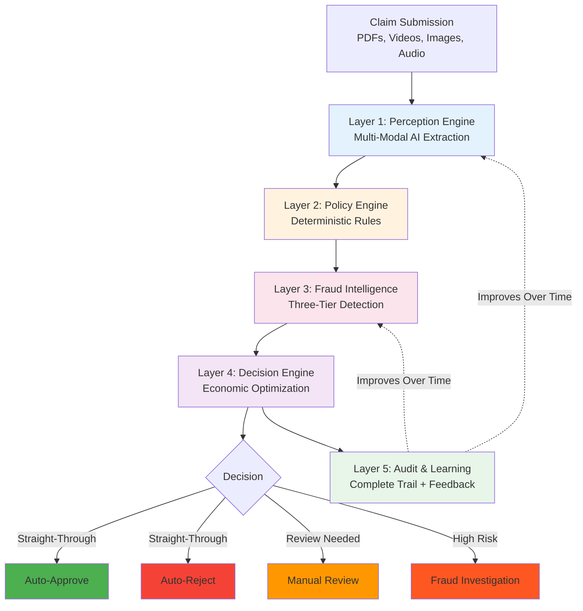

---

## Layer 1: Perception Engine

**Purpose:** Convert messy real-world documents into validated structured data.

**How It Works:**

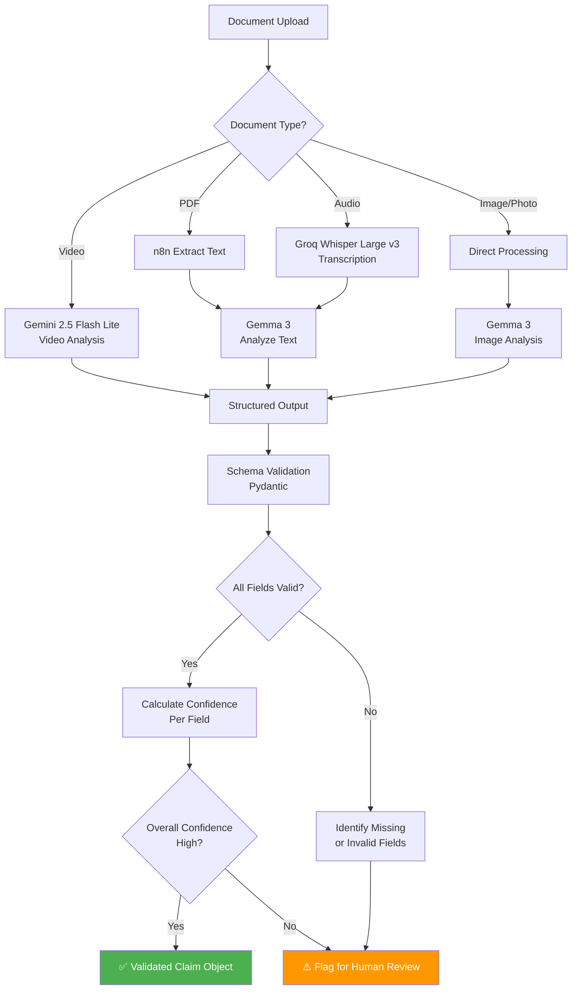

**Key Design Principles:**

- **Multi-Modal Processing:** Handles PDFs (text extraction), images (visual analysis), videos (Gemini 2.5 Flash Lite), and audio (Groq Whisper transcription)
- **Intelligent Analysis:** Gemma 3 analyzes extracted content to generate structured data
- **Schema Validation:** Strict type checking prevents invalid data from entering the system
- **Confidence Thresholding:** High-confidence extractions proceed automatically, low-confidence gets human review
- **n8n Integration:** Automated workflow orchestration for file routing and processing

**Output:** Clean structured data with field-level confidence metadata

**Why This Works:**
- AI handles what it's good at: understanding unstructured multi-modal data (PDFs, videos, images, audio)
- n8n orchestrates complex file processing workflows efficiently
- Strict schemas prevent garbage-in-garbage-out
- Confidence scoring enables smart routing (high confidence → automation, low → human review)
- No AI decision-making yet - just data extraction and analysis

---

## Layer 2: Policy Governance Engine

**Purpose:** Apply insurance policy rules with zero ambiguity and complete auditability.

**Critical Design Decision:** Human-authored rules, NOT AI-generated code.

**Why NOT AI-Generated Code:**
- Insurance policies have legal nuances requiring human interpretation
- LLM-generated code creates legal liability if it misinterprets coverage
- Regulatory compliance requires human approval of adjudication logic

**How It Works:**

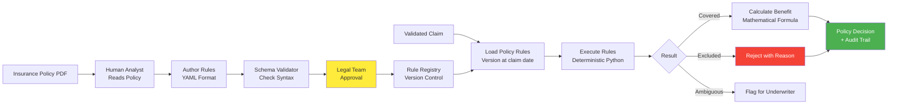

**Rule Structure:**

Policy rules are defined in structured format containing:
- Policy identification and version information
- Coverage categories with limits and conditions
- Copay percentages and waiting periods
- Exclusions for each category
- Validation rules for claim eligibility
- Legal approval metadata

Each rule set is version-controlled and tied to effective dates, ensuring claims are adjudicated using the correct policy version at the time of the incident.

**Rule Execution Logic:**

The system applies rules in a deterministic sequence:
1. Verify claim category is covered by the policy
2. Check temporal validity (claim date within policy period, waiting periods met)
3. Validate against annual or per-incident limits
4. Apply copay percentages and calculate benefit amounts
5. Check for exclusions that would disqualify the claim
6. Return decision with mathematical justification

Every calculation is reproducible using the same inputs and policy version.

**Why This Works:**
- Every decision is mathematically reproducible
- Human-approved rules = legal defensibility
- Version control = audit compliance
- No LLM hallucination risk in decision-making
- Clear separation: AI extracts data, Code applies rules

---

## Layer 3: Three-Tier Fraud Intelligence

**Purpose:** Detect fraud at multiple sophistication levels - from simple duplicates to organized crime rings.

**The Innovation:** Cascading detection that catches what single-claim analysis misses.

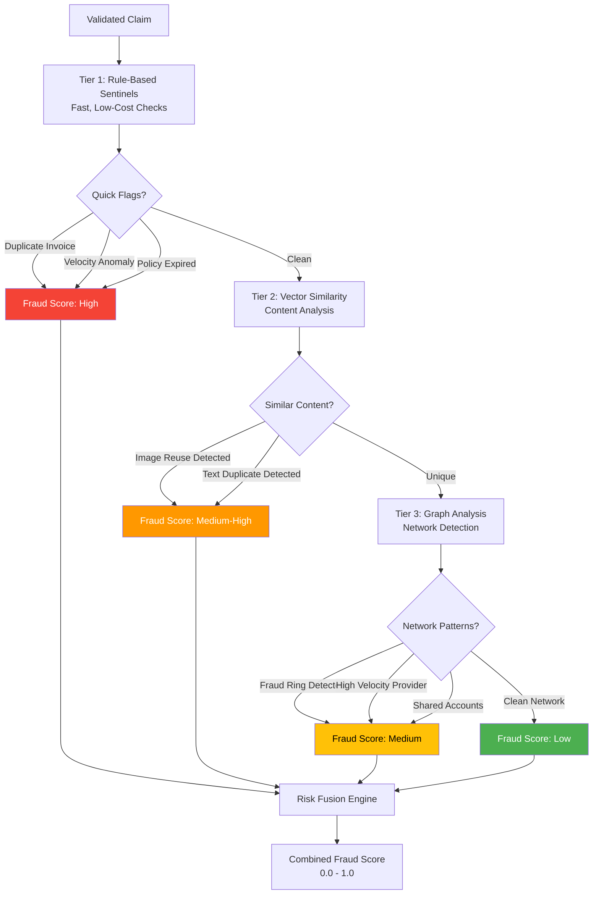

### Tier 1: Rule-Based Sentinels

**Fast, cheap, high-precision checks:**

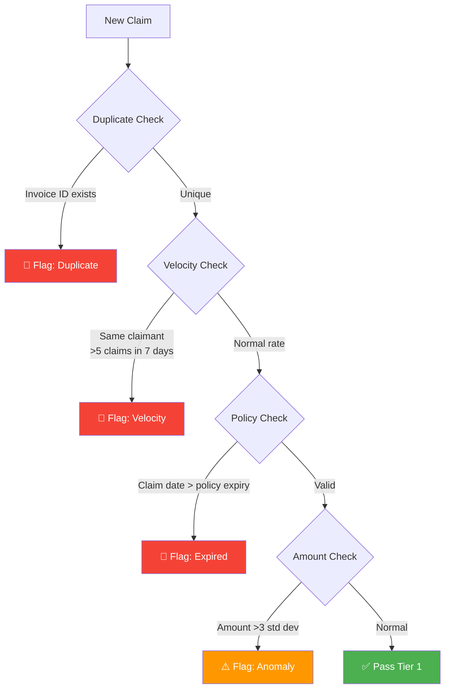

**Why This Matters:** Provides fast initial screening with high precision and minimal computational cost.

---

### Tier 2: Vector Similarity Detection

**Purpose:** Detect reused images, duplicate narratives, template-based fraud.

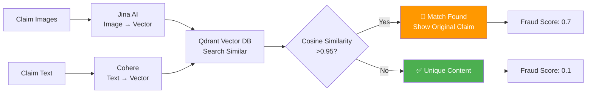

**What It Catches:**
- Same accident photo submitted by different claimants
- Same hospital bill with altered dates/names
- Copy-pasted incident descriptions
- Template-based fraud (fraudsters reusing forms)

**Technical Approach:**
- Image embeddings via Jina AI API encode visual content into vector representations
- Text embeddings via Cohere API convert narrative descriptions into semantic vectors
- Vector database enables fast similarity search across historical claims
- High similarity scores (above threshold) indicate potential content reuse

**What It Catches:**
- Reused accident photos across different claims
- Duplicate hospital bills with altered details
- Copy-pasted incident descriptions
- Template-based fraud patterns

---

### Tier 3: Graph Network Intelligence

**Purpose:** Detect organized fraud rings that span multiple claims and entities.

**The Problem with Traditional Systems:**
Single-claim analysis misses patterns like:
- Multiple claimants sharing phone numbers
- One provider linked to dozens of suspicious claims
- Circular payment patterns (money laundering)

**Our Solution:** Build a knowledge graph that reveals hidden connections.

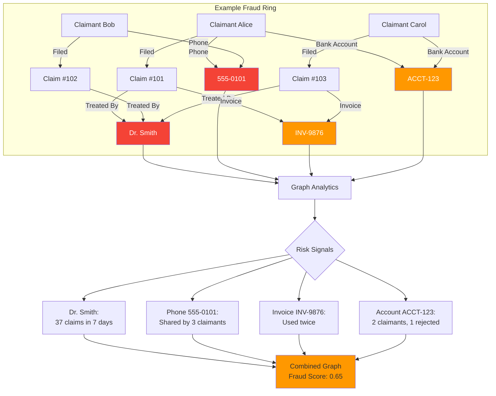

**Graph Structure:**

The knowledge graph models relationships between:
- **Claims:** Individual claim records
- **People:** Claimants and policyholders
- **Providers:** Medical facilities, repair shops, etc.
- **Contact Information:** Phone numbers, emails
- **Financial Data:** Bank accounts, invoice numbers
- **Devices:** IP addresses, device fingerprints

**Relationships tracked:**
- Who filed which claims
- Which provider treated which claims
- Shared contact information between claimants
- Shared financial accounts
- Document references across claims

**Detection Patterns:**

The graph analytics identifies suspicious patterns such as:
- **High-velocity providers:** Single provider linked to unusually high number of recent claims
- **Shared contact networks:** Multiple claimants using the same phone numbers or emails
- **Circular banking:** Multiple people sharing the same financial accounts
- **Invoice reuse:** Same invoice numbers appearing across different claims
- **Device clustering:** Multiple claims submitted from identical devices

**Risk Scoring Approach:**

Graph risk scores combine multiple factors:
- Network centrality (how connected is this entity?)
- Cluster density (how tightly grouped are related claims?)
- Velocity patterns (how quickly are claims appearing?)
- Historical rejection rates (past fraud history)

Risk levels are categorized as high, medium, or low based on combined score thresholds.

**Why This Is Powerful:**
- Single-claim analysis misses organized fraud entirely
- Graph-based detection reveals hidden connections across the network
- Enables proactive detection of fraud rings before they cause extensive damage

---

### Risk Fusion: Combining All Signals

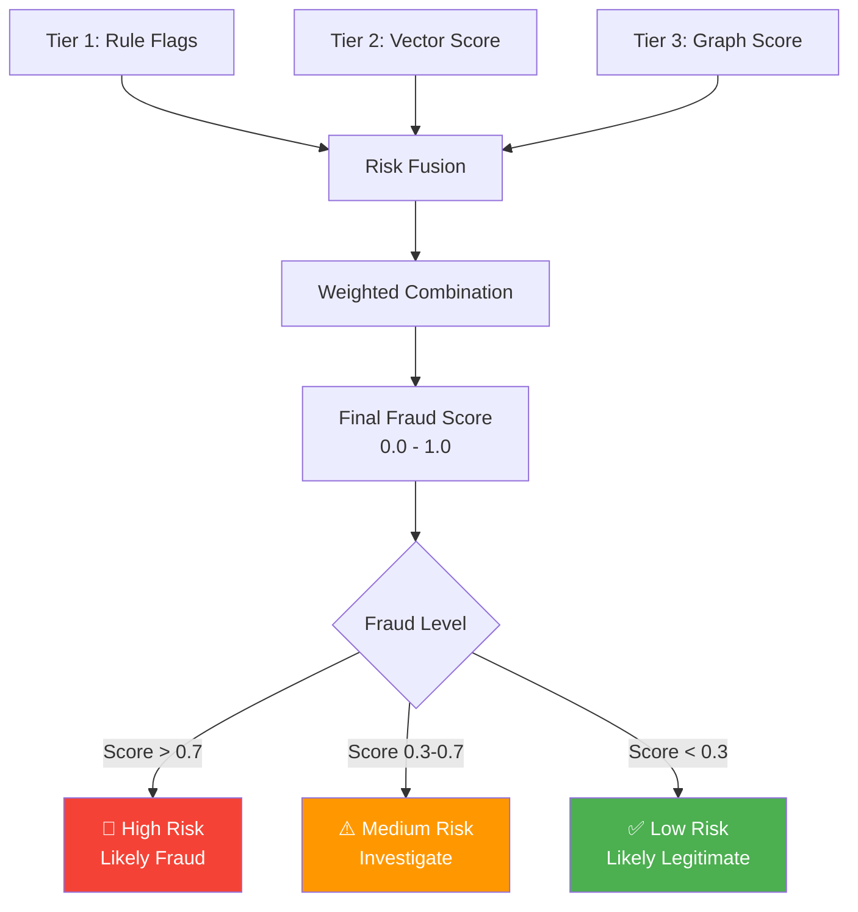

**Score Combination:**

The final fraud score combines signals from all three tiers with weighted importance:
- Tier 1 rule-based flags contribute to the score (high precision, limited scope)
- Tier 2 similarity detection provides content-based signals
- Tier 3 graph analysis receives highest weight (catches sophisticated organized fraud)

This multi-tier approach ensures both simple and complex fraud patterns are properly weighted in the final risk assessment.

---

## Layer 4: Economic Decision Engine

**Purpose:** Make financially optimal routing decisions, not arbitrary threshold-based ones.

**The Innovation:** Only involve humans when the expected loss justifies the investigation cost.

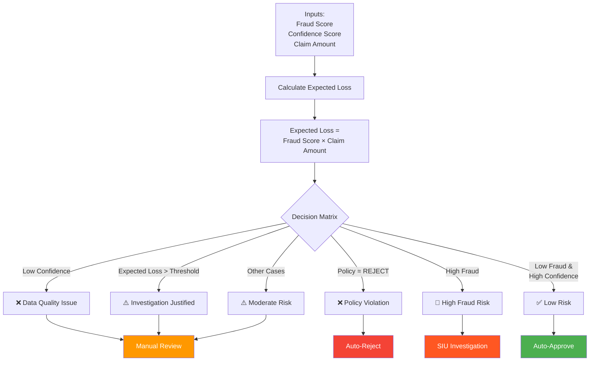

**Economic Logic:**

The system calculates expected loss and compares it to investigation cost:

**Expected Loss** = `fraud_probability` × `claim_amount`

**Decision Rule:**
- If `expected_loss` > `investigation_cost`: Route to human review (economically justified)
- If `expected_loss < investigation_cost`: Auto-process (risk acceptable)

This ensures resources are allocated optimally - only involving human reviewers when the potential fraud loss justifies the cost of investigation.

**Complete Decision Logic:**

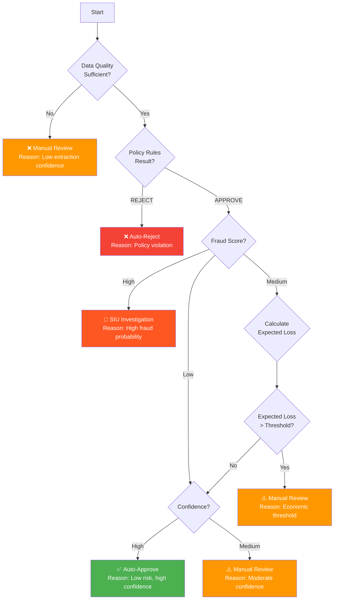

---

## Layer 5: Audit & Active Learning

**Purpose:** Complete regulatory compliance + continuous system improvement.

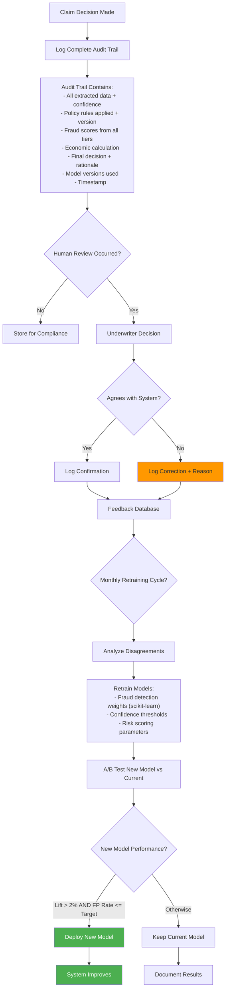

**Audit Trail Structure:**

Each claim decision includes comprehensive logging:
- Claim identification and processing timestamp
- Layer 1: All extracted data with field-level confidence scores
- Layer 2: Policy version applied, rules executed, coverage calculations
- Layer 3: Fraud analysis results from all three tiers, combined risk score
- Layer 4: Economic calculation, decision rationale, routing outcome
- Layer 5: Human feedback (if applicable)
- Model versions used throughout the process

This complete trail enables regulatory compliance and performance analysis.

**Why This Matters:**
- **Compliance:** Every decision is reproducible and explainable
- **Learning:** System improves from real-world feedback
- **Trust:** Underwriters see the logic, not a black box
- **Accountability:** Complete chain of reasoning for every claim

---

## Why This Solution Works

### 1. Neuro-Symbolic Architecture

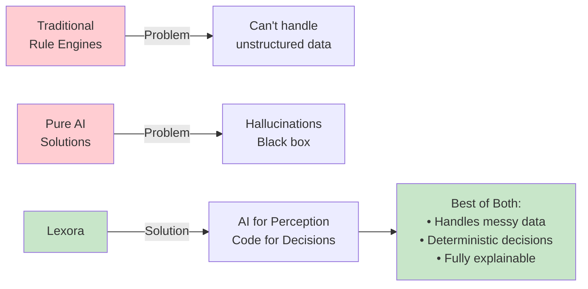

**What Makes It Unique:**
- **Layer 1 (AI):** Extracts data from chaos - what AI excels at
- **Layer 2 (Code):** Applies rules with certainty - what code excels at
- **Layer 3 (Hybrid):** Smart fraud detection using multiple techniques
- **Layer 4 (Logic):** Economic optimization - pure mathematics
- **Layer 5 (Learning):** Continuous improvement with human feedback

**No other solution combines these correctly.**

---

### 2. Three-Tier Fraud Detection

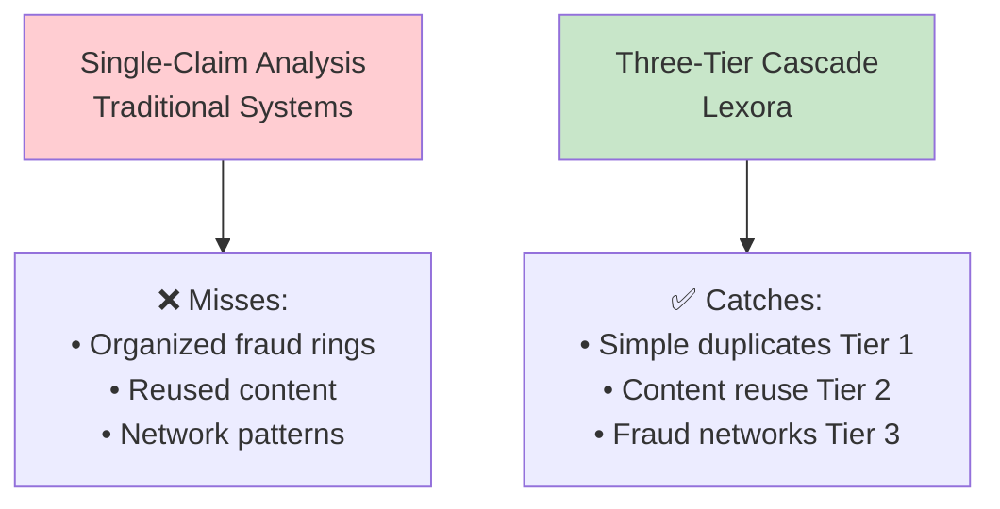

**Competitive Moat:** Graph-based fraud detection is sophisticated and data-intensive - high barrier to entry.

---

### 3. Economic Optimization

**Traditional Approach:** Fixed thresholds (e.g., "if fraud score exceeds X, review manually")

❌ Problem: Ignores the cost-benefit analysis

**Our Approach:** Expected value calculation - only route to human review when (`fraud_probability` × `claim_amount`) exceeds investigation cost

✅ Result: Fewer unnecessary reviews, optimized resource allocation, faster customer experience

---

### 4. Built-In Learning Loop

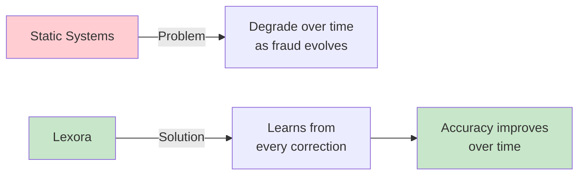

---

## Technical Feasibility

### Technology Stack

| Layer | Technology | Maturity | Risk |
|-------|-----------|----------|------|
| File Processing | n8n | Production | ✅ Low |
| PDF Extraction | n8n built-in | Battle-tested | ✅ Low |
| Video Analysis | Gemini 2.5 Flash Lite | Production | ✅ Low |
| Audio Transcription | Groq Whisper Large v3 | Production | ✅ Low |
| Content Analysis | Gemma 3 | Production | ✅ Low |
| Text Embeddings | Cohere API | Production | ✅ Low |
| Image Embeddings | Jina AI API | Production | ✅ Low |
| Validation | Pydantic | Battle-tested | ✅ Low |
| Policy Engine | Python + YAML | Proven | ✅ Low |
| Vector Search | Qdrant | Production | ✅ Low |
| Graph DB | Neo4j | Industry standard | ⚠️ Medium |
| Backend | FastAPI + Celery | Proven | ✅ Low |
| Frontend | Next.js + TypeScript | Proven | ✅ Low |

**Overall Risk: LOW** - No experimental technologies, everything is production-proven.

---

### Data Flow

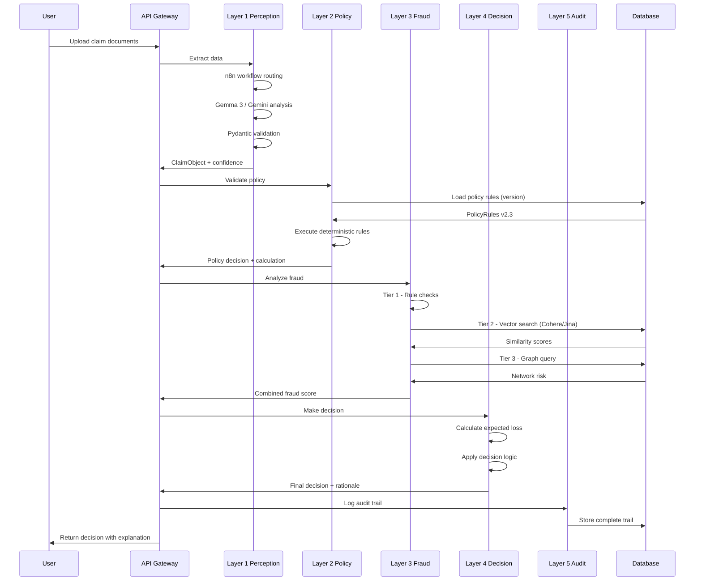

---

## The Complete Picture

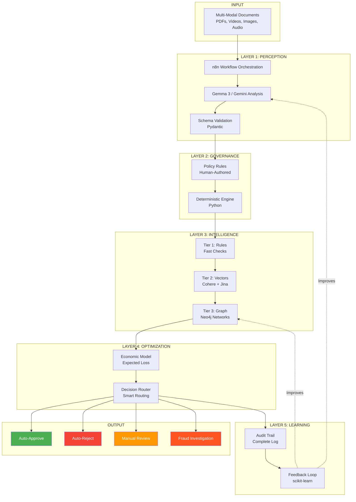

---

## Summary

**Lexora solves intelligent claims processing through:**

1. **Neuro-Symbolic Architecture** - AI for perception, code for decisions
2. **Three-Tier Fraud Detection** - Catches simple duplicates to organized crime rings
3. **Economic Optimization** - Smart routing based on cost-benefit analysis
4. **Active Learning** - Improves continuously from human feedback
5. **Complete Auditability** - Every decision is explainable and reproducible

**What Makes It Win:**
- Most sophisticated fraud detection (three-tier cascade)
- Only true neuro-symbolic solution (best of AI + code)
- Production-ready technology stack  
- Clear competitive moat (graph intelligence)
- Enables significant automation while maintaining full explainability